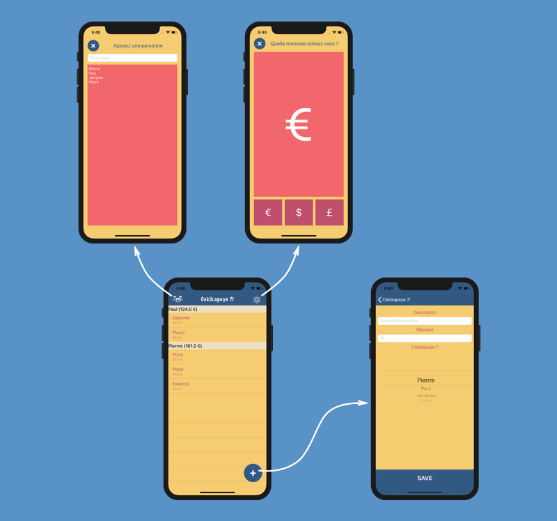
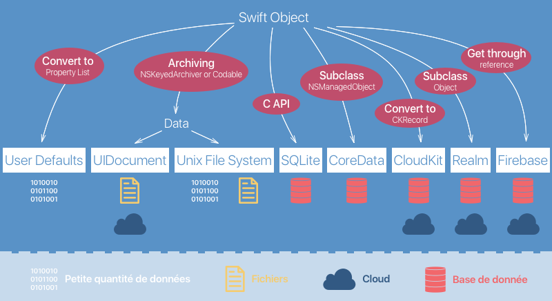
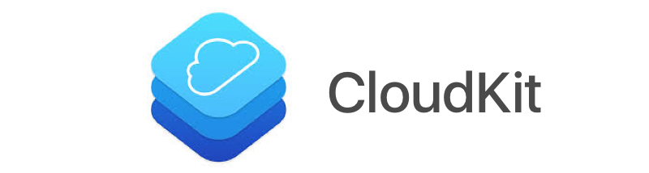
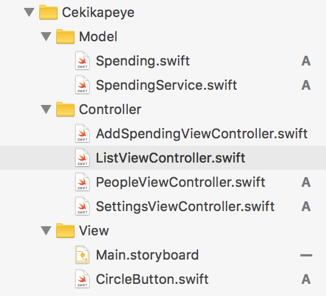
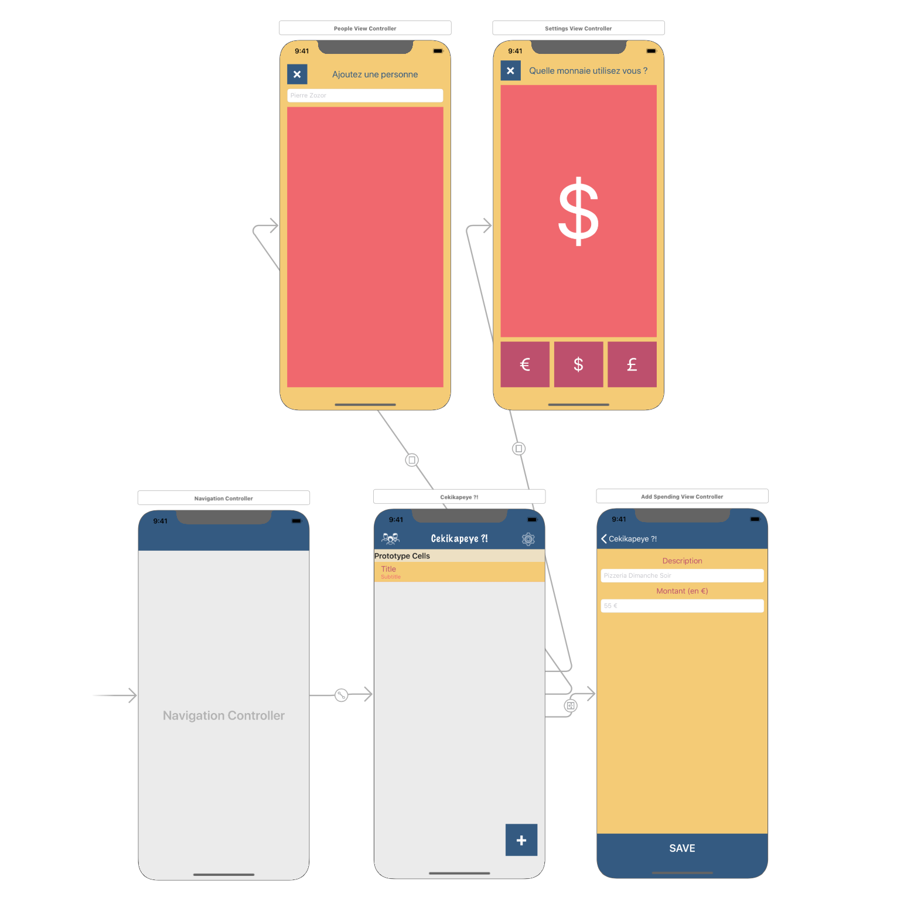
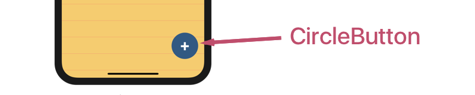

# Faites persister vos données dans votre application iOS

## Sautez dans la persistance des données

### Tirez le meilleur de ce cours
Bonjour et bienvenue dans ce cours sur la persistance des données ! Avec ce cours, vous allez cesser de perdre toutes vos données entre deux fermetures de votre application !


Eh oui ! Et vous allez vite voir à quel point c'est incontournable !

#### Prérequis

Ce cours fait partie de tout [un parcours sur le développement d'application iOS](https://openclassrooms.com/paths/developpeur-se-dapplication-ios). Je vous suggère fortement d'y jeter un oeil si vous souhaitez vous former et trouver un emploi en tant que développeur iOS.

> **:warning:** Pour profiter au mieux de ce cours, assurez-vous que vous maîtrisez a minima les compétences présentées dans les cours suivants :
> 
> - [Introduction à iOS : plongez dans le développement mobile !](https://openclassrooms.com/courses/introduction-a-ios-plongez-dans-le-developpement-mobile)
> - [Apprenez les fondamentaux de Swift](https://openclassrooms.com/courses/apprenez-les-fondamentaux-de-swift)
> - [Approfondissez Swift avec la Programmation Orientée Objet](https://openclassrooms.com/courses/approfondissez-swift-avec-la-programmation-orientee-objet)
> - [Développez une application iPhone avec le modèle MVC](https://openclassrooms.com/courses/concevez-une-application-iphone-avec-le-modele-mvc)
> - [Ajoutez plusieurs pages à votre application](https://openclassrooms.com/courses/ajoutez-plusieurs-pages-a-votre-application-ios)
> - [Ajoutez des listes dans vos applications iOS](https://openclassrooms.com/courses/creez-des-listes-dans-vos-applications-ios)

#### Démo

On ne perd pas nos bonnes habitudes et on va s'appuyer sur une démo pour découvrir la persistance. La démo de ce cours est une application que j'ai nommée sobrement **Cékikapeye**. 

Le but de cette application - les plus rapides d'entre vous l'auront deviné - est de **garder une trace des dépenses de chacun** dès que de l'argent est en jeu dans un groupe, lors de vacances entre amis par exemple.

Voici à quoi ressemble l'application :



L'application est donc composée de 4 interfaces :

- `List` : C'est l'interface principale qui affiche les différentes dépenses de chaque participant.
- `AddSpending` : Cette interface permet de rajouter un élément dans la liste.
- `AddPerson` : Cette interface permet de rajouter un participant.
- `Settings` : Cette interface permet de choisir la monnaie que l'on souhaite utiliser dans l'application.

Pour vous éviter un travail préliminaire un peu long, je vous ai concocté un projet de démarrage que je vous invite à télécharger [ici](https://s3-eu-west-1.amazonaws.com/static.oc-static.com/prod/courses/files/Parcours+DA+iOS/Cours+10+-+Persistance/Cekikapeye+-+Start.zip).

> **:information_source:** Évidemment, je vous incite à essayer de reproduire cette application par vous même en vous appuyant sur le projet ci besoin ! C'est une bonne occasion de mettre en application ce que vous avez vu sur la navigation, les formulaires et les Table View.

Notre objectif va être de **rendre persistant le choix de la monnaie dans les réglages et bien sûr les dépenses de chaque participant**. On risque en effet de frustrer quelques utilisateurs si on perd ces données entre chaque ouverture de l'application.

#### Plan du cours

Pour mener à bien notre mission, nous allons suivre le plan suivant :

1. Dans cette première partie, je vais vous présenter **le large éventail d'outil que nous propose iOS pour faire persister nos données**. Nous allons nous concentrer sur deux d'entre eux dans ce cours User Defaults et Core Data. Par ailleurs, nous allons faire un tour du code de la démo pour que vous ne soyez pas perdus.
2. Nous allons utiliser ensuite les **User Defaults** pour sauvegarder les réglages de l'utilisateur.
3. Nous allons découvrir la base de donnée **Core Data** pour sauvegarder les différents participants.
4. Nous allons grimper en complexité en gérant **les relations avec Core Data** dans le but de sauvegarder les dépenses dans l'application.

Bref, on a donc du pain sur la planche ! Alors, allons-y !

### Découvrez la persistance des données
Avant de nous jeter à l'eau, je vous propose de prendre cinq petites minutes pour prendre du recul sur la persistance des données !


Oui je sais, votre clavier vous démange, mais le sujet de la persistance est trop important et trop vaste pour se passer d'une vue d'ensemble du sujet.

#### La persistance, c'est quoi ?
Dans les applications que vous avez déjà développées, vous vous êtes sans doute déjà frotté au problème suivant : si vous sauvegardez des données dans votre modèle par exemple ou dans une variable de votre contrôleur, **ces données sont perdues dès que vous fermez l'application.**

La raison, c'est que lorsque l'application est supprimée, le processeur est libéré de toute activité liée à cette application et donc toutes les données en mémoire sont supprimées.

> **:information_source:** Ici, il faut faire la différence entre la mémoire du processeur qui retient les données temporairement (mémoire vive) et le stockage sur le long terme (disque dur). Ici je parlais bien sûr de la mémoire vive.

**La persistance désigne l'ensemble des techniques qui permettent de stocker des données sur votre iPhone.** Grâce à la persistance, les données peuvent rester stockées tant que l'application est installée sur le téléphone.

> **:information_source:** Techniquement, **la persistance permet d'enregistrer les informations sur le disque dur de votre iPhone** et non dans la mémoire du processeur.

#### Vue d'ensemble de la persistance

La persistance c'est donc un ensemble de techniques. Alors je vous propose qu'on voie ce qu'elles sont !

Le schéma suivant résume la grande majorité des techniques de persistance utilisées en iOS. 

> **:information_source:** Il est peu probable que vous ayez à faire à d'autres techniques.



Ce schéma présente dans les carrés blancs les différentes techniques de persistance. La légende indique le(s) type(s) de chaque technique. Enfin, ce schéma illustre les mécanismes employés pour passer d'un objet Swift (une classe ou une structure) au format de donnée utilisé dans chaque cas.

Je vous propose de vous exposer rapidement chacune de ses techniques.

##### User Defaults

**Les User Defaults sont tout simplement un dictionnaire qui persiste**. C'est donc un outil très simple, mais aussi peu adapté à de grandes quantités de données. En général, on l'utilise pour de petites choses comme les préférences utilisateurs, d'où son nom.

> **:information_source:** Nous allons consacrer la deuxième partie de ce cours à cette technique donc on va avoir l'occasion d'y revenir.

##### Unix File System / UIDocument

**`Unix File System` et `UIDocument` sont deux techniques de persistance qui s'appuie sur des fichiers.**

Tout d'abord, vous allez convertir des objets Swift en type `Data`. Il existe deux mécanismes possibles pour cela :

- `NSKeyedArchiver` : l'ancien mécanisme voué sans doute à disparaître
- Le protocole `Codable` de Swift : Extrêmement puissant et facile à utiliser.

Ensuite les `Data` sont enregistrés dans un fichier. Ce fichier est sauvegardé dans un dossier réservé à votre application. 

> **:information_source:** Cela fonctionne exactement de la même façon que la sauvegarde d'un fichier sur votre ordinateur, car iOS et macOS fonctionnent sous Unix. Vous trouverez un rappel sur Unix [ici](https://openclassrooms.com/courses/reprenez-le-controle-a-l-aide-de-linux).

Si vous utilisez `Unix File System`, le fichier sera sauvegardé et seul un développeur pourra le manipuler. C'est utile pour sauvegarder des données que vous voulez protéger d'une manipulation hasardeuse d'un utilisateur.

À l'inverse, `UIDocument` sauvegarde des fichiers au sens utilisateur. Cela signifie que l'utilisateur pourra ouvrir et accéder à ce fichier comme lorsque vous ouvrez un fichier dans le Finder de votre Mac.

`UIDocument` fonctionne notamment avec l'application Fichiers présente depuis iOS 11 et qui permet à l'utilisateur d'accéder à ses fichiers. Cela vous permet notamment de sauvegarder des fichiers directement sur iCloud Drive, la solution de stockage en ligne d'Apple.  

> **:information_source:** Si vous voulez en savoir plus sur ces technologies, je vous recommande chaudement ces deux vidéos de Stanford :
> 
> - [Théorie](https://www.youtube.com/watch?v=ckCjIJbxYLY&index=15&list=PLPA-ayBrweUzGFmkT_W65z64MoGnKRZMq)
> - [Pratique](https://www.youtube.com/watch?v=gs3kj4XsqdY&list=PLPA-ayBrweUzGFmkT_W65z64MoGnKRZMq&index=16)

##### SQLite / CoreData

Sauvegarder des fichiers, c'est bien. Mais parfois vous avez besoin de la robustesse et des outils que propose une vraie base de données. Et pour cela, vous avez plusieurs options.


La première et la plus basique est l'utilisation d'SQLite. **SQLite est une base de données basée sur SQL, pensée pour le mobile et du coup plus légère**. Via une API en langage C, vous rédigez directement vos requêtes SQL. 

> **:question:** Le langage C ? Mais je fais du Swift moi !

Oui, je C... ça ne fait pas rêver :D ! Et c'est la raison pour laquelle il existe des alternatives.

La plus répandue se nomme Core Data. **C'est une base de donnée SQL avec une API orientée objet**.

En français, cela signifie que vous avez une base de donnée SQL standard (souvent SQLite) que vous ne manipulez pas directement. À la place, vous manipulez directement des objets Swift. Vous travaillez donc en orienté objet et toute la complexité SQL est géré à votre place par le framework.

En plus, comme c'est un framework d'Apple, il s'intègre extrêmement bien avec le reste de l'écosystème que ce soit Xcode, Cocoa Touch ou d'autres frameworks.

> **:information_source:** On va passer les parties 3 et 4 de cours sur cette technologie.

##### CloudKit / Firebase / Realm

Enfin, si vous voulez aller encore plus loin, vous avez les technologies que l'on regroupe sous le nom de **MBAAS** pour **Mobile Back-end As A Service**. Ce sont des **bases de données dans le cloud** qui s'intègre très facilement et qui gère pour vous beaucoup de choses compliquées comme :

- Installer / gérer / mettre à l'échelle un serveur
- Gérer les problèmes de connexions réseau
- Gérer la sécurité de vos appels réseau
- Et un certain nombre d'autres choses.

Il existe de nombreuses solutions sur le marché, mais je vous présente les trois plus populaires.

###### CloudKit



CloudKit est la solution maison d'Apple. Elle est assez facile à mettre en place et comme tout ce que fait Apple, elle est extrêmement bien connectée au reste de l'écosystème Apple. Donc si votre produit se destine exclusivement à des utilisateurs d'iPhone / iPad / Apple TV / Mac et autre Apple Watch, je vous recommande fortement de jeter un oeil à cette technologie.

La contrepartie, c'est que CloudKit n'est pas très adapté au Web ou à Android. C'est faisable, mais ce n'est vraiment pas pratique. Donc si vous faites une application pour iOS et Android, je ne recommande pas CloudKit. 

> **:information_source:** Je vous recommande cette vidéo de Stanford dans lequel il rentre dans le détail de cette technologie :
> 
> - [Théorie](https://youtu.be/_ffOdODpDSk?t=42m8s)
> - [Pratique](https://youtu.be/CIMR916kRU0)


###### Firebase


Firebase est le concurrent de CloudKit chez Google. Cette technologie est extrêmement puissante et je pense qu'elle est d'assez loin la plus répandue des MBAAS. Elle s'adapte très bien à iOS, Android et au web.

> **:information_source:** On a même un [cours sur l'utilisation de Firebase en Android](https://openclassrooms.com/courses/creez-un-backend-scalable-et-performant-sur-firebase).

Firebase est une base de donnée dans le cloud accessible en temps réel. Cela veut dire que vous ne faites plus de requêtes pour récupérer des données. L'application *écoute* la base de données et reçoit les modifications de la base de données dès que celle-ci est modifiée. C'est extrêmement pratique et cela donne une expérience utilisateur de premier plan !

En plus Firebase gère énormément de choses pour vous : l'authentification via différents services comme Facebook ou Google, le mode hors-ligne, les notifications et beaucoup d'autres choses.

Vous vous devez d'y jeter un oeil ;) !

> **:information_source:** Je vous conseille en particulier ce [tutoriel](https://code.tutsplus.com/tutorials/getting-started-with-realm-database-for-ios--cms-29018) pour démarrer.

###### Realm


L'entreprise Realm est spécialisée dans la gestion des données sur mobile. Cette technologie disponible sur Android et iOS permet une gestion très simple des données sur le mobile.

La particularité de Realm est d'être à la fois une solution de base de données en local sur le téléphone et dans le cloud. En effet, vous pouvez souscrire à leur offre de plateforme et avoir un équivalent de Firebase ou alors vous pouvez utiliser leur technologie de base de données open source (donc gratuite !) et utiliser Realm à la place de Core Data pour vos données en local.

Realm est une très bonne alternative à Core Data, à tel point que j'ai hésité à faire ce cours sur Realm plutôt que sur Core Data. Je vous incite du coup fortement à regarder ça de près.

> **:information_source:** Vous pouvez trouver une bonne introduction à Realm [ici](https://www.raywenderlich.com/187417/firebase-tutorial-getting-started-3).

#### Limite de la persistance

Maintenant qu'on a parlé des différentes techniques de persistance et de leurs particularités, je voudrais finir avec une règle très importante de la persistance en iOS :

> **Toutes les données que vous stockez sur l'iPhone restent dans le périmètre de l'application.**

En gros, en iOS, chaque application évolue dans un compartiment unique, séparé des autres. 

> **:information_source:** On parle en anglais de *sandbox* (bac à sable).
 
Donc lorsque vous créez une base de données ou que vous sauvegardez un fichier, vous faites ça dans votre compartiment.

Il n'est pas question d'aller manipuler les données d'une autre application.

Apple a imposé cela pour trois raisons :

1. **Sécurité** : Vous ne voulez pas qu'une application malveillante vienne s'immiscer dans vos données pour les modifier et altérer le fonctionnement de votre app.
2. **Vie Privee** : Les données que vous collectez appartiennent à votre utilisateur et aucune autre application ne doit pouvoir y accéder.
3. **Nettoyage** : Lorsque l'application est supprimée par l'utilisateur, toutes les données qui vont avec peuvent être supprimées aussi d'un seul coup, car elles font partie du même package. Il n'y a pas d'autres données à aller chercher un peu partout dans le téléphone.

Bref, chacun son bac à sable et les données seront bien gardées !

> **:information_source:** Évidemment, je parle ici uniquement des données en local. Les données envoyées vers un serveur ou un cloud quittent par définition le téléphone et donc l'application.  

#### En résumé
- **La persistance désigne l'ensemble des techniques qui permettent de stocker des données sur votre iPhone.** 
- Il existe plusieurs techniques de persistance, vous pouvez retrouver les plus populaires dans le schéma ci-dessous :

- Toutes les données que vous stockez sur l'iPhone restent dans le périmètre de l'application.

Dans le prochain chapitre, nous allons nous plonger dans le code de notre application Cekikapeye !

### Plongez-vous dans le code

Dans ce chapitre, nous allons parler code ! Je sais ça fait du bien. Je vous vois déjà reprendre des couleurs.

Je vous propose qu'on explore rapidement notre projet pour que vous ne soyez pas perdus par la suite !

#### View

Évidemment, l'application est construite selon le modèle MVC :



Et je vous propose de commencer par la vue avec le storyboard.

##### Storyboard



Rien de très particulier ici. On a déjà parlé des 4 interfaces de cette application dans le premier chapitre et vous les retrouvez naturellement dans le storyboard :

- `ListViewController` qui affiche la liste des dépenses.
- `AddSpendingViewController` pour ajouter une dépense.
- `PeopleViewController` pour ajouter un participant.
- `SettingViewController` pour modifier la monnaie utilisée.

> **:information_source:** Il y a bien sûr en plus un Navigation Controller qui gère la navigation.

##### CircleButton

Côté vue, vous avez également une classe `CircleButton` qui permet simplement d'obtenir une forme arrondie pour certains boutons comme le bouton `+` de la page d'accueil.



#### Model

Allons maintenant côté modèle. Il y a deux fichiers. 

##### Spending
Le premier `Spending.swift` contient une structure très simple qui gère les dépenses :

```swift
struct Spending {
    var content: String
    var amount: Double
}
```

> **:information_source:** `content` est une description de la dépense et `amount`, le montant.

##### SpendingService

Ensuite, vous avez `SpendingService.swift` qui est une classe qui utilise le pattern Singleton pour sauvegarder des données dans un tableau `spendings`.

```swift
class SpendingService {
    static var shared = SpendingService()
    private init() {}

    private(set) var spendings = [Spending]()

    func add(spending: Spending) {
        spendings.append(spending)
    }
}
```
> **:information_source:** Pour ceux qui ont suivi [le cours sur les listes en iOS](https://openclassrooms.com/courses/creez-des-listes-dans-vos-applications-ios), c'est exactement la même classe, seuls les noms ont changé. Vous verrez d'autres similitudes dans les contrôleurs. Vous ne devriez pas être perdus.

#### Controller

Il y a bien sûr 4 contrôleurs, un par interface.

##### ListViewController

Ce contrôleur affiche la liste des dépenses récupérée dans le tableau `SpendingService.shared.spendings`. C'est le cas d'école de l'implémentation d'une Table View donc rien à dire là dessus.

> **:information_source:** Besoin d'un rappel sur les Table View, c'est par [là](https://openclassrooms.com/courses/creez-des-listes-dans-vos-applications-ios) !

##### AddSpendingViewController

C'est la classe qui gère l'ajout d'une dépense. Dans cette classe, on récupère simplement les informations des champs de texte lors de l'appui sur le bouton Save et on ajoute une dépense dans le tableau spendings.

Vous avez ensuite deux extensions :

- La première permet de remplir notre PickerView. Pour l'instant, il est caché, mais il servira en partie 3 à sélectionner la personne qui a effectué la dépense.
- La seconde gère la disparition du clavier.

##### PeopleViewController

Cette classe permet d'ajouter des personnes. Dans l'extension, vous avez une méthode qui permet de rajouter une personne lors de l'ajout sur le bouton return du clavier. Cette personne est ajoutée à la suite des éventuelles précédentes dans la Text View. 

> **:warning:** L'implémentation de cette méthode est incomplète pour le moment, car elle ne gère pas la sauvegarde de la personne en base de données. Ce sera l'objet de la partie 3 de ce cours.

##### SettingsViewController

Vous avez une seule méthode intéressante ici qui est appelée lors de l'appui de n'importe lequel des trois boutons du bas : `changeCurrency`. Cette méthode modifie le label qui affiche la monnaie utilisée par l'utilisateur en récupérant cette information sur le texte du bouton tapé.

Vous noterez que cette méthode est incomplète. En effet, l'information du changement de monnaie n'est enregistrée nulle part ! Nous allons corriger ça ensemble dans la prochaine partie !

À tout de suite !