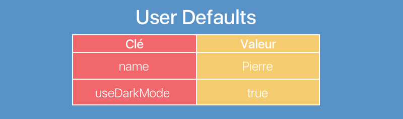

## Sauvegardez les préférences utilisateurs

### Découvrez User Defaults
C'est parti ! Nous allons nous lancer concrètement dans la persistance des données. La première technique que nous allons voir ensemble s'appelle **User Defaults**. Et vous allez voir que c'est très simple !

Dans cette partie, nous allons utiliser User Defaults pour retenir la monnaie qu'aura choisie notre utilisateur !

Let's go !

#### Présentation de User Defaults

La définition la plus simple des User Defaults est :

> **Un dictionnaire qui persiste.**

Vous allez voir que les User Defaults fonctionnent exactement comme un dictionnaire. Vous définissez des clefs de type String et vous pouvez y stocker des valeurs. Pour récupérer la valeur, vous utilisez la clef.

Imaginons que vous vouliez stocker le nom de votre utilisateur. Vous allez créer une clé `name` dans laquelle vous allez stocker son nom. 

Prenons un autre exemple, imaginons que votre application a un mode sombre. Si votre utilisateur préfère le mode sombre, vous allez stocker cette information avec une clef `useDarkMode`.



#### Property List

Comme vous pouvez le voir dans les exemples que j'ai utilisés précédemment, vous pouvez stocker des types différents dans les User Defaults.

C'est un peu comme si User Defaults était un dictionnaire de type `[String: Any]`. Seulement ce n'est pas tout à fait vrai.

Dans les User Defaults, vous ne pouvez stocker que des données de type Property List. 

> **:question:** C'est quoi une donnée de type Property List ?

C'est n'importe quelle combinaison des types suivants :

- `Array`
- `Dictionnary` 
- `String`
- `Date`
- `Data`
- Nombre (`Int`, `Double`, `Float`) 

Cela veut dire que vous pouvez stocker des entiers, tableaux, chaînes de caractères, etc. dans les User Defaults. Mais aussi n'importe quelle combinaison de ces types.

Par exemple, tous les types suivants peuvent être sauvegardés dans les User Defaults :

```swift
String
[Int]
Date
[String: Data]
[[String: [[Int: Data]]]]
```

> **:information_source:** J'offre [une image](https://source.unsplash.com/random) à celui/celle qui peut lire le dernier type. Si, il est valide. :D

C'est donc suffisamment flexible pour stocker tout un tas de données ! Mais en revanche, si vous avez créé un type comme notre structure `Spending`, vous ne pouvez pas la stocker telle qu'elle dans les User Defaults. 

> **:information_source:** En général, on créé un dictionnaire avec les données de l'objet. Par exemple, pour `Spending`, on utiliserait un dictionnaire comme ceci :
> 
> ```swift
> var spendingDict: [String: Any] = ["content": "Pizzeria", "amount": 12]
> ```

À cause de cette contrainte et de la petite étendue des capacités de cette technologie, **on utilise les User Defaults généralement pour sauvegarder des données très simples comme les préférences d'un utilisateur.**

> **:warning:** On n'utilisera jamais User Defaults pour des données plus riches comme, par exemple, le contenu d'une Table View.
 
#### L'API

Même s'il y a quelques variantes, User Defaults a deux méthodes très simples pour lire/écrire des données :

```swift
// Ecrire des données
func set(Any?, forKey: String)      // Any doit être une Property List, sinon crash.

// Lire des données
func object(forKey: String) -> Any? // Any est forcément une Property List.
```

Et voilà vous savez tout sur les User Defaults ! Je vous avais dit que c'était vraiment très simple !

#### En résumé
- User Defaults est **un dictionnaire qui persiste**.
- On peut uniquement sauvegarder dans User Defaults des données de type Property List.
- On utilise principalement deux méthodes `set(Any?, forKey: String)` et `object(forKey: String) -> Any?` pour lire et écrire des données.

Dans le prochain chapitre, nous allons utiliser User Defaults pour sauvegarder la monnaie choisie par l'utilisateur !

### Implémentez User Defaults
Maintenant que vous savez tout sur les User Defaults, on va jouer un peu avec ! Dans ce chapitre, on va sauvegarder la monnaie sélectionnée par l'utilisateur dans les User Defaults et ensuite la récupérer pour l'afficher.

#### Une instance de User Defaults
La sauvegarde va avoir lieu dès qu'on modifie la monnaie et cela a lieu dans `SettingsViewController` avec la méthode `changeCurrency` :

```swift
@IBAction func changeCurrency(_ sender: UIButton) {
    guard let currency = sender.titleLabel?.text else { return }
    currencyLabel.text = currency

    // TODO: Save currency
}
```

Et comme vous pouvez le voir, cette méthode est incomplète. Ce ne sera plus le cas dans quelques minutes !

User Defaults est une classe : `UserDefaults`. Pour l'utiliser, il nous faut une instance. Vous pouvez créer une instance de `UserDefaults,` mais, en pratique, vous utiliserez presque toujours `standard` : une propriété statique de `UserDefaults` de type `UserDefaults`. Donc toutes vos manipulations de UserDefaults vont commencer comme ceci :

```swift
UserDefaults.standard
```

#### Sauvegarde

Maintenant qu'on a une instance, on va pouvoir utiliser les méthodes que nous avons vues ensemble dans le chapitre précédent. Pour sauvegarder notre monnaie, nous allons utiliser la méthode `set(Any?, forKey: String)` comme ceci :

```swift
UserDefaults.standard.set(currency, forKey: "currency")
``` 

Je sauvegarde mon objet `currency` avec la clé *currency*. J'utiliserais cette clé ensuite pour récupérer mon objet.

> **:warning:** Je peux sauvegarder `currency` dans les User Defaults, car il est de type `String`. C'est donc bien une Property List.

#### Synchronisation

Une fois qu'on a fait ça, on n'a pas tout à fait sauvegardé notre donnée dans les User Defaults. En fait, la modification n'est que temporaire. 

Pour des raisons de performance, les User Defaults sont sauvegardés automatiquement à intervalle régulier. Donc la sauvegarde effective aura lieu lors de la prochaine sauvegarde automatique.

> **:question:** Bon bah super ! On n'a rien à faire. Il suffit d'attendre.

En effet, on peut faire ça. Mais parfois, pour éviter des problèmes, notamment lorsqu'on debug, on peut vouloir forcer la sauvegarde. On peut faire cela en utilisant la méthode `synchronize` :

```swift
UserDefaults.standard.synchronize()
```

Cette fois-ci, on est certain que les données sont bien sauvegardées dans les User Defaults.

> **:information_source:** La sauvegarde automatique coûte moins cher en performance que l'appel de la méthode `synchronize`. Mais tant que `synchronize` n'est pas appelé 10 fois par secondes, ça impactera très peu vos performances.

Voilà ce que donne le code complet de notre méthode `changeCurrency` :

```swift
@IBAction func changeCurrency(_ sender: UIButton) {
    guard let currency = sender.titleLabel?.text else { return }
    currencyLabel.text = currency

    UserDefaults.standard.set(currency, forKey: "currency")
    UserDefaults.standard.synchronize()
}
``` 

#### Récupération de l'objet

Nous avons sauvegardé la monnaie préférée de notre utilisateur ! Mais pour l'instant, on n'en fait rien. Nous allons récupérer cette information pour l'afficher à deux endroits :

1. Dans le label de l'interface de `SettingsViewController`, pour que lorsque cette interface apparaît, elle affiche directement la monnaie sélectionnée.
2. Dans la liste des dépenses (`ListViewController`), pour que le montant de chaque dépense s'affiche dans la bonne monnaie.

##### SettingsViewController
On va récupérer la monnaie depuis les User Defaults au chargement de la vue donc dans la méthode `viewDidLoad`. Pour cela, on va utiliser la méthode dont on a parlé au chapitre précédent `object(forKey: String) -> Any?` :

```swift
override func viewDidLoad() {
    super.viewDidLoad()
    let currency = UserDefaults.standard.object(forKey: "currency") as? String
    currencyLabel.text = currency
}
```

Je récupère mon objet en utilisant ma clé *currency* définie précédemment. Comme la méthode `object(forKey:)` renvoie un type `Any?`, je contrôle son type pour m'assurer qu'il s'agit bien d'un `String`.

Ensuite, je mets à jour mon label avec la monnaie récupérée.

##### ListViewController
On va faire la même chose dans notre liste de dépense en mettant à jour la méthode suivante :

```swift
func tableView(_ tableView: UITableView, cellForRowAt indexPath: IndexPath) -> UITableViewCell {
    let cell = tableView.dequeueReusableCell(withIdentifier: "SpendingCell", for: indexPath)

    let spending = SpendingService.shared.spendings[indexPath.row]
    cell.textLabel?.text = spending.content
    cell.detailTextLabel?.text = "\(spending.amount) €" // Ici, on va changer la monnaie.

    return cell
}
```

Cette fois-ci, on va utiliser une des variantes de `object(forkey:)` : `string(forkey:)`. Cette version fonctionne exactement de la même manière, mais à l'avantage de renvoyer directement un objet de type `String?`. Cela nous évite de faire le contrôle de type.

> **:information_source:** De la même manière, il existe d'autres variantes :
> 
> ```swift
> func int(forkey: String) -> Int?
> func float(forkey: String) -> Float?
> func double(forkey: String) -> Double?
> func bool(forkey: String) -> Bool?
> func data(forkey: String) -> Data?
> // etc.
> ``` 

Voilà ce que ça donne :

```swift
let currency = UserDefaults.standard.string(forKey: "currency") ?? "€"
cell.detailTextLabel?.text = "\(spending.amount) \(currency)"
```

> **:information_source:** Vous êtes peut-être un peu perturbé par l'opérateur `??`. C'est l'opérateur défaut. Il permet simplement de déballer un optionnel en lui donnant une valeur par défaut. Autrement dit, ici, si notre fonction renvoie `nil`, la variable `currency` vaudra `"€"`, sinon elle prendra la valeur renvoyée par la fonction. 
> 
> Si vous préférez une explication par le code, la voici :
>
> ```swift
> let truc = a ?? b
> 
> // équivaut à :
> 
> let truc = a != nil ? a! : b
> 
> // équivaut à :
> 
> var truc: Type
> if a != nil { truc = a! }
> else { truc = b }
> ``` 

Et voilà ! Vous pouvez tester ! Désormais, la monnaie choisie par l'utilisateur est présente partout dans l'application.

#### En résumé
- On utilise la plupart du temps l'instance `standard` de la classe `UserDefaults`.
- La sauvegarde des User Defaults a lieu automatiquement à intervalle régulier, mais on peut la forcer avec la méthode `synchronize`. 
- Il existe plusieurs variantes de `object(forKey:)` qui permettent d'éviter le contrôle de type.

Dans le prochain chapitre, nous allons refactoriser notre code parce que, je ne sais pas pour vous, mais moi il y a un ou deux trucs qui me brûlent les yeux !

### Refactorisez votre code
Normalement, vous devez vous sentir mal à l'aise. Votre code ne vous inspire pas confiance, mais vous ne savez pas trop pourquoi. Je vais vous aider. On a commis deux crimes majeurs :

1. On a du code dupliqué entre les classes `ListViewController` et `SettingsViewController`.
2. Surtout, on gère la sauvegarde/récupération de nos données directement dans le contrôleur. Or **la gestion des données, c'est côté modèle** !

> **:warning:** La persistance des données en particulier, c'est le boulot du modèle. Donc tout le contenu de ce cours doit avoir lieu dans le modèle.

Bien. Maintenant que c'est dit, ne paniquons pas ! On va simplement refactoriser.

#### Une nouvelle classe dans le modèle
Comme tout ça doit avoir lieu dans le modèle. On va créer un nouveau fichier `SettingsService.swift` côté modèle qui va contenir une classe du même nom :

```swift
// SettingService.swift

class SettingsService {
}
```

Le rôle de cette classe va être de nous permettre de sauvegarder/récupérer notre monnaie depuis les User Defaults. Pour cela, nous allons créer une propriété statique calculée `currency` :

```swift
class SettingService {
    static var currency: String {
        get {
        }
        set {
        }
    }
}
```
Nous allons maintenant modifier le getter et le setter. Le getter va nous permettre de récupérer notre monnaie depuis les User Defaults. Et le setter va nous permettre de la sauvegarder :

```swift
static var currency: String {
    get {
        return UserDefaults.standard.string(forKey: "currency") ?? "€"
    }
    set {
        UserDefaults.standard.set(newValue, forKey: "currency")
        UserDefaults.standard.synchronize()
    }
}
```

Et voilà ! Maintenant, on a une propriété `currency` très simple à utiliser et qui fait pour nous tout le travail de sauvegarder/récupérer notre donnée depuis les User Defaults.

> **:information_source:** Cette façon de faire est assez répandue. Il y a d'autres moyens de gérer proprement les User Defaults qui peuvent être plus avancés. Je vous suggère par exemple de jeter un oeil à ce [projet open source](https://github.com/radex/SwiftyUserDefaults).

Malgré l'élégance de notre code, nous répétons encore un élément : notre clé *currency*. Je vous propose du coup qu'on factorise encore cela avec une structure `Keys` qui pourra contenir toutes les clés dont nous avons besoin :

```swift
class SettingService {
    private struct Keys {
        static let currency = "currency"
    }

    static var currency: String {
        get {
            return UserDefaults.standard.string(forKey: Keys.currency) ?? "€"
        }
        set {
            UserDefaults.standard.set(newValue, forKey: Keys.currency)
            UserDefaults.standard.synchronize()
        }
    }
}
```

Là ça commence à me plaire ! C'est bien beau !

#### On se fait plaisir...

Maintenant, on peut se faire plaisir en utilisant notre classe à la place des différents endroits où on utilisait User Defaults directement dans notre contrôleur :

```swift
// SettingsViewController.swift
class SettingsViewController: UIViewController {
	// (...)

    override func viewDidLoad() {
        super.viewDidLoad()
        currencyLabel.text = SettingsService.currency // <--
    }

    @IBAction func changeCurrency(_ sender: UIButton) {
        guard let currency = sender.titleLabel?.text else { return }
        currencyLabel.text = currency
        SettingsService.currency = currency // <--
    }
}


// ListViewController.swift
class ListViewController: UIViewController { (...) }

extension ListViewController: UITableViewDataSource {
	// (...)

    func tableView(_ tableView: UITableView, cellForRowAt indexPath: IndexPath) -> UITableViewCell {
        let cell = tableView.dequeueReusableCell(withIdentifier: "SpendingCell", for: indexPath)

        let spending = SpendingService.shared.spendings[indexPath.row]
        cell.textLabel?.text = spending.content
        cell.detailTextLabel?.text = "\(spending.amount) \(SettingsService.currency)" // <--

        return cell
    }
}
```

Là normalement, vous devez ressentir des petits papillons dans le ventre où vous n'avez pas de coeur !

#### En résumé
C'est tout pour les User Defaults ! C'est la technique de persistance la plus simple et la plus rapide à mettre en place. Et elle rend bien des services ! Mais elle n'est adaptée qu'à des données très basiques et réduites.

Aussi, si vous voulez mettre en place une stratégie de persistance efficace dans votre application. Il vous faut prendre en main au moins une autre technique. Et c'est ce que nous allons faire dans les deux prochaines parties avec Core Data !
