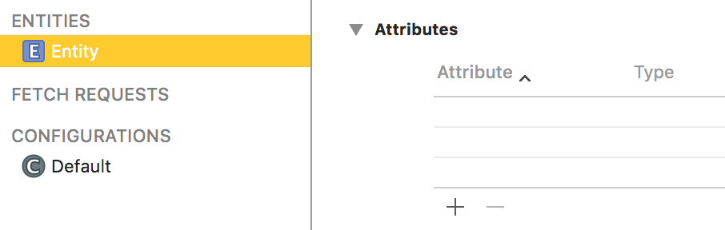
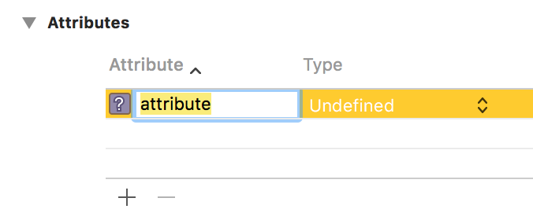
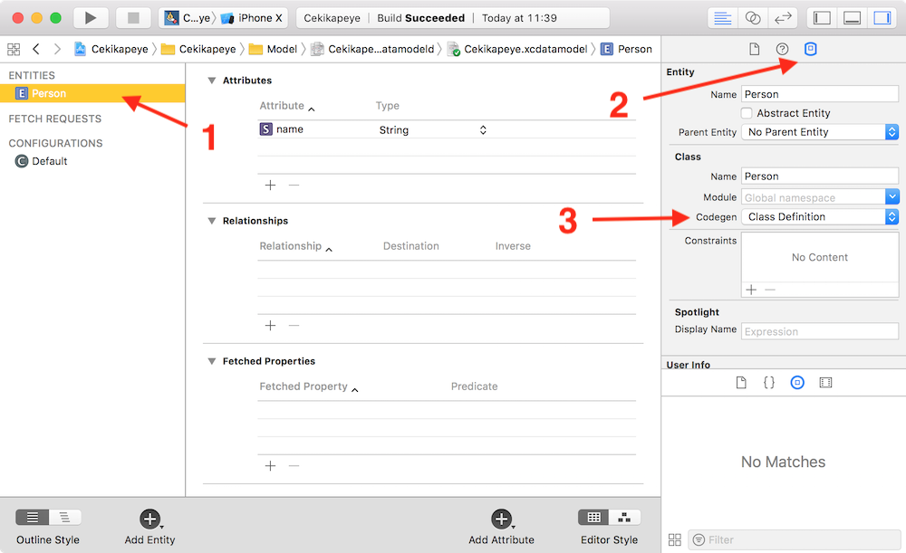
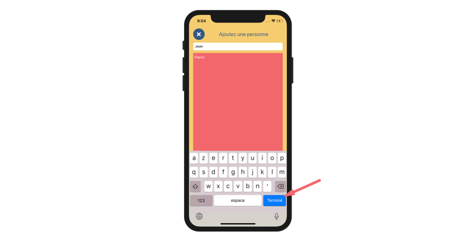
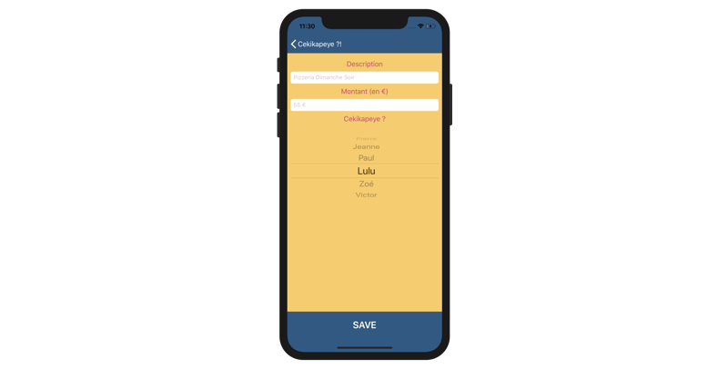

## Sauvegardez vos données avec Core Data

### Prenez en main Core Data

Nous allons maintenant nous attaquer au gros morceau de ce cours : **Core Data** !


Vous allez voir que cette technologie de persistance est très puissante et très agréable à utiliser, car elle ressemble à ce que vous connaissez déjà : l'orienté objet.

Elle est très répandue et très rares sont les applications qui ne sont pas munies de Core Data ou d'une solution équivalente. Donc vous risquez de vous y frotter assez vite en tant que développeur iOS professionnel.

#### Définition

**Core Data est une base de données locale, munie d'une API orientée objet.**

> **:question:** Ok... Donc le prof ne fait même plus d'effort pour donner des définitions claires...

Vous êtes durs. Reprenons lentement, Core Data est :

- **une base de données** : cela veut dire que son rôle est de stocker des données d'une façon claire et organisée. Concrètement, quand vous utilisez Core Data, les données sont stockées dans une base de données SQLite.
- **locale** : cela signifie évidemment que les données sont stockées sur le téléphone et pas sur un serveur distant, cloud ou autre.
- **munie d'une API orientée objet** : cela signifie que vous n'allez pas manipuler SQLite directement. À la place, Core Data transforme tout ça en de jolis objets Swift que vous allez pouvoir manipuler facilement.

> **:information_source:** SQLite est la base de donnée utilisée par défaut par Core Data mais vous pouvez choisir d'autres supports comme XML ou même la mémoire du processeur pour un stockage temporaire, mais en pratique SQLite est très adapté.

Concrètement, voici comment Core Data fonctionne :

**1/** Vous allez définir des objets. Par exemple, si on faisait une application de listes de chansons, vous définiriez un objet `Song` avec des propriétés `title` et `artist`.

**2/** Vous allez créer vos objets comme si vous créeriez un objet Swift classique :

```swift
let song = Song()
song.title = "Attrapez-les tous !"
song.artist = "Pokemon"
```

**3/** Vous sauvegarder votre objet.

Rien de plus simple, non ? C'est exactement comme l'orienté objet !

Évidemment pour que tout cela fonctionne, il n'y a pas de lutin magique, mais plusieurs couches de technologies. Et pour que vous maitrisiez Core Data, il vous faut en comprendre les rouages.

#### La stack
On parle souvent de Core Data Stack pour définir la pile de technologies utilisée par Core Data.

Cette technologie s'articule principalement sur 5 classes et 3 fichiers et je vais vous expliquer comment tout ça fonctionne ensemble :

- Classes :
	- NSManagedObjectModel
	- NSPersistentStoreCoordinator
	- NSManagedObjectContext
	- NSManagedObject
	- NSPersistentContainer
- Fichiers
	- DataModel.xcdatamodeld
	- DataModel.momd
	- DataModel.sqlite

##### NSManagedObjectModel

La première couche de Core Data, c'est celle qui permet de définir le schéma d'organisation des données. On l'appelle le **modèle**.

Pour faire cela, on utilise un fichier qui a pour extension : `xcdatamodeld` et quand vous l'ouvrez dans Xcode, il ressemble à ceci :


C'est dans ce fichier qu'on va définir nos objets dans la base de données. Comment s'appellent-ils ? Quelles sont leurs propriétés ? Quelles sont les relations entre eux ?

C'est un peu comme si on définissait une classe.

> **:warning:** Et comme pour la définition d'une classe, ici on ne fait que définir les objets, on ne les crée pas. Ce sont les plans de la voiture, pas la voiture en elle-même. C'est la même différence qu'entre une classe et une instance.

> **:information_source:** Petit point vocabulaire, on parle d'**entités** pour les objets et d'**attributs** pour leurs propriétés.

Ensuite quand on lance l'application ce fichier un peu complexe est compilé en un fichier `.momd` qui détient toutes les informations concernant les objets.

Ce fichier permet d'initialiser la classe `NSManagedObjectModel` responsable de la définition des objets.

Le schéma suivant résume tout ceci :


##### NSPersistentStoreCoordinator

Ensuite intervient la deuxième couche : `NSPersistentStoreCoordinator`. **Cette classe est la pierre angulaire de Core Data**.

**C'est la seule classe qui touche directement à la base de données**. Elle manipule le fichier SQLite (ou XML ou autres selon la base de données choisie). Dans ce fichier, elle stocke ou récupère des données.

Ensuite, elle se sert du modèle pour convertir les données stockées dans la base en objets. Ces objets sont ensuite passés à un contexte, dont le rôle est de les manipuler, les lire, les modifier, etc. On va revenir sur la notion de contexte.

Lorsque le contexte a terminé ses manipulations, il les renvoie au `NSPersistentStoreCoordinator` qui vérifie qu'ils sont toujours conformes au modèle. Et si tout va bien, il les stocke dans la base de données.

Le `NSPersistentStoreCoordinator` a donc le rôle de gérer la communication entre la base de données SQLite et le contexte en faisant la conversion des objets. Il s'appuie sur le modèle qui joue le rôle d'arbitre en vérifiant que les données correspondent bien aux définitions des objets.

> **:warning:** C'est donc grâce au `NSPersistentStoreCoordinator` qu'à lieu la magie de Core Data : la base de données y est transformée en objet pour que l'on puisse programmer en orienté objet.


##### NSManagedObjectContext
Enfin, le contexte, géré par la classe `NSManagedObjectContext`, est une sorte de bloc-notes intelligent. Il réclame des objets au `NSPersitentStoreCoordinator` qui les lui fournit.

> **:information_source:** Les objets récupérés sont du type `NSManagedObject`.

Une fois récupérés, le contexte va manipuler les objets. Il peut les lire, les modifier, en ajouter de nouveaux, en supprimer. Il peut tout faire.

Ce qu'il faut bien comprendre, c'est que tout cela a lieu seulement dans le contexte.

C'est un peu comme si vous notiez certains paragraphes d'un livre dans un bloc-notes. Une fois dans le bloc-notes, vous pouvez modifier autant que vous voulez vos paragraphes, ça n'affectera pas le livre. Ensuite, une fois que vous êtes contents de vos modifications, vous allez les intégrer toutes dans le livre avant de l'envoyer à votre éditeur.

Un contexte fonctionne exactement de la même façon. Il récupère quelques objets. Donc **il ne manipule pas toute la base de données d'un coup**, c'est beaucoup plus performant. Ensuite, il modifie/ajoute/supprime des objets. La base de données n'est pas encore affectée. Seulement une fois qu'il en est content, il envoie tout ça au `NSPersistentStoreCoordinator` qui va faire la sauvegarde effective dans la base de données.

> **:information_source:** On appelle cette dernière étape la sauvegarde du contexte.

Du coup, **lorsqu'un objet est modifié, sa modification est temporaire tant que le contexte n'a pas été sauvegardé**.

> **:information_source:** Cela signifie que vous pouvez travailler sur plusieurs contextes différents, ce qui peut être pratique si vous faîtes du multi threading.


#### NSPersistentContainer

Du coup, pour installer Core Data, si on résume il faut :

- Créer un fichier `DataModel.xcdatamodeld`.
- Récupérer la version compilée `DataModel.momd`.
- Initialiser une instance de `NSManagedModel` à partir de cette version compilée.
- Créer un fichier pour notre base de données `DataModel.sqlite`.
- Initialiser une instance de `NSPersistentStoreCoordinator` à partir de notre fichier `DataModel.sqlite` et de notre instance de `NSManagedModel`.  
- Récupérer un contexte de notre `NSPersistentStoreCoordinator` avec lequel on va pouvoir travailler.

> **:question:** Mais c'est horriiiiible !

Pas de conclusion hâtive, je vous prie. Mais j'avoue que c'est assez long. Précisément ça prend 36 lignes de code :

```swift
import CoreData

class DataController: NSObject {
    var managedObjectContext: NSManagedObjectContext

    init(completionClosure: @escaping () -> ()) {
        //This resource is the same name as your xcdatamodeldd contained in your project
        guard let modelURL = Bundle.main.url(forResource: "DataModel", withExtension:"momd") else {
            fatalError("Error loading model from bundle")
        }
        // The managed object model for the application. It is a fatal error for the application not to be able to find and load its model.
        guard let mom = NSManagedObjectModel(contentsOf: modelURL) else {
            fatalError("Error initializing mom from: \(modelURL)")
        }

        let psc = NSPersistentStoreCoordinator(managedObjectModel: mom)

        managedObjectContext = NSManagedObjectContext(concurrencyType: NSManagedObjectContextConcurrencyType.mainQueueConcurrencyType)
        managedObjectContext.persistentStoreCoordinator = psc

        let queue = DispatchQueue.global(qos: DispatchQoS.QoSClass.background)
        queue.async {
            guard let docURL = FileManager.default.urls(for: .documentDirectory, in: .userDomainMask).last else {
                fatalError("Unable to resolve document directory")
            }
            let storeURL = docURL.appendingPathComponent("DataModel.sqlite")
            do {
                try psc.addPersistentStore(ofType: NSSQLiteStoreType, configurationName: nil, at: storeURL, options: nil)
                //The callback block is expected to complete the User Interface and therefore should be presented back on the main queue so that the user interface does not need to be concerned with which queue this call is coming from.
                DispatchQueue.main.sync(execute: completionClosure)
            } catch {
                fatalError("Error migrating store: \(error)")
            }
        }
    }
}
```

Voici comment on initialise la Core Data Stack. Inutile que vous reteniez tout ça, mais ça peut vous permettre de voir que tout ce que je vous ai dit précédemment a une réalité très concrète.

Bien sûr, un outil même aussi puissant que Core Data peut vite devenir repoussant si on doit écrire tout ça à chaque fois. C'est la raison pour laquelle Apple a créé avec iOS 10 une nouvelle classe : `NSPersistentContainer`.

Cette classe permet de réduire l'installation de Core Data à seulement trois étapes :

- Créer un fichier `DataModel.xcdatamodeld`.
- Instancier `NSPersistentContainer` en lui passant un String : le nom de notre fichier. Donc `"DataModel"` dans notre exemple.
- Récupérer un contexte à partir de notre instance de `NSPersistantContainer`.

> **:information_source:** Et encore cette troisième étape se résume à utiliser une propriété de `NSPersistentContainer`. Donc, c'est quasiment deux étapes en fait.


Et voilà vous avez le schéma complet de Core Data !

#### En résumé
- **Core Data est une base de données locale, munie d'une API orientée objet.**
- NSManagedModel permet de définir les objets.
- NSPersistentCoordinator stocke et récupère les informations dans la base de données, il s'appuie sur le modèle pour les convertir en objets et il les fournit au contexte qui les réclame.
- NSManagedObjectContext manipule les objets de son côté et une fois les informations terminées, il sauvegarde les objets en les renvoyant au NSPersistentCoordinator qui va les reconvertir en utilisant le modèle et les stocker dans la base de données.
- NSPersistentContainer permet de réduire l'installation de Core Data à seulement 3 étapes.

Si vous utilisez Core Data régulièrement, vous maîtriserez forcément le reste de ce que nous allons couvrir dans les prochains chapitres, car vous en aurez besoin pour faire fonctionner vos applications.

C'est un peu moins certain en ce qui concerne ce chapitre notamment grâce à `NSPersistentContainer` qui permet de cacher une bonne partie du fonctionnement de Core Data.

Mais je me permets d'insister sur l'importance de ce chapitre. **Comprendre les rouages de Core Data et pas seulement savoir l'utiliser fera la différence le jour où vous serez face à des bugs. C'est ce qui fera de vous des développeurs intelligents face au code que vous rédigez.**

En plus, dans la suite, je vais vraiment m'appuyer sur ce chapitre, donc assurez-vous que c'est bien compris avant de continuer.

> **:information_source:** Vous pouvez compléter ce chapitre avec la lecture de [cette très bonne documentation d'Apple](https://developer.apple.com/library/content/documentation/Cocoa/Conceptual/CoreData/InitializingtheCoreDataStack.html).

Dans le prochain chapitre, nous allons installer Core Data en suivant les trois étapes dont nous avons parlées !

### Installez Core Data
C'est parti, nous allons installer Core Data. Et comme on l'a vu dans le chapitre précédent, nous allons commencer par ajouter un fichier `xcdatamodeld`.

#### Ajout du fichier xcdatamodeld

Comme pour ajouter n'importe quel fichier, vous allez vous rendre dans *File > New > File…* Et dans la section Core Data, vous allez choisir Data Model.


Vous cliquez sur *Next*. Puis vous pouvez donner un nom à votre fichier. En général, on lui donne le nom du projet, donc ici *Cekikapeye*. Et vous faites bien attention à le sauvegarder côté modèle dans votre MVC.


Votre fichier est créé et apparaît dans le navigateur :


> **:information_source:** Nous allons jouer avec ce fichier dans le prochain chapitre, mais d'abord il nous faut finir l'installation.

#### Instancier NSPersistentContainer

On a vu dans le chapitre précédent que la deuxième étape était l'instanciation de `NSPersistentContainer`, alors allons-y !

Cela va avoir lieu dans le fameux fichier `AppDelegate.swift` dont nous n'avons encore jamais parlé. Je vais vous en dire deux mots.

##### AppDelegate

###### Cycle de vie de l'application

**Le rôle d'`AppDelegate.swift` est de gérer ce qu'on appelle le cycle de vie de l'application**. Cette classe implémente le protocole `UIApplicationDelegate` et dans ce protocole, se trouve différentes fonctions qui sont appelées lors de certains évènements, par exemple :

- L'application vient de s'ouvrir.
- L'application est passée en arrière-plan.
- L'application est sur le point d'être fermée.
- L'application a été ouverte à partir de telle notification.
- L'application n'est plus active (l'iPhone reçoit un appel par exemple).
- etc.

Pour chacun de ses évènements, vous pouvez implémenter la fonction correspondante et exécuter du code si besoin.

> **:information_source:** Au cas où vous ne l'auriez pas remarqué, on nage en plein delegate pattern ici ! Comme pour les Table View, [souvenez-vous](https://openclassrooms.com/courses/creez-des-listes-dans-vos-applications-ios) !

###### Accessibilité d'un objet

AppDelegate est parfois aussi utilisée pour pouvoir avoir accès à certaines variables partout dans le code, et cela grâce à la classe `UIApplication`.

`UIApplication` est la classe qui représente votre application. Cette classe utilise le singleton pattern et vous pouvez en récupérer une instance via la propriété statique `UIApplication.shared`. Cette instance est toujours disponible en mémoire tant que votre application n'est pas fermée.

Cette classe admet aussi une propriété `delegate` qui n'est autre que notre `AppDelegate` ! Or comme `UIApplication.shared` est disponible partout dans votre code, `UIApplication.shared.delegate` l'est aussi !

Donc si vous rajoutez une propriété dans votre classe AppDelegate :

```swift
class AppDelegate: UIResponder, UIApplicationDelegate {
	// (...)

	var myProperty = ""
}
```

Vous pouvez accéder à myProperty partout dans votre code via :

```swift
UIApplication.shared.delegate.myProperty
```

`myProperty` sera disponible en mémoire pendant toute la durée de vie de votre application.

> **:warning:** Évidemment, il ne faut pas abuser de cette technique, car AppDelegate ne doit pas devenir une poubelle avec toutes les informations que vous voulez stocker. Mais ici on en a besoin pour avoir accès à notre base de données, un élément central de l'application, donc on va utiliser cette technique.

##### NSPersistentContainer

On va donc rajouter une propriété dans notre classe `AppDelegate` qui va nous permettre d'avoir accès partout dans le code à notre `NSPersistentContainer`.

Le problème, c'est que je ne me souviens plus du code pour faire ça...

> **:question:** Je te jure, le prof, il vaut pas un kopeck...

Je ne sais pas ce que vous avez en ce moment, mais je vous trouve un poil désagréable. De toute façon, vous ne me faites pas peur, je sais comment le retrouver.

Lorsqu'on crée un nouveau projet dans Xcode, on peut cocher l'option *Use Core Data* :


> **:information_source:** Je vous invite à créer un projet bidon en même temps que moi pour admirer le résultat.

Lorsqu'on coche cette case, Xcode génère pour nous un projet dans lequel Core Data est déjà installée. Cela signifie que d'une part le fichier xcdatamodeld est inclus avec le package.


On fait ça en première partie de ce chapitre. Et d'autre part, notre classe AppDelegate est un peu plus fournie. Vous avez ici ce qui a été rajouté pour nous :

```swift
import CoreData

class AppDelegate: UIResponder, UIApplicationDelegate {
	// (...)

    // MARK: - Core Data stack

    lazy var persistentContainer: NSPersistentContainer = {
        /*
         The persistent container for the application. This implementation
         creates and returns a container, having loaded the store for the
         application to it. This property is optional since there are legitimate
         error conditions that could cause the creation of the store to fail.
        */
        let container = NSPersistentContainer(name: "test")
        container.loadPersistentStores(completionHandler: { (storeDescription, error) in
            if let error = error as NSError? {
                // Replace this implementation with code to handle the error appropriately.
                // fatalError() causes the application to generate a crash log and terminate. You should not use this function in a shipping application, although it may be useful during development.

                /*
                 Typical reasons for an error here include:
                 * The parent directory does not exist, cannot be created, or disallows writing.
                 * The persistent store is not accessible, due to permissions or data protection when the device is locked.
                 * The device is out of space.
                 * The store could not be migrated to the current model version.
                 Check the error message to determine what the actual problem was.
                 */
                fatalError("Unresolved error \(error), \(error.userInfo)")
            }
        })
        return container
    }()

    // MARK: - Core Data Saving support

    func saveContext () {
        let context = persistentContainer.viewContext
        if context.hasChanges {
            do {
                try context.save()
            } catch {
                // Replace this implementation with code to handle the error appropriately.
                // fatalError() causes the application to generate a crash log and terminate. You should not use this function in a shipping application, although it may be useful during development.
                let nserror = error as NSError
                fatalError("Unresolved error \(nserror), \(nserror.userInfo)")
            }
        }
    }

}
```

Xcode a ajouté une propriété `persistentContainer` qui nous permet d'installer Core Data. Et une méthode `saveContext` qui nous permettra plus tard de sauvegarder nos données facilement.

La méthode ne nous intéresse pas, mais la propriété, c'est pile ce qui nous faut pour finir notre installation. Donc je vous invite à la copier-coller dans l'`AppDelegate` de notre application *Cekikapeye* (sans oublier d'importer Core Data !) :

```swift
import CoreData

class AppDelegate: UIResponder, UIApplicationDelegate {
	// (...)

    lazy var persistentContainer: NSPersistentContainer = {
        let container = NSPersistentContainer(name: "test")
        container.loadPersistentStores(completionHandler: { (storeDescription, error) in
            if let error = error as NSError? {
                fatalError("Unresolved error \(error), \(error.userInfo)")
            }
        })
        return container
    }()
}
```

> **:information_source:** Ici, j'ai juste supprimé tous les commentaires pour y voir plus clair...

Enfin, pour que notre `NSPersistentContainer` fasse son travail, à savoir créer les différents fichiers, initialiser le NSManagedObjectModel et le NSPersistentStoreCoordinator, il nous faut lui donner le nom de notre fichier `Cekikapeye.xcdatamodel` comme ceci.

On fait tout simplement ça lors de l'initialisation de `NSPersistentContainer` (ligne 7 de l'extrait de code précédent) :

```swift
let container = NSPersistentContainer(name: "Cekikapeye")
```

Et voilà ! Nous avons installé notre container !

> **:information_source:** Je ne détaille pas le contenu de cette propriété, car j'ai déjà bien parlé du rôle de cette classe et c'est largement suffisant pour bien comprendre Core Data. Et au passage, si vous n'aviez jamais rencontré le mot-clé `lazy`, c'est juste un moyen de charger une propriété seulement lorsqu'elle est réclamée pour la première fois. La fermeture est executée la première fois qu'on utilise la variable, et le résultat est stocké dans cette variable. Notez que ceci n'est *pas* une propriété calculée. Plus d'infos [ici](https://medium.com/@abhimuralidharan/lazy-var-in-ios-swift-96c75cb8a13a).

##### Refactorisation

Avant de passer à la suite, je voudrais nous simplifier un peu la vie. En effet, à chaque fois qu'on va vouloir accéder à notre propriété `persistentContainer`, il va falloir passer par :

```swift
UIApplication.shared.delegate.persistentContainer
```

En plus, ce n'est même pas complètement vrai, car la propriété `delegate` de `UIApplication` est de type `UIApplicationDelegate` et non `AppDelegate` donc je vais devoir contrôler son type avant.

Du coup, pour avoir accès à mon container, je vais devoir écrire à chaque fois :

```swift
(UIApplication.shared.delegate as! AppDelegate).persistentContainer
```

Ça ne fait pas plaisir...

Je vous propose donc qu'on s'offre une propriété statique pour simplifier tout ça :

```swift
static var persistentContainer: NSPersistentContainer {
    return (UIApplication.shared.delegate as! AppDelegate).persistentContainer
}
```

Et voilà ! Maintenant j'ai accès à mon `persistentContainer` avec :

```swift
AppDelegate.persistentContainer
```

C'est quand même plus pratique !

#### Récupération du contexte

La dernière étape, c'est de récupérer le contexte puisque, comme on l'a vu au chapitre précédent, c'est dans le contexte que nous allons manipuler les données.

Pour cela, nous allons tout simplement utiliser la propriété `viewContext` de type `NSManagedObjectContext` de la classe `NSPersistentContainer`. Cette propriété retourne un contexte à utiliser dans le Main Thread, celui dans lequel les vues sont gérées. D'où son nom.

> **:information_source:** Sauf si vous faîtes du multithreading, vous n'aurez pas besoin d'autres contextes. Besoin d'un rappel sur le multithreading, c'est par [ici](https://openclassrooms.com/courses/faites-des-appels-reseaux-dans-votre-application-ios) !

Pour les mêmes raisons pratiques, je vous propose qu'on crée une propriété statique dans `AppDelegate` :

```swift
static var viewContext: NSManagedObjectContext {
    return persistentContainer.viewContext
}
```

Et voilà ! On pourra utiliser notre contexte partout dans notre code en écrivant simplement `AppDelegate.viewContext` !

#### En résumé
On suit trois étapes pour installer Core Data :

- On crée un fichier `xcdatamodeld`.
- On crée une propriété `persistentContainer` dans `AppDelegate` qu'on initialise avec le nom du fichier `xcdatamodeld`.
- On récupère le contexte via la propriété `viewContext` de `NSPersistentContainer`.

Dans le prochain chapitre, nous allons créer notre première entité grâce à notre fichier `xcdatamodeld` !

### Créez une entité

Maintenant que Core Data est installée, nous allons pouvoir enfin jouer avec ! Dans le reste des chapitres de cette partie, nous allons utiliser Core Data pour sauvegarder les différentes personnes dont on souhaite noter les dépenses.

Dans ce chapitre, nous allons travailler dans le fichier `xcdatamodeld` pour définir notre premier modèle : `Person`.

#### Ajout de l'entité Person

Quand vous ouvrez le fichier `xcdatamodeld`, il ressemble à ceci :


Dans ce fichier, vous allez pouvoir définir votre schéma de données. Quelles sont les différentes entités ? Quels sont leurs attributs, leurs relations entre eux, etc.

> **:information_source:** Une **entité** désigne un type d'objet de votre base de données. Pour ceux qui connaissent le SQL, c'est l'équivalent d'une table.

On va rajouter notre première entité : `Person`. Pour cela, il faut cliquer sur le bouton `Add Entity` en bas à gauche :


Une nouvelle entité apparait dans la section *Entities*.



En double-cliquant dessus, vous allez pouvoir modifier son nom et la nommez `Person`.


Et voilà ! Vous avez créé votre première entité !

#### Ajout d'un attribut

Sur la droite, vous avez une section `Attributes`. Nous allons rajouter un premier **attribut** à notre entité.

> **:information_source:** Si l'entité est l'équivalent d'une classe, un attribut est l'équivalent d'une propriété.

Pour cela, cliquez sur le bouton `+` :


> **:information_source:** Vous pouvez aussi cliquer sur le bouton *Add Attribute* tout en bas.

Un nouvel attribut apparait :



Vous pouvez modifier son nom. Nous allons l'appeler `name`, car il nous permettra de stocker le nom de la personne.

Ensuite, vous pouvez cliquer sur la liste déroulante pour choisir son type :


Dans la liste, vous avez plusieurs types possibles pour stocker des données, vous en reconnaissez la plupart, je pense. Il y a les types numériques, les chaînes de caractères, les dates, les booléens, les data, etc.

Pour notre propriété `name`, on va bien sûr choisir `String`.


Et voilà ! Notre attribut est maintenant créé !

#### Génération automatique du code

Je vous ai vendu Core Data comme une base de données orientée objet, dans laquelle, pour gérer vos objets, cela ressemblerait à ceci :

```swift
let person = Person()
person.name = "Jean-Pierre"
```

Je ne vous ai pas menti. Le seul problème, c'est que, par défaut, pour créer un objet, il faut en fait écrire ceci :

```swift
let person: NSManagedObject = NSEntityDescription.insertNewObject(forEntityName: "Person", into: AppDelegate.viewContext)
person.setValue("Jean-Pierre", forKey: "name")
```

C'est beaucoup moins joli. Pour avoir le droit à l'option toute belle du dessus, il faut demander à Core Data de générer automatiquement pour nous la classe `Person`.

Et c'est très simple, sélectionnez votre entité, puis dans les utilitaires à droite, sélectionnez le troisième onglet (l'inspecteur de modèle de donnée). On va s'intéresser au réglage *Codegen* pour *Code Generation* (en français, génération automatique de code).



Dans le menu déroulant, vous avez trois options :


- **Manual/None** : Cela signifie qu'Xcode ne génère aucun code pour vous.
- **Class Definition** : Cela signifie qu'Xcode génère pour vous une classe `Person` qui va hériter de `NSManagedObject` pour être un objet de `Core Data`.
- **Category/Extension** : C'est à vous de créer une classe `Person`. Xcode va générer automatiquement une extension pour que votre classe se conforme à `NSManagedObject`.

> **:information_source:** Les *category* sont les équivalents en Objective-C des extensions en Swift.

Je vous propose de choisir `Category/Extension`. La raison c'est qu'on préfère nous même créer la classe. Ça nous permet de lui rajouter des propriétés et des méthodes si besoin. On laisse juste Xcode étendre notre classe pour lui ajouter les fonctionnalités liées à Core Data.

Je vous invite donc à choisir **Category/Extension**. Et Xcode génère pour vous le code suivant :

```swift
// Person+CoreDataProperties.swift

import CoreData
extension Person {
    @nonobjc public class func fetchRequest() -> NSFetchRequest<Person> {
        return NSFetchRequest<Person>(entityName: "Person")
    }

    @NSManaged public var name: String?
}
```

> **:information_source:** Inutile de chercher ce fichier dans votre navigateur, il est caché ailleurs.

On retrouve notre propriété `name` de type `String?`. Elle est précédée par la mention `@NSManaged` qui permet à Xcode de faire le lien avec l'attribut de votre entité.

Et il y a une deuxième méthode `fetchRequest` qui retourne un objet de type `NSFetchRequest`. `NSFetchRequest` est la classe qui permet au contexte de réclamer des objets à la base de données. Cette méthode vous permet donc d'obtenir une instance de `NSFetchRequest`, dédiée à la récupération d'objets `Person`.

> **:information_source:** C'est assez pratique et on va y revenir dans le dernier chapitre de cette partie qui parle de la récupération de données.

#### Création de la classe Person

Pour faire fonctionner cette extension, il nous faut créer notre classe `Person`. Donc je vous laisse faire ça dans le modèle en ajoutant un fichier `Person.swift`.

Pour que `Person` soit un objet au sens de Core Data, il doit hériter de la classe `NSManagedObject` :

```swift
import CoreData

class Person: NSManagedObject {
}
```

> **:warning:** `CoreData` étant un framework à part, il ne faut pas oublier de l'importer dès que vous souhaitez utiliser les classes qui s'y rapportent.

Et voilà ! Votre première entité est parfaitement fonctionnelle !

#### S'éviter des ennuis

Enfin, un petit bug d'Xcode peut intervenir si vous ne précisez le module dans lequel évolue l'entité.

En attendant qu'Apple se penche sur la question, vous pouvez empêcher ça très facilement en indiquant *Current Product Module* comme valeur du réglage *Module* dans l'inspecteur de modèle de donnée.


#### En résumé
- On ajoute des entités et des attributs dans le fichier `xcdatamodeld` en utilisant les boutons *Add Entity* et *Add Attribute*.
- On peut préciser le nom de notre entité et le nom et le type d'un attribut.
- Xcode génère automatiquement le code correspondant au modèle défini dans le fichier xcdatamodeld. C'est grâce à cela qu'on peut utiliser nos objets de la base de données comme des objets Swift classiques.
- Pour cela, nos classes doivent hériter de `NSManagedObject`.

Dans le prochain chapitre, nous allons apprendre à créer et sauvegarder nos objets.

### Sauvegardez votre premier objet
Vous savez de quoi j'ai envie ? Je crois que j'ai bien envie de sauvegarder notre tout premier objet avec Core Data ! Et comme le monde est bien fait, c'est précisément ce que nous allons faire dans ce chapitre !

> **:question:** On t'a connu plus en forme sur les introductions de chapitre...

Peut-être... Mais c'est assez désobligeant de le faire remarquer !

Bref, dans notre `PeopleViewController`, lors de l'appui sur le bouton *Terminé* du clavier, on ne sauvegarde pas encore les participants.

C'est bientôt de l'histoire ancienne !

#### Préparation
Lorsqu'on appuie sur le bouton *Terminé* du clavier, cela appelle la méthode `addPerson` de `PeopleViewController` que voici :

```swift
private func addPerson() {
    guard let personName = peopleTextField.text,
        var people = peopleTextView.text else {
            return
    }

    people += personName + "\n"
    peopleTextView.text = people
    peopleTextField.text = ""

    // TODO: Save person
}
```

> **:information_source:** Je parle de l'appui sur ce bouton :
>
> 

Cette méthode fait deux choses :

1. Elle récupère les données du champs de texte et de la textview.
2. Elle rajoute le nom du nouveau participant à la liste des précédents dans la Text View.

Et elle va bientôt en faire une troisième. Nous allons sauvegarder notre nouveau participant dans la base de données à la place de notre commentaire *TODO*. Je vous propose qu'on fasse ça dans une méthode `savePerson` à part :

```swift
private func addPerson() {
	// (...)
    savePerson(named: personName)
}

private func savePerson(named name: String) {
}
```

Maintenant, nous allons tout simplement créer notre nouvel objet `Person`. Il s'agit tout simplement de créer une instance de la classe `Person`.

#### Une histoire de contexte

Seulement, souvenez-vous que pour manipuler des objets de Core Data, il nous faut un contexte. On va du coup préciser le contexte avec lequel on souhaite créer cet objet lors de l'initialisation.

`Person` hérite `NSManagedObject` qui admet l'initialiseur suivant :

```swift
init(context: NSManagedObjectContext)
```

> **:question:** OK, mais on va utiliser quoi comme contexte ?

Lorsqu'on a installé Core Data, on a récupéré un contexte de notre `persistentContainer` via la propriété `viewContext`. On en avait fait une propriété static dans `AppDelegate` de façon à pouvoir récupérer notre contexte en écrivant simplement :

```swift
AppDelegate.viewContext
```

C'est ce contexte que l'on va utiliser.

#### Création de l'objet Person

On a l'initialiseur, on a la valeur à lui passer, let's go !

```swift
private func savePerson(named name: String) {
    let person = Person(context: AppDelegate.viewContext)
}
```

Ça y est ! J'ai un objet Person qui a été ajouté dans mon contexte. Maintenant, je peux le manipuler comme n'importe quel objet Swift. Par exemple, pour donner une valeur à son attribut `name`, j'écris tout simplement :

```swift
private func savePerson(named name: String) {
    let person = Person(context: AppDelegate.viewContext)
    person.name = name
}
```

Et voilà ! Sans plus de difficultés, on a créé notre premier objet Core Data.

#### Sauvegarde du contexte
Souvenez-vous, le contexte est un bloc-notes intelligent qui va noter tous les ajouts/suppressions/modifications d'objet.

Mais tous ces changements n'ont lieu que dans le contexte. Pour que ces changements soient inscrits dans notre base de données, il faut sauvegarder le contexte.

Donc pour que notre objet `person` soit effectivement ajouté dans la base de données, il faut sauvegarder le contexte. Et cela se fait très facilement avec la méthode save de `NSManagedObjectContext` :

```swift
private func savePerson(named name: String) {
    let person = Person(context: AppDelegate.viewContext)
    person.name = name
    AppDelegate.viewContext.save()
}
```

Il se trouve que la méthode save peut renvoyer une erreur. Donc il faut l'utiliser avec `try?`.

```swift
try? AppDelegate.viewContext.save()
```

Vous pouvez aussi utiliser `do/catch` pour gérer les erreurs et afficher une alerte à l'utilisateur au cas où la sauvegarde échoue. Mais je vous fais confiance pour réussir à faire ça sans moi.

> **:information_source:** Besoin d'un rappel sur la gestion d'erreur en Swift ? C'est [là](https://openclassrooms.com/courses/faites-des-appels-reseaux-dans-votre-application-ios) ! Et je parle de l'affichage des alertes [ici](https://openclassrooms.com/courses/ajoutez-plusieurs-pages-a-votre-application-ios/presentez-une-alerte-a-lutilisateur). ;)

Et voilà ! Il suffit de trois lignes pour créer un objet dans le contexte, modifier ses propriétés et sauvegarder le contexte avec notre nouvel objet.

#### En résumé
Pour sauvegarder un objet :
- On créer une instance de la classe désirée en lui passant le contexte lors de l'initialisation.
- On manipule les propriétés comme n'importe quel objet Swift.
- On sauvegarde le contexte.

Dans le prochain chapitre, on va apprendre à récupérer les données sauvegardées avec Core Data !

### Récupérez vos données
Nous savons maintenant sauvegarder nos objets `Person`. Les participants sont donc sauvegardés ! Mais si on quitte l'interface d'ajout de personnes et qu'on y retourne, la liste a disparu !

C'est logique, on sauvegarde les données, mais on ne les récupère pas. Dans ce chapitre, on va récupérer la liste de tous les participants dans Core Data au moment du chargement de la page.

#### À la découverte d'NSFetchRequest

Pour récupérer des données, on va utiliser une classe dont on a à peine parlé : `NSFetchRequest`. **Cette classe permet de créer une requête**.

Une requête va contenir un certain nombre d'informations :

- Quel type de données je cherche à récupérer ? Des `Person` ? Des `Spending` ? Quelle entité ?
- Quels objets je veux récupérer ? Tous ? Seulement ceux dont le nom commence par A ?
- Dans quel ordre je veux obtenir les objets ? Par ordre croissant ? Décroissant ? Rangés selon quel attribut ?

Dans ce chapitre, nous allons faire la requête la plus simple : récupérer tous les objets d'une même entité sans plus de précision. Mais dans la prochaine partie, nous allons faire des requêtes plus fines en répondant aux questions citées ci-dessus.

#### Création de la requête

On veut récupérer les données lors du chargement de notre `PeopleViewController` pour pouvoir afficher tous les participants dans notre Text View.

On va donc faire cela dans la méthode `viewDidLoad` que je vous propose de rajouter :

```swift
class PeopleViewController: UIViewController {
	// (...)

    override func viewDidLoad() {
        super.viewDidLoad()
        // Récupérer les données dans Core Data
    }
}
```

Maintenant, nous allons créer notre requête. Pour cela, souvenez-vous, je vous ai montré que dans l'extension de `Person` générée automatiquement par Core Data se trouvait une méthode statique `fetchRequest` qui permet de créer un objet NSFetchRequest :

```swift
// Person+CoreDataProperties.swift

import CoreData
extension Person {
    @nonobjc public class func fetchRequest() -> NSFetchRequest<Person> {
        return NSFetchRequest<Person>(entityName: "Person")
    }

    @NSManaged public var name: String?
}
```

Nous allons donc utiliser cette méthode pour créer notre requête :

```swift
let request: NSFetchRequest<Person> = Person.fetchRequest()
```

Je crée simplement ma requête avec la méthode statique `fetchRequest` de Person.

> **:question:** OK, mais il est bizarre le type de la variable : `NSFetchRequest<Person>` !

Eh oui en effet ! La raison, c'est que NSFetchRequest est une classe générique et je vais vous expliquer ce que c'est.

#### Une classe générique

Les génériques sont un concept Swift dont on n’a pas encore parlé. Je vais rapidement vous expliquer comment cela fonctionne avec un exemple.

`Array` est également une classe générique. Pour utiliser cette classe, on peut faire ce que vous avez l'habitude de faire :

```swift
let myArray: [Int]
```

Mais en fait, ceci est seulement un raccourci pour :

```swift
let myArray: Array<Int>
```

On précise entre les chevrons le type que va contenir le tableau. C'est exactement la même chose pour `NSFetchRequest` :

```swift
let request: NSFetchRequest<Person>
```

On précise entre les chevrons le type de résultat que va retourner notre requête. Comme pour un tableau, le type est incomplet si on ne fournit pas cette information.

> **:information_source:** Pour ne pas vous laisser dans l'inexactitude, je précise qu'`Array` est en fait une structure générique, pas une classe. Mais cela n'a pas d'importance dans le cadre de la compréhension des génériques. Si vous voulez en savoir plus sur les génériques, je vous recommande [la documentation Swift sur le sujet](https://developer.apple.com/library/content/documentation/Swift/Conceptual/Swift_Programming_Language/Generics.html).

#### Exécuter la requête
Notre requête est prête ! Il n'y a plus qu'à la lancer. Comme à chaque fois qu'on interagit avec les données, on va passer par notre contexte.

On va utiliser la méthode `fetch` de `NSManagedObjectContext` pour exécuter notre requête :

```swift
AppDelegate.viewContext.fetch(request)
```

> **:information_source:** Comme tout à l'heure, on récupère notre contexte avec `AppDelegate.viewContext`.

Cette méthode retourne un tableau de `Person`. Ce tableau contient tous les objets récupérés dans la base de données.

Cette méthode peut renvoyer une erreur, donc je vais devoir utiliser try? et déballer l'optionnel ainsi créé. Je fais ça avec `guard let` :

```swift
let request: NSFetchRequest<Person> = Person.fetchRequest()
guard let persons = try? AppDelegate.viewContext.fetch(request) else {
    return
}
```

Et voilà ! En à peine 4 lignes, on a récupéré nos objets dans la base de données.

Maintenant, je peux utiliser mes objets pour afficher la liste des participants dans ma Text View.

```swift
var peopleText = ""
for person in persons {
    if let name = person.name {
        peopleText += name + "\n"
    }
}
peopleTextView.text = peopleText
```

Désormais, quand vous ouvrez cette page, la liste des participants est chargée dans la base de données et affichée dans la Text View. Et bien sûr, cela fonctionne aussi entre deux lancements de l'application. Vous goûtez à la persistance des données avec Core Data.

#### Une question de réflexe

De nouveau, il doit y avoir quelques choses qui vous donnent envie de bondir !

> **:question:** Je n’ai pas voulu faire la remarque, mais on fait une requête à la base dans le contrôleur. On n’avait pas dit que les données, ça devait être géré dans le modèle ?

Eh oui ! Bien sûr ! J'ai des élèves brillants ! Du coup, je vous propose de refactoriser ça pour créer et exécuter notre requête dans le modèle et plus précisément dans la classe `Person`.

Je vais faire cela avec une propriété static calculée `all` :

```swift
class Person: NSManagedObject {
    static var all: [Person] {
        let request: NSFetchRequest<Person> = Person.fetchRequest()
        guard let persons = try? AppDelegate.viewContext.fetch(request) else { return [] }
        return persons
    }
}
```

Maintenant, je peux supprimer ma requête et modifier mon code côté contrôleur pour appeler `Person.all` :

```swift
override func viewDidLoad() {
    super.viewDidLoad()
    displayPeopleList()
}

private func displayPeopleList() {
    var peopleText = ""
    for person in Person.all { // <-- Ici, on utilise maintenant Person.all
        if let name = person.name {
            peopleText += name + "\n"
        }
    }
    peopleTextView.text = peopleText
}
```

> **:information_source:** Je me suis permis de créer en plus une petite méthode privée pour que ce soit plus propre.

#### Ne pas oublier le Picker View

Il y a un autre endroit où ces données nous intéressent ! Dans l'interface de création d'une dépense (`AddSpendingViewController`), on va maintenant pouvoir remplir le Picker View que j'ai préparé pour vous pour afficher la liste des participants.

Ainsi l'utilisateur va pouvoir indiquer à quel participant appartient la dépense qu'il est train de créer.

> **:information_source:** C'est d'ailleurs le programme de la prochaine partie.

Pour commencer, il faut afficher le Picker View. Dans le storyboard, j'ai caché avec la propriété `isHidden`, le Picker View et son label de titre. Je vous invite à décocher la case *Hidden*.


Le label et le picker view doivent apparaître.

Maintenant, nous allons ajouter une propriété `persons` dans `AddSpendingViewController` qui va récupérer la liste des participants pour les afficher dans le Picker View.

```swift
class AddSpendingViewController: UIViewController {
    // (...)

    var persons = Person.all
}
```

J'initialise ma propriété `persons` avec ma super propriété calculée `Person.all` qui me renvoie tous les objets dans la base de données.

Maintenant, je n'ai plus qu'à remplir mon Picker View avec mon tableau `persons` :

```swift
extension AddSpendingViewController: UIPickerViewDataSource, UIPickerViewDelegate {
    func numberOfComponents(in pickerView: UIPickerView) -> Int {
        return 1
    }

    func pickerView(_ pickerView: UIPickerView, numberOfRowsInComponent component: Int) -> Int {
        return persons.count
    }

    func pickerView(_ pickerView: UIPickerView, titleForRow row: Int, forComponent component: Int) -> String? {
        return persons[row].name
    }
}
```

> **:information_source:** Besoin d'un rappel sur l'utilisation du Picker View, on en parlé [ici](https://openclassrooms.com/courses/ajoutez-plusieurs-pages-a-votre-application-ios/remplissez-le-selecteur).

Et voilà ! Vous pouvez lancer l'application et maintenant le Picker View affiche les différents participants.



#### En résumé

Pour récupérer des données :

- On crée une requête avec la méthode `fetchRequest` générée automatiquement par Xcode. Cette méthode renvoie un objet de type `NSFetchRequest`.
- On exécute la requête avec la méthode `fetch` de `NSManagedContext`.

Dans la prochaine partie, nous allons ajouter une deuxième entité dans notre modèle de donnée : `Spending`. Cela va nous permettre de sauvegarder les dépenses dans Core Data. On va voir comment gérer les relations entre les entités `Spending` et `Person` et vous allez approfondir vos connaissances de Core Data !

À tout de suite !
