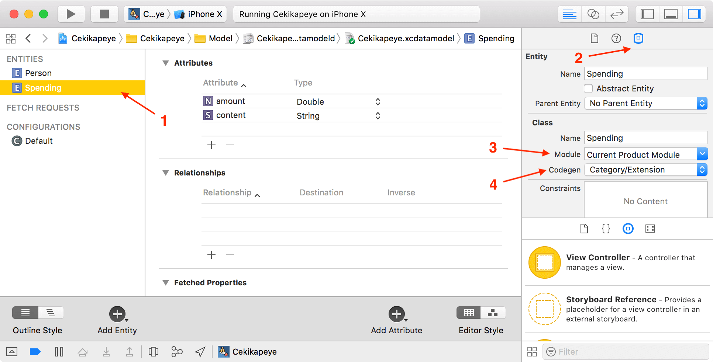

## Gérez une base de donnée relationnelle

### Ajoutez des relations
Notre application commence à bien tourner. Mais le problème principale n'est pas encore résolu ! **Les dépenses ne sont toujours pas persistantes**. Dès que je ferme mon application, je perds toutes les dépenses que j'ai rajoutées précédemment.

Dans cette partie, nous allons nous résoudre ce problème !

#### Création d'une deuxième entité

Pour sauvegarder nos dépenses, nous allons créer une deuxième entité `Spending` dans Core Data avec notre fichier `xcdatamodeld`.

En fait, c'est exactement la même chose que notre structure dans le fichier `Spending.swift` donc on va lui ajouter deux attributs `content` de type `String` et amount de type `Double`.

Je vous laisse créer cette entité avec ses attributs, c'est exactement la même chose que pour notre entité `Person`. Voici le résultat : 


Ensuite, comme pour `Person`, nous allons utiliser la génération de code. Choisissez l'option *Category/Extension*. Profitez en pour indiquer aussi la valeur Current Product Module pour le réglage *Module* :



Maintenant que nous avons généré l'extension, il nous faut ajouter la classe correspondante. Dans `Spending.swift`, on a déjà une structure `Spending` :

```swift
struct Spending {
    var content: String
    var amount: Double
}
``` 

On va remplacer cette structure par une classe qui hérite de `NSManagedObject` et on peut supprimer les propriétés car elles sont déjà créées pour nous dans l'extension générée automatiquement :

```swift
import CoreData

class Spending: NSManagedObject {
}
```

Jusque là, pas grand chose de nouveau. C'est ce qu'on a déjà fait avec la classe Person. 

> **:information_source:** Je voudrais juste attirer votre attention sur un petit point. Si vous séléctionnez l'attribut `amount` et que vous allez dans l'inspecteur de donnée, je vous invite à cocher la case *Use Scalar Type*.
>
> 
>
> Si vous ne cochez pas cette case, la propriété `amount` générée automatiquement sera de type `NSNumber`, un vieux type hérité d'Objective-C. En la cochant, vous avez bien le type `Double`. Ceci est vrai pour tous les attributs qui ont un type numérique.

#### Un storyboard pour les données

Bien. Maintenant que nous avons nos deux classes, nous allons les relier ! En effet, chaque dépense doit être associée à un participant. Nous allons entrer dans le monde des **bases de données relationnelles** !

Nous pouvons faire ça sur l'interface que nous utilisons depuis le début. Mais il existe une deuxième façon de visualiser le fichier `xcdatamodeld`. Pour passer d'une visualisation à l'autre, il faut utiliser les boutons *Editor Style* en bas à droite.


La deuxième méthode de visualisation est une sorte de **storyboard de données** ! C'est très pratique à utiliser (en plus d'être beau :) ).


C'est sur ce storyboard que je vous propose de créer nos relations.

> **:warning:** J'insiste sur un point : **tout ce que vous pouvez faire dans la vue tableau fonctionne également dans la version storyboard et inversement**. 

#### Mise en place de la relation

Pour créer une relation, on va utiliser notre geste préféré avec Xcode : **le control-drag** ! Faites un control drag d'une entité à l'autre pour créer la relation.


Lorsque la relation est créée, une double flèche apparaît entre les deux entités et chaque entité a un nouvel attribut : `newRelationship`.

En double cliquant sur `newRelationship`, on peut modifier le nom de cette relation. Une personne peut avoir plusieurs dépenses, donc on va nommer cela `spendings` côté `Person`. En revanche une dépense est en générale faite par une seule personne, donc on va appeler ça `person` côté `Spending`.


#### Type de la relation

Lorsqu'on crée une relation, il faut ensuite définir son type. Une relation peut être de trois types différents :

- **Many to Many** : Chaque entité peut être reliée à plusieurs objets de l'autre entité.  
*Par exemple, un bien immobilier peut avoir plusieurs propriétaires et un propriétaire peut avoir plusieurs bien immobiliers.*
- **Many to One** : L'entité A ne peut être reliée qu'à un seul objet de l'entité B, mais l'entité B peut être reliée à plusieurs objets de l'entité A.  
*Par exemple, un joueur peut enregistrer différents scores dans un jeu mais chaque score appartient à un seul joueur.*
- **One to One** : Chaque entité ne peut être relié qu'à un seul objet de l'autre entité.  
*Par exemple, une voiture a une seule plaque d'immatriculation et une plaque d'immatriculation ne se rapporte qu'à une voiture.*

> **:information_source:** Vous avez sans doute déjà vu ça si vous avez déjà touché à d'autres bases de données.

Dans notre cas, une personne peut avoir plusieurs dépenses mais chaque dépense n'est réalisée que par une seule personne. On est donc dans le cas *Many to One*.

Pour préciser cela dans Xcode, il faut sélectionner un des côtés de la relation, ouvrir l'inspecteur de modèle de donnée et modifier le réglage *Type* puis faire la même chose de l'autre côté de la relation.


`spendings` va être un tableau de `Spending`. Il va donc contenir plusieurs objets donc il faut choisir *To Many*.


`person` ne va contenir qu'un objet `Person` donc il faut choisir *To One*.

Pour que vous compreniez bien ce qu'il se passe ici, je vous montre ce que donne les extensions générées automatiquement :

```swift
//  Spending+CoreDataProperties.swift

extension Spending {
    @nonobjc public class func fetchRequest() -> NSFetchRequest<Spending> {
        return NSFetchRequest<Spending>(entityName: "Spending")
    }

    @NSManaged public var amount: Double
    @NSManaged public var content: String?
    @NSManaged public var person: Person?
}
```

Côté `Spending`, on retrouve ici notre méthode `fetchRequest`. Puis on a nos deux attributs `amount` et `content` et enfin notre relation est simplement une variable de `person` type `Person?`.

```swift
//  Person+CoreDataProperties.swift

extension Person {
    @nonobjc public class func fetchRequest() -> NSFetchRequest<Person> {
        return NSFetchRequest<Person>(entityName: "Person")
    }
    @NSManaged public var name: String?
    @NSManaged public var spendings: NSSet?
}

extension Person {
    @objc(addSpendingsObject:)
    @NSManaged public func addToSpendings(_ value: Spending)

    @objc(removeSpendingsObject:)
    @NSManaged public func removeFromSpendings(_ value: Spending)

    @objc(addSpendings:)
    @NSManaged public func addToSpendings(_ values: NSSet)

    @objc(removeSpendings:)
    @NSManaged public func removeFromSpendings(_ values: NSSet)
}
```

Un peu plus de choses côté `Person`. On a toujours notre `fetchRequest` et notre attribut `name`. On a maintenant notre relation `spendings` de type `NSSet`.

> **:information_source:** Un set, c'est comme un tableau, sauf qu'il ne peut pas contenir deux fois le même objet. En swift, on utilise le type `Set`. `NSSet` est la version issue d'Objective-C.

Ensuite Xcode génère pour vous tout un tas de méthodes pour ajouter ou supprimer des objets `Spending` dans `spendings`.

### Règle de suppression

Enfin, il nous reste une dernière chose à faire pour paramétrer notre relation. Il faut préciser quelles sont **les règles de suppression** (*delete rules*). En effet, nos entités sont maintenant reliées donc qu'advient-il d'un objet `Spending` si l'objet `Person` relié est supprimé de la base ? Et inversement ?

Il existe quatre règles différentes :

- **No Action** : Il ne se passe rien.  
*Par exemple, si on supprime une personne, les dépenses liées à cette personne ne sont pas notifiées de la disparition de l'objet personne et continue de croire qu'elles y sont toujours reliées.*
- **Nullify** : Le destinataire de la relation a pour valeur `nil`. C'est le comportement par défaut.  
*Par exemple, si on supprime une personne, toutes les dépenses liées à cette personne vont avoir leur propriété `Person` qui vaudra nil.*
- **Cascade** : Tous les objets liés sont supprimés. Attention à celui-là !  
*Par exemple, si on supprime une personne, toutes les dépenses de cette personne sont supprimées de la base de données en même temps.*
- **Deny** : La suppression de l'objet ne peut pas avoir lieu tant qu'un autre objet lui est lié.  
*Par exemple, on ne pourra supprimer une personne que si cette personne n'a fait aucune dépense ou que toutes ses dépenses ont déjà été supprimées.*

Dans notre cas, si on supprime une personne, je pense que c'est logique que toutes ses dépenses soient supprimées. Donc on va choisir *Cascade*. De l'autre côté, si on supprime une dépense, on va simplement la retirer de la liste des dépenses de la personne.

Pour faire cela, il faut sélectionner un côté de la relation, aller dans l'inspecteur des données et modifier le réglage *Delete Rule*.


Et voilà ! Notre relation est parfaitement configurée !

#### En résumé
- On peut créer des relations entre les entités. Pour cela, on utilise le control drag d'une entité à l'autre.
- Il existe trois types de relations différents : *Many to Many*, *Many to One*, *One to One*.
- Il existe 4 règles de suppression : *No Action*, *Nullify*, *Cascade* et *Deny*.
- On peut préciser le type de la relation et les règles de suppression dans l'inspecteur de modèle de donnée.

Dans le prochain chapitre, nous allons utiliser notre nouvelle entité `Spending` pour sauvegarder nos dépenses ! 

### Sauvegardez et récupérer vos données
Section 1 : Save sur les spendings  
Section 2 : FetchRequest pour remplir la table view  

### Allez plus loin avec Core Data
Section 1 : Predicate  
Section 2 : NSFetchResultController  
Section 3 : Migration  

### Conclusion
Lien vers les vidéos de persistence de Stanford  
