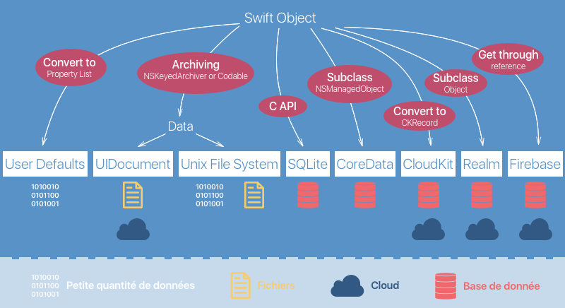

## Gérez une base de données relationnelle

### Ajoutez des relations
Notre application commence à bien tourner. Mais le problème principal n'est pas encore résolu ! **Les dépenses ne sont toujours pas persistantes**. Dès que je ferme mon application, je perds toutes les dépenses que j'ai rajoutées précédemment.

Dans cette partie, nous allons nous résoudre ce problème !

#### Création d'une deuxième entité

Pour sauvegarder nos dépenses, nous allons créer une deuxième entité `Spending` dans Core Data avec notre fichier `xcdatamodeld`.

En fait, c'est exactement la même chose que notre structure dans le fichier `Spending.swift` donc on va lui ajouter deux attributs `content` de type `String` et amount de type `Double`.

Je vous laisse créer cette entité avec ses attributs, c'est exactement la même chose que pour notre entité `Person`. Voici le résultat : 


Ensuite, comme pour `Person`, nous allons utiliser la génération de code. Choisissez l'option *Category/Extension*. Profitez-en pour indiquer aussi la valeur Current Product Module pour le réglage *Module* :


Maintenant que nous avons généré l'extension, il nous faut ajouter la classe correspondante. Dans `Spending.swift`, on a déjà une structure `Spending` :

```swift
struct Spending {
    var content: String
    var amount: Double
}
``` 

On va remplacer cette structure par une classe qui hérite de `NSManagedObject` et on peut supprimer les propriétés, car elles sont déjà créées pour nous dans l'extension générée automatiquement :

```swift
import CoreData

class Spending: NSManagedObject {
}
```

Jusque là, pas grand-chose de nouveau. C'est ce qu'on a déjà fait avec la classe Person. 

> **:information_source:** Je voudrais juste attirer votre attention sur un petit point. Si vous sélectionnez l'attribut `amount` et que vous allez dans l'inspecteur de donnée, je vous invite à cocher la case *Use Scalar Type*.
>
> 
>
> Si vous ne cochez pas cette case, la propriété `amount` générée automatiquement sera de type `NSNumber`, un vieux type hérité d'Objective-C. En la cochant, vous avez bien le type `Double`. Ceci est vrai pour tous les attributs qui ont un type numérique.

#### Un storyboard pour les données

Bien. Maintenant que nous avons nos deux classes, nous allons les relier ! En effet, chaque dépense doit être associée à un participant. Nous allons entrer dans le monde des **bases de données relationnelles** !

Nous pouvons faire ça sur l'interface que nous utilisons depuis le début. Mais il existe une deuxième façon de visualiser le fichier `xcdatamodeld`. Pour passer d'une visualisation à l'autre, il faut utiliser les boutons *Editor Style* en bas à droite.


La deuxième méthode de visualisation est une sorte de **storyboard de données** ! C'est très pratique à utiliser (en plus d'être beau :) ).


C'est sur ce storyboard que je vous propose de créer nos relations.

> **:warning:** J'insiste sur un point : **tout ce que vous pouvez faire dans la vue tableau fonctionne également dans la version storyboard et inversement**. 

#### Mise en place de la relation

Pour créer une relation, on va utiliser notre geste préféré avec Xcode : **le control-drag** ! Faites un control drag d'une entité à l'autre pour créer la relation.


Lorsque la relation est créée, une double flèche apparaît entre les deux entités et chaque entité a un nouvel attribut : `newRelationship`.

En double cliquant sur `newRelationship`, on peut modifier le nom de cette relation. Une personne peut avoir plusieurs dépenses, donc on va nommer cela `spendings` côté `Person`. En revanche une dépense est en générale faite par une seule personne, donc on va appeler ça `person` côté `Spending`.


#### Type de la relation

Lorsqu'on crée une relation, il faut ensuite définir son type. Une relation peut être de trois types différents :

- **Many to Many** : Chaque entité peut être reliée à plusieurs objets de l'autre entité.  
*Par exemple, un bien immobilier peut avoir plusieurs propriétaires et un propriétaire peut avoir plusieurs biens immobiliers.*
- **Many to One** : L'entité A ne peut être reliée qu'à un seul objet de l'entité B, mais l'entité B peut être reliée à plusieurs objets de l'entité A.  
*Par exemple, un joueur peut enregistrer différents scores dans un jeu, mais chaque score appartient à un seul joueur.*
- **One to One** : Chaque entité ne peut être reliée qu'à un seul objet de l'autre entité.  
*Par exemple, une voiture a une seule plaque d'immatriculation et une plaque d'immatriculation ne se rapporte qu'à une voiture.*

> **:information_source:** Vous avez sans doute déjà vu ça si vous avez déjà touché à d'autres bases de données.

Dans notre cas, une personne peut avoir plusieurs dépenses, mais chaque dépense n'est réalisée que par une seule personne. On est donc dans le cas *Many to One*.

Pour préciser cela dans Xcode, il faut sélectionner un des côtés de la relation, ouvrir l'inspecteur de modèle de donnée et modifier le réglage *Type* puis faire la même chose de l'autre côté de la relation.


`spendings` va être un tableau de `Spending`. Il va donc contenir plusieurs objets donc il faut choisir *To Many*.


`person` ne va contenir qu'un objet `Person` donc il faut choisir *To One*.

Pour que vous compreniez bien ce qu'il se passe ici, je vous montre ce que donnent les extensions générées automatiquement :

```swift
//  Spending+CoreDataProperties.swift

extension Spending {
    @nonobjc public class func fetchRequest() -> NSFetchRequest<Spending> {
        return NSFetchRequest<Spending>(entityName: "Spending")
    }

    @NSManaged public var amount: Double
    @NSManaged public var content: String?
    @NSManaged public var person: Person?
}
```

Côté `Spending`, on retrouve ici notre méthode `fetchRequest`. Puis on a nos deux attributs `amount` et `content` et enfin notre relation est simplement une variable de `person` type `Person?`.

```swift
//  Person+CoreDataProperties.swift

extension Person {
    @nonobjc public class func fetchRequest() -> NSFetchRequest<Person> {
        return NSFetchRequest<Person>(entityName: "Person")
    }
    @NSManaged public var name: String?
    @NSManaged public var spendings: NSSet?
}

extension Person {
    @objc(addSpendingsObject:)
    @NSManaged public func addToSpendings(_ value: Spending)

    @objc(removeSpendingsObject:)
    @NSManaged public func removeFromSpendings(_ value: Spending)

    @objc(addSpendings:)
    @NSManaged public func addToSpendings(_ values: NSSet)

    @objc(removeSpendings:)
    @NSManaged public func removeFromSpendings(_ values: NSSet)
}
```

Un peu plus de choses côté `Person`. On a toujours notre `fetchRequest` et notre attribut `name`. On a maintenant notre relation `spendings` de type `NSSet`.

> **:information_source:** Un set, c'est comme un tableau, sauf qu'il ne peut pas contenir deux fois le même objet. En swift, on utilise le type `Set`. `NSSet` est la version issue d'Objective-C.

Ensuite Xcode génère pour vous tout un tas de méthodes pour ajouter ou supprimer des objets `Spending` dans `spendings`.

### Règle de suppression

Enfin, il nous reste une dernière chose à faire pour paramétrer notre relation. Il faut préciser quelles sont **les règles de suppression** (*delete rules*). En effet, nos entités sont maintenant reliées donc qu'advient-il d'un objet `Spending` si l'objet `Person` relié est supprimé de la base ? Et inversement ?

Il existe quatre règles différentes :

- **No Action** : Il ne se passe rien.  
*Par exemple, si on supprime une personne, les dépenses liées à cette personne ne sont pas notifiées de la disparition de l'objet personne et continue de croire qu'elles y sont toujours reliées.*
- **Nullify** : Le destinataire de la relation a pour valeur `nil`. C'est le comportement par défaut.  
*Par exemple, si on supprime une personne, toutes les dépenses liées à cette personne vont avoir leur propriété `Person` qui vaudra nil.*
- **Cascade** : Tous les objets liés sont supprimés. Attention à celui-là !  
*Par exemple, si on supprime une personne, toutes les dépenses de cette personne sont supprimées de la base de données en même temps.*
- **Deny** : La suppression de l'objet ne peut pas avoir lieu tant qu'un autre objet lui est lié.  
*Par exemple, on ne pourra supprimer une personne que si cette personne n'a fait aucune dépense ou que toutes ses dépenses ont déjà été supprimées.*

Dans notre cas, si on supprime une personne, je pense que c'est logique que toutes ses dépenses soient supprimées. Donc on va choisir *Cascade*. De l'autre côté, si on supprime une dépense, on va simplement la retirer de la liste des dépenses de la personne.

Pour faire cela, il faut sélectionner un côté de la relation, aller dans l'inspecteur des données et modifier le réglage *Delete Rule*.


Et voilà ! Notre relation est parfaitement configurée !

#### En résumé
- On peut créer des relations entre les entités. Pour cela, on utilise le control drag d'une entité à l'autre.
- Il existe trois types de relations différents : *Many to Many*, *Many to One*, *One to One*.
- Il existe 4 règles de suppression : *No Action*, *Nullify*, *Cascade* et *Deny*.
- On peut préciser le type de la relation et les règles de suppression dans l'inspecteur de modèle de donnée.

Dans le prochain chapitre, nous allons utiliser notre nouvelle entité `Spending` pour sauvegarder nos dépenses ! 

### Sauvegardez vos dépenses
Dans ce chapitre, nous allons utiliser notre entité `Spending` pour sauvegarder les dépenses.

#### Supprimer la solution existante
Jusqu'à présent, le mécanisme qu'on utilisait pour sauvegarder les dépenses, c'était `SpendingService`. Cette classe utilisait le Singleton Pattern pour stocker les données dans un tableau `spendings`.

Bien sûr, maintenant on va utiliser Core Data, donc je vous invite à supprimer le fichier `SpendingService.swift`.

> **:warning:** Cela engendre un paquet d'erreurs, mais on va résoudre tout ça !

#### Sauvegarde de la dépense

Les dépenses sont ajoutées dans l'interface `AddSpendingViewController` lors de l'appui sur le bouton `Save`. Côté code, cela a lieu dans la méthode `save` que voici :

```swift
@IBAction func save() {
    guard let content = contentTextField.text,
        let amountText = amountTextField.text,
        let amount = Double(amountText) else {
            return
    }

    let spending = Spending(content: content, amount: amount)
    SpendingService.shared.add(spending: spending)

    navigationController?.popViewController(animated: true)
}
```

Cette méthode fait trois choses :

- Elle récupère les informations du formulaire.
- Elle crée et sauvegarde un objet `Spending` avec `SpendingService`.
- Elle renvoie l'utilisateur vers la liste des dépenses.

Bien sûr, nous allons modifier la deuxième étape. À la place, nous allons créer notre objet Core Data et le sauvegarder.

On va faire ça exactement comme pour `Person` tout à l'heure :

```swift
@IBAction func save() {
    guard let content = contentTextField.text,
        let amountText = amountTextField.text,
        let amount = Double(amountText) else {
            return
    }

    let spending = Spending(context: AppDelegate.viewContext)
    spending.content = content
    spending.amount = amount
    try? AppDelegate.viewContext.save()

    navigationController?.popViewController(animated: true)
}
```

On initialise notre objet en lui passant le contexte `AppDelegate.viewContext`, ensuite on remplit ses propriétés et on sauvegarde le contexte. Pas grand-chose de neuf ici.

#### Ajout de la relation
Notre objet `Spending` a une troisième propriété : `person`. Cette propriété fait le lien avec notre autre entité `Person`. Pour créer la relation, il nous suffit de donner à la propriété la personne choisie par l'utilisateur dans le Picker View.

On va récupérer cette personne dans une méthode privée à part :

```swift
private func getSelectedPerson() -> Person? {
    if persons.count > 0 {
        let index = personPickerView.selectedRow(inComponent: 0)
        return persons[index]
    }
    return nil
}
```

On la récupère dans notre tableau `persons` en utilisant l'index de la ligne sélectionnée par l'utilisateur dans le Picker View.

Ensuite, on va l'utiliser au moment de la création de notre objet `Spending` et le code complet donne :

```swift
@IBAction func save() {
    guard let content = contentTextField.text,
        let amountText = amountTextField.text,
        let amount = Double(amountText) else {
            return
    }

    let spending = Spending(context: AppDelegate.viewContext)
    spending.content = content
    spending.amount = amount
    spending.person = getSelectedPerson() // <===
    try? AppDelegate.viewContext.save()

    navigationController?.popViewController(animated: true)
}

private func getSelectedPerson() -> Person? {
    if persons.count > 0 {
        let index = personPickerView.selectedRow(inComponent: 0)
        return persons[index]
    }
    return nil
}
```

On utilise tout simplement la propriété `person`. On fait toujours de l'orienté objet classique !

> **:warning:** Il est important que vous sachiez que lorsqu'on relie deux objets, **il faut absolument que les deux objets soient manipulés par le même contexte**. Dans notre application, on utilise seulement `viewContext` donc on sait que notre objet `Person` est forcément dans le même contexte que `Spending`. Mais il pourra vous arriver de jongler entre plusieurs contextes, notamment si vous faites du multithreadind donc faites attention à ça.

Et voilà notre dépense est sauvegardée dans Core Data ! Dans le prochain chapitre, nous allons récupérer nos données pour les afficher dans notre liste de dépenses !

### Récupérez les dépenses
Nos dépenses sont maintenant sauvegardées dans Core Data. On va les récupérer pour les afficher dans notre liste.

#### Récupération des données
Vous savez déjà récupérer des données, on l'a fait avec `Person` précédemment. On va donc faire exactement et on va faire ça directement côté modèle dans notre classe `Spending`.

```swift
class Spending: NSManagedObject {
    static var all: [Spending] {
        let request: NSFetchRequest<Spending> = Spending.fetchRequest()
        guard let spendings = try? AppDelegate.viewContext.fetch(request) else { return [] }
        return spendings
    }
}
```

C'est exactement le même code que tout à l'heure pour la classe Person. On récupère toutes les dépenses dans une propriété statique calculée `all`.

#### Affichage des données
On n'a plus qu'à afficher les données dans la liste. Pour ça, on va commencer par récupérer les données dans une propriété `spendings` :

```swift
class ListViewController: UIViewController {
	// (...)
    var spendings = Spending.all
}
```

Et nous allons utiliser cette propriété pour remplir notre Table View :

```swift
extension ListViewController: UITableViewDataSource {
    func numberOfSections(in tableView: UITableView) -> Int {
        return 1
    }

    func tableView(_ tableView: UITableView, numberOfRowsInSection section: Int) -> Int {
        return spendings.count
    }

    func tableView(_ tableView: UITableView, cellForRowAt indexPath: IndexPath) -> UITableViewCell {
        let cell = tableView.dequeueReusableCell(withIdentifier: "SpendingCell", for: indexPath)

        let spending = spendings[indexPath.row]
        cell.textLabel?.text = spending.content
        cell.detailTextLabel?.text = "\(spending.amount) \(SettingsService.currency)"

        return cell
    }
}
```

Notre Table View affiche maintenant les données issues de Core Data !

Il nous reste une toute petite chose à faire. On veut que les données soient mises à jour dès qu'on revient sur la liste.

Pour cela, il faut réclamer nos données à chaque fois que la vue apparaît, juste avant le rechargement de la liste. On va donc faire ça dans `viewDidAppear` :

```swift
class ListViewController: UIViewController {
	// (...)

    override func viewWillAppear(_ animated: Bool) {
        super.viewWillAppear(animated)
        spendings = Spending.all
        tableView.reloadData()
    }
}
```

Et voilà ! Nos données seront récupérées sur la base à chaque fois que la vue apparaît !

#### Organiser les données

Tout ça, c'est très bien... mais on peut faire mieux ! Notre liste n'est pas du tout organisée. Tout est mélangé, il n'y a pas d'ordre. Ce serait quand même beaucoup mieux si on pouvait organiser nos dépenses par participants et par prix.

L'objectif est le suivant :


On va créer des sections qui seront organisées par participant. Et à l'intérieur, les dépenses vont être rangées par ordre croissant.

Pour pouvoir organiser la liste ainsi, il faut préalablement que les données le soient. Pour récupérer des données dans un ordre particulier, il faut utiliser la propriété `sortDescriptors` de `NSFetchRequest`.

Il faut fournir à `sortDescriptors` un tableau de `NSSortDescriptor`. `NSSortDescriptor` permet de préciser la clé avec laquelle on souhaite ranger les données. On l'utilise comme ceci :

```swift
NSSortDescriptor(key: "amount", ascending: true),
```

Ici, je demande de trier les données selon le prix des dépenses par ordre croissant. **Je peux aussi fournir comme clé l'attribut d'une autre entité à laquelle je suis relié** en utilisant le point :

```swift
NSSortDescriptor(key: "person.name", ascending: true),
```

Ici je demande de trier dans l'ordre des participants, en utilisant leur nom.

Maintenant, si je mets tout ça ensemble ça donne :

```swift
class Spending: NSManagedObject {
    static var all: [Spending] {
        let request: NSFetchRequest<Spending> = Spending.fetchRequest()
        
        // Je fournis un tableau de NSSortDescriptors
        request.sortDescriptors = [
            NSSortDescriptor(key: "person.name", ascending: true),
            NSSortDescriptor(key: "amount", ascending: true)
        ]
        guard let spendings = try? AppDelegate.viewContext.fetch(request) else { return [] }
        return spendings
    }
}
```

Ici je donne deux `NSSortDescriptor` à ma requête. Cela signifie que je veux d'abord que les données soient ordonnées par participant. Et ensuite pour chaque participant, je souhaite obtenir les données rangées par prix croissant. 

#### Organiser la liste

Comme je vais utiliser des sections dans ma liste pour afficher mes données, ce serait pratique si mes données étaient organisées selon des sections aussi. Pour cela, on utilise un tableau de tableau. En gros, le premier niveau contient les sections et le deuxième les cellules.

Pour l'instant, on a un tableau de `Spending`, donc l'objectif est d'en faire un tableau de tableau de `Spending` :


On va juste réorganiser les données à l'intérieur du tableau pour les mettre dans des tableaux par participant.

Je vous donne le code pour faire cela, ce n'est pas le plus important. Vous pouvez copier ceci dans votre fichier `Spending.swift` :

```swift
extension Array where Element == Spending {
    var convertedToArrayOfArray: [[Spending]] {
        var dict = [Person: [Spending]]()

        for spending in self where spending.person != nil {
            dict[spending.person!, default: []].append(spending)
        }

        var result = [[Spending]]()
        for (_, val) in dict {
            result.append(val)
        }

        return result
    }
}
```

Et ensuite, vous pouvez utiliser la propriété `convertedToArrayOfArray` dans votre code :

```swift
class Spending: NSManagedObject {
    static var all: [[Spending]] { // Pensez à changez le type ici !
        let request: NSFetchRequest<Spending> = Spending.fetchRequest()
        request.sortDescriptors = [
            NSSortDescriptor(key: "person.name", ascending: true),
            NSSortDescriptor(key: "amount", ascending: true)
        ]
        guard let spendings = try? AppDelegate.viewContext.fetch(request) else { return [] }
        return spendings.convertedToArrayOfArray // <===
    }
}
```

Maintenant, on peut modifier notre Table View pour prendre en compte cette nouvelle organisation de nos données :

```swift
extension ListViewController: UITableViewDataSource {
    func numberOfSections(in tableView: UITableView) -> Int {
        return spendings.count // <====
    }

    func tableView(_ tableView: UITableView, numberOfRowsInSection section: Int) -> Int {
        return spendings[section].count // <====
    }

    func tableView(_ tableView: UITableView, cellForRowAt indexPath: IndexPath) -> UITableViewCell {
        let cell = tableView.dequeueReusableCell(withIdentifier: "SpendingCell", for: indexPath)

        let spending = spendings[indexPath.section][indexPath.row] // <====
        cell.textLabel?.text = spending.content
        cell.detailTextLabel?.text = "\(spending.amount) \(SettingsService.currency)"

        return cell
    }
}
```

Ensuite, on peut modifier le titre de nos sections avec la méthode `titleForSection` de `UITableViewDataSource`.

```swift
func tableView(_ tableView: UITableView, titleForHeaderInSection section: Int) -> String? {
    // Je récupère le nom du participant
    guard let person = spendings[section].first?.person, let name = person.name else {
        return nil
    }

    // Je calcule le total de ses dépenses
    var totalAmount = 0.0
    for spending in spendings[section] {
        totalAmount += spending.amount
    }

    // Je renvoie le nom du participant avec le total de ses dépenses
    // dans la monnaie choisie par l'utilisateur
    return name + " (\(totalAmount) \(SettingsService.currency))"
}
```

Et voilà ! Vous pouvez tester et vos données maintenant sont bien organisées !

#### En résumé
- On peut utiliser la propriété `sortDescriptors` de `NSFetchRequest` pour ordonner les données.
- On peut lui passer plusieurs `NSSortDescriptor` pour un tri sur plusieurs niveaux. 

C'est tout pour notre démo ! On a fini notre application Cekikapeye ! Bravo !

Dans ce cours, je n'ai pas le temps de vous faire qu'une introduction de Core Data. Mais c'est une technologie très riche et très puissante avec plein de fonctionnalités. Donc j'ai décidé dans le prochain chapitre de vous donner plusieurs aperçus de ses nombreuses possibilités.

### Allez plus loin avec Core Data
Core Data est une technologie très puissante et dans ce chapitre, je vais essayer de vous donner un aperçu de quelques-unes de ses autres fonctionnalités.

#### Predicate
Pour l'instant, nous n'avons vu que des requêtes qui permettaient de récupérer seulement tous les objets d'une même entité. On a appris à les ordonner avec `NSSortDescriptor`. Mais je ne vous ai pas montré comment filtrer les données.

En effet, on n’a pas toujours besoin de tous les objets. Parfois on n'en veut que quelques-uns choisis selon certains critères. Par exemple dans notre application, on pourrait ne vouloir afficher que les dépenses d'une seule personne.

Pour faire cela, on utilise ce qu'on appelle les **predicate**. `NSFetchRequest` a une propriété `predicate` de type `NSPredicate` qui s'utilise ainsi :

```swift
let request: NSFetchRequest<Spending> = Spending.fetchRequest()
request.predicate = NSPredicate(format: "person.name == %@", "Jean-Pierre")
``` 

Les predicate ont une syntaxe très particulière qui se veut la plus proche possible de l'anglais. La nature du filtre est précisée entre les guillemets et lors de l'exécution le `%@` sera remplacé par la valeur indiquée ensuite : "Jean-Pierre".

Voici d'autres exemples de predicate :

```swift
// Récupérer les dépenses dont le montant est inférieur à 100
NSPredicate(format: "amount < %@", 100)

// Récupérer les dépenses dont la description contient le mot pizza
NSPredicate(format: "content CONTAINS %@", "pizza")
```

Vous allez vite voir que vous pouvez faire des tris très puissants en utilisant des predicate.

> **:information_source:** Vous pouvez trouver un guide complet de la syntaxe des predicate [ici](https://academy.realm.io/posts/nspredicate-cheatsheet/).

#### NSFetchResultController
Deuxième arrêt : `NSFetchResultController` !

Core Data est une technologie d'Apple et donc elle s'intègre très bien avec l'écosystème iOS. Dans cette optique, `NSFetchResultController` facilite l'intégration entre Core Data et une Table View.

`NSFetchResultController` fonctionne très simplement. Il suffit de lui passer une requête `NSFetchRequest` et il va s'occuper de l'exécuter, de récupérer les données et de remplir la Table View.

Et là où c'est vraiment intéressant, c'est que `NSFechResultController` peut écouter les modifications qui ont lieu sur la requête : y a-t-il de nouveaux objets ? Certains ont-ils été modifiés/supprimés, etc. ? Si c'est le cas, il recharge automatiquement les données en mettant à jour la Table View.

C'est extrêmement pratique !

> **:information_source:** Je vous suggère [ce tutoriel](https://cocoacasts.com/populate-a-table-view-with-nsfetchedresultscontroller-and-swift-3) si vous souhaitez creuser le sujet !

#### Undo / redo
Souvent dans une application, on vous propose d'annuler votre dernière action. C'est le fameux <keyboard>cmd + z<keyboard> sur le Mac.

Avec Core Data, vous pouvez implémenter ce genre de fonctionnalité très simplement grâce au `UndoManager`.

`undoManager` est une propriété de type `UndoManager` de `NSManagedObjectContext`. Cette propriété enregistre toutes les modifications qui ont eu lieu dans le contexte. Via la méthode `undo`, vous pouvez annuler la dernière modification. Via la méthode `redo`, vous pouvez rétablir la dernière modification.

Je vous invite à jeter un oeil à [cette propriété](https://developer.apple.com/documentation/coredata/nsmanagedobjectcontext/1506663-undomanager) qui peut s'avérer sacrément utile !

#### Migration
Le dernier arrêt de ces aperçus n'est pas vraiment une fonctionnalité, mais plutôt quelque chose que vous devez absolument savoir sur Core Data avant d'envoyer vos applications à vos utilisateurs.

##### Imaginons la situation suivante.

Vous avez votre superbe application qui utilise Core Data. Vous avez travaillé dessus depuis 6 mois et vous envoyez la version 1.0 de votre application pour la première fois sur l'App Store.

C'est un succès délirant et vous avez des milliers d'utilisateurs. Forcément, vous ne voulez pas en rester là et vous décider de rajouter de nouvelles fonctionnalités dans une version 1.1. Ces nouvelles fonctionnalités impliquent des changements dans votre modèle de donnée Core Data. Vous ajoutez une entité, en supprimez une autre et en modifiez une troisième.

Vous envoyez la mise à jour à tous vos utilisateurs. Ils l'installent tous et l'application plante ! Votre application ne fonctionne plus sur aucun iPhone ! Ils désinstallent tous votre application, vous avez une mauvaise presse, c'est la fin de l'aventure...

##### Que s'est-il passé ?

Lorsque les utilisateurs ont installé la version 1.0, c'était la première installation donc la base de données Core Data était vide. Au fur et à mesure de l'utilisation de l'application, ils ont rempli leur base de données **selon le modèle de donnée définie dans la version 1.0**.

Ensuite, ils ont installé la version 1.1. Et c'est ici que le problème intervient. La base de données est toujours remplie selon le modèle de donnée de la version 1.0. Mais le modèle de donnée a changé ! Donc les nouveaux objets vont être ajoutés selon un modèle différent.

Or **une base de données ne sait pas gérer deux modèles différents** donc l'application plante. 


##### La solution

La solution, c'est **la migration**. Le principe, c'est qu'on va modifier tous les objets de la base de données pour qu'ils se conforment au nouveau modèle.

Une fois la migration terminée, la base est conforme au nouveau modèle. Et on peut ajouter des objets, la base restera homogène.

Pour creuser ce sujet et voir concrètement comment faire une migration, je vous propose [ce tutoriel](https://www.raywenderlich.com/174025/lightweight-migrations-in-core-data-tutorial). 

> **:information_source:** La migration n'est pas une spécificité de Core Data, la plupart des bases de données, dès qu'on souhaite les faire évoluer, sont confrontées à ce problème.

### Conclusion
Félicitations ! Vous êtes venus à bout de ce cours sur la persistance des données ! Je sais que ce n'est pas toujours le sujet le plus attendu, car on ne touche pas à l'interface utilisateur et les fonctionnalités que ça apporte ne sont pas très visibles.

Mais c'est un sujet essentiel et aucune application digne de ce nom ne peut se permettre de faire l'impasse dans la persistance, sans quoi de nombreuses fonctionnalités ne pourraient pas exister.

#### En résumé
On a parlé ensemble de toutes les techniques principales de persistance en iOS que je vous résume dans le schéma ci-dessous :



Chacune a ses spécificités et son intérêt et il est important que vous les connaissiez toutes pour faire le bon choix pour votre application. Et au minimum, je vous suggère de **jeter un oeil à Realm et Firebase** qui sont avec Core Data les deux plus puissantes et ont l'avantage de pouvoir être utilisées dans le cloud.

J'ai tenu à vous détailler le fonctionnement de User Defaults. C'est de loin la solution la plus simple et je pense qu'après vous être bataillé avec Core Data, vous le comprenez. **User Defaults fonctionne comme un dictionnaire persistant,** mais ne rends que de petits services, n'allez pas gérer toutes vos données avec User Defaults !

C'est la raison pour laquelle nous nous sommes intéressés à **Core Data, une base de donnée locale munie d'une API orientée objet**. Une fois passées les premières difficultés notamment liées à la compréhension du fonctionnement interne de Core Data, vous avez, je l'espère, réalisé que ce n'était plus compliqué que de manipuler des objets.

C'est la raison pour laquelle j'insiste : de tous les chapitres sur Core Data, le plus important, c'est le premier de la partie 3 dans lequel nous découvrons tous les rouages de Core Data. Car **ce sont ces connaissances théoriques qui formeront un socle solide pour les connaissances pratiques** qu'on a vu ensemble. N'hésitez pas à revenir dessus !

#### Et maintenant ?

Si vous voulez aller plus loin, les possibilités sont nombreuses ! Je vous invite à essayer les autres technologies de persistance, vous verrez que certaines problématiques se recoupent. Cela vous permettra de prendre de la hauteur sur le sujet des bases de données en général et de ne pas avoir peur de passer d'une technologie à l'autre.

> **:information_source:** Vous avez dans la première partie de ce cours, des liens vers de nombreux tutoriels qui vous permettront de démarrer.

Vous pouvez aussi plus loin Core Data et notre application Cekikapeye. Pourquoi ne pas rajouter un filtre à notre liste de dépenses pour vous entraîner avec les predicate ? Ou ajouter une fonctionnalité d'annulation pour tester l'`UndoManager` ?

Bref, amusez-vous !

En attendant, je n'ai plus qu'à vous laisser avec le mot de la fin, et le mot de la fin évidemment c'est...

