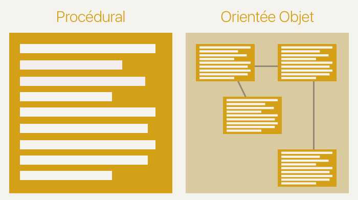
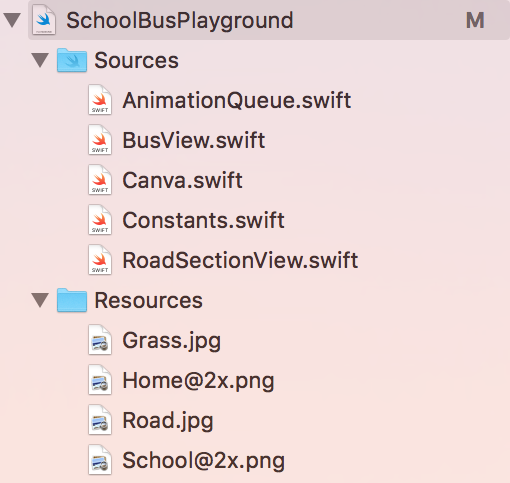
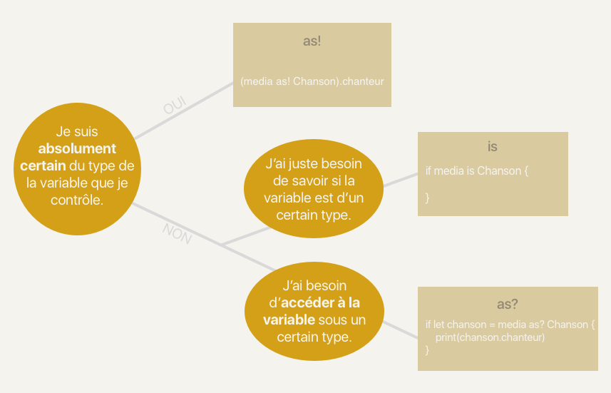

# La Programmation Orientée Objet avec Swift

## Découvrez la programmation orientée objet

<!--
########
PARTIE 1
########
-->

### Tirez le meilleur de ce cours
<!--
####
P1C1
####
-->
Bonjour et bienvenue dans ce cours sur la programmation orientée objet (ou POO pour les intimes) ! Dans ce cours, nous allons découvrir toute la puissance de la POO et comment l'implémenter avec Swift !

> **:warning:** Vous ne pourrez pas suivre ce cours sans une bonne maîtrise des bases de Swift. Par chance, c'est justement le propos de [ce cours](https://openclassrooms.com/courses/apprenez-les-fondamentaux-de-swift) ! Donc, suivez-le si besoin et revenez ici ensuite !

#### Le bus scolaire
Dans ce cours, nous allons utiliser le Playground. Et vous allez voir que nous pouvons faire des choses très sophistiquées avec le Playground !  
En utilisant la programmation orientée objet et la puissance du Playground, vous allez réaliser une animation qui décrit le comportement d'un bus scolaire.


Pour cela, nous allons passer par plusieurs étapes :
- Nous allons créer la route
- Nous allons faire rouler le bus sur la route
- Nous allons ajouter des maisons et une école
- Nous allons programmer le bus pour qu'il s'arrête à chaque maison pour récupérer les enfants et les déposer ensuite à l'école

Vous êtes prêts ?

> **:question:** Euh oui... Mais... On ne va pas faire une application ?

Oui je me doute que si vous êtes ici, c'est que vous avez hâte de faire une application ! Mais je vous demande encore un peu de patience parce que faire des applications iPhone demande une bonne maîtrise de Swift en général et de la POO en particulier.

> **:information_source:** Si vous êtes trop impatient, je vous ai quand même concocté un  [petit cours](https://openclassrooms.com/courses/introduction-a-ios-plongez-dans-le-developpement-mobile) dans lequel on fait une application à partir de 0. Mais si vous voulez devenir de vrais développeurs iOS, il faudra que vous vous attaquiez à la POO tôt ou tard !

Et puis réjouissez-vous, dans ce cours vous allez déjà réalisé un programme visuel que vous pourrez montrer à vos amis ! ;)

##### La POO

> **:question:** Bon, c'est bien beau cette histoire de bus, mais pourquoi devons-nous apprendre la programmation orientée objet ?

Il y a de très nombreuses raisons. Mais je vous propose pour le moment ces deux-là :

##### 1. La POO est un concept central en programmation
Selon le [classement PYPL](http://pypl.github.io/PYPL.html), les 10 langages de programmation les plus populaires sont les suivants :
1. Java
2. Python
3. PHP
4. C#
5. JavaScript
6. C++
7. C
8. Objective-C
9. R
10. Swift

Parmi eux, seul le langage `C` n'est pas orienté objet. Et la majeure partie de la suite de cette liste est également orientée objet. Autrement dit, quel que soit votre avenir dans la programmation, il y a de très très grandes chances que vous soyez confronté à l'orientée objet.

##### 2. La POO est au coeur d'iOS
Mais peut-être que vous vous moquez de tous ces autres langages. Après tout vous êtes là pour apprendre le Swift et pas le Python ! Et même sans doute que vous êtes là pour apprendre à programmer des applications iPhone. Et bien vous allez être servi en POO.

La POO est au coeur d'iOS. Car tout est objet en iOS. Bien sûr nous verrons en détail ce qu'est un objet en POO dans les prochains chapitres, mais laissez-moi vous donner quelques exemples d'objets en iOS :
- Un bouton sur lequel on peut appuyer est un objet
- Une carte est un objet
- L'écran est un objet
- Un appui sur l'écran est un objet
- Une préférence utilisateur est un objet
- Une notification est un objet

En fait cette liste est interminable, car en iOS, TOUT EST OBJET ! C'est votre tout premier aperçu de ce qu'est un objet, mais ne vous inquiétez pas nous allons voir çà en détail au fur et à mesure.

Et ce dès le prochain chapitre qui est dédié à l'histoire de la POO !

#### En résumé
- Dans ce cours, nous allons faire un programme qui crée une animation. Cette animation met en scène un bus scolaire.
- La POO est incontournable en programmation, car la plupart des langages l'utilisent.
- La POO est au coeur d'iOS et tout développeur iOS qui se respecte doit maîtriser ce concept !

### Retracez les origines de la POO
<!--
####
P1C2
####
-->
La programmation orientée objet est une technique de programmation incontournable aujourd'hui comme nous l'avons vu dans le chapitre précédent. Pour bien comprendre ce qu'elle est et ce qui a fait son succès, il me semble pertinent de savoir d'où elle vient !


#### Les débuts

Tout commence un matin de 1960. Ce jour-là Ivan Sutherland, un étudiant en thèse au MIT à Boston, se réveille avec une grande idée. Il souhaite créer un logiciel qui permet de dessiner sur un ordinateur. Pour rappeler un peu le contexte, on est à une époque où la souris n'existe pas et les interfaces graphiques des ordinateurs non plus. Tout ou presque est clavier et texte en informatique.

Sutherland va créer pendant sa thèse le logiciel SketchPad. Ce logiciel permet à l'aide d'un stylet de lumière de dessiner avec l'aide de l'ordinateur des formes simples comme des triangles, carrés, cercles, etc. Ce projet a posé les bases de la création assistée par ordinateur (CAO).


Mais ce projet fait aussi partie des exemples fondateurs de la POO. Pourquoi ? Et bien parce qu'en POO, on crée des objets qui contiennent des propriétés et une logique propre. Et souvent ces objets représentent des éléments concrets comme un utilisateur, un article ou un panier. Et dans le cas de SketchPad, Sutherland a créé des objets pour représenter un triangle, un carré, un rond, etc. Et c'est ce qui a permis à Sutherland de programmer SketchPad. Car dans son code au lieu de manipuler une variable hauteur et une autre variable largeur pour représenter un rectangle, il pouvait manipuler directement un objet rectangle dans son programme.

#### La formalisation

Son projet et quelques autres ont influencé le langage de programmation Simula qui en 1967 a connu une mise à jour majeure Simula 67 (oui, ils se sont creusé la tête sur le nom de la mise à jour :D). Cette mise à jour incluait le principe d'objet au coeur du programme.

Dans les années 70s, l'entreprise Xerox à qui on doit l'invention de la souris et de l'interface graphique notamment planche sur l'ordinateur personnel ou _personnal computer_ et oui votre bon vieux PC :O ! Ils veulent créer un ordinateur que tout le monde pourrait facilement utiliser grâce à une interface graphique, une souris, des fenêtres, etc. Et pour représenter tous ces éléments à l'écran et soutenir la logique de leur affichage, une équipe emmenée par Alan Kay a créé le langage SmallTalk qui s'inspire beaucoup de Simula et qui pour beaucoup a posé les derniers jalons de de la POO telle qu'on l'utilise aujourd'hui !


#### La généralisation

Leurs travaux ont été publiés largement en 1981 et ils ont donné naissance à de grands langages orientés objet comme :
- Objective-C : Oui le langage qui permet encore aujourd'hui de développer des applications iPhone est l'un des pionniers de l'orienté objet.
- C++ : Le dérivé du C orienté objet
- Eiffel : Cocorico ! Ce langage développé par le français Bertrand Meyer est du pur orienté objet.

> **:information_source:** Le langage Eiffel a été nommé bien sûr à partir de Gustave Eiffel, concepteur célèbre de la tour Eiffel, car la tour a été montée dans les délais en respectant le budget. Et c'est la promesse du langage Eiffel pour les grands projets logiciels.

#### Alors, alors...

À la lumière de cette brève histoire de la POO, on peut retenir 3 choses :
1. La POO s'est installée au fur et à mesure, car elle a permis de simplifier la programmation. C'est ce que dit le langage Eiffel, mais bien avant lui, c'est la raison pour laquelle certains langages ont été développés comme le SmallTalk.
2. L'origine de la POO est intimement liée à l'interface graphique comme le montrent l'exemple de SketchPad ou les prémices de l'ordinateur personnel. Car la POO permet non plus de manipuler des types standard comme des entiers ou des chaînes de caractères, mais des objets plus complexes comme des ronds, des fenêtres ou des utilisateurs. En POO, on crée donc des objets qui représentent des choses intelligibles. Et quoi de plus intelligible que ce que l'on peut voir !
3. L'histoire de la POO a accompagné les grandes révolutions de l'informatique moderne comme les interfaces graphiques ou l'ordinateur personnel. Elle est sans doute ce qui a permis toutes ces révolutions et cela prouve qu'elle est absolument incontournable.

Alors, allons-y ! Découvrez la POO dans le prochain chapitre !

### Découvrez la POO
<!--
####
P1C3
####
-->

> **:question:**, MAIS C'EST QUOI LA POO ?

Alors nous y voilà ! Je pense que les parties précédentes vous ont un peu mis sur la piste, mais dans ce chapitre nous allons voir en détail ce qu'est la POO.

#### La programmation procédurale et la POO

Pour bien comprendre la POO, essayons de comprendre ce qu'est la programmation procédurale.

> **:question:** Attends, on ne sait déjà pas ce qu'est la POO ? Pourquoi me parles-tu d'autre chose ?

N'ayez crainte, je vous parle seulement de ce que vous savez déjà. En effet, aujourd'hui si vous deviez créer un programme, vous écririez une suite d'instructions les unes à la suite des autres. Éventuellement, vous créeriez des fonctions qui vous permettront de réutiliser du code et de simplifier la lecture de votre programme. Et bien on appelle çà de la **programmation procédurale** ! Vous voyez, rien de nouveau ;) !

En programmation procédurale, le meilleur moyen que l'on a pour organiser notre code, ce sont donc les fonctions. C'est un petit peu léger...

Avec l'orientée objet, nous allons pouvoir aller beaucoup plus loin en manipulant des objets. Pourquoi beaucoup plus loin ? Et bien parce qu'un objet, techniquement, c'est un groupe de fonctions et de variables ! Donc on va pouvoir **organiser notre code avec des groupements de fonctions et variables**.

#### Qu’est-ce qu’un objet ?
Et bien tout simplement, un objet c'est **un petit paquet de variables et de fonctions**.

Prenons l'exemple du jeu "Qui est-ce ?".


> **:information_source:** Dans ce jeu, chaque joueur a un plateau qui présentent 24 personnages. Chaque joueur choisit un personnage. Et chacun à son tour, les joueurs vont poser des questions pour deviner le joueur de l'autre.

Voici comment nous nous y prendrions si on voulait programmer ce jeu en orienté objet. Tout d'abord il faudrait décrire le jeu avec des objets. Alors quels objets avons-nous ?

Nous avons bien sûr des personnages. Voilà un premier objet. Ces personnages ont tous des propriétés distinctives. C'est grâce à ces propriétés que, dans le jeu, nous allons pouvoir éliminer des personnages et trouver celui choisi par le joueur adverse.

Par exemple, les personnages ont comme propriétés :
- Une couleur de cheveu
- Une paire de lunettes ou non
- Un sexe
- Une barbe ou non
- Une moustache ou non
- Un nom

L'objet Personnage va donc contenir 6 variables qu'on appelle ici en POO des **propriétés**.

Nous avons également un objet Plateau qui contient tous les personnages.

On peut également penser à un objet Joueur qui aurait les propriétés suivantes :
- Le personnage qu'il a sélectionné
- Son plateau de jeu
- S'il a gagné ou non

Enfin, on pourrait avoir un objet Partie qui aurait lui comme propriétés :
- Les joueurs
- Le joueur dont c'est le tour
- Si la partie est finie ou non

Avec ces 4 objets : Personnage, Plateau, Joueur et Partie. Nous avons décrit très précisément les éléments qui composent le jeu. En programmation procédurale, ceci aurait été simplement une longue liste de variables. En POO, on peut classifier ces informations par objet.

> **:information_source:** Par ailleurs, vous constatez qu'un objet peut être quelque chose de très concret comme un personnage, mais aussi de plus abstrait comme une partie. L'essentiel c'est que cela forme une unité qui ait du sens.

Mais un objet, ce n'est pas que des propriétés. Comme je vous le disais plus haut, c'est aussi des fonctions. Les fonctions dans un objet, on les appelle les **méthodes**. Les méthodes, c'est ce que l'objet peut faire, ses actions.

Par exemple, l'objet Joueur pourrait avoir une méthode `poserUneQuestion` pour en savoir plus sur le joueur adverse. Et ensuite il pourrait avoir une méthode `éliminer` pour éliminer certains joueurs et enfin une méthode `deviner` pour deviner le personnage choisi par l'adversaire.

L'objet Partie pourrait avoir une méthode `démarrer` pour lancer la partie, remettre les personnages en place et définir le personnage sélectionné par chaque joueur.

Dans les méthodes des objets vont se dérouler la logique de notre programme. Cela veut dire qu'au lieu que notre programme soit une suite d'instructions, notre programme va être la combinaison de plusieurs objets qui vont interagir ensemble.



#### À quoi ça sert ?
Les objets sont extrêmement pratiques. Un programmeur sans objets, c'est comme un jedi sans sabre laser !


##### Cacher une implémentation
Mettons que l'on ait un objet Voiture. Une voiture contient un mécanisme très compliqué. Le moteur qui brûle de l'essence. Cela crée de la chaleur. Cette énergie thermique est transformée en énergie mécanique. Le mouvement arrive jusqu'aux roues et la voiture avance. Toute cette logique est _abstraite_ dans une voiture, vous n'avez pas besoin de la connaître. On l'a déjà fait pour vous. La seule chose que vous avez à votre disposition pour effectuer cette action, c'est la pédale de l'accélérateur. Tout le reste est caché sous le capot et si le constructeur a bien fait son travail, vous n'avez pas à vous en occuper.

Un objet en POO c'est exactement la même chose. Un objet peut être excessivement complexe et finalement et vous allez pouvoir l'utiliser au travers de seulement quelques méthodes très simples.

##### Représenter un concept
Un objet vous permet de représenter un concept et de le manipuler en tant que tel. Par exemple dans notre "Qui est-ce ?", nous n'avons pas une grande liste de variables et de fonctions mélangées. Nous avons simplement 4 objets très clairs qui nous permettent d'organiser simplement et facilement notre logique et qui représentent des concepts simples structurant le jeu.

#### En résumé
- La programmation procédurale, c'est ce que vous connaissez : la programmation à base de variables et de fonctions.
- La programmation orientée objet se base sur le principe d'objets. Un objet c'est un ensemble de variables (appelée **propriétés**) et de fonctions (appelée **méthodes**). Cet ensemble décrit un concept unique et cohérent.
- Un objet permet de :
	- représenter un concept clairement
	- cacher une implémentation

### Designez vos premiers objets
<!--
####
P1C4
####
-->
Maintenant que vous avez une première idée du concept d'objet, nous allons pouvoir concevoir les objets de notre programme.

#### Découvrir le projet

Pour cela, je vous propose sans plus attendre de découvrir le projet sur lequel vous allez travailler. Le projet est disponible sur Github [ici](https://github.com/AmbroiseCollon/SchoolBusPlayground). Je vous invite à télécharger le projet sur votre Mac.

> **:information_source:** Vous pouvez également travailler à partir d'un fork du projet si vous êtes à l'aise avec Git. Ce que je vous encourage à faire.

Une fois le projet téléchargé, vous pouvez ouvrir le fichier `SchoolBusPlayground.playground`. Et vous devriez arriver sur ceci :


> **:warning:** Si vous ne voyez pas exactement ça, placez-vous en mode assistant en utilisant ce bouton : 

Regardons un peu ce que l'on a. Nous avons tout d'abord sur la droite une étendue de pelouse sur laquelle se trouve un bus. Cela c'est notre **canva**. C'est sur ce canva que nous allons dessiner notre route et déplacer notre bus.

> **:information_source:** Comme nous l'avons appris avec l'histoire de la POO, la POO çà se comprend bien quand c'est visuel. C'est la raison pour laquelle j'ai choisi de vous proposer un rendu visuel de notre programme.

Voyons maintenant ce qu'il se passe côté code. Tout d'abord nous avons quatre lignes de code que je vous invite à ignorer. Elles permettent seulement d'initialiser le canva. Ensuite la documentation nous présente 5 fonctions réparties en 2 catégories :
- 3 qui concernent la route, ces fonctions permettent de dessiner des sections de route
- 2 qui concernent le bus, ces fonctions permettent de faire avancer ou de faire marquer un stop au bus.

Je vous invite à essayer les fonctions proposées pour comprendre un peu leur fonctionnement. Par exemple, vous pouvez écrire :
```swift
canva.createRoadSection()
canva.createRoadSection()
canva.createRoadSection()
canva.createHomeRoadSection()
canva.createRoadSection()
canva.createSchoolRoadSection()
```

Dans ce code, nous créons sur le canva trois sections de route normale puis une qui contient une maison, puis une normale et enfin une qui contient une école. Cet exemple couvre les trois exemples de création de route.

**Le but de notre programme va être de déplacer le bus le long de la route en suivant 2 règles :**

- Il doit s’arrêter à chaque maison pour récupérer des enfants
- Il doit s’arrêter à chaque école pour déposer tous les enfants dans le bus.

Le programme que nous allons construire doit pouvoir fonctionner, quelle que soit la route que nous allons dessiner.

Maintenant, à vous de jouer ! Essayer d'utiliser les deux fonctions restantes pour déplacer le bus. Il doit avancer jusqu'à l'école en marquant un arrêt à la maison pour récupérer les écoliers et à l'école pour les déposer.

```swift
// Ne regardez pas la correction !


canva.moveBusForward()
canva.moveBusForward()
canva.moveBusForward()
canva.stopBus()
canva.moveBusForward()
canva.moveBusForward()
canva.stopBus()
```
Et voilà ! Vous savez utiliser toutes les fonctionnalités du canva. Nous allons construire tout notre programme à partir de ces 5 fonctions. N'hésitez pas à jouer un peu avec pour bien vous familiariser avec son fonctionnement.

> **:information_source:** A chaque changement dans votre code, le Playground relance le canva. Si vous souhaitez le relancer manuellement pour revoir votre animation, vous pouvez utiliser le raccourci clavier : <kbd>cmd</kbd> +<kbd>R</kbd>.

#### Comprendre notre Playground
Si vous avez suivi le cours précédent comme suggéré, vous êtes déjà à l'aise avec un certain nombre de fonctionnalités du Playground, mais dans ce cours nous poussons plus loin les capacités du Playground. Laissez-moi en quelques mots vous en présenter les fonctionnalités dont nous allons profiter dans ce cours.

> **:information_source:** Elles ne vous seront pas précisément utiles dans ce cours. Mais le Playground est un des outils extrêmement pratiques d'Xcode alors autant apprendre à le maîtriser. En effet, pour la suite de vos travaux sur iOS, je vous encourage grandement à inclure cet outil dans votre cycle de développement.

##### La documentation

Il est possible que dans le texte, vous voyiez plutôt ceci :


Les commentaires en vert qui commencent par `/*:` sont un moyen d'écrire de la documentation dans le Playground. Cela est utile notamment pour agrémenter le code d'instructions facilement lisibles ce qui est bien pratique dans notre cas. Si vous voulez en savoir plus sur le format de la documentation, vous pouvez aller [ici](https://developer.apple.com/library/content/documentation/Xcode/Reference/xcode_markup_formatting_ref/).

Pour afficher correctement la documentation, vous pouvez cliquer dans le menu en haut sur `Editor` puis `Show Rendered Markup`.

Si un jour, vous souhaitez utiliser le Playground pour une démonstration ou pour expliquer quelque chose, soyez sûr d'utiliser la documentation du Playground. Certaines personnes ont même écrit [des livres](https://github.com/uraimo/Awesome-Swift-Playgrounds) avec le Playground.

##### Les live view

Les live view, c'est ce que vous voyez sur la droite en mode assistant. C'est notre canva. En effet, c'est un objet vue, tel qu'il existe sur iOS dans lequel on peut glisser ce que l'on souhaite.

Ces vues permettent d'avoir un rendu visuel animé ou non de ce que l'on souhaite montrer. Cela pourra vous être utile lorsque vous souhaiterez créer des composants customisés dans iOS (comme des boutons, des switch, des listes, etc.). Vous pourrez les créer en utilisant une live view pour voir instantanément le rendu. Et lorsqu'ils sont prêts, vous n'aurez plus qu'à copier le code dans votre application.

##### Les sources et ressources

Si vous ouvrez le navigateur - le panneau de droite, vous trouverez les sources et ressources du projet.



**Les sources**  
Les sources d'un projet permettent de cacher une implémentation à l'utilisateur du Playground. Par exemple, ici, j'ai mis l'ensemble de ce qui concerne le canva et ces animations dans les sources.

L'autre avantage d'écrire du code dans les sources, c'est qu'il n'est évalué qu'une fois au lancement du Playground et non à chaque fois que le code dans le Playground est modifié. Cela permet de gagner en performance. Le Playground ne doit pas tout recalculer à chaque fois.

**Les ressources**  
Dessous, vous trouverez les ressources, c'est ici que l'on enregistre les fichiers dont le Playground va avoir besoin pour s'exécuter. Dans notre cas, on y trouve les images qui permettent de dessiner notre canva. Mais on aurait pu y mettre des pistes audios, des vidéos, des données, bref tout ce qui n'est pas du code !

De la même manière, ces ressources ne sont chargées qu'au lancement du Playground.

#### Concevoir nos objets

Maintenant que le décor est bien planté, nous allons commencer à réfléchir un peu. Comment allons-nous organiser notre code ?

Reprenons le même genre de raisonnement que pour le jeu "Qui-est-ce ?" et essayons de découper en plusieurs objets notre code.

##### Les propriétés

Tout d'abord, commençons par le plus évident : le bus. Nous allons donc avoir un objet `Bus` qui va avoir quelques propriétés comme :
- le nombre de sièges
- le nombre de sièges occupés
- le nom du chauffeur

Ensuite nous allons avoir la route. La route c'est un peu plus subtil. Si on regarde les méthodes proposées par le canva, on crée la route par section. Donc la route c'est la combinaison de plusieurs sections de route qui s'enchaîne. Certaines ayant une maison, d'autre une école et enfin d'autres rien.

On a donc un objet `Route` qui a une propriété :
- un tableau de section de routes

Et donc nous avons un dernier objet qui est la `Section De Route`. Cet objet a donc 3 types différents. Et nous verrons comment les différentier avec l'héritage en partie 3 de ce cours.

##### Les méthodes
Mais un objet, comme vous le savez désormais, a des propriétés qui décrivent ce qu'il est, mais aussi des méthodes qui décrivent ce qu'il fait.

À première vue, une route ou une section de route, ça ne fait pas grand-chose... En revanche, un bus ça en fait !

Donc nous allons a priori avoir au moins 2 méthodes :
- avance
- marque un arrêt

L'analyse que nous venons de faire s'appelle un **diagramme de classe**.


> **:warning:** Dans notre analyse, il y a quelques oublis volontaires pour ne pas gâcher la surprise de nos futures découvertes ;) !

#### En résumé
- Le projet contient un Playground dans lequel est présenté un canva. Ce canva a 5 fonctions qui nous permettent de :
	- créer une section de route avec ou sans école ou maison
	- faire avancer le bus
	- faire marquer un arrêt au bus
- Dans ce cours, nous découvrons 3 fonctionnalités avancées du Playground :
	- Les live view
	- La documentation
	- Les sources et ressources
- Dans notre diagramme de classes, nous avons identifié 3 objets que nous allons créer :
	- Bus
	- Road
	- RoadSection

## Développez en orienté objet
<!--
########
PARTIE 2
########
-->

### Créez votre première classe

Je suppose que vous avez maintenant hâte de vous lancer dans le code orienté objet. Alors j'ai le plaisir de vous annoncer que...


#### Déclarer une classe

Il faut d'abord commencer par le commencement et le commencement de la POO en Swift ce sont les classes. Une classe, c'est ce qui va nous permettre de définir nos objets.
En Swift, pour écrire une classe, on utilise la syntaxe suivante :

```swift
class NomDeLaClasse {
	// Ici viendra le contenu de la classe
}
```

Par exemple, on a vu dans notre analyse de classes que l'on souhaite créer trois classes : Bus, Road et RoadSection. Pour faire cela, nous allons donc écrire simplement :

```swift
class Bus {

}

class Road {

}

class RoadSection {

}
```

Et voilà ! Il ne suffit de rien de plus pour créer nos classes ! Bien sûr, pour le moment, elles sont relativement vides, mais elles vont s'épaissir au fur et à mesure.

> **:information_source:** Vous remarquez que le nom d'une classe contrairement aux variables commence par une **majuscule**. C'est une convention que vous devez suivre.

> **:question:** Mais on en fait quoi de ces classes ?

Évidemment pour le moment ça ne paraît pas hyper impressionnant. Mais vous allez voir tout de suite que c'est plus puissant qu'il n'y parait.

#### Les classes et les types

Vous vous souvenez des types ? Vous en connaissez un petit paquet maintenant. Voici un petit schéma pour vous les remettre en tête.


Jusqu'à présent, vous savez faire des programmes en manipulant les types ci-dessus. À partir de maintenant, vous allez aussi travailler avec les types que vous avez créés !

> **:question:** Comment ça les types que nous avons créés ?

Eh oui ! Les classes Bus, Road et RoadSection sont des types. Exactement de la même façon que Int, String et Bool. Donc la bonne surprise de ce cours, c'est que vous savez maintenant créer des types !

#### Instancier les classes
Maintenant nous sommes en terrain conquis, les types vous savez ce que c'est. Donc vous savez les utiliser.

Vous vous souvenez que pour créer des variables de types entiers par exemple, on pouvait écrire simplement :

```swift
var i = 0
```

Mais on a aussi appris qu'on pouvait utiliser l'initialisation du type par défaut avec le nom du type et les parenthèses :

```swift
var i = Int() // i contient 0
var s = String() // s contient ""
```
Et bien nous allons faire la même chose. Pour créer une variable de type Bus, nous allons utiliser le nom de la classe et les parenthèses :

```swift
var unBus = Bus()
```

Et voilà rien de plus simple ! Nous venons de créer ce que l'on appelle une **instance** de la classe Bus. Et on appelle ce mécanisme l'**instanciation**.

**Une instance, c'est donc simplement une variable qui a pour type le nom de notre classe.**

Il est important que vous fassiez correctement la différence entre une instance et une classe, car c'est souvent une source de confusion quand on débute en POO.

La classe, c'est le modèle. Par exemple, la classe `Int` définit la façon dont fonctionne un entier, ses propriétés et quelques méthodes pratiques pour les manipuler.

Maintenant, si j'écris :
```swift
var i = 0
var j = 1
```

`i` et `j` sont des entiers précis. On dit qu'ils sont des instances de la classe Int. On peut faire une infinité d'instances à partir d'une classe. Toutes les instances de la classe auront les mêmes propriétés.

> **:x:** La classe Int n'est pas à proprement parler une classe, mais une structure. Nous verrons ce modèle de donnée, mais vous verrez que cela se comporte à 90% comme une classe. Vous pouvez retrouvez les propriétés et méthodes de la classe Int à cette [adresse](https://developer.apple.com/reference/swift/int).

Prenons une métaphore pour bien comprendre. Lorsque vous faites des gaufres, vous utilisez un gaufrier. En fonction du gaufrier vont varier l'imprimé sur la gaufre, sa largeur, son épaisseur, etc. Donc le gaufrier **définit** la gaufre. Et ensuite, vous pouvez faire autant de gaufres que vous le souhaitez, elles auront toutes une structure identique et ne va varier que ce que vous allez mettre dessus.

Si vous m'avez suivi, le gaufrier représente la classe. Les instances sont les représentations concrètes de cette classe.


De toute façon, si vous savez qu'une classe permet de définir un type, vous ne vous tromperez pas ;) !

#### Exercice

Dans ce cours, je vous propose un exercice filé tout au long du cours. Nous allons créer une classe Personne. Et vous allez pouvoir faire l'exercice directement dans votre navigateur ! Cliquez sur l'image pour commencer l'exercice :

#### En Résumé

- Pour déclarer une classe avec Swift, on utilise le mot-clé `class` comme ceci :
 ```swift
 class NomDeLaClasse {
 	// Ici viendra le contenu de la classe
 }
 ```
- Une classe s'utilise exactement comme un type. Lorsque l'on crée une classe, on crée un type.
- Une classe représente un concept. On appelle les représentations concrètes de cette classe des instances. Pour créer une instance, on utilise le nom de la classe suivi de parenthèse :
```swift
var instance = MaClasse()
```


### Ajoutez des propriétés
Nous avons désormais trois classes Bus, Road et RoadSection. Et... ça nous fait une belle jambe ! Il n'y a rien dedans donc elles ne servent a priori pas à grand-chose. Dans ce chapitre, nous allons découvrir les propriétés et nous allons créer les premières propriétés de nos classes. Et pour cela, nous allons reprendre ce diagramme :


Nous allons donc écrire 3 propriétés pour la classe Bus et 1 pour la classe Road.

> **:information_source:** Nous ne rajouterons la propriété de la classe RoadSection que dans la prochaine partie sur l'héritage.

#### Créer une propriété

Dans les chapitres précédents, je vous ai dit qu'un objet, c'était un petit paquet de variables et de fonctions. Et bien, tout simplement dans un objet, une variable, on appelle ça une propriété. Ces propriétés vont nous permettre de stocker des informations sur cet objet.

Et donc pour créer une propriété, on va écrire la déclaration d'une variable à l'intérieur de la classe. Donc pour notre classe Bus, on va écrire :
```swift
class Bus {
	var driverName = "Joe"
	var seats = 20
	var occupiedSeats = 0
}
```

J'ai bien ici défini trois propriétés. L'une de type `String` et les deux autres de type `Int`. Ces propriétés ont des valeurs par défaut. Tout objet créé de la classe bus, aura comme valeur par défaut `Joe` pour la propriété `driverName`. Même chose pour les deux autres propriétés.

Vous pouvez bien sûr créer des propriétés de n'importe quel type ! Par exemple, pour la classe Road, nous allons ajouter une propriété `sections` de type tableau de `RoadSection` comme ceci :

```swift
class Road {
	var sections = [RoadSection]()
}
```

> **:information_source:** Souvenez-vous, pour créer un tableau vide, on utilise le type du tableau donc quelque chose qui ressemble à [Type] et ensuite l'initialisation classique du type avec les parenthèses. Donc pour créer un tableau vide d'entiers, j'écris : `[Int]()`. Ici on a donc créé un tableau vide d'objet de type `RoadSection`.

#### Accéder et modifier une propriété

Les propriétés nous permettent donc de stocker des informations ! Alors comment y accède-t-on ?

Prenons par exemple une instance de la classe Bus :

```swift
var unBus = Bus()
```

Pour accéder à une propriété de cette instance, il suffit d'utiliser le `.` suivi du nom de la propriété comme ceci :

```swift
unBus.driverName // Le Playground affiche sur la droite "Joe"
```

Vous remarquez sans doute que dès que vous écrivez le point à la suite de l'instance, Xcode vous propose automatiquement les noms des propriétés. Cette autocomplétion est évidemment très pratique parce qu'en plus de vous faire gagner du temps de frappe, elle vous évite de retenir les noms de toutes les propriétés de la classe.

Une propriété se comporte exactement comme une variable. La seule différence, c'est qu'elle est rattachée à un objet. Donc pour modifier une propriété, il suffit d'utiliser le signe égal :

```swift
unBus.driverName = "Daniel Morales"
```

Et bien sûr vous pouvez utiliser tout ce que vous savez sur la manipulation des variables :

```swift
unBus.occupiedSeats += 1
```

#### Mutabilité des propriétés et des instances

> **:question:** Si une propriété se comporte comme une variable, est-ce que cela veut dire que nous pouvons créer des propriétés constantes avec `let` ?

Très bonne question ;) ! Et la réponse est oui ! Par exemple, on pourrait vouloir stocker une information supplémentaire sur notre bus comme le nombre de roues. On peut assez facilement admettre que ce nombre ne va pas changer et donc on peut rajouter la propriété :

```swift
class Bus {
	var driverName = "Joe"
	var seats = 20
	var occupiedSeats = 0

	let numberOfWheel = 4 // Le nombre de roues est constant et vaut 4
}
```

Alors qu'est-ce que ça veut dire concrètement ? Et bien ça veut dire que la propriété `numberOfWheel` est fixée à 4 et comme n'importe quelle constante, je ne peux pas la modifier. Si j'écris :

```swift
unBus.numberOfWheel = 5 // Le Playground affiche une erreur
```
Comme les variables, on peut donc avoir 2 types de propriétés :
- les variables
- les constantes

Qu'en est-il maintenant des instances ? Est-ce que je peux créer des instances constantes ? Par exemple, est-ce que je peux écrire la chose suivante ?

```swift
let unBus = Bus()
```

Je vous en prie. Essayez ! Alors ?

Eh oui ! On peut créer des instances constantes. Mais qu'est-ce que cela signifie ?

> **:question:** Cela veut dire que je ne peux pas modifier les propriétés de l'instance `unBus` ?

On aurait pu s'attendre à ça en effet, mais non. Si une instance est déclarée avec let, je peux continuer à modifier toutes ses propriétés (tant que ces dernières sont variables). Mais ce que je ne peux plus faire c'est assigner une nouvelle valeur à cette instance. Prenons un exemple pour clarifier tout ça :

```swift
let unBus = Bus()

unBus.driverName = "Paul" // Je peux faire ça

let unAutreBus = Bus()
unBus = unAutreBus // Je ne peux pas faire ça
```

#### Exercice

Je vous propose de vous entraîner avec un petit exercice. Vous pouvez le lancer en cliquant sur l'image ci-dessous.

#### En résumé

- Pour créer une propriété, on utilise simplement la syntaxe de la déclaration d'une variable à l'intérieur de la définition de la classe.
- Pour accéder ou modifier une propriété, on utilise le point `.` suivi du nom de la propriété.
- Si une propriété est constante, je ne peux JAMAIS la modifier, elle garde sa valeur par défaut.
- Si une instance est constante, je peux modifier la valeur de ses propriétés, mais je ne peux pas lui assigner un autre objet.

### Initialisez les classes
Nous avons maintenant des classes qui contiennent des propriétés. Nos classes permettent donc de stocker de l'information. Mais je ne suis pas tout à fait satisfait de nos propriétés pour l'instant.

> **:question:** Pourquoi ?

Et bien, car elles ont toutes des valeurs par défaut et parfois ça n'a pas vraiment de sens. Prenons par exemple la propriété `driverName`. Ce n'est pas logique que le nom du chauffeur soit par défaut Joe, il n'y a aucune statistique à ma connaissance qui le justifie...

#### Propriétés non initialisées

Essayons donc de supprimer la valeur par défaut. Pour cela, je vais donc remplacer la déclaration de la propriété en supprimant l'initialisation de celle-ci :

```swift
var driverName: String
```

> **:information_source:** Petit rappel, si on supprime l'initialisation d'une variable, ce qui veut dire ne pas lui donner de valeur, on doit préciser son type, car Swift du coup ne peut plus le déduire de sa valeur. Et une variable sans type, ça n'existe pas !

À ce moment-là, on a une erreur qui dit :

```console
error: class 'Bus' has no initializers
```

Qu'est-ce que ça veut dire ? Pour bien comprendre, imaginons que l'on va créer une instance de la classe Bus. Lorsque l'on fait ça, le programme va regarder toutes les propriétés de la classe Bus et créer autant de variables correspondantes. Toutes ces variables vont être mises dans un petit paquet et on a notre instance ! Mais donc, lorsque l'on crée une instance, on crée autant de variables qu'il y a de propriétés. Et **toutes ces variables doivent être prêtes à l'emploi**. Pas de souci pour celles qui ont des valeurs par défaut. Mais quand le programme va vouloir créer la variable `driverName`, il ne saura pas quelle valeur lui attribuer.

> **:question:** Pas grave, il n'a qu'à ne pas lui mettre de valeur !

C'est filou ! Mais quel est le type de notre variable ?

> **:question:** String ?

En effet, donc **cette variable n'est pas optionnelle** donc **on ne peut pas l'utiliser sans valeur**. Donc le programme va planter.

> **:question:** OK... Mais quel rapport avec l'erreur affichée ?

Le rapport, c'est que pour résoudre ce problème nous avons 2 solutions :
- Soit je déclare ma variable `driverName` optionnelle et tout ira bien.
```swift
var driverName: String?
```
La variable a le droit maintenant de ne pas avoir de valeur. A priori, ça vous connaissez.
- Soit j'utilise ce qu'on appelle un initialiseur dans lequel je vais... initialiser ma variable ! Là par contre, c'est nouveau ! Alors, laissez-moi vous montrer !

#### L'initialisation d'une classe

Tout d'abord, qu'est-ce qu'un initialiseur ? C'est une fonction qui va être appelée au moment de la création d'une instance de classe et dans laquelle on peut faire quelques calculs pour initialiser nos propriétés. On crée cette fonction à l'intérieur de la classe en utilisant le mot clé `init` :

```swift
init() {
	// Ici on peut initialiser nos propriétés
}
```

Par exemple, dans le cas de notre classe Bus, on va pouvoir écrire :

```swift
init() {
	driverName = "Joe"
}
```

Et voilà ! Nous n'avons plus d'erreur ! Vous pouvez tester en créant une instance, la propriété `driverName` aura pour valeur Joe.

> **:question:** Oui enfin il n'y a pas de quoi sauter au plafond...

Bah pourquoi ?

> **:question:** On a fait que déplacer le problème. La propriété `driverName` a toujours une valeur par défaut...

Hmm... Bien vu ! Mais vous ne m'aurez pas aussi facilement !

#### L'initialisation avec paramètres

Je vous ai dit que l'initialiseur, c'était une fonction. Et bien comme toute fonction, elle peut avoir des paramètres ! On peut donc par exemple écrire :

```swift
init(name: String) {
		driverName = name
}
```

Et maintenant, pour instancier un bus, on va écrire :
```swift
var unBus = Bus(name: "Jean")
```

L'initialisation du bus a changé ! Maintenant Swift exige que nous passions des paramètres pour instancier un nouveau bus. Et de cette façon, on peut choisir pour chaque nouvelle instance du bus, le nom du chauffeur. Alors, heureux ?

> **:information_source:** Evidemment, comme pour une fonction, vous pouvez utiliser plusieurs paramètres, ajouter ou enlever des étiquettes, etc. Tout comme une fonction !

#### Le mot-clé self
Notre initialisation a désormais un paramètre qui s'appelle `name`. C'est bien, mais ce n'est pas parfait. Pour que l'initialisation soit claire en général on préfère donner comme nom de paramètre, le nom exact de la propriété soit ici `driverName`. Alors, modifions ça :

```swift
init(driverName: String) {
		driverName = driverName
}
```

Patatras ! Nous avons une erreur. L'erreur vient du fait que nous avons deux fois `driverName` et l'ordinateur ne sait plus si on parle de la propriété ou du paramètre. Heureusement, nous avons le vaillant mot clé `self` à notre secours !

> **:question:** Euh... qui ?

Le mot-clé self permet dans une classe de faire référence à elle-même. Le plus simple, c'est que je vous montre :

```swift
init(driverName: String) {
		self.driverName = driverName
}
```

`self` se comporte comme une instance de la classe dans laquelle il est écrit. Donc quand j'écris `self.driverName` à l'intérieur de la classe Bus, je fais référence à la propriété `driverName` de la classe Bus.

En écrivant ceci, Swift sait maintenant que `self.driverName`, c'est la propriété et `driverName` après le `=`, c'est le paramètre.

> **:warning:** Certaines personnes utilisent le mot-clé self à tort et à travers (notamment dans les méthodes que nous verrons dans le prochain chapitre), ce n'est pas une bonne pratique. N'utilisez self qu'en cas de besoin ! Donc dans les initialiseur et dans les blocs (nous verrons ça dans un prochain cours).

Voilà, nous avons désormais un initialiseur bien pratique pour notre classe Bus !

#### Exercice
Comme je suis généreux, je vous propose [non pas 1, ni 2, mais bien](https://www.youtube.com/watch?v=07URgCvODVs&feature=youtu.be&t=1m24s) 3 exercices ! Woooohouuu ! Les corrections sont plus bas.

**1. Ajoutez un initialiseur à la classe RoadSection**  
Cette classe est vide pour le moment, rajouter lui un initialiseur qui va appeler la fonction `canva.createRoadSection()` de sorte qu'à chaque fois qu'on crée une nouvelle instance de RoadSection, une section de route est ajoutée sur le canva.

**2. Ajoutez un initialiseur à la classe Road**  
Ajoutez un initialiseur  la classe Road qui prend pour paramètre `length` qui est un entier et qui détermine la taille de la route. Cet initialiseur permet de remplir le tableau des sections de route d'autant de sections qu'indiqué par le paramètre `length`.

**3. Ajoutez un initialiseur à la classe Personne**  
Vous pouvez lancer cet exercice en cliquant sur l'image ci-dessous :
Exercice : Ajouter une initialisation à la classe Personne avec le nom et prénom comme paramètre

**Corrections de 1 et 2**  
```swift
// Exerice 1
class RoadSection {
    init() {
        canva.createRoadSection()
    }
}

// Exercice 2
class Road {
    var sections = [RoadSection]()

    init(length: Int) {
        for _ in 0..<length {
            self.sections.append(RoadSection())
        }
    }
}

var road = Road(length: 20) // Vous devriez voir une route de 20 sections se dessiner sur le canva.
```

#### En résumé
- Pour utiliser des propriétés sans valeur par défaut, on peut :
	- leur donner un type optionnel : la propriété pourra ne pas avoir de valeur
	- utiliser un initialiseur
- Un initialiseur est une fonction qui est appelée lors de la création d'une instance. Pour créer un initialiseur, on utilise le mot-clé `init`. Comme toute fonction, un initialiseur peut avoir des paramètres.
- Le mot-clé `self` fait référence à la classe dans laquelle il est appelé. Il s'utilise comme une instance de la classe.

### Définissez des méthodes
Un objet, c'est ?


Et un point pour le phoque ! Je vois qu'il y en a qui suivent ! Et pour l'instant nos objets sont surtout des petits paquets de variables. Alors nous allons maintenant parler des fonctions.

#### Les méthodes sont des fonctions  

Un objet a des **propriétés**, on l'a vu et cela prend la forme de **variables** déclarées à l'intérieur de la classe.  
Un objet a aussi des méthodes, on va le voir et cela prend la forme de **fonctions** définies à l'intérieur de la classe.

Donc pour créer une méthode, on déclare simplement une fonction. Prenons un exemple dans la classe `Bus`. On va créer une méthode `moveForward` qui va nous permettre de faire avancer le bus. Pour cela, on va simplement rajouter dans la classe Bus :

```swift
class Bus {
	// (...)

	func moveForward() {
		canva.moveBusForward()
	}
}
```
Ici on définit donc la méthode `moveForward` de la classe `Bus`. Cette méthode appelle la méthode `moveBusForward` du canva et permet de faire avancer le bus.

> **:information_source:** Les méthodes sont rigoureusement des fonctions donc elles peuvent avoir des paramètres, valeurs de retour et tout ce que vous connaissez ou apprendrez plus tard sur les fonctions.

#### Appeler une méthode  
Pour appeler notre méthode, on va faire maintenant exactement la même chose que pour les propriétés, on va utiliser le `.` après l'instance :

```swift
var unBus = Bus(driverName: "Joe")
unBus.moveForward()
```

Et vous devriez voir le bus avancer d'une section sur le canva !

#### Exercice

**1. Ajouter une méthode stop**
Ajouter une méthode `stop` à la classe Bus. Cette méthode devra appeler la méthode `stopBus` du canva.

**2. Ajouter une méthode drive**
Ajouter une méthode `drive` à la classe Bus. Cette méthode admet comme paramètre `road` de type `Road`. Lorsque cette méthode est appelée, le bus parcourt toute la route sans s'arrêter.

**3. Ajouter des méthodes à la classe Personne**
Cliquez sur l'image ci-dessous pour lancer l'exercice.

**Correctons de 1 et 2**
```swift
class Bus {
    // (...) Propriétés et init
    func stop() {
        canva.stopBus()
    }

    func drive(road: Road) {
        for _ in road.sections {
            moveForward()
        }
    }
}

var road = Road(length: 20)
var unBus = Bus(driverName: "Jean")
unBus.drive(road: road) // Le bus avance jusqu'au bout de la route
```

#### En résumé
- Un objet, c'est un petit paquet de variables (les **propriétés**) et de fonctions (les **méthodes**).
- Les méthodes sont des fonctions définies à l'intérieur de la classe.
- Pour appeler une méthode, on utilise le `.` suivi du nom de la méthode.


### Découvrez les propriétés et méthodes de classe
Ça y est ! Nos classes comment à ressembler à quelque chose. On a même enfin un bus qui roule le long de la route ! Elle est pas belle la vie ? Mais bon, je vous connais, vous en voulez encore. Alors dans ce chapitre je vais vous montrer quelque chose qui va nous être bien pratique : **les propriétés et méthodes de classe**.

> **:question:** Hé mais on connaît déjà ça !

Non… pas tout à fait. Vous connaissez en effet les propriétés et les méthodes. Mais la forme sous laquelle vous les connaissez pour l'instant s'appelle **les propriétés et méthodes d'instance** ! Pourquoi d'instance ? Parce qu'on les utilise sur des instances.

> **:warning:** Si la différence entre la classe et les instances n'est pas très claire pour vous, n'hésitez pas à prendre le temps de revenir au premier chapitre de cette partie.

#### Créer et utiliser les propriétés et méthodes de classe
Par exemple, la méthode `drive` que vous venez de créer dans le chapitre précédent, vous l'utilisez sur une instance : l'instance unBus en l'occurrence :

```swift
unBus.drive(road: road)
```
Avec une méthode ou une propriété de classe, on utilise directement la classe comme ceci par exemple :

```swift
Bus.propriétéDeClasse()
Bus.methodeDeClasse()
```

On appelle directement la méthode ou la propriété avec le nom de la classe.

Pour créer une méthode ou une propriété de classe. On utilise le mot clé `static` avant la déclaration comme ceci :

```swift
class MaClasse {
	static var unePropriétéDeClasse = 0
	static func uneMéthodeDeClasse() {
		// Ici se trouve les instructions de la méthode
	}
}

MaClasse.unePropriétéDeClasse // J'accède à la propriété de classe
MaClasse.uneMéthodeDeClasse() // J'appelle la méthode de classe
```

Donc rien de plus simple, il suffit d'ajouter le mot-clé `static` pour passer d'une propriété ou méthode d'instance à une propriété ou méthode de classe.

> **:information_source:** Jusqu'à présent, je vous ai parlé de méthodes ou de propriétés **de classe**, mais vous rencontrerez peut-être les expressions suivantes :
- propriété ou méthode **de type** (*type properties* ou *type methods*) : dénomination officielle d'Apple.
- propriété ou méthode **statique** : d'où le mot clé `static`.
Sachez qu'elles sont toutes les trois équivalentes.

#### Utilité des propriétés et méthodes de classe

> **:question:** Holà ! Tout doux mon garçon ! C'est formidable ton histoire, mais ça sert à quoi ?

À rien... :D !

Non bien sûr que non et c'est même très pratique. Laissez-moi vous montrer quelques cas d'utilisation.

**Les constantes**

Souvent dans une classe on va vouloir définir des constantes qui sont vraies pour toutes les instances de la classe. Par exemple, le type Float en a plusieurs :
```swift
Float.infinity // contient le plus grand nombre décimal pouvant être contenu dans un float
Float.pi // Contient le nombre pi
```
Ça n'aurait pas de sens de devoir d'abord créer une instance de float avant d'accéder à ses valeurs. On préfère y avoir accès directement. Mais il faut bien le stocker quelque part et quoi de plus logique que de le stocker dans le type `Float` puisque `pi` et l'infini sont a priori décimaux.

Par exemple, dans notre cas, cela va nous permettre de stocker le nombre maximum de sections que peut contenir la route. En effet, le canva ayant une taille limitée, on ne peut pas stocker plus de 77 sections. Donc nous allons utiliser une propriété de classe pour cela :

```swift
class Road {
	static let maxLength = 77
	// La suite de la classe...
}
```

Petit exercice, je vous propose de modifier l'init de la classe `Road` pour contrôler que les instances créées ont pour longueur maximum 77.

```swift
// Ne regardez pas la correction tout de suite !


class Road {
    static let maxLength = 77
    var sections = [RoadSection]()

    init(length: Int) {
        var length = length
        if length > Road.maxLength {
            length = Road.maxLength
        }
        for _ in 0..<length {
            self.sections.append(RoadSection())
        }
    }
}
```

**Les initialisations particulières**
On peut utiliser les méthodes de classe pour initialiser des instances particulières facilement. Vous avez sans doute remarqué maintenant que la route que l'on crée fait des virages pour se poursuivre. On pourrait créer une méthode de classe `createStraightRoad` qui crée une route toute droite. Pour cela, il suffit de lui donner une longueur inférieure à 12 sections pour ne pas atteindre le premier virage.

```swift
class Road {
	static func createStraightRoad() -> Road {
			return Road(length: 11)
	}
	// (...)
}

Road.createStraightRoad() // Le canva affiche une ligne droite
```

Cette fonction renvoie bien une route droite de longueur 11.

**Gérer plusieurs instances**
Certaines méthodes de classe sont utilisées pour faire des calculs ou des modifications sur plusieurs instances en même temps. Par exemple, si on voulait combiner deux instances de `Road` en une seule pour avoir une plus grande route, on écrirait sans doute une méthode de classe.

Autre exemple, les types `Float` et `Double` ont comme méthode de classe `maximum` qui permet d'obtenir la valeur absolue d'un nombre :

```swift
Double.maximum(2, 12) // Renvoie 12
Float.maximum(3, 13) // Renvoie 13
```

#### En résumé
- Les propriétés et méthodes de classe se déclarent avec le mot-clé `static`.
- Par opposition à une propriété ou méthode d'instance, une propriété ou méthode de classe s'utilise à partir du nom de la classe.
- Les propriétés de classe sont particulièrement utiles pour définir des constantes pour la classe.
- Les méthodes de classe sont particulièrement utiles pour définir des initialisations particulières ou pour gérer plusieurs instances.

## Enrichissez vos objets avec l'héritage
<!--
########
PARTIE 3
########
-->

### Héritez de nouvelles connaissances
Vous commencez maintenant à avoir une bonne idée de ce qu'est la POO. Et dans ce chapitre, nous allons découvrir ce qui en fait toute sa puissance : l'héritage !

#### Introduction à l'héritage
Comme c'est un chapitre important, je ne vais pas arriver à vous l'expliquer tout seul. C'est la raison pour laquelle je vous présente Bob mon assistant dans ce chapitre.

[Image photo de Bob]

Essayons de représenter Bob en orienté objet. Bob peut aboyer, courir, manger, dormir, il a une taille, un poids et une couleur.


Certes on pourrait le décrire plus précisément, mais c'est déjà pas mal. Laissez-moi maintenant vous présenter Raul.

[Image photo de Raul]

Raul et Bob sont évidemment très différents. Essayons de décrire Raul en orienté objet. Raul a une taille, un poids et une couleur. Il peut chanter, voler, manger, dormir.


Hmmm... Selon notre classification, il semblerait que les classes `Dragon` et `Chien` ne sont pas si différentes. La plupart de leurs propriétés et méthodes sont identiques. Donc par exemple, si on devait écrire l'implémentation des méthodes, on ferait deux fois la même chose. Or un développeur déteste se répéter ! On va donc utiliser l'héritage !


L'héritage permet de créer un arbre de classe. Dans notre exemple, nous avons deux animaux qui partagent des caractéristiques communes. En fait, on aurait pu décrire une classe Animal comme ceci :


Oui, mais le problème, c'est qu'on a été obligé d'enlever certaines méthodes comme `aboyer` ou `voler`, car elles ne sont pas valables pour tous les animaux. Il faut que l'on puisse garder nos classes `Chien` et `Dragon` pour gérer ces spécificités.

Alors que fait-on ? Nous allons modifier `Chien` et `Dragon` pour supprimer tout ce qui est commun et du coup peut être mis dans la classe `Animal`. Et on va dire que les classes `Dragon` et `Chien` héritent de la classe `Animal`.


> **:question:** Mais qu'est-ce que ça veut dire "hérite de" ?

Et bien, très concrètement, lorsque la classe `Chien` hérite de la classe `Animal`, toutes les propriétés et méthodes de la classe `Animal` sont disponibles dans la classe `Chien`. C'est comme si je les avais écrits dans la classe Chien. Je peux écrire par exemple :

```swift
let bob = Chien()
bob.taille = 120
bob.poids = 30
bob.manger()
```
Les propriétés et méthodes de l'exemple ci-dessus ne sont pas définies dans la classe `Chien`, mais dans la classe Animal et en héritant de cette classe, la classe `Chien` les récupère. L'héritage, c'est juste ça.

> **:warning:** Quand vous serez très à l'aise avec l'héritage, vous aurez envie de le faire partout parce que c'est très (presque trop) pratique. Faites attention, ce n'est pas parce que 2 classes possèdent des caractéristiques communes, même beaucoup, qu'il faut utiliser l'héritage. Par exemple, si je prends une maison, elle a aussi une taille, un poids et une couleur. Mais ça n'aurait pas de sens de créer une classe `Objet` dont hérite la classe `Maison` et la classe `Animal`. Parce que **dans la vraie vie**, une maison et un animal n'ont rien à voir. Ça peut vous paraître évident maintenant, mais croyez-moi, la tentation est grande de faire ce genre de tour de passe-passe. Votre code doit avant tout être intelligible et clair et pour cela mieux vaut ne pas tout mélanger.

#### L'héritage en action
Avant d'aborder l'implémentation de l'héritage, laissez-moi vous donner un exemple d'héritage en iOS. Je vous l'ai dit en introduction, en iOS, tout est objet. Et la plupart d'entre eux utilisent l'héritage ! C'est notamment très clair pour l'interface graphique. L'interface graphique est pleine de composants. Il peut y avoir des images, des boutons, des labels, etc. Ces composants vont être disposées sur l'interface et ont donc beaucoup de choses en commun : leur taille, leur position, leur couleur, s'ils sont visibles ou non, s'ils réagissent au toucher ou non et beaucoup d'autres. C'est la raison pour laquelle ils héritent tous d'`UIView`, une classe qui gère tous ces aspects et permet donc à tous les composants de ne pas avoir à répéter toute cette logique. Il suffit qu'ils en héritent !

> **:information_source:** Le prochain cours contient toute une partie dédiée à UIView, une classe du coup incontournable d'iOS.

Prenons un autre exemple, mais cette fois-ci avec notre bus scolaire. En début de cours, nous avions créé ensemble le diagramme suivant :


En utilisant l'héritage, nous allons pouvoir modifier ce schéma et rajouter quelques classes :


Alors, regardons un peu tout cela. Tout d'abord nous allons rajouter la classe `SchoolBus`. Cette classe hérite de la classe `Bus`. La classe `SchoolBus` définit un bus scolaire. La différence avec un bus classique, c'est que le bus scolaire va avoir une propriété en plus : `schoolName`. Car le bus scolaire est associé à une école. Par ailleurs, la méthode `drive` de `SchoolBus` va être légèrement différente de la méthode `drive` de Bus. Car le bus scolaire va s'arrêter à chaque maison pour récupérer les enfants et ensuite les déposer à l'école tandis que le bus simple roule seulement sur la route.

Par ailleurs, nous avons deux autres nouvelles classes : `HomeRoadSection` et `SchoolRoadSection` qui héritent toutes les deux de `RoadSection`. Chacune de ces trois classes vont avoir des initialisations différentes qui vont nous permettre de dessiner sur le canva des sections de route avec ou sans maison et avec ou sans école. La classe `HomeRoadSection` a en plus une variable `children` qui va nous permettre de savoir combien d'enfants le bus va récupérer dans cette maison.

#### Implémenter l'héritage
Voici venu le moment que vous attendez tous ! Comment fait-on dans le code pour dire qu'une classe hérite d'une autre ? Et bien, comme pour beaucoup de choses avec Swift, c'est très simple !

Essayons de créer notre classe `SchoolBus` qui hérite de `Bus`. Il suffit d'écrire la création de classe comme on a l'habitude de faire :

```swift
class SchoolBus {

}
```

Et maintenant, pour appliquer l'héritage, **on ajoute <kbd>:</kbd> puis la classe dont on veut hériter** (`Bus` en l'occurrence) :

```swift
class SchoolBus: Bus {

}
```

Alors que l'implémentation de `SchoolBus` semble vide, je peux utiliser toutes les propriétés et méthodes de `Bus` :

```swift
var unBusScolaire = SchoolBus(driverName: "Joe")
unBusScolaire.seats = 50
unBusScolaire.drive(road: road)
```

C'est la beauté de l'héritage. Maintenant je vais rajouter une propriété spécifique à `SchoolBus` :

```swift
class SchoolBus {
    var schoolName = ""
}
```
La propriété `schoolName` sera disponible dans la classe `SchoolBus`, mais pas pour les instances de `Bus`.

Et voilà ! Je vous l'avais promis, l'héritage avec Swift, c'est simple.

#### Exercice
Héritage par métier pour la classe Personne  

#### En résumé
- Une classe (dite *fille*) peut hériter d'une autre classe (dite *mère*). Dans ce cas, toutes les propriétés et méthodes de la classe mère sont dispnibles dans la classe fille sans que la classe fille ait besoin de le redéfinir.
- L'héritage permet d'organiser son code grâce à un arbre d'héritage et d'éviter ainsi des répétitions.
- Pour qu'une classe hérite d'une autre, on utilise les <kbd>:</kbd> suivi du nom de la classe mère :  
```swift
class Fille: Mere {
}
```

### Énumérez des cas
Pour pouvoir aller plus loin, nous allons découvrir un ensemble un nouveau modèle de donnée nommé ! En Swift, il existe **trois modèles de données nommés** :
- Les classes
- Les structures
- Les énumérations

Ce cours fait la part belle aux classes donc normalement vous savez maintenant ce que c'est. Les structures ressemblent beaucoup aux classes et sont très utiles en Swift, mais nous ne verrons leur utilisation qu'au prochain cours sur iOS. Et les énumérations, et bien c'est le sujet de ce chapitre !

#### Découvrez les énumérations
Comme les classes, les énumérations sont des modèles de donnée nommés. C'est-à-dire qu'ils vont nous permettre de modéliser nos données en définissant un nouveau type. C'est ce qu'on a fait avec nos classes jusqu'à présent. On a créé un modèle de donnée simple à comprendre avec trois nouveaux types : un bus, une route et des sections de route. Les énumérations ont une mission similaire, mais pour des usages un peu différents.

Le rôle d'une énumération est très simple : les énumérations permettent d'énumérer des cas. Et il y a plein de moments où c'est utile. Laissez-moi vous donner quelques exemples :
1. Quand vous cherchez votre direction avec une boussole, il y a quatre cas possibles : nord, sud, est, west.
2. Si vous attendez un enfant, il y a deux possibilités : c'est un garçon ou une fille.
3. Si vous voulez présenter un message d’erreur à un utilisateur, vous pouvez définir plusieurs cas identifiables comme : vous n'êtes pas connecté, connexion internet faible ou vous n'avez pas l'autorisation.

Avec les énumérations, on va pouvoir nommer tous ces cas. En reprenant les exemples précédents, cela donnerait :
1. Type : Direction / Cas : nord, sud, est, ouest
2. Type : Sexe / Cas : garçon, fille
3. Type : Erreur / Cas : non connecté, signal faible, non autorisé

On a donc un type générique qui contient différents cas. Sans plus attendre, je vous propose de vous montrer tout de suite comment déclarer ces 3 énumérations en Swift :

```swift
// 1
enum Direction {
    case nord
    case sud
    case est
    case ouest
}

// 2
enum Sexe {
    case garçon
    case fille
}

// 3
enum Erreur {
    case nonConnecté
    case signalFaible
    case nonAutorisé
}
```

Comme vous pouvez le constater, cela ressemble aux déclarations de classe. Ici on a le mot-clé `enum` qui permet de déclarer l'énumération et ensuite le mot-clé `case` à l'intérieur qui permet à chaque fois d'ajouter un nouveau cas.

> **:information_source:** Il existe une syntaxe réduite où l'on peut tout écrire sur une seule ligne. Il suffit d'utiliser la <kbd>,</kbd> entre chaque cas :
```swift / 1
enum Direction {
    case nord, sud, est, ouest
}

// 2
enum Sexe {
    case garçon, fille
}

// 3
enum Erreur {
    case nonConnecté, signalFaible, nonAutorisé
}
```  

#### Utiliser les énumérations
Pour utiliser une énumération, on utilise le nom de l'énumération suivi du <kbd>.</kbd> suivi du nom du cas. Par exemple :
```swift
var erreurDeConnexion = Erreur.nonConnecté
```

> **:information_source:** Dans le cas où le type est déjà connu, on peut commencer directement au point. Par exemple :
```swift
var erreurDeConnexion = Erreur.nonConnecté
erreurDeConnexion = .signalFaible // Le type est connu grâce à la déclaration précédente

let dir: Direction = .nord // Le type est annoté
```

On utilise très souvent les énumérations avec les `switch`. C'est logique, car le switch est une structure de contrôle qui permet de naviguer entre plusieurs cas. C'est ce que nous allons faire ici avec nos types de sections de route. Tout d'abord, je vous propose de créer une énumération qui décrit nos trois types de sections de route :

```swift
enum RoadSectionType {
    case plain
    case home
    case school
}
```

Maintenant, nous allons pouvoir ajouter à notre classe `RoadSection` la propriété type :
```swift
class RoadSection {
    var type: RoadSectionType

    init() {
        canva.createRoadSection()
    }
}
```

Nous allons désormais modifier notre `init`. Nous allons créer une initialisation qui prend en compte le paramètre type. Cela va nous permettre de dessiner sur le canva la partie de route correspondant au type choisi :

```swift
init(type: RoadSectionType) {
		self.type = type
}
```

Rien de nouveau ici, j'utilise une initialisation avec paramètre comme on l'a vu dans les chapitres précédents. Je vais maintenant rajouter le switch :

```swift
init(type: RoadSectionType) {
		self.type = type
		switch type {
		case .plain:
				canva.createRoadSection()
		case .home:
				canva.createHomeRoadSection()
		case .school:
				canva.createSchoolRoadSection()
		}
}
```

Plusieurs choses à noter ici :  
- Pour chaque cas, j'utilise la méthode appropriée du canva pour dessiner la section.
- Je fais le switch sur la variable `type` qui a pour type `RoadSectionType`. Je peux donc utiliser les cas directement avec le point sans rappeler RoadSectionType avant.
- **Le switch en Swift doit être exhaustif**. Cela veut dire que tous les cas doivent être pris en compte dans un switch. C'est la raison pour laquelle vous avez systématiquement utilisé le mot-clé `default` jusqu'à présent qui permet de couvrir tous les autres cas. Ici, nous utilisons une énumération qui ne contient que trois cas. Nous couvrons ces trois cas avec le switch donc inutile d'utiliser `default`.

> **:warning:** Si vous écrivez un `switch` et que la variable que vous lui passez n'est pas une énumération, c'est bien souvent que vous feriez mieux de créer l'énumération correspondante. Votre modèle de donnée peut sans doute être amélioré.

Avec cette nouvelle initialisation, nous pouvons maintenant créer facilement les sections de route du type de notre choix comme ceci :

```swift
RoadSection(type: .plain)
RoadSection(type: .home)
RoadSection(type: .school)
```

Dans le prochain chapitre, nous allons encore simplifier ceci avec l'héritage !

#### La vérité sur les optionnels !


Merci Barack pour le teaser... En effet, je vais vous révéler la vérité sur les optionnels ! Vous êtes prêts ?

Les optionnels... sont... tout simplement... des... **ÉNUMÉRATIONS** ! Eh oui ! Laissez-moi vous montrer à quoi ils ressemblent :

```swift
enum Optional<T> {
	case none
	case some(T)
}
```

> **:warning:** Ne vous laissez pas perturbez par le `<T>`. C'est un générique, cela veut dire qu'à la place on peut mettre le type que l'on veut. On a déjà vu ça avec les dictionnaires par exemple. Souvenez-vous on peut les noter : Array<T> ou T peut être un String, un Int ou n'importe quel type !

Donc un optionnel, c'est deux cas. Soit rien (`none`) soit quelque chose d'un type précis. Et c'est exactement ce que vous connaissez des optionnels. Allons plus loin et jouons au jeu des équivalences :


Ces équivalences vous montrent des utilisations assez avancées des énumérations (notamment à cause de cette histoire de <T>). Ne vous arrêtez pas à ça et prenez juste le temps de comprendre le fait que les optionnels sont des énumérations et ce que cela veut dire concrètement.

J'espère que cela vous permettra de vous servir correctement des optionnels !

#### Les valeurs brutes
Jusqu'à présent nos énumérations sont des coquilles vides. Cela signifie qu'elles ne contiennent rien. Elles nous permettent de définir des cas, mais les cas ne contiennent pas données. Sachez qu'en Swift, on peut associer à chaque cas une valeur. Reprenons un des exemples précédents :

```swift
enum Erreur {
    case nonConnecté
    case signalFaible
    case nonAutorisé
}
```

Cela pourrait être pratique que les cas contiennent un message d'erreur à afficher à notre utilisateur. Pour cela, nous allons préciser le type de la valeur brute contenue dans chaque cas et ensuite leur donner des valeurs. Voici la syntaxe :

```swift
enum Erreur: String {
    case nonConnecté = "Vous n'êtes pas connecté."
    case signalFaible = "Veuillez vérifier votre connexion internet."
    case nonAutorisé = "Vous n'êtes pas autorisé à effectuer cette action."
}
```

Je définis donc d'abord que la valeur brute a pour type String et ensuite je l'attribue à chacun des cas. Ensuite, pour l'obtenir, j'utilise la propriété `rawValue`.

```swift
let erreurDeConnexion = Erreur.nonConnecté.rawValue // Cela affiche "Vous n'êtes pas connecté."
```

> **:information_source:** On peut obtenir des valeurs brutes **implicites** :
```swift
// 1
enum Direction: String {
    case nord
    case sud
    case est
    case ouest
}

// 2
enum Planète: Int {
    case mercure = 1, venus, terre, mars, jupiter, saturne, uranus, neptune
}
```
Dans le premier cas, on a indiqué le type String pour les valeurs brutes. Puisqu'on n’a pas précisé de valeurs brutes, Swift va implicitement déclaré que la valeur brute de chaque cas correspond au nom du cas :
```swift
var dir = Direction.nord.rawValue // Contient "nord"
```
Dans le deuxième cas, on a indiqué le type entier pour les valeurs brutes. On ne précise la valeur que du premier cas. Swift va implicitement déclarer que les valeurs suivantes sont 2, puis 3, etc :
```swift
var terre = Planète.terre.rawValue // Contient 3
```

#### Exercice
Ajouter une énumération à la classe Personne.


#### En résumé
- Les énumérations, comme les classes et les structures, sont des **modèles de données nommés**.
- Les énumérations permettent d'énumérer des cas.
- La syntaxe de création d'une énumération est la suivante :
```swift
enum NomDeLEnumeration {
	case nomDuCas1
	case nomDuCas2
	case nomDuCas3
}
```
- Pour utiliser une énumération, on utilise le nom de l'énumération suivi de <kbd>.</kbd> puis du nom du cas : `NomDeLEnumeration.nomDuCas1`.
- On utilise très souvent les énumérations avec les `switch`.
- **Les optionnels sont des énumérations**.
- Les énumérations peuvent contenir des valeurs, appelées **valeurs brutes**. Ces valeurs doivent être du même type pour tous les cas d'une énumération. On les rajoute comme ceci :
```swift
enum NomDeLEnumeration: Type {
	case nomDuCas1 = valeurBrute1
	case nomDuCas2 = valeurBrute2
	case nomDuCas3 = valeurBrute3
}
```
La valeur brute est contenue dans la propriété `rawValue`.


### Surchargez les méthodes
Dans le chapitre précédent, nous avons utilisé une énumération pour modifier l'initialisation de la classe `RoadSection`, ce qui nous a permis d'écrire ceci :

```swift
RoadSection(type: .plain)
RoadSection(type: .home)
RoadSection(type: .school)
```

C'est déjà bien, mais ce n'est pas exactement l'objectif souhaité. À l'origine, nous souhaitions utiliser l'héritage pour initialiser différents types de sections de route. On aimerait plutôt pouvoir écrire ceci :

```swift
RoadSection()
HomeRoadSection()
SchoolRoadSection()
```
Alors, allons-y !

#### Ça va être super !
Je vous propose de commencer tout simplement par déclarer nos classes `HomeRoadSection` et `SchoolRoadSection` en les faisant hériter de `RoadSection` :

```swift
class HomeRoadSection: RoadSection {
}

class SchoolRoadSection: RoadSection {
}
```

C'est un bon début. Maintenant nous allons les initialiser en dessinant sur le canva la section de route correspondante :

```swift
class HomeRoadSection: RoadSection {
    init() {
    }
}

class SchoolRoadSection: RoadSection {
    init() {
    }
}
```

Et là, réfléchissons un peu. Nous avons déjà fait le travail dans l'initialisation de `RoadSection` pour que la bonne section de canva soit dessinée en fonction de son type. Est-ce qu'il n'y aurait pas un moyen de réutiliser l'initialisation de `RoadSection` dans ses classes filles ?

Vous vous en doutez, il y a moyen. Et le moyen, c'est `super` ! Oui le mot `super`. Le mot `super` dans une classe permet de faire référence à la classe mère de la classe dans laquelle on se trouve. C'est un peu l'équivalent du mot `self`. Sauf que `self` fais référence à soi-même alors que `super` fais référence à la classe mère.

Donc ici, nous allons utiliser `super` pour récupérer l'initialisation de `RoadSection` :

```swift
class HomeRoadSection: RoadSection {
    init() {
        super.init(type: .home)
    }
}

class SchoolRoadSection: RoadSection {
    init() {
        super.init(type: .school)
    }
}
```

Maintenant, voyons ce qu'il se passe si j'écris ceci :

```swift
HomeRoadSection()
```

Je vais tout d'abord appeler l'initialisation de `HomeRoadSection`. Ensuite, je vais par le mot clé `super` appeler l'initialisation de `RoadSection` en lui passant le paramètre `.home`. Cela nous fait passer dans un switch qui avec ce paramètre appelle la méthode : `canva.createHomeRoadSection()`.

Maintenant, je vous propose de rajouter la propriété `children` à la classe `HomeRoadSection` qui va nous permettre de savoir combien d'enfants habitent la maison. J'en profite en même temps pour l'inclure dans notre initialisation.

```swift
class HomeRoadSection: RoadSection {
    var children: Int

    init(children: Int) {
				self.children = children
        super.init(type: .home)
    }
}
```

#### À la conduite !
Nos sections de route sont maintenant très pratiques, mais notre bus scolaire a encore triste mine :

```swift
class SchoolBus: Bus {
    var schoolName = ""
}
```

Pourtant nous avions de grands projets pour lui :


Nous voulions lui ajouter une fonction `drive`.

> **:question:** Mais `SchoolBus` hérite de `Bus` ?!

Oui... Et ?

> **:question:** Du coup, il a déjà à disposition la fonction `drive` qui est définie dans `Bus` !

Eh oui ! Bien vu ! Mais la fonction `drive` de `Bus` ne fait que conduire le long de la route sans s'arrêter. Alors que le bus scolaire lui doit s'arrêter à chaque maison, récupérer les enfants et ensuite s'arrêter à l'école.

> **:question:** On a qu'à changer la méthode drive directement dans `Bus`.

Oui, mais ce serait un peu faux. Un bus normal ne s'arrête pas devant les maisons et ne va pas à l'école.

> **:question:** Alors qu'est-ce qu'on fait ?

Et bien on utilise l'**override** !

> **:question:** L'overqui ?

L'override est une technique qui permet à une classe fille de réécrire une méthode de la classe mère.

Imaginons que la méthode `drive` est un DVD sur lequel se trouve l'épisode 4 de Star Wars. Il existe deux façons de faire l'override :
- Soit on grave sur le DVD l'épisode 3 (avant) et / ou l'épisode 5 (après) **en plus** de l'épisode 4.
- Soit on efface tout et on met Bambi. ;)

Autrement dit l'override permet à une classe fille de **compléter l'implémentation d'une méthode la classe mère** ou de la *réécrire complètement**. Dans les deux cas, comment fait-on ?

On utilise tout simplement le mot-clé `override`. Regardons ça avec un exemple. Prenons la classe `Animal` suivante :

```swift
class Animal {
    func saluer() {
        print("Bonjour")
    }

		func seDécrire() {
				print("Je suis un animal.")
		}
}
```

Maintenant prenons une classe fille `Chien` :

```swift
class Chien: Animal {

}
```

Pour redéfinir les méthodes, il me faut rajouter le mot-clé `override` avant ma fonction :

```swift
class Chien: Animal {
    override func saluer() {
        print("Wouf !")
    }

		override func seDécrire() {
				super.seDécrire()
				print("Et pas n'importe lequel : un chien !")
		}
```

Voyons un peu ce que j'ai fait ici. J'ai modifié la méthode `saluer`. Désormais elle n'affiche plus "Bonjour", mais "Wouf !". La méthode a été **entièrement modifié**, on ne réutilise rien de la méthode originale. En revanche, dans la méthode `seDécrire`, j'appelle la méthode `seDécrire` de la classe `Animal` en utilisant le mot clé `super` comme pour l'initialisation de tout à l'heure. Ensuite, je **complète** la méthode en rajoutant "Et pas n'importe lequel : un chien !". Du coup, si j'écris :

```swift
let unChien = Chien()
unChien.seDécrire()
```

La console affiche :
```console
Je suis un animal.
Et pas n'importe lequel : un chien !
```

#### Exercices

Ce que nous avons appris dans ce chapitre va vous permettre d'améliorer notre programme !

**Exercice 1**

En vous inspirant de la fonction `createStraightRoad`, créez une fonction `createRoadToSchool` qui permet de créer une route ayant les caractéristiques suivantes :
- Une longueur de route de 30
- Toutes les 7 sections, une section contient une maison
- La dernière section contient une école
Pour cet exercice, vous utiliserez les classes `HomeRoadSection` et `SchoolRoadSection` que nous avons ajoutées dans ce chapitre.

```swift
// Ne regardez pas la correction


static func createRoadToSchool() -> Road {
		let road = Road()
		for i in 0..<30 {
				if i%7 == 1 {
						road.sections.append(HomeRoadSection(children: 2))
				} else {
						road.sections.append(RoadSection(type: .plain))
				}
		}
		road.sections.append(SchoolRoadSection())
		return road
}
```
**Exercice 2**

En utilisant la technique de l'override, vous implémenterez la méthode `drive` de la classe `SchoolBus`. Le bus doit marquer un arrêt à toutes les maisons et à l'école.

```swift
// Ne regardez pas la correction


override func drive(road: Road) {
    for section in road.sections {
        switch section.type {
        case .standard:
            moveForward()
        case .home:
						stop()
            moveForward()
        case .school:
            stop()
        }
    }
}
```
#### En résumé
- Le mot-clé `super` permet d'accéder dans une classe fille à l'implémentation d'une méthode ou d'une initialisation de la classe mère.
- Le mot-clé `override` permet de modifier dans une classe fille une méthode définie dans une classe mère soit en la complétant soit en la redéfinissant complètement.


### Contrôlez vos types

L'héritage, c'est bien, mais ça à un petit défaut. On peut se mélanger un peu les types parfois. Laissez-moi vous donner un exemple. Prenons les classes suivantes :

```swift
class Media {
    var titre: String

    init(titre: String) {
        self.titre = titre
    }
}

class Film: Media {
    var réalisateur: String

    init(titre: String, réalisateur: String) {
        self.réalisateur = réalisateur
        super.init(titre: titre)
    }
}

class Chanson: Media {
    var chanteur: String

    init(titre: String, chanteur: String) {
        self.chanteur = chanteur
        super.init(titre: titre)
    }
}
```

Il y a donc trois classes. Les classes `Chanson` et `Film` héritent de la classe `Media`. Avec cette structure de donnée, je peux créer le tableau de médias suivants :

```swift
let librairie = [
    Film(titre: "Un balai dans le placard", réalisateur: "Rémi Movie"),
    Chanson(titre: "L'ombre de ta valise", chanteur: "Frank Patatra"),
    Chanson(titre: "Toi et moi dans le couloir", chanteur: "Johnny Les Vacances"),
    Film(titre: "A portée de main", réalisateur: "Stanley Kubik"),
    Film(titre: "Pourquoi pas ?", réalisateur: "Alfred Plicploc"),
    Chanson(titre: "De si bon matin", chanteur: "Alain Chausson")
]
```

Ce tableau est parfaitement valable. En effet, il est du type `[Media]` et il ne contient que des médias. Mais à cause de l'héritage, il y a maintenant deux types de médias ! Comment faire pour les différencier ? Par exemple, comment faire si je veux compter le nombre de chansons dans le tableau ?

#### Vérifier un type

Pour cela, nous allons découvrir ensemble le mot clé `is`. Le mot clé `is` permet d'inspecter le type d'un objet. Avec cet outil, essayons de compter le nombre de chansons dans la librairie :

```swift
var nombreDeChansons = 0

for media in librairie {
    if media is Chanson { // Ici on contrôle que le media est bien une chanson
        nombreDeChansons += 1
    }
}

print("La librairie contient \(nombreDeChansons) chansons.")
```

Dans la boucle for, je ne sais pas si la variable `media` est du type `Chanson` ou du type `Film`. La déclaration `if media is Chanson` qui se traduit littéralement "si le média est une chanson" nous permet de vérifier le type du média. Si c'est le cas, on incrémente notre compteur.

Le mot-clé `is` s'utilise donc avec la syntaxe `variable is Type`.

#### Accéder à un sous-type
En reprenant, notre exemple de librairie, j'aimerais maintenant afficher tous les chanteurs de toutes les chansons de la librairie. Essayons la même stratégie :

```swift
for media in librairie {
    if media is Chanson {
        print(media.chanteur) // ERREUR
    }
}
```
On a une erreur, car même si on a contrôlé le type de media, Swift considère toujours que media est juste du type Media et pas du type Chanson. Et donc la propriété chanteur n'existe pas. C'est toute la rigueur de Swift, une même variable ne changera JAMAIS de type même si on prend beaucoup de précautions.

Il va donc falloir créer une nouvelle variable et on va faire cela en utilisant l'opérateur `as` comme ceci :

```swift
for media in librairie {
    if let chanson = media as? Chanson {
        print(chanson.chanteur)
    }
}
```

Voyons ce qu'il se passe en détail :
- Si la variable `media` est du type `Chanson` :
    - Une nouvelle variable est créée : la variable `chanson` de type `Chanson` et qui contient les mêmes données que la variable `media`.
		- On effectue les instructions à l'intérieur des accolades. La variable `chanson` y est disponible.
- Si la variable `media` n'est pas du type `Chanson` :
    - Aucune variable n'est créée.
		- On ignore les instructions entre accolades.

Il nous reste une question à voir, celle du point d'interrogation. Le point d'interrogation après le `as` signifie que cette opération peut échouer. En effet, la variable media peut ne pas être du type chanson.

On peut également utiliser le point d'exclamation après le `as si on est **absolument certain** du type de notre variable. Par exemple :

```swift
(librairie[1] as! Chanson).chanteur
```

Entre les parenthèses, on force l'évaluation de `librairie[1]` à `Chanson`, car on sait que c'est une chanson. Toute l'expression entre parenthèses est donc considérée comme une variable de type `Chanson` dont on peut obtenir du coup la propriété `chanteur`.

> **:information_source:** Cela ne vous fait pas penser à quelque chose ? C'est très proche du déballage des optionnels :
> ```swift
> // Vérification que l'optionnel n'est pas nul
> if optionnel != nil {
> 	// Faire quelque chose
> }
>
> // Déclaration optionnelle
> if let déballé = optionnel {
> 	print(déballé)
> }
>
> // Déballage forcé
> let déballé = optionnel!
> ```
> C'est à peu près la même logique, du coup les syntaxes sont similaires !

#### Utilisation

Vous avez donc 3 méthodes pour vérifier les types : `is`, `as?` et `as!`. Alors, comment décider quelle méthode utiliser ? Suivez le guide !



#### Les types Any et AnyObject

**Any**

Il y a un type un petit peu particulier que nous allons découvrir maintenant : le type `Any`. Une variable de type `Any` peut accepter une valeur de n'importe quel type :

```swift
let a: Any = 12 // Ça marche
let b: Any = "Blob" // Ça marche aussi
let c: Any = true  // Ça marche encore
let d: Any = Bus() // Ça marche toujours !
```

Encore plus fort, une variable de type `Any` peut changer de valeur avec des valeurs de types différents.

```swift
var a: Any = 12
a = "Blob"
a = true
a = Bus()
```

> **:warning:** Non, je ne vous ai pas menti. Une variable ne change JAMAIS de type. Ici la variable `a` garde toujours le même type, seulement c'est le type `Any`. ;)

**AnyObject**

Le type `Any` a un petit frère que vous risquez de rencontrer : le type `AnyObject`. Quelle est la différence ? Le type `AnyObject` fonctionne uniquement avec les instances d'une classe. Cela exclut notamment tous les types basiques qui sont des structures en Swift (et non des classes) comme `Int`, `Float`, `Double`, `Bool`, `String`. En résumé :

```swift
var a: AnyObject = 12 // Renvoie une erreur
var a: Any = 12 // OK

var b: AnyObject = Bus() // OK
var b: Any = Bus() // OK
```

**Usages**

> **:question:** OK, mais à quoi ça sert ?

Il y a plusieurs usages. Le premier usage courant, c'est de pouvoir créer des **collections avec des types mixés** par exemple comme ceci :

```swift
var tableauMixé: [Any] = [12, "Blob", true, Bus()]
```

Dans ce tableau, je peux utiliser des valeurs de différents types grâce au type `Any`.

Le deuxième cas courant d'utilisation, c'est quand **on ne sait pas le type d'un objet** que l'on va utiliser.

Prenons l'exemple d'une requête réseau. Je souhaite récupérer l'âge d'un utilisateur. Le serveur peut me répondre de deux façons différentes :
- Tout se passe bien, je reçois : `["age": 22]`. La réponse est donc du type : `[String: Int]`.
- Il y a une erreur, je reçois : ["erreur": "Le serveur a planté !"]. La réponse est cette fois du type `[String: String]`.  
Donc dans cet exemple, je peux recevoir une variable de deux types différents. Pour pouvoir gérer ces deux types, je vais déclarer que ma variable est du type : `[String: Any]`.

**Vérification du type**

La raison pour laquelle je vous parle des types `Any` et `AnyObject` maintenant, c'est qu'avec des variables de ce type, on va souvent avoir besoin de vérifier le type qu'elles ont réellement avant de pouvoir les utiliser. Les types `Any` et `AnyObject` sont donc un des cas d'usage très courant de la vérification des types.

#### Exercice

Notre méthode `drive` de `SchoolBus` permet au bus de s'arrêter à chaque maison. Mais il ne récupère pas encore d'enfants. Dans cet exercice, vous allez rectifier ça :
- À chaque maison, le bus récupère les enfants. Pour cela vous utiliserez la propriété `occupiedSeats` de la classe `Bus` et la propriété `children` de la class `HomeRoadSection`.
- Le bus ne peut pas récupérer plus d'enfants que sa capacité de places assises (défini par la propriété `seats`).
- Arrivé à l'école, le bus dépose tous les enfants

```swift
// Ne regardez pas la correction


override func drive(road: Road) {
    for section in road.sections {
        switch section.type {
        case .plain:
            moveForward()
        case .home:
            if shouldPickChildren() {
                pickChildren(from: section)
                stop()
            }
            moveForward()
        case .school:
            dropChildren()
            stop()
        }
    }
}

func shouldPickChildren() -> Bool {
    return occupiedSeats < seats
}

func pickChildren(from roadSection: RoadSection) {
    if let section = roadSection as? HomeRoadSection {
        occupiedSeats += section.children
    }
}

func dropChildren() {
    occupiedSeats = 0
}
```
##### En résumé
- Les deux cas d'usage les plus courants de la vérification des types sont : l'héritage et les types `Any` et `AnyObject`.
- Pour vérifier un type, on a trois méthodes : `is`, `as?` et `as!`.
- Pour choisir la méthode à utiliser, vous pouvez vous référer à ce schéma :  

- Les types `Any` et `AnyObject` permettent aux variables d'accepter des valeurs de n'importe qu'elle type (uniquement les instances de classe pour le type `AnyObject`). On les utilise lorsqu'on veut faire des collections de types mixés ou qu'on ne connaît pas le type d'une variable que l'on va utiliser.

## Allez plus loin
<!--
########
PARTIE 4
########
-->

### Enrichissez vos propriétés
Pour le moment, vous connaissez deux types de propriétés :
- les propriétés d'instance
- les propriétés de classe (ou statiques)

Qu'elles soient statiques ou d'instance, toutes les propriétés que vous avez vues pour le moment sont ce qu'on appelle des **propriétés stockées**. Cela veut dire qu'elles sont associées à une valeur qui est stockée en mémoire.

Il existe en Swift un autre type de propriété : les propriétés calculées. Et c'est ce que nous allons voir dans ce chapitre.

#### Le concept des propriétés calculées

Les propriétés calculées diffèrent des propriétés stockées ainsi :
- les propriétés stockées sont associées à une valeur
- les propriétés calculées sont associées à un calcul

> **:question:** Un calcul ? C'est-à-dire ?

En fait, si on y réfléchit, une propriété admet deux actions :
- une action pour récupérer la valeur contenue, on va appeler cette action **get** *(récupérer en anglais)*
- une action pour modifier la valeur contenue, on va appeler cette action **set** *(modifier en anglais)*

Dans une propriété stockée, ces actions ont lieu automatiquement. Dans une propriété calculée, on va pouvoir modifier ces actions **get** et **set**.

#### Implémentation des propriétés calculées

Rien de tel qu'un bon exemple pour voir comment tout ça fonctionne. Je vous présente la classe `Carré` suivante qui permet de définir un carré.

```swift
class Carré {
    var longueur: Int = 1
}
```

> **:information_source:** Oui, je vous fais l'affront de vous rappeler qu'un carré, c'est simplement 4 côtés de même longueur. Donc cette classe suffit à définir un carré.

J'aimerais bien rajouter une propriété `périmètre` à ma classe qui me permettrait d'obtenir le périmètre de la classe. Le périmètre d'un carré c'est 4 fois la longueur donc allons-y !

```swift
class Carré {
    var longueur = 1
    var périmètre = 4
}
```

Hmm... C'est bien, mais le problème, c'est que si je modifie la longueur de mon carré, mon périmètre ne sera plus exact. On voit apparaître la limite des propriétés stockées. Je vais donc vous montrer comment créer une propriété calculée. Transformons donc notre périmètre en propriété calculée.

```swift
class Carré {
    var longueur = 1

		var périmètre: Int {
        get {
            return 4
        }
        set {

        }
    }
}
```

Voici la forme basique d'une propriété calculée. Pour l'instant elle a exactement le même rôle qu'avant. Détaillons un peu ce qui s'y trouve :
- Tout d'abord il faut indiquer le type de la propriété. Comme je ne lui donne plus de valeur, il faut lui préciser le type explicitement.
- Ensuite j'ouvre des accolades un peu comme une fonction.
- À l'intérieur des accolades se trouve deux sortes de sous-fonctions :
  - **get** : c'est l'action qui permet de récupérer une valeur, on appelle ça le **getter**. Elle se comporte exactement comme une fonction avec une valeur de retour de type `Int`. Pour l'instant, elle renvoie simplement 4.
	- **set** : c'est l'action qui permet de modifier notre valeur, on appelle ça le **setter**. Pour l'instant cette fonction est vide. Telle quelle, elle ne change rien à ce qu'il se passe lorsqu'on modifie la valeur de la variable `périmètre`.

Commençons par modifier notre getter :

```swift
var périmètre: Int {
		get {
				return longueur * 4
		}
		set {

		}
}
```

De cette façon, le périmètre sera toujours égal à 4 fois la longueur :
```swift
let c = Carré()
c.longueur = 4
c.périmètre // Affiche 16
```

Le problème maintenant, c'est lorsqu'on modifie le périmètre :
```swift
let c = Carré()
c.périmètre = 8
c.longueur // Affiche 1
```

La longueur ne s'adapte pas quand le périmètre change pourtant les deux doivent toujours être reliées. Je vais donc modifier le setter pour qu'il modifie la longueur à chaque fois que le périmètre est modifié :

```swift
var périmètre: Int {
    get {
        return longueur * 4
    }
    set {
        longueur = newValue / 4
    }
}
```

Le setter se comporte exactement comme une fonction qui a pour paramètre `newValue`. `newValue` contient la nouvelle valeur que l'on est en train de donner au périmètre. Par exemple, si j'écris :

```swift
let c = Carré()
c.périmètre = 8
```

Dans ce cas, `newValue` vaut 8 et donc maintenant si j'affiche la longueur, j'obtiens bien 8 / 4 = 2 :

```swift
c.longueur // Affiche 2
```

> **:information_source:** Dans le setter, la propriété `newValue` contient la nouvelle valeur. Et la propriété `périmètre` contient l'ancienne valeur. Cela peut être pratique si on souhaite comparer les deux valeurs.

En résumé :
- le getter se comporte comme une fonction avec une valeur de retour du type de la propriété. Il est appelé lorsqu'on veut récupérer la valeur de la propriété.
- le setter se comporte comme une fonction avec un paramètre `newValue` du type de la propriété. Il est appelé lorsqu'on modifie la valeur de la propriété.

#### Les propriétés calculées en lecture seule
Parfois nous écrivons des propriétés que nous n'avons pas besoin de modifier. Nous ne pouvons pas pourtant en faire des constantes, car leur valeur peut varier en fonction des autres valeurs. Par exemple, ajoutons une propriété `description` à notre `Carré`.

```swift
class Carré {
    let description = "Je suis un carré"
		(...)
}
```

C'est bien, mais c'est un peu générique. Essayons d'afficher plutôt : "Je suis un carré de longueur X". Il va nous falloir une propriété calculée :

```swift
var description: String {
		get {
				return "Je suis un carré de longueur \(longueur)"
		}
		set {

		}
}
```

Voilà qui fonctionne comme on le souhaite. Mais on veut aller plus loin. On ne veut pas que quelqu'un puisse modifier la description, car il pourrait écrire n'importe quoi notre description ne serait plus vrai.

On va transformer cette propriété calculée en **propriété calculée en lecture seule** comme ceci :

```swift
var description: String {
		return "Je suis un carré de longueur \(longueur)"
}
```

J'ai effacé le getter et le setter et je mets le contenu du getter directement dans les accolades. Cette syntaxe permet à Swift de savoir que la propriété n'a pas le droit d'être modifiée, on dit qu'elle est en lecture seule. Je ne peux donc plus écrire :

```swift
let c = Carré()
c.description = "N'importe quoi" // error: 'description' is a get-only property
```

#### Quelques règles de propriétés calculées

Maintenant que vous avez bien compris ce que sont les propriétés calculées, je vais vous annoncer quelques règles ou remarques à leur sujet.

**1.** Les propriétés calculées ne sont **jamais constantes**. Autrement dit on ne peut pas les déclarer avec `let`. Leur valeur est calculée donc, par définition, elle est appelée à changer.

**2.** Les propriétés calculées ont **toujours un getter**. Au minimum, une propriété, ça renvoie une valeur donc il faut toujours pouvoir le faire :

```swift
// OK il y a un getter
var propriétéCalculée: Type {
	get {
		return quelqueChose
	}
	set {

	}
}

// OK il y a un getter, le setter est optionnel
var propriétéCalculée: Type {
	get {
		return quelqueChose
	}
}

// OK la propriété est en lecture seule, le getter est directement dans les accolades
var propriétéCalculée: Type {
		return quelqueChose
}

// FAUX ! Il n'y a pas de getter, c'est interdit
var propriétéCalculée: Type {
	set {

	}
}

// ARCHI FAUX ! Il n'y a rien du tout
var propriétéCalculée: Type {
}
```

Enfin je voudrais attirer votre attention sur la chose suivante. Les deux propriétés calculées ci-dessous ne sont pas équivalentes :

```swift
// Le setter est omis, mais cette propriété est modifiable
var propriétéCalculée: Type {
	get {
		return quelqueChose
	}
}

// Le setter et le getter sont omis, cette propriété est en lecture seule et ne peux pas être modifiée
var propriétéCalculée: Type {
		return quelqueChose
}
```

C'est tout pour les propriétés calculées !

#### Observer les propriétés
Il existe un moyen d'observer les propriétés en Swift. Observez les propriétés, mais qu'est-ce que c'est encore que c'est histoire ? Vous allez voir que c'est assez proche de ce qu'on a déjà vu.

Observer une propriété permet d'effectuer une action lorsque la propriété est modifiée.

> **:question:** Hé mais c'est exactement comme un setter !

Et oui exactement ! Dans notre exemple du carré, la méthode `set` nous permettait de modifier la longueur dès que le périmètre était modifié. Le seul souci là-dedans, c'est que **`set` ne fonctionne qu'avec des propriétés calculées**.

Il existe deux méthodes pour écouter des propriétés stockées :
- willSet : cette méthode est appelée juste avant la modification de la propriété.
- didSet : cette méthode est appelée juste après la modification de la propriété.

Prenons un exemple et essayons d'observer la propriété longueur :

```swift
var longueur = 1 {
    willSet {
        print("Le carré va changer de taille")
    }
    didSet {
        if oldValue > longueur {
            print("Le carré a rapetissé")
        } else {
            print("Le carré a grandi")
        }
    }
}
```

Dans la méthode willSet, on affiche que le carré va changer de taille, car cette méthode est appelée avant la modification.  
Dans la méthode didSet, on compare l'ancienne valeur contenue dans la variable `oldValue` à la nouvelle valeur contenue dans `longueur`. En fonction du résultat, on affiche que le carré a rapetissé ou grandi. Cette méthode est appelée après la modification.

De façon similaire à `oldValue`, la méthode willSet a une variable `newValue` qui contient la nouvelle valeur. Le schéma ci-dessous résume cela :


Donc en résumé, pour observer la modification d'une propriété. On utilise :
- set : pour les propriétés calculées
- willSet et didSet : pour les propriétés stockées

> **:warning:** Il existe une petite exception. Les propriétés calculées peuvent être observées avec willSet et didSet dans une classe fille dans le cadre d'un héritage.

#### Le cadeau
Nous avons vu dans ce chapitre un certain nombre de notions assez avancées sur les propriétés. Pour vous récompenser pour votre persévérance et vous donner une vue d'ensemble des propriétés, je vous ai concocté le petit schéma. N'hésitez pas à y revenir en cas de doute.


> **:information_source:** Pour que vous ne soyez pas perdu dans vos recherches sur internet. Voici un petit lexique des propriétés en anglais :
- propriété : property
- propriété d'instance : instance property
- propriété de classe : static ou class property
- propriété stockée : stored property
- propriété calculée : computed property
- propriété calculée en lecture seule : read-only computed property


#### Exercices

**Exercice 1**

Observez la propriété `occupiedSeats` de `Bus`. Avant sa modification, faites afficher la phrase : "Il y a du mouvement dans le bus...". Après sa modification, faîtes afficher la phrase "X personnes viennent de monter !" ou "X personnes vienne de descendre !" selon si la valeur de la propriété augmente ou baisse.

```swift
// Ne regardez pas la correction !


var occupiedSeats = 0 {
    willSet {
        print("Il y a du mouvement dans le bus...")
    }
    didSet {
        if oldValue < occupiedSeats {
            print("\(occupiedSeats - oldValue) personnes viennent de monter !")
        } else {
            print("\(oldValue - occupiedSeats) personnes viennent de descendre !")
        }
    }
}
```

**Exercice 2**

Ajoutez une propriété calculée en lecture seule au Bus. Cette propriété s'appellera `description` et contient : "Je suis un bus conduit pas X avec Y personnes dedans.". X est le nom du chauffeur et Y le nombre de personnes dans le bus.

```swift
// Ne trichez pas !


var description: String {
		return "Je suis un bus conduit par \(driverName) avec \(occupiedSeats) personnes dedans."
}
```

#### En résumé
- On peut diviser les propriétés en deux types : les propriétés **stockées** et **calculées**. Parmi, les propriétés calculées, on peut créer des propriétés calculées en lecture seule.
- Une propriété calculée permet de modifier les getter et setter au moyen des méthodes `get` et `set`.
- Une propriété calculée n'est **jamais constante** et a **toujours un getter**.
- Une propriété stockée peut être observée grâce aux méthodes **willSet** et **didSet**.

### Plongez dans les coulisses de l'initialisation
Nous avons vu dans les chapitres précédents que l'on peut initialiser une classe en utilisant le mot-clé `init`. Dans l'initialisation, on peut initialiser des propriétés et faire toute sorte de calcul pour préparer notre objet comme on le souhaite. Dans ce chapitre, nous allons voir que l'initialisation obéit à un certain nombre de règles que l'on va apprendre à respecter.

#### La première règle

Si vous ne retenez qu'une seule chose de ce chapitre, retenez la première règle ! La première règle de l'initialisation est la suivante :

> À la fin de l'initialisation, toutes les propriétés stockées doivent être initialisées.

On peut se le refaire encore une fois, ça vaut le coup :

> À la fin de l'initialisation, toutes les propriétés stockées doivent être initialisées.

Bien qu'est-ce que ça veut dire ? Cela veut dire que lorsque l'initialisation est terminée, toutes les propriétés stockées doivent avoir une valeur. Et pour faire cela, vous savez déjà comment faire. Vous avez trois options :
- Soit vous déclarer votre propriété avec une valeur par défaut.
- Soit vous déclarer votre propriété de type optionnelle, elle aura pour valeur `nil` par défaut.
- Soit vous initialiser votre propriété dans l'initialiseur.

> **:warning:** On ne parle ici bien sûr que des propriétés stockées. Les propriétés calculées ne sont pas initialisées. Le calcul est effectué à chaque fois quand elles sont appelées.

Cela veut dire que la première mission d'un initialiseur, c'est d'**initialiser toutes les propriétés stockées qui n'ont pas de valeur.**. Si il ne remplit pas cette mission, votre programme va planter !

#### Initialisation pratique et désignée
ll existe deux types d’initialiseur. Jusqu'à présent, tous les initialiseurs que vous avez rencontrés sont du type **désigné** (*designated*).. Les initialiseur désignés sont les initialiseurs principaux d'une classe.

Nous allons découvrir maintenant un deuxième type d'initialiseur : les initialiseurs **pratiques** (*convenience*). Comme leur nom l'indique, ces initialiseurs ne sont pas primordiaux pour la classe, mais ils sont pratiques. Leur rôle est de proposer une initialisation facile ou en tout cas plus facile que les initialisations prévues par les initialiseurs désignés.

Prenons tout de suite un exemple dans notre programme. Reprenons notre classe `HomeRoadSection` :

```swift
class HomeRoadSection: RoadSection {
    var children: Int

    init(children: Int) {
				self.children = children
        super.init(type: .home)
    }
}
```

Cette classe définit un initialiseur qui a en paramètre `children`. C'est pratique. Mais parfois, nous n'avons pas avoir envie de préciser le nombre d'enfants dans la maison. Parfois on voudrait juste lui mettre une valeur par défaut. Nous allons donc définir un initialiseur **pratique** pour cela.

L'initialiseur pratique se déclare avec le mot-clé `convenience` comme ceci :

```swift
convenience init() {
    self.init(children: 2)
}
```

Le mot-clé convenience permet d'indiquer la nature pratique de l'initialiseur. À l'intérieur de cette fonction, j'utilise l'initialisation désignée avec `children` en paramètre. Maintenant, je peux écrire `SchoolRoadSection()` pour initialiser une nouvelle section. C'est plus concis et plus facile comme ça.

Il y a donc une différence d'intention entre les deux types d'initialiseur :
- désigné : ce sont les initialisations principales
- pratique : ils permettent des initialisations faciles pour certains cas courants

#### Pratique, désigné : quelles règles ?

Mais derrière cette différence d'intention se trouve une vraie réalité technique ! Cette réalité peut s'illustrer en deux règles :
1. Un initialiseur désigné doit faire appel à un initialiseur désigné **d'une classe mère si existante**.
2. Un initialiseur pratique doit faire appel à un initialiseur désigné **de la même classe**.

Autrement dit, dans un initialiseur désigné, on doit trouver quelque part `super.init` : on appelle l'initialiseur désigné de la classe mère. Et dans un initialiseur pratique, on doit pouvoir lire `self.init` : on appelle un initialiseur désigné de la même classe.

Pour bien comprendre tout ça, réessayons de créer un initialiseur pratique. Cette fois, faisons le avec la classe RoadSection. On va pouvoir l'initaliser sans paramètre et obtenir que le canva dessine une section de route simple. Pour cela, nous allons créer l'initialiseur pratique suivant :

```swift
convenience init() {
		self.init(type: .plain)
}
```

Cet initialiseur est bien du type pratique puique je le déclare avec le mot-clé `convenience`. Et il appelle l'initialiseur désigné de la même classe.

Pour bien comprendre tout ça, voici un schéma de l'initialisation de `RoadSection` et `HomeRoadSection` :


On voit bien dans ce schéma que les initialisations pratiques appellent les initialiseurs désignés de leur classe de façon **horizontale**. Tandis que les initialiseurs désignés appellent les initialiseurs désignés de la classe mère de façon **verticale**. Vous pouvez imaginer les initialiseurs désignés comme le tronc de l'initialisation de votre arbre de classe. Les initialisations pratiques n'en sont que les branches.

> **:warning:** Un initialiseur désigné ne peut faire appel qu'à un initialiseur **désigné** de la classe mère.

> **:information_source:** En revanche, un initialiseur pratique peut faire appel à un autre initialiseur pratique, à la condition que ce dernier appelle finalement un initialiseur désigné. Un peu comme ça : pratique 1 => pratique 2 => désigné.

Vous verrez que dans le développement d'applications iPhone, vous serez souvent amené à créer des sous-classes de certaines classes proposées dans iOS. Vos sous-classes seront bien plus faciles à utiliser si vous maîtrisez les deux types d'utilisation.

#### Exercices
Exercice sur la classe Personne

#### En résumé
- À la fin de l'initialisation, toutes les propriétés stockées doivent être initialisées.
- Il existe deux types d'initialiseur :
    - désigné : ce sont les initialisations principales
    - pratique : ils permettent des initialisations faciles pour certains cas courants
- Un initialiseur désigné doit faire appel à un initialiseur désigné **d'une classe mère si existante**. Un initialiseur pratique doit faire appel à un initialiseur désigné **de la même classe**.

### Protégez vos classes
En cette fin de cours, je vous propose un retour aux sources : à quoi sert une classe ? Ne vous inquiétez pas, je ne vais pas me lancer dans de grands débats philosophiques. Non je vais simplement vous rappeler l'intérêt d'une classe !

Au début de ce cours, je vous ai expliqué qu'une classe avait deux objectifs :
- représenter un concept : c'est plus facile de manipuler un objet bus qu'un gros paquet de variables et de fonctions emmêlées.
- cacher une implémentation : parfois nous n'avons pas besoin de savoir comment fonctionne précisément une méthode comme la méthode `drive` par exemple, on veut juste que le bus conduise sur la route !

On a beaucoup parlé des moyens pour arriver au premier objectif, mais assez peu des outils qui servent le deuxième et c'est le moment de se rattraper !

#### Le contrôle d'accès
Le contrôle d'accès (ou access control en anglais) est un moyen de limiter l'accès aux constituants d'une classe, d'un module ou d'un fichier. Pour bien comprendre comment ça marche, il me faut vous expliquer d'abord ce qu'est un module et ce qu'est un fichier source.

Commençons par le plus simple, un fichier source, c'est tout simplement un fichier. Si vous allez dans le navigateur de Xcode, vous verrez l'ensemble des fichiers d'un projet, chaque ligne correspond à un fichier source. Dans notre Playground, vous avez tout écrit dans un unique fichier.

Un module, c'est un petit paquet de fichiers qui forme un tout. Donc cela peut-être une application iPhone ou un framework. Les sources du Playground forment également un module.

Le concept de module et de fichier source est au coeur du système de contôle d'accès de Swift.

#### Les niveaux de contrôle
Avec le contrôle d'accès, on va pouvoir limiter l'accès aux classes et à leur contenu. Par exemple, on va pouvoir dire qu'une fonction dans une classe est uniquement accessible dans cette classe.

Il y existe 4 niveaux de contrôle, du plus permissif au plus restrictif :
- Public (*public*) : les éléments publiques sont accesibles partout depuis n'importe quel module et n'importe quel fichier.
- Interne (*internal*) : les éléments internes sont accessibles dans tous les fichiers du module dans lequel ils se trouvent. En revanche, ils ne sont pas accesibles à l'extérieur de ce module.
- Privé au fichier (*fileprivate*) : les éléments privés au fichier ne sont accessibles que dans le fichier dans lequel ils sont définis.
- Privé (*private*) : les éléments privés ne sont accessibles que dans le contexte dans lequel ils sont définis. Par exemple, si une méthode est privée, elle ne pourra être utilisée qu'à l'intérieur de la classe dans laquelle elle se trouve.

Par défaut tous les éléments sont au niveau : Interne. Donc tous les éléments sont par défaut disponibles dans le module qui les contient.

Voici un schéma qui résume les différents niveaux de contrôle d'accès.


#### Mise en pratique
Assez de théorie, je sais que vous avez besoin de voir concrètement ce que ça donne ! Alors, allons-y. Prenons notre classe SchoolBus :

```swift
class SchoolBus: Bus {
    var schoolName = ""

    override func drive(road: Road) {
        // (...)
    }

    func shouldPickChildren() -> Bool {
        // (...)
    }

    func pickChildren(from roadSection: RoadSection) {
			 // (...)
    }

    func dropChildren() {
			// (...)
    }
}
```

Nous avons donc 4 méthodes dans cette classe. Ces méthodes sont donc par défaut au niveau de contrôle interne et donc disponibles dans tout le module, en l'occurrence ici le Playground. Or, les fonctions `shouldPickChildren`, `pickChildren` et `dropChildren` n'ont pas besoin d'être accessibles partout dans le Playground. Elles sont uniquement utilisées à l'intérieur de la classe dans la méthode drive. Donc nous pouvons les marquer comme *privés* pour limiter leur utilisation à l'intérieur de la classe :

```swift
class SchoolBus: Bus {
    var schoolName = ""

    override func drive(road: Road) {
        // (...)
    }

    private func shouldPickChildren() -> Bool {
        // (...)
    }

    private func pickChildren(from roadSection: RoadSection) {
			 // (...)
    }

    private func dropChildren() {
			// (...)
    }
}
```

Maintenant si j'essaie d'utiliser ces fonctions en dehors de la classe, cela n'est pas possible :

```swift
var unBusScolaire = SchoolBus(driverName: "Joe")
unBusScolaire.dropChildren() // ERREUR
```

Nous venons de protéger notre classe SchoolBus ! Si quelqu'un l'utilise désormais, il n'aura pas accès à ces méthodes et cela lui évitera de faire n'importe quoi avec. C'est la raison pour laquelle je vous recommande de toujours définir des niveaux de contrôle les plus strictes possible.

Au-delà de la sécurité, le contrôle d'accès est très important pour la lisibilité du code. Le contrôle d'accès permet de rendre très claire son intention. Si un développeur doit lire le contenu de ma classe SchoolBus, il saura en un clin d'oeil que la classe ne contient qu'une fonction utilisable à l'extérieur et que les autres par conséquent sont uniquement utilisées dans la classe.

J'insiste vraiment sur ce point, *la lisibilité du code c'est le plus important* ! Et le contrôle d'accès est un excellent outil à son service.

Pour vous donner une preuve, je vous invite à aller jeter un oeil aux sources du Playground. Les sources du Playground sont considérées comme un module indépendant de ce dernier. Du coup, le contrôle d'accès y joue un rôle primordial. Même si vous ne comprendrez pas le détail des implémentations, je suis certain que le contrôle d'accès vous donnera déjà une idée du fonctionnement global de ces sources.

Vous verrez dans le fichier `Canva.swift` que la classe est définie comme public. En effet, on en a besoin à dans le Playground. Et seulement 5 fonctions sont définies comme public aussi ce sont celles que vous connaissez.

#### Classe et contrôle d'accès

Pour l'instant, nous avons vu seulement l'exemple d'une méthode privée. Mais sachez que l'on peut de la même manière modifier le contrôle d'accès des propriétés et des classes. Pour cela, il suffit d'écrire le mot-clé correspondant au niveau de contrôle souhaité devant la déclaration :

```swift
public class UneClassePublique {
	internal var unePropriétéInterne = 0

	fileprivate let uneConstantePrivéAuFichier = "Coucou"

	private func uneFonctionPrivé() {

	}
}
```

Pour terminer ce chapitre, je vous donne deux petites règles :

**1. Hiérarchie du contrôle**
Un élément ne peut pas avoir un niveau plus permissif que celui qui le contient. Par exemple, je ne peux pas avoir une propriété au niveau public dans une classe au niveau privé :

```swift
private class MaClassePrivé {
	public var maPropriétéPublic = 0 // Impossible
}
```

**2. Contrôle par défaut**
Le niveau de contrôle par défaut est *interne* comme je vous l'ai dit tout à l'heure. Mais tous les membres d'une classe (propriétés et méthodes) ont par défaut le niveau de contrôle de la classe dans laquelle ils sont définis. Donc si une classe a pour niveau `fileprivate`, tous ses membres auront par défaut le niveau de contrôle `fileprivate`. Par exemple :

```swift
fileprivate class MaClassePrivéAuFichier {
	var unePropriétéImplicitementPrivéAuFichier = 0 // niveau de contrôle fileprivate
	private var unePropriétéExplicitementPrivé = 0 // niveau de contrôle fileprivate

}
```

#### Exercice

Codevolve exercice à faire sur la classe Personne

#### En résumé
- Le contrôle d'accès permet de limiter l'accès à certains éléments d'un programme
- Il existe 4 niveaux de contrôle d'accès : public, interne, privé au fichier, privé
- **Le contrôle d'accès permet d'améliorer la lisibilité du code en exprimant son intention concernant un élément du programme.**
- Un élément ne peut pas avoir un niveau plus permissif que celui qui le contient.
- Tous les membres d'une classe ont par défaut le niveau de contrôle de la classe dans laquelle ils sont définis.

### En conclusion !

Félicitations ! Vous venez de terminer ce cours sur la programmation orientée objet ! Vous pouvez être fier de vous ! Grâce aux connaissances acquises dans ce cours, vous allez pouvoir désormais attaquer sereinement la programmation d'application iPhone. En effet, si vous en êtes là, c'est que vous avez compris que la programmation orientée objet est au coeur du développement iOS.

Prenons donc un peu le temps de résumer ce que nous avons vu ensemble. Tout d'abord nous avons pris le temps de définir le principe de programmation orientée objet en l'opposant à la programmation procédurale. Nous avons notamment découvert ensemble que l'histoire de l'invention de la programmation orientée objet était intimement liée à l'arrivée des interfaces graphiques de nos ordinateurs.

Au-delà de la théorie, nous avons surtout parlé de pratique. Dans ce cours, nous avons appris à utiliser un outil fondamental : les classes. Vous savez maintenant qu'une classe c'est un petit paquet de variables et de fonctions qui forment un tout cohérent. Vous avez également compris que les classes nous permettent de créer nos propres types, ce qui rend notre programme à la fois beaucoup plus clair et beaucoup plus facile à utiliser. On a fait la différence entre une classe qui est un modèle, un moule et les instances qui sont des représentations concrètes de cette classe, les objets que le moule a pour mission de créer.

Si on doit résumer ce que vous savez sur les classes, je pense que cela peut se compter sur les doigts d'une main. Oui en 5 points :

**1. Les propriétés**
Vous savez que les propriétés sont des variables contenues dans la classe. Il y en a de plusieurs types différents :
- Les propriétés d'instances qui se rapportent aux instances et les propriétés de classe ou statiques qui se rapportent à la classe.
- Les propriétés stockées qui sont associées à une valeur et les propriétés calculées qui sont associées à un calcul via les méthodes `get` et `set` ou en lecture seule.

Enfin nous avons vu que les propriétés pouvaient être observées avec `set` pour les propriétés calculées et avec `willSet` et `didSet` pour les propriétés stockées.

**2. Les méthodes**
Les méthodes sont des fonctions contenues dans la classe. Il y a deux types de méthodes : les méthodes d'instances qui se rapportent aux instances et les méthodes de classe qui se rapportent à la classe.

**3. L'initialisation**
Vous connaissez la règle d'or de l'initialisation :
> À la fin de l'initialisation, toutes les propriétés stockées doivent être initialisées

On a vu comment créer nos propres initialiseurs avec le mot-clé `init` ainsi que la différence entre les initialiseurs désignés qui sont les initialiseurs principaux et les initialiseurs pratique qui permettent de faciliter l'initialisation de cas courants.

**4. L'héritage**
Une classe peut hériter d'une autre. Cela signifie que toutes les propriétés et méthodes de la classe mère sont disponibles dans la classe fille. On a vu comment mettre à profit cette qualité des classes, notamment grâce aux mot-clés `super` et `override` qui nous permettent surchargez des méthodes.

**5. Le contrôle d'accès**
Enfin, vous savez également limiter l'accès à vos classes selon 4 niveaux de contrôle : public, interne, privé au fichier et privé. C'est l'un des deux objectifs principaux de la POO : cacher une implémentation. Vous allez donc utiliser très souvent le contrôle d'accès et ce d'autant plus que cela va grandement servir la lisibilité de vos classes. Et la clarté du code vous le savez, c'est le plus important !

Voilà les 5 points principaux que nous avons vus à propos de nos classes : les propriétés, les méthodes, l'initialisation, l'héritage et le contrôle d'accès. Et dans ce cours, nous avons même pris le temps de faire deux petits détours pour venir à bout de notre bus scolaire : l'énumération et la vérification des types.

L'énumération est avec les classes et les structures, les trois modèles de donnée nommés de Swift. Autrement dit, ce sont les trois moyens que nous avons en Swift de créer un type ! Vous en maîtrisez donc déjà 2 sur 3. Promis, je vous ne laisserais pas comme ça longtemps. Dans le prochain cours sur Swift, vous saurez tout sur les structures et vous verrez qu'elles sont en fait très proches des classes. Dans ce cours, nous allons créer une application de quiz ! Je vous donne donc rendez-vous pour ce prochain cours sur le développement iOS !

En attendant, il ne me reste plus qu'à vous laisser avec le mot de la fin. Et le mot de la fin évidemment, c'est...


