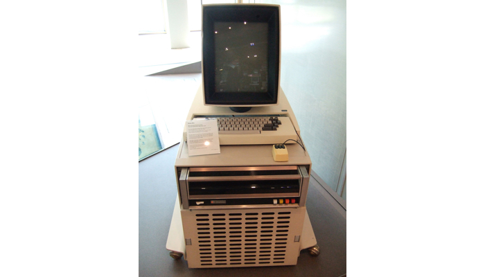

# La Programmation Orientée Objet avec Swift

## Découvrez la programmation orientée Objet

<!--
########
PARTIE 1
########
-->

### Tirez le meilleur de ce cours
<!--
####
P1C1
####
-->
Bonjour et bienvenue dans ce cours sur la programmation orientée objet (ou POO pour les intimes) ! Dans ce cours, nous allons découvrir toute la puissance de la POO et comment l'implémenter avec Swift !

**:warning:** Vous ne pourrez pas suivre ce cours sans une bonne maîtrise des bases de Swift. Par chance, c'est justement le propos de [ce cours](https://openclassrooms.com/courses/apprenez-les-fondamentaux-de-swift) ! Donc suivez-le si besoin et revenez ici ensuite !

#### Le bus scolaire
Dans ce cours, nous allons utiliser le Playground. Et vous allez voir que nous pouvons faire des choses très sophistiquées avec le Playground !  
En utilisant la programmation orientée objet et la puissance du Playground, vous allez réaliser une animation qui décrit le comportement d'un bus scolaire.


Pour cela, nous allons passer par plusieurs étapes :
- Nous allons créer la route
- Nous allons faire rouler le bus sur la route
- Nous allons ajouter des maisons et une école
- Nous allons programmer le bus pour qu'il s'arrête à chaque maison pour récupérer les enfants et les déposer ensuite à l'école

Vous êtes prêts ?

**:question:** Euh oui... Mais... On ne va pas faire une application ?

Oui je me doute que si vous êtes ici, c'est que vous avez hâte de faire une application ! Mais je vous demande encore un peu de patience parce que faire des applications iPhone demande une bonne maîtrise de Swift en général et de la POO en particulier.

**:information_source:** Si vous êtes trop impatient, je vous ai quand même concocté un  [petit cours](https://openclassrooms.com/courses/introduction-a-ios-plongez-dans-le-developpement-mobile) dans lequel on fait une application à partir de 0. Mais si vous voulez devenir de vrai développeurs iOS, il faudra que vous vous attaquiez à la POO tôt ou tard !

Et puis réjouissez vous, dans ce cours vous allez déjà réalisé un programme visuel que vous pourrez montrer à vos amis ! ;)

##### La POO
**:question:** Bon, c'est bien beau cette histoire de bus, mais pourquoi devons nous apprendre la programmation orienté objet ?

Il y a de très nombreuses raisons. Mais je vous propose pour le moment ces deux là :

##### 1. La POO est un concept central en programmation
Selon le [classement PYPL](http://pypl.github.io/PYPL.html), les 10 langages de programmation les plus populaires sont les suivants :
1. Java
2. Python
3. PHP
4. C#
5. Javascript
6. C++
7. C
8. Objective-C
9. R
10. Swift

Parmi eux, seul le langage `C` n'est pas orientée objet. Et la majeure partie de la suite de cette liste est également orientée objet. Autrement dit, quelque soit votre avenir dans la programmation, il y a de très très grandes chances que vous soyez confronté à l'orientée objet.

##### 2. La POO est au coeur d'iOS
Mais peut-être que vous vous moquer de tout ces autres langages. Après tout vous êtes là pour apprendre le Swift et pas le Python ! Et même sans doute que vous êtes là pour apprendre à programmer des applications iPhone. Et bien vous allez être servi en POO.

La POO est au coeur d'iOS. Car tout est objet en iOS. Bien sûr nous verrons en détail ce qu'est un objet en POO dans les prochains chapitres mais laissez moi vous donnez quelques exemples d'objets en iOS :
- Un bouton sur lequel on peut appuyer est un objet
- Une carte est un objet
- L'écran est un objet
- Un appui sur l'écran est un objet
- Une préférence utilisateur est un objet
- Une notification est un objet

En fait cette liste est interminable car en iOS, TOUT EST OBJET ! C'est votre tout premier aperçu de ce qu'est un objet mais ne vous inquiétez pas nous allons voir çà en détail au fur et à mesure.

Et ce dès le prochain chapitre qui est dédié à l'histoire de la POO !

#### En résumé
- Dans ce cours, nous allons faire un programme qui crée une animation. Cette animation met en scène un bus scolaire.
- La POO est incontournable en programmation car la plupart des langages l'utilisent.
- La POO est au coeur d'iOS et tout développeur iOS qui se respecte doit maîtriser ce concept !

### Retracez les origines de la POO
<!--
####
P1C2
####
-->
La programmation orientée objet est une technique de programmation incontournable aujourd'hui comme nous l'avons vu dans le chapitre précédent. Pour bien comprendre ce qu'elle est et ce qui a fait son succès, il me semble pertinent de savoir d'où elle vient !


#### Les débuts

Tout commence un matin de 1960. Ce jour là Ivan Sutherland, un étudiant en thèse au MIT à Boston, se réveille avec une grande idée. Il souhaite créer un logiciel qui permettent de dessiner sur un ordinateur. Pour rappeler un peu le contexte, on est à une époque où la souris n'existe pas et les interfaces graphiques des ordinateurs non plus. Tout ou presque est clavier et texte en informatique.

Sutherland va créer pendant sa thèse le logiciel SketchPad. Ce logiciel permet à l'aide d'un stylet de lumière de dessiner avec l'aide de l'ordinateur des formes simples comme des triangles, carrés, cercles etc. Ce projet a posé les bases de la création assistée par ordinateur (CAO).


Mais ce projet fait aussi partie des exemples fondateurs de la POO. Pourquoi ? Et bien parce qu'en POO, on créé des objets qui contiennent des propriétés et une logique propre. Et souvent ces objets représentent des éléments concrets comme un utilisateur, un article ou un panier. Et dans le cas de SketchPad, Sutherland a créé des objets pour représenter un triangle, un carré, un rond etc. Et c'est ce qui a permis à Sutherland de programmer SketchPad. Car dans son code au lieu de manipuler une variable hauteur et une autre variable largeur pour représenter un rectangle, il pouvait manipuler directement un objet rectangle dans son programme.

#### La formalisation

Son projet et quelques autres ont influencé le langage de programmation Simula qui en 1967 a connu une mise à jour majeure Simula 67 (oui, ils se sont creusé la tête sur le nom de la mise à jour :D). Cette mise à jour incluait le principe d'objet au coeur du programme.

Dans les années 70s, l'entreprise Xerox à qui on doit l'invention de la souris et de l'interface graphique notamment planche sur l'ordinateur personnel ou _personnal computer_ et oui votre bon vieux PC :O ! Ils veulent créer un ordinateur que tout le monde pourrait facilement utiliser grâce à une interface graphique, une souris, des fenêtres etc. Et pour représenter tout ces éléments à l'écran et soutenir la logique de leur affichage, une équipe emmenée par Alan Kay a créé le langae SmallTalk qui s'inspire beaucoup de Simula et qui pour beaucoup a posé les derniers jalons de de la POO telle qu'on l'utilise aujourd'hui !



#### La généralisation

Leurs travaux ont été publiés largement en 1981 et ils ont donné naissance à de grands langages orientés objets comme :
- Objective-C : Oui le langage qui permet encore aujourd'hui de développer des applications iPhone est l'un des pionniers de l'orienté objet.
- C++ : Le dérivé du C orienté objet
- Eiffel : Cocorico ! Ce langage développé par le français Bertrand Meyer est du pur orienté objet.

**:information_source:** Le langage Eiffel a été nommé bien sûr à partir de Gustave Eiffel, concepteur célèbre de la tour Eiffel car la tour a été montée dans les délais en respectant le budget. Et c'est la promesse du langage Eiffel pour les grands projets logiciels.

#### Alors, alors...

A la lumière de cette brève histoire de la POO, on peut retenir 3 choses :
1. La POO s'est installé au fur et à mesure car elle a permis de simplifier la programmation. C'est ce que dit le langage Eiffel mais bien avant lui, c'est la raison pour laquelle certains langages ont été développés comme le SmallTalk.
2. L'origine de la POO est intimement liée à l'interface graphique comme le montre l'exemple de SketchPad ou les prémices de l'ordinateur personnel. Car la POO permet non plus de manipuler des types standard comme des entiers ou des chaînes de caractères mais des objets plus complexes commes des ronds, des fenêtres ou des utilisateurs. En POO, on crée donc des objets qui représentent des choses intelligibles. Et quoi de plus intelligibles que ce que l'on peut voir !
3. L'histoire de la POO a accompagné les grandes révolutions de l'informatique moderne comme les interfaces graphiques ou l'ordinateur personnel. Elle est sans doute ce qui a permis toutes ces révolutions et cela prouve qu'elle est absolument incontournable.

Alors allons-y ! Découvrez la POO dans le prochain chapitre !

### Découvrez la POO
<!--
####
P1C3
####
-->

**:question:** MAIS C'EST QUOI LA POO ?

Alors nous y voilà ! Je pense que les parties précédentes vous ont un peu mis sur la piste mais dans ce chapitre nous allons voir en détail ce qu'est la POO.

#### La programmation procédurale et la POO

Pour bien comprendre la POO, essayons de comprendre ce qu'est la programmation procédurale.

**:question:** Attends, on ne sait déjà pas ce qu'est la POO ? Pourquoi tu me parles d'autre chose ?

N'ayez crainte, je vous parle seulement de ce que vous savez déjà. En effet, aujourd'hui si vous deviez créer un programme, vous écririez une suite d'instructions les unes à la suite des autres. Eventuellement, vous créeriez des fonctions qui vous permettront de réutiliser du code et de simplifier la lecture de votre programme. Et bien on appelle çà de la **programmation procédurale** ! Vous voyez, rien de nouveau ;) !

En programmation procédurale, le meilleur moyen que l'on a pour organiser notre code, ce sont donc les fonctions. C'est un petit peu léger...

Avec l'orientée objet, nous allons pouvoir aller beaucoup plus loin en manipulant des objets. Pourquoi beaucoup plus loin ? Et bien parce qu'un objet, techniquement, c'est un groupe de fonctions et de variables ! Donc on va pouvoir **organiser notre code avec des groupements de fonctions et variables**.

#### Qu’est-ce qu’un objet ?
Et bien tout simplement, un objet c'est **un petit paquet de variables et de fonctions**.

Prenons l'exemple du jeu "Qui est-ce ?".


**:information_source:** Dans ce jeu, chaque joueur a un plateau qui présentent 24 personnages. Chaque joueur choisit un personnage. Et chacun à son tour, les joueurs vont poser des questions pour deviner le joueur de l'autre.

Voici comment nous nous y prendrions si on voulait programmer ce jeu en orienté objet. Tout d'abord il faudrait décrire le jeu avec des objets. Alors quels objets avons nous ?

Nous avons bien sûr des personnages. Voilà un premier objet. Ces personnages ont tous des propriétés distinctives. C'est grâce à ces propriétés que, dans le jeu, nous allons pouvoir éliminer des personnages et trouver celui choisi par le joueur adverse.

Par exemple, les personnages ont comme propriétés :
- Une couleur de cheveu
- Une paire de lunette ou non
- Un sexe
- Une barbe ou non
- Une moustache ou non
- Un nom

L'objet Personnage va donc contenir 6 variables qu'on appelle ici en POO des **propriétés**.

Nous avons également un objet Plateau qui contient tous les personnages.

On peut également penser à un objet Joueur qui aurait les propriétés suivantes :
- Le personnage qu'il a sélectionné
- Son plateau de jeu
- S'il a gagné ou non

Enfin, on pourrait avoir un objet Partie qui aurait lui comme propriétés :
- Les joueurs
- Le joueur dont c'est le tour
- Si la partie est fini ou non

Avec ces 4 objets : Personnage, Plateau, Joueur et Partie. Nous avons décrit très précisément les éléments qui composent le jeu. En programmation procédurale, ceci aurait été simplement une longue liste de variables. En POO, on peut classifier ces informations par objet.

**:information_source:** Par ailleurs, vous constatez qu'un objet peut être quelque chose de très concret comme un personnage mais aussi de plus abstrait comme une partie. L'essentiel c'est que cela forme une unité qui ait du sens.

Mais un objet, ce n'est pas que des propriétés. Comme je vous le disais plus haut, c'est aussi des fonctions. Les fonctions dans un objet, on les appelle les **méthodes**. Les méthodes, c'est ce que l'objet peut faire, ses actions.

Par exemple, l'objet Joueur pourrait avoir une méthode `poserUneQuestion` pour en savoir plus sur le joueur adverse. Et ensuite il pourrait avoir une méthode `éliminer` pour éliminer certains joueurs et enfin une méthode `deviner` pour deviner le personnage choisi par l'adversaire.

L'objet Partie pourrait avoir une méthode `démarrer` pour lancer la partie, remettre les personnages en place et définir le personnage séléctionnée par chaque joueur.

Dans les méthodes des objets vont se dérouler la logique de notre programme. Cela veut dire qu'au lieu que notre programme soit une suite d'instructions, notre programme va être la combinaison de plusieurs objets qui vont interagir ensemble.


#### A quoi çà sert ?
Les objets sont extrêmement pratiques. Un programmeur sans objets, c'est comme un jedi sans sabre laser !


##### Cacher une implémentation
Mettons que l'on ait un objet Voiture. Une voiture contient un mécanisme très compliqué. Le moteur qui brûle de l'essence. Cela crée de la chaleur. Cette énergie thermique est transormée en énergie mécanique. Le mouvement arrive jusqu'aux roues et la voiture avance. Toute cette logique est _abstraite_ dans une voiture, vous n'avez pas besoin de la connaître. On l'a déjà fait pour vous. La seule chose que vous avez à votre disposition pour effectuer cette action, c'est la pédale de l'accélérateur. Tout le reste est caché sous le capot et si le constructeur a bien fait son travail, vous n'avez pas à vous en occuper.

Un objet en POO c'est exactement la même chose. Un objet peut être excessivement complexe et finalement et vous allez pouvoir l'utiliser au travers de seulement quelques méthodes très simples.

##### Représenter un concept
Un objet vous permet de représenter un concept et de le manipuler en tant que telle. Par exemple dans notre "Qui est-ce ?", nous n'avons pas une grande liste de variables et de fonctions mélangées. Nous avons simplement 4 objets très claires qui nous permettent d'organiser simplement et facilement notre logique et qui représentent des concepts simples structurant le jeu.

#### En résumé
- La programmation procédurale, c'est ce que vous connaissez : la programmation à base de variables et de fonctions.
- La programmation orientée objet se base sur le principe d'objets. Un objet c'est un ensemble de variables (appelée **propriétés**) et de fonctions (appelée **méthodes**). Cet ensemble décrit un concept unique et cohérent.
- Un objet permet de :
	- représenter un concept clairement
	- cacher une implémentation

### Designez vos premiers objets
<!--
####
P1C4
####
-->
Maintenant que vous avez une première idée du concept d'objet, nous allons pouvoir designer les objets de notre programme.

#### Découvrir le projet

Pour cela, je vous propose sans plus attendre de découvrir le projet sur lequel vous allez travailler. Le projet est disponible sur Github [ici](https://github.com/AmbroiseCollon/SchoolBusPlayground). Je vous invite à télécharger le projet sur votre mac.

**:information_source:** Vous pouvez également travailler à partir d'un fork du projet si vous êtes à l'aise avec Git. Ce que je vous encourage à faire.

Une fois le projet téléchargé, vous pouvez ouvrir le fichier `SchoolBusPlayground.playground`. Et vous devriez arriver sur ceci :


**:warning:** Si vous ne voyez pas exactement ça. Placez vous en mode assistant en utilisant ce bouton : 

Regardons un peu ce que l'on a. Nous avons tout d'abord sur la droite une étendue de pelouse sur laquelle se trouve un bus. Cela c'est notre **canva**. C'est sur ce canva que nous allons dessiner notre route et déplacer notre bus.

**:information_source:** Comme nous l'avons appris avec l'histoire de la POO, la POO çà se comprends bien quand c'est visuel. C'est la raison pour laquelle j'ai choisi de vous proposer un rendu visuel de notre programme.

Voyons maintenant ce qu'il se passe côté code. Tout d'abord nous avons quatre lignes de code que je vous invite à ignorer. Elles permettent seulement d'initialiser le canva. Ensuite la documentation nous présente 5 fonctions réparties en 2 catégories :
- 3 qui concernent la route, ces fonctions permettent de dessiner des sections de route
- 2 qui concernent le bus, ces fonctions permettent de faire avancer ou de faire marquer un stop au bus.

Je vous invite à essayer les fonctions proposées pour comprendre un peu leur fonctionnement. Par exemple, vous pouvez écrire :
```swift
canva.createRoadSection()
canva.createRoadSection()
canva.createRoadSection()
canva.createHomeRoadSection()
canva.createRoadSection()
canva.createSchoolRoadSection()
```

Dans ce code, nous créons sur le canva trois sections de route normal puis une qui contient une maison, puis une normale et enfin une qui contient une école. Cet exemple couvre les trois exemples de création de route.

**Le but de notre programme va être de déplacer le bus le long de la route en suivant 2 règles :**

- Il doit s’arrêter à chaque maison pour récupérer des enfants
- Il doit s’arrêter à chaque école pour déposer tous les enfants dans le bus.

Le programme que nous allons construire doit pouvoir fonctionner quelque soit la route que nous allons dessiner.

Maintenant, à vous de jouer ! Essayer d'utiliser les deux fonctions restantes pour déplacer le bus. Il doit avancer jusqu'à l'école en marquant un arrêt à la maison pour récupérer les écoliers et à l'école pour les déposer.

```swift
// Ne regardez pas la correction !


canva.moveBusForward()
canva.moveBusForward()
canva.moveBusForward()
canva.stopBus()
canva.moveBusForward()
canva.moveBusForward()
canva.stopBus()
```
Et voilà ! Vous savez utiliser toutes les fonctionnalités du canva. Nous allons construire tout notre programme à partir de ces 5 fonctions. N'hésitez pas à jouer un peu avec pour bien vous familiariser avec son fonctionnement.

**:information_source:** A chaque changement dans votre code, le playground relance le canva. Si vous souhaitez le relancer manuellement pour revoir votre animation, vous pouvez utiliser le raccourci clavier : <kbd>cmd</kbd> +<kbd>R</kbd>.

#### Comprendre notre playground
Si vous avez suivi le cours précédent comme suggéré, vous êtes déjà à l'aise avec un certain nombre de fonctionnalités du Playground mais dans ce cours nous poussons plus loin les capacités du Playground. Laissez moi en quelques mots vous en présenter les fonctionnalités dont nous allons profiter dans ce cours.

**:information_source:** Elles ne vous seront pas précisément utiles dans ce cours. Mais le Playground est un des outils extrêmement pratique d'Xcode alors autant apprendre à le maîtriser. En effet, pour la suite de vos travaux sur iOS, je vous encourage grandement à inclure cet outil dans votre cycle de développement.

##### La documentation

Il est possible que dans le texte, vous voyiez plutôt ceci :


Les commentaires en vert qui commencent par `/*:` sont un moyen d'écrire de la documentation dans le playground. Cela est utile notamment pour agrémenter le code d'instructions facilement lisibles ce qui est bien pratique dans notre cas. Si vous voulez en savoir plus sur le format de la documentation, vous pouvez aller [ici](https://developer.apple.com/library/content/documentation/Xcode/Reference/xcode_markup_formatting_ref/).

Pour afficher correctement la documentation, vous pouvez cliquer dans le menu en haut sur `Editor` puis `Show Rendered Markup`.

Si un jour, vous souhaitez utiliser le playground pour une démonstration ou pour expliquer quelque chose, soyez sûr d'utiliser la documentation du Playground. Certaines personnes ont même écrit [des livres](https://github.com/uraimo/Awesome-Swift-Playgrounds) avec le playground.

##### Les live view

Les live view, c'est ce que vous voyez sur la droite en mode assistant. C'est notre canva. En effet, c'est un objet vue, tel qu'il existe sur iOS dans lequel on peut glisser ce que l'on souhaite.

Ces vues permettent d'avoir un rendu visuel animé ou non de ce que l'on souhaite montrer. Cela pourra vous être utile lorsque vous souhaiterez créer des composants customisés dans iOS (comme des boutons, des switch, des listes, etc.). Vous pourrez les créer en utilisant une live view pour voir instantanément le rendu. Et lorsqu'ils sont prêts vous n'aurez plus qu'à copier le code dans votre application.

##### Les sources et ressources

Si vous ouvrez le navigateur - le panneau de droite, vous trouverez les sources et ressources du projet.


**Les sources**  
Les sources d'un projet permettent de cacher une implémentation à l'utilisateur du Playground. Par exemple, ici, j'ai mis l'ensemble de ce qui concerne le canva et ces animations dans les sources.

L'autre avantage d'écrire du code dans les sources, c'est qu'il n'est évalué qu'une fois au lancement du Playground et non à chaque fois que le code dans le Playground est modifié. Cela permet de gagner en performance. Le Playground ne doit pas tout recalculer à chaque fois.

**Les ressources**  
Dessous, vous trouverez les ressources, c'est ici que l'on enregistre les fichiers dont le Playground va avoir besoin pour s'executer. Dans notre cas, on y trouve les images qui permettent de dessiner notre canva. Mais on aurait pu y mettre des pistes audios, des vidéos, des données, bref tout ce qui n'est pas du code !

De la même manière, ces ressources ne sont chargées qu'au lancement du Playground.

#### Concevoir nos objets

Maintenant que le décor est bien planté, nous allons commencer à réfléchir un peu. Comment allons nous organiser notre code ?

Reprenons le même genre de raisonnement que pour le jeu "Qui-est-ce ?" et essayons de découper en plusieurs objets notre code.

##### Les propriétés

Tout d'abord, commençons par le plus évident : le bus. Nous allons donc avoir un objet `Bus` qui va avoir quelques propriétés comme :
- le nombre de siège
- le nombre de siège occupés
- le nom du chauffeur

Ensuite nous allons avoir la route. La route c'est un peu plus subtil. Si on regarde les méthodes proposées par le canva, on crée la route par section. Donc la route c'est la combinaison de plusieurs section de route qui s'enchaîne. Certaines ayant une maison, d'autre une école et enfin d'autres rien.

On a donc un objet `Route` qui a une propriété :
- un tableau de section de routes

Et donc nous avons un dernier objet qui est la `Section De Route`. Cette objet a donc 3 types différents. Et nous verrons comment les différentier avec l'héritage en partie 3 de ce cours.

##### Les méthodes
Mais un objet, comme vous le savez désormais, a des propriétés qui décrivent ce qu'il est, mais aussi des méthodes qui décrivent ce qu'il fait.

A première vue, une route ou une section de route, ça ne fait pas grand chose... En revanche, un bus ça en fait !

Donc nous allons a priori avoir au moins 2 méthodes :
- avance
- marque un arret

L'analyse que nous venons de faire s'appelle un **diagramme de classe**.


**:warning:** Dans notre analyse, il y a quelques oublis volontaires pour ne pas gâcher la surprise de nos futures découvertes ;) !

#### En résumé
- Le projet contient un Playground dans lequel est présenté un canva. Ce canva a 5 fonctions qui nous permettent de :
	- créer une section de route avec ou sans école ou maison
	- faire avancer le bus
	- faire marquer un arrêt au bus
- Dans ce cours, nous découvrons 3 fonctionnalités avancées du Playground :
	- Les live view
	- La documentation
	- Les sources et ressources
- Dans notre diagramme de classes, nous avons identifié 3 objets que nous allons créer :
	- Bus
	- Road
	- RoadSection

## Développez en orienté objet
<!--
########
PARTIE 2
########
-->

### Créez votre première classe
Section 1 : Présentation de la syntaxe d'une classe, création de plusieurs instance (faire le lien avec String(), Int())  
Exercice : Créer une classe Personne (ce sera un exercice filé dans tout le cours)  
Section 2 : Différence claire entre instance et classe avec la métaphore du gaufrier

### Ajoutez des propriétés
Section 1 : Création d’une propriété (une propriété, c’est une variable) et mutabilité des propriétés et des instances  
Exercice : Ajouter des attributs à la classe personne  
Section 2 : Accéder à sa valeur, modifier une propriété

### Initialisez les classes
Section 1 : Propriété non initialisée  
Section 2 : Le mot clé init  
Section 3 : Le mot clé self et l’intialisation avec paramètres  
Exercice : Ajouter une initialisation à la classe Personne avec le nom et prénom comme paramètre

### Définissez des méthodes
Section 1 : Les méthodes sont des fonctions  
Section 2 : Appeler une méthode  
Exercice : Créer une méthode à la classe personne

### Découvrez les propriétés et méthodes de classe
(Réutilisez la métaphore du gaufrier ?)
Section 1 : Les propriétés de classe ou statique  
Section 2 : Les méthodes de classe (mention du mot-clé class qui permet aux sous-classes d’override)

## Enrichissez vos objets avec l'héritage
<!--
########
PARTIE 3
########
-->

### Héritez de nouvelles connaissances
Section 1 : Présentation générale de l'héritage (mise en scène avec peluches d’animaux)  
Section 2 : Nouveau schéma de l'héritage  
Exercice : Héritage par métier pour la classe Personne  
Section 3 : Application à SchoolBus et création de HomeRoadSection et SchoolRoadSection

### Énumérez des cas
Section 1 : Présentation des enums (use cases et syntaxe) et les enums avec types  
Section 2 : Application avec RoadSectionType, réécriture de l’init de RoadSection

### Surchargez les méthodes

Section 1 : Découverte du mot clé super avec l’écriture des init des sous-classe de road section  
Exercice : Créez une fonction statique de Road : createRoadToSchool  
Section 2 : Découverte du mot clé override avec l’override de la fonction drive dans SchoolBus et découverte du type check avec “as”  
Exercice : écrire l’override de la fonction drive

## Allez plus loin
<!--
########
PARTIE 4
########
-->

### Enrichissez vos propriétés
Section 1 : Computed properties VS stored properties (ex: description de schoolbus)  
Section 2 : Getter and setter  
Section 3 : Property observance (didSet, willSet)

### Plongez dans les coulisses de l'initialisation
Section 1 : Convenience, Inherited and Designated initializer (application  avec RoadSection)  
Section 2 : Required Initializer

### Protégez vos classes
Section 1 : Présentation de l’access control (rappel de l’intérêt d’une classe)  
Section 2 : Mise en pratique sur nos classes
