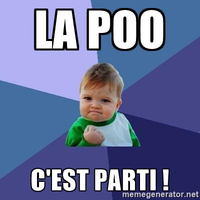

# La Programmation Orientée Objet avec Swift

## Découvrez la programmation orientée Objet

<!--
########
PARTIE 1
########
-->

### Tirez le meilleur de ce cours
<!--
####
P1C1
####
-->
Bonjour et bienvenue dans ce cours sur la programmation orientée objet (ou POO pour les intimes) ! Dans ce cours, nous allons découvrir toute la puissance de la POO et comment l'implémenter avec Swift !

**:warning:** Vous ne pourrez pas suivre ce cours sans une bonne maîtrise des bases de Swift. Par chance, c'est justement le propos de [ce cours](https://openclassrooms.com/courses/apprenez-les-fondamentaux-de-swift) ! Donc suivez-le si besoin et revenez ici ensuite !

#### Le bus scolaire
Dans ce cours, nous allons utiliser le Playground. Et vous allez voir que nous pouvons faire des choses très sophistiquées avec le Playground !  
En utilisant la programmation orientée objet et la puissance du Playground, vous allez réaliser une animation qui décrit le comportement d'un bus scolaire.


Pour cela, nous allons passer par plusieurs étapes :
- Nous allons créer la route
- Nous allons faire rouler le bus sur la route
- Nous allons ajouter des maisons et une école
- Nous allons programmer le bus pour qu'il s'arrête à chaque maison pour récupérer les enfants et les déposer ensuite à l'école

Vous êtes prêts ?

**:question:** Euh oui... Mais... On ne va pas faire une application ?

Oui je me doute que si vous êtes ici, c'est que vous avez hâte de faire une application ! Mais je vous demande encore un peu de patience parce que faire des applications iPhone demande une bonne maîtrise de Swift en général et de la POO en particulier.

**:information_source:** Si vous êtes trop impatient, je vous ai quand même concocté un  [petit cours](https://openclassrooms.com/courses/introduction-a-ios-plongez-dans-le-developpement-mobile) dans lequel on fait une application à partir de 0. Mais si vous voulez devenir de vrai développeurs iOS, il faudra que vous vous attaquiez à la POO tôt ou tard !

Et puis réjouissez vous, dans ce cours vous allez déjà réalisé un programme visuel que vous pourrez montrer à vos amis ! ;)

##### La POO
**:question:** Bon, c'est bien beau cette histoire de bus, mais pourquoi devons nous apprendre la programmation orienté objet ?

Il y a de très nombreuses raisons. Mais je vous propose pour le moment ces deux là :

##### 1. La POO est un concept central en programmation
Selon le [classement PYPL](http://pypl.github.io/PYPL.html), les 10 langages de programmation les plus populaires sont les suivants :
1. Java
2. Python
3. PHP
4. C#
5. Javascript
6. C++
7. C
8. Objective-C
9. R
10. Swift

Parmi eux, seul le langage `C` n'est pas orientée objet. Et la majeure partie de la suite de cette liste est également orientée objet. Autrement dit, quelque soit votre avenir dans la programmation, il y a de très très grandes chances que vous soyez confronté à l'orientée objet.

##### 2. La POO est au coeur d'iOS
Mais peut-être que vous vous moquer de tout ces autres langages. Après tout vous êtes là pour apprendre le Swift et pas le Python ! Et même sans doute que vous êtes là pour apprendre à programmer des applications iPhone. Et bien vous allez être servi en POO.

La POO est au coeur d'iOS. Car tout est objet en iOS. Bien sûr nous verrons en détail ce qu'est un objet en POO dans les prochains chapitres mais laissez moi vous donnez quelques exemples d'objets en iOS :
- Un bouton sur lequel on peut appuyer est un objet
- Une carte est un objet
- L'écran est un objet
- Un appui sur l'écran est un objet
- Une préférence utilisateur est un objet
- Une notification est un objet

En fait cette liste est interminable car en iOS, TOUT EST OBJET ! C'est votre tout premier aperçu de ce qu'est un objet mais ne vous inquiétez pas nous allons voir çà en détail au fur et à mesure.

Et ce dès le prochain chapitre qui est dédié à l'histoire de la POO !

#### En résumé
- Dans ce cours, nous allons faire un programme qui crée une animation. Cette animation met en scène un bus scolaire.
- La POO est incontournable en programmation car la plupart des langages l'utilisent.
- La POO est au coeur d'iOS et tout développeur iOS qui se respecte doit maîtriser ce concept !

### Retracez les origines de la POO
<!--
####
P1C2
####
-->
La programmation orientée objet est une technique de programmation incontournable aujourd'hui comme nous l'avons vu dans le chapitre précédent. Pour bien comprendre ce qu'elle est et ce qui a fait son succès, il me semble pertinent de savoir d'où elle vient !


#### Les débuts

Tout commence un matin de 1960. Ce jour là Ivan Sutherland, un étudiant en thèse au MIT à Boston, se réveille avec une grande idée. Il souhaite créer un logiciel qui permettent de dessiner sur un ordinateur. Pour rappeler un peu le contexte, on est à une époque où la souris n'existe pas et les interfaces graphiques des ordinateurs non plus. Tout ou presque est clavier et texte en informatique.

Sutherland va créer pendant sa thèse le logiciel SketchPad. Ce logiciel permet à l'aide d'un stylet de lumière de dessiner avec l'aide de l'ordinateur des formes simples comme des triangles, carrés, cercles etc. Ce projet a posé les bases de la création assistée par ordinateur (CAO).


Mais ce projet fait aussi partie des exemples fondateurs de la POO. Pourquoi ? Et bien parce qu'en POO, on créé des objets qui contiennent des propriétés et une logique propre. Et souvent ces objets représentent des éléments concrets comme un utilisateur, un article ou un panier. Et dans le cas de SketchPad, Sutherland a créé des objets pour représenter un triangle, un carré, un rond etc. Et c'est ce qui a permis à Sutherland de programmer SketchPad. Car dans son code au lieu de manipuler une variable hauteur et une autre variable largeur pour représenter un rectangle, il pouvait manipuler directement un objet rectangle dans son programme.

#### La formalisation

Son projet et quelques autres ont influencé le langage de programmation Simula qui en 1967 a connu une mise à jour majeure Simula 67 (oui, ils se sont creusé la tête sur le nom de la mise à jour :D). Cette mise à jour incluait le principe d'objet au coeur du programme.

Dans les années 70s, l'entreprise Xerox à qui on doit l'invention de la souris et de l'interface graphique notamment planche sur l'ordinateur personnel ou _personnal computer_ et oui votre bon vieux PC :O ! Ils veulent créer un ordinateur que tout le monde pourrait facilement utiliser grâce à une interface graphique, une souris, des fenêtres etc. Et pour représenter tout ces éléments à l'écran et soutenir la logique de leur affichage, une équipe emmenée par Alan Kay a créé le langae SmallTalk qui s'inspire beaucoup de Simula et qui pour beaucoup a posé les derniers jalons de de la POO telle qu'on l'utilise aujourd'hui !


#### La généralisation

Leurs travaux ont été publiés largement en 1981 et ils ont donné naissance à de grands langages orientés objets comme :
- Objective-C : Oui le langage qui permet encore aujourd'hui de développer des applications iPhone est l'un des pionniers de l'orienté objet.
- C++ : Le dérivé du C orienté objet
- Eiffel : Cocorico ! Ce langage développé par le français Bertrand Meyer est du pur orienté objet.

**:information_source:** Le langage Eiffel a été nommé bien sûr à partir de Gustave Eiffel, concepteur célèbre de la tour Eiffel car la tour a été montée dans les délais en respectant le budget. Et c'est la promesse du langage Eiffel pour les grands projets logiciels.

#### Alors, alors...

A la lumière de cette brève histoire de la POO, on peut retenir 3 choses :
1. La POO s'est installé au fur et à mesure car elle a permis de simplifier la programmation. C'est ce que dit le langage Eiffel mais bien avant lui, c'est la raison pour laquelle certains langages ont été développés comme le SmallTalk.
2. L'origine de la POO est intimement liée à l'interface graphique comme le montre l'exemple de SketchPad ou les prémices de l'ordinateur personnel. Car la POO permet non plus de manipuler des types standard comme des entiers ou des chaînes de caractères mais des objets plus complexes commes des ronds, des fenêtres ou des utilisateurs. En POO, on crée donc des objets qui représentent des choses intelligibles. Et quoi de plus intelligibles que ce que l'on peut voir !
3. L'histoire de la POO a accompagné les grandes révolutions de l'informatique moderne comme les interfaces graphiques ou l'ordinateur personnel. Elle est sans doute ce qui a permis toutes ces révolutions et cela prouve qu'elle est absolument incontournable.

Alors allons-y ! Découvrez la POO dans le prochain chapitre !

### Découvrez la POO
<!--
####
P1C3
####
-->

**:question:** MAIS C'EST QUOI LA POO ?

Alors nous y voilà ! Je pense que les parties précédentes vous ont un peu mis sur la piste mais dans ce chapitre nous allons voir en détail ce qu'est la POO.

#### La programmation procédurale et la POO

Pour bien comprendre la POO, essayons de comprendre ce qu'est la programmation procédurale.

**:question:** Attends, on ne sait déjà pas ce qu'est la POO ? Pourquoi tu me parles d'autre chose ?

N'ayez crainte, je vous parle seulement de ce que vous savez déjà. En effet, aujourd'hui si vous deviez créer un programme, vous écririez une suite d'instructions les unes à la suite des autres. Eventuellement, vous créeriez des fonctions qui vous permettront de réutiliser du code et de simplifier la lecture de votre programme. Et bien on appelle çà de la **programmation procédurale** ! Vous voyez, rien de nouveau ;) !

En programmation procédurale, le meilleur moyen que l'on a pour organiser notre code, ce sont donc les fonctions. C'est un petit peu léger...

Avec l'orientée objet, nous allons pouvoir aller beaucoup plus loin en manipulant des objets. Pourquoi beaucoup plus loin ? Et bien parce qu'un objet, techniquement, c'est un groupe de fonctions et de variables ! Donc on va pouvoir **organiser notre code avec des groupements de fonctions et variables**.

#### Qu’est-ce qu’un objet ?
Et bien tout simplement, un objet c'est **un petit paquet de variables et de fonctions**.

Prenons l'exemple du jeu "Qui est-ce ?".


**:information_source:** Dans ce jeu, chaque joueur a un plateau qui présentent 24 personnages. Chaque joueur choisit un personnage. Et chacun à son tour, les joueurs vont poser des questions pour deviner le joueur de l'autre.

Voici comment nous nous y prendrions si on voulait programmer ce jeu en orienté objet. Tout d'abord il faudrait décrire le jeu avec des objets. Alors quels objets avons nous ?

Nous avons bien sûr des personnages. Voilà un premier objet. Ces personnages ont tous des propriétés distinctives. C'est grâce à ces propriétés que, dans le jeu, nous allons pouvoir éliminer des personnages et trouver celui choisi par le joueur adverse.

Par exemple, les personnages ont comme propriétés :
- Une couleur de cheveu
- Une paire de lunette ou non
- Un sexe
- Une barbe ou non
- Une moustache ou non
- Un nom

L'objet Personnage va donc contenir 6 variables qu'on appelle ici en POO des **propriétés**.

Nous avons également un objet Plateau qui contient tous les personnages.

On peut également penser à un objet Joueur qui aurait les propriétés suivantes :
- Le personnage qu'il a sélectionné
- Son plateau de jeu
- S'il a gagné ou non

Enfin, on pourrait avoir un objet Partie qui aurait lui comme propriétés :
- Les joueurs
- Le joueur dont c'est le tour
- Si la partie est fini ou non

Avec ces 4 objets : Personnage, Plateau, Joueur et Partie. Nous avons décrit très précisément les éléments qui composent le jeu. En programmation procédurale, ceci aurait été simplement une longue liste de variables. En POO, on peut classifier ces informations par objet.

**:information_source:** Par ailleurs, vous constatez qu'un objet peut être quelque chose de très concret comme un personnage mais aussi de plus abstrait comme une partie. L'essentiel c'est que cela forme une unité qui ait du sens.

Mais un objet, ce n'est pas que des propriétés. Comme je vous le disais plus haut, c'est aussi des fonctions. Les fonctions dans un objet, on les appelle les **méthodes**. Les méthodes, c'est ce que l'objet peut faire, ses actions.

Par exemple, l'objet Joueur pourrait avoir une méthode `poserUneQuestion` pour en savoir plus sur le joueur adverse. Et ensuite il pourrait avoir une méthode `éliminer` pour éliminer certains joueurs et enfin une méthode `deviner` pour deviner le personnage choisi par l'adversaire.

L'objet Partie pourrait avoir une méthode `démarrer` pour lancer la partie, remettre les personnages en place et définir le personnage séléctionnée par chaque joueur.

Dans les méthodes des objets vont se dérouler la logique de notre programme. Cela veut dire qu'au lieu que notre programme soit une suite d'instructions, notre programme va être la combinaison de plusieurs objets qui vont interagir ensemble.


#### A quoi çà sert ?
Les objets sont extrêmement pratiques. Un programmeur sans objets, c'est comme un jedi sans sabre laser !


##### Cacher une implémentation
Mettons que l'on ait un objet Voiture. Une voiture contient un mécanisme très compliqué. Le moteur qui brûle de l'essence. Cela crée de la chaleur. Cette énergie thermique est transormée en énergie mécanique. Le mouvement arrive jusqu'aux roues et la voiture avance. Toute cette logique est _abstraite_ dans une voiture, vous n'avez pas besoin de la connaître. On l'a déjà fait pour vous. La seule chose que vous avez à votre disposition pour effectuer cette action, c'est la pédale de l'accélérateur. Tout le reste est caché sous le capot et si le constructeur a bien fait son travail, vous n'avez pas à vous en occuper.

Un objet en POO c'est exactement la même chose. Un objet peut être excessivement complexe et finalement et vous allez pouvoir l'utiliser au travers de seulement quelques méthodes très simples.

##### Représenter un concept
Un objet vous permet de représenter un concept et de le manipuler en tant que telle. Par exemple dans notre "Qui est-ce ?", nous n'avons pas une grande liste de variables et de fonctions mélangées. Nous avons simplement 4 objets très claires qui nous permettent d'organiser simplement et facilement notre logique et qui représentent des concepts simples structurant le jeu.

#### En résumé
- La programmation procédurale, c'est ce que vous connaissez : la programmation à base de variables et de fonctions.
- La programmation orientée objet se base sur le principe d'objets. Un objet c'est un ensemble de variables (appelée **propriétés**) et de fonctions (appelée **méthodes**). Cet ensemble décrit un concept unique et cohérent.
- Un objet permet de :
	- représenter un concept clairement
	- cacher une implémentation

### Designez vos premiers objets
<!--
####
P1C4
####
-->
Maintenant que vous avez une première idée du concept d'objet, nous allons pouvoir designer les objets de notre programme.

#### Découvrir le projet

Pour cela, je vous propose sans plus attendre de découvrir le projet sur lequel vous allez travailler. Le projet est disponible sur Github [ici](https://github.com/AmbroiseCollon/SchoolBusPlayground). Je vous invite à télécharger le projet sur votre mac.

**:information_source:** Vous pouvez également travailler à partir d'un fork du projet si vous êtes à l'aise avec Git. Ce que je vous encourage à faire.

Une fois le projet téléchargé, vous pouvez ouvrir le fichier `SchoolBusPlayground.playground`. Et vous devriez arriver sur ceci :


**:warning:** Si vous ne voyez pas exactement ça. Placez vous en mode assistant en utilisant ce bouton : 

Regardons un peu ce que l'on a. Nous avons tout d'abord sur la droite une étendue de pelouse sur laquelle se trouve un bus. Cela c'est notre **canva**. C'est sur ce canva que nous allons dessiner notre route et déplacer notre bus.

**:information_source:** Comme nous l'avons appris avec l'histoire de la POO, la POO çà se comprends bien quand c'est visuel. C'est la raison pour laquelle j'ai choisi de vous proposer un rendu visuel de notre programme.

Voyons maintenant ce qu'il se passe côté code. Tout d'abord nous avons quatre lignes de code que je vous invite à ignorer. Elles permettent seulement d'initialiser le canva. Ensuite la documentation nous présente 5 fonctions réparties en 2 catégories :
- 3 qui concernent la route, ces fonctions permettent de dessiner des sections de route
- 2 qui concernent le bus, ces fonctions permettent de faire avancer ou de faire marquer un stop au bus.

Je vous invite à essayer les fonctions proposées pour comprendre un peu leur fonctionnement. Par exemple, vous pouvez écrire :
```swift
canva.createRoadSection()
canva.createRoadSection()
canva.createRoadSection()
canva.createHomeRoadSection()
canva.createRoadSection()
canva.createSchoolRoadSection()
```

Dans ce code, nous créons sur le canva trois sections de route normal puis une qui contient une maison, puis une normale et enfin une qui contient une école. Cet exemple couvre les trois exemples de création de route.

**Le but de notre programme va être de déplacer le bus le long de la route en suivant 2 règles :**

- Il doit s’arrêter à chaque maison pour récupérer des enfants
- Il doit s’arrêter à chaque école pour déposer tous les enfants dans le bus.

Le programme que nous allons construire doit pouvoir fonctionner quelque soit la route que nous allons dessiner.

Maintenant, à vous de jouer ! Essayer d'utiliser les deux fonctions restantes pour déplacer le bus. Il doit avancer jusqu'à l'école en marquant un arrêt à la maison pour récupérer les écoliers et à l'école pour les déposer.

```swift
// Ne regardez pas la correction !


canva.moveBusForward()
canva.moveBusForward()
canva.moveBusForward()
canva.stopBus()
canva.moveBusForward()
canva.moveBusForward()
canva.stopBus()
```
Et voilà ! Vous savez utiliser toutes les fonctionnalités du canva. Nous allons construire tout notre programme à partir de ces 5 fonctions. N'hésitez pas à jouer un peu avec pour bien vous familiariser avec son fonctionnement.

**:information_source:** A chaque changement dans votre code, le playground relance le canva. Si vous souhaitez le relancer manuellement pour revoir votre animation, vous pouvez utiliser le raccourci clavier : <kbd>cmd</kbd> +<kbd>R</kbd>.

#### Comprendre notre playground
Si vous avez suivi le cours précédent comme suggéré, vous êtes déjà à l'aise avec un certain nombre de fonctionnalités du Playground mais dans ce cours nous poussons plus loin les capacités du Playground. Laissez moi en quelques mots vous en présenter les fonctionnalités dont nous allons profiter dans ce cours.

**:information_source:** Elles ne vous seront pas précisément utiles dans ce cours. Mais le Playground est un des outils extrêmement pratique d'Xcode alors autant apprendre à le maîtriser. En effet, pour la suite de vos travaux sur iOS, je vous encourage grandement à inclure cet outil dans votre cycle de développement.

##### La documentation

Il est possible que dans le texte, vous voyiez plutôt ceci :


Les commentaires en vert qui commencent par `/*:` sont un moyen d'écrire de la documentation dans le playground. Cela est utile notamment pour agrémenter le code d'instructions facilement lisibles ce qui est bien pratique dans notre cas. Si vous voulez en savoir plus sur le format de la documentation, vous pouvez aller [ici](https://developer.apple.com/library/content/documentation/Xcode/Reference/xcode_markup_formatting_ref/).

Pour afficher correctement la documentation, vous pouvez cliquer dans le menu en haut sur `Editor` puis `Show Rendered Markup`.

Si un jour, vous souhaitez utiliser le playground pour une démonstration ou pour expliquer quelque chose, soyez sûr d'utiliser la documentation du Playground. Certaines personnes ont même écrit [des livres](https://github.com/uraimo/Awesome-Swift-Playgrounds) avec le playground.

##### Les live view

Les live view, c'est ce que vous voyez sur la droite en mode assistant. C'est notre canva. En effet, c'est un objet vue, tel qu'il existe sur iOS dans lequel on peut glisser ce que l'on souhaite.

Ces vues permettent d'avoir un rendu visuel animé ou non de ce que l'on souhaite montrer. Cela pourra vous être utile lorsque vous souhaiterez créer des composants customisés dans iOS (comme des boutons, des switch, des listes, etc.). Vous pourrez les créer en utilisant une live view pour voir instantanément le rendu. Et lorsqu'ils sont prêts vous n'aurez plus qu'à copier le code dans votre application.

##### Les sources et ressources

Si vous ouvrez le navigateur - le panneau de droite, vous trouverez les sources et ressources du projet.


**Les sources**  
Les sources d'un projet permettent de cacher une implémentation à l'utilisateur du Playground. Par exemple, ici, j'ai mis l'ensemble de ce qui concerne le canva et ces animations dans les sources.

L'autre avantage d'écrire du code dans les sources, c'est qu'il n'est évalué qu'une fois au lancement du Playground et non à chaque fois que le code dans le Playground est modifié. Cela permet de gagner en performance. Le Playground ne doit pas tout recalculer à chaque fois.

**Les ressources**  
Dessous, vous trouverez les ressources, c'est ici que l'on enregistre les fichiers dont le Playground va avoir besoin pour s'executer. Dans notre cas, on y trouve les images qui permettent de dessiner notre canva. Mais on aurait pu y mettre des pistes audios, des vidéos, des données, bref tout ce qui n'est pas du code !

De la même manière, ces ressources ne sont chargées qu'au lancement du Playground.

#### Concevoir nos objets

Maintenant que le décor est bien planté, nous allons commencer à réfléchir un peu. Comment allons nous organiser notre code ?

Reprenons le même genre de raisonnement que pour le jeu "Qui-est-ce ?" et essayons de découper en plusieurs objets notre code.

##### Les propriétés

Tout d'abord, commençons par le plus évident : le bus. Nous allons donc avoir un objet `Bus` qui va avoir quelques propriétés comme :
- le nombre de siège
- le nombre de siège occupés
- le nom du chauffeur

Ensuite nous allons avoir la route. La route c'est un peu plus subtil. Si on regarde les méthodes proposées par le canva, on crée la route par section. Donc la route c'est la combinaison de plusieurs section de route qui s'enchaîne. Certaines ayant une maison, d'autre une école et enfin d'autres rien.

On a donc un objet `Route` qui a une propriété :
- un tableau de section de routes

Et donc nous avons un dernier objet qui est la `Section De Route`. Cette objet a donc 3 types différents. Et nous verrons comment les différentier avec l'héritage en partie 3 de ce cours.

##### Les méthodes
Mais un objet, comme vous le savez désormais, a des propriétés qui décrivent ce qu'il est, mais aussi des méthodes qui décrivent ce qu'il fait.

A première vue, une route ou une section de route, ça ne fait pas grand chose... En revanche, un bus ça en fait !

Donc nous allons a priori avoir au moins 2 méthodes :
- avance
- marque un arret

L'analyse que nous venons de faire s'appelle un **diagramme de classe**.


**:warning:** Dans notre analyse, il y a quelques oublis volontaires pour ne pas gâcher la surprise de nos futures découvertes ;) !

#### En résumé
- Le projet contient un Playground dans lequel est présenté un canva. Ce canva a 5 fonctions qui nous permettent de :
	- créer une section de route avec ou sans école ou maison
	- faire avancer le bus
	- faire marquer un arrêt au bus
- Dans ce cours, nous découvrons 3 fonctionnalités avancées du Playground :
	- Les live view
	- La documentation
	- Les sources et ressources
- Dans notre diagramme de classes, nous avons identifié 3 objets que nous allons créer :
	- Bus
	- Road
	- RoadSection

## Développez en orienté objet
<!--
########
PARTIE 2
########
-->

### Créez votre première classe

Je suppose que vous avez maintenant hâte de vous lancer dans le code orienté objet. Alors j'ai le plaisir de vous annoncer que...



#### Déclarer une classe

Il faut d'abord commencer par le commencement et le commencement de la POO en Swift ce sont les classes. Une classe, c'est ce qui va nous permettre de définir nos objets.
En Swift, pour écrire une classe, on utilise la syntaxe suivante :

```swift
class NomDeLaClasse {
	// Ici viendra le contenu de la classe
}
```

Par exemple, on a vu dans notre analyse de classes que l'on souhaite créer trois classes : Bus, Road et RoadSection. Pour faire cela, nous allons donc écrire simplement :

```swift
class Bus {

}

class Road {

}

class RoadSection {

}
```

Et voilà ! Il ne suffit de rien de plus pour créer nos classes ! Bien sûr, pour le moment, elles sont relativement vides mais elles vont s'épaissir au fur et à mesure.

**:information_source:** Vous remarquez que le nom d'une classe contrairement aux variables commence par une **majuscule**. C'est une convention que vous devez suivre.

**:question:** Mais on en fait quoi de ces classes ?

Evidemment pour le moment ça ne paraît pas hyper impressionnant. Mais vous allez voir tout de suite que c'est plus puissant qu'il n'y parait.

#### Les classes et les types

Vous vous souvenez des types ? Vous en connaissez un petit paquet maintenant. Voici un petit schéma pour vous les remettre en tête.


Jusqu'à présent, vous savez faire des programmes en manipulant les types ci-dessus. A partir de maintenant, vous allez aussi travailler avec les types que vous avez créé !

**:question:** Comment ça les types que nous avons créé ?

Eh oui ! Les classes Bus, Road et RoadSection sont des types. Exactement de la même façon que Int, String et Bool. Donc la bonne surprise de ce cours, c'est que vous savez maintenant créer des types !

#### Instancier les classes
Maintenant nous sommes en terrain conquis, les types vous savez ce que c'est. Donc vous savez les utiliser.

Vous vous souvenez que pour créer des variables de types entier par exemple, on pouvait écrire simplement :

```swift
var i = 0
```

Mais on a aussi appris qu'on pouvait utiliser l'initialisation du type par défaut avec le nom du type et les parenthèses :

```swift
var i = Int() // i contient 0
var s = String() // s contient ""
```
Et bien nous allons faire la même chose. Pour créer une variable de type Bus, nous allons utiliser le nom de la classe et les parenthèses :

```swift
var unBus = Bus()
```

Et voilà rien de plus simple ! Nous venons de créer ce que l'on appelle une **instance** de la classe Bus. Et on appelle ce mécanisme l'**instanciation**.

**Une instance, c'est donc simplement une variable qui a pour type le nom de notre classe.**

Il est important que vous fassiez correctement la différence entre une instance et une classe car c'est souvent une source de confusion quand on débute en POO.

La classe, c'est le modèle. Par exemple, la classe `Int` définit la façon dont fonctionnne un entier, ses propriétés et quelques méthodes pratiques pour les manipuler.

Maintenant, si j'écris :
```swift
var i = 0
var j = 1
```

`i` et `j` sont des entiers précis. On dit qu'ils sont des instances de la classe Int. On peut faire une infinité d'instance à partir d'une classe. Toutes les instances de la classe auront les mêmes propriétés.

**:x:** La classe Int n'est pas à proprement parler une classe mais une structure. Nous verrons ce modèle de donnée mais vous verrez que cela se comporte à 90% comme une classe. Vous pouvez retrouvez les propriétés et méthodes de la classe Int à cette [adresse](https://developer.apple.com/reference/swift/int).

Prenons une métaphore pour bien comprendre. Lorsque vous faîtes des gaufres, vous utilisez un gaufrier. En fonction du gaufrier vont varier l'imprimé sur la gaufre, sa largeur, son épaisseur etc. Donc le gaufrier **définit** la gaufre. Et ensuite, vous pouvez faire autant de gaufres que vous le souhaitez, elles auront toutes une structure identique et ne va varier que ce que vous allez mettre dessus.

Si vous m'avez suivi, le gaufrier représente la classe. Les instances sont les représentations concrètes de cette classe.


De toute façon, si vous savez qu'une classe permet de définir un type, vous ne vous tromperez pas ;) !

#### Exercice

Dans ce cours, je vous propose un exercice filé tout au long du cours. Nous allons créer une classe Personne. Et vous allez pouvoir faire l'exercice directement dans votre navigateur ! Cliquez sur l'image pour commencer l'exercice :

#### En Résumé

- Pour déclarer une classe avec Swift, on utilise le mot-clé `class` comme ceci :
 ```swift
 class NomDeLaClasse {
 	// Ici viendra le contenu de la classe
 }
 ```
- Une classe s'utilise exactement comme un type. Lorsque l'on créé une classe, on créé un type.
- Une classe représente un concept. On appelle les représentations concrètes de cette classe des instances. Pour créer une instance, on utilise le nom de la classe suivi de parenthèse :
```swift
var instance = MaClasse()
```


### Ajoutez des propriétés
Nous avons désormais trois classes Bus, Road et RoadSection. Et... ça nous fait une belle jambe ! Il n'y a rien dedans donc elles ne servent a priori pas à grand chose. Dans ce chapitre, nous allons découvrir les propriétés et nous allons créer les premières propriétés de nos classes. Et pour cela, nous allons reprendre ce diagramme :


Nous allons donc écrire 3 propriétés pour la classe Bus et 1 pour la classe Road.

**:information_source:** Nous ne rajouterons la propriété de la classe RoadSection que dans la prochaine partie sur l'héritage.

#### Créer une propriété

Dans les chapitres précédents, je vous ai dit qu'un objet, c'était un petit paquet de variables et de fonctions. Et bien, tout simplement dans un objet, une variable, on appelle ça une propriété. Ces propriétés vont nous permettre de stocker des informations sur cet objet.

Et donc pour créer une propriété, on va écrire la déclaration d'une variable à l'intérieur de la classe. Donc pour notre classe Bus, on va écrire :
```swift
class Bus {
	var driverName = "Joe"
	var seats = 20
	var occupiedSeats = 0
}
```

J'ai bien ici défini trois propriétés. L'une de type `String` et les deux autres de type `Int`. Ces propriétés ont des valeurs par défaut. Tout objet créé de la classe bus, aura comme valeur par défaut `Joe` pour la propriété `driverName`. Même chose pour les deux autres propriétés.

Vous pouvez bien sûr créer des propriétés de n'importe quelle type ! Par exemple, pour la classe Road, nous allons ajouter une propriété `sections` de type tableau de `RoadSection` comme ceci :

```swift
class Road {
	var sections = [RoadSection]()
}
```

**:information_source:** Souvenez-vous, pour créer un tableau vide, on utilise le type du tableau donc quelque chose qui ressemble à [Type] et ensuite l'initialisation classique du type avec les parenthèses. Donc pour créer un tableau vide d'entiers, j'écris : `[Int]()`. Ici on a donc créé un tableau vide d'objet de type `RoadSection`.

#### Accéder et modifier une propriété

Les propriétés nous permettent donc de stocker des informations ! Alors comment y accède-t-on ?

Prenons par exemple une instance de la classe Bus :

```swift
var unBus = Bus()
```

Pour accèder à une propriété de cette instance, il suffit d'utiliser le `.` suivi du nom de la propriété come ceci :

```swift
unBus.driverName // Le playground affiche sur la droite "Joe"
```

Vous remarquez sans doute que dès que vous écrivez le point à la suite de l'instance, Xcode vous propose automatiquement les noms des propriétés. Cette autocomplétion est évidemment très pratique parce qu'en plus de vous faire gagner du temps de frappe, elle vous évite de retenir les noms de toutes les propriétés de la classe.

Une propriété se comporte exactement comme une variable. La seule différence, c'est qu'elle est rattachée à un objet. Donc pour modifier une propriété, il suffit d'utiliser le signe égal :

```swift
unBus.driverName = "Daniel Morales"
```

Et bien sûr vous pouvez utiliser tout ce que vous savez sur la manipulation des variables :

```swift
unBus.occupiedSeats += 1
```

#### Mutabilité des propriétés et des instances

**:question:** Si une propriété se comporte comme une variable, est-ce que cela veut dire que nous pouvons créer des propriétés constantes avec `let` ?

Très bonne question ;) ! Et la réponse est oui ! Par exemple, on pourrait vouloir stocker une information supplémentaire sur notre bus comme le nombre de roues. On peut assez facilement admettre que ce nombre ne vas pas changer et donc on peut rajouter la propriété :

```swift
class Bus {
	var driverName = "Joe"
	var seats = 20
	var occupiedSeats = 0

	let numberOfWheel = 4 // Le nombre de roues est constant et vaut 4
}
```

Alors qu'est-ce que ça veut dire concrètement ? Et bien ça veut dire que la propriété `numberOfWheel` est fixé à 4 et comme n'importe quelle constante, je ne peux pas la modifier. Si j'écris :

```swift
unBus.numberOfWheel = 5 // Le playground affiche une erreur
```
Comme les variables, on peut donc avoir 2 types de propriétés :
- les variables
- les constantes

Qu'en est-il maintenant des instances ? Est-ce que je peux créer des instances constantes. Par exemple, est-ce que je peux écrire la chose suivante ?

```swift
let unBus = Bus()
```

Je vous en prie. Essayez ! Alors ?

Eh oui ! On peut créer des instances constantes. Mais qu'est-ce que cela signifie ?

**:question:** Cela veut dire que je ne peux pas modifier les propriétés de l'instance `unBus` ?

On aurait pu s'attendre à ça en effet mais non. Si une instance est déclaré avec let, je peux continuer à modifier toutes ses propriétés (tant que ces dernières sont variables). Mais ce que je ne peux plus faire c'est assigner une nouvelle valeure à cette instance. Prenons un exemple pour clarifier tout ça :

```swift
let unBus = Bus()

unBus.driverName = "Paul" // Je peux faire ça

let unAutreBus = Bus()
unBus = unAutreBus // Je ne peux pas faire ça
```

#### Exercice

Je vous propose de vous entraîner avec un petit exercice. Vous pouvez le lancer en cliquant sur l'image ci dessous.

#### En résumé

- Pour créer une propriété, on utilise simplement la syntaxe de la déclaration d'une variable à l'intérieur de la définition de la classe.
- Pour accéder ou modifier un propriété, on utilise le point `.` suivi du nom de la propriété.
- Si une propriété est constante, je ne peux JAMAIS la modifier, elle garde sa valeur par défaut.
- Si une instance est constante, je peux modifier la valeur de ses propriétés mais je ne peux pas lui assigner un autre objet.

### Initialisez les classes
Nous avons maintenant des classes qui contiennent des propriétés. Nos classes permettent donc de stocker de l'information. Mais je ne suis pas tout à fait satisfait de nos propriétés pour l'instant.

**:question:** Pourquoi ?

Et bien car elles ont toutes des valeurs par défaut et parfois ça n'a pas vraiment de sens. Prenons par exemple la propriété `driverName`. Ce n'est pas logique que le nom du chauffeur soit par défaut Joe, il n'y a aucune statistique à ma connaissance qui le justifie...

#### Propriétés non initialisées

Essayons donc de supprimer la valeur par défaut. Pour cela, je vais donc remplacer la déclaration de la propriété en supprimant l'initialisation de celle-ci :

```swift
var driverName: String
```
**:information_source:** Petit rappel, si on supprime l'initialisation d'une variable, ce qui veut dire ne pas lui donner de valeur, on doit préciser son type car Swift du coup ne peux plus le déduire de sa valeur. Et une variable sans type, ça n'existe pas !

A ce moment là, on a une erreur qui dit :

```console
error: class 'Bus' has no initializers
```

Qu'est-ce que ça veut dire ? Pour bien comprendre, imaginons que l'on va créer une instance de la classe Bus. Lorsque l'on fait ça, le programme va regarder toutes les propriétés de la classe Bus et créé autant de variables correspondante. Toutes ces variables vont être mises dans un petit paquet et on a notre instance ! Mais donc, lorsque l'on créé une instance, on créé autant de variables qu'il y a de propriétés. Et **toutes ces variables doivent être prêtes à l'emploi**. Pas de souci pour celles qui ont des valeurs par défaut. Mais quand le programme va vouloir créer la variable `driverName`, il ne saura pas quelle valeur lui attribuer.

**:question:** Pas grave, il n'a qu'à pas lui mettre de valeur !

C'est filou ! Mais quelle est le type de notre variable ?

**:question:** String ?

En effet, donc **cette variable n'est pas optionnelle** donc **on ne peux pas l'utiliser sans valeur**. Donc le programme va planter.

**:question:** OK... Mais quelle rapport avec l'erreur affichée ?

Le rapport, c'est que pour résoudre ce problème nous avons 2 solutions :
- Soit je déclare ma variable `driverName` optionnelle et tout ira bien.
```swift
var driverName: String?
```
La variable a le droit maintenant de ne pas avoir de valeur. A priori, ça vous connaissez.
- Soit j'utilise ce qu'on appelle un initialiseur dans lequel je vais... initialiser ma variable ! Là par contre, c'est nouveau ! Alors laissez moi vous montrer !

#### L'initialisation d'une classe

Tout d'abord, qu'est-ce qu'un initialiseur ? C'est une fonction qui va être appelée au moment de la création d'une instance de classe et dans laquelle on peut faire quelques calculs pour initialiser nos propriétés. On crée cette fonction à l'intérieur de la classe en utilisant le mot clé `init` :

```swift
init() {
	// Ici on peut initialiser nos propriétés
}
```

Par exemple, dans le cas de notre classe Bus, on va pouvoir écrire :

```swift
init() {
	driverName = "Joe"
}
```

Et voilà ! Nous n'avons plus d'erreur ! Vous pouvez tester en créant une instance, la propriété `driverName` aura pour valeur Joe.

**:question:** Oui enfin il n'y a pas de quoi sauter au plafond...

Bah pourquoi ?

**:question:** On a fait que déplacer le problème. La propriété `driverName` a toujours une valeur par défaut...

Hmm... Bien vu ! Mais vous ne m'aurez pas aussi facilement !

#### L'initialisation avec paramètres

Je vous ai dit que l'initialiseur, c'était une fonction. Et bien comme toute fonction, elle peut avoir des paramètres ! On peut donc par exemple écrire :

```swift
init(name: String) {
		driverName = name
}
```

Et maintenant, pour instancier un bus, on va écrire :
```swift
var unBus = Bus(name: "Jean")
```

L'initialisation du bus a changé ! Maintenant Swift exige que nous passions des paramètres pour instancier un nouveau bus. Et de cette façon, on peut choisir pour chaque nouvelle instance du bus, le nom du chauffeur. Alors, heureux ?

**:information_source:** Evidemment, comme pour une fonction, vous pouvez utiliser plusieurs paramètres, ajouter ou enlever des étiquettes etc. Tout comme une fonction !

#### Le mot-clé self
Notre initialisation a désormais un paramètre qui s'appelle `name`. C'est bien mais ce n'est pas parfait. Pour que l'initialisation soit claire en général on préfère donner comme nom de paramètre, le nom exact de la propriété soit ici `driverName`. Alors modifions ça :

```swift
init(driverName: String) {
		driverName = driverName
}
```

Patatra ! Nous avons une erreur. L'erreur vient du fait que nous avons deux fois `driverName` et l'ordinateur ne sait plus si on parle de la propriété ou du paramètre. Heureusement, nous avons le vaillant mot clé `self` à notre secours !

**:question:** Euh... qui ?

Le mot-clé self permet dans une classe de faire référence à elle-même. Le plus simple, c'est que je vous montre :

```swift
init(driverName: String) {
		self.driverName = driverName
}
```

`self` se comporte comme une instance de la classe dans laquelle il est écrit. Donc quand j'écrit `self.driverName` à l'intérieur de la classe Bus, je fais référence à la propriété `driverName` de la classe Bus.

En écrivant ceci, Swift sait maintenant que `self.driverName`, c'est la propriété et `driverName` après le `=`, c'est le paramètre.

**:warning:** Certaines personnes utilisent le mot-clé self à tort et à travers (notamment dans les méthodes que nous verrons dans le prochain chapitre), ce n'est pas une bonne pratique. N'utilisez self qu'en cas de besoin ! Donc dans les initialiseur et dans les blocs (nous verrons ça dans un prochain cours).

Voilà, nous avons désormais un initialiseur bien pratique pour notre classe Bus !

#### Exercice
Comme je suis généreux, je vous propose [non pas 1, ni 2 mais bien](https://www.youtube.com/watch?v=07URgCvODVs&feature=youtu.be&t=1m24s) 3 exercices ! Woooohouuu ! Les corrections sont plus bas.

**1. Ajoutez un initialiseur à la classe RoadSection**  
Cette classe est vide pour le moment, rajouter lui un initialiseur qui va appeler la fonction `canva.createRoadSection()` de sorte qu'à chaque fois qu'on crée une nouvelle instance de RoadSection, une section de route est ajoutée sur le canva.

**2. Ajoutez un initialiseur à la classe Road**  
Ajoutez un initialiseur  la classe Road qui prends pour paramètre `length` qui est un entier et qui détermine la taille de la route. Cet initialiseur permet de remplir le tableau des sections de route d'autant de section qu'indiqué par le paramètre `length`.

**3. Ajoutez un initialiseur à la classe Personne**  
Vous pouvez lancer cet exercice en cliquant sur l'image ci dessous :
Exercice : Ajouter une initialisation à la classe Personne avec le nom et prénom comme paramètre

**Corrections de 1 et 2**  
```swift
// Exerice 1
class RoadSection {
    init() {
        canva.createRoadSection()
    }
}

// Exercice 2
class Road {
    var sections = [RoadSection]()

    init(length: Int) {
        for _ in 0..<length {
            self.sections.append(RoadSection())
        }
    }
}

var road = Road(length: 20) // Vous devriez voir une route de 20 sections se dessiner sur le canva.
```

#### En résumé
- Pour utiliser des propriétés sans valeur par défaut, on peut :
	- leur donner un type optionnel : la propriété pourra ne pas avoir de valeur
	- utiliser un initialiseur
- Un initialiseur est une fonction qui est appelé lors de la création d'une instance. Pour créer un initialiseur, on utilise le mot-clé `init`. Comme toute fonction, un initialiseur peut avoir des paramètres.
- Le mot-clé `self` fait référence à la classe dans laquelle il est appelée. Il s'utilise comme une instance de la classe.

### Définissez des méthodes
Un objet, c'est ?


Et un point pour le phoque ! Je vois qu'il y en a qui suivent ! Et pour l'instant nos objets sont surtout des petits paquets de variables. Alors nous allons maintenant parler des fonctions.

#### Les méthodes sont des fonctions  

Un objet a des **propriétés**, on l'a vu et cela prends la forme de **variables** déclarées à l'intérieur de la classe.  
Un objet a aussi des méthodes, on va le voir et cela prends la forme de **fonctions** définies à l'intérieur de la classe.

Donc pour créer une méthode, on déclare simplement une fonction. Prenons un exemple dans la classe `Bus`. On va créer une méthode `moveForward` qui va nous permettre de faire avancer le bus. Pour cela, on va simplement rajouter dans la classe Bus :

```swift
class Bus {
	// (...)

	func moveForward() {
		canva.moveBusForward()
	}
}
```
Ici on définit donc la méthode `moveForward` de la classe `Bus`. Cette méthode appelle la méthode `moveBusForward` du canva et permet de faire avancer le bus.

**:information_source:** Les méthodes sont rigoureusement des fonctions donc elles peuvent avoir des paramètres, valeurs de retour et tout ce que vous connaissez ou apprendrez plus tard sur les fonctions.

#### Appeler une méthode  
Pour appeler notre méthode, on va faire maintenant exactement la même chose que pour les propriétés, on va utiliser le `.` après l'instance :

```swift
var unBus = Bus(driverName: "Joe")
unBus.moveForward()
```

Et vous devriez voir le bus avancer d'une section sur le canva !

#### Exercice

**1. Ajouter une méthode stop**
Ajouter une méthode `stop` à la classe Bus. Cette méthode devra appeler la méthode `stopBus` du canva.

**2. Ajouter une méthode drive**
Ajouter une méthode `drive` à la classe Bus. Cette méthode admet comme paramètre `road` de type `Road`. Lorsque cette méthode est appelée, le bus parcours toute la route sans s'arrêter.

**3. Ajouter des méthodes à la classe Personne**
Cliquez sur l'image ci-dessous pour lancer l'exercice.

**Correctons de 1 et 2**
```swift
class Bus {
    // (...) Propriétés et init
    func stop() {
        canva.stopBus()
    }

    func drive(road: Road) {
        for _ in road.sections {
            moveForward()
        }
    }
}

var road = Road(length: 20)
var unBus = Bus(driverName: "Jean")
unBus.drive(road: road) // Le bus avance jusqu'au bout de la route
```

#### En résumé
- Un objet, c'est un petit paquet de variables (les **propriétés**) et de fonctions (les **méthodes**).
- Les methodes sont des fonctions définies à l'intérieur de la classe.
- Pour appeler une méthode, on utilise le `.` suivi du nom de la méthode.


### Découvrez les propriétés et méthodes de classe
Ça y est ! Nos classes comment à ressembler à quelque chose. On a même enfin un bus qui roule le long de la route ! Elle est pas belle la vie ? Mais bon, je vous connais, vous en voulez encore. Alors dans ce chapitre je vais vous montrer quelque chose qui va nous être bien pratique : **les propriétés et méthodes de classe**.

**:question:** Hé mais on connaît déjà ça !

Non.. pas tout à fait. Vous connnaissez en effet les propriétés et les méthodes. Mais la forme sous laquelle vous les connaissez pour l'instant s'appelle **les propriétés et méthodes d'instance** ! Pourquoi d'instance ? Parce qu'on les utilise sur des instances.

**:warning:** Si la différence entre la classe et les instances n'est pas très clair pour vous, n'hésitez pas à prendre le temps de revenir au premier chapitre de cette partie.

#### Créer et utiliser les propriétés et méthodes de classe
Par exemple, la méthode `drive` que vous venez de créer dans le chapitre précédent, vous l'utilisez sur une instance : l'instance unBus en l'occurence :

```swift
unBus.drive(road: road)
```
Avec une méthode ou une propriété de classe, on utilise directement la classe comme ceci par exemple :

```swift
Bus.propriétéDeClasse()
Bus.methodeDeClasse()
```

On appelle directement la méthode ou la propriété avec le nom de la classe.

Pour créer une méthode ou une propriété de classe. On utilise le mot clé `static` avant la déclaration comme ceci :

```swift
class MaClasse {
	static var unePropriétéDeClasse = 0
	static func uneMéthodeDeClasse() {
		// Ici se trouve les instructions de la méthode
	}
}

MaClasse.unePropriétéDeClasse // J'accède à la propriété de classe
MaClasse.uneMéthodeDeClasse() // J'appelle la méthode de classe
```

Donc rien de plus simple, il suffit d'ajouter le mot-clé `static` pour passer d'une propriété ou méthode d'instance à une propriété ou méthode de classe.

**:information_source:** Jusqu'à présent, je vous ai parlé de méthodes ou de propriétés **de classe** mais vous rencontrerez peut-être les expressions suivantes :
- propriété ou méthode **de type** (*type properties* ou *type methods*) : dénomination officielle d'Apple.
- propriété ou méthode **statique** : d'où le mot clé `static`.
Sachez qu'elles sont toutes les trois équivalentes.

#### Utilité des propriétés et méthodes de classe

**:question:** Holà ! Tout doux mon garçon ! C'est formidable ton histoire mais ça sert à quoi ?

A rien... :D !

Non bien sûr que non et c'est même très pratique. Laissez moi vous montrer quelques cas d'utilisation.

**Les constantes**

Souvent dans une classe on va vouloir définir des constantes qui sont vrai pour toutes les instances de la classe. Par exemple, le type Float en a plusieurs :
```swift
Float.infinity // contient le plus grand nombre décimal pouvant être contenu dans un float
Float.pi // Contient le nombre pi
```
Ça n'aurait pas de sens de devoir d'abord créer une instance de float avant d'accéder à ses valeurs. On préfère y avoir accès directement. Mais il faut bien le stocker quelque part et quoi de plus logique que de le stocker dans le type `Float` puisque `pi` et l'infini sont a priori décimaux.

Par exemple, dans notre cas, cela va nous permettre de stocker le nombre maximum de section que peut contenir la route. En effet, le canva ayant une taille limité, on ne peut pas stocker plus de 77 sections. Donc nous allons utiliser une propriété de classe pour cela :

```swift
class Road {
	static let maxLength = 77
	// La suite de la classe...
}
```

Petit exercice, je vous propose de modifier l'init de la classe `Road` pour contrôler que les instances créées ont pour longueur maximum 77.

```swift
// Ne regardez pas la correction tout de suite !


class Road {
    static let maxLength = 77
    var sections = [RoadSection]()

    init(length: Int) {
        var length = length
        if length > Road.maxLength {
            length = Road.maxLength
        }
        for _ in 0..<length {
            self.sections.append(RoadSection())
        }
    }
}
```

**Les initialisations particulières**
On peut utiliser les méthodes de classe pour initialiser des instances particulières facilement. Vous avez sans doute remarquez maintenant que la route que l'on crée fait des virages pour se poursuivre. On pourrait créer une méthode de classe `createStraightRoad` qui crée une route toute droite. Pour cela, il suffit de ne lui donner une longueur inférieur à 12 sections pour ne pas atteindre le premier virage.

```swift
class Road {
	static func createStraightRoad() -> Road {
			return Road(length: 11)
	}
	// (...)
}

Road.createStraightRoad() // Le canva affiche une ligne droite
```

Cette fonction renvoie bien une route droite de longueur 11.

**Gérer plusieurs instances**
Certaines méthodes de classe sont utilisées pour faire des calculs ou des modifications sur plusieurs instances en même temps. Par exemple, si on voulait combiner deux instances de `Road` en une seule pour avoir une plus grande route, on écrirait sans doute une méthode de classe.

Autre exemple, les types `Float` et `Double` ont comme méthode de classe `maximum` qui permet d'obtenir la valeur absolue d'un nombre :

```swift
Double.maximum(2, 12) // Renvoie 12
Float.maximum(3, 13) // Renvoie 13
```

#### En résumé
- Les propriétés et méthodes de classe se déclarent avec le mot-clé `static`.
- Par opposition à une propriété ou méthode d'instance, une propriété ou méthode de classe s'utilise à partir du nom de la classe.
- Les propriétés de classe sont particulièrement utiles pour définir des constantes pour la classe.
- Les méthodes de classe sont particulièrement utiles pour définir des initialisations particulières ou pour gérer plusieurs instances.

## Enrichissez vos objets avec l'héritage
<!--
########
PARTIE 3
########
-->

### Héritez de nouvelles connaissances
Section 1 : Présentation générale de l'héritage (mise en scène avec peluches d’animaux)  
Section 2 : Nouveau schéma de l'héritage  
Exercice : Héritage par métier pour la classe Personne  
Section 3 : Application à SchoolBus et création de HomeRoadSection et SchoolRoadSection

### Énumérez des cas
Section 1 : Présentation des enums (use cases et syntaxe) et les enums avec types  
Section 2 : Application avec RoadSectionType, réécriture de l’init de RoadSection

### Surchargez les méthodes

Section 1 : Découverte du mot clé super avec l’écriture des init des sous-classe de road section  (mention du mot-clé class qui permet aux sous-classes d’override)
Exercice : Créez une fonction statique de Road : createRoadToSchool  
Section 2 : Découverte du mot clé override avec l’override de la fonction drive dans SchoolBus et découverte du type check avec “as”  
Exercice : écrire l’override de la fonction drive

## Allez plus loin
<!--
########
PARTIE 4
########
-->

### Enrichissez vos propriétés
Section 1 : Computed properties VS stored properties (ex: description de schoolbus)  
Section 2 : Getter and setter  
Section 3 : Property observance (didSet, willSet)

Inclure un schéma des propriétés : stored VS computed / Instance VS Typed

### Plongez dans les coulisses de l'initialisation
Section 1 : Convenience, Inherited and Designated initializer (application  avec RoadSection)  
Section 2 : Required Initializer

### Protégez vos classes
Section 1 : Présentation de l’access control (rappel de l’intérêt d’une classe)  
Section 2 : Mise en pratique sur nos classes
