## Préparez la structure de votre application

### Tirez le meilleur de ce cours

Bonjour à tous ! Et bienvenue dans ce cours sur la programmation iOS ! Ensemble, nous allons réaliser une application iPhone OpenQuizz ! Je vous promets que ça va être passionnant !

> **:information_source:** Mais avant de rentrer dans le détail, sachez que vous avez besoin de quelques notions avant de vous lancer. Ce cours fait partie de tout un [parcours](https://openclassrooms.com/paths/developpeur-se-dapplication-ios) sur le développement iOS donc je vous invite à suivez les cours dans l'ordre. Oui en général c'est mieux quand on commence par le début... ;)  
- Cours [1](https://openclassrooms.com/courses/introduction-a-ios-plongez-dans-le-developpement-mobile) : Introduction à iOS. *Dans ce cours, vous allez faire votre première application mobile à partir de zéro !*
- Cours [2](https://openclassrooms.com/courses/apprenez-les-fondamentaux-de-swift) et [3](https://openclassrooms.com/courses/approfondissez-swift-avec-la-programmation-orientee-objet) : Swift. *Avec ces deux cours, vous saurez tout du langage Swift !*

Vous êtes prêts ? Alors allons-y !

#### OpenQuizz

Dans ce cours, nous allons donc réaliser l'application OpenQuizz. Et sans plus de suspens, laissez moi vous la montrer :

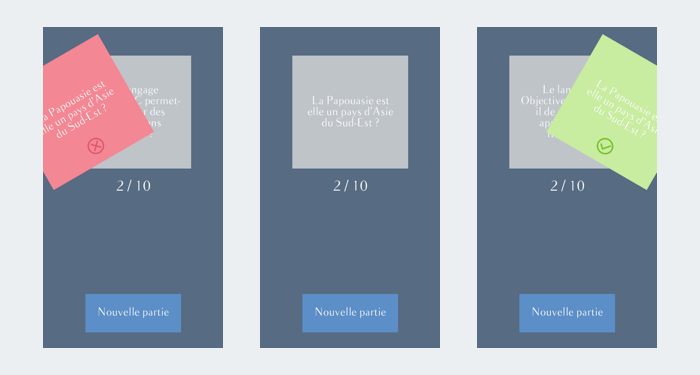

Dans l'application OpenQuizz, le joueur va pouvoir faire des parties de 10 questions. Il peut répondre par vrai ou par faux à chaque question en faisant glisser la question vers la droite ou vers la gauche. Il marque un point à chaque bonne réponse. Au bout de 10 questions, la partie s'arrête et le joueur peut lancer une nouvelle partie.

Sous son apparence simple, cette application va nous poser quelques challenges et nous allons donc voir comment gérer des images, interpréter les gestes de l'utilisateur, créer des animations et beaucoup d'autres choses !

#### Notre objectif : le modèle MVC
Lorsqu'on se lance dans de grands et beaux projets, il faut savoir où l'on va ! Comme c'est notre cas, prenons une minute pour comprendre l'objectif de ce cours !

Nous allons voir bien des choses dans ce cours comme je viens de vous l'annoncer ! Mais **le plus important, c'est le modèle MVC** ! Le modèle MVC, c'est la façon dont nous allons organiser notre programme. Cela vous paraît peut-être annexe mais vous verrez que même pour une application apparemment simple, on peut vite se faire déborder par la quantité de fichiers et de lignes de code du projet.

Heureusement, il existe une solution simple pour que le développement reste un plaisir jusqu'au bout et que vous ne vous perdiez pas dans votre projet. Et la solution, c'est d'appliquer avec rigueur le modèle MVC. Et je vous explique ça dès la fin de cette partie.

Pour insister sur ce point, voici un petit schéma qui parle de lui-même :

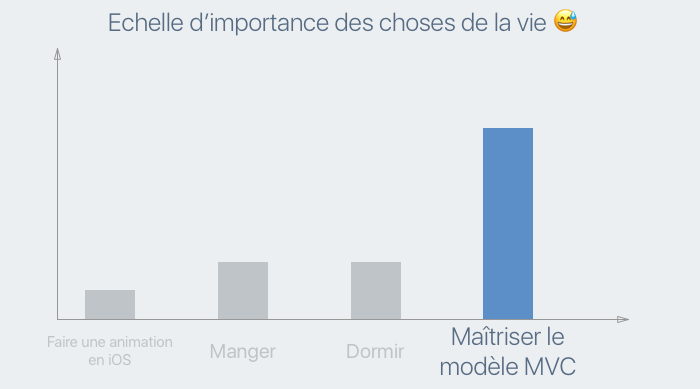

#### Approche

Tout le cours s'appuie sur la création de l'application OpenQuizz donc si vous ne faites pas l'application en même temps que moi, vous allez perdre une grande partie de l'intérêt du cours et vous apprendrez beaucoup moins vite !

Je vous invite donc fortement à **faire les choses en même temps que moi sur votre ordinateur** ! C'est la raison pour laquelle vous avez une **activité à la fin du cours dans laquelle vous allez devoir envoyer le code de votre application**. Cette activité est obligatoire pour obtenir le certificat du cours.

#### Création du projet Xcode
Alors sans plus attendre, créons ensemble le projet Xcode de notre application !

> **:information_source:** La création d'un projet Xcode est déjà détaillée complètement dans [ce cours](https://openclassrooms.com/courses/introduction-a-ios-plongez-dans-le-developpement-mobile/creez-votre-projet). C'est la raison pour laquelle je ne fais ici qu'un bref rappel.

1/ Ouvrez Xcode et choisissez *Create a new Xcode Project*
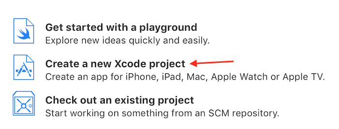
2/ Remplissez les **options** de votre projet :

> **:information_source:** Pour le nom de l'organisation, vous pouvez choisir votre nom et pour l'*organization identifier*, vous pouvez adopter la convention suivante `fr.nomprenom`.  
Soyez certains de bien choisir le langage Swift et de choisir *Universal* car on va adapter notre application à toutes les tailles d'écrans.

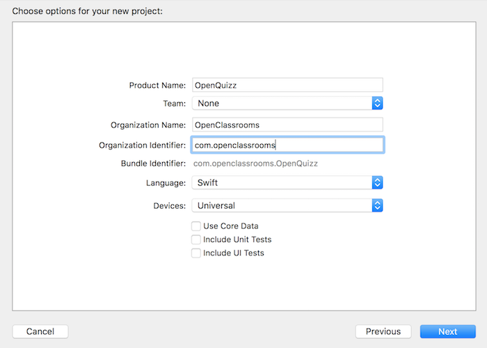

3/ Choisissez **Single View Application** pour créer une application d'une seule page.

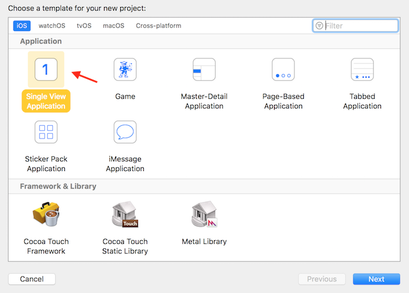

4/ Choisissez l'emplacement où vous souhaitez sauvegarder votre projet.

Ensuite, vous arrivez sur l'interface d'Xcode, ça y est votre projet est créé !

Nous allons pouvoir maintenant travailler à partir de ce projet. Et ce, dès le prochain chapitre dans lequel nous allons apprendre à **gérer les images** dans un projet d'application iPhone !

### Gérez les images

Notre dévoué designer nous a préparé un joli petit design pour notre application. Dans les chapitres de cette partie, nous allons préparer notre application pour que nous puissions facilement intégrer le design prévu par la suite. Cette partie permet donc surtout de préparer le terrain en apprenant au passage quelques techniques incontournables d'iOS. Et la première d'entre elles, c'est la gestion des images dans une application. Voyons ça ensemble dans ce chapitre !

#### Le dossier d'images
Notre designer a préparé pour vous les images que l'on va afficher dans notre application. Je vous invite à les télécharger à [cette adresse](https://s3-eu-west-1.amazonaws.com/static.oc-static.com/prod/courses/files/Parcours+DA+iOS/Cours+4+-+MVC/Assets.zip). Ouvrez le dossier et voyons ensemble ce qu'il comporte :

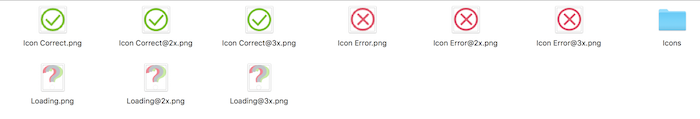

Nous avons donc 3 images différentes, de trois formats différents. Et un dossier `Icons` qui contient l'icône de l'application en différentes tailles.

#### Découvrir les assets
Pour l'instant, si vous lancez votre application et qu'ensuite, vous simulez l'appui sur le bouton *Home* du simulateur, vous verrez que notre icône d'application ressemble à ceci :

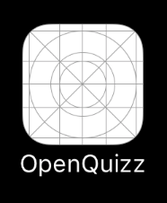

C'est l'icône par défaut d'une application. Nous allons changer ça en chargeant dans notre projet l'icône que nous avons trouvée dans le dossier. Allons-y !

Les images dans un projet Xcode, on appelle ça des *assets*. Et pour ajouter de nouveaux *assets*, il faut aller dans le dossier dédié `Assets.xcassets` :

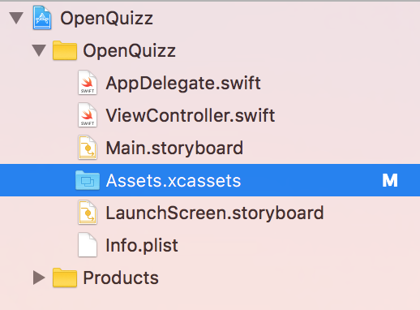

En ouvrant ce dossier, vous voyez en haut à gauche l'inscription `App Icon`. Cliquez dessus et vous voyez s'afficher ceci :

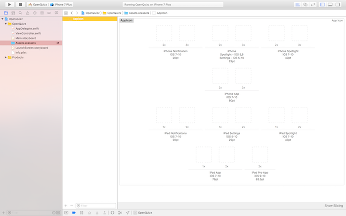

Dans ce dossier, vous avez toutes les tailles d'icônes que le logiciel réclame.

> **:question:** Pourquoi toutes ces tailles ?

D'une part, la taille dépend de l'appareil. L'icône de l'application ne s'affiche pas de la même manière sur un iPhone ou un iPad.

D'autre part, dans iOS, l'icône de l'application est utilisée à divers endroits et pour qu'elle s'affiche correctement à chacun de ses endroits, il faut donner lui donner la bonne taille. Précisément, il y a 4 tailles différentes :

Voyons un peu à quoi elles correspondent :

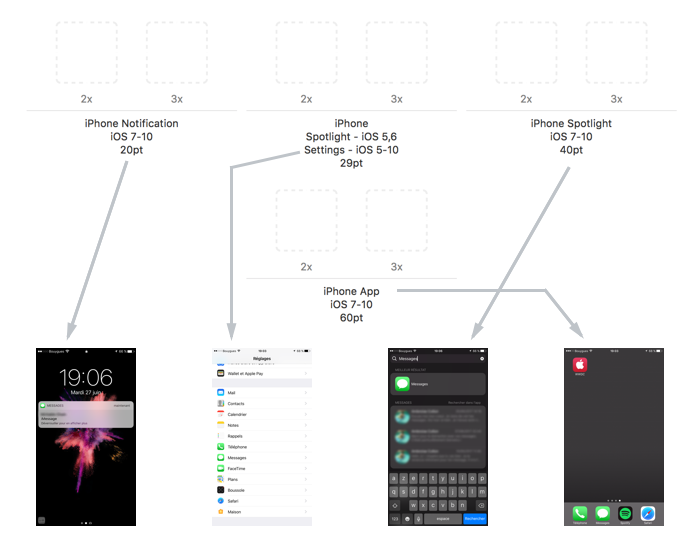

Dans le schéma ci-dessus, j'ai pris l'exemple de l'icône de l'application *Message* affichée tour dans : une notification, dans les réglages de l'iPhone, dans la recherche et sur l'icône de l'application elle-même.

#### L'écran de l'iPhone

> **:question:** Mais c'est quoi les `2x` et `3x` ?

Pour répondre à cette question, il faut comprendre rapidement comment fonctionne un écran. Un écran, c'est une grille de pixels, chaque pixel étant un petit carré de couleur uniforme.

Avec l'arrivée de l'iPhone 4, Apple a créé l'écran Retina. Cet écran a une résolution deux fois meilleure que l'écran des iPhones précédents. Cela veut dire que **sur un même espace, mettons 1 cm2, l'écran affiche 2 fois plus de pixels**. Depuis, ils ont encore amélioré l'écran et les écrans des iPhone 6s Plus et 7 Plus (les plus grands iPhone) ont une résolution 3 fois meilleure (on les appelle *Retina HD*).

> **:information_source:** Apple ne supporte plus les anciens modèles d'iPhone, iPod Touch et iPad avec iOS 11. Les modèles supportés ont désormais tous au moins l'écran Retina. Cela veut dire que si vous faîtes des applications pour iOS 11, seulement les tailles 2x et 3x seront nécessaires.

Ce changement a posé un problème. On ne peut plus parler de la taille d'une image en nombre de pixels, car cela dépend de l'écran. Du coup, Apple a créé une autre unité : le point *(pt)*. Et selon l'écran, un point est automatiquement transformé avec le bon nombre de pixels.

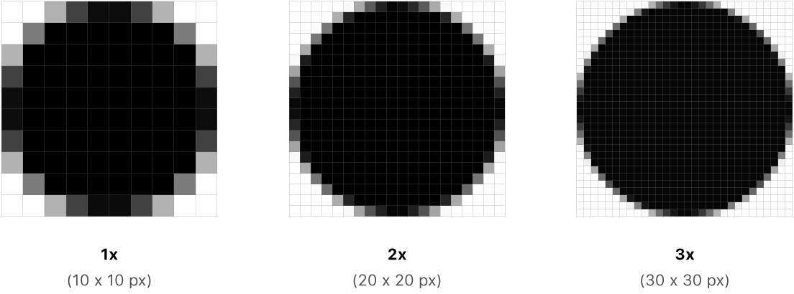

Du coup, il faut fournir toutes les images qui vont être affichées par l'application en trois tailles différentes. Et pour cela il existe une convention spécifique. Prenons un fichier `image.jpg`. Voilà comment nous allons le nommer pour les différentes tailles d'écran :

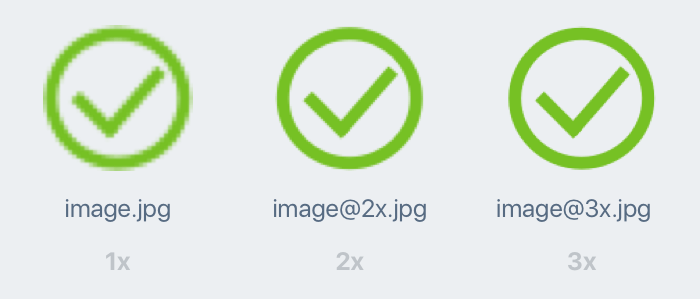

On ajoute **@2x** et **@3x** à la fin du nom du fichier pour spécifier le niveau de résolution de l'image. C'est ce qui a été fait dans le dossier d'images que vous avez téléchargé.

> **:information_source:** Sur Mac, il existe un logiciel très populaire auprès des designers web et mobile : [Sketch](https://www.sketchapp.com). Ce logiciel contient notamment une fonctionnalité très pratique pour exporter les images en trois formats différents en respectant cette convention.

#### Changer l'icône de l'application
On va pouvoir maintenant simplement glisser-déposer nos icônes depuis notre dossier vers les *assets*. Comme ceci :

> **:warning:** Pendant cette étape, vérifiez bien que vous glisser la bonne image au bon endroit. Si vous vous trompez et que les tailles ne correspondent pas, Xcode vous le signalera par un warning :  
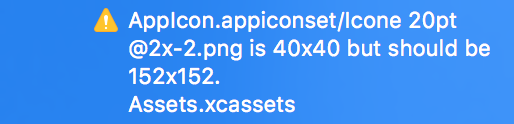  
Pas d'inquiétude, il vous suffit de réparer votre erreur en glissant la bonne icône là où vous vous êtes trompé.

Et voilà, nous avons maintenant une belle icône d'application :

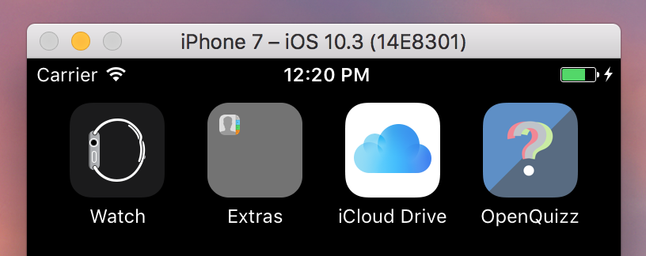

> **:information_source:** Vous noterez que l'arrondi des angles se fait automatiquement.

#### Charger les images
En plus de l'icône, notre application va également afficher des images. Pour les rajouter, il suffit de les glisser par paquet de trois (pour les trois résolutions d'écrans) dans les *assets* comme ceci :

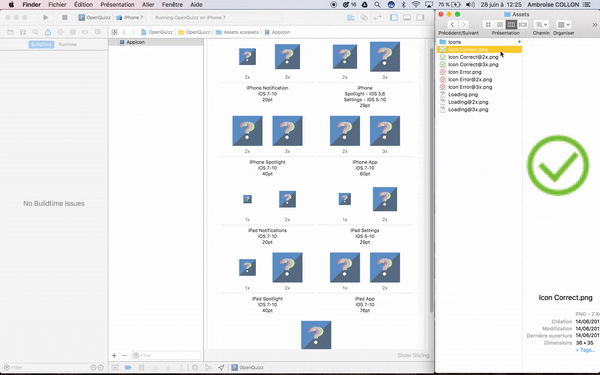

**Grâce à la convention de nommage**, Xcode reconnaît que ces trois fichiers représentent tous la même image en trois résolutions différentes. Il les groupe tous automatiquement sous le même nom `Icon Correct` qui est le nom du fichier sans l'extension.

Vous pouvez répéter l'opération pour les deux autres images. Et voilà notre projet contient de belles images que l'on va pouvoir utiliser !

#### En résumé
- Pour gérer les images et les icônes d'une application, on utilise le dossier `Assets.xcassets` dans lequel on dépose les fichiers images que l'on souhaite.
- Il existe plusieurs formats d'icônes d'application. En effet la taille de l'icône dépend :
	- De l'appareil : iPhone ou iPad
	- Du contexte dans lequel l'icône est utilisée dans iOS : notifications, réglages, etc.
- Les iPhone et iPad ont des **écrans de trois résolutions différentes** : 1x, 2x et 3x. Pour cette raison, il faut fournir toutes les images, en 3 résolutions pour qu'elles s'affichent correctement sur tous les écrans.
- Je vous invite à **respecter la convention de nommage** pour faciliter l'importation des images.

### Gérez les polices
Maintenant que nous avons de belles images prêtes à l'emploi, nous allons pouvoir passer à la suite. Notre designer a choisi une police précise pour les textes de l'application et nous allons donc devoir l'installer pour pouvoir l'utiliser dans notre application. C'est parti !

#### Télécharger la police
Dans Xcode, il y a déjà un certain nombre de polices que vous pouvez utiliser sans avoir besoin de les installer. Mais la plupart des applications créent leur propre police ou utilisent des polices trouvées sur le web. Donc il va falloir que vous sachiez installer ces polices spéciales.

Celle que nous avons pour notre application s'appelle *Balham* et vous pouvez la télécharger à [cette adresse](https://s3-eu-west-1.amazonaws.com/static.oc-static.com/prod/courses/files/Parcours+DA+iOS/Cours+4+-+MVC/Balham.otf).

#### Ajouter la police
Une fois la police téléchargée, vous avez un fichier `Balham.otf`. Vous allez maintenant glisser ce fichier dans le navigateur d'Xcode (avec les autres fichiers) comme ceci :

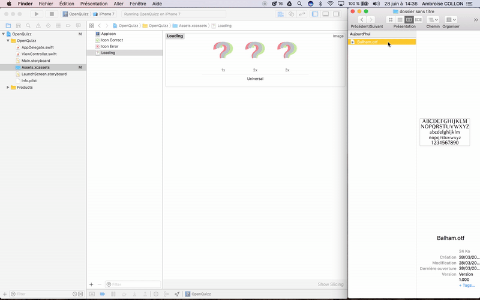

Ensuite, dans la fenêtre qui s'affiche, **cochez les options comme indiqué ci-dessous sinon votre police ne sera pas prise en compte**. Et cliquez sur *finish*.

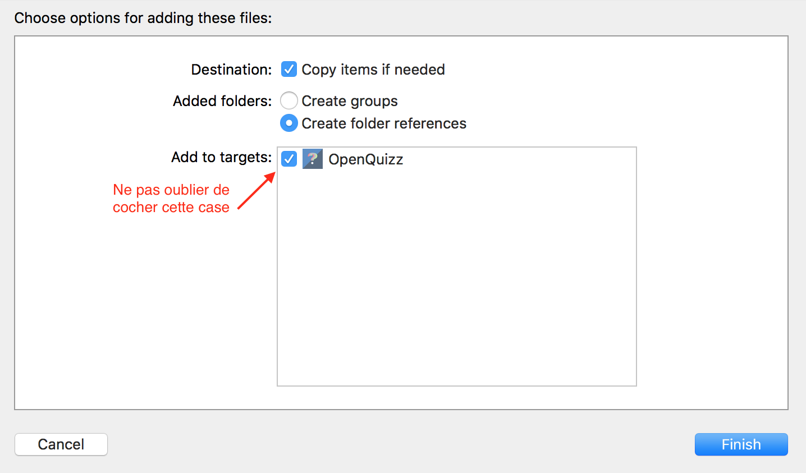

> **:information_source:** Si vous n'avez pas cocher la case *Add to targets*, vous pouvez rattraper votre erreur après coût en cliquant sur le nom du fichier de police dans le navigateur de fichiers. Puis dans les utilitaires à droite, vous pouvez cocher la case OpenQuizz dans la section *Target Membership*.

Et voilà ! Votre police est ajoutée !

#### Le fichier plist
Dans le navigateur, vous avez le fichier `Info.plist` :

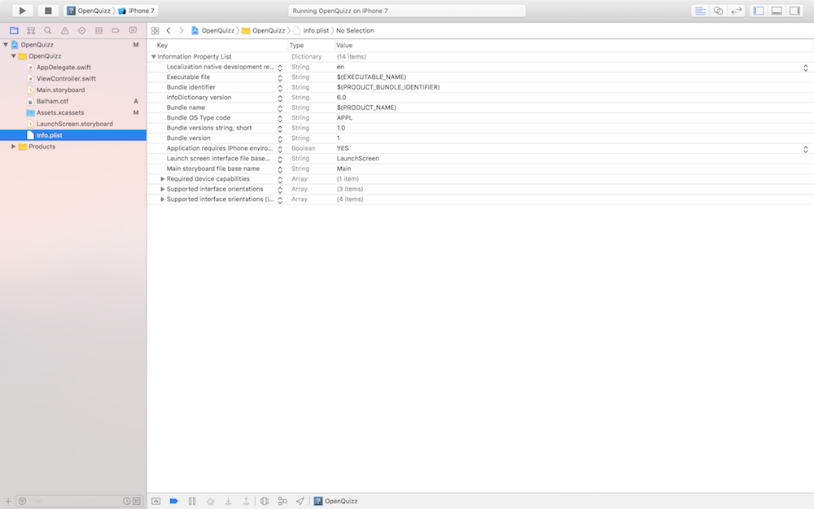

Ce fichier est un dictionnaire qui contient un certain nombre d'informations sur votre projet comme le nom de votre application, les orientations supportées par votre application, etc. Ce sont un peu **les paramètres de votre projet**.

Il vous arrivera assez régulièrement de devoir modifier ces paramètres ou d'en rajouter. Et c'est justement ce que nous avons besoin de faire pour que notre police soit prise en compte.

Pour cela, il vous faut placer votre souris au-dessus de la dernière ligne de ce fichier. Les boutons `+` et `-` apparaissent :

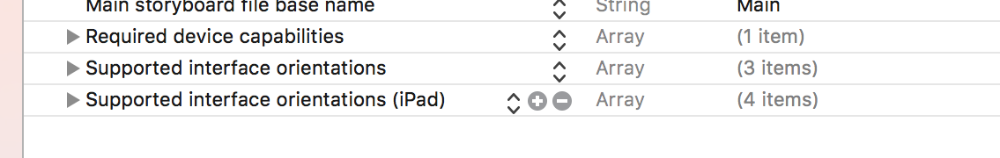

Cliquez sur `+`. Une nouvelle ligne apparait avec une liste déroulante. Choisissez dedans : *Fonts provided by application*.

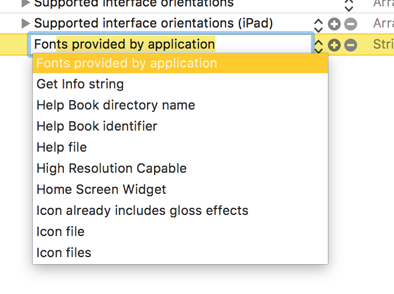

Cliquez ensuite sur le petit triangle de droite pour dérouler la ligne et inscrivez en face de *Item 0* le **nom exact du fichier** comme ceci :

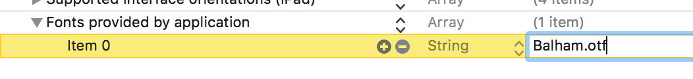

Xcode sait maintenant qu'il doit prendre en compte ce fichier comme un fichier de police. Nous avons une police toute belle et prête à l'emploi dans notre application ! Nous allons pouvoir l'utiliser dans les prochains chapitres de ce cours.

#### En résumé
- Pour installer une police dans un projet, il vous suffit de la glisser avec les autres fichiers dans le navigateur d'Xcode. N'oubliez pas de cocher la case *Add to targets* pour qu'Xcode la prenne en compte.
- Ensuite, dans le fichier `Info.plist`, vous devez ajouter la ligne : *Fonts provided by application*. Et inscrire dessous le nom exact de votre fichier de police.
- Le fichier `Info.plist` contient les paramètres de votre projet.

### Créez votre page de lancement
Nous avons maintenant notre icône, nos images et notre police. Dans ce chapitre, nous allons voir un nouvel élément essentiel d'une application : la page de lancement.

#### La page de lancement

> **:question:** C'est quoi la page de lancement ?

La page de lancement, c'est une **image fixe** que vous voyez **lorsque vous ouvrez une application** après l'avoir quittée. Cette page vous est présentée en attendant que l'iPhone ait fini de faire tous les calculs nécessaires à la présentation de l'application elle-même.

Voici les pages de lancement de quelques applications célèbres :

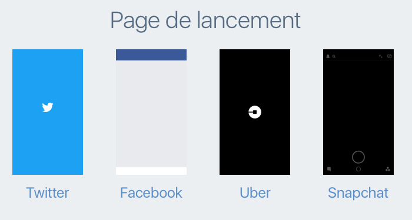

> **:warning:** Amusez-vous à regarder les pages de lancement de vos applications préférées. Mais soyons clair dès qu'il y a la moindre animation ou le moindre mouvement sur la page de lancement, ce n'est plus la page de lancement. Car la page de lancement, ça ne bouge pas !

#### L'interface builder
Dans votre projet, vous avez deux fichiers avec l'extension `.storyboard`. Ces deux fichiers sont ce qu'on appelle des fichiers d'interface builder. C'est-à-dire qu'ils vont nous permettre de dessiner nos interfaces.

Le premier s'appelle `Main.storyboard`, c'est dans ce fichier que nous allons dessiner la ou les interfaces de notre application. Mais celui qui nous intéresse ici, c'est le fichier `LaunchScreen.storyboard`. Car c'est dans ce fichier que nous allons dessiner notre page de lancement.

Ouvrez le fichier, vous arrivez sur ceci :

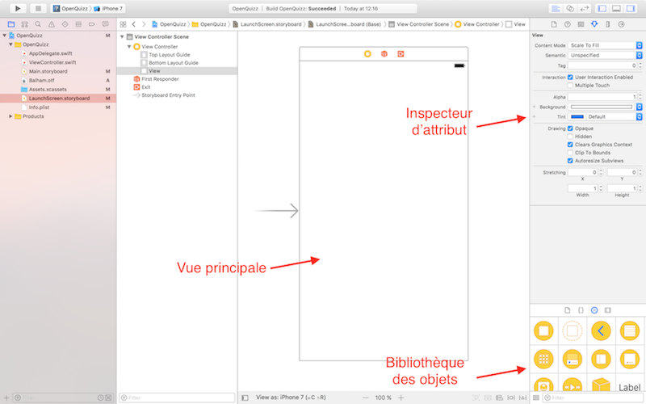

Dans cette image, je vous ai rappelé les principales sections de l'interface builder.

#### La palette de couleur
Nous allons maintenant modifier la couleur de fond de notre interface.

> **:warning:** Un [chapitre entier](https://openclassrooms.com/courses/introduction-a-ios-plongez-dans-le-developpement-mobile/preparez-l-interface) est dédié à la découverte de l'interface builder et traite en détail de la modification de la couleur de fond d'une interface. Donc ici je ne reviendrais pas là-dessus en détail.

Pour cela, nous allons d'abord cliquer sur la vue principale puis cliquer dans l'inspecteur d'attribut à droite sur le carré blanc. On voit apparaitre alors le sélecteur de couleur :

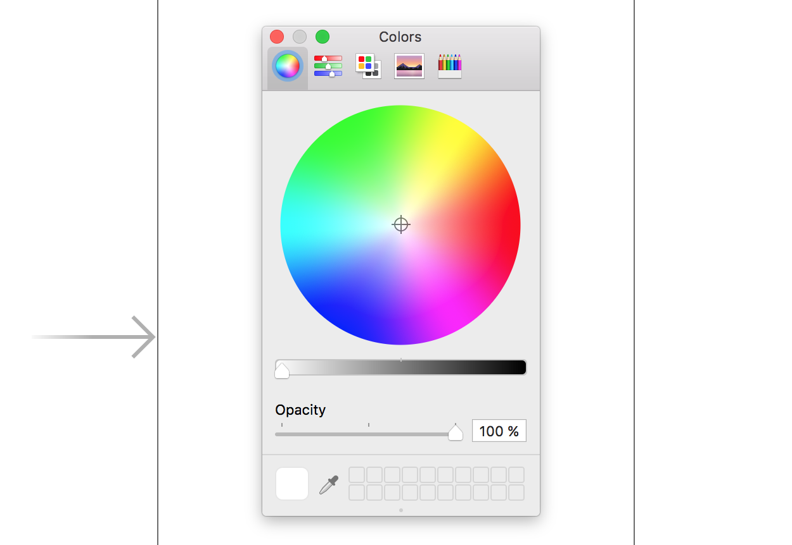

Nous devons respecter pour cette application la charte graphique qui nous a été fournie par notre designer ce qui inclut les images (OK), la police (OK) et les couleurs (pas encore OK...). Donc je vous propose de voir comment **créer une palette de couleur que nous allons pouvoir facilement réutiliser**.

Voici la palette de l'application OpenQuizz :

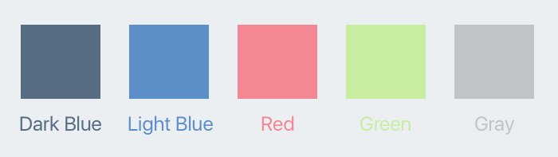

Pour recréer cette palette dans Xcode, il faut commencer par cliquer sur l'onglet palette (le 3e onglet) dans le sélecteur de couleur :

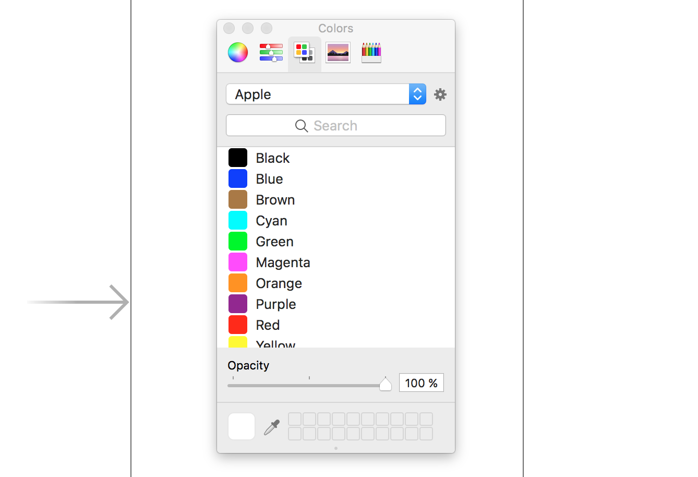

Ensuite, cliquez sur la roue dentée et choisissez *new* :

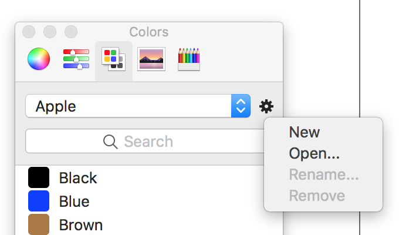

Vous pouvez à nouveau cliquer sur la roue dentée puis choisir *Rename...* pour renommer votre nouvelle palette et l'appeler OpenQuizz.

Ensuite, pour ajouter des couleurs dans votre palette, il suffit de sélectionner la couleur souhaitée avec la pipette et de cliquer sur le bouton `+` comme ceci :

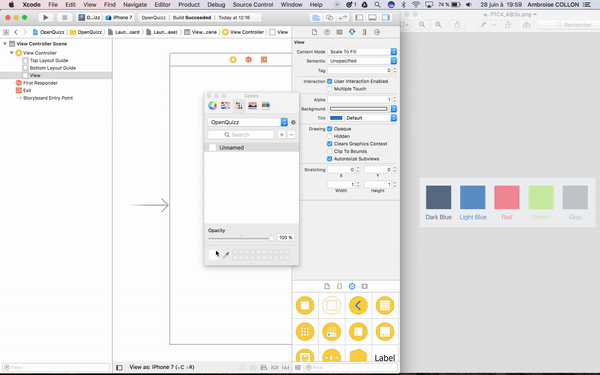

Ensuite il vous suffit de double cliquer sur le nom de votre couleur pour le changer. Vous pouvez répéter l'opération pour toutes les couleurs de la palette ci-dessus. À la fin votre palette doit ressembler à ceci :

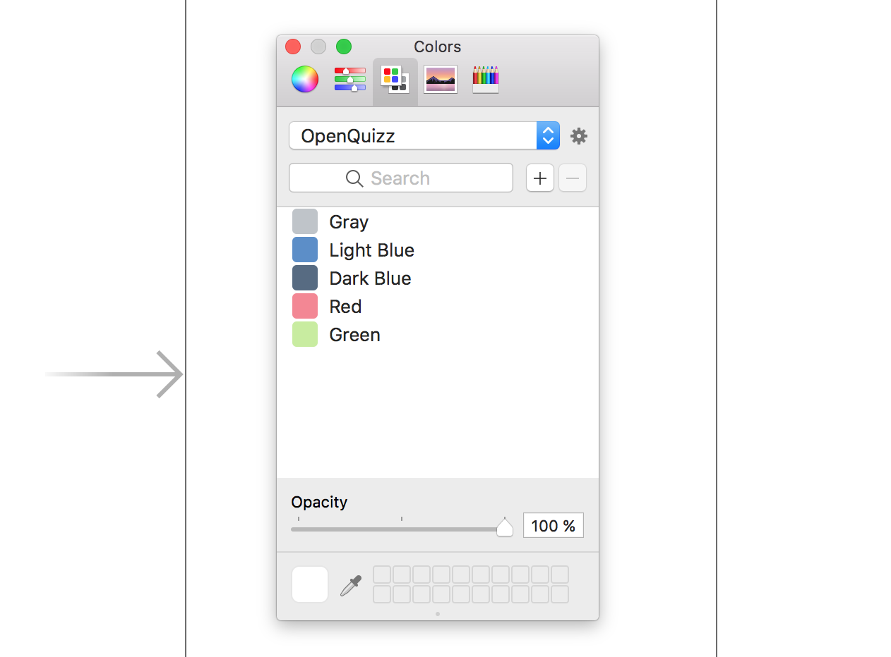

#### Construction de l'interface
On va tout de suite utiliser notre nouvelle palette pour changer la couleur de fond. Je vous laisse le faire. Choisissez la couleur *Dark Blue*.

Et maintenant, nous allons rajouter une image (le gros point d'interrogation) au milieu de notre interface. Pour cela, je vous invite à aller en bas à droite de l'écran, dans la bibliothèque des objets. Et vous allez choisir le dernier onglet : la bibliothèque des médias.

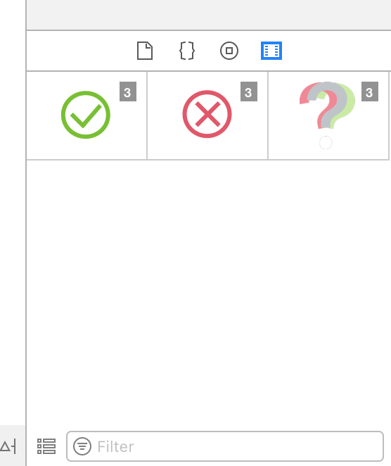

Ici vous retrouvez les images que nous avons ajoutées dans les *assets* précédemment. Vous n'avez plus qu'à glisser le point d'interrogation vers le centre de l'interface :

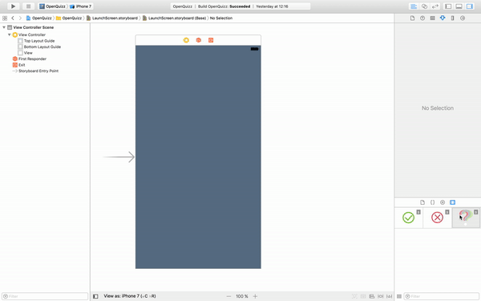

> **:information_source:** Vous pouvez utiliser les guides bleues pour placer correctement l'image.

Nous n'avons plus qu'à lancer l'application et admirer le résultat !

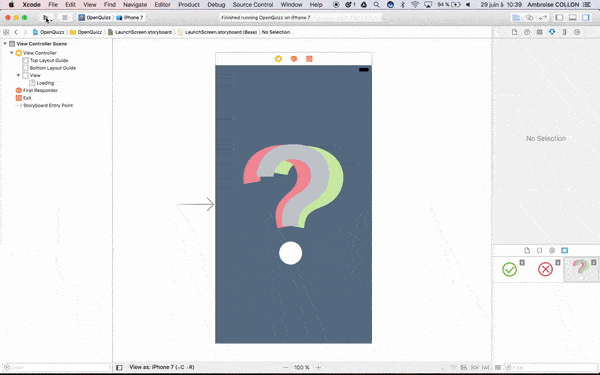

À l'ouverture de l'application, on peut voir notre page de lancement. Et ensuite apparaît notre application (une page blanche pour le moment).

#### En résumé
- La page de lancement est une image fixe qui s'affiche au lancement de votre application pendant que l'application se charge.
- Vous créez votre page de lancement dans le fichier de création d'interfaces `LaunchScreen.storyboard`.
- Dans le sélecteur de couleur, dans l'onglet palette, vous pouvez créer votre propre palette de couleur.

### Découvrez le modèle MVC
Nous avons fait tous les préparatifs de notre application. Et maintenant que vous vous êtes un peu échauffés, nous allons pouvoir attaquer le chapitre **le plus important** de ce cours : la découverte du MVC ! Est-ce que vous êtes prêts ?

Vous n’avez pas l'air tout à fait prêt... Est-ce que vous êtes *vraiment* prêts ?

Je préfère ! Alors, allons-y !

#### Un patron de conception
Le MVC est ce que l'on appelle un patron de conception. Parfois il est inutile de réinventer la roue, alors je vous propose la définition Wikipédia du patron de conception, la meilleure que j'ai pu trouver.

> En informatique, et plus particulièrement en développement logiciel, un patron de conception (souvent appelé *design pattern*) est un arrangement caractéristique de modules, reconnu comme bonne pratique en réponse à un problème de conception d'un logiciel. Il décrit une solution standard, utilisable dans la conception de différents logiciels.

Un patron de conception, c'est donc une organisation des modules qui vont composer notre programme.

> **:question:** Ça sert à quoi ?

Et bien ça sert simplement à **s'organiser**. C'est aussi bête que ça. Vous vous rendrez vite compte que dès que votre projet dépasse quelques centaines de lignes de code, ce qui arrive très vite, vous serez vite perdus si vous ne vous organisez pas. Vous ne saurez plus où se trouve telle ou telle fonction, à quoi sert tel fichier, etc. Et c'est comme ça qu'arrivent les bugs car tout se mélange dans votre code !

**C'est donc très important d'organiser son code clairement !**  
**C'est donc très important d'organiser son code clairement !**  
**C'est donc très important d'organiser son code clairement !**

> **:warning:** Je vous ai dit que c'était important ? ;)

Quand on choisit un patron de conception pour une application, on s'engage à en respecter les règles.

#### MVC, le choix d'Apple
Apple a choisi par défaut le très populaire patron de conception MVC pour les applications iPhone. Cela veut dire que la façon dont ils ont conçu le développement d'application iPhone nous encourage à respecter le design MVC.

La bonne nouvelle, c'est que parmi les dizaines de *design pattern* existant, le MVC est assez simple et pour autant assez puissant.

> **:information_source:** Le MVC a ses limites. Si vous sentez que les bugs s'accumulent, c'est soit que vous n'êtes pas rigoureux dans l'application du MVC soit que votre application est devenue trop grosse et que vous avez besoin de passer à une architecture plus solide. Dans ce deuxième cas, gardez en tête les architectures suivantes qui sont plus élaborées :
- MVP
- MVVM
- VIPER
Mais dans vos premiers mois de développement iOS, le MVC devrait largement suffire. ;)

#### MVC, pour Modèle Vue Contrôleur
Bon alors qu'est-ce que le MVC ? Le MVC est d'abord un sigle qui signifie **Modèle Vue Contrôleur**. Avec le MVC, nous allons donc séparer notre programme en trois parties comme ceci :

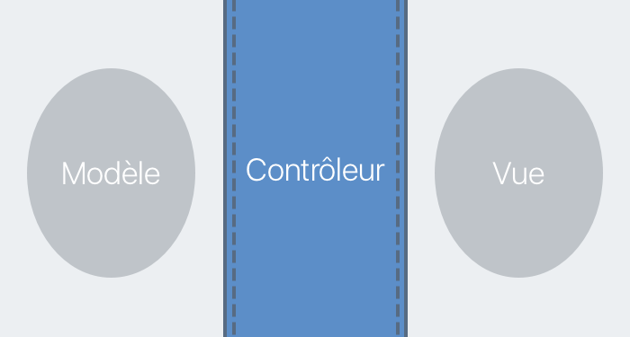

Alors qui fait quoi ?
- Le **modèle** : c'est ce que fait l'application. C'est la logique, le cerveau de l'application.
- Le **contrôleur** : il récupère les informations du modèle et les affiche dans la vue.
- La **vue** : c'est ce que l'utilisateur voit, c'est l'interface de l'application.

> **:question:** OK et concrètement ?

Bon, prenons l'exemple de l'application calculatrice. Le programme de cette application est divisé en trois selon le modèle MVC. Voyons ce qu'il se passe lorsqu'un calcul a lieu.
1. La *vue* détecte que le bouton égal a été appuyé. Elle fait passer l'information au *contrôleur*.
2. Le *contrôleur* interroge le *modèle* en lui passant les informations nécessaires : les nombres de l'opération et le type d'opération demandée.
3. Le *modèle* reçoit les nombres et les opérations et fait les calculs correspondants. Il passe le résultat au *contrôleur*.
4. Le *contrôleur* reçoit le résultat et l'envoie à la *vue*.
5. La *vue* affiche le résultat à l'écran.

On peut résumer le modèle MVC avec la phrase suivante :

> Le **contrôleur** interprète et formate les informations du **modèle** pour les passer à la **vue**.

#### Les règles de communication du MVC
Le MVC, c'est avant tout une règle de communication. Cette règle définit la façon dont les différentes parties doivent communiquer. Tout le monde ne peut pas communiquer avec tout le monde sinon ça ne sert à rien de faire des parties différentes :D !

Et la règle d’or, la voici :

> **La vue et le modèle ne peuvent JAMAIS communiquer.**

Cela veut dire que d'une part le modèle n'a aucune idée de ce à quoi ressemble l'interface, qu’elles en sont ses composants, etc. **Le modèle est complètement indépendant de l'interface**. D'autre part, la vue n'a aucune idée de la logique de l'application. Autrement dit la vue est stupide, elle a seulement pour rôle d'afficher ou de faire ce que lui dit le contrôleur.

Donc tous les échanges se font via le contrôleur. Lui seul est autorisé à parler avec la vue et avec le modèle.

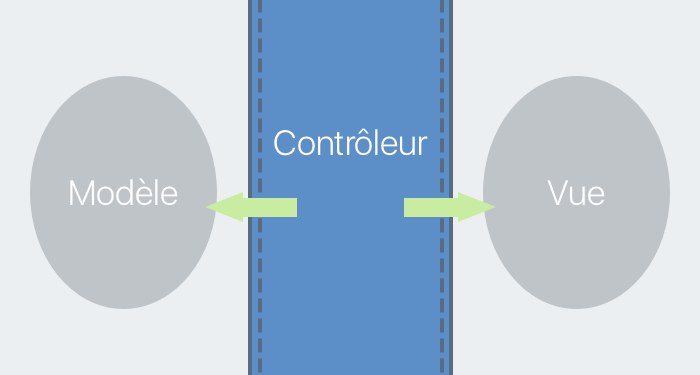

Comme le suggère le schéma ci-dessus, le contrôleur s'adresse directement au modèle et à la vue. Il peut leur demander ce qu'il veut. Comme sur la route, on peut aller des pointillés vers la ligne pleine mais pas dans l'autre sens.

Mais alors que fait-on si le modèle a de nouvelles données à faire afficher sur l'interface ? Et comment fait-on si la vue a besoin d'informer le contrôleur que l'utilisateur a touché l'écran ? Le modèle et la vue ont-ils le droit de s'addresser au contrôleur ?

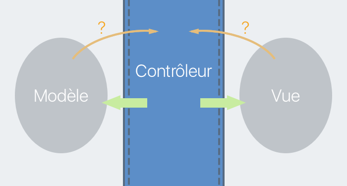

La réponse est oui... mais pas n'importe comment ! Et nous allons voir tout au long de ce cours et des suivants quels sont les moyens qu'ont le modèle et la vue de s'addresser au contrôleur.

#### Mettre en place le MVC dans notre projet

C'était pas mal de théorie mais cela était nécessaire parce que le MVC est vraiment central en iOS. Mais maintenant place à la pratique ! Nous allons finir de préparer notre application en structurant nos fichiers.

Nous allons créer trois groupes : `Model`, `View` et `Controller`.

> **:information_source:** Rappel : pour créer un groupe, il vous de faire un clic droit dans le navigateur de fichiers et de choisir l'option *New Group* :  
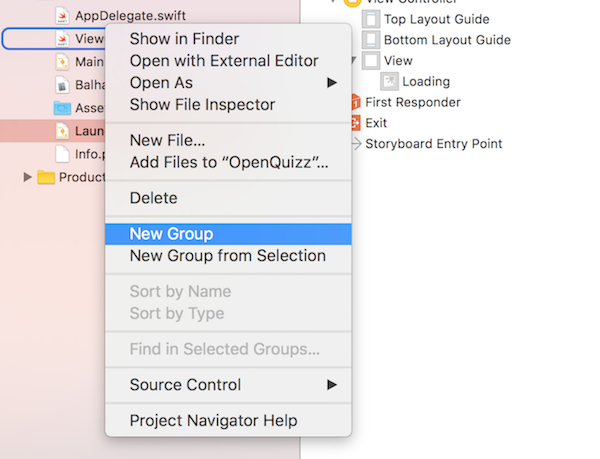

Remplissons maintenant nos groupes :
- Le *Model* ne contient rien pour le moment. Nous le remplirons dès le prochain chapitre.
- Le *Controller* contient le fichier `ViewController.swift` que nous a déjà fourni Xcode.
- La *View*, c'est ce qu'on voit, donc on y place le fichier `Main.storyboard` dans lequel nous allons construire notre interface.

> **:information_source:** Pour faire propre, vous pouvez mettre tout le reste dans un dossier *Supporting Files* pour indiquer que ce ne sont que des fichiers de support qu'on ne veut pas garder au premier plan.

Une fois tout cela effectué, votre architecture de dossier doit ressembler à ceci :

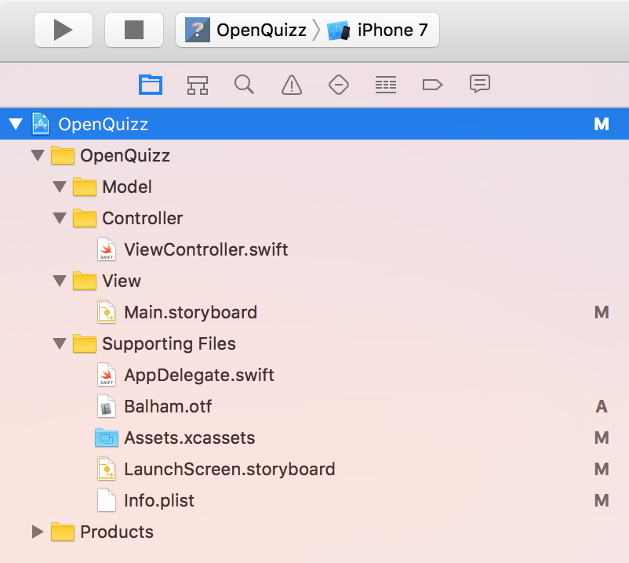

#### Le plan de ce cours
Notre application est fin prête et nous allons pouvoir nous attaquer au coeur de celle-ci dans de bonnes conditions.

Un des avantages du modèle MVC, c'est que l'on peut travailler sur chaque partie indépendamment des autres. Et c'est ce que nous allons faire dans la suite de ce cours en suivant le plan :
- Partie 2 : Modèle  
- Partie 3 : Vue  
- Partie 4 : Contrôleur

#### En résumé
- Le patron de conception MVC signifie Modèle Vue Contrôleur. Il permet de diviser son programme en trois parties indépendantes :
	- Le **modèle** : la logique de l'application.
	- Le **contrôleur** : interprète et formate les informations du modèle pour les passer à vue.
	- La **vue** : l'interface de l'application.
- **Le modèle et la vue ne peuvent JAMAIS communiquer.**
