## Préparez votre application

### Tirez le meilleur de ce cours

Bonjour à tous ! Et bienvenue dans ce cours sur la programmation iOS ! Ensemble, nous allons réaliser une application iPhone OpenQuizz ! Je vous promets que ça va être passionnant !

> **:information_source:** Mais avant de rentrer dans le détail, sachez que vous avez besoin de quelques notions avant de vous lancer. Ce cours fais partie de tout un [parcours](https://openclassrooms.com/paths/developpeur-se-dapplication-ios) sur le développement iOS donc je vous invite à suivez les cours dans l'ordre. Oui en général c'est mieux quand on commence par le début... ;)  
- Cours [1](https://openclassrooms.com/courses/introduction-a-ios-plongez-dans-le-developpement-mobile) : Introduction à iOS. *Dans ce cours, vous allez faire votre première application mobile à partir de zéro !*
- Cours [2](https://openclassrooms.com/courses/apprenez-les-fondamentaux-de-swift) et [3](https://openclassrooms.com/courses/approfondissez-swift-avec-la-programmation-orientee-objet) : Swift. *Avec ces deux cours, vous saurez tout du langage Swift !*

Vous êtes prêts ? Alors allons-y !

#### OpenQuizz

Dans ce cours, nous allons donc réaliser l'application OpenQuizz. Et sans plus de suspens, laissez moi vous la montrer :

Dans l'application OpenQuizz, le joueur va pouvoir faire des parties de 10 questions. Il peut répondre par vrai ou par faux à chaque question en faisant glisser la question vers la droite ou vers la gauche. Il marque un point à chaque bonne réponse. Au bout de 10 questions, la partie s'arrête et le joueur peut lancer une nouvelle partie.

Sous son apparence simple, cette application va nous poser quelques challenges et nous allons donc voir comment gérer des images, interpréter les gestes de l'utilisateur, créer des animations et beaucoup d'autres choses !

#### Notre objectif : le modèle MVC
Lorsqu'on se lance dans de grands et beaux projets, il faut savoir où l'on va ! Comme c'est notre cas, prenons une minute pour comprendre l'objectif de ce cours !

Nous allons voir bien des choses dans ce cours comme je viens de vous l'annoncer ! Mais **le plus important, c'est le modèle MVC** ! Le modèle MVC, c'est la façon dont nous allons organiser notre programme. Cela vous paraît peut-être annexe mais vous verrez que même pour une application apparemment simple, on peut vite se faire déborder par la quantité de fichiers et de lignes de code du projet.

Heureusement, il existe une solution simple pour que le développement reste un plaisir jusqu'au bout et que vous ne vous perdiez pas dans votre projet. Et la solution, c'est d'appliquer avec rigueur le modèle MVC. Et je vous explique ça dès la fin de cette partie.

Pour insister sur ce point, voici un petit schéma qui parle de lui-même :

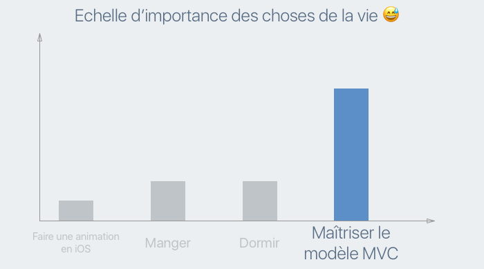

#### Approche

Tout le cours s'appuie sur la création de l'application OpenQuizz donc si vous ne faîtes pas l'application en même temps que moi, vous allez perdre une grande partie de l'intérêt du cours et vous apprendrez beaucoup moins vite !

Je vous invite donc fortement à **faire les choses en même temps que moi sur votre ordinateur** ! C'est la raison pour laquelle vous avez une **activité à la fin du cours dans laquelle vous allez devoir envoyer le code de votre application**. Cette activité est obligatoire pour obtenir le certificat du cours.

#### Création du projet Xcode
Alors sans plus attendre, créons ensemble le projet Xcode de notre application !

> **:information_source:** La création d'un projet Xcode est déjà détaillée complètement dans [ce cours](https://openclassrooms.com/courses/introduction-a-ios-plongez-dans-le-developpement-mobile/creez-votre-projet). C'est la raison pour laquelle je ne fais ici qu'un bref rappel.

1/ Ouvrez Xcode et choisissez *Create a new Xcode Project*

2/ Remplissez les **options** de votre projet :

> **:information_source:** Pour le nom de l'organisation, vous pouvez choisir votre nom et pour l'*organization identifier*, vous pouvez adopter la convention suivante `fr.nomprenom`.  
Soyez certains de bien choisir le langage Swift et de choisir *Universal* car on va adapter notre application à toutes les tailles d'écrans.

3/ Choisissez **Single View Application** pour créer une application d'une seule page.

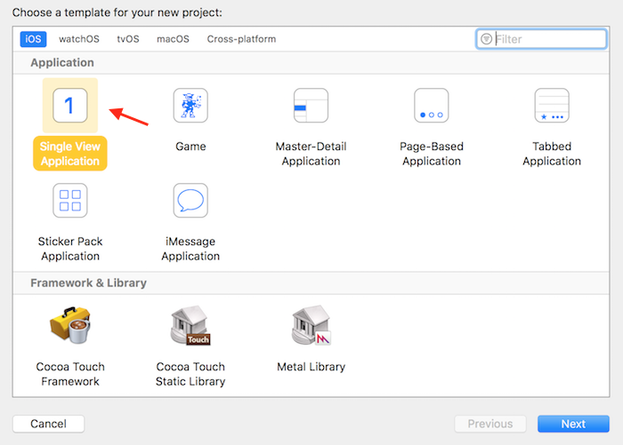

4/ Choisissez l'emplacement où vous souhaitez sauvegarder votre projet.

Ensuite, vous arrivez sur l'interface d'Xcode, ça y est votre projet est créé !

Nous allons pouvoir maintenant travailler à partir de ce projet. Et ce, dès le prochain chapitre dans lequel nous allons apprendre à **gérer les images** dans un projet d'application iPhone !

### Gérez les images

Dans ce chapitre, nous allons apprendre à gérer les images que l'on souhaite afficher dans une application iPhone.

#### Le dossier d'images
Pour cela, je vous invite à télécharger les images à [cette adresse](https://s3-eu-west-1.amazonaws.com/static.oc-static.com/prod/courses/files/Parcours+DA+iOS/Cours+4+-+MVC/Assets.zip). Ouvrez le dossier et voyons ensemble ce qu'il comporte :

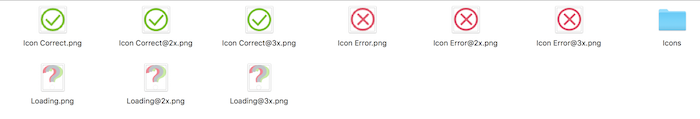

Nous avons donc 3 images différentes, de trois formats différents. Et un dossier `Icons` qui contient l'icône de l'application en différentes tailles.

#### Découvrir les assets
Pour l'instant, si vous lancez votre application et qu'ensuite, vous simulez l'appui sur le bouton *Home* du simulateur, vous verrez que notre icône d'application ressemble à ceci :

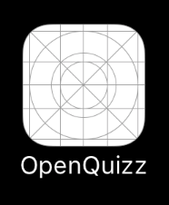

C'est l'icône par défaut d'une application. Nous allons changez ça en chargeant dans notre projet l'icône que nous avons trouvée dans le dossier. Allons-y !

Les images dans un projet Xcode, on appelle ça des *assets*. Et pour ajouter de nouveaux *assets*, il faut aller dans le dossier dédié `Assets.xcassets` :

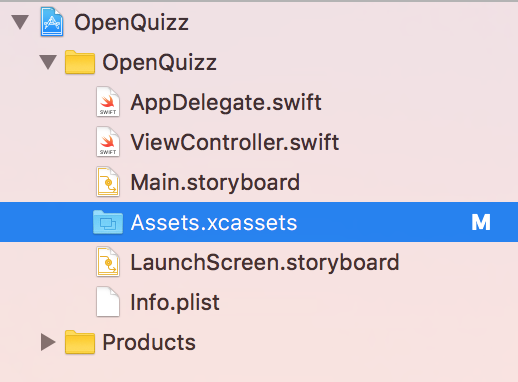

En ouvrant ce dossier, vous voyez en haut à gauche l'inscription `App Icon`. Cliquez dessus et vous voyez s'afficher ceci :

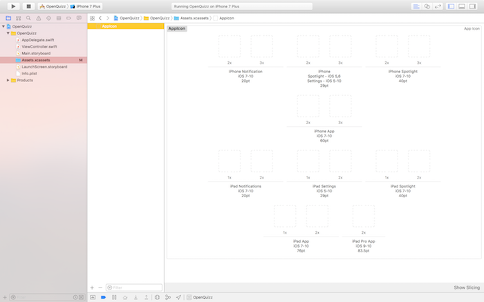

Dans ce dossier, vous avez toutes les tailles d'icônes que le logiciel réclame.

> **:question:** Pourquoi toutes ces tailles ?

D'une part, la taille dépends de l'appareil. L'icône de l'application ne s'affiche pas de la même manière sur un iPhone ou un iPad.

D'autre part, dans iOS, l'icône de l'application est utilisée à divers endroits et pour qu'elle s'affiche correctement à chacun de ses endroits, il faut donner lui donner la bonne taille. Précisément, il y a 4 tailles différentes :

Voyons un peu à quoi elles correspondent :

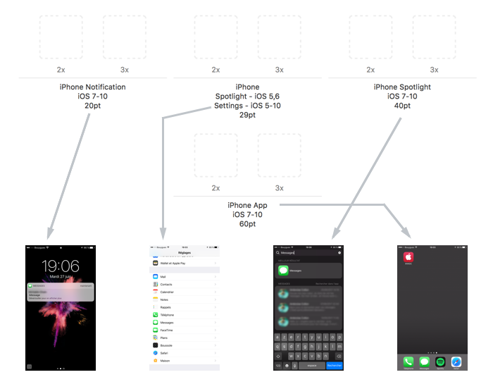

Dans le schéma ci-dessus, j'ai pris l'exemple de l'icône de l'application *Message* affichée tour dans : une notification, dans les réglages de l'iPhone, dans la recherche et sur l'icone de l'application elle-même.

#### L'écran de l'iphone

> **:question:** Mais c'est quoi les `2x` et `3x` ?

Pour répondre à cette question, il faut comprendre rapidement comment fonctionne un écran. Un écran, c'est une grille de pixels, chaque pixel étant un petit carré de couleur uniforme.

Avec l'arrivée de l'iPhone 4, Apple a créé l'écran Retina. Cet écran a une résolution deux fois meilleur que l'écran des iPhones précédents. Cela veut dire que **sur un même espace, mettons 1 cm2, l'écran affiche 2 fois plus de pixels**. Depuis, ils ont encore amélioré l'écran et les écrans des iPhone 6s Plus et 7 Plus (les plus grands iPhone) ont une résolution 3 fois meilleure.

Ce changement a posé un problème. On ne peut plus parler de la taille d'une image en nombre de pixel car cela dépends de l'écran. Du coup, Apple a créé une autre unité : le point *(pt)*. Et selon l'écran, un point est automatiquement transformé avec le bon nombre de pixels.

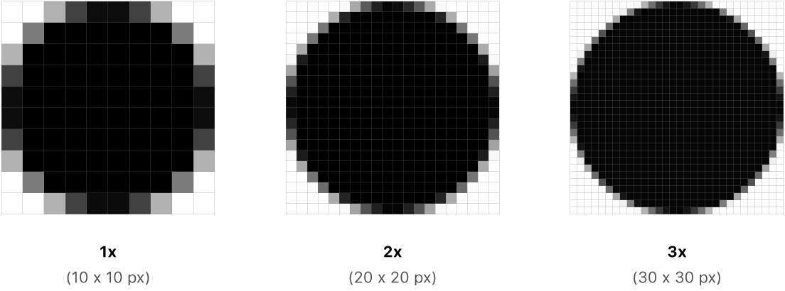

Du coup, il faut fournir toutes les images qui vont être affichées par l'application en trois tailles différentes. Et pour cela il existe une convention spécifique. Prenons un fichier `image.jpg`. Voilà comment nous allons le nommer pour les différentes tailles d'écran :

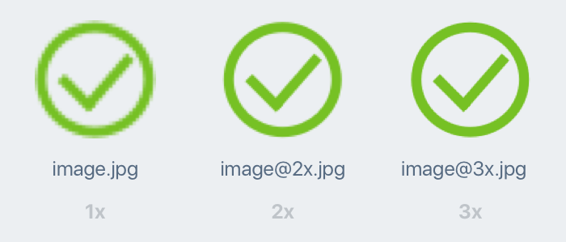

On ajoute **@2x** et **@3x** à la fin du nom du fichier pour spécifier le niveau de résolution de l'image. C'est ce qui a été fait dans le dossier d'images que vous avez téléchargé.

> **:information_source:** Sur Mac, il existe un logiciel très populaire auprès des designers web et mobile : [Sketch](https://www.sketchapp.com). Ce logiciel contient notamment une fonctionnalité très pratique pour exporter les images en trois formats différents en respectant cette convention.

#### Changer l'icône de l'application
On va pouvoir maintenant simplement glisser-déposer nos icônes depuis notre dossier vers les *assets*. Comme ceci :

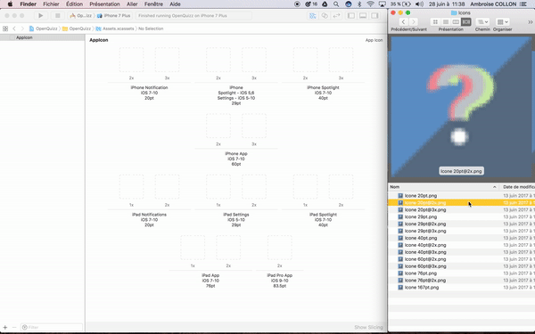

> **:warning:** Pendant cette étape, vérifiez bien que vous glisser la bonne image au bon endroit. Si vous vous trompez et que les tailles ne correspondent pas, Xcode vous le signalera par un warning :  
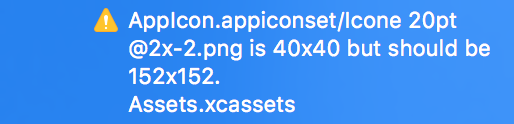  
Pas d'inquiétude, il vous suffit de réparer votre erreur en glissant la bonne icône là où vous vous êtes trompé.

Et voilà, nous avons maintenant une belle icône d'application :

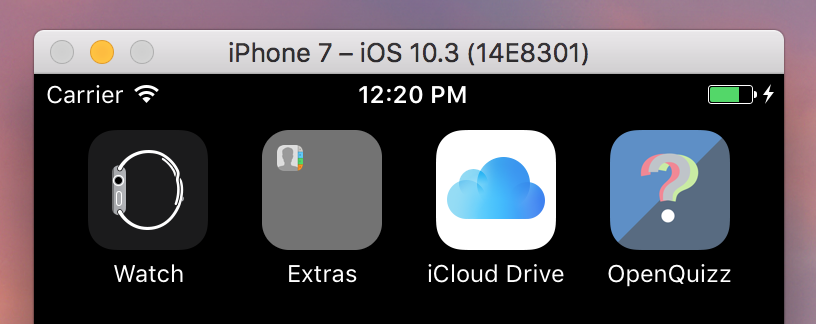

> **:information_source:** Vous noterez que l'arrondi des angles se fait automatiquement.

#### Charger les images
En plus de l'icône, notre application va également afficher des images. Pour les rajouter, il suffit de les glisser par paquet de trois (pour les trois résolutions d'écrans) dans les *assets* comme ceci :

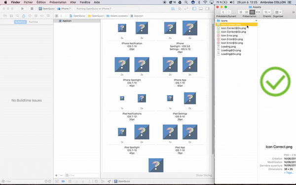

**Grâce à la convention de nommage**, Xcode reconnaît que ces trois fichiers représentent tous la même image en trois résolutions différentes. Il les groupe tous automatiquement sous le même nom `Icon Correct` qui est le nom du fichier sans l'extension.

Vous pouvez répéter l'opération pour les deux autres images. Et voilà notre projet contient de belles images que l'on va pouvoir utiliser !

#### En résumé
- Pour gérer les images et les icônes d'une application, on utilise le dossier `Assets.xcassets` dans lequel on dépose les fichiers images que l'on souhaite.
- Il existe plusieurs formats d'icônes d'application. En effet la taille de l'icône dépends :
	- De l'appareil : iPhone ou iPad
	- Du contexte dans lequel l'icône est utilisée dans iOS : notifications, réglages, etc.
- Les iPhone et iPad ont des **écrans de trois résolutions différentes** : 1x, 2x et 3x. Pour cette raison, il faut fournir toutes les images, en 3 résolutions pour qu'elles s'affichent correctement sur tous les écrans.
- Il faut **respecter la convention de nommage** pour qu'Xcode puisse comprendre de quelle résolution il s'agit.

### Gérez les polices
Parmi ce qui fait le bon design d'une application, il y a :
- les images : on l'a vu dans le chapitre précédent
- les couleurs : on va voir ça dans le prochain chapitre
- les polices : c'est ce que l'on va voir maintenant !

#### Télécharger la police
Dans Xcode, il y a déjà un certain nombre de police que vous pouvez utiliser sans avoir besoin de les installer. Mais la plupart des marques créent leur propre police ou travaillent avec des polices trouvées sur le web. Donc il va falloir que vous sachiez installer ces polices spéciales.

Celle que nous avons pour notre application s'appelle Balham et vous pouvez la télécharger à [cette adresse](https://s3-eu-west-1.amazonaws.com/static.oc-static.com/prod/courses/files/Parcours+DA+iOS/Cours+4+-+MVC/Balham.otf).

#### Installer la police
Une fois la police téléchargée, vous avez un fichier `balham.otf`. Vous allez maintenant glisser ce fichier dans le navigateur d'Xcode (avec les autres fichiers) comme ceci :

Section 1 : Installez la police  
Section 2 : Plist file  
Section 3 : Trouvez le nom de la police

### Créez votre page de chargement
Section 1 : Présentation du fichier de la page de chargement et rappel de ce qu’est interface builder
Section 2 : Palette de couleur
Section 3 : Construction de la page de chargement

### Découvrez le modèle MVC
Section 1 : Le MVC c’est un design pattern
Section 2 : Le MVC, c’est Modèle Vue Contrôleur
Section 3 : Implémenter le MVC dans notre projet
Section 4 : Annonce du plan :
Partie 2 : Modèle
Partie 3 et 4 : Vue
Partie 5 : Contrôleur
