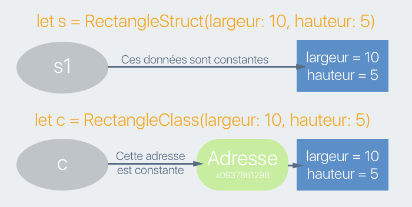

## Développez  le modèle de l’application

### Structurez les questions
Dans cette partie, nous allons développer le modèle de notre application. Le modèle c'est la logique de l'application, son cerveau. C'est aussi ici que nous allons faire appel à des ressources en base de données ou sur internet.

Allons-y !

#### Diagramme de classe
Avant de nous lancer tête baissée dans le code, prenons une minute pour dessiner notre **diagramme de classes**.

Nous allons faire un jeu de quizz. Chaque partie contient 10 questions auxquels on peut répondre par vrai ou faux. Donc, sans plus de détour, on peut rationnellement imaginer 2 classes : une classe `Question` et une classe `Game` qui va gérer la partie.

Commençons avec la classe la plus simple : `Question`. Vous allez créer un nouveau fichier `Question.swift` que vous allez placer dans le modèle. Pour cela, vous pouvez aller dans *File > New > File...*

> **:information_source:** Vous pouvez aussi utiliser le raccourci clavier <kbd>cmd + N</kbd>.

Choisissez ensuite l'option *Swift File* et cliquez sur *Next* :


Puis donner le nom `Question.swift` à votre fichier et sauvegardez le dans le modèle.


Et vous voilà avec le fichier `Question.swift` !

À vous de jouer maintenant créer la classe `Question` avec pour propriété `title` de type `String` et `isCorrect` de type `Bool`.

```swift
// Faîtes le sans regarder la correction !


class Question {
    var title = ""
    var isCorrect = false
}
```

Vous aviez trouvé ? Bravo !

Nous avons maintenant notre classe `Question`. Mais en fait, nous n'allons pas faire de classe `Question`, nous allons créer une structure `Question` ! :O

#### Vous avez dit structure ?
En Swift, il existe des modèles de données nommés. Ces modèles ont en commun de nous permettre d'organiser nos données en créant des types. Il y en a 3 :
- les classes
- les énumérations
- les structures

Vous connaissez les deux premiers (enseignés dans [ce cours](https://openclassrooms.com/courses/approfondissez-swift-avec-la-programmation-orientee-objet)) et dans ce chapitre, nous allons étudier le dernier !

Une structure ressemble à 90% à une classe. Les différences sont donc assez subtiles, mais suffisantes pour qu'on s'y intéresse.

Pour créer une structure, on utilise le mot-clé `struct`. Vous pouvez donc remplacer dans votre code le mot-clé `class` par le mot-clé `struct` et obtenir ceci :
```swift
struct Question {
    var title = ""
    var isCorrect = false
}
```
Et comme vous pouvez le constater, nous n'avons pas d'erreur ! Je vous l'avais dit, les structures sont très proches des classes.

Dans une structure, comme dans une classe, vous pouvez :
- **Déclarer des propriétés**, qu'elles soient calculées ou non, de classe ou d'instance. Tout ce que vous savez sur les propriétés dans les classes est vrai pour les structures.
- **Déclarer des méthodes** : Idem, tout ce que vous savez sur les méthodes dans les classes est vrai pour les structures.
- **Déclarer des initialiseurs** : La plupart de ce que vous savez déjà est vrai pour les structures, mais il y a des petites subtilités que nous verrons.

Alors quelles sont les différences ? Il y en a 2 majeures :
- **L'héritage n'existe pas avec les structures**. Une structure ne peut pas avoir de structure fille ou mère.
- **Les structures sont des types par valeur tandis que les classes sont des types par référence.**

#### Type par référence et type par valeur
> **:question:** Ouh là, tu viens de dire deux trucs compliqués en même temps ! Tu t'expliques ?

Bien sûr, ça vaut une petite (grosse... ;)) explication :

- **Type par référence** : lorsqu'on initialise une instance de classe, on déclare à la mémoire de notre ordinateur : "*Trouve-moi un endroit où je vais pouvoir stocker un objet*". L'ordinateur s'exécute et renvoie une adresse en mémoire où l'instance va pouvoir stocker des informations. Donc quand on écrit : `var instance = MaClasse()`, la variable `instance` ne contient pas un objet, mais seulement une adresse en mémoire (une *référence*) à laquelle se trouve l'objet.
- **Type par valeur** : lorsqu'on initialise une instance de structure, on déclare à la mémoire de notre ordinateur : "*Sauvegarde les valeurs X et Y*". Donc quand on écrit `var instance = MaStructure()`, l'instance contient directement toutes les *valeurs* stockées dans l'objet.

Pour bien comprendre tout cela, je vous propose de voir ensemble deux conséquences concrètes de cette différence. Ouvrez un nouveau Playground et copiez le code suivant :

```swift
class RectangleClass {
    var hauteur = 0
    var largeur = 0

    init(largeur: Int, hauteur: Int) {
        self.largeur = largeur
        self.hauteur = hauteur
    }
}

struct RectangleStruct {
    var hauteur = 0
    var largeur = 0

    init(largeur: Int, hauteur: Int) {
        self.largeur = largeur
        self.hauteur = hauteur
    }
}
```

Dans ce code, vous avez une classe `RectangleClass` et une structure `RectangleStruct` qui ont rigoureusement le même contenu.

##### Assigner une instance à une autre
Créons une instance de `RectangleStruct` :
```swift
var s1 = RectangleStruct(largeur: 10, hauteur: 5)
```
Maintenant, je crée une deuxième variable `s2`, je lui affecte la valeur `s1` et je modifie sa propriété hauteur :
```swift
var s2 = s1
s2.hauteur = 8
```

Si j'affiche les hauteurs de s1 et s2, j'obtiens bien ceci :
```swift
s1.hauteur // 5
s2.hauteur // 8
```

Tout paraît normal. Les choses deviennent intéressantes si je fais la même chose avec la classe :
```swift
var c1 = RectangleClass(largeur: 10, hauteur: 5)
var c2 = c1
c2.hauteur = 8
```

Et si je compare les hauteurs :
```swift
c1.hauteur // 8
c2.hauteur // 8
```

Les deux hauteurs ont la même valeur ! Donc quand j'ai modifié ma référence à la deuxième instance, la première a été modifiée également. C'est toute la différence entre le type par référence et le type par valeur.

Avec la structure, quand j'écris `var s2 = s1`, le programme **copie toutes les valeurs** de `s1` et les mets dans un nouvel objet qui est affecté à `s2`. Donc `s1` et `s2` représentent des objets différents. Donc quand `s2` modifie ses propriétés, `s1` n’est pas affecté.  


Avec la classe, quand j'écris `var c2 = c1`, le programme copie **l'adresse** de `c2`et la passe à `c1`. Donc `c1` et `c2` font *référence* au même objet. Donc quand c2 modifie ses propriétés, c1 subit les mêmes modifications.


##### La mutabilité
Faisons une deuxième expérience, déclarez une instance constante de notre classe et essayez de modifier ses propriétés.
```swift
let c = RectangleClass(largeur: 10, hauteur: 5)
c.hauteur = 12 // Pas de souci
```

Faisons la même chose avec la structure :
```swift
let s = RectangleStruct(largeur: 10, hauteur: 5)
s.hauteur = 12 // Erreur !
```

Cette fois, ça ne marche pas ! **Une instance d'une structure déclarée avec let a ses propriétés constantes**. Tout est constant et plus rien ne peut être modifié. Car les structures représentent directement leurs valeurs, donc si la structure est constante, toutes les valeurs contenues le sont aussi.

En revanche, une instance de classe est associée à une adresse donc si l'instance est constante, cela veut dire que **l'adresse seulement est constante**. On ne peut pas lui attribuer une nouvelle adresse, c'est-à-dire lui affecter un nouvel objet. Mais on peut modifier ses propriétés !



#### Différences pratiques
Les deux grandes différences entre les classes et les structures sont donc :
- les structures n'ont pas d'héritage
- les structures sont un type par valeur et les classes un type par référence

Hormis ces deux grandes différences, il existe quelques différences pratiques et je vais vous en citer deux principales :

##### 1. L'initialisation par défaut
Si on reprend notre structure `RectangleStruct`, on peut lui enlever ses valeurs par défaut et son initialisation et contrairement à la classe, cela ne déclenchera pas d'erreur :

```swift
struct RectangleStruct {
    var hauteur: Int
    var largeur: Int
}
```

La raison, c'est que les structures ont une petite fonctionnalité bien pratique. Elles sont équipées automatiquement d'un **initialiseur par défaut qui prend en paramètre ses propriétés stockées**. Autrement dit, sans avoir déclaré un initialiseur, je peux écrire :
```swift
var s = RectangleStruct(hauteur: 12, largeur: 3)
```
Pratique, non ?

##### 2. Les fonctions mutantes
Une structure a comme vous l'avez vous un rapport direct avec ses valeurs. Et elle ne laisse pas n'importe qui les modifier ! Notamment si vous déclarer une méthode qui modifie une ou plusieurs propriétés de la structure, **vous devez rajouter le mot-clé `mutating` pour signifier à la structure que cette fonction risque de modifier certaines propriétés**. Par exemple :

```swift
mutating func doublerLaTaille() {
		hauteur *= 2
		largeur *= 2
}
```

> **:information_source:** Ne vous faites pas de souci, si vous l'oubliez, une erreur vous le rappellera sans tarder !

#### Utilisation
C'est le moment de la grande question : quand dois-je utiliser une structure plutôt qu'une classe ? Je vous propose une réponse simple :

> Si votre modèle de donnée sert principalement à **stocker des données** et qu'il effectue **peu de logique**, choisissez une structure.

Donc si vous n'avez pas ou très peu de méthodes, une structure fera sans doute mieux l'affaire. C'est la raison pour laquelle j'ai choisi une structure pour notre type `Question`.

> **:warning:** Apple recommande de plus en plus, l'utilisation des structures au lieu des classes. Donc, n'oubliez pas de suivre les suggestions d'utilisation les concernant !

Tous les types simples que vous connaissez : Int, Double, Float, String, Bool, Dictionnaire, Tableau sont des structures en Swift.

#### Exercice
Créez une structure sur codevolve  

#### En résumé
- Vous connaissez maintenant tous les modèles de données nommés de Swift : les classes, les structures et les énumérations. Bravo !
- Une structure ressemble beaucoup à une classe avec 2 différences fondamentales :
	- les structures n'ont **pas d'héritage**.
	- les structures sont un **type par valeur** et les classes un **type par référence**.
- Utiliser une structure lorsque vous cherchez principalement à stocker des données.

### Téléchargez les questions
Nous avons maintenant une structure `Question` et nous allons donc pouvoir créer notre classe `Game`. Contrairement à la structure `Question`, cette classe va contenir beaucoup de logique. C'est la raison pour laquelle, nous allons choisir une classe plutôt qu'une structure.

#### Exercice : Création d’une classe Game  
Et on commence très fort ce chapitre avec déjà un exercice ! En effet, vous savez très bien créer des classes, donc je vous propose de la créer sans moi dans cet exercice. Faites-le vraiment sinon vous risquez d'être perdus lorsqu'on devra utiliser notre classe `Game`.

[Exercice Codevolve]

Une fois l'exercice terminé, vous pouvez télécharger le fichier [Game.swift](https://s3-eu-west-1.amazonaws.com/static.oc-static.com/prod/courses/files/Parcours+DA+iOS/Cours+4+-+MVC/Game.swift) et le glisser dans votre modèle (c'est la même opération que ce qu'on a fait avec la police Balham).

> **:warning:** Le fichier est un tout petit peu différent que celui que vous avez créé dans l'exercice. La raison est simple, une fonction ne doit faire qu'une seule chose ! C'est un bon principe pour maintenir un code propre. Donc j'ai extrait quelques fonction privé pour simplifier la lecture du code. Je vous invite à y jeter un oeil.

#### QuestionManager
Notre quizz va charger ses questions depuis internet. Plus précisément, nous allons charger nos questions depuis la base de données de questions gratuites : [Open Triva Database](https://opentdb.com). Les requêtes réseau ne sont pas au programme de ce chapitre donc je l'ai fait pour vous. Vous pouvez donc télécharger le fichier : [QuestionManager.swift](https://s3-eu-west-1.amazonaws.com/static.oc-static.com/prod/courses/files/Parcours+DA+iOS/Cours+4+-+MVC/QuestionManager.swift). Vous pouvez ensuite glisser ce fichier dans votre modèle.

Ce fichier est un peu compliqué et nous n'allons pas rentrer dans le détail de ce qu'il fait. Sachez seulement qu'il récupère 10 questions dans la base de données, les formatte et les renvoie. Il le fait via la seule méthode publique  de cette classe qui a pour signature `get(completionHandler: @escaping ([Question]) -> ())`. Et c'est cette méthode que nous allons utiliser pour finaliser la méthode `refresh` de notre classe `Game`.

> **:question:** Doucement mon garçon. Tu veux vraiment qu'on utilise cette méthode ?

Oui, pourquoi ?

> **:question:** Tu as vu la tête du machin ?!!

Bon OK, ça peut paraître un peu impressionnant, mais rassurez-vous. À la fin de chapitre, cela n'aura plus de secret pour vous.

D'ailleurs vous en comprenez déjà une bonne partie. Nous avons une fonction qui s'appelle `get` et qui admet un paramètre `completionHandler`. Il nous reste à voir ensemble ce que veut dire : `@escaping ([Question]) -> ()`. Mettons le `@escaping` de côté pour le moment et intéressons-nous à `([Question]) -> ()`.

#### Le type fonction
Ceci : `([Question]) -> ()` est un type un peu particulier : le type fonction. Oui, **les fonctions ont un type**. De toute façon, tout a un type en Swift !

Le type fonction a une syntaxe un peu particulière. On écrit d'abord entre parenthèses, les types des paramètres puis une flèche puis le type de retour. Prenons quelques exemples de fonctions et tâchons de trouver leur type.

```swift
func double(a: Int) -> Int { (...) } // (Int) -> Int
func multiplie(a: Int, b: Int) -> Int { (...) } // (Int, Int) -> Int
func envoyer(message: String) -> Bool { (...) } // (String) -> Bool
func annuler() { (...) } // () -> ()
func annuler() { (...) } // () -> Void
func saluer(personne: String) // (String) -> ()
```
Ce n'est donc pas plus compliqué que ça ! Donc si on fait le travail inverse : le type `([Question]) -> ()` décrit une fonction qui prend en paramètre un tableau de questions et qui ne renvoie pas de valeur.

> **:warning:** Vous noterez que les paramètres sont toujours entre parenthèses tandis que la valeur de retour n'en a pas. Si la fonction n'a pas de valeur de retour ou pas de paramètre, on laisse des parenthèses vides (ou le mot-clé `Void` pour la valeur de retour).

Le type question est donc un type et par conséquent il peut être utilisé n'importe où : comme type d'une variable, comme paramètre ou valeur de retour d'une fonction, comme type d'un tableau etc. Je vous propose de jouer un peu avec dans le Playground. Copiez les 4 fonctions suivantes :
```swift
func ajouteDeux(x: Int) -> Int {
    return x + 2
}

func multiplieParTrois(x: Int) -> Int {
    return x * 3
}

func soustraitQuatre(x: Int) -> Int {
    return x - 4
}

func multiplieParDeux(x: Int) -> Int {
    return x * 2
}
```

Ces quatre fonctions sont du même type : `(Int) -> Int`. Donc on peut créer un tableau qui les regroupe toutes :
```swift
var mesFonctions = [ajouteDeux, multiplieParTrois, soustraitQuatre, multiplieParDeux]
```

Ce tableau est donc du type `[(Int) -> Int]`. Maintenant je peux, par exemple, faire une boucle for pour parcourir mon tableau :
```swift
var a = 2
for maFonction in mesFonctions {
    a = maFonction(a)
}
```
À chaque tour du tableau, c'est une fonction différente qui est utilisée et `a` vaut 16 à la fin.

#### Une autre façon de renvoyer une valeur de retour
Il y a une question que vous ne m'avez pas encore posée !

> **:question:** Pourquoi la fonction `get` de `QuestionManager` a une fonction en paramètre ?

Exactement ! Vous êtes impressionnant ;) !

Le rôle de la fonction `get` est juste de renvoyer un tableau de questions téléchargées sur internet.

> **:question:** Pourquoi elle ne ressemble pas juste à : `func get() -> [Question]` ?

Excellente question ! En fait, cette fonction est un peu particulière, car on ne sait pas quand la valeur de retour va arriver. Cela va dépendre de la qualité du réseau et du temps de réponse du serveur etc. Autrement dit, dès qu'on va chercher des ressources sur internet, on est obligé d'**attendre la réponse**. Or une fonction avec valeur de retour s'exécute instantanément et donc les questions n'ont pas le temps d'être chargées.

Du coup à la place, on donne à l'utilisateur de la méthode `get` la possibilité d'**exécuter une fonction lorsque le chargement des questions est terminé**. On passe alors en paramètre de cette fonction à exécuter les questions que nous venons de charger.

Donc nous allons créer une méthode dans notre classe `Game` que l'on va appeler `receiveQuestion` dont le rôle va être de gérer les questions reçues. Cette fonction va être du type `([Question]) -> ()` :

```swift
private func receiveQuestions(_ questions: [Question]) {
	self.questions = questions
	state = .ongoing
}
```

Lorsqu'on reçoit les questions, on fait donc deux choses :
1. Affecter les questions à la propriété `questions` de `Game`.
2. Passer la propriété `state` de `Game` à la valeur `ongoing`. Les questions sont chargées, la partie peut reprendre.

Maintenant nous allons pouvoir passer cette nouvelle fonction en paramètre de la fonction `get`. Et nous allons faire cela dans notre méthode `refresh`.

> **:information_source:** Pour appeler la fonction `get`, il faut passer par la propriété de classe `shared` de `QuestionManager`, on appelle cela le *pattern singleton*. C'est une technique que nous verrons dans un prochain cours.

```swift
func refresh() {
	score = 0
	currentIndex = 0
	state = .over

	QuestionManager.shared.get(completionHandler: receiveQuestions)
}
```

Ici, on appelle donc la méthode `get` du `QuestionManager` et on lui passe en paramètre la méthode `receiveQuestions`. Cela signifie que lorsque les questions sont chargées, la méthode `receiveQuestions` est appelée.

> **:information_source:** Si vous voulez tester l'exécution de cette méthode, vous pouvez utiliser le fichier `AppDelegate.swift`. Ce fichier contient la méthode `application(_ application: UIApplication, didFinishLaunchingWithOptions launchOptions: [UIApplicationLaunchOptionsKey: Any]?) -> Bool`. Cette fonction est appelée au lancement de l'application. Vous pouvez donc tester du code dans cette méthode en lançant l'application. Par exemple, vous pouvez écrire :  
```swift
let game = Game()
game.refresh()
```  
Ensuite, en ajoutant un `print(questions)` dans la méthode `receiveQuestions`, vous pouvez vérifier que tout fonctionne bien en lançant l'application.

Vous voyez ? Nous avons réussi à utiliser cette méthode `get`. Ce n'était pas si dur finalement ! Notre méthode `refresh` est maintenant complète et permet de remettre à zéro les paramètres de la partie, de charger les questions et de relancer la partie.

#### Exercice

##### 1/ Trouvez les types des fonctions suivantes

```swift
func ajouterDeux(a: Int) -> Int { (...) }
func additioner(a: Int, b: Int) -> Int { (...) }
func envoyerMail(message: String, destinataire: String) -> Bool { (...) }
func cocherLaCase(aCoché: Bool) { (...) }
func verrouiller()
func composerNumero(_ numero: Int)
```

Vous pouvez trouver la correction [ici](https://s3-eu-west-1.amazonaws.com/static.oc-static.com/prod/courses/files/Parcours+DA+iOS/Cours+4+-+MVC/TrouvezLesTypes.txt).

##### 2/ Utiliser les types fonctions
Dans cet exercice, on cherche à calculer la somme d'un tableau d'entier selon les règles suivantes :
- si le nombre est pair, on le divise par deux avant de l'aditionner aux autres
- si le nombre est impair, on ajoute un puis on le divise par deux avant de l'additioner aux autres

Le code suivant vous est déjà fourni :

```swift
func diviserNombrePairParDeux(x: Int) -> Int {
    return x / 2
}

func diviserNombreImpairParDeux(x: Int) -> Int {
    return (x + 1) / 2
}

func obtenirDivision(x: Int) -> (Int) -> (Int) {
	// complétez cette fonction
}

let tableau = [2, 12, 3, 14, 76, 19, 7, 22]
var somme = 0

for nombre in tableau {
	// complétez cette boucle
}
```

Vous devez compléter la fonction `obtenirDivision`. Cette fonction renvoie une des deux fonctions au dessus en fonction de la parité de son paramètre `x`. Vous noterez que le type de retour de cette fonction corresponds bien au type des deux fonctions du dessus. Ensuite, vous devez utiliser la fonction `obtenirDivision` pour compléter la boucle.

Une fois l'exercice terminé, vous pouvez aller lire la correction [ici](https://s3-eu-west-1.amazonaws.com/static.oc-static.com/prod/courses/files/Parcours+DA+iOS/Cours+4+-+MVC/DivisionPairImpair.swift).

#### En résumé
- Les fonctions sont des types, on appelle cela le **type fonction**.
- Le type fonction a pour syntaxe : `(TypeParam1, TypeParam1, TypeParam1) -> TypeRetour`.
- On peut utiliser les types fonction pour passer des fonctions en paramètre d'autres fonctions notamment.

### Améliorez le chargement avec les fermetures
Dans ce chapitre, nous allons améliorer notre méthode `refresh` du chapitre précédent. Et nous allons faire cela avec les fermetures !

**Une fermeture** (en anglais *closures*) en Swift **permet d'utiliser une fonction sans l'avoir déclaré avant**. Une fermeture, c'est du coup une fonction qui n'a pas de nom. Nous allons essayer de remplacer notre fonction `receiveQuestions` par une fermeture.

#### Syntaxe
Les fermetures ont une syntaxe un peu particulière. L'animation suivante vous montre la différence de syntaxe entre une fermeture et une fonction.


Une fermeture **commence par une accolade**. Ensuite on lui passe les paramètres et les valeurs de retour comme une fonction normale. Ensuite on ajoute le mot clé `in`. Et ensuite vient le corps de la fermeture terminé par une accolade.

Essayons donc de remplacer notre fonction `receiveQuestions` par une fermeture :

```swift
QuestionManager.shared.get(completionHandler: { (questions: [Question]) -> () in

})
```

L'avantage des fermetures, c'est qu'il existe plusieurs façons d'en simplifier l'écriture. Tout d'abord comme pour une fonction, quand la fermeture n'a pas de valeur de retour, on peut l'omettre.

```swift
QuestionManager.shared.get(completionHandler: { (questions: [Question]) in

})
```

Ensuite, comme le paramètre `completionHandler` est de type `([Question]) -> ()`, Swift est capable de déduire que le type de notre paramètre `questions` est `[Question]` donc nous n'avons pas besoin de le préciser.

```swift
QuestionManager.shared.get(completionHandler: { (questions) in

})
```

Ensuite, les fonctions qui terminent par une fermeture admettent une syntaxe simplifiée. On peut omettre le paramètre `completionHandler` et écrire la fermeture en dehors des parenthèses :

```swift
QuestionManager.shared.get() { (questions) in

}
```

Enfin, comme cette fonction n'admet pas d'autre paramètre que la fermeture, on peut même supprimer les parenthèses.

```swift
QuestionManager.shared.get { (questions) in

}
```
Élégant, vous ne trouvez pas ? Swift, c'est beau...

Maintenant, nous pouvons rajouter le corps de la fonction :

```swift
QuestionManager.shared.get { (questions) in
	self.questions = questions
	self.state = .ongoing
}
```

> **:warning:** Vous noterez que j'utilise le mot-clé `self` systématiquement. Dans une fermeture, on perd le contexte dans lequel on était. On doit donc toujours le lui rappeler en passant le mot-clé `self` à chaque fois que l'on veut utiliser une méthode ou une propriété de la classe dans laquelle on se trouve.

#### Utilisation
Maintenant que vous savez utiliser les fermetures, voyons dans quel cas vous allez en avoir besoin :
- Lorsque vous allez chercher des ressources sur le réseau comme dans notre cas, les fermetures sont très pratiques pour attendre la fin du chargement des données.
- Plus généralement, lorsque nous avons besoin de laisser l'opportunité à quelqu'un d'effectuer une action à un moment précis, mais nous ignorons laquelle.

Dans ce cours, nous verrons un autre exemple de l'utilisation des fermetures lorsque nous créerons nos animations.

#### Exercice
Codevolve, créer des closures  

#### En résumé
- Une fermeture permet de créer une fonction sans la déclarer.
- Une fermeture a la syntaxe suivante :
```swift
{ (param1: Type1, param2: Type2) -> TypeRetour in
	// Corps de la fermeture
}
```

### Envoyez les questions au contrôleur
Nous avons maintenant une belle classe `Game` qui va gérer toute la logique de notre jeu. Notre contrôleur va pouvoir utiliser les deux méthodes publiques que nous avons définies :
- `answerQuestion` : quand l'utilisateur répond à une question.
- `refresh` : quand l'utilisateur appuie sur le bouton *New Game*.

Dans le premier cas, notre modèle renvoie le score mis à jour à partir de la réponse à la question. Mais dans le deuxième cas, on doit attendre le chargement des questions. Alors comment le modèle va-t-il pouvoir prévenir le contrôleur que les questions sont chargées et que la partie peut débuter ? C'est ce que nous allons voir dans ce chapitre !

> **:warning:** Dans ce chapitre, nous allons voir que les **notifications** permettent au modèle de renvoyer une information au contrôleur mais ce n'est pas le seul moyen. On pourrait le faire aussi avec une **fermeture** par exemple.

#### Les notifications dans le MVC
Nous avons vu dans le chapitre sur le MVC que le **modèle ne pouvait pas s'adresser directement au contrôleur**. Il ne doit même pas savoir que le contrôleur existe.


Seulement, nous avons besoin ici de lui dire que les questions ont été chargées pour qu'il puisse lancer la nouvelle partie à l'écran. Et pour cela nous allons utiliser une technique de communication aveugle : les **notifications**.

> **:warning:** Le mot `notification` en iOS signifie deux choses différentes, ce qui n'est pas très pratique. Alors, mettons les choses au clair :  
- Il y a les notifications utilisateurs qui s'affichent sous la forme d'un message sur l'écran verrouillé de l'iPhone. Elles peuvent être accompagnées d'un son et d'une pastille rouge sur l'icône de l'application. Vous les voyez quand vous recevez un texto par exemple.
- Les notifications dans le modèle MVC et c'est cela dont nous allons parler ici.

Les notifications fonctionnent **comme une radio**. N'importe quel objet peut décider de devenir émetteur et n'importe qui peut décider de devenir récepteur. Comme à la radio, un animateur ne peut pas savoir qui sont les personnes qui suivent son émission. Et de la même façon, les recepteurs ne savent pas où se trouve l'émetteur et qui il est. C'est la raison pour laquelle on appelle cela une technique de **communication aveugle**. On ne sait pas qui parle et qui écoute.

Dans notre cas, c'est donc le modèle qui va émettre pour déclarer : "Les questions sont chargées" et le contrôleur qui va écouter. Comme la communication est aveugle, le modèle peut s'adresser au contrôleur sans même savoir que le contrôleur existe.


#### Implémenter les notifications

Nous allons donc envoyer notre notification dans la méthode `refresh` une fois que les questions sont chargées. Pour envoyer une notification en iOS, il faut utiliser trois types du framework *Foundation* : `Notification.Name`, `Notification` et `NotificationCenter`. Si `Notification` est une emission de radio, `Notification.Name` c'est son nom ou sa fréquence et `NotificationCenter` c'est le poste de radio. C'est le `NotificationCenter` qui a le rôle d'envoyer et de recevoir des notifications.

Commençons par créer le nom de notre notification. **Tous ceux qui veulent écouter ma radio devront utiliser le même nom** :
```swift
let name = Notification.Name(rawValue: "QuestionsLoaded")
```
`Notification.Name` est une structure. On utilise son initialisation avec le paramètre `rawValue`.

> **:information_source:** En Swift, les types peuvent être déclarés à l'intérieur d'un autre. C'est ce qu'on a fait dans notre classe `Game` avec l'énumération `State`. Dans le cas des notifications, cela ressemble à ceci :
```swift
class Notification {
	struct Name {
	}
}
```

Ensuite nous allons créer la notification en lui passant la variable `name` lors de son initialisation.
```swift
let notification = Notification(name: name)
```

Il ne nous reste plus qu'à envoyer la notification avec le `NotificationCenter` :
```swift
NotificationCenter.default.post(notification)
```

Le `NotificationCenter` c'est le poste de gestion des notifications. Le poste principale s'appelle `default`.

> **:information_source:** Vous pouvez créer votre propre `NotificationCenter`, mais en pratique vous utiliserez quasiment toujours `default`.

On utilise ensuite la méthode `post` qui prend en paramètre la notification que nous venons de créer. À la fin, notre méthode refresh ressemble à ceci :

```swift
func refresh() {
  score = 0
  currentIndex = 0
  state = .over

  QuestionManager.shared.get { (questions) in
    self.questions = questions
    self.state = .ongoing
    let name = Notification.Name(rawValue: "QuestionsLoaded")
    let notification = Notification(name: name)
    NotificationCenter.default.post(notification)
  }
}
```

Et voilà la notification est partie !

> **:information_source:** Il existe une autre version de la méthode `post` qui prend en paramètre le nom directement. Cela nous permet d'écrire tout cela en une (grande) ligne. C'est pratique, mais un peu moins lisible :
```swift
NotificationCenter.default.post(name: NSNotification.Name(rawValue: "QuestionsReceived"), object: nil)
```
Le paramètre `object` permet d'envoyer des données avec la notification.

Il nous reste à mettre en place le récepteur côté contrôleur. Et nous ferons cela dans la dernière partie de ce cours dédiée au contrôleur !

#### En résumé
- **Le modèle ne peut pas communiquer directement avec le contrôleur** puisqu'il ne doit même pas savoir qu'il existe. Lorsqu'on a vraiment besoin que le modèle envoie une information au contrôleur, on utilise une notification.
- Les notifications forment un mode de **communication aveugle**, car l'émetteur ne connaît pas le récepteur et inversement.
- Les notifications **doivent avoir un nom**. Ce nom permet de l'identifier et permet du coup aux récepteurs d'écouter la communication.
- On envoie une notification comme ceci :
```swift
let name = Notification.Name(rawValue: "LeNomDeMaNotification")
let notification = Notification(name: name)
NotificationCenter.default.post(notification)
```
