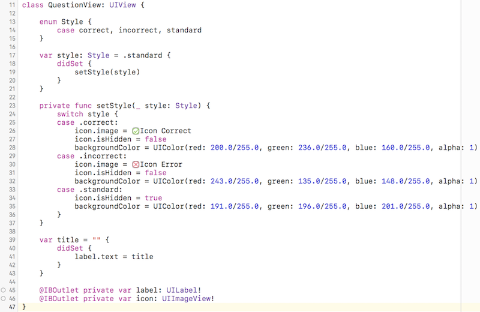

## Concevez votre interface

### Découvrez UIView
Notre modèle est désormais tout beau tout propre ! Mais notre application semble toujours vierge lorsqu'on la lance ! Rassurez-vous, dans cette partie, nous allons nous occuper de la vue !


Pour la remplir, il nous faut savoir quoi mettre de dedans. Et dedans, nous allons mettre exclusivement des `UIView` ! Vous ne savez pas que c'est ? Vous ne pourrez plus le dire à la fin de chapitre !

#### Qu'est-ce que UIView ?
`UIView`, c'est la classe qui permet de définir une **vue**.

> **:question:** Et une vue, c'est quoi ?

Une vue, c'est une **zone rectangulaire** qui a deux missions :
- **Afficher des choses**
- **Répondre à des gestes**

Donc comme vous pouvez le constater, c'est très générique ! Ça n'a pas l'air bien puissant comme ça. Mais sachez que **tout ce que vous voyez** à l'écran dans n'importe quel page de n'importe qu'elle application iOS **est une instance d'`UIView`**.

> **:question:** Mais les boutons, les images ce sont des UIView `aussi` ?

Eh oui ! Et ce, grâce à l'héritage. Prenons l'exemple d'un bouton. Les boutons en iOS sont définis avec une classe qui s'appelle `UIButton`. Cette classe comme toute celle que je vais vous présenter dans le prochain chapitre **hérite** de `UIView`. Donc elles disposent toutes de la logique présentent dans `UIView`, notamment le placement, l'affichage et la réponse aux gestes. Donc un indirectement, un bouton c'est une `UIView`.

#### La hiérarchie des vues
Comme les dossiers sur votre ordinateur, les vues ont une **hiérarchie** (on parle en anglais de *view hierarchy*). Cela veut dire qu'une vue, c'est comme un dossier. Elle peut contenir d'autres vues et elle peut-elle même être contenue dans une vue parente.

##### Exemple
Le meilleur moyen de bien comprendre ça, c'est d'essayer ! Ouvrez votre fichier `Main.storyboard`. Nous allons jouer un peu avec *interface builder*. Dans la bibliothèque des composants, choisissez l'objet `UIView` et glissez en quelques-uns dans votre interface.

> **:information_source:** Vous pouvez filtrer en tapant `UIView` dans le champ de texte en bas de la bibliothèque des composants.

De mon côté, j'ai composé mon interface comme ceci :


J'ai plusieurs vues qui sont les unes à côté des autres ou **les unes dans les autres**. Sur la gauche, vous pouvez voir la hiérarchie des vues. Je vous la montre ici également :


On a donc une vue principale qui a 4 sous vues :
- La vue verte n'a pas de sous-vue
- La vue rouge a 2 sous-vues blanches
- La vue bleu clair a une sous-vue blanche
- La vue bleu foncé a une sous-vue grise qui a elle-même une sous-vue blanche

En glissant les vues les unes dans les autres, vous créez votre hiérarchie. Pour des interfaces complexes qui peuvent compter une vingtaine de vues différentes, il est important de bien organiser votre hiérarchie pour vous y retrouver !

##### La vue principale
Vous avez noté dans l'exemple précédent que notre interface contenait déjà une vue : le grand rectangle blanc vertical.

En iOS, une page d'une application correspond (presque) toujours à un `UIViewController`. Cette classe (que nous verrons en détail dans la prochaine partie) a une propriété `var view: UIView` qui constitue la vue principale de votre interface. Cela veut dire que **toutes les vues que vous allez rajouter sont des descendantes de la vue principale de votre contrôleur**. Elles sont toutes contenues dedans. C'est la racine de votre hiérarchie de vues.

##### Et le code ?
La plupart du temps, vous créerez vos vues directement avec *Interface Builder*. Mais il peut arriver que vous souhaitiez manipuler la hiérarchie de vos vues dans le code. Pour cela, la classe `UIView` a deux propriétés et deux méthodes à connaitre :

```swift
// Propriétés
var superview: UIView
var subviews: [UIView]

// Méthodes
func addSubview(_ view: UIView)
func removeFromSuperview()
```

La propriété `superview` permet d'accéder à la vue parente. Et la propriété `subviews` permet d'accéder au tableau des sous-vues.

> **:warning:** L'ordre dans le tableau `subviews` a une importance. Les vues à la fin de tableau seront visuellement au-dessus des vues du début du tableau. (C'est l'équivalent du `z-index` si vous connaissez le CSS.)

Prenons un exemple pour les méthodes, mettons que j'ai une vue `myView` et un bouton `myButton`. Si je veux que le bouton soit inclus dans la vue, je fais ceci :
```swift
myView.addSubview(myButton)
```

Ensuite, si je souhaite retirer le bouton de la hiérarchie, j'écris :
```swift
myButton.removeFromSuperview()
```

Et le bouton ne sera plus visible à l'écran.

Pour votre information, je vous mentionne ici quelques autres méthodes qui pourront vous être utiles pour gérer la hiérarchie de vos vues :

```swift
func insertSubview(_ view: UIView, belowSubview siblingSubview: UIView)
func insertSubview(_ view: UIView, aboveSubview siblingSubview: UIView)
func bringSubview(toFront view: UIView)
func sendSubview(toBack view: UIView)
```
> **:warning:** Dans toute cette section sur la hiérarchie, ne faites pas la confusion avec l'héritage ! Ici, il s'agit juste de savoir **quelle vue est incluse dans quelle vue** et non qui hérite de qui.

#### En résumé
- Une `UIView` est une **zone rectangulaire** qui permet d'afficher des choses et de répondre à des gestes.
- Tous les composants d'une interface héritent de la classe `UIView`.
- Les vues dans une interface sont organisées selon une hiérarchie comme des dossiers. En particulier une vue peut avoir une vue parente et des sous-vues. Dans le code, on manipule la hiérarchie avec les propriétés et méthodes de UIView suivantes :
```swift
var superview: UIView
var subviews: [UIView]
func addSubview(_ view: UIView)
func removeFromSuperview()
```

### Placez vos vues

Maintenant que nous avons vu comment organiser nos vues, nous allons voir comment les placer. Et pour placer des éléments à l'écran, un peu comme lorsqu'on joue aux échecs ou à la bataille navale, il faut un **système de coordonnées**.

#### Position et taille
Une vue, c'est une zone rectangulaire. Donc pour décrire l'espace qu'elle occupe, il va falloir lui indiquer 2 choses :
- sa position
- sa taille

> **:information_source:** J'ai créé pour vous une application qui va vous permettre de jouer un peu avec le système de coordonnées. Je vous invite à [télécharger le code](https://github.com/AmbroiseCollon/UIView-Coordinate-System) et à lancer l'application sur votre simulateur ou iPhone.

###### La position
Une position sur un écran, ça nécessite deux valeurs :
- x : représente la position **horizontale**
- y : représenta la position **verticale**

L'origine se situe en haut à gauche. Donc cela veut dire que :
- x augmente quand on va **vers la droite**
- y augmente quand **on descend**


Il faut savoir que quand on parle de la position d'une vue, on parle de **la position de son point supérieur gauche**.


> **:information_source:** Sur l'application que vous avez téléchargée, vous pouvez déplacer le rectangle bleu et voir évoluer les valeurs `x` et `y`.

###### La taille
Pour décrire la taille d'une vue, comme c'est une zone rectangulaire, on a à nouveau deux valeurs :
- la **largeur** (en anglais *width*)
- la **hauteur** (en anglais *height*)


#### Frame et bounds
En tout, il faut donc 4 valeurs pour décrire précisément l'espace qu'occupe une vue :
- x
- y
- largeur
- hauteur

Ces quatre informations sont disponibles dans une propriété de `UIView` qui s'appelle `frame`. Cette propriété décrit donc **l'espace occupé par une vue par rapport à la vue parente**.

Donc les valeurs `x` et `y` indiquent **la position par rapport au coin supérieur gauche de la vue parente** et donc pas forcément par rapport au coin supérieur gauche de l'écran. C'est le cas dans l'application que vous avez téléchargée.

`UIView` a une seconde propriété : `bounds`. Cette propriété contient 4 informations aussi : x, y, largeur et hauteur. Mais elle décrit **l'espace occupé par la vue par rapport à elle-même**. Cela signifie que `x` et `y` vaudront toujours `0` pour cette propriété.

On utilise `frame` lorsqu'on s'intéresse au placement de **soi-même dans la vue parente**.
On utilise `bounds` lorsqu'on s'intéresse au placement de **ses sous-vues**.

Aussi, les propriétés `frame` et `bounds` n'ont pas forcément la même taille. Vous pouvez essayer de faire tourner le rectangle dans l'app téléchargée et vous verrez que lors de la rotation la taille décrite par `bounds` ne change pas. Mais `frame` doit grandir pour trouver le plus petit rectangle qui contient la vue.


> **:information_source:** En pratique, vos vues seront rarement en rotation. Mais cela doit vous rappeler de ne pas confondre `bounds` et `frame`, le premier regarde à l'intérieur, l'autre à l'extérieur.

#### Les structures de données
Les coordonnées en iOS s'appuient sur 4 types différents : `CGFloat`, `CGPoint`, `CGSize`, `CGRect`.

> **:information_source:** Le préfixe CG veut dire *Core Graphics*.

`CGFloat` est un type qui a été introduit pour gérer aussi bien les appareils 32 bits et 64 bits. En pratique, tout ce que vous avez besoin de savoir c'est qu'il décrit un **nombre décimal** et que c'est ce type et non `Float` ou `Double` que vous devez utiliser lorsque vous travaillez sur le placement d'une vue.

Vous pouvez convertir un `Double` ou un `Float` en `CGFloat` comme ceci :
```swift
var unDouble = 100.0
var unCGFloat = CGFloat(unDouble)
```

CGPoint est une structure qui a deux propriétés `x` et `y`. Elle décrit donc un point.
```swift
var unPoint = CGPoint(x: 10.0, y: 123.0)
```

`CGSize` est une structure qui a également deux propriétés `width` et `height`. Elle décrit une taille :
```swift
var uneTaille = CGSize(width: 30.0, height: 120.0)
```

Enfin `CGRect` est aussi une structure qui a aussi deux propriétés `origin` et `size`. Elle décrit un rectangle :
```swift
var unRectangle : CGRect(origin: unPoint, size; uneTaille)
```

> **:information_source:** CGRect a un autre initialiseur assez pratique qui prend directement en paramètre les 4 informations nécessaires pour décrire un rectangle :
```swift
var unRectangle = CGRect(x: 12.0, y: 34.0, width: 120.0, height: 200.0)
```

Les propriétés `frame` et `bounds` sont du type `CGRect`.

#### En résumé
- Les vues se placent grâce au système de coordonnées et des 4 informations suivantes `x`, `y`, `width` et `height`. Les x augmentent vers la droite et les y augmentent vers le bas.
- Les vues ont une propriété `frame` qui permet de les placer par rapport à la vue parente. Elles ont aussi une propriété `bounds` qui permet de placer les sous-vues.
- Le système de coordonnées est utilisé avec les types `CGFloat`, `CGPoint`, `CGSize` et `CGRect`.

### Organisez les composants de l’interface  
Vous possédez maintenant toutes les connaissances pour que l'on remplisse notre belle application ! C'est ce que nous allons faire dans ce chapitre !

#### Les composants principaux d'iOS
Apple fournit avec le framework *UIKit*, plusieurs composants qui sont prêts à l'emploi. Il y en a qui sont assez simples comme les boutons ou les images et d'autres qui sont plus évolués comme les sélecteurs de date.

> **:information_source:** Comme je suis sympa, je vous ai fait une petite application qui vous présente les principaux composants à votre disposition en iOS. Je vous invite fortement à la [télécharger](https://github.com/AmbroiseCollon/Discovering-UIKit-Components) et à jouer avec, c'est le meilleur moyen de les découvrir !

Vous apprendrez à utiliser la plupart d'entre eux par vous-même au fur et à mesure de votre besoin. Une fois qu'on en a utilisé un ou deux, c'est assez facile. Ici, je vais seulement vous les présenter pour que vous les connaissiez et ayez le réflexe d'aller les utiliser le jour où vous en aurez besoin.

En plus de l'application, je vous ai résumé la liste des composants dans ce tableau :


#### Ajoutez un bouton et un indicateur d'activité
Nous allons maintenant créer notre interface ! Nous allons découvrir et utiliser ensemble cinq des principaux composants d'iOS : `UIView`, `UILabel`, `UIButton`, `UIActivityIndicator` et `UIImageView`.

Je vous propose de démarrer par simplement changer la couleur de fond de votre interface avec le bleu foncé de notre palette. Je vous laisse faire ça sans moi.

##### Le bouton
Maintenant nous allons rajouter un bouton. Depuis la bibliothèque des composants, faites glisser un bouton au milieu en bas de l'interface.


En double-cliquant dessus vous pouvez changer le titre de ce bouton. Et vous allez écrire `New Game`. C'est avec ce bouton que nous allons lancer une nouvelle partie.

> **:information_source:** L'interface de l'application est anglais, car la base de données de questions est anglaise. Et ce serait bizarre d'avoir des questions en anglais au milieu d'une interface française. Je suis désolé mais je n'ai pas trouvé de base de données gratuite de questions en français...

Je vous l'invite à redimensionner le bouton pour qu'il ait une taille confortable.

> **:information_source:** Apple suggère une taille minimum de 44 * 44 points pour un bouton. Afin que l'on puisse le taper facilement.

Ensuite dans l'**inspecteur d'attribut** sur la droite, vous avez **toutes les propriétés de `UIButton`** que vous pouvez modifier avec *Interface Builder*. Si vous défilez vers le bas, vous avez également toutes les propriétés de `UIView`, car `UIButton` hérite, comme on l'a vu, de `UIView`. Dans ces propriétés, je vous propose de passer `Text Color` en blanc. Nous allons également modifier la police avec la propriété `font`. Pour cela, suivez les étapes effectuées dans l'image ci-dessous :


> **:information_source:** A retenir que lorsque vous souhaitez utiliser une police de votre choix, il faut donc choisir *custom*.

Maintenant nous allons changer la couleur de fond du bouton. Et pour cela, nous allons faire comme pour la couleur de fond de la vue principale, les deux sont des `UIView` et donc les deux ont une propriété *background* que vous trouverez en descendant dans l'inspecteur d'attribut. Cette fois-ci, je vous suggère de choisir le bleu clair. Votre bouton doit maintenant ressembler à ceci :


##### L'indicateur d'activité
L'indicateur d'activité (`UIActivityIndicator`) se présente sous la forme d'une roue qui tourne à l'infini. Cette roue permet d'indiquer à l'utilisateur qu'une action est en train de se dérouler. Dans notre cas, ce sera le chargement des questions pour une nouvelle partie. Vous pouvez retrouver ce composant dans le tableau au début de chapitre. Faites glisser un indicateur d'activité depuis la bibliothèque des composants vers l'interface. Vous allez le placer au centre du bouton.

Dans l'inspecteur d'attributs, vous trouvez en haut la propriété *style*. Cette propriété permet de choisir un style parmi plusieurs styles par défaut. Je vous suggère *Large White*. Dessous, une autre propriété nous intéresse : *Animating*. Cochez la case pour que notre roue soit animée.

> **:warning:** La roue ne s'animera pas sur le storyboard. Elle s'animera uniquement lorsque vous lancerez l'application.

Vos attributs de l'indicateur d'activité devraient ressembler à ceci :


#### Ajouter un label
Nous allons maintenant afficher le score de la partie en cours. Une partie c'est 10 questions, donc le score aura pour format : *X / 10*.

Pour afficher du texte, nous allons utiliser `UILabel`. Vous pouvez glisser un composant `UILabel` depuis la bibliothèque des composants vers le centre de l'interface. En double-cliquant dessus, vous pouvez modifier le texte et écrire pour le moment "*0 / 10*". Nous allons changer la couleur du texte en blanc grâce à la propriété `color`. Vous pouvez également centrer le contenu de votre texte avec la propriété `alignment`.

Comme pour le bouton, nous allons changer la police avec la propriété *font*. Cette fois-ci, je vous invite à choisir à nouveau *Balham* et 30 pour la taille.

Le label est alors trop petit pour contenir le texte. Nous allons changer sa taille. Pour cela nous allons utiliser l'**inspecteur de taille** sur la droite. Vous l'ouvrez en cliquant en haut à droite sur l'icône en forme de règle.


Dedans, vous retrouvez les quatre propriétés nécessaires au placement d'une vue que nous avons vues dans le chapitre précédent `x`, `y`, `width` et `height`. Vous pouvez choisir :
- x : 37,5
- y : 273
- width : 300
- height : 60

Notre interface commence à ressembler à quelque chose ! :D


#### Ajouter la question
La question va être une vue un peu compliquée, car comme vous pouvez le voir ci-dessous, elle doit contenir un label et une image (l'icône verte ou rouge en bas):


Notre stratégie va être donc de créer d'abord une `UIView` simple **à l'intérieur de laquelle** nous allons rajouter un label et une image.

Commençons par rajouter une `UIView` (vous pouvez en retrouver l'icône dans le tableau plus haut). Elle va être carrée de longueur `245` et avec pour couleur de fond gris. Vous allez le placer au milieu, au-dessus du score. Je vous laisse le faire.


Ensuite vous allez glisser à l'intérieur un label. En vous aidant des guides bleus, vous allez l'agrandir pour qu'il prenne toute la place dans la vue grise en laissant pour chaque bord 8 points de marge. Ensuite, vous allez à nouveau changer ses propriétés et cette fois-ci je vous laisse faire :
- *police* : Balham, taille 23
- *couleur* : blanc
- *alignement* : centré

Vous allez également modifier la propriété `lines`. Cette propriété indique **le nombre maximum de lignes** que peut avoir le label. Ce label va contenir les questions et comme cela va changer souvent, on ne connait pas à l'avance le nombre de lignes nécessaires. L'astuce est de choisir `0`. Avec cette valeur, le label décidera automatiquement du nombre de lignes en fonction de la taille du texte. Votre label doit maintenant ressembler à ceci :


Il ne nous reste plus qu'à rajouter l'icône. Pour cela, vous avez deux options :
- soit vous glissez un **composant `UIImageView`** depuis la bibliothèque des **composants** vers l'interface
- soit vous glissez une **image** depuis la bibliothèque des **médias** vers l'interface

Les deux donnent un résultat équivalent : cela rajoute une `UIImageView` sur l'interface. L'avantage de la 2e option, c'est que la `UIImageView` contient déjà l'image de son choix et à la bonne taille.

> **:information_source:** Pour que les images apparaissent dans la bibliothèque des médias, il faut que vous les ayez préalablement rajoutées dans les *assets* de l'application. C'est ce que nous avons fait dans la première partie de ce cours.

Nous allons donc choisir la deuxième option ! Allez dans la bibliothèque des médias en cliquant sur l'icône en forme de pellicule de film :


Et nous allons glisser l'icône verte dans notre vue grise en bas au centre.

Si vous allez maintenant dans l'inspecteur d'attribut, vous verrez que `UIImageView` a une propriété `image` qui prend comme valeur le nom de notre image, en l'occurrence *Icon Correct*. Vous pouvez changer le nom en *Icon Error*. Et vous verrez que la `UIImageView` affiche désormais l'icône rouge. Ce qu'il faut que vous compreniez ici, c'est que `UIImageView` ce **n'est pas une image** directement, c'est une **vue qui affiche une image** et cette image peut changer à tout moment ! C'est d'ailleurs ce que nous allons faire dans la dernière partie de ce chapitre : l'image va changer selon si l'utilisateur glisse la question à gauche ou à droite.

Nous avons maintenant tous les éléments nécessaires dans notre interface ! Elle est prête ! Bravo !


#### En résumé
- Il existe tout un tas de composants en iOS que vous pouvez glisser très facilement dans votre interface. Identifiez-les pour avoir le réflexe de les utiliser le jour où vous en aurez besoin.
- Pour modifier les paramètres d'une vue, vous pouvez utiliser l'**inspecteur d'attributs**. Les propriétés modifiables diffèrent selon le type de la vue sélectionnée.
- Pour modifier la position ou la taille d'une vue, vous pouvez :
	- La déplacer à la souris et utiliser les poignées aux angles de la vue
	- Aller dans l'**inspecteur de taille** pour modifier les paramètres `x`, `y`, `width` et `height` directement.
- Pour ajouter une image, le plus simple est d'aller la chercher directement dans la **bibliothèque des médias**.

### Sous-classez UIView
Nous avons maintenant une belle interface ! Et avant de passer à la suite, nous allons la rendre pratique à utiliser ! Dans ce chapitre, nous allons apprendre à créer notre propre vue customisée.

#### Pourquoi faire une vue customisée ?
Si on regarde notre vue question, elle est assez compliquée. Non seulement c'est une vue qui en contient deux autres : le label et l'icône. Mais en plus, si on se fie à l'image ci-dessous, cette vue va s'afficher de trois façons différentes :
- L'utilisateur répond **faux** à la question : le fond devient rouge et la croix rouge apparait
- L'utilisateur répond **vrai** à la question : le fond devient vert et le symbole validé apparaît
- L'utilisateur **n'a pas encore répondu** à la question : le fond est gris et le symbole est caché


Donc pour que cette vue soit plus simple à gérer pour notre contrôleur tout à l'heure, nous allons créer une vue customisée. Et pour créer une vue customisée avec iOS, on crée une sous-classe de `UIView`. Vous risquez d'avoir souvent besoin de faire cela donc c'est le bon moment pour le découvrir ! Vous êtes partant ?


Parfait ! Bravo pour votre enthousiasme !

#### Créons la sous-classe

Nous allons créer une classe `QuestionView` qui va hériter de `UIView`. Pour cela, il faut créer un nouveau fichier.

> **:information_source:** Vous connaissez maintenant l'opération : allez dans File > New > File... ou utilisez le raccourci <kbd>cmd + n</kbd>.

Mais cette fois-ci, vous allez choisir la première option *Cocoa Touch Class* :


Cliquez sur *Next*. Cette option nous permet de créer un fichier qui est directement une sous-classe de la classe que l'on souhaite. Cela permet de gagner un peu de temps. Dans le champ *Subclass of*, vous allez donc choisir `UIView`. Et au-dessus, vous allez nommer votre classe `QuestionView`.


Cliquez sur *Next* et sauvegardez votre fichier en choisissant le groupe `View` puisque nous travaillons toujours dans la partie vue du MVC. Vous avez maintenant un fichier `QuestionView.swift` qui contient le code suivant :

```swift
class QuestionView: UIView {

    /*
    // Only override draw() if you perform custom drawing.
    // An empty implementation adversely affects performance during animation.
    override func draw(_ rect: CGRect) {
        // Drawing code
    }
    */

}
```

Il s'agit bien de la déclaration d'une classe `QuestionView` qui hérite de `UIView`.

> **:information_source:** Dans la classe, vous avez un commentaire qui vous suggère de faire l'override d'une méthode `draw`. Pour votre information, cette méthode permet de dessiner des vues de toutes formes mais nous n'en avons pas besoin pour le moment. Vous pouvez supprimer tout le contenu de la classe.

#### Connecter la classe

Maintenant que notre classe est créée, nous allons la connecter avec notre vue dans le storyboard. Nous allons faire ça en deux étapes :
1. Nous allons changer la classe de notre vue dans le storyboard
2. Nous allons connecter le label et l'icône à notre classe

##### Changer la classe de notre vue
Retournons dans le storyboard. Notre vue grise qui contient les questions est à l'origine une `UIView` que nous avons glissée depuis la bibliothèque des composants. Il est temps d'en faire une `QuestionView` !

Pour cela, il faut aller dans l'inspecteur d'identité. C'est un des onglets que nous n'avons pas encore vus dans le panneau des utilitaires à droite.


Dans cet onglet, on peut vérifier après avoir sélectionné la vue que la classe actuelle de notre vue est bien `UIView`. Pour modifier cela, il suffit d'écrire notre nouvelle classe dans le premier champ de texte comme ceci :


Et voilà notre vue a maintenant pour classe `QuestionView` ! Cela va nous permettre de connecter le label et l'icône à notre classe.

##### Connecter le label et l'icône
Notre classe contient deux vues : le label et l'icône. Nous allons en faire des propriétés de notre classe `QuestionView`. Vous savez déjà créer des propriétés :

```swift
var label: UILabel?
var icon: UIImageView?
```

On utilise ici les optionnels, car on ne sait pas la valeur de ces deux propriétés.

Notre objectif avec cette classe est de simplifier l'utilisation de la vue. Dans le cadre de cette simplification, les personnes qui utilisent cette classe n'ont pas besoin de savoir son contenu. Donc nous allons marquer ces propriétés privées.

```swift
private var label: UILabel?
private var icon: UIImageView?
```

Maintenant, faisons la connexion ! **Une connexion entre une propriété et une vue avec Xcode s'appelle un Outlet**.

> **:information_source:** Nous allons créer d'autres *outlets* dans la partie suivante et [ce cours](https://openclassrooms.com/courses/introduction-a-ios-plongez-dans-le-developpement-mobile/connectez-le-code-et-le-storyboard) détaille ce qu'est un *outlet* donc je ne vais pas aller plus loin.

Donc pour faire la connexion, nous allons rajouter ce qu'on appelle un décorateur :

```swift
@IBOutlet private var label: UILabel?
@IBOutlet private var icon: UIImageView?
```

Le mot-clé `@IBOutlet` notifie Xcode que ces propriétés sont susceptibles d'être connectées à une vue dans Interface Builder. En reconnaissant ce mot-clé, Xcode rajoute un petit rond à côté de nos propriétés :


C'est ce petit rond qui va nous permettre de faire la connexion.

Pour cela, nous allons retourner dans le storyboard. Et nous allons nous placer en mode assistant. En mode assistant, pour choisir le fichier à afficher sur la droite, vous pouvez naviguer comme ceci :


Choisissez le fichier `QuestionView.swift`. Et nous allons maintenant faire la connexion entre la propriété et la vue correspondante. Pour cela, nous allons glisser depuis le petit rond vers la vue comme ceci :


Et voilà ! Notre classe est maintenant complètement connectée au storyboard. Il ne nous reste qu'une toute petite amélioration.

##### Le type optionnel déballé

Comme nos propriétés sont connectées à des vues qui existent dans le storyboard, on est certain que ces propriétés n'auront pas pour valeur `nil`. Donc au lieu de leur donner un type optionnel, on va leur donner un type **optionnel déballé** :

```swift
@IBOutlet private var label: UILabel!
@IBOutlet private var icon: UIImageView!
```

En remplaçant, le point d'interrogation par un point d'exclamation, on indique qu'on ne connait pas la valeur de nos optionnels, mais qu'on est certain qu'elle ne vaut pas `nil`. À chaque fois que la propriété va être utilisée, l'optionnel va être implicitement déballé.

> **:warning:** Lorsque vous utilisez le type optionnel déballé, il faut être sûr que la propriété ait une valeur ! Sinon lorsque vous allez l'utiliser, le programme va planter.

Le type optionnel déballé nous permet donc de ne pas donner de valeur à notre propriété tout en n'ayant pas à la déballer à chaque fois que l'on souhaite l'utiliser.

#### En Résumé
- Pour faire une vue customisée, on crée une sous-classe de `UIView`.
- Pour créer une sous-classe de `UIView`, on choisit *Cocoa Touch Class* dans le menu *Nouveau fichier* d'Xcode.
- Une connexion entre une propriété et une vue dans le storyboard s'appelle un `Outlet`. Pour pouvoir créer un `Outlet` dans une vue customisée, il faut :
	- Avoir connecté la classe et la vue via l'inspecteur d'identité dans les utilitaires
	- Créer les propriétés correspondantes aux vues
	- Ajouter le décorateur `@IBOutlet`.
	- Glisser le petit rond vers la vue.
- Le type optionnel déballé permet de déclarer une propriété dont on ne connaît pas la valeur mais dont on est certain qu'elle existe. Cela évite de devoir déballer l'optionnel à chaque fois qu'on souhaite l'utiliser.

### Implémentez la classe QuestionView
Notre classe est désormais créée et connectée. Nous allons pouvoir l'implémenter. Cette classe va avoir seulement deux propriétés publiques. Tout le reste va être privé. Ces deux propriétés sont :
- `style` : qui va avoir trois valeurs possibles : réponse correcte, réponse fausse et pas de réponse.
- `title` : cette propriété représente le titre de la question affichée.

#### La propriété title
Créons la propriété `title` de type `String`.

```swift
var title = ""
```

Rien de bien sorcier pour le moment. Dès que cette propriété est modifiée, on va vouloir modifier le texte de notre label pour qu'il affiche la valeur de `title`. Comment fait-on lorsqu'on veut effectuer une action quand une propriété est modifiée ?

> **:question:** On utilise l'observation des propriétés ?

Bravo ! Je vois que vous avez suivi [le cours sur le sujet](https://openclassrooms.com/courses/approfondissez-swift-avec-la-programmation-orientee-objet/enrichissez-vos-proprietes) ! On va donc observer notre propriété `title` :

```swift
var title = "" {
	didSet {
		// On modifie le titre ici
	}
}
```

Cette syntaxe devrait vous être familière. Lorsque la propriété sera modifiée, le contenu de la méthode `didSet` sera exécuté. Nous souhaitons modifier le texte du label. Pour cela, nous allons tout simplement utiliser la propriété `text` de `UILabel`.

```swift
var title = "" {
	didSet {
		label.text = title
	}
}
```

De cette façon, dès que `title` est modifié le texte du label le sera aussi.

#### La propriété style
La propriété `style` va définir l'apparence générale de la vue. Il y a trois possibilités : réponse correcte, réponse incorrecte et pas de réponse. Qui dit plusieurs choix dit ?

> **:question:** Énumération ?

Bravo ! Vous êtes en forme aujourd'hui ;) ! Nous allons donc créer une énumération `Style` à l'intérieur de notre classe `QuestionView`.

```swift
class QuestionView: UIView {
	enum Style {
		case correct, incorrect, standard
	}
	// (...)
}
```

À chaque cas de l'énumération, nous allons faire correspondre les apparences suivantes :


Nous allons maintenant créer la propriété `style` de type `Style` :

```swift
var style: Style = .standard
```

Et de la même façon, nous allons utiliser l'observation des propriétés pour modifier l'apparence. Mais cette fois-ci, le code à exécuter est plus gros qu'une simple ligne donc nous allons l'extraire dans une fonction privée à part :

```swift
var style: Style = .standard {
	didSet {
		setStyle(style)
	}
}

private func setStyle(_ style: Style) {
}
```

À chaque fois que la propriété `style` est modifiée, la fonction `setStyle` est appelée avec en paramètre le style à afficher.

#### La fonction setStyle

Écrivons le code de cette fonction. Tout d'abord nous allons faire un switch sur les différents cas :

```swift
private func setStyle(_ style: Style) {
	switch style {
		case .correct:
		case .incorrect:
		case .standard:
	}
}
```

Dans chacun des cas, il y a trois paramètres susceptibles de changer :
- la couleur de fond de la vue (vert, rouge ou gris)
- l'image de l'icône (validé ou erreur)
- la visibilité ou non de l'icône (dans le style standard, l'icône n'est pas visible)

##### La couleur de fond
Pour changer la couleur de fond, on utilise la propriété `backgroundColor` de `UIView`. Comme `QuestionView` hérite de `UIView` nous avons accès directement à cette propriété.

`backgroundColor` est de type `UIColor`. `UIColor` est la classe qui permet de gérer les couleurs. Elle a plusieurs initialiseurs. Parmi les plus pratiques, vous avez :

```swift
UIColor(white: CGFloat, alpha: CGFloat)
UIColor(red: CGFloat, green: CGFloat, blue: CGFloat, alpha: CGFloat)
```
Le premier permet de créer une nuance de gris :
- Le paramètre `white` est une valeur comprise entre 0 et 1. Plus la valeur est grande, plus la couleur est claire.
- Le paramètre `alpha` permet de gérer la transparence de la couleur entre 0 et 1.
	- 0 : la couleur est complètement transparente
	- 1 : la couleur est complètement opaque

Le deuxième permet de créer toutes les couleurs à partir des couleurs primaires rouge, vert et bleu. Les trois paramètres `red`, `green` et `blue` doivent avoir des valeurs comprises entre 0 et 1. Le paramètre `alpha` a le même rôle que précédemment.

En informatique, la notation RVB des couleurs se fait sur **255 tons**. Par exemple, nos trois couleurs ont pour valeur RVB :


Donc pour obtenir des valeurs entre 1 et 0, on divise par 255 :

```swift
UIColor(red: 243.0/255.0, green: 135.0/255.0, blue: 148.0/255.0, alpha: 1) // Le rouge
```
Vous savez maintenant manier `UIColor` ! On va pouvoir modifier la couleur de fond de notre vue :

```swift
private func setStyle(_ style: Style) {
	switch style {
	case .correct:
		backgroundColor = UIColor(red: 200.0/255.0, green: 236.0/255.0, blue: 160.0/255.0, alpha: 1) // Vert
	case .incorrect:
		backgroundColor = UIColor(red: 243.0/255.0, green: 135.0/255.0, blue: 148.0/255.0, alpha: 1) // Rouge
	case .standard:
		backgroundColor = UIColor(red: 191.0/255.0, green: 196.0/255.0, blue: 201.0/255.0, alpha: 1) // Gris
	}
}
```

##### L'image
Nous allons maintenant modifier notre image. La classe `UIImageView` a une propriété `image` de type `UIImage`. C'est cette propriété qui permet de modifier l'image qu'affiche une `UIImageView`.

La classe `UIImage` a un initialiseur qui prend en paramètre le nom de l'image :

```swift
UIImage(named: String)
```

Le nom a indiqué est le nom que l'on a choisi pour l'image dans l'*asset catalog* :


Donc par exemple pour que notre icône affiche le signe validé vert, nous allons écrire :

```swift
icon.image = UIImage(named: "Icon Correct")
```

On crée ainsi une instance de `UIImage` à partir du nom du fichier et on assigne cette valeur à la propriété `image` de notre `UIImageView`.

Xcode propose une autre façon bien pratique de créer une instance de `UIImage`. Si on commence à taper le nom de l'image recherchée, Xcode nous la suggère directement :


> **:warning:** Pour qu'Xcode suggère l'image, il faut bien sûr l'avoir rajouté au préalable dans l'*assets catalog*.

Cette façon de faire est bien pratique, car elle affiche une vignette de l'image en question ce qui est plus clair. Les deux lignes suivantes sont donc équivalentes :


Nous allons donc faire cela pour les deux cas `correct` et `incorrect`. Et notre code ressemble maintenant à ceci :


##### La visibilité de l'image
Il ne nous reste plus qu'à cacher l'image dans le cas `standard` (quand la vue est grise). Pour cela, nous allons utiliser la propriété `isHidden` de type `Bool` de `UIView`. Quand la propriété est à `true`, la vue est cachée et donc n'apparaît pas à l'écran et inversement. Comme `UIImageView` hérite de `UIView`, nous avons accès à cette propriété pour l'icône. Nous allons donc pouvoir l'utiliser et notre code ressemble finalement à ceci :


Dans les deux premiers cas, l'image est affichée. Dans le dernier, elle est cachée.

C'est tout pour notre classe ! D'une vue assez complexe, nous en avons fait une vue très simple à utiliser dans notre contrôleur tout à l'heure. Nous allons pouvoir choisir entre les trois styles que nous venons de définir sans avoir à rentrer dans le détail de la construction de cette vue.

À la fin de ce chapitre, votre classe doit ressembler à ceci :



#### En Résumé
- Pour changer le texte qu'affiche un `UILabel`, on utilise la propriété `text` de type `String`.
- Pour changer la couleur de fond d'une vue, on utilise la propriété `backgroundColor` de `UIView` de type `UIColor`. Pour initialiser `UIColor`, on utilise le plus souvent cette méthode :  
```swift
UIColor(red: 200.0/255.0, green: 236.0/255.0, blue: 160.0/255.0, alpha: 1)
```
- Pour changer l'image qu'affiche une `UIView`, on utilise la propriété `image` de type `UIImage`. Pour initialiser `UIImage`, on utilise le nom du fichier image :  
```swift
UIImage(named: "Icon Correct")
```
- Pour cacher une vue, on utilise la propriété `isHidden` de `UIView` de type `Bool`.
