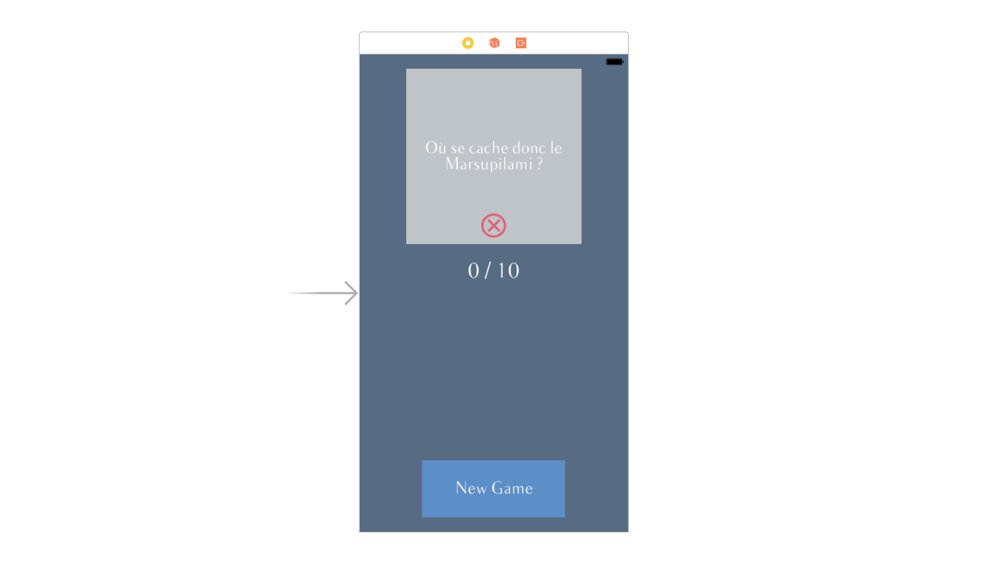

## Concevez une interface responsive  

### Découvrez UIView
Notre modèle est désormais tout beau tout propre ! Mais notre application semble toujours vierge lorsqu'on la lance ! Rassurez vous, dans cette partie, nous allons nous occuper de la vue !


Pour la remplir, il nous faut savoir quoi mettre de dedans. Et dedans, nous allons mettre exclusivement des `UIView` ! Vous ne savez pas que c'est ? Vous ne pourrez plus le dire à la fin de chapitre !

#### Qu'est-ce que UIView ?
`UIView`, c'est la classe qui permet de définir une **vue**.

> **:question:** Et une vue, c'est quoi ?

Une vue, c'est une **zone rectangulaire** qui a deux mission :
- **Afficher des choses**
- **Répondre à des gestes**

Donc comme vous pouvez le constater, c'est très générique ! Ça n'a pas l'air bien puissant comme ça. Mais sachez que **tout ce que vous voyez** à l'écran dans n'importe quel page de n'importe qu'elle application iOS **est une instance d'`UIView`**.

> **:question:** Mais les boutons, les images ce sont des UIView `aussi` ?

Et oui ! Et ce, grâce à l'héritage. Prenons l'exemple d'un bouton. Les boutons en iOS sont définis avec une classe qui s'appelle `UIButton`. Cette classe comme toute celle que je vais vous présenter dans le prochain chapitre **hérite** de `UIView`. Donc elles disposent toutes de la logique présentent dans `UIView`, notamment le placement, l'affichage et la réponse aux gestes. Donc un indirectement, un bouton c'est une `UIView`.

#### La hiérarchie des vues
Comme les dossiers sur votre ordinateur, les vues ont une **hiérarchie** (on parle en anglais de *view hierarchy*). Cela veut dire qu'une vue, c'est comme un dossier. Elle peut contenir d'autres vues et elle peut-elle même être contenue dans une vue parente.

##### Exemple
Le meilleur moyen de bien comprendre ça, c'est d'essayer ! Ouvrez votre fichier `Main.storyboard`. Nous allons jouer un peu avec *interface builder*. Dans la bibliothèque des composants, choisissez l'objet `UIView` et glissez en quelques-uns dans votre interface.

> **:information_source:** Vous pouvez filtrer en tapant `UIView` dans le champ de texte en bas de la bibliothèque des composants.

De mon côté, j'ai composé mon interface comme ceci :


J'ai plusieurs vues qui sont les unes à côté des autres ou **les unes dans les autres**. Sur la gauche, vous pouvez voir la hiérarchie des vues. Je vous la montre ici également :


On a donc une vue principale qui a 4 sous vues :
- La vue verte n'a pas de sous-vue
- La vue rouge a 2 sous-vues blanche
- La vue bleu claire a une sous-vue blanche
- La vue bleu foncée a une sous-vue grise qui a elle-même une sous-vue blanche

En glissant les vues les unes dans les autres, vous créez votre hiérarchie. Pour des interfaces complexes qui peuvent compter une vingtaine de vues différentes, il est important de bien organiser votre hiérarchie pour vous y retrouvez !

##### La vue principale
Vous avez noté dans l'exemple précédent que notre interface contenait déjà une vue : la grand rectangle blanc vertical.

En iOS, une page d'une application corresponds (presque) toujours à un `UIViewController`. Cette classe (que nous verrons en détail dans la prochaine partie) a une propriété `var view: UIView` qui constitue la vue principale de votre interface. Cela veut dire que **toutes les vues que vous allez rajouter sont des descendantes de la vue principale de votre contrôleur**. Elles sont toutes contenues dedans. C'est la racine de votre hiérarchie de vues.

##### Et le code ?
La plupart du temps, vous créerez vos vues directement avec *Interface Builder*. Mais il peut arriver que vous souhaitiez manipuler la hiérarchie de vos vues dans le code. Pour cela, la classe `UIView` a deux propriétés et deux méthodes à connaitre :

```swift
// Propriétés
var superview: UIView
var subviews: [UIView]

// Méthodes
func addSubview(_ view: UIView)
func removeFromSuperview()
```

La propriété `superview` permet d'accéder à la vue parente. Et la propriété `subviews` permet d'accéder au tableau des sous-vues.

> **:warning:** L'ordre dans le tableau `subviews` a une importance. Les vues à la fin de tableau seront visuellement au-dessus des vues du début du tableau. (C'est l'équivalent du `z-index` si vous connaissez le CSS.)

Prenons un exemple pour les méthodes, mettons que j'ai une vue `myView` et un bouton `myButton`. Si je veux que le bouton soit inclu dans la vue, je fais ceci :
```swift
myView.addSubview(myButton)
```

Ensuite, si je souhaite retirer le bouton de la hiérarchie, j'écris :
```swift
myButton.removeFromSuperview()
```

Et le bouton ne sera plus visible à l'écran.

> **:warning:** Dans toute cette section sur la hiérarchie, ne faîtes pas la confusion avec l'héritage ! Ici, il s'agit juste de savoir **quelle vue est inclus dans quelle vue** et non qui hérite de qui.

#### En résumé
- Une `UIView` est une **zone rectangulaire** qui permet d'afficher des choses et de répondre à des gestes.
- Tous les composants d'une interface héritent de la classe `UIView`.
- Les vues dans une interface sont organisés selon une hiérarchie comme des dossiers. En particulier une vue peut avoir une vue parente et des sous-vues. Dans le code, on manipule la hiérarchie avec les propriétés et méthodes de UIView suivantes :
```swift
var superview: UIView
var subviews: [UIView]
func addSubvie(_ view: UIView)
func removeFromSuperview()
```

### Placez vos vues

Maintenant que nous avons vu comment organiser nos vues, nous allons voir comment les placer. Et pour placer des éléments à l'écran, un peu comme lorsqu'on joue aux échecs ou à la bataille navale, il faut un **système de coordonnées**.

#### Position et taille
Une vue, c'est une zone rectangulaire. Donc pour décrire l'espace qu'elle occupe, il va falloir lui indiquer 2 choses :
- sa position
- sa taille

> **:information_source:** J'ai créé pour vous une application qui va vous permettre de jouer un peu avec le système de coordonnée. Je vous invite à [télécharger le code](https://github.com/AmbroiseCollon/UIView-Coordinate-System) et à lancer l'application sur votre simulateur ou iPhone.

###### La position
Une position sur un écran, ça nécessite deux valeurs :
- x : représente la position **horizontale**
- y : représenta la position **verticale**

L'origine se situe en haut à gauche. Donc cela veut dire que :
- x augmente quand on va **vers la droite**
- y augmente quand **on descends**


Il faut savoir que quand on parle de la position d'une vue, on parle de **la position de son point supérieur gauche**.


> **:information_source:** Sur l'application que vous avez téléchargée, vous pouvez déplacer le rectangle bleu et voir évoluer les valeurs `x` et `y`.

###### La taille
Pour décrire la taille d'une vue, comme c'est une zone rectangulaire, on a à nouveau deux valeurs :
- la **largeur** (en anglais *width*)
- la **hauteur** (en anglais *height*)


#### Frame et bounds
En tout, il faut donc 4 valeurs pour décrire précisément l'espace qu'occupe une vue :
- x
- y
- largeur
- hauteur

Ces quatres informations sont disponibles dans une propriété de `UIView` qui s'appelle `frame`. Cette propriété décrit donc **l'espace occupé par une vue par rapport à la vue parente**.

Donc les valeurs `x` et `y` indiquent **la position par rapport au coin supérieur gauche de la vue parente** et donc pas forcément par rapport au coin supérieur gauche de l'écran. C'est le cas dans l'application que vous avez téléchargée.

`UIView` a une seconde propriété : `bounds`. Cette propriété contient 4 informations aussi : x, y, largeur et hauteur. Mais elle décrit **l'espace occupé par la vue par rapport à elle-même**. Cela signifie que `x` et `y` vaudront toujours `0` pour cette propriété.

On utilise `frame` lorsqu'on s'intéresse au placement de **soi-même dans la vue parente**.
On utilise `bounds` lorsqu'on s'intéresse au placement de **ses sous-vues**.

Aussi, les propriétés `frame` et `bounds` n'ont pas forcément la même taille. Vous pouvez essayer de faire tourner le rectangle dans l'app téléchargée et vous verrez que lors de la rotation la taille décrite par `bounds` ne change pas. Mais `frame` doit grandir pour trouver le plus petit rectangle qui contient la vue.


> **:information_source:** En pratique, vos vues seront rarement en rotation. Mais cela doit vous rappeler de ne pas confondre `bounds` et `frame`, le premier regarde à l'intérieur, l'autre à l'extérieur.

#### Les structures de données
Les coordonnées en iOS s'appuient sur 4 types différents : `CGFloat`, `CGPoint`, `CGSize`, `CGRect`.

> **:information_source:** Le préfixe CG veut dire *Core Graphics*.

`CGFloat` est un type qui a été introduit pour gérer aussi bien les appareils 32 bits et 64 bits. En pratique, tout ce que vous avez besoin de savoir c'est qu'il décrit un **nombre décimal** et que c'est ce type et non `Float` ou `Double` que vous devez utiliser lorsque vous travailler sur le placement d'une vue.

Vous pouvez convertir un `Double` ou un `Float` en `CGFloat` comme ceci :
```swift
var unDouble = 100.0
var unCGFloat = CGFloat(unDouble)
```

CGPoint est une structure qui a deux propriété `x` et `y`. Elle décrit donc un point.
```swift
var unPoint = CGPoint(x: 10.0, y: 123.0)
```

`CGSize` est une structure qui a également deux propriétés `width` et `height`. Elle décrit une taille :
```swift
var uneTaille = CGSize(width: 30.0, height: 120.0)
```

Enfin `CGRect` est aussi une structure qui a aussi deux propriétés `origin` et `size`. Elle décrit un rectangle :
```swift
var unRectangle : CGRect(origin: unPoint, size; uneTaille)
```

> **:information_source:** CGRect a un autre initialiseur assez pratique qui prends directement en paramètre les 4 informations nécessaires pour décrire un rectangle :
```swift
var unRectangle = CGRect(x: 12.0, y: 34.0, width: 120.0, height: 200.0)
```

Les propriétés `frame` et `bounds` sont du type `CGRect`.

#### En résumé
- Les vues se placent grâce au système de coordonnées et des 4 informations suivantes `x`, `y`, `width` et `height`. Les x augmentent vers la droite et les y augmente vers la bas.
- Les vues ont une propriété `frame` qui permet de les placer par rapport à la vue parente. Elles ont aussi une propriété `bounds` qui permet de placer les sous-vues.
- Le système de coordonnées est utilisé avec les types `CGFloat`, `CGPoint`, `CGSize` et `CGRect`.

### Organisez les composants de l’interface  
Vous posséder maintenant toutes les connaissances pour que l'on remplisse notre belle application ! C'est ce que nous allons faire dans ce chapitre !

#### Les composants principaux d'iOS
Apple fourni avec le framework *UIKit*, plusieurs composants qui sont prêts à l'emploi. Il y en a qui sont assez simples comme les boutons ou les images et d'autres qui sont plus évolués commes les sélecteurs de date.

> **:information_source:** Comme je suis sympa, je vous ai fait une petite application qui vous présente les principaux composants à votre disposition en iOS. Je vous invite fortement à la [télécharger](https://github.com/AmbroiseCollon/Discovering-UIKit-Components) et à jouer avec, c'est le meilleur moyen de les découvrir !

Vous apprendrez à utiliser la plupart d'entre eux par vous-même au fur et à mesure de votre besoin. Une fois qu'on en a utilisé un ou deux, c'est assez facile. Ici, je vais seulement vous les présenter pour que vous les connaissiez et ayez le réflexe d'aller les utiliser le jour où vous en aurez besoin.

En plus de l'application, je vous ai résumé la liste des composants dans ce tableau :


#### Ajoutez un bouton et un label
Nous allons maintenant créer notre interface ! Nous allons découvrir et utiliser ensemble quatre des principaux composants d'iOS : `UIView`, `UILabel`, `UIButton` et `UIImageView`.
Je vous propose de démarrer par simplement changer la couleur de fond de votre interface avec le bleu foncé de notre palette. Je vous laisse faire ça sans moi.

##### Le bouton
Maintenant nous allons rajouter un bouton. Depuis la bibliothèque des composants, faîtes glisser un bouton au milieu en bas de l'interface.


En double-cliquant dessus vous pouvez changer le titre de ce bouton. Et vous allez écrire `New Game`. C'est avec ce bouton que nous allons lancer une nouvelle partie.

> **:information_source:** L'interface de l'application est anglais car la base de données de questions est anglaise. Et ce serait bizarre d'avoir des questions en anglais au milieu d'une interface française. Je suis désolé mais je n'ai pas trouvé de base de données gratuites de questions en français...

Je vous l'invite à redimensionner le bouton pour qu'il ait une taille confortable.

> **:information_source:** Apple suggère une taille minum de 40 * 40 points pour un bouton. Afin que l'on puisse le taper facilement.

Ensuite dans l'**inspecteur d'attribut** sur la droite, vous avez **toutes les propriétés de `UIButton`** que vous pouvez modifier avec *Interface Builder*. Si vous défilez vers le bas, vous avez également toutes les propriétés de `UIView` car `UIButton` hérite, comme on l'a vu, de `UIView`. Dans ces propriétés, je vous propose de passer `Text Color` en blanc. Nous allons également modifier la police avec la propriété `font`. Pour cela suivez les étapes effectuées dans l'image ci-dessous :


> **:information_source:** A retenir que lorsque vous souhaitez utiliser une police de votre choix, il faut donc choisir *custom*.

Maintenant nous allons changer la couleur de fond du bouton. Et pour cela, nous allons faire comme pour la couleur de fond de la vue principale, les deux sont des `UIView` et donc les deux ont une propriété *background* que vous trouverez en descendant dans l'inspecteur d'attribut. Cette fois ci, je vous suggère de choisir le bleu clair. Votre bouton doit maintenant ressembler à ceci :


#### Le score
Nous allons maintenant afficher le score de la partie en cours. Une partie c'est 10 questions, donc le score aura pour format : *X / 10*.

Pour afficher du texte, nous allons utiliser `UILabel`. Vous pouvez glisser un composant `UILabel` depuis la bibliothèque des composants vers le centre de l'interface. En double-cliquant dessus, vous pouvez modifier le texte et écrire pour le moment "*0 / 10*". Nous allons changer la couleur du texte en blanc grâce à la propriété `color`. Vous pouvez également centrer le contenu de votre texte avec la propriété `alignment`.

Comme pour le bouton, nous allons changer la police avec la propriété *font*. Cette fois-ci, je vous invite à choisir à nouveau *Balham* et 30 pour la taille.

Le label est alors trop petit pour contenir le texte. Nous allons changer sa taille. Pour cela nous allons utiliser l'**inspecteur de taille** sur la droite. Vous l'ouvrez en cliquant en haut à droite sur l'icône en forme de règle.


Dedans, vous retrouvez les quatres propriétés nécessaires au placement d'une vue que nous avons vu dans le chapitre précédent `x`, `y`, `width` et `height`. Vous pouvez choisir :
- x : 37,5
- y : 273
- width : 300
- height : 60

Notre interface commence à ressembler à quelque chose ! :D


#### Ajouter la question
La question va être une vue un peu compliquée, car comme vous pouvez le voir ci-dessous, elle doit contenir un label et une image (l'icone verte ou rouge en bas):


Notre stratégie va être donc de créer d'abord une `UIView` simple **à l'intérieur de laquelle** nous allons rajouter un label et une image.

Commençons par rajouter une `UIView` (vous pouvez en retrouvez l'icône dans le tableau plus haut). Elle va être carré de longueur `245` et avec pour couleur de fond gris. Vous allez le placer au milieu, au dessus du score. Je vous laisse le faire.


Ensuite vous allez glisser à l'intérieur un label. En vous aidant des guides bleus, vous allez l'agrandir pour qu'il prenne toute la place dans la vue grise en laissant pour chaque bord 8 points de marge. Ensuite, vous allez à nouveau changer ses propriétés et cette fois-ci je vous laisse faire :
- *police* : Balham, taille 23
- *couleur* : blanc
- *alignement* : centré

Vous allez également modifier la propriété `lines`. Cette propriété indique **le nombre maximum de lignes** que peut avoir le label. Ce label va contenir les questions et comme cela va changer souvent, on ne connait pas à l'avance le nombre de lignes nécessaires. L'astuce est de choisir `0`. Avec cette valeur, le label décidera automatiquement du nombre de lignes en fonction de la taille du texte. Votre label doit maintenant ressembler à ceci :


Il ne nous reste plus qu'à rajouter l'icône. Pour cela, vous avez deux options :
- soit vous glissez un **composant `UIImageView`** depuis la bibliothèque des **composants** vers l'interface
- soit vous glissez une **image** depuis la bibliothèque des **medias** vers l'interface

Les deux donnent un résultat équivalent : cela rajoute une `UIImageView` sur l'interface. L'avantage de la 2e option, c'est que la `UIImageView` contient déjà l'image de son choix et à la bonne taille.

> **:information_source:** Pour que les images apparaissent dans la bibliothèque des médias, il faut que vous les ayez préalablement rajoutées dans les *assets* de l'application. C'est ce que nous avons fait dans la première partie de ce cours.

Nous allons donc choisir la deuxième option ! Allez dans la bibliothèque des médias en cliquant sur l'icône en forme de pellicule de film :


Et nous allons glisser l'icône verte dans notre vue grise en bas au centre.

Si vous allez maintenant dans l'inspecteur d'attribut, vous verrez que `UIImageView` a une propriété `image` qui prends comme valeur le nom de notre image, en l'occurence *Icon Correct*. Vous pouvez changer le nom en *Icon Error*. Et vous verrez que la `UIImageView` affiche désormais l'icône rouge. Ce qui qu'il faut que vous compreniez ici, c'est que `UIImageView` ce **n'est pas une image** directement, c'est une **vue qui affiche une image** et cette image peut changer à tout moment ! C'est d'ailleurs ce que nous allons faire dans la dernière partie de ce chapitre : l'image va changer selon si l'utilisateur glisse la question à gauche ou à droite.

Nous avons maintenant tous les éléments nécessaires dans notre interface ! Elle est prête !



Dans les deux prochains chapitres, nous allons voir comment faire en sorte qu'elle s'adapte à toute les tailles d'écran et dans les deux orientations paysage et portrait.

#### En résumé
- Il existe tout un tas de composants en iOS que vous pouvez glisser très facilement dans votre interface. Identifiez les pour avoir le réflexe de les utiliser le jour où vous en aurez besoin.
- Pour modifier les paramètres d'une vue, vous pouvez utiliser l'**inspecteur d'attributs**. Les propriétés modifiables diffèrent selon le type de la vue sélectionnée.
- Pour modifier la position ou la taille d'une vue, vous pouvez :
	- La déplacer à la souris et utiliser les poignées aux angles de la vue
	- Aller dans l'**inspecteur de taille** pour modifier les paramètres `x`, `y`, `width` et `height` directement.
- Pour ajouter une image, le plus simple est d'aller la chercher directement dans la **bibliothèque des média**.


### Adaptez l’interface avec AutoLayout
Section 1 : Rappel de la définition d’une interface responsive et définition de l’objectif du chapitre : une interface qui s’adapte à tous les iPhone en mode portrait. Dans cette section, mini screencast sur la démo du problème avec présentation du mode preview.  
Section 2 : Présentation de AutoLayout et des contraintes (cf https://www.youtube.com/watch?v=R0PrgE_PKSg)  
Section 3 : Démo dans le storyboard  
EXERCICE : Adaptez l’interface de la loading page  

### Utilisez les catégories de tailles pour une expérience utilisateur optimale  
Objectif : Utiliser les catégories de tailles pour modifier l’apparence de son interface en fonction de l’orientation et/ou de l’appareil  
Section 1 : Présentation des différentes tailles d’iPhone et d’iPad (mention des orientations supportées dans les réglages du projet)  
Section 2 : Présentation des catégories de taille  
Section 3 : Implémentation des catégories de taille pour le mode portrait  
Section 4 (présenté comme exercice mais demo en screencast quand même) : Implémentation des catégories de taille pour l’iPad  
EXERCICE : Adaptez l’interface de la loading page  

### Sous-classez UIView  
Objectif : Ecrire une vue customisée  
Section 1 : Pourquoi sous-classer ?  
Section 2 : Créer la sous-classe avec Xcode  
Section 3 : Ajouter les outlets  
Section 4 : Ajouter les propriétés et méthodes  
