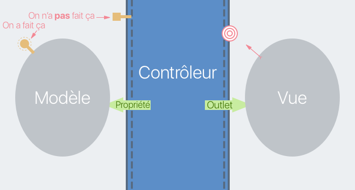
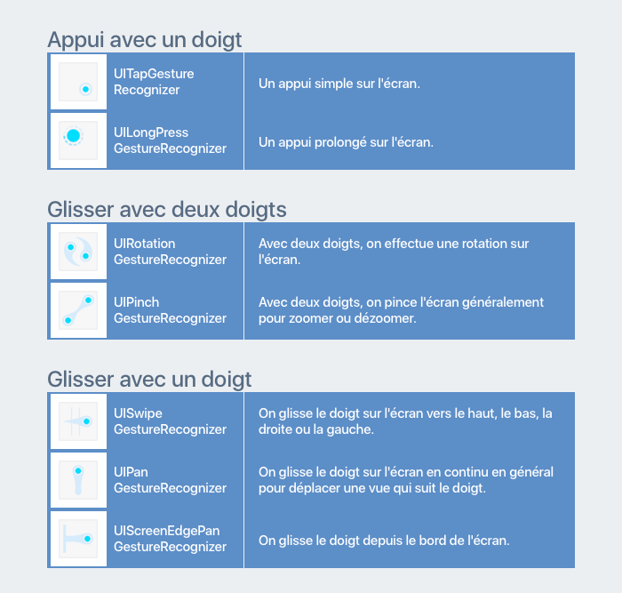
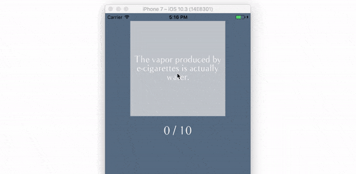
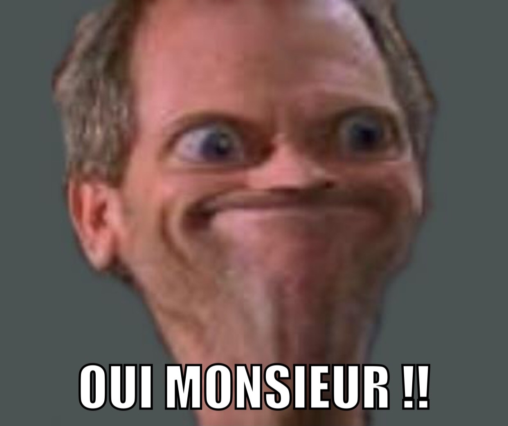

## Connectez la vue et le modèle avec le contrôleur

### Connectez le contrôleur et la vue
Et nous voilà dans la partie sur le contrôleur ! Cette partie est la plus excitante du cours car nous allons tout connecter pour faire enfin fonctionner notre application ! La logique est prête dans le modèle, la vue est toute belle. Il ne nous reste plus qu'à faire les branchements avec le contrôleur !


Pour rappel, le rôle du contrôleur est de faire **le lien entre le modèle et la vue**. Le contrôleur va récupérer les données du modèle et les afficher dans la vue.


Dans ce chapitre, nous allons commencer par connecter le contrôleur et la vue.

#### Le fichier ViewController.swift

Concrètement le contrôleur, c'est le fichier `ViewController.swift` qui a été créé automatiquement par Xcode au début du projet.

Dans ce fichier, nous avons une classe `ViewController` qui hérite de `UIViewController`. Cette classe contient déjà deux méthodes :

```swift
override func viewDidLoad() {
	super.viewDidLoad()
	// Do any additional setup after loading the view, typically from a nib.
}

override func didReceiveMemoryWarning() {
	super.didReceiveMemoryWarning()
	// Dispose of any resources that can be recreated.
}
```

La première méthode est appelée lorsque **le contrôleur a fini d'être chargé** donc dans notre cas au lancement de l'application. Nous allons en avoir besoin dans le prochain chapitre pour faire quelques initialisations.

La deuxième méthode est appelée lorsque le contrôleur doit retenir trop d'informations et qu'**il n'a plus de place en mémoire** pour les stocker. Dans ce cas, il faut libérer de la place. Nous ne rencontrerons pas ce problème donc vous pouvez supprimer la méthode.

#### Les outlets

Pour connecter le contrôleur et la vue, nous allons utiliser des... **connexions** ! Il existe deux types de connexion : les **outlets** et les **actions**. Nous allons commencer par les outlets.

> **:information_source:** Les outlets et les actions ont déjà été traités en détail dans [ce cours](https://openclassrooms.com/courses/introduction-a-ios-plongez-dans-le-developpement-mobile/connectez-le-code-et-le-storyboard). Donc je vais aller plus vite ici et me concentrer sur l'impact sur notre modèle MVC.

##### Les outlets et le MVC
Pour rappel, les outlets sont des **connexions entre une vue dans le storyboard et une propriété dans le contrôleur**. Nous allons donc créer des propriétés dans notre contrôleur qui représentent nos vues.

Cela veut dire que dans notre modèle MVC, le contrôleur s'adresse à la vue via les outlets.


##### Créer un outlet
> **:question:** Comment on crée les outlets ?

Vous avez deux options :
- soit vous faites comme pour `QuestionView` précédemment en écrivant la propriété et le décorateur `@IBOutlet`.
- soit vous laissez Xcode faire cela pour vous en utilisant le **control drag**. Et c'est ce que nous allons faire.

Placez-vous en mode assistant avec le storyboard à gauche et le contrôleur à droite. Laissez la touche <kbd>ctrl</kbd> enfoncée et glissez depuis le bouton vers le code comme ceci :


Lorsque vous relâchez la souris, une popup vous demande plus d'information sur la connexion que vous souhaitez créer. Il y a plusieurs paramètres :
- *Connection* : le type de connexion que vous souhaitez créer. Ici, on veut bien un *Outlet*.
- *Object* : Vers où pointe la connexion, c'est bien le `ViewController`.
- *Name* : Le nom de la propriété que l'on veut créer. Ici nous allons écrire : `newGameButton`.
- *Type* : Le type de la propriété que l'on veut créer. C'est bien `UIButton`.
- *Storage* : C'est une notion assez avancée de programmation et vous n'aurez jamais besoin de changer ce paramètre donc ignorons-le pour le moment.

On peut ensuite cliquer sur `connect` et le code suivant est généré :

```swift
@IBOutlet weak var newGameButton: UIButton!
```

On a bien le décorateur `@IBOutlet` (puis le mot-clé `weak` que l'on ignore pour le moment), puis la déclaration d'une propriété `newGameButton` de type `UIButton`.

> **:information_source:** Notez ici l'utilisation d'un optionnel déballé. C'est toujours le cas pour les outlets.

Vous pouvez répéter cette opération pour :
- l'indicateur d'activité
- la vue question
- le label score

> **:warning:** Pour la vue question, Xcode va sans doute vous proposer par défaut le type `UIView`. N'oubliez pas de le changer pour le type `QuestionView` pour que l'on puisse bénéficier de cette classe dans le prochain chapitre.

Si vous choisissez les noms ci-dessous, vous devrez obtenir le code suivant :

```swift
@IBOutlet weak var newGameButton: UIButton!
@IBOutlet weak var activityIndicator: UIActivityIndicatorView!
@IBOutlet weak var scoreLabel: UILabel!
@IBOutlet weak var questionView: QuestionView!
```

Tous nos outlets sont créés ! Nous pouvons désormais manipuler nos vues dans le contrôleur.

##### Les outlets collections
Pour votre information, il existe un autre type d'outlet que nous n'utiliserons pas ensemble, mais qui est très simple : les **outlets collections**. Comme leur nom le suggère, ils fonctionnent comme les outlets, mais pour plusieurs vues à la fois.

Par exemple, si on crée une application calculatrice, on pourrait créer un outlet pour chaque bouton de 0 à 9 comme ceci :

```swift
@IBOutlet weak var zeroButton: UIButton!
@IBOutlet weak var oneButton: UIButton!
@IBOutlet weak var twoButton: UIButton!
@IBOutlet weak var threeButton: UIButton!
@IBOutlet weak var fourButton: UIButton!
@IBOutlet weak var fiveButton: UIButton!
@IBOutlet weak var sixButton: UIButton!
@IBOutlet weak var sevenButton: UIButton!
@IBOutlet weak var eightButton: UIButton!
@IBOutlet weak var nineButton: UIButton!
```

C'est un peu redondant et peu pratique à utiliser. On va donc utiliser une outlet collection :

```swift
@IBOutlet var numbersButton: [UIButton]!
```

La propriété créée est un tableau qui contient tous les boutons.

Pour créer une outlet collection, il suffit de choisir ce type de connexion dans la popup après le control drag. Puis pour remplir le tableau, il faut faire un control drag depuis chaque bouton vers la propriété `numbersButton`.

#### Les actions
Nous voulons non seulement contrôler les vues. Mais aussi recevoir des informations de leur part. Par exemple, comment faire pour exécuter du code lorsque le bouton est tapé ?

##### Les actions et le MVC
Nous devons donc aborder l'épineuse question de la communication de la vue vers le contrôleur. La vue a-t-elle le droit de communiquer avec le contrôleur ?

Et la réponse est oui... mais indirectement. Via les **actions**. Les actions sont **des connexions entre une vue et une méthode du contrôleur associées à un évènement**.

Schématiquement le contrôleur va placer une cible sur lui-même. Ainsi la vue va pouvoir lui envoyer un message à chaque fois que le bouton est tapé.


##### Créer une action
Pour créer une action, on va faire comme pour les outlets. On va effectuer un control drag depuis le bouton vers le code. Mais cette fois-ci, nous allons choisir *Action* pour le paramètre *Connection* :


Il y a nouveau plusieurs paramètres ici :
- *Connection* et *Object* : même chose que pour les outlets.
- *Name* : le **nom de la méthode** que nous allons créer. Ici je vous propose `startNewGame`.
- *Type* : Nous allons créer une méthode. Cette méthode peut avoir des paramètres comme l'évènement et la vue dont vient l'action, appelée le *sender*. Si on souhaite avoir le sender en paramètre de la méthode, on peut choisir ici le **type du sender**.
- *Event* : Une action est associée à un **évènement**. Cet évènement représente le geste que doit réaliser l'utilisateur pour que l'action ait lieu. Par défaut, pour un bouton, cet évènement est *Touch Up Inside*. Cela signifie un touché vers le haut à l'intérieur du bouton, c'est-à-dire le moment où le doigt quitte le bouton. Je vous invite à regarder la liste pour voir les autres types d'évènements possibles.
- *Arguments* : Comme expliqué précédemment, la méthode peut avoir des **paramètres**. Ici on décide si on en a besoin ou non. J'ai choisi *None* pour aucun paramètre. Pour information, les autres possibilités sont le sender seul ou le sender et l'évènement.

Vous pouvez cliquer sur *connect* et Xcode génère le code suivant :

```swift
@IBAction func startNewGame() {
}
```

Notre action est créée. La méthode `startNewGame` va être appelée à chaque fois que l'on clique sur le bouton.

#### Implémenter startNewGame
Il ne nous reste plus qu'à implémenter notre méthode `startNewGame`. Réfléchissons un peu à ce qu'elle fait. Elle lance une nouvelle partie donc :
1. Elle va afficher une interface de chargement
2. Elle va lancer le chargement des questions
3. Lorsque les questions sont chargées, la partie peut débuter.

Nous allons nous concentrer sur les points 2 et 3 dans le prochain chapitre car nous avons besoin du modèle pour ça. Pour le moment, nous allons afficher notre interface de chargement. Voici à quoi elle va ressembler :


Nous allons donc :
- Cacher le bouton : cela permet d'empêcher l'utilisateur de lancer un nouveau chargement.
- Afficher l'indicateur d'activité : pour notifier l'utilisateur que le chargement est en cours
- Remettre le score à zéro
- Remettre la vue question dans le style `standard` : son style a pu avoir été modifié plus tôt si l'utilisateur était en train de jouer.
- Afficher "*Loading...*" dans la vue question.

##### Cacher le bouton et afficher l'indicateur d'activité
Comme toutes les vues, les classes `UIButton` et `UIActivityIndicatorView` héritent de `UIView`. Elles ont donc accès à la propriété `isHidden` que nous avons vue dans la partie précédente. Nous avons donc simplement à écrire :

```swift
@IBAction func startNewGame() {
	activityIndicator.isHidden = false
	newGameButton.isHidden = true
}
```

Ainsi, le bouton est caché et l'indicateur d'activité est visible.

##### La vue question
Nous avons déjà bien travaillé sur notre vue question. Nous avons laissé deux propriétés publiques `style` et `title`. Nous avons juste à les utiliser ici.

```swift
questionView.title = "Loading..."
questionView.style = .standard
```

Vous voyez en quoi avoir créé une vue customisée nous rend les choses faciles ici !

##### Le label score

Il ne nous reste plus qu'à remettre à jour le label score. Vous savez maintenant que pour changer le texte d'un `UILabel`, on utilise la propriété `text`. C'est donc précisément ce que nous allons faire :

```swift
scoreLabel.text = "0 / 10"
```

Et voilà ! Votre méthode `startNewGame` doit ressembler à ceci :

```swift
@IBAction func startNewGame() {
	activityIndicator.isHidden = false
	newGameButton.isHidden = true

	questionView.title = "Loading..."
	questionView.style = .standard

	scoreLabel.text = "0 / 10"
}
```

Nous avons maintenant une belle interface de chargement lorsqu'on clique sur le bouton. Vous pouvez tester cela en lançant le simulateur.


> **:warning:** Choisissez bien le modèle iPhone 7 pour lancer le simulateur. Notre interface ne s'adapte pas aux différentes tailles d'iPhone. Donc il n'y a que sur iPhone 7 que notre interface s'affichera correctement. Dans le prochain cours sur iOS, nous reprenons le travail sur OpenQuizz pour l'adapter à toutes les tailles d'écran d'iPhone et iPad.

#### En Résumé
- Pour contrôler les vues, le contrôleur utilise les outlets qui sont des connexions entre une propriété du contrôleur et une vue.
- Pour envoyer un message au contrôleur, les vues peuvent utiliser les actions qui sont des connexions entre une méthode du contrôleur et une vue, associées à un évènement.
- Pour créer ces connexions, on utilise le control drag depuis la vue vers le code du contrôleur.

### Connectez le contrôleur et le modèle
Nous avons fait la moitié du travail. La vue et le contrôleur sont connectés, mais le modèle et le contrôleur ne communiquent pas encore. Ce ne sera plus vrai à la fin de ce chapitre !


#### La propriété game
Dans le chapitre précédent, on a vu que le contrôleur peut manipuler les vues grâce à des outlets. Cela prend la forme de propriétés. Ici, nous allons faire exactement la même chose. Nous allons créer une propriété `game` de type `Game` :

```swift
var game = Game()
```

Cette propriété va nous permettre de gérer la partie en nous appuyant sur le travail qui a été fait dans le modèle.

Donc si on reprend notre modèle MVC, on voit que pour accéder au modèle, le contrôleur utilise les propriétés :


Nous allons maintenant utiliser notre propriété `game` pour lancer une nouvelle partie en téléchargeant de nouvelles questions.

#### Charger les questions
Pour télécharger de nouvelles questions, nous allons utiliser la méthode `refresh` de la classe `Game` que nous avons créée ensemble. Et nous allons faire cela, lorsque l'utilisateur appuie sur le bouton pour lancer une nouvelle partie. Donc on va rajouter l'appel à la méthode `refresh` dans la méthode `startNewGame`.

```swift
@IBAction func startNewGame() {
	activityIndicator.isHidden = false
	newGameButton.isHidden = true

	questionView.title = "Loading..."
	questionView.style = .standard

	scoreLabel.text = "0 / 10"

	game.refresh()
}
```

Revenons un peu sur le fonctionnement de cette méthode :
1. Elle redémarre la partie en remettant le score à zéro notamment
2. Elle va chercher de nouvelles questions sur internet
3. Quand les questions sont chargées :
	- Elle stocke les questions dans la propriété `questions` de la classe `Game`
	- Elle envoie une notification pour prévenir qui veut que les questions sont chargées.

Les notifications sont un des moyens qu'a le modèle de s'adresser au contrôleur. Nous avons déjà géré l'envoi de la notification, mais pas la réception.



C'est ce que nous allons faire ici !

#### Recevoir une notification
Pour recevoir une notification, il faut se brancher à l'émission de radio que l'on souhaite. Et nous voulons faire cela dès que le contrôleur est chargé pour ne pas rater de message.

##### Le nom de la notification
Lorsque le contrôleur vient de finir de se charger, la méthode `viewDidLoad` est appelée. C'est dans cette méthode que nous allons nous brancher à la notification.

Pour rappel, les notifications ont des noms. Ces noms permettent d'identifier chaque notification de façon unique. Pour savoir quelle notification écouter, nous allons commencer par obtenir son nom :

```swift
override func viewDidLoad() {
	super.viewDidLoad()
	let name = Notification.Name(rawValue: "QuestionsLoaded")
}
```

Jusque là rien de nouveau, nous avons écrit cette même ligne dans le modèle.

##### Observer la notification

Maintenant nous allons effectivement nous brancher. Pour rappel, la classe en charge d'envoyer et de recevoir les notifications s'appelle le `NotificationCenter`. Et le centre par défaut s'appelle simplement `default`. La méthode qui permet d'écouter les notifications s'appelle `addObserver`. Donc nous allons écrire :

```swift
let name = Notification.Name(rawValue: "QuestionsLoaded")
NotificationCenter.default.addObserver(self, selector: <vide>, name: name, object: nil)
```

Alors, commentons un peu cette ligne. Tout d'abord on récupère l'instance `default` de  `NotificationCenter` sur laquelle on appelle la fonction `addObserver`. Cette fonction prend quatre paramètres :
- *observer* : ici celui qui doit observer la notification, c'est le contrôleur. Donc on écrit `self` pour faire référence à soi-même.
- *selector* : on va voir ça dans un instant.
- *name* : le nom de la notification à observer, on lui passe donc la variable `name` que nous venons de créer.
- *object* : cette propriété permet de préciser l'objet dont on accepte la notification. Cela fonctionne comme un filtre. Ici, on ne cherche pas à savoir d'où vient la notification, donc on écrit `nil`.

##### Le sélecteur
Revenons sur cet étrange paramètre *selector*. Il est du type `Selector`. Ce type permet de passer une fonction en paramètre. C'est cette fonction qui sera exécutée quand le contrôleur recevra la notification.

Commençons donc par créer une fonction :

```swift
func questionsLoaded() {
}
```

Pour passer cette fonction dans le sélecteur, il y a une syntaxe bien particulière. On écrit `#selector` et le nom de la fonction entre parenthèses. Finalement, on obtient :

```swift
override func viewDidLoad() {
	super.viewDidLoad()
	let name = Notification.Name(rawValue: "QuestionsLoaded")
	NotificationCenter.default.addObserver(self, selector: #selector(questionsLoaded), name: name, object: nil)
}

func questionsLoaded() {
}
```
Ça y est ! Notre contrôleur observe maintenant la notification et dès que les questions seront chargées, il sera prévenu et pourra exécuter la méthode `questionsLoaded`.

> **:information_source:** On utilise principalement les sélecteurs pour les notifications. C'est un héritage d'Objective-C. Dans les autres cas, on préfère utiliser les fermetures que nous avons vu précédemment.

#### Implémenter questionsLoaded

Il ne nous reste plus qu'à implémenter la méthode `questionsLoaded`. Lorsque les questions sont chargées, nous allons faire plusieurs choses :
1. Cacher l'indicateur d'activité : le chargement est terminé, il peut disparaître.
2. Montrer le bouton : la partie a commencé, l'utilisateur peut décider d'en charger tout de suite une nouvelle s'il n'aime pas la première question qu'on lui propose par exemple.
3. Afficher la première question de la partie

##### Cacher l'indicateur d'activité et montrer le bouton
Vous commencez à être habitué maintenant à cacher et à montrer des choses grâce à la propriété `isHidden`. Donc je vous laisse essayer et je vous donne la correction :

```swift
// Essayez par vous même


func questionsLoaded() {
	activityIndicator.isHidden = true
	newGameButton.isHidden = false
}
```

##### Afficher la première question
Nous avons conçu notre classe `Game` pour qu'elle puisse facilement donner au contrôleur la question qu'il a besoin d'afficher. Nous avons fait cela en créant la propriété `currentQuestion` de type `Question`. Nous allons donc l'utiliser pour modifier le titre de notre vue question :

```swift
questionView.title = game.currentQuestion.title
```

Et voilà, nous n'avons plus qu'à tester dans le simulateur !


Il ne nous reste qu'une petite chose à faire. Lorsque l'utilisateur lance l'application, il s'attend à pouvoir jouer tout de suite. Donc nous allons lancer une partie dès la méthode `viewDidLoad` :

```swift
override func viewDidLoad() {
	super.viewDidLoad()
	let name = Notification.Name(rawValue: "QuestionsLoaded")
	NotificationCenter.default.addObserver(self, selector: #selector(questionsLoaded), name: name, object: nil)
	startNewGame() // On lance une partie tout de suite
}
```

#### En résumé
- Le contrôleur peut faire appel au modèle via ses propriétés.
- Le modèle peut communiquer avec le contrôleur via des notifications. Pour observer une notification, on utilise la méthode `addObserver` de la classe `NotificationCenter`.
- Les sélecteurs permettent de passer en paramètre une fonction avec la syntaxe suivante : `#selector(nomDeLaFonction)`.

### Travaillez votre gestuelle
Notre application commence à prendre une bonne forme ! Nous pouvons maintenant lancer une nouvelle partie en chargeant de nouvelles questions. Mais nous ne pouvons pas y répondre. Donc le jeu est pour l'instant assez limité... Pour répondre aux questions, l'utilisateur va devoir glisser la question à gauche ou à droite :


Si l'utilisateur pense que la question est vraie, il la glisse vers la droite et inversement. Dans ce chapitre, nous allons donc apprendre à interpréter les gestes de l'utilisateur.

#### A la découverte de UIGestureRecognizer
Il y a deux classes qui permettent de gérer les gestes de l'utilisateur sur l'écran tactile :
- `UIGestureRecognizer` : pour les gestes simples
- `UITouch` : pour des interprétations plus fines des gestes.

On fait déjà énormément de choses avec `UIGestureRecognizer` donc je n'aborderais pas `UITouch` dans ce cours.

##### Quand utiliser UIGestureRecognizer ?

> **:question:**, Mais je sais déjà interpréter les gestes ?

Ah bon... ?

> **:question:**, Mais oui ! On vient de voir avec les actions que je peux répondre à l'appui sur le bouton !

Bien vu ! Tous les composants par défaut que je vous ai présenté ont pour la plupart des gestes prédéfinis. Donc pour ceux-là, vous n'aurez pas besoin de `UIGestureRecognizer`.

Pour tous les autres cas, vous en aurez besoin. Simple, non ?

##### Les sous-classes de UIGestureRecognizer

En fait, on ne va pas utiliser `UIGestureRecognizer` directement, mais ses sous-classes. Ces sous-classes définissent chacune un geste simple. L'application compagnon de ce cours vous permet de jouer avec toutes ces sous-classes. Si ce n'est pas déjà fait, il n'est pas trop tard pour [la télécharger](Lien de téléchargement) !

Pour ceux qui ne peuvent pas, voici un tableau qui donne les sous-classes principales de `UIGestureRecognizer` :



> **:information_source:** Toutes les classes ci-dessus qui s'utilisent avec un doigt ont une propriété `numberOfTouches` qui permet de choisir le nombre de doigts nécessaire pour que le geste soit reconnu. La plupart du temps on laissera cette valeur à `1`, mais vous savez maintenant que vous pouvez modifier cela si besoin.

Dans ce cours, nous allons utiliser `UIPanGestureRecognizer` pour faire glisser notre vue à droite ou à gauche.

#### Utiliser un UIGestureRecognizer
Comme tout ce qui concerne l'interface, il y a deux moyens de créer un `UIGestureRecognizer` :
- Avec le code
- Avec le storyboard

Pour changer, je vais vous montrer ça dans le code. Et comme je suis sympa, j'ai fait pour vous [cette vidéo](INSERT LINK) pour vous montrer comment on fait ça dans le storyboard !

##### Créer un UIGestureRecognizer
On veut que le geste soit détectable le plus tôt possible, dès que l'interface est chargée. Donc nous allons créer notre geste dans `viewDidLoad`.

`UIGestureRecognizer` a besoin de trois informations pour fonctionner :
- Target : Qui est responsable de gérer le geste ? En général le contrôleur.
- Action : Quelle action doit-on effectuer quand le geste est reconnu ?
- View : Quelle vue doit détecter le geste ?

`UIGestureRecognizer` et ses sous-classes ont un initialiseur qui réclame les deux premiers paramètres :
```swift
let panGestureRecognizer = UIPanGestureRecognizer(target: self, action: #selector(dragQuestionView(_:)))
```

Détaillons tout ça :
- Pour le paramètre `target`, je choisis donc `self` pour faire référence au contrôleur.
- Pour le paramètre `action`, comme dans le chapitre précédent, j'utilise un **sélecteur** dans lequel je passe la méthode `dragQuestionView` que je crée par ailleurs comme ceci :
```swift
func dragQuestionView(_ sender: UIPanGestureRecognizer) {
}
```
J'ai donné à cette méthode le paramètre `sender` qui est notre `UIPanGestureRecognizer`.

> **:information_source:** Comme la méthode contient un paramètre, je dois le préciser dans le sélecteur comme ceci : `dragQuestionView(_:)`.

Il nous faut maintenant préciser la vue qui doit détecter le geste. Pour cela, on utilise la méthode `addGestureRecognizer` de `UIView`.

```swift
let panGestureRecognizer = UIPanGestureRecognizer(target: self, action: #selector(dragQuestionView(_:)))
questionView.addGestureRecognizer(panGestureRecognizer)
```

Et voilà notre geste est reconnu ! Il nous faut maintenant implémenter la méthode `dragQuestionView` !

##### Les états des gestes
`UIGestureRecognizer` a une propriété `state` qui décrit l'état du geste. Elle va nous être utile pour savoir où en est le geste. Cette propriété est de type `UIGestureRecognizerState` qui est une énumération qui a donc plusieurs cas :
- `possible` : C'est le cas par défaut. Le gesture recognizer attend de détecter un geste.
- `began` : Le gesture recognizer vient de détecter le geste.
- `changed` : La valeur vient de changer et le geste se poursuit.
- `ended` : Le geste est terminé, l'utilisateur a lâché l'écran.
- `cancelled` : Un autre geste vient interrompre le geste en cours.

> **:information_source:** Il existe d'autres états, mais dont nous n'avons pas besoin ici.

Voici ce que nous allons faire :
- Lorsque le geste est en cours (`began` et `changed`), nous allons modifier la position de notre vue question pour qu'elle suive le doigt.
- Lorsque le geste est terminé (`cancelled` et `ended`), nous allons enregistrer la réponse choisie par l'utilisateur et proposer la question suivante.

Et comme nous avons à faire à une énumération, nous allons utiliser un `switch` :

```swift
switch sender.state {
case .began, .changed:
	// La vue doit suivre le doigt
case .ended, .cancelled:
	// On enregistre la réponse choisie
default:
	break
}
```

Pour ne pas surcharger ce `switch`, nous allons créer deux méthodes que nous allons remplir dans le prochain chapitre :

```swift
func dragQuestionView(_ sender: UIPanGestureRecognizer) {
	switch sender.state {
	case .began, .changed:
		transformQuestionViewWith(gesture: sender)
	case .ended, .cancelled:
		answerQuestion()
	default:
		break
	}
}

private func transformQuestionViewWith(gesture: UIPanGestureRecognizer) {

}

private func answerQuestion() {

}
```

> **:information_source:** Je marque ces méthodes privées pour indiquer clairement qu'elles servent uniquement en support d'une autre méthode de la classe.

Il ne nous reste qu'une toute petite chose à faire ici. Nous voulons que l'utilisateur puisse déplacer la vue question uniquement lorsque le jeu est en cours ! Pour cela, nous allons vérifier que la propriété `state` de `game` est à la valeur `ongoing`.

```swift
func dragQuestionView(_ sender: UIPanGestureRecognizer) {
	if game.state == .ongoing {
		switch sender.state {
		case .began, .changed:
			transformQuestionViewWith(gesture: sender)
		case .ended, .cancelled:
			answerQuestion()
		default:
			break
		}
	}
}
```

Et voilà ! Notre geste est prêt à être interprété ! La suite, au prochain épisode !

#### En résumé
- Il existe deux classes pour gérer les gestes en iOS `UITouch` et `UIGestureRecognizer`.
- `UIGestureRecognizer` et ses sous-classes permettent facilement de rajouter des gestes classiques à une interface.
- Pour créer un `UIGestureRecognizer`, on doit lui donner une cible (le contrôleur le plus souvent), la vue qui reçoit le geste et l'action à effectuer quand le geste est reconnu.
- `UIGestureRecognizer` a une propriété `state` qui permet de savoir où en est le geste.

### Transformez votre vue
Nous avons ajouté un geste à notre vue question. Mais pour le moment, ce geste n'est pas interprété. Dans ce chapitre, nous allons interpréter le geste pour déplacer notre vue question et permettre à l'utilisateur d'y répondre. Et nous allons commencer par récupérer les informations de notre geste.

#### Récupérer les informations du geste
Notre geste a été passé en paramètre dans la méthode `transformQuestionViewWith`. Nous allons récupérer les informations qu'il contient pour déplacer notre vue en fonction du geste. La classe `UIPanGestureRecognizer` a une méthode `translation(in: UIView)`. Cette méthode prend en paramètre la vue dont on veut obtenir le déplacement. Et renvoie un `CGPoint` qui représente le déplacement.

Récupérons donc cette translation :

```swift
private func transformQuestionViewWith(gesture: UIPanGestureRecognizer) {
	let translation = gesture.translation(in: questionView)
}
```

#### La propriété transform
Nous allons maintenant utiliser cette information de translation pour déplacer la vue. Et pour déplacer la vue, nous allons utiliser la propriété `transform` de `UIView` de type `CGAffineTransform`. Cette propriété a un rôle très précis, elle permet de modifier l'apparence d'une vue de trois façons différentes :
- changer la position de la vue en lui appliquant une translation
- changer la taille de la vue en lui appliquant une échelle
- changer l'orientation de la vue en lui appliquant une rotation

##### La translation
Pour le moment, c'est la translation qui nous intéresse. Pour créer une translation, on utilise l'initialiseur dédié de `CGAffineTransform` :

```swift
CGAffineTransform(translationX: CGFloat, y: CGFloat)
```

Les valeurs `x` et `y` de la translation sont celles obtenues précisément à partir des informations du geste. Donc on peut écrire :

```swift
let translation = gesture.translation(in: questionView)
questionView.transform = CGAffineTransform(translationX: translation.x, y: translation.y)
```

Prenons une pause pour bien assimiler ce qu'il vient de se passer :
1. On récupère **la translation effectuée par le doigt sur l'écran** dans la première ligne. Cette translation a pour type `CGPoint` qui est une structure que nous avons vue et qui a deux propriétés `x` et `y`.
2. On crée une transformation de notre vue question. Cette transformation est de type translation. On lui donne les paramètres de la translation de notre doigt.

Ainsi **la translation du doigt sur l'écran et la translation de la vue correspondent**. Si on lance le simulateur, on peut voir que maintenant la vue suit notre doigt (la souris) :



#### La rotation
Allons plus loin avec cette propriété `transform` et amusons-nous. Nous allons appliquer une rotation à la vue selon les règles suivantes :
- Plus on est loin du centre, plus la rotation est forte
- Vers la droite, la vue est tournée vers la droite et inversement

Pour que la rotation ait un effet satisfaisant, nous allons appliquer une rotation de -30° quand la vue est à l'extrémité gauche de l'écran et +30° à l'extrémité droite. Si vous avez des petits restes de trigonométrie, nous allons donc faire la translation entre -π/6 et +π/6.


> **:information_source:** Libre à vous de choisir d'autres valeurs, après plusieurs essais, j'ai trouvé l'animation réussie avec ces valeurs, mais chacun ses goûts !

Nous allons commencer par récupérer la largeur de l'écran :

```swift
var screenWidth = view.frame.width
```

J'utilise la vue principale de notre contrôleur et j'accède à sa largeur via sa propriété `frame`.

Avec cette information, nous allons pouvoir calculer l'angle en fonction de la translation de la vue :

```swift
let translationPercent = translation.x/(view.frame.width / 2)
let rotationAngle = (CGFloat.pi / 6) * translationPercent
```
Je calcule d'abord où je suis par rapport au bord de l'écran. La valeur `translationPercent` peut varier entre `-100%` et `+100%`. Et ensuite j'applique ce pourcentage à π/6.

Maintenant nous allons pouvoir créer notre transformation en utilisant cet angle de rotation. Nous allons utiliser un autre initialiseur de `CGAffineTransform` :

```swift
let rotationTransform = CGAffineTransform(rotationAngle: rotationAngle)
```

##### Combiner les transformations
Nous avons maintenant une transformation de rotation et une transformation de translation. Il faut combiner les deux pour obtenir la transformation complète que l'on veut affecter à notre vue. Et pour cela, nous allons utiliser la méthode `concatenating` de `CGAffineTransform` :

```swift
let transform = translationTransform.concatenating(rotationTransform)
questionView.transform = transform
```

Et voilà ! On n'a plus qu'à tester dans notre simulateur :


Joli, non ? :D

#### Changer le style
Pour compléter cette animation, il nous reste une petite chose à faire. Il faut changer le style de notre vue en fonction de sa position :
- Si elle est à droite, il faut afficher le style réponse correcte (en vert)
- Si elle est à gauche, il faut afficher le style réponse incorrecte (en rouge)

Et on va faire ça facilement grâce à notre belle `QuestionView` ! Il nous suffit de savoir si la vue est à droite ou à gauche. Et pour cela nous allons regarder la valeur `x` de notre translation :
- Si elle est positive, la vue est à droite.
- Si elle est négative, la vue est à gauche.

On écrit donc :

```swift
if translation.x > 0 {
	questionView.style = .correct
} else {
	questionView.style = .incorrect
}
```

Et voilà, nous avons créé une nouveau geste beau et pratique !


Pour que vous ayez la vue d'ensemble, voici le code final de notre fonction :

```swift
private func transformQuestionViewWith(gesture: UIPanGestureRecognizer) {
	let translation = gesture.translation(in: questionView)

	let translationTransform = CGAffineTransform(translationX: translation.x, y: translation.y)

	let translationPercent = translation.x/(view.frame.width / 2)
	let rotationAngle = (CGFloat.pi / 3) * translationPercent
	let rotationTransform = CGAffineTransform(rotationAngle: rotationAngle)

	let transform = translationTransform.concatenating(rotationTransform)
	questionView.transform = transform

	if translation.x > 0 {
		questionView.style = .correct
	} else {
		questionView.style = .incorrect
	}
}
```

#### Répondre à la question
Notre geste est bien beau, mais lorsqu'on lâche la vue, il ne se passe rien. Et c'est parce que nous n'avons pas implémenté la deuxième méthode que nous avions préparée : `answerQuestion`. Alors, allons-y !

##### Envoyer la réponse au modèle
Tout d'abord nous allons envoyer la réponse au modèle qui va se charger de mettre à jour le score. Nous allons utiliser la méthode `answerCurrentQuestion` que nous avions préparée dans la classe `Game`.

Cette question prend en paramètre la réponse de l'utilisateur : vrai ou faux. Nous allons déduire cette réponse du style de la vue question :

```swift
private func answerQuestion() {
	switch questionView.style {
	case .correct:
		game.answerCurrentQuestion(with: true)
	case .incorrect:
		game.answerCurrentQuestion(with: false)
	case .standard:
		break
	}
}
```

Si la vue question est dans le style `correct`, l'utilisateur réponds vrai à la question et inversement.

##### Mettre à jour le score
La méthode `answerCurrentQuestion` met à jour le score de la partie. Donc nous pouvons ensuite afficher le score mis à jour :

```swift
scoreLabel.text = "\(game.score) / 10"
```

##### Afficher la nouvelle question
Enfin, il faut afficher la question suivante. Pour cela, nous allons commencer par replacer la vue question à sa place d'origine. Pour cela, nous allons utiliser une instance spéciale de `CGAffineTransform` : `identity`. Cette transformation est la **transformation identité** et permet donc de ramener la vue à son état d'origine.

```swift
questionView.transform = .identity
```

La vue est revenue à sa place. Il faut également lui redonner son style standard pour qu'elle redevienne grise.

```swift
questionView.style = .standard
```

Enfin, il nous faut modifier son titre pour afficher la nouvelle question :

```swift
questionView.title = game.currentQuestion.title
```

Et voilà ! Nous affichons la nouvelle question après avoir enregistré la réponse de l'utilisateur.


##### Game Over

Minute papillon !

> **:question:** Bah quoi ?

Nous avons oublié de traiter un cas. Que se passe-t-il si la partie est terminée ? Nous ne pouvons plus afficher la question suivante ! L'application va planter. Donc nous devons afficher à la place que la partie est terminée. Pour cela, nous allons contrôler la propriété `state` de `game`.

```swift
switch game.state {
case .ongoing:
	questionView.title = game.currentQuestion.title
case .over:
	questionView.title = "Game Over"
}
```

Et voilà ! Nous indiquons à l'utilisateur que la partie est terminée ! C'est quand même mieux que l'application qui plante !


> **:information_source:** Vous noterez que lorsque la partie est terminée, on ne peut en effet plus déplacer la vue.

A la fin, le code de notre fonction ressemble donc à ceci :

```swift
private func answerQuestion() {
	switch questionView.style {
	case .correct:
		game.answerCurrentQuestion(with: true)
	case .incorrect:
		game.answerCurrentQuestion(with: false)
	 case .standard:
		break
	}

	scoreLabel.text = "\(game.score) / 10"

	questionView.transform = .identity
	questionView.style = .standard

	switch game.state {
	case .ongoing:
		questionView.title = game.currentQuestion.title
	case .over:
		questionView.title = "Game Over"
	}
}
```

#### En résumé
- Pour obtenir la translation du doigt sur l'écran, lors d'un `UIPanGestureRecognizer`, on utilise la méthode `translation(in: UIView)`.
- `UIView` a une propriété `transform` qui permet de changer la taille, la position et l'orientation de la vue.
- Pour créer une transformation, nous avons vu deux initialiseurs de `CGAffineTransform` :
```swift
CGAffineTransform(translationX: CGFloat, y: CGFloat)
CGAffineTransform(rotationAngle: CGFloat)
```
- Pour combiner deux transformations, nous avons vu la méthode `concatenating` de `CGAffineTransform` :
```swift
let combinedTransform = transform1.concatenating(transform2)
```

### Animez l’interface
C'est le moment de la touche finale de notre application ! Le coup de pinceau génial ! La cerise sur le gâteau ! Le clou du spectacle !

> **:question:** Tu t'emballes...

Oui. Pardon. Mais c'est parce que dans ce chapitre, nous allons parler des animations ! Et je trouve ça personnellement très amusant. Nous allons apprendre à animer nos vues pour donner à notre application une finition vraiment professionnelle.

Vous êtes prêt ?



#### Les animations en iOS

Il existe de nombreux moyens de faire des animations en iOS. Voici la plupart d'entre eux :
- `UIView Animation` pour animer les propriétés des vues
- `Core Animation`pour animer des vues, mais avec bien plus de possibilités
- `SceneKit` pour des animations en 3D
- `SpriteKit` pour des jeux en 2D
- `Dynamic Animation` pour des animations avec des règles physiques comme la gravité, les collisions, etc.

Nous n'aborderons pas toutes ces techniques ensemble car ce serait trop long. Et puis, si vous ne programmez pas des jeux, les deux premiers couvrent 99% de vos besoins. Et le premier en couvre à lui tout seul 80%.

Donc nous allons nous concentrer dans ce chapitre sur `UIView Animation`. `UIView Animation` comme son nom l'indique permet d'animer les propriétés des vues et en particulier :
- `frame` : nous avons vu cette propriété ensemble, elle permet de placer les vues
- `transform` : nous venons de la voir
- `alpha` : cette propriété permet de modifier l'opacité de la vue. En l'animant, on peut faire apparaître ou disparaître doucement notre vue.
- `backgroundColor` : on peut animer le changement de la couleur de fond

Dans ce chapitre, nous allons principalement animer la propriété `transform`. Mais vous pouvez vous amuser à animer les autres. Nous allons réaliser l'animation suivante :


Cette animation a lieu en deux temps :
- Lorsqu'on lâche la vue, la vue glisse vers la droite où vers la gauche selon l'endroit où nous l'avons lâcher.
- Ensuite, elle réapparaît au milieu avec une animation comme si elle arrivait par le fond avec un effet "boing".

#### Créer une animation
Pour créer une animation, on utilise la méthode de classe `animate` de `UIView`. Cette méthode a plusieurs variantes, mais celle qui nous intéresse pour l'instant est la suivante :

```swift
UIView.animate(withDuration: TimeInterval, animations: () -> Void, completion: (Bool) -> Void)
```
Cette méthode prend en paramètre une durée de type `TimeInterval`. Rien de bien sorcier ici, il suffit de lui passer un nombre décimal. Cela correspond à la durée en secondes de l'animation.

Puis elle prend deux autres paramètres qui sont des f...

> **:question:** Des float ?

Mais non ! Regardez leur type, ce sont des fer..

> **:question:** Des fermetures !!

Bravo ! Les animations sont un très bon moyen de pratiquer les fermetures. *Il n’est pas bien fait ce cours... ?* :D

Dans la première fermeture, nous allons modifier les propriétés que l'on souhaite animer. Dans l'autre, on va pouvoir effectuer une action quand l'animation est terminée.

#### Faire disparaître la vue
Pour faire disparaître la vue, on va la faire glisser vers la droite si la réponse est vraie et inversement si la réponse est fausse. Pour être certains qu'elle quitte l'écran, nous allons la faire glisser d'une distance égale à la largeur de l'écran. On commence donc par obtenir la largeur de l'écran :

```swift
let screenWidth = view.frame.width
```

Puis on va créer une translation vers la droite ou vers la gauche en fonction de la réponse choisie :
```swift
var translationTransform: CGAffineTransform
if questionView.style == .correct {
	translationTransform = CGAffineTransform(translationX: screenWidth, y: 0)
} else {
	translationTransform = CGAffineTransform(translationX: -screenWidth, y: 0)
}
```

Maintenant, nous allons créer l'animation :

```swift
UIView.animate(withDuration: 0.3, animations: {
	self.questionView.transform = translationTransform
}, completion: nil)
```

Je précise une durée de 0,3 seconde. Puis dans la fermeture `animations`, je modifie la propriété `transform`. Et `UIView` va s'occuper tout seul d'animer le changement de cette propriété.

> **:information_source:** Vous notez que j'utilise le mot-clé `self`. On est obligé de l'utiliser pour faire référence à une propriété ou une méthode dans une fermeture.

Pour l'instant, je n'ai pas rédigé de code dans la fermeture `completion` mais nous allons corriger ça tout de suite !

```swift
UIView.animate(withDuration: 0.3, animations: {
	self.questionView.transform = translationTransform
}, completion: { (success) in
	if success {
		self.showQuestionView()
	}
})
```

La fermeture question a un paramètre `success` de type `Bool` qui permet de vérifier que l'animation s'est bien déroulée. Si c'est le cas, j'appelle la fonction `showQuestionView` que je vais créer tout de suite et qui contient le code suivant :

```swift
private func showQuestionView() {
    questionView.transform = .identity
    questionView.style = .standard

    switch game.state {
    case .ongoing:
        questionView.title = game.currentQuestion.title
    case .over:
        questionView.title = "Game Over"
    }
}
```

Dans cette fonction, j'ai simplement copié le code que nous avons rédigé dans le chapitre précédent et dont le seul but est de repositionner et mettre à jour la question.

Si je lance maintenant le simulateur, je vois bien que la vue disparaît sur le côté et à la fin de l'animation, elle revient au centre avec une nouvelle question :


#### Faire apparaître la question

Nous allons maintenant animer le retour de la question. Nous allons procéder ainsi :
- Nous allons placer la vue au centre de l'écran et réduire sa taille pour qu'on ne la voie plus.
- Nous allons animer son retour à sa taille normale avec un petit effet "boing".

Nous allons faire tout cela juste après l'animation précédente donc dans la méthode `showQuestionView`. Nous ramenons déjà la vue au centre de l'écran avec la ligne :

```swift
questionView.transform = .identity
```

Nous devons maintenant réduire sa taille. Et pour cela, nous allons utiliser un troisième initialiseur de `CGAffineTransform` :

```swift
CGAffineTransform(scaleX: CGFloat, y: CGFloat)
```

Cette transformation prend en paramètre deux échelles d'agrandissement en largeur sur les x et en hauteur sur les y. Si on veut doubler la largeur et tripler la hauteur, on écrit 2 et 3. Ici, on veut réduire la taille donc on va écrire :

```swift
questionView.transform = CGAffineTransform(scaleX: 0.01, y: 0.01)
```

La vue est maintenant de retour au centre et toute petite, tellement qu'on ne la voit plus. Nous allons animer son retour à sa taille normale. Pour obtenir l'effet "boing" souhaité, nous allons utiliser une autre version de la méthode `animate` :

```swift
UIView.animate(withDuration: TimeInterval, delay: TimeInterval, usingSpringWithDamping: CGFloat, initialSpringVelocity: CGFloat, options: [UIViewAnimationOption], animations: () -> Void, completion: (Bool) -> Void)
```

Cette méthode permet d'animer les propriétés de la vue en les faisant osciller autour de la valeur d'arrivée. Laissez-moi vous expliquer cela avec ces deux animations :


Dans la première animation, la vue va du point de départ au point d'arrivée simplement. Dans la deuxième, elle va plus rapidement au point d'arrivée et ensuite elle oscille autour du point d'arrivée avant de trouver sa position finale. On appelle cela une animation *spring*.

Et c'est ce que nous allons faire ici. Parcourons un peu les paramètres de cette grosse méthode :
- *duration* : La durée de l'animation comme tout à l'heure
- *delay* : Cela permet de décaler le démarrage de l'animation. Nous n'en avons pas besoin ici.
- *damping* : Ce paramètre peut être choisi entre 0 et 1. Plus on est proche de 0, plus il y aura d'oscillations autour de la valeur d'arrivée.
- *initialVelocity* : Cela permet de choisir la vitesse de départ de la vue lors de l'animation. Plus elle sera rapide, plus les oscillations seront grandes.
- *options* : Ici, on peut préciser des options pour notre animation. Ici, nous n'allons pas en avoir besoin, mais vous pouvez allez regarder les options disponibles [ici](https://developer.apple.com/documentation/uikit/uiviewanimationoptions).
- *animations* et *completion* : les mêmes fermetures que pour la méthode utilisée précédemment.

Avec toutes ces informations, nous allons pouvoir utiliser notre méthode :

```swift
UIView.animate(withDuration: 0.4, delay: 0.0, usingSpringWithDamping: 0.5, initialSpringVelocity: 0.5, options: [], animations: {
	self.questionView.transform = .identity
}, completion:nil)
```

> **:information_source:** Après plusieurs essais, j'ai choisi les paramètres `duration`, `damping` et `velocity` ainsi. Mais je vous invite à les modifier pour voir comment l'animation réagit !

A l'intérieur du bloc `animation`, je ramène la vue à sa taille d'origine en lui appliquant la transformation identité. Notre animation est terminée et notre vue question réapparaît maintenant avec un joli petit effet !


Et voilà ! Notre application est complètement finalisée ! Et c’est du travail de pro !

#### ViewController.swift

Pour que vous vous y retrouviez, voici l'intégralité de notre contrôleur !

```swift
import UIKit

class ViewController: UIViewController {
    @IBOutlet weak var newGameButton: UIButton!
    @IBOutlet weak var activityIndicator: UIActivityIndicatorView!
    @IBOutlet weak var scoreLabel: UILabel!
    @IBOutlet weak var questionView: QuestionView!

    var game = Game()

    override func viewDidLoad() {
        super.viewDidLoad()
        let name = Notification.Name(rawValue: "QuestionsLoaded")
        NotificationCenter.default.addObserver(self, selector: #selector(questionsLoaded), name: name, object: nil)

        startNewGame()

        let panGestureRecognizer = UIPanGestureRecognizer(target: self, action: #selector(dragQuestionView(_:)))
        questionView.addGestureRecognizer(panGestureRecognizer)
    }

    @IBAction func startNewGame() {
        activityIndicator.isHidden = false
        newGameButton.isHidden = true

        questionView.title = "Loading..."
        questionView.style = .standard

        scoreLabel.text = "0 / 10"

        game.refresh()
    }

    func questionsLoaded() {
        activityIndicator.isHidden = true
        newGameButton.isHidden = false
        questionView.title = game.currentQuestion.title
    }

    func dragQuestionView(_ sender: UIPanGestureRecognizer) {
        if game.state == .ongoing {
            switch sender.state {
            case .began, .changed:
                transformQuestionViewWith(gesture: sender)
            case .ended, .cancelled:
                answerQuestion()
            default:
                break
            }
        }
    }

    private func transformQuestionViewWith(gesture: UIPanGestureRecognizer) {
        let translation = gesture.translation(in: questionView)

        let translationTransform = CGAffineTransform(translationX: translation.x, y: translation.y)

        let translationPercent = translation.x/(view.frame.width / 2)
        let rotationAngle = (CGFloat.pi / 3) * translationPercent
        let rotationTransform = CGAffineTransform(rotationAngle: rotationAngle)

        let transform = translationTransform.concatenating(rotationTransform)
        questionView.transform = transform

        if translation.x > 0 {
            questionView.style = .correct
        } else {
            questionView.style = .incorrect
        }
    }

    private func answerQuestion() {
        switch questionView.style {
        case .correct:
            game.answerCurrentQuestion(with: true)
        case .incorrect:
            game.answerCurrentQuestion(with: false)
        case .standard:
            break
        }

        scoreLabel.text = "\(game.score) / 10"

        let screenWidth = view.frame.width
        var translationTransform: CGAffineTransform
        if questionView.style == .correct {
            translationTransform = CGAffineTransform(translationX: screenWidth, y: 0)
        } else {
            translationTransform = CGAffineTransform(translationX: -screenWidth, y: 0)
        }

        UIView.animate(withDuration: 0.3, animations: {
            self.questionView.transform = translationTransform
        }, completion: { (success) in
            if success {
                self.showQuestionView()
            }
        })
    }

    private func showQuestionView() {
        questionView.transform = .identity
        questionView.transform = CGAffineTransform(scaleX: 0.01, y: 0.01)

        questionView.style = .standard

        switch game.state {
        case .ongoing:
            questionView.title = game.currentQuestion.title
        case .over:
            questionView.title = "Game Over"
        }

        UIView.animate(withDuration: 0.4, delay: 0.0, usingSpringWithDamping: 0.5, initialSpringVelocity: 0.5, options: [], animations: {
            self.questionView.transform = .identity
        }, completion:nil)
    }
}
```

#### En résumé
- Il existe de nombreux moyens de faire des animations en iOS. Mais ce que vous utiliserez dans la plupart des cas, ce sont les `UIView Animation`.
- Les `UIView Animation` permettent d'animer facilement certaines propriétés de UIView comme `frame`, `alpha`, `transform` et `backgroundColor`.
- Pour créer une `UIView Animation`, on utilise l'une des variantes de la méthode de classe `animate` de `UIView`.
- Les animations *spring* permettent de créer un effet d'oscillation autour de la valeur d'arrivée de l'animation.

### Conclusion
Félicitations ! Vous êtes arrivés à la fin de ce cours et vous avez conçu de A à Z une application relativement sophistiquée ! Ce cours était riche et tout n'était pas trivial donc bravo pour avoir assimiler toutes ces connaissances. Vous maîtrisez maintenant une grande partie des techniques fondamentales d'iOS.

#### Le MVC
Résumons un peu ce que nous avons vu ensemble. Et commençons par le plus important de loin : le **MVC**. Le MVC c'est donc un schéma de conception qui vous permet d'architecturer votre code. Car une application sans architecture, ça ne tient pas debout !

> **:information_source:** Le MVC est la plus simple architecture que vous puissiez utiliser en iOS et donc pas la plus robuste. Mais elle reste extrêmement répandue et vous suffira largement pendant tout votre apprentissage d'iOS. Et si vous vous y tenez avec beaucoup de rigueur, vous arriverez très facilement à intégrer des architectures plus complexes.

Au fur et à mesure de nos avancées dans ce cours, nous avons conçu ce schéma du MVC.


La règle principale à retenir, c'est que **le modèle et la vue ne peuvent pas communiquer directement**. Ils ne sont même pas au courant de l'existence l'un de l'autre. Ils communiquent **via le contrôleur**.

Le contrôleur a le droit lui de s'adresser directement au modèle et à la vue :
- **via les propriétés** pour le modèle
- **via les outlets** pour la vue.

Mais l'inverse n'est pas vrai, la vue et le modèle ne peuvent pas s'adresser directement au contrôleur :
- Le modèle s'adresse au contrôleur **via les notifications**
- La vue s'adresse au contrôleur **via les actions**

Dans les prochains cours sur iOS, nous continuerons à utiliser et à explorer le modèle MVC et nous apprendrons ensemble à utiliser d'autres modes de communications entre ces différents blocs. On fera même interagir plusieurs MVC ensemble !

#### Les techniques
Dans ce cours, nous avons appris de nombreuses techniques de développement.

##### Swift
Vous avez approfondi vos connaissances de Swift en découvrant les notions suivantes :
- Les **structures**
- Les **fermetures** et le **type fonction**
- Le **type optionnel déballé**

##### iOS
Nous avons vu surtout de nombreuses techniques propres à iOS :
- `UIView` : nous avons vu en long en large et en travers cette classe :
	- Plusieurs de ses propriétés comme `isHidden`, `backgroundColor`, etc.
	- Le système de hiérarchie d'une vue
	- Le système de coordonnées avec `frame`, `bounds` et les classes `CGFloat`, `CGPoint`, `CGSize` et `CGRect`
	- La plupart de ses sous-classes. Ce sont les composants par défaut en iOS.
	- Créer une vue customisée en préparant notre propre sous-classe de UIView.
- Nous avons également vu **les notifications** comme mode de communication.
- Interpréter les **gestes** sur l'écran tactile avec `UIGestureRecognizer`
- Créer des **animations** avec `UIView Animation`.

##### Xcode
Enfin, nous avons vu plusieurs techniques d'Xcode :
- Comment gérer les **images** avec l'`asset catalog`
- Comment gérer les **polices**, ce qui nous a permis de découvrir le fichier `info.plist`
- Comment créer une **palette de couleur**
- Comment modifier l'**icône** d'une application
- La **page de lancement**
- Manipuler le **storyboard** pour créer une interface
- Le **control-drag** pour relier le contrôleur et les vues du storyboard

#### Aller plus loin
Bien sûr il reste énormément de choses que vous aurez le loisir de découvrir si vous le souhaitez ! Mais à partir de maintenant, vous avez un niveau suffisant pour commencer à explorer ce vaste domaine par vous même ! Et je vous encourage fortement à le faire ! D'ailleurs dans l'activité qui termine ce cours, vous devez d'une part montrer que vous avez suivi le cours en ayant développé l'application, mais aussi **l'améliorer avec la(les) modification(s) de votre choix**.

Si vous n'êtes pas inspiré, voici quelques idées :
- Créer une animation lorsque le score augmente
- Créer une animation spécifique pour la fin de partie
- Créer un geste pour lancer une nouvelle partie
- Modifier le design de l'application
- etc.

#### La suite ?
Pour poursuivre votre apprentissage avec iOS, nous allons continuer notre travail sur OpenQuizz. En effet, cette application fonctionne très bien, mais elle est souvent moche...

> **:question:** Pardon ?!

Eh oui, nous ne la faisons fonctionner uniquement sur un iPhone 7. Mais faîtes l'expérience de lancer l'application sur iPhone 7 plus, un iPhone 4S ou un iPad. Vous verrez que l'interface ne s'adapte pas du tout aux différentes tailles d'écran. Et si on veut utiliser cette application en mode paysage au lieu du mode portrait ? Qu'est-ce que ça donnerait ? Donc oui, sur la plupart des écrans, notre application n'est pas très belle...

Mais rassurez-vous, c'est un problème que nous allons résoudre dans **le prochain cours sur iOS qui traite justement des applications réactives** (*responsive* en anglais) ! Je vous y retrouve très vite !

Mais en attendant, il faut terminer ce cours. Et le mot de la fin, bien sûr c'est :


