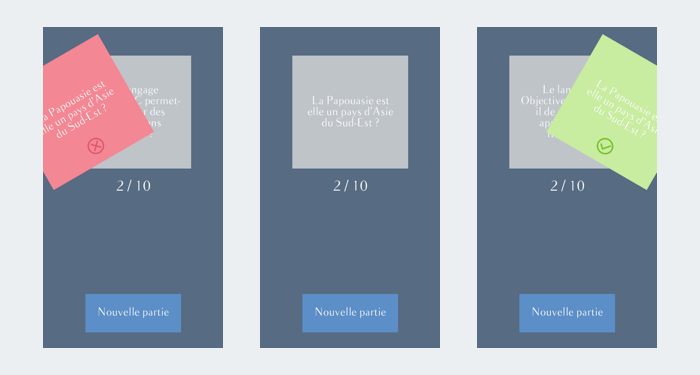
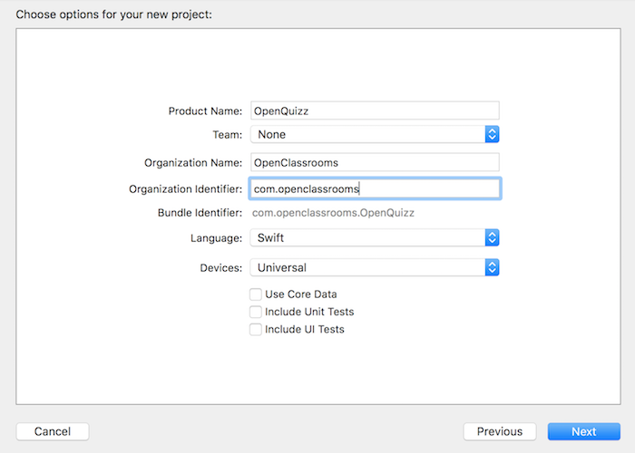

## Préparez votre application

### Tirez le meilleur de ce cours

Bonjour à tous ! Et bienvenue dans ce cours sur la programmation iOS ! Ensemble, nous allons réaliser une application iPhone OpenQuizz ! Je vous promets que ça va être passionnant !

> **:information_source:** Mais avant de rentrer dans le détail, sachez que vous avez besoin de quelques notions avant de vous lancer. Ce cours fais partie de tout un [parcours](https://openclassrooms.com/paths/developpeur-se-dapplication-ios) sur le développement iOS donc je vous invite à suivez les cours dans l'ordre. Oui en général c'est mieux quand on commence par le début... ;)  
- Cours [1](https://openclassrooms.com/courses/introduction-a-ios-plongez-dans-le-developpement-mobile) : Introduction à iOS. *Dans ce cours, vous allez faire votre première application mobile à partir de zéro !*
- Cours [2](https://openclassrooms.com/courses/apprenez-les-fondamentaux-de-swift) et [3](https://openclassrooms.com/courses/approfondissez-swift-avec-la-programmation-orientee-objet) : Swift. *Avec ces deux cours, vous saurez tout du langage Swift !*

Vous êtes prêts ? Alors allons-y !

#### OpenQuizz

Dans ce cours, nous allons donc réaliser l'application OpenQuizz. Et sans plus de suspens, laissez moi vous la montrer :

Dans l'application OpenQuizz, le joueur va pouvoir faire des parties de 10 questions. Il peut répondre par vrai ou par faux à chaque question en faisant glisser la question vers la droite ou vers la gauche. Il marque un point à chaque bonne réponse. Au bout de 10 questions, la partie s'arrête et le joueur peut lancer une nouvelle partie.

Sous son apparence simple, cette application va nous poser quelques challenges et nous allons donc voir comment gérer des images, interpréter les gestes de l'utilisateur, créer des animations et beaucoup d'autres choses !

#### Notre objectif : le modèle MVC
Lorsqu'on se lance dans de grands et beaux projets, il faut savoir où l'on va ! Comme c'est notre cas, prenons une minute pour comprendre l'objectif de ce cours !

Nous allons voir bien des choses dans ce cours comme je viens de vous l'annoncer ! Mais **le plus important, c'est le modèle MVC** ! Le modèle MVC, c'est la façon dont nous allons organiser notre programme. Cela vous paraît peut-être annexe mais vous verrez que même pour une application apparemment simple, on peut vite se faire déborder par la quantité de fichiers et de lignes de code du projet.

Heureusement, il existe une solution simple pour que le développement reste un plaisir jusqu'au bout et que vous ne vous perdiez pas dans votre projet. Et la solution, c'est d'appliquer avec rigueur le modèle MVC. Et je vous explique ça dès la fin de cette partie.

Pour insister sur ce point, voici un petit schéma qui parle de lui-même :

#### Approche

Tout le cours s'appuie sur la création de l'application OpenQuizz donc si vous ne faîtes pas l'application en même temps que moi, vous allez perdre une grande partie de l'intérêt du cours et vous apprendrez beaucoup moins vite !

Je vous invite donc fortement à **faire les choses en même temps que moi sur votre ordinateur** ! C'est la raison pour laquelle vous avez une **activité à la fin du cours dans laquelle vous allez devoir envoyer le code de votre application**. Cette activité est obligatoire pour obtenir le certificat du cours.

#### Création du projet Xcode
Alors sans plus attendre, créons ensemble le projet Xcode de notre application !

> **:information_source:** La création d'un projet Xcode est déjà détaillée complètement dans [ce cours](https://openclassrooms.com/courses/introduction-a-ios-plongez-dans-le-developpement-mobile/creez-votre-projet). C'est la raison pour laquelle je ne fais ici qu'un bref rappel.

1/ Ouvrez Xcode et choisissez *Create a new Xcode Project*

2/ Remplissez les **options** de votre projet :

> **:information_source:** Pour le nom de l'organisation, vous pouvez choisir votre nom et pour l'*organization identifier*, vous pouvez adopter la convention suivante `fr.nomprenom`.  
Soyez certains de bien choisir le langage Swift et de choisir *Universal* car on va adapter notre application à toutes les tailles d'écrans.

3/ Choisissez **Single View Application** pour créer une application d'une seule page.

4/ Choisissez l'emplacement où vous souhaitez sauvegarder votre projet.

Ensuite, vous arrivez sur l'interface d'Xcode, ça y est votre projet est créé !

Nous allons pouvoir maintenant travailler à partir de ce projet. Et ce, dès le prochain chapitre dans lequel nous allons apprendre à **gérer les images** dans un projet d'application iPhone !

### Gérez les images
Section 1 : Téléchargement du dossier d’images
Section 2 : Stockage de l’icône d’application => A quoi correspond chaque taille demandé + explication de la nomenclature @2x / @3x
Section 3 : Stockage des images

### Gérez les polices
Section 1 : Installez la police
Section 2 : Plist file
Section 3 : Trouvez le nom de la police

### Créez votre page de chargement
Section 1 : Présentation du fichier de la page de chargement et rappel de ce qu’est interface builder
Section 2 : Palette de couleur
Section 3 : Construction de la page de chargement

### Découvrez le modèle MVC
Section 1 : Le MVC c’est un design pattern
Section 2 : Le MVC, c’est Modèle Vue Contrôleur
Section 3 : Implémenter le MVC dans notre projet
Section 4 : Annonce du plan :
Partie 2 : Modèle
Partie 3 et 4 : Vue
Partie 5 : Contrôleur
