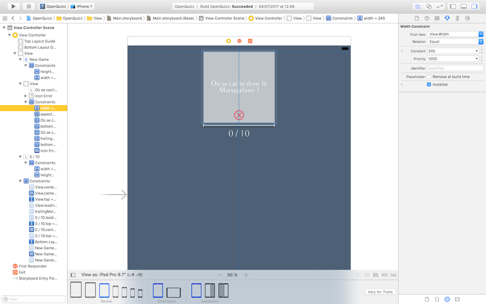
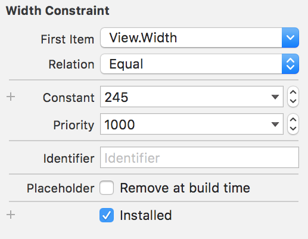
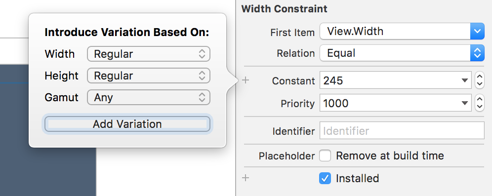
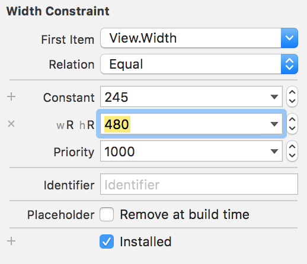
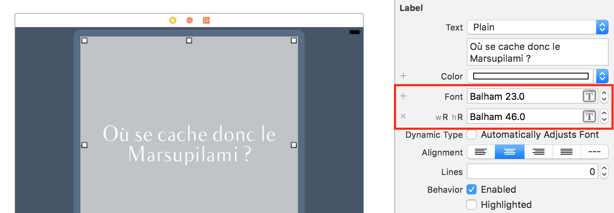

### Adaptez l’interface avec AutoLayout
Nous commençons à avoir une belle interface ! Mais pas toujours...

> **:question:** Comment ça ?

Et bien, notre interface n'est belle pour l'instant que sur un iPhone 7 (ou 6). Sur les autres tailles d'iPhone, l'interface ne s'adapte pas. Vous ne me croyez pas ? Laissez moi vous montrer.

#### Le mode aperçu
Ouvrez le storyboard. Et cliquez en haut pour vous placez en mode assistant (en utilisant le bouton ci-dessous).  
  
Le mode assistant permet d'afficher deux fichiers l'un à côté de l'autre. Sur la gauche, vous avez le storyboard et sur la droite le fichier `ViewController.swift`.

A la place du *ViewController*, nous allons afficher le mode aperçu. Pour cela cliquez en haut sur *Automatic* puis glissez en bas dans la liste déroulante jusqu'à *Preview* et choisissez `Main.storyboard (Preview)`.

Le mode aperçu permet de visualiser votre interface sur plusieurs appareils différents. Pour cela, cliquer sur le `+` en bas à gauche de la section aperçu et rajoutez autant d'appareils que vous le souhaitez. J'ai de mon côté décidé de rajouter toutes les tailles possibles d'iPhone et cela donne :

On constate avec le mode aperçu que notre interface ne s'affiche correctement que sur l'iPhone 7. Sur les plus petits iPhone le bouton est trop bas et donc n'est même plus visible à l'écran et de manière générale le contenu n'est plus centré. Et encore, nous n'avons même pas essayé de regarder ce que cela donne sur un iPad ou si on tourne l'écran de l'iPhone en mode paysage.

Dans ce chapitre, nous allons faire en sorte que notre application s'affiche correctement pour **toutes les tailles d'iPhone en mode portrait**. Nous verrons l'affichage en mode paysage et l'iPad dans le chapitre suivant.

#### Découvrir AutoLayout
Pour adapter notre interface, nous allons découvrir ensemble **AutoLayout**. AutoLayout permet de créer des **contraintes** qui définissent des **relations** entre deux vues.

> **:question:** Contraintes ? Relations ? Tu peux être moins vague ? :D

Prenons notre bouton par exemple, on souhaite qu'il reste en bas quelque soit la taille de l'écran. Pour cela nous allons créer une contrainte qui va dire à notre storyboard : "*garde toujours une distance de 20 points entre le bas de l'écran et le bas du bouton*".

Cela permet de **positionner verticalement** notre bouton (sur l'axe des y). Cette contrainte définit une relation de distance entre deux vues : le bouton et l'écran.

> **:information_source:** Quand je dis l'écran, c'est en fait inexact. Il s'agit plutôt de la vue principale du contrôleur, c'est à dire la vue bleue foncée au fond. Cette vue prends par défaut automatiquement la taille de l'écran. C'est pour l'instant la seule qui s'adapte selon la taille de l'écran et c'est du coup par rapport à cette vue que nous allons toujours nous positionner.

On veut également que notre bouton soit centré. Donc on va définir une contrainte qui dit : "*le bouton doit rester centré horizontalement par rapport à la vue principale*". Cela permet de **positionner horizontalement** notre bouton.

Pour assurer que notre vue garde toujours la taille que l'on souhaite, nous allons définir deux contraintes supplémentaires : "*le bouton doit toujours avoir une largeur de 200 points et une hauteur de 80 points*".

Avec toutes ces contraintes, notre bouton va garder la taille et la position que l'on souhaite quelque soit la taille de l'écran. Comme on l'a vu dans le chapitre sur le placement des vues, il faut 4 informations pour placer avec certitude une vue : x, y, width, height. De la même façon, avec AutoLayout, **on va avoir besoin de 4 contraintes pour placer avec précision nos vues**.

#### Utiliser AutoLayout

##### Le bouton
Alors comment fait-on pour définir toutes ces contraintes ? On va faire cela dans le storyboard en commençant par le bouton. Cliquez sur ce dernier. Ensuite nous allons nous intéresser aux 4 boutons en bas à droite dans le storyboard. Ce sont eux qui permettent de gérer l'adaptation de l'interface aux différentes tailles d'écran.

Celui qui nous intéresse en premier, c'est le quatrième (en forme de TIE Fighter pour les fans de Star Wars ;)). Cliquez dessus :

La popup qui s'affiche nous permet de définir des contraintes. En haut, vous avez 4 contraintes possibles qui correspondent à **la distance au plus proche voisin** dans les 4 directions possibles (haut, bas, gauche, droite).

> **:question:** Le plus proche voisin ?

Vers le haut par exemple, il y a quatre voisins possibles et vous pouvez les afficher en cliquant sur la petite flèche à droite de la valeur 234 :

Le plus proche voisin en haut, c'est donc le label *0 / 10*. Puis la vue grise qui contient la question. Puis au-dessus, on a le *Top Layout Guide*, enfin il y a tout en en haut, le haut de la vue principale.

> **:information_source:** Dans le storyboard, vous avez ce qu'on appelel les layout guide. Ce ne sont pas des vues mais des repères pour placer vos vues. En particulier, le *Top Layout Guide* est un repère situé juste en dessous de la barre qui permet d'afficher les informations du téléphone comme la batterie, l'heure ou la qualité du signal réseau. Ce repère est donc plus bas que le haut de la vue principale qui se situe tout en haut de l'écran.

Maintenant que la notion de plus proche voisin est claire, rajoutons notre première contrainte. Nous souhaitons que le bouton soit à une distance de 20 points du bas de la vue principale. Pour cela, il suffit de cliquer sur le petit segment rouge du bas dans la popup.

Plus bas, dans la popup, vous trouvez les contraintes *Width* et *Height*. **Par défaut, leur valeurs correspondent à la taille actuelle du bouton**. Vous pouvez les cocher pour ajouter ces contraintes. A la fin votre popup doit ressembler à ceci :

Vous pouvez cliquer sur *Add 3 constraints* pour ajouter les trois contraintes. Les contraintes sont désormais visibles sur le bouton. Mais certaines sont rouges :

Elles sont rouges car la position du bouton est toujours ambigüe. En effet, sa position horizontale (sur l'axe des x) n'est pas encore fixée. Pour cela nous allons utiliser le troisième bouton en bas à droite qui permet de gérer l'alignement. En cliquant sur ce bouton, apparaît la popup suivante :

Cette popup permet d'aligner plusieurs vues entre elles sur leur différents bords ou sur leur centre si vous séléctionner plusieurs vues en même temps. Ici, nous avons séléctionné une seule vue donc nous avons seulement deux options :
- centrer horizontalement dans la vue qui contient le bouton (la vue principale)
- centrer verticalement dans la vue qui contient le bouton (la vue principale)

Ici, on veut centrer horizontalement donc on coche la première case et on clique sur *Add 1 constraint*.

Notre bouton a désormais 4 contraintes qui permettent de déterminer sa position avec certitude, les lignes rouges ont disparues. Si on retourne sur le mode aperçu, on peut voir que notre bouton s'affiche correctement dans tous les cas :

En plus des lignes bleus autour du bouton, vous pouvez vérifier vos contraintes dans le panneau de droite dans l'onglet *Inspecteur de taille* (le 5ème). En bas, vous retrouvez les 4 contraintes que nous avons crées :
- En cliquant sur *Edit*, vous pouvez les modifier.
- En les sélectionnant et en utilisant la touche de suppression de votre Mac, vous pouvez les supprimer.

##### La vue question

Nous allons désormais nous attaquer à la vue grise des questions. Nous allons la garder centrée en haut en conservant sa taille. Vous savez déjà centrer une vue horizontalement, on vient de le voir donc je vous laisse le faire.

Passons à la suite, allons dans les contraintes de positionnement et cette fois-ci, nous allons rajouter une contrainte vers le haut pour que cette vue reste accrochée en haut de l'interface.

En dessous, nous allons fixer sa largeur à 245 avec la propriété width comme pour le bouton. Mais pour plus de flexibilité, nous n'allons pas fixer sa hauteur.

A la place, nous allons utiliser la contrainte en dessous *Aspect Ratio*. Cette contrainte signifie : garde le ratio largeur / hauteur constant. Dans notre cas, on veut que ce ratio soit toujours égal à 1 car on veut que la vue garde toujours une forme carré. Vous pouvez donc cocher cette case. Nous avons donc les contraintes suivantes :

Cliquez sur `Add 3 constraints` pour rajouter les contraintes. Désormais la question reste bien toujours centrée horizontalement et fixée en haut lorsque la taille de l'écran varie.

Pour plus de sécurité, nous allons également fixer le label à l'intérieur ainsi que la petite icône. On souhaite que le label soit toujours à la taille de la vue avec une marge de 8 points. Donc on va utiliser les segments rouges pour accrocher le haut, le bas, la gauche et à la droite à la vue grise.

> **:warning:** On a bien 4 contraintes pour cette vue. Les deux contraintes gauche et droite ensemble permettent de définir la largeur du label. Et les deux contraintes en haut et en bas permettent de définir la hauteur du label.

Pour la petite icône, nous allons la laisser centrée horizontalement en bas de la vue grise en fixant sa taille. C'est la même chose que pour le bouton donc je vous laisse faire.

##### Le label score
Il nous reste maintenant le label qui affiche le score. Nous voulons qu'il reste centrée à une distance fixe de la vue question. Pour cela, nous allons définir une contrainte vers la vue grise en haut, deux contraintes pour fixer la hauteur et la largeur et une contrainte pour centrer horizontalement le label.

Et pour éviter de me répéter, je vais vous montrer une autre façon pratique de créer des contraintes : le **control-drag**. En laissant, la touche control <kbd>ctrl</kbd> enfoncée, vous allez essayer de glisser le label vers la vue grise comme ceci :

Lorsque vous lâchez le clic de la souris, Xcode vous demande quelle genre de contraintes vous souhaitez créer. La contrainte sera créée entre la vue de départ et la vue d'arrivée (ici le label score et la vue grise).  Ici c'est *Vertical Spacing*, à savoir l'espace verticale entre la vue grise et la question.

> **:warning:** **En fonction de la direction du glissement, Xcode vous propose les contraintes les plus pertinentes.** Si vous souhaitez créer une contrainte qui concerne la largeur ou le positionnement horizontal, vous devez faire un glissement horizontal et inversement.

Pour rajouter les autres contraintes, vous pouvez répéter l'opération. Pour la hauteur par exemple, vous pouvez faire **un control-drag depuis le label score vers lui-même** et choisir *Height*. Même chose pour la largeur en choisissant *Width*. Vous pouvez également glisser horizontalement vers la vue principale et choisir *Center Horizontally in Container* pour centrer horizontalement le label.

Avec cette dernière vue, toute notre interface s'adapte désormais parfaitement sur toutes les tailles d'écrans de l'iPhone en mode portrait.

#### Les autres boutons
Nous n'avons vu que 2 boutons parmi les 5 situés en bas à droite de l'interface :

Alors laissez moi vous présenter les autres qui vous seront sans doute utile. Le premier n'est activé que si certaines de vos vues sont à une position qui ne corresponds pas à leur contrainte. Essayez de déplacer le bouton par exemple :

Dans ce cas, des lignes oranges indiquent que le bouton est décalé par rapport à ses contraintes. Vous avez donc deux options :
- soit vous souhaitez **remettre le bouton à la place indiqué par ses contraintes**, dans ce cas, il suffit de cliquer sur le **premier bouton**.
- soit vous souhaitez **modifier la valeur des contraintes** pour que le bouton reste à cette position, dans ce cas vous pouvez utiliser le **dernier bouton** (avec le triangle).

Dans ce deuxième cas, un pop up vous propose plusieurs choix allant de la suppression de toutes les contraintes à la modification de leur valeurs pour respecter la position actuelle du bouton.

Enfin le deuxième bouton permet de placer vos vues dans des *Stack View*. Les stacks view permettent de gérer des piles de vues horizontales ou verticales. Mais nous ne les verrons pas dans ce chapitre.

#### Exercice
Adaptez l’interface de la page de lancement
Correction en screencast

#### En résumé
- Pour adapter une interface à plusieurs tailles d'écran, on utilise AutoLayout. AutoLayout permet de créer des **contraintes** qui définissent des **relations** entre deux vues.
- Pour définir parfaitement la position d'une vue, il faut utiliser au moins 4 contraintes qui permettent de définir la position horizontal et vertical ainsi que la hauteur et la largeur de la vue.
- On peut créer des contraintes en utilisant les boutons en bas à droite du storyboard ou en utilisant le control-drag.
- Les boutons en bas à droite correspondent aux usages suivants :

### Utilisez les catégories de tailles pour une expérience utilisateur optimale  
Grâce à AutoLayout, nous avons réussi à définir des contraintes pour que notre application s'affiche correctement sur toutes les tailles d'iPhone en mode portrait. Mais nous n'avons pas fait tout le travail ! En effet, notre designer a prévu des design bien précis pour le mode paysage de l'iPhone et l'iPad.

Pour aborder sereinement la question de la gestion des tailles d'écran, commençons par faire le tour des tailles que vous allez devoir gérer en iOS.

#### Les tailles d'écran

On parle généralement des tailles d'écran en pouce (noté **''**) et on mesure la diagonale. En iOS, il y a deux grandes familles de tailles :
- les tailles iPhone et iPod
- les tailles iPad

Dans chaque famille il y a 4 tailles différentes, que je vous résume dans le schéma ci-dessous.

Ce schéma résume les 8 tailles existantes dans la famille iOS avec la liste exhaustive de tous les appareils iOS associés. Inutile que vous connaissiez tout cela par coeur. Sachez seulement qu'il y a 4 tailles par famille. Et ces 8 tailles, vous pouvez toutes les visualiser dans le storyboard !

#### Visualiser les tailles dans le storyboard

Pour changer la taille de l'interface dans le storyboard, il faut utiliser le sélecteur de tailles. En bas à gauche du storyboard, vous avez le bouton suivant :

Cliquez dessus pour révéler le sélecteur de taille.

Ici vous pouvez sélectionner la taille à laquelle vous souhaitez afficher les interfaces de votre storyboard. Par défaut, la taille est celle de l'iPhone 7 (*4,7 pouces*) mais vous pouvez modifier ça à votre guise. Je vous invite à jouer un peu avec. Il y a deux réglages possibles :
- la **taille** de l'écran en fonction du modèle d'iPhone ou d'iPad
- l'**orientation** de l'écran en format portrait ou paysage

##### Les trois tailles de l'iPad

> **:question:** Hé mais il n'y a que trois tailles pour l'iPad ?

Bien vu ! La taille de l'iPad Mini (*7,9 pouces*) ne peut pas être visualisée. Pourquoi ? Et bien car cette taille garde les proportions de l'iPad normal (*9,7 pouces*). Donc on peut développer pour l'iPad et iOS s'occupe automatiquement de réduire la taille de l'interface à l'iPad Mini. Pratique !

##### L'adaptation
Si vous choisissez l'un des iPad dans le sélécteur, un troisième réglage est disponible : l'adaptation. En effet sur l'iPad, on peut afficher deux applications l'une à côté de l'autre. Apple appelle cela [Split View](https://support.apple.com/fr-fr/HT207522). Du coup l'application ne prendra plus tout l'écran, il faut donc prévoir la variation de la taille de l'interface dans ce cas. Et c'est avec le réglage *Adaptation* qu'on peut le visualiser.

##### OpenQuizz
Si on met du coup l'iPhone 7 en mode portrait, on se rends compte que le design ne corresponds pas à ce qui a été prévu par notre designer, on ne profite pas de l'espace en largeur offert par cette orientation. Par ailleurs, si on essaye d'afficher le storyboard au format iPad, tout parait trop petit dans cette grande interface.

Pour adapter une interface, vous savez qu'il faut utiliser AutoLayout. Le problème, c'est qu'avec AutoLayout, **les contraintes sont toujours les mêmes**. Par exemple, nous avons définit une contrainte qui dit que le score est toujours en dessous de la question. Mais le design prévu dans l'orientation paysage positionne le score à droite de la question. Il faut donc faire varier nos contraintes. Et pour cela nous allons utiliser les **catégories de tailles** (en anglais *Size Classes*).

#### Les catégories de tailles
Pour pouvoir faire varier nos contraintes, Apple aurait pu nous proposer une variation par taille d'écran. Il y a 8 tailles donc on peut faire une variation spécifique de l'interface pour chacune des tailles. Mais 8 variations à faire dans le storyboard, ça fait beaucoup !

A la place, Apple propose les **catégories de tailles**. Comme son nom l'indique, cela permet de travailler sur plusieurs tailles à la fois en les regroupant en catégorie. Pour faire ces regroupements, Apple propose deux paramètres : **largeur** (*width*) et **hauteur** (*height*). Pour chacun de ses deux paramètres, il y a deux valeurs :
- *compact* : lorsque la largeur (ou la hauteur) est petite
- *regular* : lorsque la largeur (ou la hauteur) est grande

Avec ces deux paramètres et ces deux valeurs, Apple a construit la classification suivante :

On peut noter quelques points :
- Tous les iPads sont dans la catégorie (Regular, Regular) quelque soit leur orientation.
- Tous les iPhones sont dans la catégorie (Compact, Regular) en mode portrait.
- Tous les iPhones **SAUF les grands iPhones (6+, 6S+, 7+)** sont dans la catégorie (Compact, Compact) en mode paysage.

Avec ces catégories, nous allons pouvoir modifier notre interface en fonction du type d'appareil (iPhone ou iPad) et de l'orientation (Paysage ou Portrait).

> **:warning:** Lorsque les applications sont en mode Split View sur l'iPad, leur catégorie de taille est susceptible de changer. Je ne vous présente pas ici la classification du mode Split View pour ne pas compliquer les choses mais si vous souhaitez la regarder, [cet article](https://medium.com/@craiggrummitt/size-classes-in-interface-builder-in-xcode-8-74f20a541195) la détaille clairement.

#### Le mode paysage
Notre objectif maintenant est de modifier notre interface uniquement pour le mode paysage sur l'iPhone car on est bien content de ce qu'on a fait dans le chapitre précédent pour le mode portrait. Et Xcode a une fonctionnalité qui permet de faire exactement ça.

Ça se passe dans le sélecteur de taille. Choisissez la taille iPhone 7 (le 3ème plus grand iPhone). Et mettez vous en orientation paysage :

Maintenant sur la droite du sélecteur de taille, nous allons utiliser le bouton *Vary for Traits*. Ce bouton est très puissant ! Il permet de faire des modifications sur notre interface qui ne vont concerner que la catégorie de taille dans laquelle nous nous trouvons. Cela veut dire que je peux modifier toutes les contraintes et même déplacer, ajouter ou supprimer des vues. Cela ne concernera que la catégorie de taille actuelle.

Par exemple, ici on est sur iPhone 7 en mode paysage. Donc si on se réfère à mon schéma plus haut, la catégorie de taille dans laquelle nous nous trouvons est : (Compact, Compact).

Lorsqu'on clique sur le bouton, une popup apparaît qui nous demande sur quelle propriété on souhaite créer une variation : la hauteur, la largeur ou les deux. Si on coche les deux, la variation concernera uniquement les écrans dans la catégorie (Compact, Compact). Si on décoche la largeur, la variation concernera tous les écrans qui ont une hauteur compact quelle que soit leur largeur et inversement.

Pour lorsqu'on coche ou décoche les cases, le sélecteur de taille devient bleu et ne nous montre que les écrans qui correspondent à la variation que nous avons choisis.

Dans notre cas, on souhaite créer une variation qui concerne tous les iPhone en mode portrait. Donc on veut que la hauteur soit compact mais la largeur peut être compact ou regular pour inclure les grands iPhone. On va donc cocher *Height* et laisser décochée *Width*.

A partir de maintenant, on peut tout casser, cela ne concernera que le mode paysage sur iPhone ! Et c'est précisément ce que nous allons faire. Nous allons donc supprimer les contraintes qui ne sont plus pertinentes comme l'alignment au centre et en recrée de nouvelles spécifiques au mode paysage. Comme cette partie du travail ne concerne plus qu'AutoLayout et que nous avons déjà vu ça ensemble, je vous laisse essayer de le faire. Vous pouvez consulter la correction à cette adresse [FAIRE LE SCREENCAST].

Quand vous avez terminé, vous pouvez cliquer sur *Done Varying*.

Vous pouvez ensuite vérifier en changeant l'orientation que tout s'affiche correctement dans les deux modes.

#### Sur iPad

Nous allons maintenant essayer de modifier notre affichage sur l'iPad. Pour cela, nous allons tâcher de respecter les instructions du designer en grossissant les vues pour qu'elles prennent plus de place. Et cette fois-ci, nous allons changer de stratégie. En effet, le design sur iPad n'est pas très différent du design sur iPhone, tout est juste plus gros, donc on va avoir besoin de faire moins de modification.

La première chose qui doit grossir, c'est la question. Pour cela, nous allons créer une variation uniquement sur la contrainte de largeur de cette vue. Commencez par sélectionner la contrainte de largeur en cliquant sur la ligne bleue qui la représente sous la vue grise.

> **:warning:** Il faut avoir tout d'abord sélectionner la vue grise pour que les contraintes qui s'y appliquent apparaîssent.

Sur la droite dans l'inspecteur d'attributs, vous avez accès aux propriétés de cette contrainte. On peut voir notamment la constante qui fixe la largeur à 245.

Pour créer une variation, sur cette contrainte, nous allons cliquer sur le `+`. Une popup apparait :

Nous allons donc choisir de créer une variation pour la catégorie de taille (Regular, Regular). Cela crée une nouvelle ligne qui nous permet de définir une nouvelle constante pour cette taile.

Cela veut dire que pour la catégorie de taille (Regular, Regular), la largeur sera fixée à 480. Et pour toutes les autres, la largeur vaut 245.

> **:information_source:** Il existe de très nombreux paramètres sur lesquels on peut créer des variations, tout ceux qui ont un bouton `+` à leur gauche.

Nous allons pouvoir maintenant modifier la taille de la police de la question. C'est un peu le même principe, nous allons sélectionner le label, puis dans l'inspecteur d'attributs, créer une variation mais cette fois sur la propriété *font* en cliquant sur le `+`.

De la même façon, je vous propose d'essayer d'augmenter la taille du bouton et de la police de son titre ainsi que la taille de la police du label score. Vous pouvez consulter la correction à cette adresse [FAIRE LE SCREENCAST].

#### Exercice
Adaptez l'interface de la page de lancement
Correction en screencast

#### En résumé
- Pour faire des interfaces spécifiques à certaines tailles ou orientations d'écran, on utilise des variations.
