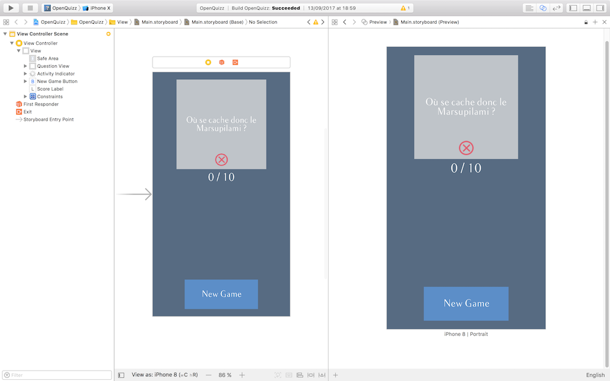
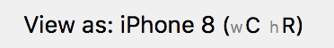
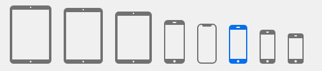
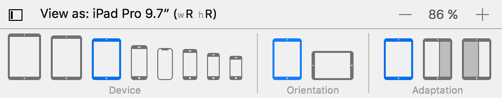

# Créez une application responsive pour l'iPhone et l'iPad

## Découvrez le responsive

### Tirez le meilleur de ce cours

Bienvenue dans ce cours sur la création d'application responsive en iOS ! Nous allons apprendre à adapter une interface à toutes les tailles d'écran existantes en iOS !

#### Prérequis
Dans ce cours, nous allons travailler sur l'application OpenQuizz. Si vous avez suivi le cours précédent, vous connaissez bien cette application pour l'avoir conçu de A à Z !

> **:information_source:** En effet, ce cours fait partie d'un [parcours](https://openclassrooms.com/paths/developpeur-se-dapplication-ios) sur le développement iOS. À moins que vous ayez déjà une bonne connaissance de Swift et du développement en iOS (en particulier de l'interface builder), je vous invite en prendre les cours dans l'ordre suivant :
- Cours [1](https://openclassrooms.com/courses/introduction-a-ios-plongez-dans-le-developpement-mobile) : Introduction à iOS. *Dans ce cours, vous allez faire votre première application mobile à partir de zéro !*
- Cours [2](https://openclassrooms.com/courses/apprenez-les-fondamentaux-de-swift) et [3](https://openclassrooms.com/courses/approfondissez-swift-avec-la-programmation-orientee-objet) : Swift. *Avec ces deux cours, vous saurez tout du langage Swift !*
- Cours [4](https://openclassrooms.com/courses/concevez-une-application-iphone-avec-le-modele-mvc) : Développer une application iPhone avec le modèle MVC. *C'est dans ce cours que l'on crée l'application OpenQuizz.*

Si vous ne connaissez pas l'application, mais que vous avez les compétences nécessaires pour suivre le cours, pas de panique ! Nous allons voir ensemble ce qu'est OpenQuizz pour que vous ne soyez pas perdu.

#### L'application OpenQuizz

L'application OpenQuizz est comme son nom l'indique un **jeu de quizz**.

Dans ce jeu, l'utilisateur peut répondre à 10 questions par vrai ou faux. Pour cela, il peut glisser la question vers la droite ou la gauche pour donner sa réponse.

À chaque bonne réponse, il marque un point ! À la fin des 10 questions, la partie se termine.

Pour relancer une partie l'utilisateur peut cliquer sur `New Game` recharger de nouvelles questions.

#### Inspecter OpenQuizz

Pour suivre ce cours, vous allez donc avoir besoin du projet OpenQuizz. Je vous invite à le télécharger à [cette adresse](https://github.com/AmbroiseCollon/OpenQuizz).

Ouvrez le projet avec Xcode et lancez l'application pour vous familiariser un peu avec.

Une fois que c'est fait, je vous propose de regarder comment est construite l'interface en ouvrant le fichier `Main.storyboard`. Nous allons exclusivement travailler sur ce dossier dans ce cours.

L'interface est composée de 4 éléments :
- Une vue question : la vue grise qui contient deux sous-vues :
	- Un label qui affiche le texte de la question.
	- Une icône qui varie en fonction de la réponse de l'utilisateur.
- Un label qui affiche le score de l'utilisateur
- Un bouton `New Game` pour relancer la partie.
- Un indicateur d'activité positionné derrière le bouton pour notifier l'utilisateur que les questions sont en cours de chargement.

> **:warning:** Dans ce cours, nous allons travailler sur toutes ces vues donc assurez-vous que vous avez bien compris la structure de cette interface.

#### Le problème

> **:question:** Bon on a compris qu'elle était belle ton appli... C'est quoi le problème ?

J'y viens ! **Notre interface n'est belle pour l'instant que sur un iPhone 7 (ou 6). Sur les autres tailles d'iPhone, l'interface ne s'adapte pas.** Vous ne me croyez pas ? Laissez-moi vous montrer.

Ouvrez le storyboard. Et cliquez en haut pour vous placer en mode assistant.

À la place du *ViewController* qui devrait s'afficher sur la gauche par défaut, nous allons afficher le **mode aperçu**. Pour cela cliquez en haut sur *Automatic* puis glissez en bas dans la liste déroulante jusqu'à *Preview* et choisissez `Main.storyboard (Preview)`.

Votre interface devrait ressembler à ceci :

Sur la gauche vous avez le storyboard et sur la droite le mode aperçu. **Le mode aperçu permet de visualiser votre interface sur plusieurs appareils différents.** Pour cela, cliquez sur le `+` en bas à gauche de la section aperçu et rajoutez autant d'appareils que vous le souhaitez.

J'ai de mon côté décidé de rajouter toutes les tailles possibles d'iPhone et cela donne :

Et là c'est flagrant :O ! On constate avec le mode aperçu que **notre interface ne s'affiche correctement que sur l'iPhone 7** :
- sur les plus petits iPhone : le bouton est trop bas et donc n'est même plus visible à l'écran.
- de manière générale : le contenu n'est plus centré.
- sur les iPhone "Plus" : le bouton ne reste pas en bas de l'interface

Et encore, nous n'avons même pas essayé de regarder ce que cela donne sur un iPad ou si on tourne l'écran de l'iPhone en mode paysage !

Dans ce cours, nous allons donc apprendre à adapter notre interface à toutes les tailles d'écran de l'iPhone et iPad et pour les deux orientations paysage et portrait.

> **:x:** Et c'est essentiel, car **Apple n'accepte pas sur l'App Store les applications qui ne sont pas responsive**, car elles n'offrent pas une expérience équivalente aux utilisateurs quel que soit leur appareil.

#### La solution

Pour résoudre notre problème, nous allons commencer dès le prochain chapitre par apprendre quelles sont les différentes tailles d'écran de la famille iOS.

Ensuite dans la partie 2, nous allons adapter notre interface à **tous les iPhone en mode portrait**. Pour cela, nous allons apprendre à créer des contraintes avec **AutoLayout**.

Enfin en partie 3, nous découvrirons comment les **catégories de taille** vont nous permettre d'adapter notre interface à tous les écrans de l'iPhone et de l'iPad en mode paysage et portrait.

### Classez les tailles d'écran des appareils iOS

Pour aborder sereinement la question de la gestion des tailles d'écran, commençons par faire le tour des tailles que vous allez devoir gérer en iOS.

#### Les tailles d'écran

On parle généralement des tailles d'écran en **pouce** (noté `''`) et on **mesure la diagonale**.

En iOS, il y a deux grandes familles de tailles :
- les tailles iPhone et iPod
- les tailles iPad

Dans chaque famille il y a 4 tailles différentes, que je vous résume dans le schéma ci-dessous.

Ce schéma résume les 8 tailles existantes dans la famille iOS avec la liste exhaustive de tous les appareils iOS associés. Inutile que vous connaissiez tout cela par coeur. Sachez seulement qu'il y a 4 tailles par famille. Et ces 8 tailles, vous pouvez toutes les visualiser dans le storyboard !

> **:information_source:** Les noms *iPad Pro Small* et *iPad Pro Big* ne sont pas les noms officiels des produits Apple. Il y a juste deux iPad Pro différents par leurs tailles et il y a eu deux générations de cette gamme.

#### Visualiser les tailles dans le storyboard

Pour changer la taille de l'interface dans le storyboard, il faut utiliser le sélecteur de tailles. En bas à gauche du storyboard, vous avez le bouton suivant :

Cliquez dessus pour révéler le sélecteur de taille.

Ici vous pouvez sélectionner la taille à laquelle vous souhaitez afficher les interfaces de votre storyboard. Par défaut, la taille est celle de l'iPhone 7 (*4,7 pouces*), mais vous pouvez modifier ça à votre guise.

Je vous invite à jouer un peu avec. Il y a trois réglages possibles :
- la **taille**
- l'**orientation**
- l'**adaptation**

##### La taille

La taille de l'écran permet de choisir tou simplement la taille d'écran que l'on souhaite visualiser.

> **:question:** Il y a bien quatre tailles pour l'iPhone, mais il n'y a que trois tailles pour l'iPad ! Ils en ont oublié une ?

Bien vu ! La taille de l'iPad Mini (*7,9 pouces*) ne peut pas être visualisée. Pourquoi ? Et bien, car cette taille garde exactement les proportions de l'iPad normal (*9,7 pouces*). Donc on peut développer pour l'iPad et iOS s'occupe automatiquement de mettre à l'échelle l'interface pour l'iPad Mini. Pratique !

##### L'orientation

On peut décider d'afficher l'orientation paysage ou portrait.

##### L'adaptation
Si vous choisissez l'un des iPad dans le sélecteur, un troisième réglage est disponible : l'adaptation.

En effet sur l'iPad, on peut afficher deux applications l'une à côté de l'autre. Apple appelle cela [Split View](https://support.apple.com/fr-fr/HT207522). Du coup l'application ne prendra plus tout l'écran, il faut donc prévoir la variation de la taille de l'interface dans ce cas. Et c'est avec le réglage *Adaptation* qu'on peut le visualiser.

#### En résumé
- Il a 8 tailles d'écran différentes pour les appareils iOS, 4 pour l'iPad et 4 pour l'iPhone et l'iPod touch
- Comme avec le mode aperçu dans le chapitre précédent, le sélecteur de taille vous permet donc de visualiser ce que donne votre application sur différents appareils directement dans le storyboard. Et vous pouvez voir que dès que l'on quitte l'iPhone 7, ça n'est pas très probant !

Dès le prochain chapitre, nous allons commencer à résoudre ce problème !
