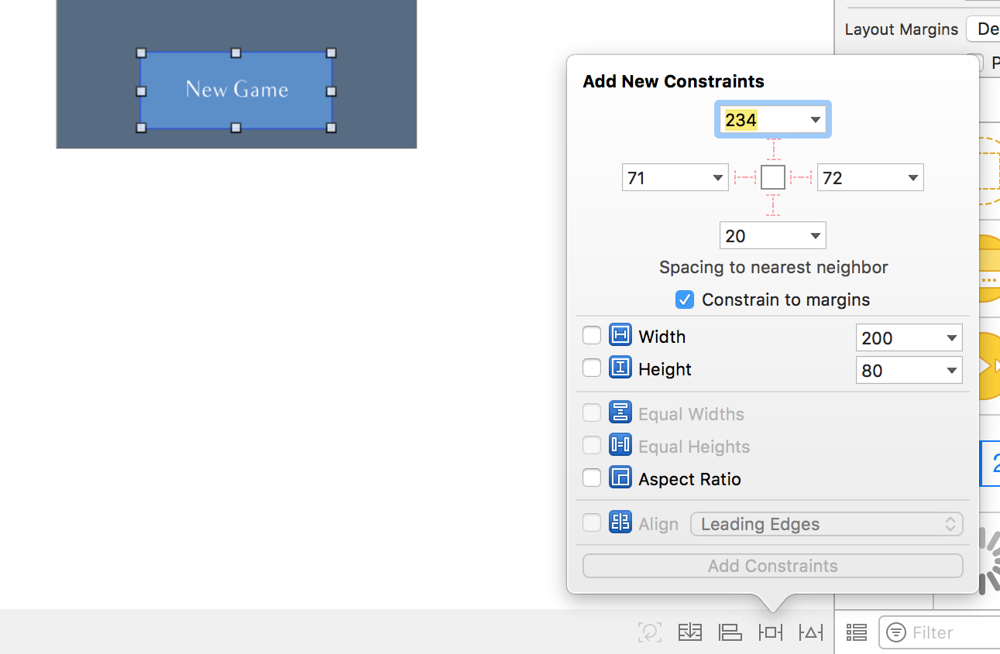
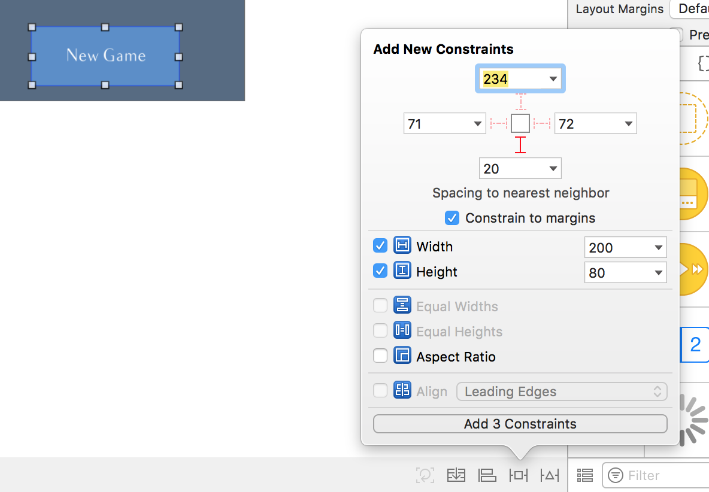
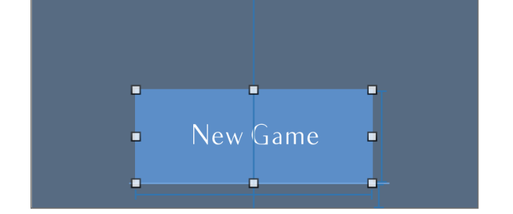

## Placez vos vues avec AutoLayout

### Découvrez AutoLayout
Pour adapter notre interface, nous allons découvrir ensemble **AutoLayout**. Dans cette partie, nous allons nous fixer un objectif simple : que l'interface s'adapte bien à toutes les tailles d'écran d'**iPhone en mode portrait**.

Pour l'instant, dans le mode aperçu, on voit ceci :

Nous allons faire en sorte d'obtenir plutôt ceci à la fin de la partie :

On veut donc que :
- Toutes les vues restent centrées horizontalement.
- Le bouton reste toujours à la même distance du bas de l'écran.
- La vue question reste toujours à la même distance du haut de l'écran.
- Le label score reste toujours à la même distance de la vue question.

#### Qu'est-ce qu'AutoLayout ?

AutoLayout permet de créer des **contraintes** qui définissent des **relations** entre deux vues.

> **:question:** Contraintes ? Relations ? Tu peux être moins vague ? :D

Ok ok... Notre travail va être de donner des informations à AutoLayout, pour qu'il puisse modifier la position et la taille de nos vues en fonction de la taille de l'écran. Ces informations, on appelle cela des **contraintes**.

##### Les contraintes

**Une contrainte, c'est une distance** (en *points*) **qui doit rester constante**. Par exemple, pour le bouton *New Game*, nous allons créer une contrainte qui va dire à AutoLayout : "*garde toujours une distance de 20 points entre le bas de l'écran et le bas du bouton*".

Avec cette information, AutoLayout sait maintenant que, quelle que soit la taille de l'écran (iPhone, iPad, mode portrait ou paysage), le bouton doit **toujours** rester à 20 points du bord bas de l'écran.

##### La vue racine

Il existe une vue pour laquelle nous n'avons pas besoin de faire ce travail, c'est la vue racine.

> **:information_source:** Souvenez-vous, chaque contrôleur a une propriété `view` qui est la vue racine dans notre hiérarchie des vues.

Dans le cas d'OpenQuizz, c'est la vue bleu foncé au fond qui prend tout l'écran. Et justement elle prend tout l'écran grâce à AutoLayout.

En effet **la vue racine a automatiquement 4 contraintes**. Ces 4 contraintes indiquent à AutoLayout que la vue racine doit toujours garder une distance de 0 point avec le bord de l'écran dans les 4 directions (haut, bas, gauche droite).

Donc **la vue racine prend toujours tout l'écran**. Et cela va nous être bien pratique, car on va pouvoir se servir du coup de cette vue comme repère pour définir les contraintes sur les autres vues.

#### Types de contrainte

Pour l'instant, je vous ai dit qu'une contrainte, c'est une distance constante entre deux vues. Pour la plupart des contraintes, c'est vrai et je pense que c'est la meilleure façon de retenir le rôle d'une contrainte.

Mais quelques contraintes échappent à cette définition. En effet, il existe plusieurs types de contraintes pour permettre des placements plus ou moins fins :
- **Distance** entre deux vues : ce qu'on a vu jusqu'à présent.
- **Alignement** entre deux vues : ce type de contrainte permet d'aligner deux vues entre elles par rapport à leur centre vertical ou horizontal, ou sur un de leur côté (haut, bas, gauche ou droite).
- **Taille** d'une vue : ce type de contrainte permet de fixer la largeur ou la hauteur d'une vue ou le rapport entre ces deux valeurs.
- **Égalité des tailles** : ce type de contrainte permet de décider que deux vues doivent garder la même taille, même si celle-ci doit varier.

Nous verrons dans le prochain chapitre comment créer tous ces types de contraintes.

#### Quatre contraintes

Comme vous l'avez appris, une vue c'est un rectangle et pour définir la place qu'il occupe sur un écran, il faut quatre informations :
- **x** (sa position horizontale)
- **y** (sa position verticale)
- **largeur**
- **hauteur**

AutoLayout a besoin de ces 4 informations pour savoir comment placer chaque vue sur toutes les tailles d'écran.

Si on reprend l'exemple de notre bouton, nous avons déjà une contrainte qui nous permet de définir sa **position verticale**.

On veut également que notre bouton soit centré. Donc on va définir une contrainte d'alignement qui indique à AutoLayout : "*le bouton doit rester centré horizontalement par rapport à la vue principale*". Cela permet de **positionner horizontalement** notre bouton.

Pour assurer que notre bouton garde toujours sa taille, nous allons définir deux contraintes supplémentaires : "*le bouton doit toujours avoir une largeur de 200 points et une hauteur de 80 points*". Cela permet de fixer sa **hauteur** et sa **largeur**.

Avec toutes ces contraintes, notre bouton va garder la taille et la position que l'on souhaite, quelle que soit la taille de l'écran.

Pour donner ces quatre informations à AutoLayout (x, y, largeur et hauteur), on remarque que nous avons eu besoin de créer 4 contraintes. **Dans 95% des cas, il vous faudra créer au moins 4 contraintes par vue.** Sinon AutoLayout n'aura pas toutes les informations nécessaires pour placer correctement vos vues sur tous les écrans.

#### AutoLayout vs Frame

On a vu dans le [cours précédent](https://openclassrooms.com/courses/concevez-une-application-iphone-avec-le-modele-mvc/placez-vos-vues) que la propriété `frame` de `UIView` permet de placer les vues par rapport à leur vue parente.

AutoLayout remplit le même rôle, mais avec l'avantage de pouvoir adapter la position et la taille des vues en fonction de l'écran. **Donc dans la grande majorité des cas, vous allez désormais utiliser plutôt AutoLayout pour placer vos vues.**

> **:information_source:** D'ailleurs AutoLayout est prioritaire sur `frame` s'il y a concurrence entre les deux.

#### En résumé
- AutoLayout permet de créer des contraintes qui définissent des relations entre deux vues.
- Une contrainte est le plus souvent une distance entre deux vues qui doit rester constante.
- AutoLayout a toujours besoin de quatre informations pour positionner une vue avec précision, quelle que soit la taille d'écran : position horizontale et verticale, largeur et hauteur.
- Désormais vous utiliserez plutôt AutoLayout que `frame` pour placer vos vues.

Dans le prochain chapitre, nous allons apprendre à créer des contraintes avec AutoLayout.

### Créez vos contraintes

Alors comment fait-on pour définir toutes ces contraintes ? On va faire cela dans le storyboard. Et je vous propose de commencer par le bouton !

Cliquez sur le bouton pour le sélectionner. Ensuite nous allons nous intéresser aux 5 boutons **en bas à droite** dans le storyboard. Ce sont eux qui permettent de gérer les contraints de l'interface aux différentes tailles d'écran.

Celui qui nous intéresse en premier, c'est le quatrième (en forme de TIE Fighter pour les fans de Star Wars ;)). Cliquez dessus :

La popup qui s'affiche nous permet de définir des contraintes. En haut, vous avez 4 contraintes possibles. Ce sont des contraintes de type **distance entre deux vues**. Elles correspondent donc à **la distance au plus proche voisin** dans les 4 directions possibles (haut, bas, gauche, droite).

#### Les voisins

> **:question:** Le plus proche voisin ?

En haut du bouton par exemple, il y a quatre voisins possibles et vous pouvez les afficher en cliquant sur la petite flèche à droite de la valeur 234 :

Le plus proche voisin en haut, c'est donc le label score. Puis la vue grise qui contient la question. Puis au-dessus, on a le *Top Layout Guide*, enfin il y a tout en en haut, le haut de la vue principale.

> **:information_source:** Dans le storyboard, vous avez ce qu'on appelle les layout guide. Ce ne sont pas des vues, mais des repères pour placer vos vues. En particulier, le *Top Layout Guide* est un repère situé juste en dessous de la barre de statut (là où se trouve les informations du téléphone comme la batterie, l'heure ou la qualité du signal réseau). Ce repère est donc légèrement plus bas que le haut de la vue principale qui se situe tout en haut de l'écran.

#### Les trois premières contraintes

Maintenant que la notion de plus proche voisin est claire, rajoutons notre première contrainte. Nous souhaitons que le bouton soit à une distance de 20 points du bas de la vue principale. Pour cela, il suffit de cliquer sur le petit segment rouge du bas dans la popup. En faisant, cela nous créons une contrainte de distance entre le bas du bouton et le bas de la vue principale. Le **positionnement vertical** est prêt à être fixé.

Avant de cliquer sur *Add 1 Constraint*, nous allons rajouter les contraintes de **largeur** et **hauteur**. Plus bas, dans la popup, vous trouvez les contraintes *Width* et *Height*. **Par défaut, leurs valeurs correspondent à la taille actuelle du bouton**. Vous pouvez les cocher pour ajouter ces contraintes. À la fin votre popup doit ressembler à ceci :

Vous pouvez cliquer sur *Add 3 constraints* pour ajouter les trois contraintes. Les contraintes sont désormais visibles autour du bouton.

#### La dernière contrainte

Mais un warning (erreur jaune) apparaît dans Xcode ainsi que des lignes rouges autour du bouton :

Elles sont rouges, car la position du bouton est toujours ambigüe. **En effet, sa position horizontale (sur l'axe des x) n'est pas encore fixée**. Et comme nous l'avons vu dans le chapitre précédent, AutoLayout exige les 4 informations (x, y, largeur et hauteur) pour fonctionner correctement.

Pour ajouter notre dernière contrainte, nous allons utiliser le **troisième bouton en bas à droite** qui permet de gérer l'alignement. En cliquant sur ce bouton, apparaît la popup suivante :

Cette popup permet de créer des **contraintes d'alignement entre deux vues**. Ici, comme nous avons sélectionné une seule vue, nous avons seulement deux options :
- centrer horizontalement dans la vue qui contient le bouton (la vue principale)
- centrer verticalement dans la vue qui contient le bouton (la vue principale)

Ici, on veut centrer horizontalement donc on coche la première case et on clique sur *Add 1 constraint*.

Notre bouton a désormais 4 contraintes qui permettent de déterminer sa position avec certitude, les lignes rouges ont disparu. Si on retourne sur le mode aperçu, on peut voir que notre bouton s'affiche correctement dans tous les cas :

#### Les autres vues

Il faut maintenant rajouter les contraintes pour toutes les autres vues. Comme cela reprend ce que je viens de vous montrer et qu'une vidéo vaut bien mieux qu'un long texte pour ce sujet, je vous propose de consulter gratuitement [cette vidéo](INSERT LINK).

> **:warning:** J'y glisse plusieurs astuces sur lesquelles je ne reviendrais pas autrement donc prenez le temps de bien la regarder.

#### Exercice
Adaptez l’interface de la page de lancement
Correction en screencast

Dans le prochain chapitre, nous allons voir comment inspecter et modifier vos contraintes.

### Manipulez les contraintes

Parfois vous allez vouloir modifier les contraintes que vous avez créées ou simplement les inspecter pour faire le point sur ce qui va ou ne va pas. Voyons ensemble dans ce chapitre comment y parvenir.

#### Inspecter les contraintes

##### Les lignes bleues
Lorsque vous sélectionnez une vue à laquelle vous avez ajouté des contraintes, vous voyez des lignes bleues apparaître autour.

Vous pouvez ensuite cliquer sur une de ces lignes et vous rendre dans l'inspecteur d'attribut. Vous y retrouverez les différents attributs de la contrainte. Ci-dessous vous retrouvez la contrainte de distance entre le bas de l'écran et le bas du bouton.

En particulier, vous avez :
- Les deux vues concernées par la contrainte (`First Item` et `Second Item`)
- La relation entre les deux, le plus souvent ce sera `Egal` mais parfois pour des interfaces plus complexes, vous pourriez avoir besoin `Supérieur ou égal` ou `Inférieur ou égal`.
- La constante, c'est la distance souhaitée ici : 20 points.
- Enfin le paramètre `Priority` vous permet de définir des constantes prioritaires les unes sur les autres. Plus la valeur est élevée, plus la priorité est grande. Même chose, cela pourra vous être utile dans des interfaces complexes.

##### L'inspecteur de taille
En plus des lignes bleues autour du bouton, vous pouvez vérifier vos contraintes dans le panneau de droite dans l'onglet *Inspecteur de taille* (le 5ème).

En bas, vous retrouvez les 4 contraintes que nous avons créées :
- En cliquant sur *Edit*, vous pouvez les modifier.
- En les sélectionnant et en utilisant la touche de suppression de votre clavier, vous pouvez les supprimer.

#### Les autres boutons
Nous n'avons vu que 2 boutons parmi les 5 situés en bas à droite de l'interface :

Alors, laissez-moi vous présenter les autres qui vous seront sans doute utiles.

##### Mettre à jour les vues et les contraintes
Le premier n'est activé que si certaines de vos vues sont à une position qui ne correspond pas à leur contrainte. Essayez de déplacer le bouton par exemple :

Dans ce cas, des lignes orange indiquent que le bouton est décalé par rapport à ses contraintes. Vous avez donc deux options :
- soit vous souhaitez **remettre le bouton à la place indiquée par ses contraintes**, dans ce cas, il suffit de cliquer sur le **premier bouton** (la flèche circulaire).
- soit vous souhaitez **modifier la valeur des contraintes** pour que le bouton reste à cette position, dans ce cas vous pouvez utiliser le **dernier bouton** (avec le triangle).

Dans ce deuxième cas, une popup vous propose plusieurs choix allant de la suppression de toutes les contraintes à la modification de leurs valeurs pour respecter la position actuelle du bouton.

##### Les stack view
Enfin le deuxième bouton permet de placer vos vues dans des *Stack View*. Les stack view permettent de gérer des piles de vues horizontales ou verticales. Mais nous ne les verrons pas dans ce cours.

#### En résumé
- Vous pouvez inspecter une contrainte avec les lignes bleues ou en utilisant l'inspecteur de taille.
- Les boutons en bas à droite correspondent aux usages suivants :

Dans la prochaine partie, nous allons adapter notre interface sur tous les écrans avec les catégories de taille.
