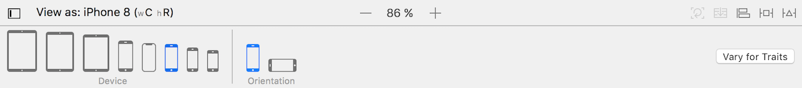

## Adaptez votre interface avec les catégories de taille

### Découvrez les catégories de tailles
Grâce à AutoLayout, nous avons réussi à définir des contraintes pour que notre application s'affiche correctement sur toutes les tailles d'iPhone en mode portrait. Et le résultat est superbe ! Bravo !

Mais nous n'avons pas fait tout le travail ! En effet, notre designer a prévu des design bien précis, notamment **pour le mode paysage de l'iPhone et pour l'iPad**.

Et dans cette partie, nous allons utiliser les catégories de taille pour respecter ce design.

#### Les limites d'AutoLayout
Si on met l'iPhone 7 en mode portrait, on se rends compte que le design ne corresponds pas à ce qui a été prévu par notre designer. Tout est compressé, on ne voit même plus le label score et on ne profite pas de l'espace en largeur offert par cette orientation.

De la même manière, si on essaye d'afficher notre interface xau format iPad, tout parait trop petit dans cette grande interface.

Pour adapter une interface, vous savez qu'il faut utiliser AutoLayout. Le problème, c'est qu'avec AutoLayout, **les contraintes sont toujours les mêmes**. Par exemple, nous avons définit une contrainte qui dit que le score est toujours en dessous de la question. Mais le design prévu dans l'orientation paysage positionne le score à droite de la question. Il faut donc pouvoir faire varier nos contraintes.

#### Les catégories de tailles

##### Qu'est-ce qu'une catégorie ?
Pour pouvoir faire varier nos contraintes, Apple aurait pu nous proposer une variation par taille d'écran. Il y a 8 tailles et 2 deux orientations donc on peut faire une variation spécifique de l'interface à chaque fois. Mais 16 variations à faire dans le storyboard, ça fait beaucoup ! :O

A la place, Apple propose **4 catégories de tailles** (en anglais *Size Classes*). Comme son nom l'indique, cela permet de travailler sur plusieurs tailles à la fois en les regroupant en catégorie.

Pour chaque catégorie, nous pouvons créer une interface complètement différente : changer la taille d'un composant modifier les contraintes, changer une couleur et même ajouter ou supprimer une vue ! **Les catégories peuvent être complètement indépendantes les unes des autres**. C'est cela qui va nous permettre d'avoir une disposition différente de nos vues entre le mode paysage et le mode portrait de l'iPhone par exemple.

##### Classification

Pour faire ces catégories, Apple propose deux paramètres : **largeur** (*width*) et **hauteur** (*height*). Pour chacun de ses deux paramètres, il y a deux valeurs :
- *compact* : lorsque la largeur (ou la hauteur) est petite
- *regular* : lorsque la largeur (ou la hauteur) est grande

Avec ces deux paramètres et ces deux valeurs, Apple a construit la classification suivante :

On peut noter quelques points :
- Tous les iPads sont dans la catégorie (Regular, Regular) quelque soit leur orientation.
- Tous les iPhones sont dans la catégorie (Compact, Regular) en mode portrait.
- Tous les iPhones **SAUF les grands iPhones (6+, 6S+, 7+)** sont dans la catégorie (Compact, Compact) en mode paysage.

Avec ces catégories, nous allons pouvoir modifier notre interface en fonction du type d'appareil (iPhone ou iPad) et de l'orientation (Paysage ou Portrait).

> **:warning:** Lorsque les applications sont en mode Split View sur l'iPad, leur catégorie de taille est susceptible de changer. Je ne vous présente pas ici la classification du mode Split View pour ne pas compliquer les choses mais si vous souhaitez la regarder, [cet article](https://medium.com/@craiggrummitt/size-classes-in-interface-builder-in-xcode-8-74f20a541195) la détaille clairement.

#### En résumé
- Les catégories de taille permettent de créer des interfaces différentes pour chaque catégorie.
- Il y a 4 catégories différentes organisées avec deux paramètres **largeur** et **hauteur** qui ont chacun deux valeurs **compact** ou **regular**.

Dans le chapitre suivant, nous allons voir comment les utiliser dans le storyboard pour adapter notre interface au mode paysage.

### Créez une variation en mode paysage
Nous allons maintenant essayer de modifier notre interface pour le **mode paysage**. A la fin de ce chapitre, notre interface sera belle quelle que soit l'orientation de l'iPhone !

#### Orientations supportées
Avant de nous lancer, je me permet une toute petite parenthèse sur le support des différentes orientations. En tant que développeur, vous pouvez décider que votre application restera toujours en mode portrait, ou toujours en mode paysage ou de supporter les deux comme OpenQuizz.

> **:information_source:** Vous pouvez décider de cela à la création du projet Xcode mais bien sûr ce n'est pas gravé dans le marbre et vous avez le droit de changer d'avis !

Il suffit d'aller dans les paramètres du projet en séléctionnant votre projet dans le navigateur.

Sur cette interface, vous pouvez cocher les orientations supportées par votre application.

- Les deux premières cases concernent le mode portrait avec l'iPhone à l'endroit ou à l'envers.
- Les deux dernières concen le mode paysage avec l'iPhone couché en mode paysage vers la droite ou vers la gauche.

Donc si vous décocher par exemple les deux dernières, votre interface ne tournera pas si l'utilisateur couche son iPhone en mode paysage.

#### Créer une variation

Retournez maintenant dans le storyboard, nous allons créer notre première variation en utilisant les catégories de taille. Pour cela, il faut retourner en bas dans le sélecteur de taille.

Ensuite, nous allons utiliser le bouton *Vary for Traits* qui se trouve sur la droite.

> **:warning:** Attention, ce bouton est très puissant ! :D

**Il permet de faire des modifications sur notre interface qui ne vont concerner que la catégorie de taille dans laquelle nous nous trouvons**. Cela veut dire que je peux modifier toutes les contraintes et même déplacer, ajouter ou supprimer des vues et cela ne concernera que la catégorie de taille actuelle.

Par exemple, plaçons nous sur iPhone 7 en mode paysage. Si on se réfère au schéma du chapitre précédent, la catégorie de taille dans laquelle nous nous trouvons est : `(Compact, Compact)`.

Lorsqu'on clique sur le bouton, une popup apparaît qui nous demande sur quelle propriété on souhaite créer une variation : la hauteur, la largeur ou les deux.

Si on coche les deux, la variation concernera uniquement les écrans dans la catégorie séléctionnée : `(Compact, Compact)`. Si on décoche la largeur par exemple, la variation concernera tous les écrans qui ont une **hauteur compact quelle que soit leur largeur**.

> **:information_source:** Lorsqu'on coche ou décoche les cases, le sélecteur de taille devient bleu et ne nous montre que les écrans qui correspondent à la variation que nous avons choisie.  

Dans notre cas, on souhaite créer une variation qui concerne **tous les iPhone en mode paysage**. Donc on veut que la hauteur soit compact mais la largeur peut être compact ou regular pour inclure les grands iPhone. On va donc cocher *Height* et laisser décochée *Width*.

#### Manipuler la variation

A partir de maintenant, on peut tout casser, cela ne concernera que le mode paysage sur iPhone ! Nous allons donc supprimer les contraintes qui ne sont plus pertinentes comme l'alignement au centre et en recréer de nouvelles spécifiques à notre design en mode paysage.

Comme cette partie du travail concerne plus AutoLayout et que nous avons déjà vu ça ensemble, **je vous laisse essayer de le faire**. Vous pouvez consulter la correction à [cette adresse]() [FAIRE LE SCREENCAST]. Je vous invite à la regarder car j'y donne quelques astuces qui vous seront surement utile !

Quand vous avez terminé, vous pouvez cliquer sur *Done Varying* pour terminer la variation.

Vous pouvez ensuite vérifier en changeant l'orientation que tout s'affiche correctement dans les deux modes.

#### En résumé
- On peut sélectionner les orientations supportées dans les paramètres du projet.
- Pour créer une variation, on choisit la catégorie de taille désiré puis on clique sur le bouton *Vary for traits*.
- A partir de là, **tous les changements** que l'on peut faire ne concerneront que la catégorie de taille sélectionnée.
