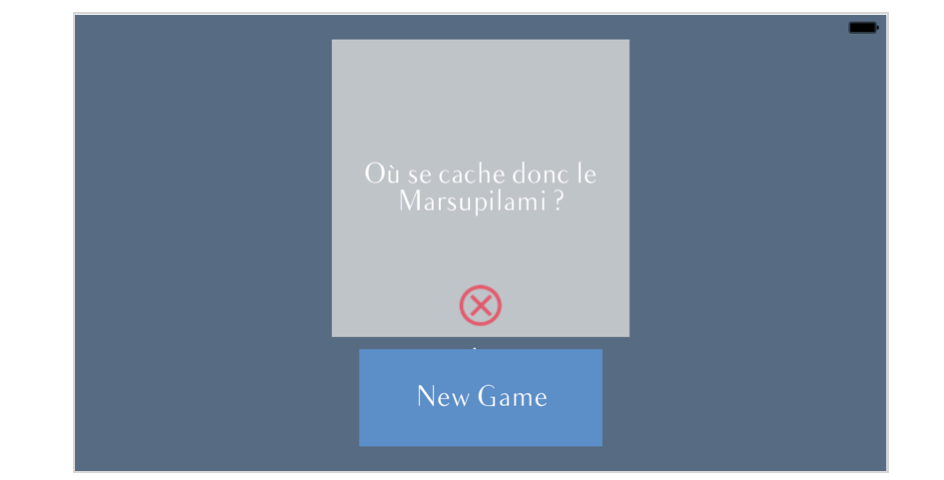
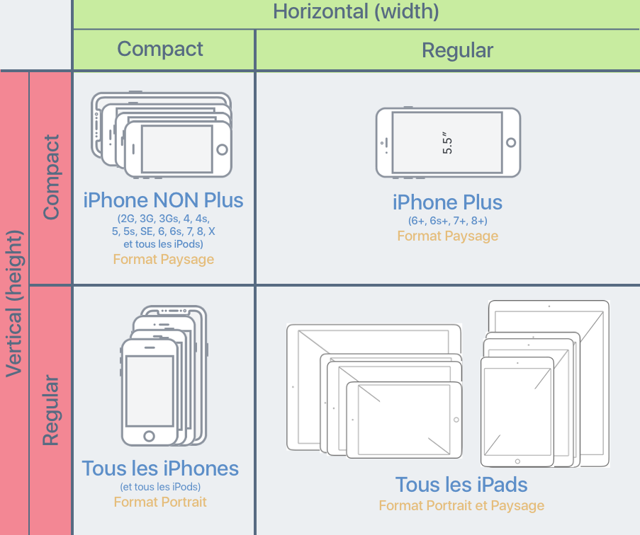
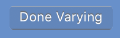
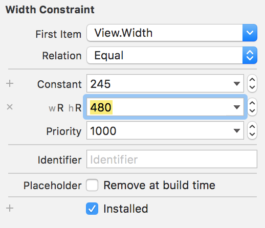

## Adaptez votre interface avec les catégories de taille

### Découvrez les catégories de tailles
Grâce à AutoLayout, nous avons réussi à définir des contraintes pour que notre application s'affiche correctement sur toutes les tailles d'iPhone en mode portrait. Et le résultat est superbe ! Bravo !

Mais nous n'avons pas fait tout le travail ! En effet, notre designer a prévu des design bien précis, notamment **pour le mode paysage de l'iPhone et pour l'iPad**.

Et dans cette partie, nous allons utiliser les catégories de taille pour respecter ce design.

#### Les limites d'AutoLayout
Si on met l'iPhone 7 en mode portrait, on se rend compte que le design ne correspond pas à ce qui a été prévu par notre designer. Tout est compressé, on ne voit même plus le label score et on ne profite pas de l'espace en largeur offert par cette orientation.

De la même manière, si on essaye d'afficher notre interface au format iPad, tout parait trop petit dans cette grande interface.

Pour adapter une interface, vous savez qu'il faut utiliser AutoLayout. Le problème, c'est qu'avec AutoLayout, **les contraintes sont toujours les mêmes**. Par exemple, nous avons défini une contrainte qui dit que le score est toujours en dessous de la question. Mais le design prévu dans l'orientation paysage positionne le score à droite de la question. Il faut donc pouvoir faire varier nos contraintes.

#### Les catégories de tailles

##### Qu'est-ce qu'une catégorie ?
Pour pouvoir faire varier nos contraintes, Apple aurait pu nous proposer une variation par taille d'écran. Il y a 8 tailles et 2 deux orientations donc on peut faire une variation spécifique de l'interface à chaque fois. Mais 16 variations à faire dans le storyboard, ça fait beaucoup ! :O

À la place, Apple propose **4 catégories de tailles** (en anglais *Size Classes*). Comme son nom l'indique, cela permet de travailler sur plusieurs tailles à la fois en les regroupant en catégorie.

Pour chaque catégorie, nous pouvons créer une interface complètement différente : changer la taille d'un composant modifier les contraintes, changer une couleur et même ajouter ou supprimer une vue ! **Les catégories peuvent être complètement indépendantes les unes des autres**. C'est cela qui va nous permettre d'avoir une disposition différente de nos vues entre le mode paysage et le mode portrait de l'iPhone par exemple.

##### Classification

Pour faire ces catégories, Apple propose deux paramètres : **largeur** (*width*) et **hauteur** (*height*). Pour chacun de ses deux paramètres, il y a deux valeurs :
- *compact* : lorsque la largeur (ou la hauteur) est petite
- *regular* : lorsque la largeur (ou la hauteur) est grande

Avec ces deux paramètres et ces deux valeurs, Apple a construit la classification suivante :

On peut noter quelques points :
- Tous les iPad sont dans la catégorie (Regular, Regular), quelque soit leur orientation.
- Tous les iPhone sont dans la catégorie (Compact, Regular) en mode portrait.
- Tous les iPhone **SAUF les grands iPhone (6+, 6S+, 7+)** sont dans la catégorie (Compact, Compact) en mode paysage.

Avec ces catégories, nous allons pouvoir modifier notre interface en fonction du type d'appareil (iPhone ou iPad) et de l'orientation (Paysage ou Portrait).

> **:warning:** Lorsque les applications sont en mode Split View sur l'iPad, leur catégorie de taille est susceptible de changer. Je ne vous présente pas ici la classification du mode Split View pour ne pas compliquer les choses, mais si vous souhaitez la regarder, [cet article](https://medium.com/@craiggrummitt/size-classes-in-interface-builder-in-xcode-8-74f20a541195) la détaille clairement.

#### En résumé
- Les catégories de taille permettent de créer des interfaces différentes pour chaque catégorie.
- Il y a 4 catégories différentes organisées avec deux paramètres **largeur** et **hauteur** qui ont chacun deux valeurs **compact** ou **regular**.

Dans le chapitre suivant, nous allons voir comment les utiliser dans le storyboard pour adapter notre interface au mode paysage.

### Créez une variation en mode paysage
Nous allons maintenant essayer de modifier notre interface pour le **mode paysage**. À la fin de ce chapitre, notre interface sera belle, quelle que soit l'orientation de l'iPhone !

#### Orientations supportées
Avant de nous lancer, je me permets une toute petite parenthèse sur le support des différentes orientations. En tant que développeur, vous pouvez décider que votre application restera toujours en mode portrait, ou toujours en mode paysage ou de supporter les deux comme OpenQuizz.

> **:information_source:** Vous pouvez décider de cela à la création du projet Xcode, mais bien sûr ce n'est pas gravé dans le marbre et vous avez le droit de changer d'avis !

Il suffit d'aller dans les paramètres du projet en sélectionnant votre projet dans le navigateur.

Sur cette interface, vous pouvez cocher les orientations supportées par votre application.

- Les deux premières cases concernent le mode portrait avec l'iPhone à l'endroit ou à l'envers.
- Les deux dernières concernent le mode paysage avec l'iPhone couché en mode paysage vers la droite ou vers la gauche.

Donc si vous décochez par exemple les deux dernières, votre interface ne tournera pas si l'utilisateur couche son iPhone en mode paysage.

#### Créer une variation

Retournez maintenant dans le storyboard, nous allons créer notre première variation en utilisant les catégories de taille. Pour cela, il faut retourner en bas dans le sélecteur de taille.

Ensuite, nous allons utiliser le bouton *Vary for Traits* qui se trouve sur la droite.

> **:warning:** Attention, ce bouton est très puissant ! :D

**Il permet de faire des modifications sur notre interface qui ne vont concerner que la catégorie de taille dans laquelle nous nous trouvons**. Cela veut dire que je peux modifier toutes les contraintes et même déplacer, ajouter ou supprimer des vues et cela ne concernera que la catégorie de taille actuelle.

Par exemple, plaçons-nous sur iPhone 7 en mode paysage. Si on se réfère au schéma du chapitre précédent, la catégorie de taille dans laquelle nous nous trouvons est : `(Compact, Compact)`.

Lorsqu'on clique sur le bouton, une popup apparaît qui nous demande sur quelle propriété on souhaite créer une variation : la hauteur, la largeur ou les deux.

Si on coche les deux, la variation concernera uniquement les écrans dans la catégorie sélectionnée : `(Compact, Compact)`. Si on décoche la largeur par exemple, la variation concernera tous les écrans qui ont une **hauteur compact quelle que soit leur largeur**.

> **:information_source:** Lorsqu'on coche ou décoche les cases, le sélecteur de taille devient bleu et ne nous montre que les écrans qui correspondent à la variation que nous avons choisie.  

Dans notre cas, on souhaite créer une variation qui concerne **tous les iPhone en mode paysage**. Donc on veut que la hauteur soit compact mais la largeur peut être compact ou regular pour inclure les grands iPhone. On va donc cocher *Height* et laisser décochée *Width*.

#### Manipuler la variation

À partir de maintenant, on peut tout casser, cela ne concernera que le mode paysage sur iPhone ! Nous allons donc supprimer les contraintes qui ne sont plus pertinentes comme l'alignement au centre et en recréer de nouvelles spécifiques à notre design en mode paysage.

Comme cette partie du travail concerne plus AutoLayout et que nous avons déjà vu ça ensemble, **je vous laisse essayer de le faire**. Vous pouvez consulter la correction à [cette adresse]() [FAIRE LE SCREENCAST]. Je vous invite à la regarder, car j'y donne quelques astuces qui vous seront surement utiles !

Quand vous avez terminé, vous pouvez cliquer sur *Done Varying* pour terminer la variation.

Vous pouvez ensuite vérifier en changeant l'orientation que tout s'affiche correctement dans les deux modes.

#### En résumé
- On peut sélectionner les orientations supportées dans les paramètres du projet.
- Pour créer une variation, on choisit la catégorie de taille désirée puis on clique sur le bouton *Vary for traits*.
- À partir de là, **tous les changements** que l'on peut faire ne concerneront que la catégorie de taille sélectionnée.

### Variez votre interface pour l’iPad

Nous allons maintenant essayer de modifier notre affichage sur l'**iPad**. Pour cela, nous allons tâcher de respecter les instructions du designer en grossissant les vues pour qu'elles prennent plus de place.

Et cette fois-ci, nous allons changer de stratégie. En effet, le design sur iPad n'est pas très différent du design sur iPhone, tout est juste plus gros, donc on va avoir besoin de faire moins de modifications.

Et on va commencer par grossir la question.

#### Variation sur les attributs

Dans Xcode, certains attributs peuvent varier. Commençons par exemple par faire varier la taille du texte de la question. Sélectionnez le label correspondant et allez dans l'inspecteur d'attributs :

Tous les attributs marqués avec un petit `+` peuvent subir une variation. Et comme vous le constater la police (et donc sa taille) en fait partie.

Cliquez sur le `+` pour créer une variation.

Dans cette popup, on choisit la catégorie de taille pour laquelle on souhaite créer une variation. Dans notre cas, c'est l'iPad donc `(Regular, Regular)`.

> **:information_source:** Le paramètre `Gamut` permets de créer une variation en fonction de la résolution de l'écran. La plupart du temps, cela ne vous intéresse pas donc vous pouvez le laisser à `Any`.

En cliquant sur la variation, la ligne de la police est dupliquée et vous pouvez maintenant changer la taille de la police pour l'iPad. Je vous suggère de doubler sa taille. Vous devriez obtenir ceci :

Cela veut dire que pour la catégorie de taille `(Regular, Regular)`, la police a pour taille 46, et pour toutes les autres, elle vaut 23.

#### Variation sur les contraintes

Évidemment pour le moment, ça ne rend pas très bien, car la vue est trop petite. On va donc modifier cela en agrandissant la taille de notre vue.

> **:warning:** La taille de notre vue est fixée par des contraintes. Donc il nous faut agir sur les contraintes et non sur la taille de la vue directement.

Nous allons donc créer une variation sur la contrainte de largeur de cette vue. Commencez par sélectionner la contrainte de largeur en cliquant sur la ligne bleue qui la représente sous la vue grise.

Sur la droite dans l'inspecteur d'attributs, vous avez accès aux propriétés de cette contrainte comme on l'a vu dans la partie précédente. On peut voir notamment la constante qui a pour valeur 245. Et comme vous pouvez le voir, **la constante est un paramètre qui peut subir une variation**. Pour cela, il suffit de cliquer comme précédemment sur le petit `+`.

Nous allons à nouveau choisir de créer une variation pour la catégorie de taille (Regular, Regular). Et nous allons fixer la constante à 480 pour cette variation.

Et maintenant, notre vue profite de la grande taille de l'iPad !

#### Exercice

##### La suite de l'interface
De la même façon, je vous propose d'essayer d'augmenter :
- la taille du bouton et la police de son titre
- la taille de la police du label score
- la taille de l'icône

Vous pouvez consulter la correction à cette adresse [FAIRE LE SCREENCAST].

##### La page de lancement
Je vous propose un deuxième exercice ! En utilisant une variation, rajoutez la mention "iPad Version" sur la page de lancement de l'application lorsqu'elle est lancée sur un iPad.

Vous pouvez consulter la correction à cette adresse [FAIRE LE SCREENCAST].

#### En résumé
Pour créer des variations en fonction des catégories de taille, vous pouvez utiliser le bouton `Vary for Traits` pour de gros changements ou le petit `+` à côté des attributs pour des changements plus fins.

### Conclusion
Félicitations ! Vous êtes venus à bout de ce cours sur les applications responsive ! Désormais, vous savez adapter l'interface d'une application à toutes les tailles d'écran des appareils iOS et quelle que soit leur orientation !

#### En résumé

Dans ce cours, vous avez appris à adapter une interface responsive. Et pour cela nous avons vu trois éléments fondamentaux :

1. Nous avons fait le tour ensemble des **différentes tailles d'écrans** que vous allez devoir gérer et comment les visualiser dans le storyboard.
2. Nous avons découvert **AutoLayout** et le système de contraintes pour placer nos vues.
3. Nous avons appris à repérer et à utiliser les **catégories de taille** pour créer des variations en fonction de la taille ou de l'orientation de l'écran.

#### Pratiquez !
Si tout n'est pas encore automatique pour vous, pas de soucis. Vous allez avoir besoin d'utiliser les techniques vues dans ce cours dans toutes les applications que vous allez concevoir ! Car on ne vous reprendra plus à faire une application dont l'interface ne s'adapte pas !

Vous verrez que maîtriser le responsive en iOS prends beaucoup de pratique donc à chaque interface que vous dessinez, prenez le réflexe d'utiliser AutoLayout et les catégories de taille et tout cela sera bientôt un jeu d'enfant pour vous !

#### Et maintenant ?

Vous avez maintenant tout ce qu'il faut pour créer des applications responsive d'une seule page ! Mais pour la très grande majorité des apps, vous allez avoir besoin de plusieurs pages. Alors, comment créer plusieurs pages ? Comment organiser la navigation entre elles ? Comment faire passer des informations d'une page à une autre ? Nous verrons tout cela ensemble dans le prochain cours dédié aux applications de plusieurs pages.

En attendant, je n'ai plus qu'à vous laisser avec le mot de la fin et le mot de la fin évidemment, c'est :

