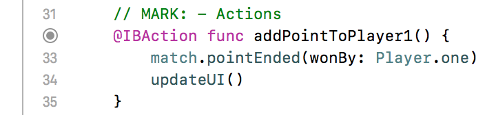
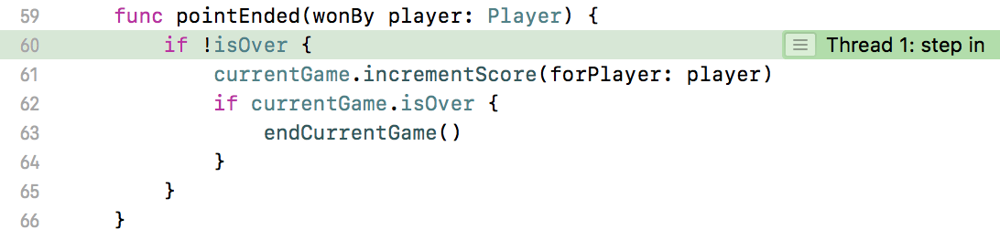

# Débuggez et testez vos applications iOS

## Partez à la chasse aux bugs !

### Tirez le meilleur de ce cours

Bonjour à tous ! Et bienvenue dans ce cours grâce auxquels vos applications vont gagner en robustesse !


#### Présentation du cours
Lorsqu'on débute en programmation, certains imaginent que ce qui fait la qualité d'un développeur, c'est l'étendue de sa connaissance concernant un langage de programmation.

C'est faux. :D

> **:information_source:** A l'heure d'internet, l'accès à la connaissance est immédiat. Vous savez de quoi je parle ;). Si vous avez oublié un aspect d'un langage ou d'une technologie, vous le retrouvez en deux clics ! Donc même si ça aide bien sûr, il n'est pas nécessaire de tout connaître !

Un bon développeur se distingue avant tout par deux qualités :
- son **autonomie**
- la **propreté de son code**

Et on n'acquiert pas ces qualités en deux clics sur internet, mais avec de l'expérience et de la rigueur.

> **:question:** Si seulement il existait un cours pour les gagner...

Inutile de tourner autour du pot, ce cours dont vous rêver, vous y êtes ! En effet, ce cours est entièrement construit autour de ces deux qualités :

1. Dans cette première partie, nous allons apprendre à **dénicher, comprendre et éliminer les bugs**. Ce qui est indispensable pour devenir un développeur *autonome*.
2. Dans la deuxième partie, nous allons apprendre à **créer des tests unitaires**. Ils ont le double avantage de nous assurer que l'application fonctionne et de nous inciter fortement à rédiger un *code tout beau tout propre*.
3. Enfin les tests sont tellement importants que nous allons apprendre en troisième partie à **les rédiger avant le code** en utilisant le Test Driven Development !

#### Prérequis

Ce cours fait partie de tout [un parcours sur le développement d'application iOS](https://openclassrooms.com/paths/developpeur-se-dapplication-ios). Je vous suggère fortement d'y jeter un oeil si vous souhaitez vous former et trouver un emploi en tant que développeur iOS.

> **:warning:** Pour profiter au mieux de ce cours, assurez-vous que vous maîtrisez a minima les compétences présentées dans les cours suivants :
- [Introduction à iOS : plongez dans le développement mobile !](https://openclassrooms.com/courses/introduction-a-ios-plongez-dans-le-developpement-mobile)
- [Apprenez les fondamentaux de Swift](https://openclassrooms.com/courses/apprenez-les-fondamentaux-de-swift)
- [Approfondissez Swift avec la Programmation Orientée Objet](https://openclassrooms.com/courses/approfondissez-swift-avec-la-programmation-orientee-objet)
- [Développez une application iPhone avec le modèle MVC](https://openclassrooms.com/courses/concevez-une-application-iphone-avec-le-modele-mvc)

#### Jeu Set et Match

Pour venir à bout de nos objectifs, nous allons nous appuyer sur une application que j'ai déjà développée pour vous. Cette application s'appelle **Jeu Set & Match**. Les amateurs de Tennis auront déjà compris son utilité, elle permet de **compter les points au Tennis**.


Pour cela, rien de plus simple, il suffit de lui indiquer le joueur qui vient de gagner le dernier point en appuyant sur le bouton correspondant. Et l'application calcule automatiquement le nouveau score. Quand un joueur a gagné la partie, on peut remettre les scores à zéro pour recommencer la partie.

> **:information_source:** Si vous ne connaissez pas les règles du Tennis, voici comment on compte le score :
1. Si un joueur gagne un point, son score augmente, il passe de 0 à 15 puis 30 et enfin 40. Donc pour avoir 40, il faut gagner 3 fois.
2. Si le joueur gagne une quatrième fois, il gagne ce qu'on appelle un **jeu**. Et on démarre un nouveau jeu avec les règles du point précédent.
3. Au bout de six jeux remportés, le joueur remporte ce qu'on appelle un **set**.
4. Au bout de trois sets remportés, le joueur gagne le **match**.
Ce quatrième point peut varier selon les tournois entre 2 et 3 sets gagnés, mais l'application est réglée sur 3 sets.

#### Exercice
Pour que vous puissiez suivre au mieux ce que nous allons faire dans ce cours, je vous ai concocté un exercice pour que vous puissiez concevoir le modèle de l'application Jeu Set & Match.

Je vous encourage vivement à le faire pour que vous ne soyez pas perdus lorsque nous naviguerons dans le code de l'application.

[EXERCICE Codevolve en cours de création]

#### Le projet

Bravo pour l'exercice, il n'était pas évident ! Il ne nous reste plus maintenant qu'à télécharger le projet Xcode complet de l'application Jeu Set & Match.

Vous pourrez le trouver à [cette adresse](https://github.com/AmbroiseCollon/JeuSetMatch). Je vous invite à le télécharger avant de passer au prochain chapitre.

#### En résumé
- Ce cours est essentiel si vous voulez devenir des développeurs **autonomes** qui produisent du **code de qualité** !
- Ce cours est basé sur le projet de l'application Jeu Set & Match qui permet de compter les points au Tennis !

Dans le prochain chapitre, vous allez apprendre comment analyser la pile d'exécution pour déceler les bugs !

### Analysez la pile après un plantage  

Je vous propose maintenant de regarder un peu le projet Xcode de l'application Jeu Set & Match que vous venez de télécharger !

Une fois le projet ouvert, notre premier réflexe est bien sûr de lancer l'application pour la prendre en main et bien comprendre son fonctionnement. Alors, allons-y !

> **:question:**, Mais... Mais... L'application a planté !

[Ah la boulette...](https://www.youtube.com/watch?v=au0ZMqyoWwg) Toutes mes excuses, je pensais pourtant vous avoir concocté un projet tout beau tout propre ! Comme quoi, ça arrive même aux meilleurs ;) !

Bon ne nous démontons pas, on va essayer de comprendre et détecter cette erreur. Pour cela, voyons ce que Xcode nous raconte dans la console :


Ouh là, on dirait qu'Xcode est bavard ! Pas de panique, je vais vous expliquer tout ça !

#### La pile d'exécution

La longue liste que vous affiche Xcode en cas d'erreur, c'est la pile d'exécution (ou *call stack* en anglais).

> **:question:** Quésaco ?

Une pile d'exécution permet de **mémoriser l'enchaînement d'appels des méthodes (ou fonctions) d'un programme**. Pour ce faire, une structure de données de type [*pile*](https://fr.wikipedia.org/wiki/Pile_(informatique)) est utilisée. Ce mécanisme permet de garder une trace des fonctions appelées, afin de pouvoir "revenir sur ses pas" lorsqu'une fonction est terminée.

Prenons un petit exemple pour illustrer cela :
- Imaginez que vous ayez une fonction nommée `getTemperature` qui vous renvoie la température extérieure.
- Cette fonction utilise une autre fonction `getTemperatureFromSensor`, qui permet d'interroger le thermomètre.
- Enfin, la fonction `getTemperatureFromSensor` utilise une dernière fonction nommée `convertFarenheitToCelsius` qui convertit en degrés Celsius une température initialement en degrés Farenheit.

Le code simplifié correspondant serait :

```swift
func  getTemperature() -> Int {
  return getTemperatureFromSensor()
}

func getTemperatureFromSensor() -> Int {
  let farenheitTemperature = sensor.getTemperature()
  return convertDegrees(farenheitTemperature)
}

func convertFarenheitToCelsius(farenheit: Int) -> Int{
  return (farenheit - 32) * 5 / 9;
}
```

Lorsque vous appelez la fonction `getTemperature`, elle est automatiquement ajoutée à la pile. La pile contient donc :

| Pile |
|---|
| getTemperature |

Ensuite, au sein de la fonction `getTemperature`, c'est au tour de la fonction `getTemperatureFromSensor` d'être appelée. Elle est également ajoutée à la pile. La pile contient donc :

| Pile |
|---|
| getTemperatureFromSensor |
| getTemperature |

Enfin, c'est au tour de la fonction `convertFarenheitToCelsius` d'être appelée. Après avoir été ajoutée à la pile, cette dernière contient donc :

| Pile |
|---|
| convertFarenheitToCelsius |
| getTemperatureFromSensor |
| getTemperature |

À la fin de l'exécution d'une fonction, elle est "dépilée", c'est-à-dire qu'elle est retirée de la pile. On revient à la fonction appelante. Par exemple, quand `convertFarenheitToCelsius` a terminé son exécution, elle est retirée de la pile et on retourne a `getTemperatureFromSensor` qui peut reprendre le cours de son exécution.

> **:information_source:** Ainsi la pile se remplit et se vide au fur et à mesure en continu.

#### Analyse de la pile

Regardons maintenant notre pile. Elle contient 48 appels des couches les plus basses de notre programme aux couches les plus élevées. Dans l'analyse, l'objectif est de retrouver les lignes qui correspondent à notre code, le reste ne nous intéresse pas a priori.


Ici, en vert vous pouvez trouver la pile d'appels de fonctions dans le ViewController. La voici en détail :

| Pile |
|---|
| updateAllSetsScore |
| updateUIScore |
| updateUI |
| viewDidLoad |

L'erreur a donc eu lieu alors qu'on était dans la méthode `updateAllSetsScore` de la classe `ViewController`.

> **:question:** OK, mais c'est quoi l'erreur ?

Xcode vous explique cette erreur tout en haut dans la console dès la première ligne :


Cette erreur semble signifier qu'on essaye d'accéder à un élément dans un tableau à l'index 5, mais le plus grand index disponible est 4. Il faut que nous allions investiguer le code pour vérifier tout ça !

#### Compilation VS exécution
Avant de corriger notre erreur dans le prochain chapitre, je voudrais profiter de celle-ci pour vous parler d'une notion importante de programmation.

##### Notion de compilation
Une grande partie des langages de programmation, dont Swift, sont dits **compilés**. C'est-à-dire que le langage est d'abord traduit dans un langage compréhensible facilement par la machine comme l'[assembleur](https://fr.wikipedia.org/wiki/Assembleur) par exemple. On appelle cette étape la **compilation** ou (*compile time* en anglais).

Ensuite, ce code traduit est exécuté et le programme tourne. Dans notre cas, l'application est lancée ! Cette étape, c'est l'**exécution** (ou *run time* en anglais).


> **:question:** OK, mais ça sert à quoi la compilation ?

La compilation permet de générer un code très facile et donc très rapide à lire pour la machine, ce qui permet d'optimiser grandement le programme !

##### Deux types d'erreurs
Puisqu'il y a deux étapes, il y a deux types d'erreurs :

**Les erreurs à la compilation** (*compile time error*)  
- Elles peuvent être détectées par Xcode avant même de lancer le programme, car Xcode compile votre code après chaque modification.
- Ces erreurs peuvent être des erreurs **syntaxiques** ou **sémantiques** : utilisations de mots interdits, code non interprétable, types non respectés, etc.
- Elles sont signalées en rouge dans votre code à la ligne correspondante.

**Les erreurs à l'exécution** (*run time error*)
- Elles ont lieu une fois que l'application est lancée comme c'est le cas pour nous ici.
- Ces erreurs sont en général dues à un problème **logique** dans le programme. Il est forcé d'essayer de faire une action interdite et donc il génère une erreur.
- Elles font planter l'application et s'affichent dans la console.


Dans un [cours précédent](https://openclassrooms.com/courses/introduction-a-ios-plongez-dans-le-developpement-mobile/resolvez-vos-erreurs-et-finissez-lapplication), vous avez appris à gérer les erreurs à la compilation. Dans ce chapitre et dans le suivant, vous allez apprendre à résoudre les erreurs à l'exécution !

#### En résumé
- Une **pile d'exécution** permet de mémoriser l'enchaînement d'appels des méthodes (ou fonctions) d'un programme.
- Lors d'un plantage de votre application, la pile d'exécution et l'erreur sont affichées dans la console. Ces deux informations vous permettent de retracer le problème !
- **Swift est un langage compilé**. Il est d'abord traduit en un code compréhensible facilement par la machine puis ce code est exécuté.
- Il y a donc deux types d'erreurs : à la **compilation** et à l'**exécution**.

Dans le prochain chapitre, nous allons retracer encore plus précisément notre erreur grâce aux points d'arrêts et la résoudre !

### Utilisez le débugger  
Dans ce chapitre, je vous propose de résoudre notre erreur ! Et pour cela, nous allons avoir besoin d'investiguer le code !

Dans le chapitre précédent, l'analyse de la pile d'exécution nous a révélé que l'erreur avait lieu dans la fonction `updateAllSetsScore`. Voici le code de celle-ci :

```swift
private func updateAllSetsScore(forPlayer player: Player) {
	for i in 0..<6 {
			if i < match.sets.count {
					let set = match.sets[i]
					playerSetScoreLabels[player]![i].text = "\(set.scores[player]!)"
			 } else {
					playerSetScoreLabels[player]![i].text = ""
			}
	}
}
```

Hmm... Difficile de trouver l'erreur du premier coup d'oeil dans cette fonction. Pour nous aider, nous allons utiliser un point d'arrêt !

#### Les points d'arrêts

Le principe d'un point d'arrêts (*breakpoint* en anglais) est très simple. Il permet comme son nom l'indique d'**interrompre l'exécution de notre code à la ligne qui nous intéresse**. Nous allons voir dans ce chapitre et dans le suivant que c'est extrêmement pratique pour repérer les problèmes.

> **:information_source:** Dans le prochain chapitre, nous allons apprendre à créer des points d'arrêts manuellement.

Mais pour résoudre notre erreur, nous allons avoir besoin pour l'instant d'un point d'arrêt un peu particulier et très puissant !

#### Le point d'arrêt d'exception

Le point d'arrêt d'exception (ou *exception breakpoint*) permet d'interrompre le code **dès que le programme rencontre une erreur qui va faire planter l'application**.

> **:information_source:** C'est comme si vous bousculiez un vase et qu'on mette pause juste avant que le vase ne chute pour que vous puissiez regarder comment vous l'avez fait tomber, est-ce votre coude votre main ou votre sac qui a causé le drame :O ?

Pour créer ce point d'arrêt, il faut aller dans le navigateur des points d'arrêts. C'est l'avant-dernier onglet du navigateur (panneau de droite) :


Cet onglet est vide pour le moment, car vous n'avez pas encore créé de points d'arrêts. Pour ajouter notre fameux point d'arrêt d'exception, allez tout en bas de l'interface, cliquez sur le `+` et choisissez dans la popup "Exception Breakpoint..." :


> **:warning:** Vous pouvez ignorer la popup qui s'affiche ensuite. Ce sont des réglages avancés dont nous n'avons pas besoin.

Ça y est ! Votre point d'arrêt d'exception est créé et il apparaît dans le navigateur de points d'arrêts :


Pour que vous puissiez admirer la puissance de ce point d'arrêt, vous n'avez plus qu'à relancer votre application et vous allez voir l'exécution s'interrompre juste avant notre erreur.

#### Naviguez dans la pile d'exception

Le point d'arrêt vous conduit directement jusqu'au fichier et même à la ligne qui pose problème :


Nous n'avons même pas besoin d'analyser la pile d'exécution. On est directement conduit au bon endroit.

> **:warning:** C'est tellement pratique que je vous conseille de **toujours avoir un point d'arrêt d'exception dans votre projet**, quelque soit sa taille.

En plus, grâce au point d'arrêt, votre pile d'exécution s'affiche sur la gauche dans le *navigateur de débogage* et vous pouvez naviguer à l'intérieur !


Pour cela, il vous suffit de cliquer sur la ligne de votre choix sur la droite dans la pile d'exécution et vous êtes immédiatement conduit à la ligne de code correspondante.


#### La vue des variables
> **:question:** Bon c'est bien beau de s'amuser, mais on la résout cette erreur ?

Oui... Mais ne soyez pas rabat-joie non plus :D ! La ligne qui semble poser problème est la suivante :

```swift
playerSetScoreLabels[player]![i].text = ""
```

On débarque un peu dans ce code qu'on ne connaît pas donc pour savoir un peu qui est qui, laissez-moi vous présenter la **vue des variables** ! Dans la zone de débogage, vous avez deux panneaux. A droite, c'est la vue des variables et à gauche la console que vous connaissez déjà.


> **:information_source:** Vous pouvez afficher ou masquer l'un de ces panneaux grâce aux petits boutons en bas à droite : 

Cette vue permet de visualiser toutes les variables existantes au point d'arrêts ou nous nous trouvons. En l'occurrence, il y a ici :
- `player` : c'est le paramètre de la fonction. On voit qu'il est de type `Player` et vaux `one`.
- `i` : c'est le compteur de la boucle for qui vaut ici `5`.
- `self` : c'est la classe dans laquelle nous nous trouvons donc ici `ViewController`.

On peut déplier `self` pour inspecter l'état de toutes ses propriétés. Notamment on peut regarder la propriété `playerSetScoreLabels` qui intervient dans la ligne qui pose problème.


On comprend que son type est : `[Player: [UILabel]]` donc un dictionnaire qui a comme clé un joueur et comme valeur un tableau de labels. Mais le reste n'est pas très lisible !

#### Afficher les variables dans la console

Heureusement, nous avons une autre option pour voir nos variables et ça se passe juste à côté, dans la console !

> **:information_source:** Pour l'instant, la console est vide, car on s'est arrêté juste avant que n'intervienne l'erreur donc celle-ci n'est pas affichée dans la console.  

Enfin pas tout à fait vide ! On y voit l'inscription `(lldb)`, c'est un *Low Level Debugger*. C'est un peu comme un terminal, on peut écrire des commandes et l'ordinateur nous répond. On peut lui poser plein de questions pour comprendre l'état de notre application.

> **:warning:** Pour avoir accès au lldb, il faut s'être arrêté à un point d'arrêt.

Nous allons apprendre une seule commande, mais qui est de loin la plus utile, et elle se nomme sobrement `po` pour *Print Object*.

Essayons-la avec notre mystérieuse variable `playerSetScoreLabels`:


La console nous affiche plein de détails sur l'objet et cette fois, c'est assez clair. Il y a deux clés : Player.one et Player.two et chacune contient 5 labels. Si on va un peu plus loin, on peut écrire :


On a bien un tableau qui contient 5 labels.

#### Résoudre l'erreur

Maintenant, résumons-nous et je pense qu'on va pouvoir résoudre notre erreur. L'erreur intervient à la ligne suivante :

```swift
playerSetScoreLabels[player]![i].text = ""
```

On sait que ceci `playerSetScoreLabels[player]!` est un tableau de 5 éléments. On essaye donc d'accéder à son élément à l'index `i`, qui vaut 5. Or le plus grand index d'un tableau de 5 éléments, c'est 4. Donc il n'y a rien à l'index 5 !

Et voilà notre erreur ! Notre boucle va un coup trop loin ! Il nous suffit de réduire l'intervalle d'un cran !

```swift
for i in 0..<6 { // <= ici il faut mettre 5 à la place du 6 !
	// [...]
}
```

Faites la modification, lancez l'application et... ça marche ! Le bug a été éliminé ! Bravo !

> **:information_source:** Cela a pu vous paraître un peu long pour une solution finalement si simple. Mais la solution d'un bug est souvent simple même si la recherche peut être longue ! Et quand vous maîtriserez toutes les techniques que je vous ai présentées, vous irez bien plus vite ! Pensez à les utiliser le plus possible pour qu'elles deviennent des réflexes !

#### En résumé
- Pour identifier la source des erreurs à l'exécution, je vous suggère de créer un **point d'arrêt d'exception** qui vous emmène directement à la ligne qui pose problème !
- Un point d'arrêt permet d'interrompre l'exécution du code et d'inspecter les variables pour identifier un bug.
- Pour inspecter les variables suite à un arrêt, on peut utiliser la **vue des variables**, ou la **commande `po` dans la console**.

Dans le prochain chapitre, nous allons apprendre à positionner des points d'arrêts manuellement pour naviguer dans la pile d'exécution.

### Ajoutez des points d’arrêts manuellement
Dans les chapitres précédents, nous avons résolu notre bug et vous pouvez maintenant jouer un peu avec l'application Jeu Set et Match. Je vous propose de ne pas nous arrêter en si bon chemin et de passer à la suite de ce cours : les tests !

> **:question:** Hop hop hop ! Pas si vite mon garçon !

Comment ça ?! Je vous prie de ne pas m'interrompre en plein lancement d'un sujet aussi important que les tests !

> **:question:** Je suis désolé. Mais l'application bogue toujours...

Ah bon ?!!!

> **:question:** C'est peut-être pas vraiment un bug, mais l'app compte mal les points. Quand un joueur a 30 et qu'il gagne un point, il gagne le jeu, alors qu'il devrait passer à 40... Regarde !


Ah oui en effet. Bon toutes mes excuses, regardons ça !

#### Une erreur métier
Précédemment, nous avons parlé des erreurs à la compilation et des erreurs à l'exécution. Nous rencontrons ici un troisième type d'erreur : une **erreur métier**.

Les erreurs métiers n'empêchent pas le lancement de l'application ni ne la font planter. Mais **l'application se comporte différemment de ce que l'on a prévu**.

> **:warning:** Même si ces erreurs ne font pas planter votre application, il faut bien s'en méfier, car, en général, **vos utilisateurs vont les repérer avant vous** ! Il faudra donc être réactif pour les résoudre.

#### Stratégie de résolution d'une erreur métier

Vous ne connaissez pas bien le code de Jeu Set & Match puisque vous ne l'avez pas entièrement rédigé. Et ici, nous n'avons ni pile d'exécution ni point d'arrêt d'exception pour nous guider vers l'erreur, car elle ne fait pas planter l'application.

Alors, comment trouver notre bug dans cette botte de foin ?

Pas de panique ! Nous allons procéder en trois étapes (*que vous suivrez souvent croyez-moi* ;)) :

1. Reproduire les étapes dans l'application qui conduisent au bug
2. Ajouter un point d'arrêt manuellement
3. Naviguer dans le code pour retrouver le bug

A l'assaut :pirate: !

#### 1. Reproduire les étapes du bug

Pour reproduire les étapes de ce bug, nous allons commencer par lancer l'application. Ensuite, il nous suffit d'appuyer deux fois sur le bouton `JOUEUR 1`. Le score du joueur 1 passe à 30. Lors du prochain appui, le bug devrait avoir lieu.

#### 2. Ajouter un point d'arrêt manuellement

Nous allons maintenant ajouter un point d'arrêt. Cela va nous permettre à l'étape suivante de naviguer dans le code pour voir se jouer notre erreur directement dans le code.

##### Trouver la ligne
Contrairement au chapitre précédent, notre point d'arrêt ne va pas se déclencher immédiatement à la ligne du bug. Il va falloir cette fois le rajouter nous-mêmes à la ligne de notre choix.

> **:question:**, Mais à quelle ligne ?! On ne sait pas où est le bug dans le code !

C'est vrai. Mais on sait quand il a lieu. On sait qu'il va avoir lieu quand je vais taper une troisième fois sur le bouton `JOUEUR 1`. Donc il nous suffit de retrouver l'action liée au bouton dans le code.

Et ça, ce n'est pas trop dur ! On sait qu'une action se trouve dans le contrôleur et qu'elle commence par `@IBaction`. Après une toute petite recherche, vous devriez la trouver :



Quand on va taper sur le bouton, la première ligne de code qui va s'exécuter, c'est la ligne 33. C'est ici que nous allons rajouter un point d'arrêt !

##### Ajouter le point d'arrêt
Et pour cela, rien de plus simple, il nous suffit de cliquer sur le chiffre 33 sur le côté. Et votre point d'arrêt apparaît en bleu :


> **:information_source:** Vous pouvez retrouver tous les points d'arrêts de votre projet dans le navigateur de points d'arrêts.
  
Vous pouvez aussi les effacer en les sélectionnez dans le navigateur et tapant la touche "supprimer" de votre clavier. Ou en faisant un clic droit sur votre point d'arrêt dans le code puis choisissez "Delete Breakpoint" (cf image ci-dessous). Ou en le glissant-déposant en dehors de sa position. 
  
Vous pouvez aussi désactiver un point d'arrêt momentanément en cliquant dessus, il devient grisé :
  


#### 3. Naviguez dans le code pour retrouver le bug

##### Les commandes de navigation
Maintenant que notre point d'arrêt est créé, nous pouvons appuyer une troisième fois sur le bouton `JOUEUR 1` de notre application. Le point d'arrêt se manifeste et nous sommes conduits automatiquement à la ligne 33 du `ViewController`. Le code s'est interrompu à cette ligne.

  

Nous allons maintenant naviguer dans l'exécution du code à partir de ce point d'arrêt. Pour cela, nous allons utiliser les boutons situés en bas, dans la zone de débogage.

  

En particulier, nous allons utiliser les 5 premiers :

1.  En cliquant sur ce bouton, il devient gris et tous les points d'arrêts rencontrés pendant l'exécution sont ignorés.
2.  Ce bouton permet de relancer l'exécution du code après un arrêt. Le code va s'exécuter jusqu'au prochain point d'arrêt ou jusqu'à la fin de la méthode.
3.  Ce bouton permet de passer à la ligne de code suivante.
4.  Ce bouton permet de rentrer dans le détail d'exécution d'une méthode, on descend dans la pile d'exécution.
5.  On remonte dans la pile d'exécution.

> **:warning:** Lorsque l'on navigue dans l'exécution du code, on ne peut qu'avancer. Par exemple, on peut aller à la ligne suivante, mais pas à la ligne précédente. Autrement dit, on ne peut pas défaire ce qui a été fait.

Maintenant que nous connaissons nos commandes, naviguons !

##### On se jette à l'eau !

L'exécution s'est arrêtée à la ligne suivante :

```swift
match.pointEnded(wonBy: Player.one)
```

Qui est `match` ? Quelle est cette méthode `pointEnded` ? Pour le savoir, nous allons descendre dans la pile en utilisant le 4e bouton.

Nous arrivons d'abord sur la propriété `match` :
```swift
var match = Match()
```

`match`, c'est donc notre modèle de type `Match`. Nous allons maintenant remonter la pile avec le 5e bouton, nous revenons à la ligne 33 du point d'arrêt. Nous allons ensuite la redescendre à nouveau avec le 4e bouton. Cette fois nous arrivons à la première ligne de la méthode `pointEnded`.



Cette première ligne vérifie que le match n'est pas terminé. Passons à la ligne suivante avec le 3e bouton.


C'est bon, on est passé à la ligne suivante donc le match n'est pas terminé. On appelle maintenant la méthode `incrementScore` sur le jeu en cours `currentGame`. Voilà qui semble être intéressant, descendons dans la pile à nouveau !

Même chose, on est d'abord conduit à la propriété `currentGame` donc remontons la pile et redescendons-la. Cette fois, on arrive bien dans la méthode `incrementScore` !


Regardons attentivement cette méthode. Si le score est inférieur à 30, on incrémente le score. Sinon le jeu se termine.

> **:question:** Bah voilà !!

Comment ça "bah voilà" ?

> **:question:** ...

Ah mais oui ! Bien vu ! Il est là notre problème, il faut vérifier que le score soit inférieur à 40 et non 30 ! Voilà pourquoi le jeu se terminait toujours avant d'atteindre 40 !

Faites la modification et relancez l'application ! Notre bug est résolu ! Qu'est-ce que vous devenez bon en résolution de bug !

#### En résumé

- Certaines erreurs ne font pas planter l'application, mais causent malgré tout un comportement anormal de l'app. On les appelle les **erreurs métiers**.
- En cliquant sur un numéro de ligne, on peut ajouter un point d'arrêt.
- **À partir d'un point d'arrêt, on peut naviguer dans l'exécution code** pour aller au prochain point d'arrêt, passer à la ligne suivante, monter ou descendre dans la pile d'exécution.

Dans le prochain chapitre, nous allons faire l'étude syntaxique de votre code pour que votre code reste toujours propre.

### Installez SwitLint pour contrôler votre syntaxe  
En introduction de ce cours, je vous ai dit que vous alliez apprendre à être **autonome** et à **rédiger du code propre**. Vous savez maintenant résoudre tous les types de bugs que vous pouvez rencontrer, ce qui vous fait beaucoup gagner en autonomie !

Ici, nous allons commencer à parler de la propreté de votre code, un sujet au moins aussi important !

#### Gare à votre style

En programmation, chacun a son style. On a tous notre propre façon d'écrire du code. Par exemple, les deux codes suivants sont équivalents techniquement, mais très différents pourtant :


> **:warning:** Normalement, il y en a un des deux qui doit vous piquer un peu les yeux...

Cette différence de style (on parle aussi de syntaxe) n'est pas sans conséquence ! Si les deux styles ci-dessus cohabitent dans un même projet, le projet va avancer beaucoup moins vite !

> **:question:** Je ne vois pas pourquoi, tant que le code marche, c'est bon non ?

Hé non ! 80% de l'activité d'un développeur, c'est de lire du code pour dénicher des bugs, analyser un problème ou préparer le code qu'il va produire. Ce n'est pas une activité si aisée pour le cerveau, alors si en plus vous lui imposer de lire des choses qui ne se ressemblent pas du tout, ne comptez pas sur lui pour progresser et aller plus vite !

D'autre part, si vous êtes en équipe et que chacun a son style, cela pose déjà une question sur la cohésion de l'équipe, mais surtout cela finit vite en guerre de style ou chacun essaye d'imposer sa syntaxe sur le code d'autrui et au final tout le monde perd du temps.

**Un code uniforme, c'est donc la base d'un projet sain !**

#### Un guide syntaxique

Pour résoudre ce problème, il faut décider de la syntaxe que l'on va adopter. Et comme cela représente un très gros travail, en général, on choisit un guide syntaxique (ou *style guide*) parmi ceux disponibles sur internet.

En Swift, il en existe deux particulièrement populaires :
- [Ray Wenderlich Swift StyleGuide](https://github.com/raywenderlich/swift-style-guide) : le plus complet et le plus populaire.
- [Github Swift StyleGuide](https://github.com/github/swift-style-guide) : très populaire et utilisé dans SwiftLint dont on parlera dans une minute.

Ces guides détaillent une syntaxe à suivre, qui privilégie la lisibilité du code. Cela va du nombre de lignes à sauter entre chaque méthode, à la façon de nommer les variables en passant par la bonne manière de déballer un optionnel.

> **:warning:** Ce n'est pas une lecture très agréable donc ne lisez pas tout d'un coup. Mais lisez-le quand même, vous apprendrez beaucoup de choses ! Et gardez-le sous la main pour vous y référer régulièrement !

#### Découvrez SwiftLint

Une fois que vous avez choisi et lu un guide, vous n'avez qu'une hâte, c'est d'appliquer toutes les conventions pour que votre code soit magnifique ! Mais vous êtes humains et vous risquez de ne pas tout retenir ou de faire des fautes.

Pour pallier à ce problème, il existe un outil que l'on appelle **lint**.
**Cet outil se base sur les guides syntaxiques et lit votre code pour vérifier automatiquement qu'il est conforme** ! Il saura dénicher le moindre espace de trop ! On dit qu'il fait l'**analyse statique** de votre code.

Le plus connu en Swift s'appelle **SwiftLint**. Vous pouvez le retrouver à [cette adresse](https://github.com/realm/SwiftLint).

#### Installez SwiftLint

Allons-y, installons SwiftLint ! Pour cela, il suffit de suivre les instructions données à [cette adresse](https://github.com/realm/SwiftLint).

##### Installez HomeBrew
Il existe plusieurs façons de l'installer. Je vous propose de choisir la première qui utilise HomeBrew. **HomeBrew est un gestionnaire de paquets pour Mac**. Son rôle est d'installer et mettre à jour des petits programmes comme SwiftLint.

Pour l'installer, il vous suffit d'aller sur le [site de présentation de HomeBrew](https://brew.sh). Les instructions sont très simples, il suffit de copier la commande suivante dans votre terminal :

```console
/usr/bin/ruby -e "$(curl -fsSL https://raw.githubusercontent.com/Homebrew/install/master/install)"
```

> **:warning:** Le script s'exécute tout seul, il s'arrête juste pour vous demander d'appuyer sur la touche entrée et de donner le mot de passe de votre ordinateur.

Et c'est tout, HomeBrew est installé !

##### Installez SwiftLint sur votre Mac

Maintenant, nous pouvons installer SwiftLint. En restant dans le terminal, il vous suffit d'entrer la commande suivante :

```console
brew install swiftlint
```

> **:information_source:** On utilise ici le gestionnaire de paquets HomeBrew pour installer SwiftLint. Vous utiliserez souvent la commande `brew install` en programmation pour installer ce genre de petit outil sur votre Mac.

Et voilà ! SwiftLint est installé sur votre Mac !

> **:information_source:** Vous pouvez mettre à jour un paquet installé avec HomeBrew, comme SwiftLint, en écrivant la commande `brew upgrade swiftlint`.

##### Ajoutez SwiftLint dans votre projet

Il ne nous reste plus qu'une petite étape, rajouter SwiftLint dans notre projet d'application. Ainsi, SwiftLint va pouvoir lire le code contenu dans notre projet pour y signaler des irrégularités de style.

Vous vous souvenez, il y a deux étapes en Swift : la compilation et l'exécution. C'est à l'étape de compilation que le code est interprété et traduit dans un autre code exécutable par la machine.

Notre objectif ici va être de **rajouter une séquence à la compilation : l'analyse statique de SwiftLint**. Pour rajouter cette séquence à la compilation (on parle parfois de *build*), on va suivre 5 étapes :
1. Sélectionnez le projet dans le navigateur
2. Sélectionnez la target
3. Sélectionnez l'onglet build phases
4. Appuyez sur plus
5. Choisissez *New Run Script Phase*

Vous pouvez retrouver toutes ces étapes dans l'illustration ci-dessous :


Une fois cela effectué, notre nouvelle séquence à la compilation (ou *phase du build*) est créée.


Nous allons maintenant la modifier pour qu'elle utilise SwiftLint. Pour cela, il suffit de copier le script suivant à l'endroit prévu à cet effet :

```console
if which swiftlint >/dev/null; then
	swiftlint
else
	echo "warning: SwiftLint not installed, download from https://github.com/realm/SwiftLint"
fi
```

> **:warning:** Ce script vérifie juste que SwiftLint est installé sur votre Mac et lance le programme si c'est le cas ou affiche un message d'erreur sinon.

A la fin, la phase doit ressembler à ceci :


Ça y est ! SwiftLint est prêt à l'emploi ! Bravo !

#### Utilisez SwiftLint

Nous avons installé SwiftLint comme la dernière étape de la compilation de notre code, donc pour qu'il fonctionne, il nous faut compiler le code. Pour cela, nous avons deux options :
- lancer le programme avec le gros bouton play en haut à gauche ou le raccourci <kbd>cmd + r</kbd>. Cela va lancer la compilation (*build*) puis l'exécution (*run*).
- lancer seulement la compilation (*build*) avec le raccourci <kbd>cmd + b</kbd>.

Le deuxième choix suffit donc je vous invite à essayer ! SwiftLint s'exécute et génère une vingtaine d'erreurs (18 dans mon cas) ! La bonne nouvelle, c'est que ce sont souvent des erreurs faciles à résoudre. Les trois plus courantes sont :
- *line_length* : une ligne trop longue, SwiftLint incite à faire des lignes de moins de 120 caractères pour qu'elles tiennent à l'écran.
- *vertical_whitespace* : trop de saut de lignes entre deux lignes de code.
- *trailing_whitespace* : une ligne vide qui contient des espaces : il faut suppimer les espaces inutiles.

> **:information_source:** Vous pouvez la liste complète des erreurs que peut générer SwiftLint [ici](https://github.com/realm/SwiftLint/blob/master/Rules.md).

Ces erreurs sont simples donc je vous laisse les résoudre tout seul. Mais il y en a une un peu plus sophistiquée qui a attiré mon attention :

```console
For Where Violation: `where` clauses are preferred over a single `if` inside a `for`. (for_where)
```

Cette erreur intervient pour le code suivant dans `Match.swift` :

```swift
private func getWinner() -> Player? {
	for (player, score) in scores {
		if score == Match.maxNumberOfWonSets {
			return player
		}
	}
	return nil
}
```

Dans ce code, on a une boucle for qui itère sur un dictionnaire, et cette boucle for contient un unique if. Dans ce cas courant, il existe un mot-clé qui permet de condenser les deux lignes en une seule : le mot-clé `where`. Il s'utilise comme ceci :

```swift
private func getWinner() -> Player? {
	for (player, score) in scores where score == Match.maxNumberOfWonSets {
		return player
	}
	return nil
}
```

Grâce à cette analyse de SwiftLint, notre code est plus concis, plus clair et nous avons découvert la clause `where` ! C'est un exemple qui illustre bien la puissance de la relecture syntaxique !

> **:x:** Une deuxième erreur de ce type a été révélée par SwiftLint ! A vous de la résoudre !

#### Quelques remarques
Avant de passer à la suite, je me permets trois petites remarques :

##### Niveaux d'erreurs

SwiftLint utilise les deux niveaux d'erreurs d'Xcode :
- les warnings qui n'empêchent pas le lancement de l'app
- les erreurs rouges qui empêchent le lancement de l'app

Par exemple, si une ligne est trop longue et qu'elle dépasse 120 caractères, on va avoir un warning. Mais si elle dépasse 200, là c'est vraiment exagéré et on obtient une erreur rouge.

##### Buildtime VS Runtime

Si vous allez dans le navigateur des erreurs, vous trouverez deux sous-onglets. Ils permettent de distinguer les erreurs à la compilation (*buildtime*) et les erreurs à l'exécution (*runtime*). Et comme vous pouvez le constater, toutes les erreurs de SwiftLint sont bien du côté de la compilation.


##### Choisir ses règles
SwiftLint est installé avec plus de 75 règles prédéfinies. Vous pouvez les modifier et les désactiver. Je ne détaillerais pas le fonctionnement de ces configurations ici, mais c'est expliqué assez clairement sur le [dépôt github du projet](https://github.com/realm/SwiftLint#rules).

#### En résumé
- Dans un projet, **la propreté du code passe en premier par une uniformité de la syntaxe**.
- Pour assurer cette uniformité, on utilise un **guide syntaxique** (ou *styleguide*).
- Un ***lint*** permet de faire l'**analyse statique** du code, en se basant sur les règles définies dans un guide syntaxique. **SwiftLint** est le plus populaire pour Swift.

Dans la prochaine partie, nous allons attaquer l'un des sujets les plus importants en programmation, si ce n'est LE plus important...  
Roulement de tambour...  
Musique de suspens...  
Accent dramatique...  


