## Renforcez votre application avec les tests

### Découvrez les tests  
Bienvenue dans cette partie sur les tests unitaires ! Oui cette partie nécessite que je vous souhaite à nouveau la bienvenue, car sans vouloir en faire des tonnes, nous allons nous attaquer au sujet le plus important de votre vie !

> **:question:** Heureusement que tu as dit que tu n'en ferais pas des tonnes...

Bon, le sujet le plus important de votre vie de programmeur en tout cas.

Et ce sujet, c'est évidemment **les tests**.


#### Qu'est-ce que les tests ?
Nous voilà déjà face à la grande question : **qu'est-ce que sont les tests ?**

C'est très simple et vous en faites déjà ! Lorsque vous développez une application, votre premier réflexe est de lancer l'app dans le simulateur pour voir si ça marche. Vous cliquez sur les boutons ou faites les actions que vous souhaitez contrôler et vous constatez que cela fonctionne comme prévu ou non.

Et bien c'est exactement un test ! **Vous testez que votre programme se comporte comme prévu**.

Plus précisément, vous faites ce que l'on appelle un **test manuel**. Les tests manuels sont utiles, mais ont deux défauts principaux :
- Ils sont **lents**, il faut compiler le code, lancer le simulateur, charger l'application, parfois faire plusieurs actions avant de pouvoir tester ce qu'on souhaite tester.
- Ils ne sont **pas fiables**. Avec un test manuel, vous allez vérifier qu'une action fonctionne, mais ce n'est pas suffisant. Il faudrait aussi vérifier que vous n'avez pas cassé les autres fonctionnalités de l'application. Et donc finalement, pour que les tests manuels soient fiables, il faudrait qu'à chaque fois que vous changez le code, vous retestiez tout le programme. Vous n'êtes pas près de créer le prochain Facebook à cette vitesse :) !

Alors, laissez-moi vous parler des autres formes de tests !

#### La pyramide des tests

On peut facilement se représenter la typologie des tests avec une pyramide. En haut de la pyramide, on a les tests les plus rarement utilisés qui sont effectués par des humains et en bas, ceux plus couramment utilisés effectués par des ordinateurs.

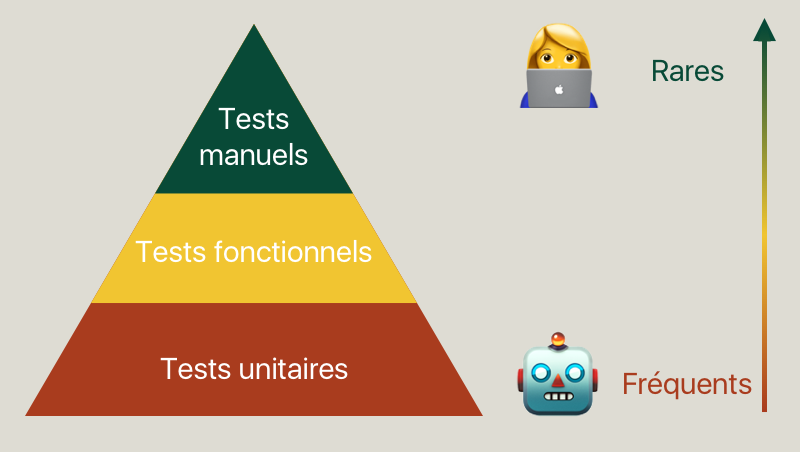

Comme vous pouvez le constater, la pyramide contient trois types de tests différents :
- Tout en haut, il y a les **tests manuels** conduits par des humains. Ils sont assez rares, car assez long comme nous venons de le dire.
- Tout en bas il ya les **tests unitaires**. Ce sont des tests automatisés rédigés par des humains, mais effectués par l'ordinateur. Ils sont bien plus nombreux, mais aussi bien plus fréquemment sollicités. On va en parler juste après.
- Enfin, nous avons entre les deux les **tests fonctionnels**. Selon les technologies et les méthodologies, ils sont réalisés par des humains ou par l'ordinateur. Dans notre cas en iOS, ce sera plutôt l'ordinateur et on les appelle UI Test. J'y reviens dans une minute.

Voilà la vision globale des tests. Rentrons un peu dans le détail maintenant.

#### Les tests unitaires
Les tests unitaires permettent de tester des toutes petites unités de votre programme. C'est pour cela qu'ils sont si nombreux. Un test unitaire va tester une seule méthode d'une seule classe au maximum. Si la méthode est grosse, il faudra même peut-être plusieurs tests pour la couvrir.

Prenons un exemple, avec la classe suivante :

```swift
class Personne {
	var age = 0

	func feterSonAnniversaire() {
		age += 1
	}
}
```

Je souhaite tester la méthode `feterSonAnniversaire` avec un test unitaire. Un test unitaire, c'est un petit morceau de code qui ferait la chose suivante :
1. Créer une instance de la classe `Personne` avec la propriété `age` qui vaux 12.
2. Appeler la méthode `feterSonAnniversaire` sur cette instance.
3. Vérifier que la propriété `age` vaux bien maintenant 13.

**Un test unitaire, c'est donc un morceau de code qui va tester une toute petite unité du programme**. Donc en général un test unitaire, c'est très simple !

Dit autrement, on a une donnée en entrée qui rentre dans le test unitaire. Si la donnée en sortie correspond à ce que l'on a prévu, le test est réussi.

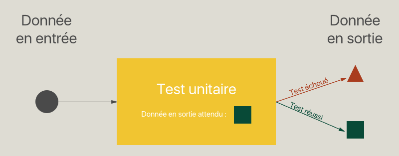

> **:information_source:** La quasi-totalité de la suite de ce cours est dédié aux tests unitaires.

#### Les tests fonctionnels
Nous avons parlé des tests unitaires et des tests manuels. Parlons maintenant des tests fonctionnels qui se situent entre les deux !

**Les tests fonctionnels permettent de tester une fonctionnalité complète de l'application**, comme la phase de login par exemple.

En iOS, on les appelle **UI tests**, car ils ont lieu sur l'interface utilisateur. Le principe, c'est que nous allons indiquer au simulateur un certain nombre d'actions à réaliser (appui sur ce bouton, reviens à la page précédente, glisse vers le bas, etc.) et ensuite, nous allons lui demander de vérifier que ce qui se trouve à l'écran correspond à ce qu'on a prévu. Ce sont donc des tests automatisés : l'ordinateur suit le scénario qu'on lui a donné sur l'interface de l'application.

> **:information_source:** Nous ne verrons pas dans ce cours comment créer des tests fonctionnels, car cela allongerait le cours inutilement (cf. le paragraphe suivant) ;) !

#### Quels tests choisir ?

Avec notre pyramide de test, nous voilà bien embêtés ! Quels sont les tests que nous devons choisir d'implémenter dans notre projet ?

La réponse est plus compliquée qu'il n'y parait. Alors je vais la faire en 2 temps :

##### 1. Utilisez les tests manuels, mais ne vous y fiez pas !
Vous ne pouvez pas vous passer des tests manuels, car c'est un bon moyen de voir si votre application fonctionne dans son ensemble donc il faut continuer à les faire, mais ne comptez pas exclusivement sur eux, ils ne sont pas fiables !

> I would say that the reason you can't do without manual tests is because you can always rely on what YOU see! However they are slow and a human can always forget a test. 

##### 2. Fiez-vous aux tests unitaires
Les tests fonctionnels et les tests unitaires ont l'avantage d'être automatisés. Donc ils vont nous permettre de tester l'intégralité de notre code.

> **:question:** OK, mais on doit utiliser les deux ? Ou que les tests unitaires ? Ou que les tests fonctionnels ?

Je pense que chaque développeur a une réponse différente à cette question. Alors voici la mienne !

**Si votre programme est bien architecturé et que vous êtes rigoureux, les tests unitaires doivent vous suffire. WOW no! different types of tests test different things at diffenrent levels. Unit tests are NOT the only testing that is required! A unit test tests only a single unit not how the app uses that unit! My answer is all three are needed more or less depending on the levels of importance of the feature/system componant. Manual testing should find the defects no one has thaught of, sometimes due to constraints/defects in the operation system or hardware. UITests should be old Manual tests that have been made repeatable to insure that manual test time is not wasted repeating the same tests manually every release cycle. Also the UITests check that all the indervidual units are working properlly TOGETHER. On first release we can, yes, ensure that rigoruse attention to a prefect dessign has been addered too, thus no need for other testing. However as features get added and tech debt accumulates UITests validate that the original dessign is still addered to even 20 years later when the original developers join all the Cobol developers! **

> **:question:** Pourquoi ?

Si votre programme est bien architecturé, toute la logique de votre application est bien rangée dans des classes qui ont chacune un rôle clair et sont donc testables facilement.

De plus, les tests unitaires ont deux avantages sur les tests fonctionnels :
- Ils sont **plus rapides** à exécuter. Les tests fonctionnels nécessitent le lancement de l'app dans un simulateur suivi d'un scénario d'actions. Les tests unitaires se résument à évaluer un booléen.
- Les tests unitaires sont **plus faciles à rédiger et à maintenir**, car ils concernent chacun une toute petite unité du programme.

#### En résumé

- Il existe plusieurs types de tests, des plus couramment appelés aux plus rares :
	- Les tests unitaires
	- Les tests fonctionnels
	- Les tests manuels
- Un test unitaire, c'est donc un morceau de code qui va tester une toute petite unité du programme.
- Les tests fonctionnels permettent de tester une fonctionnalité complète de l'application,
- Je vous suggère de continuer à faire des tests manuels, mais qu'ils ne sont pas fiables complétez les avec une suite de tests unitaires qui sont rapides, fiables, rapides à rédiger et à maintenir.

### Décelez les éléments à tester
Maintenant que vous savez ce que sont les tests unitaires, tout votre être n'est plus animé que par une seule passion : les créer !

Je vous demande pourtant quelques petites minutes de patience. Je sais, c'est dur, mais avant de rédiger vos premiers tests, il faut se demander quels sont les éléments à tester !

Nous verrons donc la question du **comment** tester au chapitre suivant et pour l'heure concentrons-nous sur le **quoi** tester.

#### Tests et MVC

Comme tout développeur qui se respecte et qui maîtrise le MVC, vos applications sont toujours séparées en trois et votre modèle est bien isolé de la vue.

> **:x:** Si ce n'est pas le cas, inutile de commencer à parler de test, vous n'êtes pas encore prêt. Les tests ont besoin d'un code organisé rigoureusement. Mais si vous n'êtes pas à l'aise avec le MVC, pas de souci ! Il y a [un cours](https://openclassrooms.com/courses/concevez-une-application-iphone-avec-le-modele-mvc) pour vous aider !

En MVC, la logique de l'application se situe dans le modèle. C'est donc le cerveau de l'application. Et il faut avant tout s'assurer que le cerveau fonctionne bien ! Donc, **c'est le modèle que nous allons tester en MVC** !

> **:question:** Et la vue ?

La vue est une entité extrêmement simple, elle n'effectue aucune logique. Elle affiche juste ce qu'on lui demande d'afficher. Donc on n'a pas besoin de tester la vue.

> **:question:** Et le contrôleur ? Lui, il contrôle la vue et donc il peut y avoir un peu de logique d'affichage à tester !

C'est bien vu ! Et c'est là que l'on atteint les limites du MVC. Vous verrez que pour des projets ambitieux, vos contrôleurs vont devenir énormes, car en fait le rôle du contrôleur est trop important.

> **:information_source:** Dans certaines architectures plus avancées comme le [MVVM](https://medium.com/yay-its-erica/dabbling-with-mvvm-in-swift-3-3bbeba61b45b), [VIPER](https://www.objc.io/issues/13-architecture/viper/) ou [Clean](https://clean-swift.com), le contrôleur est divisé en deux ou trois pour justement isoler sa partie logique et ne lui laisser que son rôle basique de dire à la vue ce qu'elle doit faire. La partie logique du contrôleur récupérée ainsi dans d'autres classes peut être testée.

Pour l'heure, nous allons rester en MVC et nous contenter de tester le modèle, ce qui est déjà suffisamment ambitieux pour le moment ! Mais gardez en tête que vous pouvez aller plus loin en explorant d'autres architectures.

#### Tests et classes

Dans notre modèle, nous avons trois classes : `Game`, `Set` et `Match`. Ce sont les trois classes que nous allons tester.

##### Le concept d'interface
Je vous ai expliqué qu'un test unitaire ne testait qu'une petite unité de code comme la méthode d'une classe.

> **:question:** OK j'ai compris ! Ça veut dire qu'on va tester toutes les méthodes de toutes les classes !

Vous vous rapprochez, mais ce n'est pas exactement ça. Vous vous souvenez : une classe permet de cacher une implémentation. Par exemple, ici, la logique complète de la classe `Match` ne nous intéresse pas. On veut juste pouvoir ajouter un point et récupérer le nouveau score.

Et bien, avec les tests on ne s'intéresse pas à la logique interne de la classe, mais seulement à ce qu'on appelle son **interface**, c'est-à-dire les propriétés et méthodes disponibles à l'extérieur de la classe.

Autrement dit, **nous n'allons pas tester les méthodes et propriétés privées, mais seulement les méthodes et propriétés publiques**.

##### Visualiser l'interface

Pour que le concept d'interface soit clair, je vous propose de vous montrer comment la visualiser avec Xcode.

Et c'est très simple ! Il vous suffit de sélectionner le fichier dont vous souhaitez visualiser l'interface, par exemple : `Match.swift`. Puis vous allez dans l'onglet *Navigate* et vous cliquez sur *Jump to Generated Interface*.

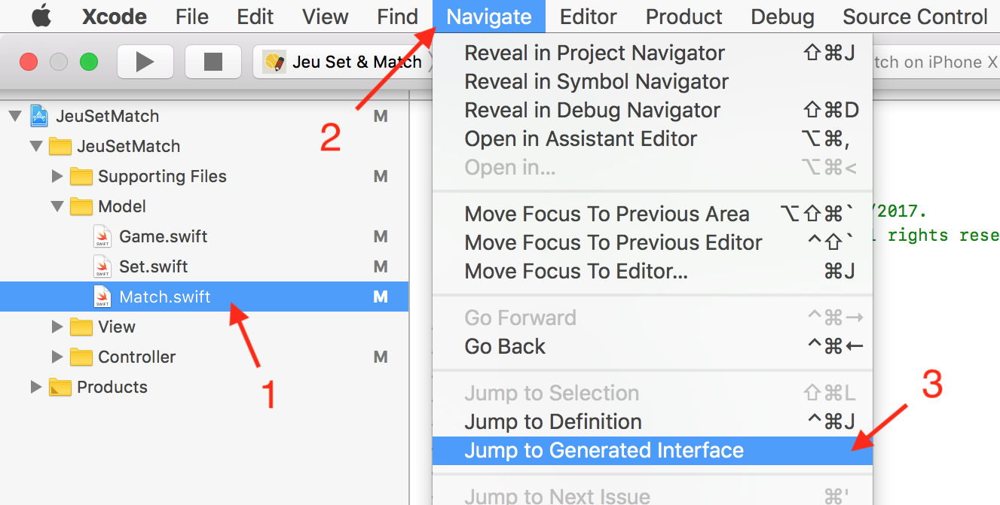

Ensuite, Xcode vous montre l'interface de votre classe :

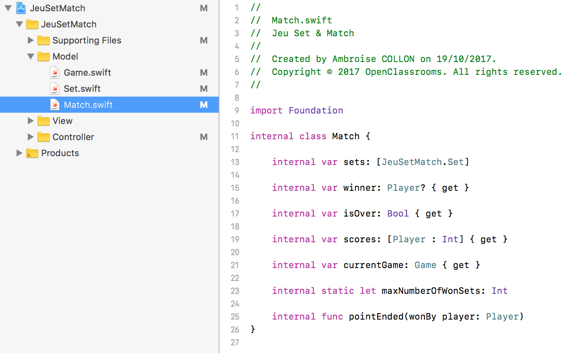

Sur cette vue, vous pouvez voir l'ensemble des propriétés et méthodes de vos classes au niveau `interne` et `public`. Toutes les autres sont cachées. Et les implémentations des méthodes aussi.

Vous pouvez voir ici du coup qu'il existe une seule méthode publique à la classe match : la méthode `pointEnded`. Toutes les méthodes privées ne font pas partie de l'interface.

##### Tester uniquement les interfaces

En résumé, **on teste uniquement les interfaces de nos classes**. Autrement dit, quand on rédige un test on ne doit même pas savoir comment est construite la classe à l'intérieur. C'est la même chose que quand on travaille sur le contrôleur.

> **:question:**, Mais du coup, on ne va pas tout tester !

Et si ! Les méthodes privées sont utilisées par les méthodes publiques. Donc lorsqu'on teste qu'une méthode publique fonctionne correctement, certaines méthodes privées sont appelées. Et finalement, l'ensemble de la classe est testée presque sans qu'on s'en rende compte !

#### Conditions pour tester

Les tests nous encouragent à nous concentrer sur les interfaces de nos classes et à leurs organisations. En particulier, pour que notre code soit facilement testable, il faut suivre deux principes :

- **Responsabilité unique** : Si une classe fait plusieurs choses à la fois, elle va devenir très grosse et du coup compliquée à tester. Lorsque vous créez une classe : assurez-vous qu'elle ne sert qu'à une seule chose.

- **Classes découplées** : Imaginons que vous installiez dans votre application un service de paiement. Si ce service de paiement est intégré dans plusieurs classes, cela va rendre le test de ces classes compliquées. À la place, il vaut mieux créer une classe dédiée à la gestion du paiement pour garder les autres classes indépendantes de ce service et testables facilement. On appelle cela découpler les classes.

> **:warning:** Pour tester, il faut un code testable ! Et c'est souvent la partie la plus difficile.

Et pour y arriver, souvenez-vous de créer des **classes découplées à responsabilité unique** !

#### Tests utiles
Enfin, ça paraît évident, mais ça va mieux en le disant, il faut créer des tests utiles.

> **:question:** Sans blague ?!

Oui j'enfonce un peu une porte ouverte, mais sauriez-vous me dire ce qu'est un test utile ?

> **:question:** Euh...

Vous voyez, ce n'est pas si évident ! **Un test utile, c'est un test qui peut échouer et qui peut réussir**. Autrement dit, un test qui échoue toujours est inutile, même chose pour un test qui ne peut que réussir.

Par exemple, ça ne sert à rien de tester que lorsque vous rajoutez un élément dans un tableau, la taille du tableau s'incrémente. Ce sera toujours bon (à moins que le langage Swift ne marche plus, mais là vous aurez d'autres problèmes... :O) !

Par contre, si vous avez prévu par exemple qu'à la fin d'un jeu, un nouveau jeu est rajouté au set, vous pouvez tester que la taille du tableau de jeux `games` de la classe `Set` s'incrémente. En effet, cette fois-ci, vous ne testez pas juste l'ajout d'un élément dans un tableau, mais la logique qui se déroule à la fin d'un jeu. C'est un test utile, car il peut échouer si votre code est mauvais ou réussir s'il est correct !

#### En résumé
- Dans le MVC, nous allons tester uniquement le modèle.
- On cherche à tester uniquement l'interface d'une classe sans s'occuper de l'implémentation de cette dernière.
- Pour tester, il faut un code testable. Les tests vous incitent à créer des classes découplées à responsabilité unique.
- Un test est utile s'il peut échouer et réussir.

Dans le prochain chapitre, vous allez créer votre tout premier test !

### Créez votre premier test  
Nous y sommes ! Le moment dont vous avez rêvé est arrivé ! Nous allons enfin créer nos tests !


Pour cela nous allons procéder en trois étapes :
1. Nous allons d'abord créer une target, dans laquelle nous allons écrire tous nos tests.
2. Nous allons ajouter un fichier de tests dans la nouvelle target.
3. Nous allons écrire nos tests dans ce fichier.

C'est parti !

#### Créer une target

##### Le concept de target
> **:question:** Euh c'est quoi une target ?

Xcode fonctionne par projet. Quand vous démarrez Xcode, vous ouvrez un projet dans lequel se trouve pour le moment une seule *target* : votre application. Un projet peut en fait contenir plusieurs targets.

Par exemple, vous pouvez avoir plusieurs versions d'une même application, une version pro et une version normale. Ces deux applications sont suffisamment proches pour faire partie du même projet, mais elles ne sont pas identiques donc vont être des targets différentes.

Les tests ne font pas partie de l'application. **Ils se comportent comme un module à part et donc nous allons les créer dans une target à part.**

##### Créer la target
Pour créer cette target, rien de plus simple, suivez le guide !

1/ Sélectionnez le projet dans le navigateur.  
2/ Cliquez sur le `+` en bas à droite du panneau central.

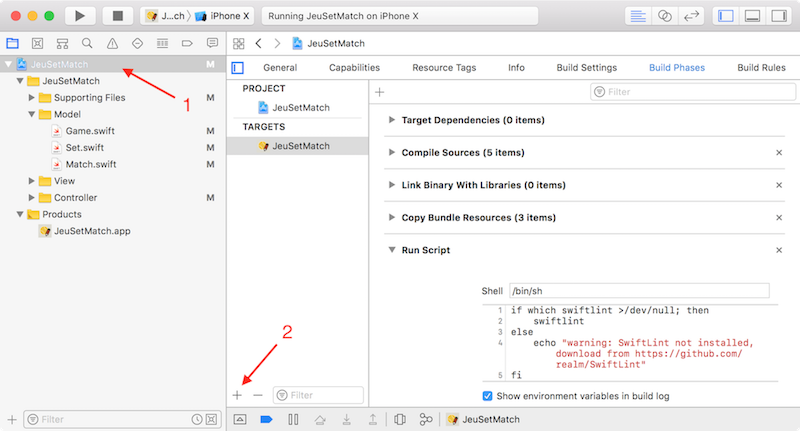

3/ Dans la popup qui s'ouvre, choisissez l'onglet iOS.  
4/ Dans la barre de recherche en haut à droite, vous pouvez taper "test".  
5/ Xcode ne vous propose plus que 2 types de target à tester. Choisissez *iOS Unit Testing Bundle* pour créer des tests unitaires.  
6/ Cliquez sur `Next`.

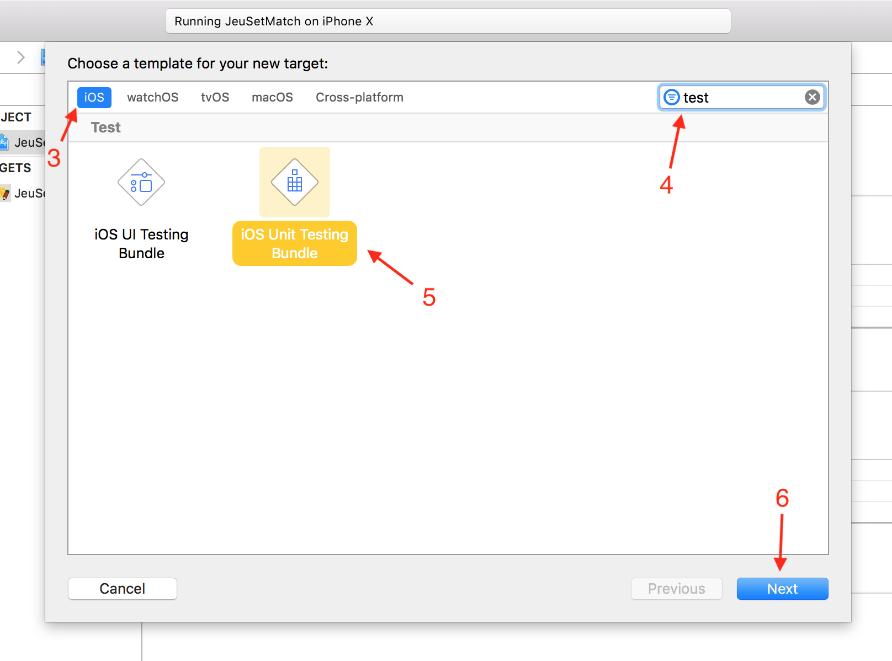

7/ Xcode vous propose de contrôler les paramètres de votre nouvelle target. Ce sont les mêmes qu'à la création d'un projet Xcode. À l'exception des deux derniers qui vous permettent de préciser le projet dans lequel créer la target ainsi que la target qui va être testée, ici c'est bien notre application. Cliquez sur `Finish` pour créer la target.


Et voilà notre target est créée ! Elle est visible dans la liste des targets et un nouveau dossier a été créé dans le navigateur.

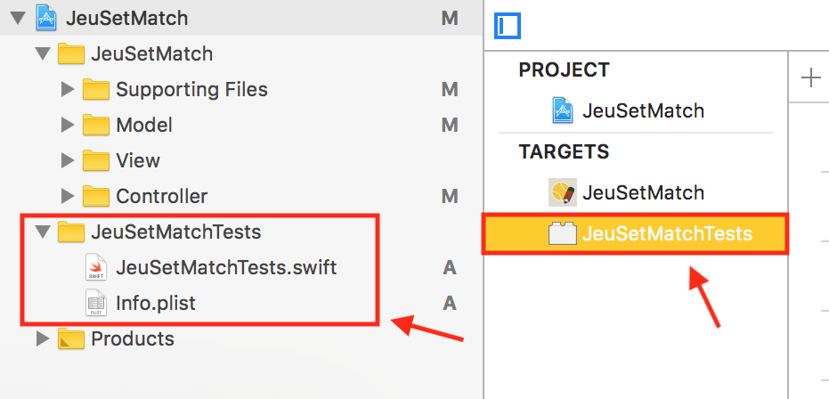

> **:information_source:** Cette target peut également être créée pendant la création d'un nouveau projet. Il suffit de cocher la case *Include unit tests*.  
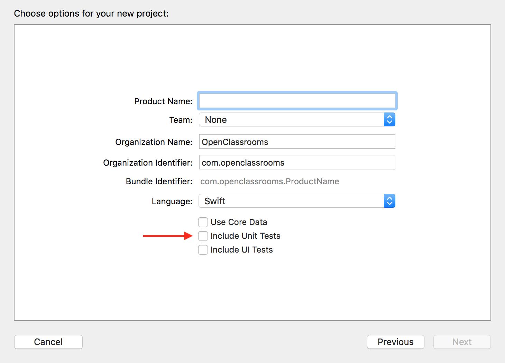

#### Ajoutez un fichier de test
Comme vous l'avez remarqué, la target contient déjà un fichier de test nommé `JeuSetMatchTests.swift`. Vous pouvez le supprimer, car son nom ne nous convient pas. Nous allons en créer un nouveau.

Pour cela, sélectionnez le dossier `JeuSetMatchTests` puis faites <kbd>cmd+n</kbd> (ou aller dans *File* > *New* > *File...*). Choisissez *Unit Test Case Class*. Puis cliquez sur `Next`.

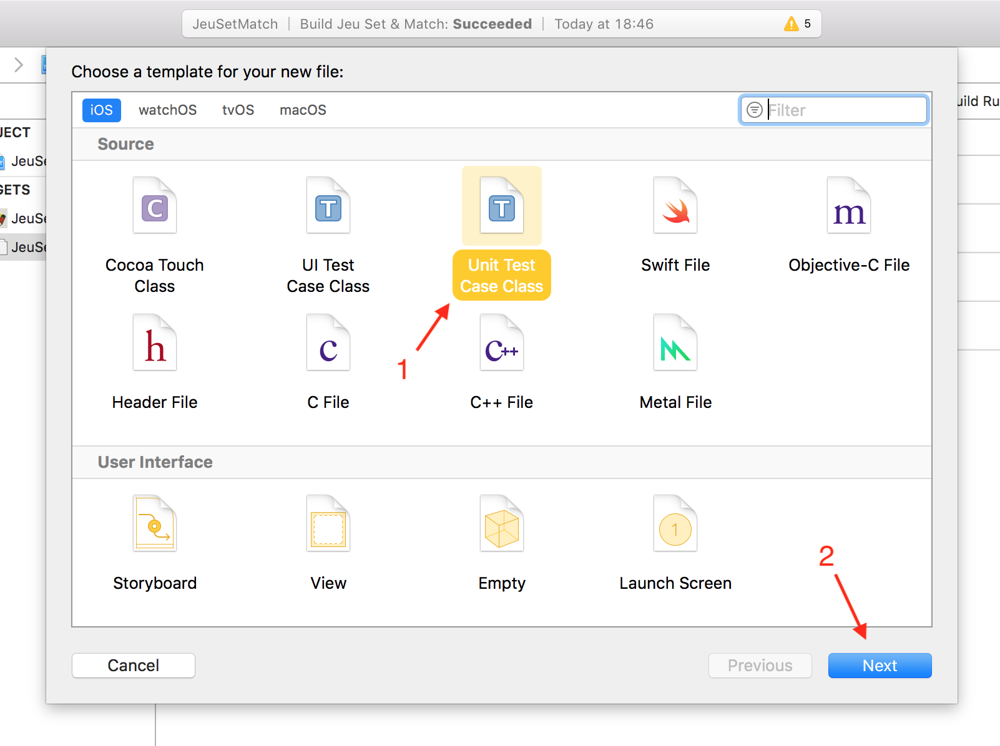

Nommez ensuite votre fichier `GameTestCase`, car nous allons commencer par tester la classe `Game`. Et cliquez sur `Next`.

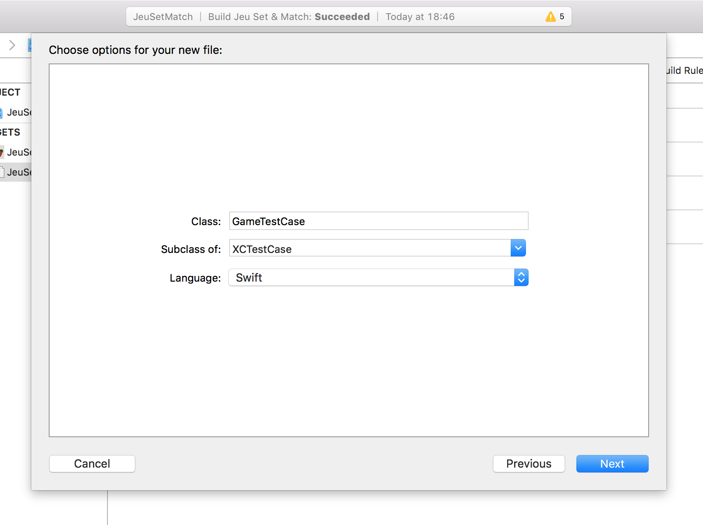

Enfin, vérifiez bien que la target sélectionnée est bien celle des tests. Et cliquez sur `create`.

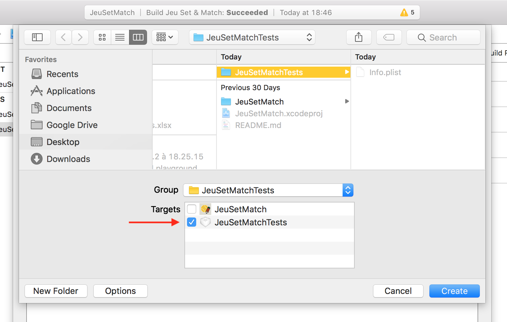

Et voilà votre premier fichier de test est créé et vous pouvez le retrouvez dans votre navigateur !

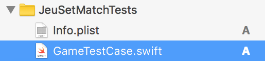

> **:warning:** Si vous avez l'alerte ci-dessous, vous pouvez cliquer sur `Don't Create`. Tout notre code est en Swift donc nous n'avons pas besoin de faire le lien avec de l'Objective-C.  
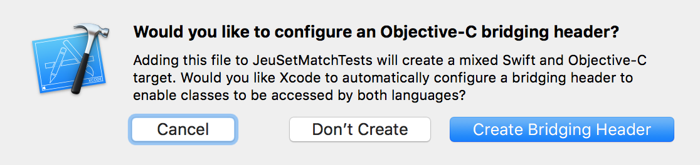

#### Présentation de XCTestCase  
Regardons maintenant un peu le fichier que nous venons de créer.


Nous commençons par importer `XCTest` qui est le framework de test d'Xcode. Puis nous créons une classe `GameTestCase` qui est une sous-classe de `XCTestCase`.

`XCTestCase` est une classe qui permet de faire des tests comme son nom l'indique. **À chaque fois que vous voudrez faire des tests, il vous faudra créer une sous-classe de `XCTestCase`**. Dans ce cours, nous en créerons trois en tout : `GameTestCase`, `SetTestCase`, `MatchTestCase`. Elles reprennent les trois classes de notre modèle et dans chacune de ces sous-classes, nous allons pouvoir ajouter plusieurs tests.

#### Votre premier test

Je vous propose de supprimer tout le contenu de la classe. Nous verrons au fur et à mesure à quoi tout cela sert. Votre code doit ressembler à ceci :

```swift
import XCTest

class GameTestCase: XCTestCase {
}
```

##### Ajouter le test
Et maintenant, ajoutons notre tout premier test ! Pour créer un test, c'est très simple ! Il suffit d'**ajouter à notre classe une méthode qui commence par le mot `test`**. Par exemple :

```swift
func testMaMethode() {} // Ceci est un test
func maMethode() {} // Ceci n'est pas un test
```

Je vous propose de rajouter le test suivant comme ceci :

```swift
class GameTestCase: XCTestCase {
	func testExemple() {

	}
}
```

> **:information_source:** Lorsque vous créer un test, un losange apparaît sur sa droite. Cela vous confirme que le test a bien été reconnu par Xcode.  
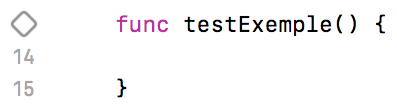

##### XCTAssert
Maintenant nous allons remplir ce test ! Je vous l'ai dit : un test, c'est l'évaluation d'un booléen. Si le booléen est évalué à `true`, le test est réussi, sinon le test échoue.

La fonction qui évalue le booléen s'appelle `XCTAssert` et prends en paramètre... un booléen !

Essayez d'écrire dans le test :
```swift
func testExemple() {
	XCTAssert(true)
}
```

La fonction va évaluer que le booléen vaut `true`. Et donc le test va réussir.

##### Lancer le test

Pour voir le test réussir, il vous suffit de cliquer sur le petit losange à gauche du nom du test. Le test se lance et après quelques minutes d'un insoutenable suspens... le test est réussi !


Maintenant, réitérer l'expérience en remplaçant `true` par `false`. Relancez le test, et... il échoue !

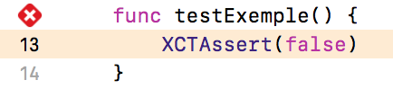

Je vous invite à jouer avec la méthode `XCTAssert` et le lancement des tests. Par exemple, essayez les commandes suivantes :

```swift
XCTAssert(2*2 == 4)
XCTAssert(true || false)
XCTAssert(true && false)
XCTAssert(365%7 == 0)
XCTAssert([1, 2, 3, 4].count == [5, 6, 7, 8].count)
```

Il y a différentes façons de lancer les tests :
- Pour lancer **tous les tests de votre projet**, vous pouvez utiliser le raccourci <kbd>cmd + u</kbd>.
- Pour lancer **tous les tests d'une classe**, vous pouvez cliquer sur le losange à côté de la déclaration de la classe.
- Pour lancer **un seul test**, on clique sur le losange à côté du test.

#### Exercice
Je vous propose de créer les deux autres fichiers de tests : `SetTestCase.swift` et `MatchTestCase.swift`. Il suffit de reprendre les étapes vues ensemble ! Bonne chance !

#### En résumé
- Pour créer des tests, il faut rajouter une **target**. L'application est dans une target, les tests dans une autre et ces deux targets appartiennent à un même projet Xcode.
- Ensuite, il faut créer un fichier de test dans lequel on crée une sous-classe de `XCTestCase`.
- Pour créer un test, il faut **créer une méthode dont le nom commence par le mot `test`**.
- La fonction `XCTAssert` permet d'évaluer un booléen, s'il vaut `true`, le test réussit et inversement.
- Pour lancer les tests, on peut cliquer sur les losanges ou faire `cmd+u`.

Dans le prochain chapitre, nous allons tester toute la classe `Game` !

### Testez la classe Game  
C'est bien beau de s'amuser à faire des petits tests pour tester le fonctionnement des tests. Mais trop de tests tuent les tests et vous allez finir par les détester. :D

Alors, rentrons dans le vif du sujet et testons notre classe `Game` !

#### Importer l'application

Comme nous l'avons vu dans le projet précédent, les tests et l'application coexistent dans un même projet, mais se trouvent dans des targets séparées. Cela veut dire qu'ils ne sont pas dans le même module. Donc si vous essayez d'utiliser la classe Game ou toute autre classe dans les tests, Swift va vous signaler qu'il ne connaît pas cette classe.

Pour cela, pas de panique ! Il nous suffit d'importer le module qui correspond à notre application. Il a le nom de la target correspondante, à savoir : `JeuSetMatch`.

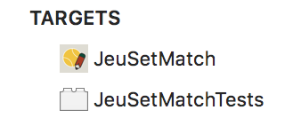

Vous pouvez écrire en haut de votre fichier test :
```swift
import JeuSetMatch
```

Désormais le module de l'application est importé dans votre fichier de tests.

Mais ce n'est pas suffisant ! Pour comprendre pourquoi, faisons un petit rappel du contrôle d'accès.

Il y a 4 niveaux que je vous résume dans ce schéma :

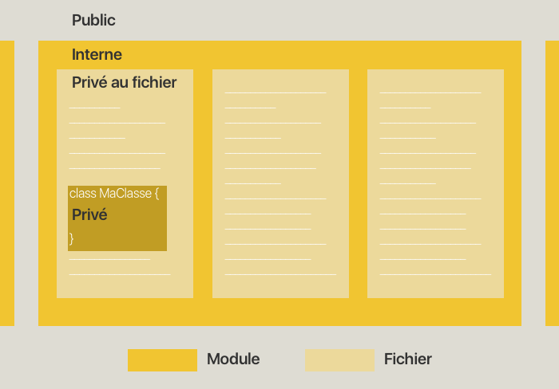

> **:information_source:** Si vous avez besoin de vous rafraîchir un peu plus la mémoire, vous pouvez retourner [ici](https://openclassrooms.com/courses/approfondissez-swift-avec-la-programmation-orientee-objet/protegez-vos-classes).

Le niveau par défaut, c'est le niveau interne. À ce niveau, la portée des classes et de leurs membres est limitée au module qui les contient. Donc en l'occurrence, notre classe `Game` et toutes ses méthodes ne sont pas disponibles en dehors de l'application. Donc lorsqu'on importe le module `JeuSetMatch` du côté des tests, nous n'avons pas accès à `Game` et aux autres classes du modèle, car nous sommes dans un autre module.

Pour y remédier, nous avons deux solutions :
1. Modifier les classes et les méthodes pour qu'elles soient toutes publiques. D'une part, ça va nous prendre un peu de temps et d'autre part ce n'est pas très sécurisé.
2. Utilisez le décorateur `@testable`. Et c'est ce que nous allons faire !

Le décorateur `@testable` se place avant l'import d'un module. Il permet de faire comme si le fichier de test faisait partie du même module. Ainsi, le fichier de test a accès à toutes les classes et leurs membres à partir du niveau interne.

Écrivez donc ceci ans votre code :
```swift
@testable import JeuSetMatch
```

Nous avons maintenant accès à la classe `Game` et nous allons pouvoir la tester !

#### Écriture du premier test

Vous pouvez supprimer le `testExemple`, nous allons écrire à la place notre premier vrai test. Et nous n'allons pas l'appeler n'importe comment !

Pour nommer vos tests, je vous suggère d'utiliser une technique bien pratique : le *Behavior Driven Development* (ou développement motivé par le comportement). En BDD, vos noms de tests vont être divisés en trois parties :
- *Given* : Etant donné que... [Situation de départ]
- *When* : Quand...[Action]
- *Then* : Alors...[Situation d'arrivée]

> I normally place the given when then in a comment above the test method, the method name is normally based on the requirment(jira ticket id or something short). Whilst I can see why this is kinda a good thing it can make for some long method names, by default I think that swiftlint allows 3-40 character lenght for names. if the logic being test is testGivenSomethingSomething_AndSomethingOtherThing_AndSomethingSomeOtherThing_WhenAnOtherThing_ThenSomethingThatCanTakeAFewWordsToExplanButIsVeryLong.   
/*
Given: SomethingSomething
And    SomethingOtherThing
And    SomethingSomeOtherThing

When:  AnOtherThing

Then:  SomethingThatCanTakeAFewWordsToExplanButIsVeryLong. 
*/
func testFirstTest() {} // I find this much easier to read, however insuring G.W.T.s get updated as code changes is a challange!

Par exemple, si on devait écrire le nom d'un test qui contrôle le fonctionnement d'un like, on écrirait :
```swift
GivenPostHasZeroLike_WhenPostIsLiked_ThenPostHasOneLike
// ETANT DONNÉ QUE le poste n'a pas de like
// QUAND le poste est liké
// ALORS le poste a un like
```
Faisons cela avec notre premier test de la classe `Game`, on va tester que le score du joueur 1 passe bien de 0 à 15 lorsqu'il gagne le premier point :

```swift
func testGivenScoreIsNull_WhenIncrementingPlayer1Score_ThenScoreShouldBeFifteen() {
}
```

Il ne nous reste plus qu'à coder ce qui est dit dans le nom du test :


```swift
func testGivenScoreIsNull_WhenIncrementingPlayer1Score_ThenScoreShouldBeFifteen() {
	// 1
	let game = Game()

	// 2
	game.incrementScore(forPlayer: .one)

	// 3
	XCTAssert(game.scores[.one]! == 15)
	XCTAssert(game.scores[.two]! == 0)
}
```

Voyons un peu ce que je viens de rédiger :
1. *Situation de départ* : un jeu avec un score nul.
2. *Action* : le point est gagné par le joueur 1.
3. *Situation d'arrivée* : le score du joueur 1 vaut 15, celui du joueur 2 vaut 0.

> **:information_source:** Sans écrire les commentaires 1, 2 et 3 bien sûr, je vous suggère de sauter des lignes entre chaque étape du test. Ainsi vous ferez apparaître clairement les trois étapes du BDD.

Nous avons rédigé notre premier test ! Vous pouvez le lancer et constater que cela fonctionne !

#### Écriture du deuxième test
Passons à la suite ! Nous allons maintenant tester qu'au deuxième point gagné, le score passe de 15 à 30. Essayez de le faire tout seul !

Voici la correction :
```swift
func testGivenScoreIsFifteen_WhenIncrementingPlayer1Score_ThenScoreShouldBeThirty() {
		let game = Game()
		game.scores[.one] = 15

		game.incrementScore(forPlayer: .one)

		XCTAssert(game.scores[.one]! == 30)
		XCTAssert(game.scores[.two]! == 0)
}
```
C'est quasiment la même chose. On a juste rajouté la deuxième ligne pour que le score démarre à 15????right? points.

Il y a quelque chose qui me choque quand même. La première ligne est rigoureusement identique dans les deux tests ! Or un bon développeur n'aime pas se répéter ! Il faut factoriser. Je vous propose d'extraire cette ligne et d'en faire une propriété :

```swift
class GameTestCase: XCTestCase {
    let game = Game()

    func testGivenScoreIsNull_WhenIncrementingPlayer1Score_ThenScoreShouldBeFifteen() {
        game.incrementScore(forPlayer: .one)

        XCTAssert(game.scores[.one]! == 15)
        XCTAssert(game.scores[.two]! == 0)
    }

    func testGivenScoreIsFifteen_WhenIncrementingPlayer1Score_ThenScoreShouldBeThirty() {
        game.scores[.one] = 15

        game.incrementScore(forPlayer: .one)

        XCTAssert(game.scores[.one]! == 30)
        XCTAssert(game.scores[.two]! == 0)
    }
}
```

C'est mieux comme ça ! Le seul problème, c'est que nos tests ne sont plus indépendants les uns des autres. Or ils doivent l'être, car un test unitaire s'occupe d'une petite unité de code. Si ce test porte avec lui l'historique des tests précédents, ça ne fonctionne plus !

Pour y remédier, nous allons utiliser la méthode `setup`. C'est une méthode de `XCTestCase` qui permet de faire un peu de préparation. **Cette méthode est rappelée avant chaque test**. Donc dans notre cas, elle va être appelée deux fois.

Je vous propose de l'utiliser pour initialiser notre propriété `game`. Ainsi avant chaque début de test, la propriété sera réinitialisée :

```swift
var game: Game!

override func setUp() {
	super.setUp()
	game = Game()
}
```

> **:information_source:** J'utilise un optionnel déballé pour la propriété `game` car je l'initialise ensuite dans la méthode `setup`. Je suis donc certain que la variable sera initialisée avant chaque début de test.

Vous pouvez relancer vos tests et vérifier qu'ils réussissent toujours !

#### Écriture du troisième test
Vous commencez à connaître la musique. On va tester maintenant que le troisième point gagné fait passer le score de 30 à 40. À vous de jouer !

Voici la correction :
```swift
func testGivenScoreIsThirty_WhenIncrementingPlayer1Score_ThenScoreShouldBeForty() {
	game.scores[.one] = 30

	game.incrementScore(forPlayer: .one)

	XCTAssert(game.scores[.one]! == 40)
	XCTAssert(game.scores[.two]! == 0)
}
```

Pas grand-chose de nouveau ici. Mais il y a encore quelque chose qui me chiffonne... La première ligne ressemble beaucoup à la première ligne du test précédent. Est-ce qu'on ne pourrait pas factoriser ?

On va créer une méthode pour factoriser cette ligne. Eh oui ! On est dans une classe, on peut écrire toutes les méthodes qu'on veut. On n'est pas obligé d'écrire que des tests. Il suffit qu'elles ne commencent pas par le mot `test`.

> **:warning:** D'ailleurs, je vous incite fortement à le faire ! **Vos tests sont à traiter avec le même soin que le reste de votre code, sinon plus !**

Allons-y :

```swift
func setPlayerOneScore(_ score: Int) {
	game.scores[.one] = score
}
```

Et dans nos tests on peut maintenant écrire :

```swift
setPlayerOneScore(15) // Pour le deuxième test
setPlayerOneScore(30) // Pour le troisième test
```

#### Écriture du quatrième test
Il ne nous reste plus qu'un test à écrire. Lorsque le score du joueur 1 vaut 40 et qu'il gagne le point, le jeu doit être terminé et gagné par le joueur 1. Vous voulez essayer de le faire seul ? Allez-y !

Voici la correction :
```swift
func testGivenScoreIsForty_WhenIncrementingPlayer1Score_ThenGameIsOverAndWonByPlayer1() {
	setPlayerOneScore(40)

	game.incrementScore(forPlayer: .one)

	XCTAssertEqual(game.winner, .one)
	XCTAssertTrue(game.isOver)
}
```

J'ai pris la liberté de vous montrer ici deux variantes de la méthode `XCTAssert` :
- `XCTAssertEqual` : Très utile, cette variante prend deux paramètres et le test réussit s'ils sont égaux. L'opposé `XCTAssertNotEqual` existe également.
- `XCTAssertTrue` : Elle fonctionne exactement comme `XCTAssert`, mais elle est plus lisible. L'opposé `XCTAssertFalse` existe également.

> **:information_source:** Il existe d'autres variantes comme `XCTAssertNil`, `XCTAssertNotNil` etc. Vous pouvez retrouver toutes les variantes de XCTAssert [ici](https://developer.apple.com/documentation/xctest) (section *Test Assertion*). Je vous invite à les utiliser, vos tests seront plus lisibles !

Et voilà ! Notre classe `Game` est intégralement testée ! Bravo !

#### Exercice
Je vous propose d'essayer de rédiger les tests de la classe `Set`. Il y a trois tests à créer :
1. Testez que la propriété calculée `scores` fonctionne bien. Les scores doivent correspondre au nombre de jeux gagnés par chaque joueur.
2. Testez que la propriété calculée `winner` fonctionne bien. Elle doit être à `nil`, si la partie n'est pas terminée.
3. Testez que si le joueur 1 a gagné 6 jeux, le set est terminé et gagné par le joueur 1.

Vous pouvez retrouver la correction [ici](https://s3-eu-west-1.amazonaws.com/static.oc-static.com/prod/courses/files/Parcours+DA+iOS/Cours+6+-+Tests/SetTestCase.swift). Bon courage, vous pouvez le faire !

#### En résumé
- On écrit les noms des tests en Behavior Design Development : on sépare le nom en trois parties : *Given*, *When*, *Then*.
- La méthode `setup` est rappelée avant chaque test. Elle permet de faire une initialisation.
- Vous devez traiter vos tests comme le reste du code. Donc n'hésitez pas à les factoriser en créant des méthodes dès que besoin.
- Il existe plusieurs variantes de `XCTAssert`. Je vous invite à les utiliser le plus possible pour améliorer la lisibilité de vos tests.

Maintenant que vous avez rédigé vos premiers tests et que vous avez compris la logique d'un test unitaire, nous allons parler de l'utilité de créer et maintenir vos tests unitaires ! Rendez-vous au prochain chapitre !

### Saisissez l’intérêt des tests
Maintenant que vous avez une meilleure idée de ce que sont les tests en général et les tests unitaires en particulier, nous allons pouvoir aborder l'épineuse question de ce cours :

**Pourquoi rédiger des tests unitaires ?**

Il y a de nombreuses raisons à cela. Et voici les 5 principales !

#### 1. Prouver que votre code fonctionne ✅
**Tout le code que vos tests unitaires couvrent fonctionne** par définition des tests unitaires. Donc vos tests vous donnent la preuve que votre code marche. Et cela vous donne un atout exceptionnel, vous avez confiance dans votre code !

Si vous vous êtes déjà frottés à une grosse base de code, vous avez sans doute ressenti ce vertige d'avoir peur de tout casser, car vous ne pouviez pas anticiper les implications de vos changements.

Avec des tests unitaires, **si un changement casse quelque chose, vous le verrez tout de suite, car un ou plusieurs de vos tests vont passer au rouge !**

#### 2. Prévenir les bugs et régressions 🐞
Comme les tests unitaires prouvent que votre code fonctionne, ils empêchent les bugs de se produire. Et comme tout est testé, vous pouvez modifier votre base de code sans craindre une régression, les tests la verront tout de suite !

Et vous pourrez faire les changements nécessaires avant d'envoyer votre nouvelle version de l'app sur l'App Store !

#### 3. Penser vos classes 🤔
Comme nous l'avons vu, les tests unitaires ont lieu à l'interface des classes. Donc pour pouvoir tester facilement, il va falloir que vous pensiez vos classes correctement.

Écrire vos tests vous incite à créer des classes dont les responsiblités sont **uniques** et **indépendantes**.

En somme, les tests vous facilitent l'organisation de votre code.

#### 4. Une documentation vivante de votre code 📚
Chaque test va couvrir un cas d'usage d'une de vos classes. Donc si tout votre code est testé, vos tests sont une vraie documentation fonctionnelle de votre programme. On peut y trouver tout ce que fait le code !

Regardez le code condensé de la classe `Game` que nous venons de tester :

```swift
func testGivenScoreIsNull_WhenIncrementingPlayer1Score_ThenScoreShouldBeFifteen() {}

func testGivenScoreIsFifteen_WhenIncrementingPlayer1Score_ThenScoreShouldBeThirty() {}

func testGivenScoreIsThirty_WhenIncrementingPlayer1Score_ThenScoreShouldBeForty() {}

func testGivenScoreIsForty_WhenIncrementingPlayer1Score_ThenGameIsOverAndWonByPlayer1() {}
```

On peut très bien lire les 4 cas d'utilisations de la classe `Game` grâce à notre nomenclature en *Behavior Driven Development*.

> **:information_source:** Vous pouvez plier les méthodes d'une classe directement dans Xcode avec le raccourci  <kbd>Shift+alt+cmd+flèche gauche</kbd>. Pour les déplier, vous pouvez faire: <kbd>Shift+alt+cmd+flèche droite</kbd>. Cela vous permet d'avoir la vue d'ensemble d'une classe, ce qui est loin d'être inutile ;) !

En plus, contrairement à une documentation classique rédigée en dehors du code, celle-ci a l'avantage d'être **toujours à jour** ! En effet, dès que vous modifiez votre code, vous devez modifier vos tests.

Une bonne suite de tests, c'est donc la meilleure documentation qui soit !

#### 5. Être professionnel 💼

Enfin, lorsque vous faites des tests, vous créez un code qui est facilement maintenable, qui prévient les bugs et dont vous êtes certains qu'il fonctionne. Et ce sont les composants essentiels d'une attitude professionnelle.

Si un plombier vient chez vous réparer une fuite et qu'il vous dit en partant que sa réparation va peut-être arrêter la fuite, vous vous dîtes que c'est un touriste ! Et bien, en développement c'est pareil, **il faut que vous soyez sûr de vous et seule une bonne suite de test vous le permettra !**

Alors, faites de beaux tests ! Vous ne voulez pas passer pour des touristes :) !

#### En résumé
Rédiger des tests unitaires doit devenir un réflexe, car c'est une étape incontournable si vous souhaitez devenir des développeurs iOS professionnels ! En effet, les tests unitaires vous permettent de :
- Prouver que votre code fonctionne
- Prévenir les bugs et les régressions
- Penser à vos classes
- Créer une documentation vivante de votre
- Être professionnel

Dans le prochain chapitre, nous allons améliorer la couverture en tests de notre code !

### Évaluez la couverture de vos tests  
Nous avons testé deux classes pour le moment : `Game` et `Set`. C'est bien, mais nous n'allons pas nous arrêter en si bon chemin ! On a dit qu'on allait tester tout le modèle !

> **:warning:** Oui, sauf que cette phrase pause un problème métaphysique ! **Comment être sûr qu'on a testé tout le modèle ?** Nous sommes de simples êtres humains et nous pouvons faire des erreurs, oublier un test, etc. Si seulement il existait un outil pour nous assurer que tout notre code est testé...

[Suspens insoutenable...]

Eh oui ! Bien sûr il existe ! On appelle cela le ***code coverage***. Cet outil regarde quelle partie du code est *couverte* par les tests. Pour cela, il regarde tout simplement quelles sont les lignes de code qui sont executées lorsqu'on lance les tests. Celles qui sont executées sont couvertes par les tests, les autres ne le sont pas.

#### Installer le code coverage

Pour installer le code coverage, nous allons devoir éditer le schéma de notre application (*scheme* en anglais).

Pour cela, cliquez sur le nom de l'application en haut à gauche.

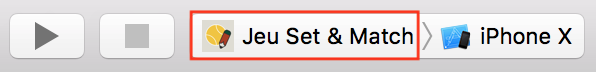

Dans le menu déroulant qui s'affiche, cliquez sur `Edit Scheme...`.

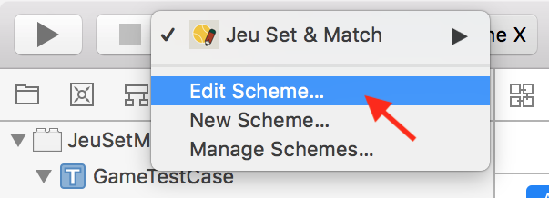

Une popup apparaît et vous présente le schéma :

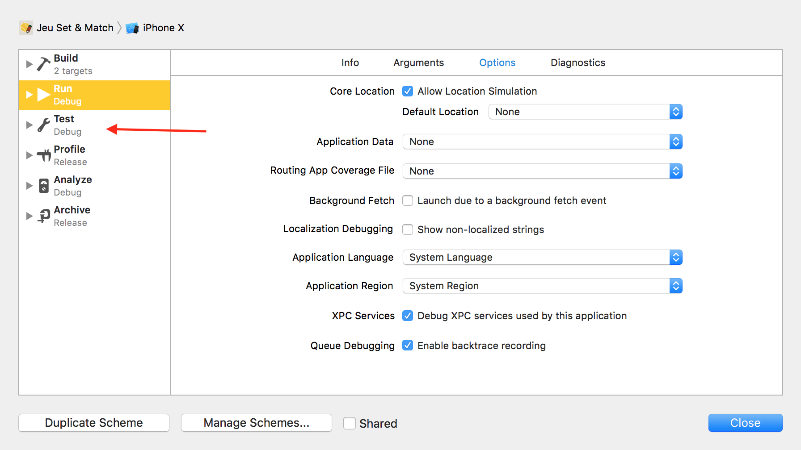

> **:question:**, Mais c'est quoi ce schéma ?

Ne vous inquiétez pas, je vais en parler. Un schéma, c'est la séquence des actions que peut subir votre code. Il y en a 5 qui sont données sur la droite de la popup. Pour l'instant, vous en connaissez 3 :
- *Build* : compile votre code (<kbd>cmd + b</kbd>).
- *Run* : exécute votre code, une fois celui-ci compilé (<kbd>cmd + r</kbd>).
- *Test* : lance vos tests (<kbd>cmd + u</kbd>).

> **:information_source:** Chacune de ces actions peut être paramétrée comme vous le voyiez ici. Plus tard, vous aurez peut-être besoin de modifier votre schéma ou d'en créer d'autres.

Pour l'instant, nous allons cliquer sur la phase de Test (comme la flèche rouge l'indique). Et dans cette interface, nous allons cocher la case `Gather coverage data`. Puis vous pouvez cliquer sur `Close`.

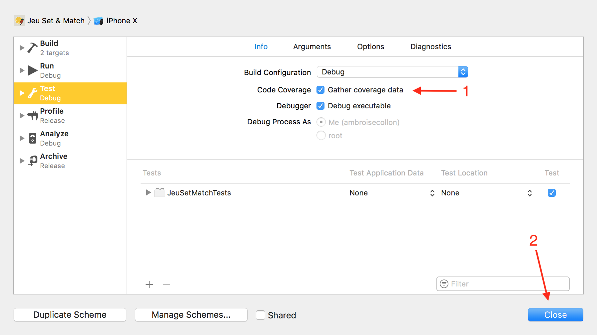

Maintenant, lorsque vous allez lancer vos tests, Xcode va collecter les données de couverture et vous donnez les lignes de code qui ont été executées pendant les tests.

#### Inspecter la couverture de code  
Pour inspecter la couverture du code, il vous faut commencer par lancer les tests (rappel : <kbd>cmd + u</kbd>).

Une fois que vos tests ont réussi, vous pouvez aller dans le navigateur de tests :


> **:information_source:** Le navigateur de test vous permet de visualiser tous les tests de votre application, organisés par classe. Vous pouvez d'ailleurs, lancer les tests depuis cette interface en cliquant sur le bouton play sur la droite de chaque test, classe ou target.

Dans le navigateur, vous pouvez faire un clic droit sur n'importe quel test et choisir `Jump to Report`.

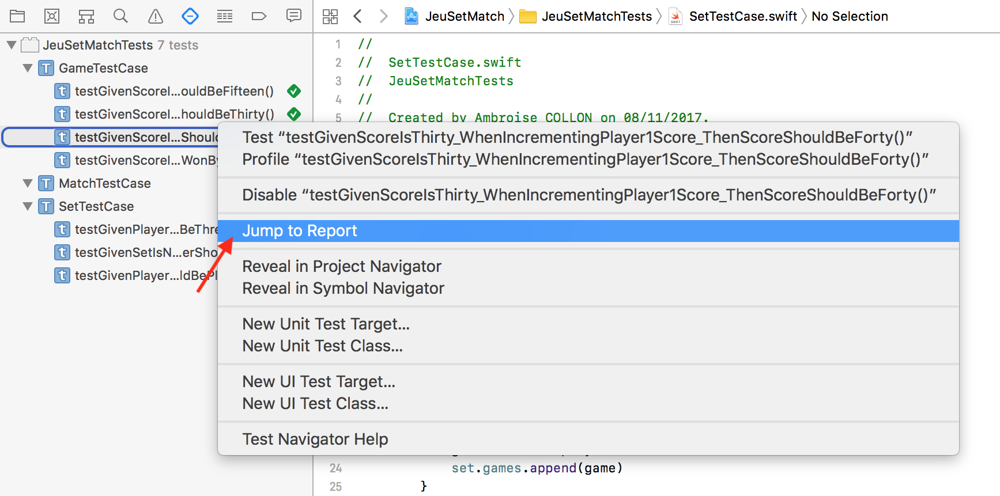

Vous arrivez sur la page de rapport des tests, vous pouvez voir tous les tests, s'ils ont réussi ou non, les trier selon certains critères. Mais l'onglet qui nous intéresse ici, c'est l'onglet `Coverage`.

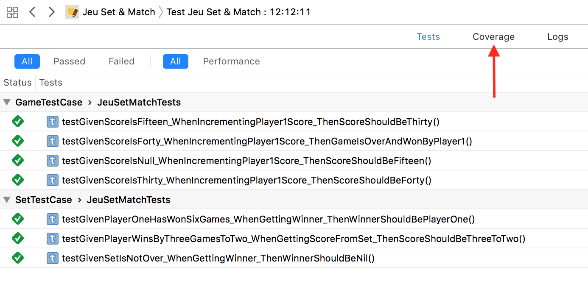

Dans cet onglet, vous pouvez voir la couverture en pourcentage de chaque fichier, et même de chaque fonction. Ainsi vous pouvez visualiser très simplement où vos tests ne passent pas.

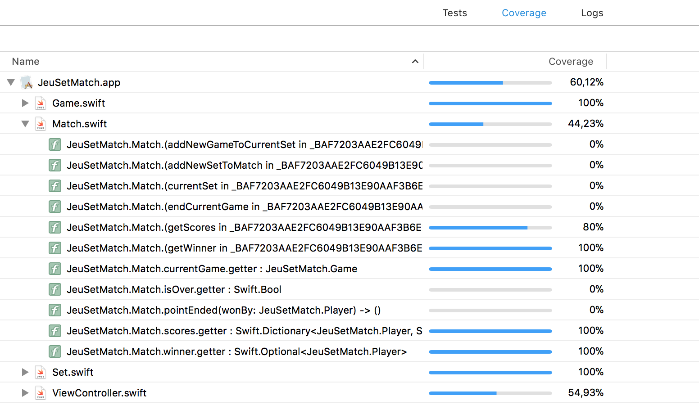

Et comme vous pouvez le voir, nos classes `Game` et `Set` sont testées à 100% ! Nous avons fait du bon travail ! Pour avoir plus de détail, vous pouvez afficher le fichier `Game.swift` et les informations de coverage sont maintenant disponibles à droite du fichier.

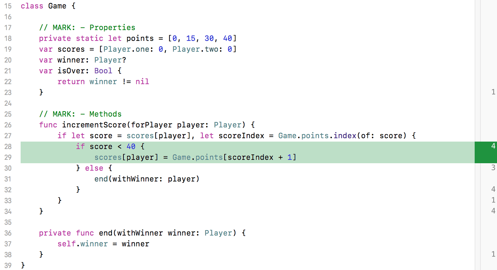

> **:information_source:** Les nombres indiquent le nombre de fois où la ligne a été exécutée pendant les tests.

En revanche, si on prend le fichier `Match.swift`, il contient plein de trous !

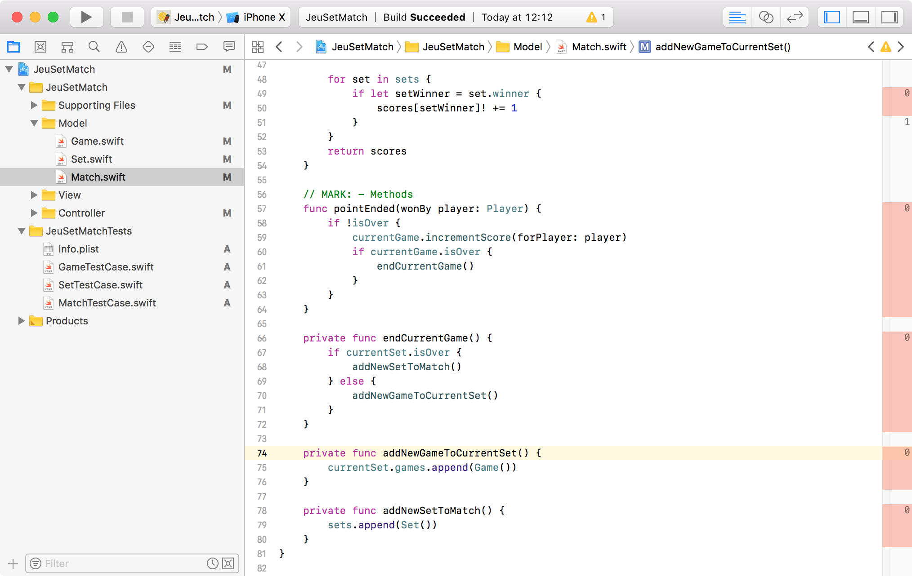

Toutes les lignes rouges sur la droite avec un zéro ne sont pas testées ! Nous allons y remédier.

#### La grande question
Juste avant de boucher les trous, je voudrais aborder la grande question de la couverture des tests :

> **:question:** Quel pourcentage de couverture dois-je atteindre ? 100% ? 90% ? 50% ?

Et la réponse est : **ce n'est pas une question de pourcentage, mais de stratégie**.

Par exemple, lorsque vous travaillez avec un modèle MVC, je vous suggère de faire du 100% de couverture pour votre modèle. Le reste est trop difficile à tester, comme nous en avons déjà parlé. Donc sur le total, je n'ai aucune idée du pourcentage de couverture que cela va donner pour votre code.

> **:information_source:** Dans d'autres architectures plus avancées, vous allez pouvoir approcher les 100% de couverture. C'est la limite du modèle MVC.

L'essentiel, c'est de choisir une stratégie et de s'y tenir ! Le pourcentage n'importe pas. C'est juste un outil.

#### Bouchez les trous

> **:question:** Allez on bouche les trous ! Il me faut 100% sur la classe `Match` !

Je suis ravi que vous soyez aussi enthousiastes ! Mais attention, ce n'est pas parce qu'on a appris à inspecter la couverture en tests de notre code qu'il faut oublier ce qu'on a appris avant !

**On teste en s'intéressant toujours uniquement à l'interface de notre classe, on ne s'occupe pas des méthodes privées**. La couverture est un outil qu'on utilise après avoir rédigé les tests, mais pas avant. Les tests ne doivent pas être motivés par la couverture, mais par les usages de la classe. La couverture n'intervient qu'à la fin en vérification.

En résumé, on est pas là pour boucher des trous, mais pour vérifier que notre classe fait bien ce qu'on lui demande !

Donc la première chose à faire, c'est de regarder l'interface de notre classe `Match` !


À partir de cette interface, nous pouvons déduire qu'il y a 4 propriétés calculées à tester `winner`, `isOver`, `scores`, `currentGame` et une méthode `pointEnded(wonBy player: Player).`

C'est cette trame qui va vous permettre de faire vos premiers tests. Ensuite on peut anticiper que la méthode `pointEnded` est assez grosse, donc il va falloir peut-être créer plusieurs tests pour la couvrir complètement. En effet, on ne va pas traiter un point lambda de la même manière qu'une balle de jeu, de set ou de match !

#### Exercice

Testez intégralement la classe `Match`. Partez de la trame que nous venons de définir et atteignez une couverture à 100% de la classe.

> **:warning:** Au fur et à mesure de l'écriture de vos tests, certains seront peut-être redondant. N'hésitez pas à en supprimer !

**Pensez à factoriser dès que vous constater une répétition dans votre code !** Vos tests doivent toujours rester lisibles !

Une fois l'exercice terminé, vous pouvez consulter la correction [ici](https://s3-eu-west-1.amazonaws.com/static.oc-static.com/prod/courses/files/Parcours+DA+iOS/Cours+6+-+Tests/MatchTestCase.swift).

#### En résumé
- Vous pouvez installer le *code coverage* en éditant le schéma de votre application dans la phase de test.
- Le *code coverage* permet de visualiser les zones de votre code qui ne sont pas couvertes par un test.
- Il ne faut pas chercher à atteindre les 100% de couverture à tout prix ! Il faut surtout choisir une stratégie de test et s'y tenir ! Le *code coverage* est un outil bien pratique, mais pas une direction à suivre !
- **Les tests ne doivent pas être motivés par la couverture, mais par les usages de la classe.**

Dans la prochaine partie, nous allons repenser intégralement votre approche de la programmation. Vous allez à apprendre à rédiger du code infaillible ! Et je n'exagère même pas. J'espère que vous aussi hâte que moi d'y être ! À tout de suite !
