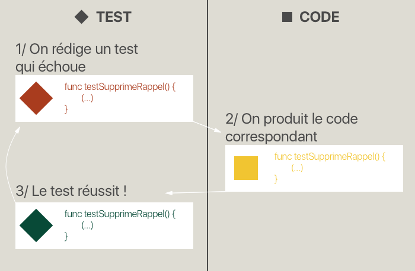
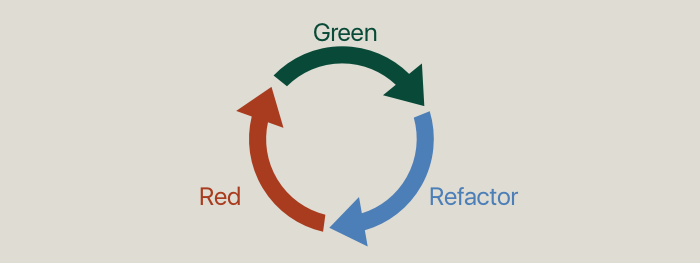

## Rédigez les tests avant le code

### Découvrez le Test Driven Development
Dans la partie précédente, vous avez découvert les tests et admettons-le : ça a un peu changé votre vie ! Désormais, vous avez un outil qui vous permet de vérifier que le code que vous avez écrit est correct. Et ça, c'est puissant !

Mais nous pouvons faire encore mieux. Et si nous étions sûrs que notre code fonctionne sans bug au moment même ou est en train de l'écrire ? Ça vous paraît être de la science-fiction ?
Et non je suis très sérieux, et c'est même assez simple.

Si les tests nous assurent que notre code est correct, et qu'on veut pouvoir que tout nouveau code fonctionne avec certitude dès son écriture, c'est qu'il faut rédiger les tests...

> **:question:** AVANT LE CODE ??!!!!

Eh oui ! Que vous êtes bons ! Ne faites pas cette tête-là pour autant et laissez-moi vous expliquer.

#### Comment ça marche

Rédigez les tests avant le code, on appelle ça du *Test Driven Development*, souvent abrégé TDD (Développement motivé par les tests en français).  

> **:question:** Comment ça marche ?

Prenons un exemple : vous travaillez sur une application de rappels. Votre boss vient vous voir et vous demande de rajouter une fonctionnalité. Il veut que l'on puisse supprimer un rappel.

Voyons comme réagissent un développeur normal et un développeur en TDD :

##### En développement normal
Vous vous exécutez immédiatement et créez la fonctionnalité désirée. Une fois que vous vous êtes assurés manuellement que ça fonctionne, vous écrivez le ou les tests correspondants, car vous êtes un bon développeur qui teste son code.

##### En TDD
Vous écrivez immédiatement un test qui contrôle que la suppression d'une note se passe bien. Forcément le test échoue, car vous n'avez même pas créé la fonction correspondante. Donc vous n'avez plus qu'une idée en tête : réparer le test. Pour cela, vous développer la fonctionnalité demandée par votre boss. Et sans aucun test manuel, vous savez qu'elle fonctionne, car votre test est passé au vert !

#### L'intérêt
Quel est l'intérêt de cette technique ? Il y a plusieurs bonnes raisons de faire du TDD et je vais essayer de vous en proposer quelques-unes :

##### Penser à ce que le code doit faire 🤔
En rédigeant d'abord votre test, vous êtes contraint de réfléchir à ce que vous voulez que votre code fasse avant de le rédiger. Vous avez une idée claire du résultat à obtenir, ce qui va vous faire gagner du temps.

##### Travailler dans un environnement de code sain 🍀
Lorsque vous développez en TDD, vos tests sont constamment présents et à jour. Donc vous évoluez dans votre code avec confiance, car vous savez que si vous causez le moindre bug, un test vous le dira avant même que vous vous en rendiez compte.

##### Être concentré 👩‍💻
Il est facile de se disperser lorsqu'on développe. Il y a souvent beaucoup de choses à faire et on peut s'éparpiller ce qui peut causer au mieux une perte de temps et de la fatigue et au pire des bugs !

Lorsque vous développez en TDD, vous rédigez un seul test qui échoue et ensuite vous le fixez en développant la fonctionnalité correspondante. Donc vous faites une seule chose à la fois.

Si vous commencez à vous disperser, vos tests vous le diront, ils deviendront rouges les uns après les autres. Et votre cerveau est câblé pour ne pas aimer le rouge donc vous allez vous concentrer pour réparer ce petit test rouge et ne pas en créer d'autres. Et ensuite seulement, vous aurez envie de passer au reste.

##### Validation automatique de votre code ✅
Lorsque vous développez votre fonctionnalité, vous n'avez même pas à tester manuellement. Vos tests s'en occupent automatiquement pour vous !
Pas de validation manuelle à faire.

##### Les tests sont importants ⚠️
Votre cerveau a l'habitude de considérer comme plus important ce qui vient en premier. Vous êtes faits comme ça. Donc en écrivant vos tests en premier, vous leur donnez une vraie valeur. Et cela vous assure qu'ils seront toujours de qualité.

> **:question:** Mais du coup le reste du code va perdre en qualité ?

Bien sûr que non, vous ne risquez pas de délaisser le reste du code ou même de ne pas le développer, car cela impactera directement votre app et donc vos clients, vos utilisateurs, votre boss et donc en définitive vous ! Ce n'est pas vrai pour les tests, il y a un risque que vous les oubliiez et ils sont trop importants pour ça ! Alors, faites-les en premier !

#### En résumé
- Le Test Driven Development (TDD) est une technique de développement très puissante dans laquelle *on écrit les tests avant le code*.
- Concrètement on écrit un test qui échoue, puis on écrit le code correspondant, ce qui répare le test.
- Les intérêts du TDD sont :
	- Penser à ce que l'on fait
	- Travailler dans un environnement de code sain
	- Être concentré
	- La validation automatique du code
	- Ne pas oublier les tests

Dans le prochain chapitre, nous allons apprendre la méthode "Red, Green, Refactor" qui nous permet de travailler en Test Driven Development.

### Appréhendez la méthodologie Red Green Refactor
Maintenant que vous savez ce qu'est le Test Driven Development, nous allons pouvoir parler de la méthodologie à appliquer pour faire proprement du TDD.

#### Présentation de la méthode
Cette méthode s'appelle "*Red, Green, Refactor*" et elle est composée de 3 étapes que l'on va répéter inlassablement !

##### Red
La première étape, c'est la **rédaction d'un test**. Le code correspondant n'existe pas encore donc **ce test va échouer** et donc rester rouge...

##### Green
La seconde étape, c'est **l'écriture du code**. Dans cette étape, on ne se concentre que sur une seule chose : faire passer notre test.

Peu importe le style du code, s'il y a un peu de répétitions ou si ce n'est pas parfait, votre seul objectif à cette étape, c'est de **faire passer le test au vert**.

##### Refactor
Pendant cette dernière étape, on **refactorise notre code et nos tests**. L'objectif ici est d'avoir un oeil attentif aux améliorations que nous pouvons faire. Est-ce qu'il y a du code dupliqué ? Est-ce que ma classe a bien une seule responsabilité ? Est-ce que ma méthode fait bien ce que son nom indique qu'elle fait ?

C'est l'occasion d'améliorer la qualité de votre code !

#### Faites des petits pas !
Avec cette méthode, vous allez donc parcourir un cycle. Dès que vous atteignez la dernière étape, vous revenez à la première.

Ce cycle, il doit être très court. En gros, une fois que vous maîtrisez la méthode, vous ne devriez pas mettre plus de 5 minutes à parcourir le cycle !

> **:question:** 5 minutes ?! Mais on ne peut rien coder en cinq minutes !

Si ;) ! Vous pouvez coder des toutes petites choses. Et c'est justement le but de la méthode, chaque cycle représente un tout petit pas. Souvent, votre premier cycle sera d'écrire un test qui contrôler l'existence d'une classe puis vous créerez la classe.

**L'idée c'est d'écrire le test qui vous permet de rédiger le minimum de code possible !**

> **:question:** Mais c'est ridicule ! On n'a pas besoin d'un test pour simplement créer une classe.

C'est sûr que ça parait un peu bizarre au début mais vous vous y ferez vous verrez ! L'avantage de faire des tout petits pas, c'est que le risque d'erreur est quasi inexistant et vous avancez du coup toujours en étant couvert.

> **:warning:** C'est comme si vous escaladiez une paroi et que toutes les 5 minutes, vous installiez un filet derrière vous. Vous ne risquez pas de chuter de bien haut ! Il vaut mieux ça qu'un filet installé toutes les 2 heures !

> **:question:** OK mais si je fais des tests toutes les 5 minutes pour tester des tout petits trucs, je vais avoir des tonnes de tests !

Eh non ! Car il y a la troisième étape : *refactor*. Cette étape sert aussi à refactoriser vos tests. Au fur et à mesure, certains vont devenir inutiles. Par exemple, le test qui permet de tester l'existence de votre classe va vite être inutile, car vous allez utiliser la classe dans d'autres tests, donc ces autres tests confirment que la classe existe.

Autrement dit, votre suite de tests va évoluer en continu, mais à chaque instant, elle reflète exactement ce que fait votre code !

#### Avantages
Pour finir de vous convaincre du bien-fondé de cette méthode, je vous propose de vous donner deux avantages de la méthode :

##### Vous n'êtes pas parfait !
Il faut l'admettre, dans une grande majorité des cas, le code que vous écrivez en premier n'est pas parfait. Il mérite d'être revu, corrigé, réorganisé. En même temps, personne ne joue un morceau de guitare parfaitement du premier coup ou n'écrit un roman d'une traite. En développement, c'est pareil.

Le problème, c'est que les développeurs n'ont pas toujours en tête de revenir sur leur code pour l'améliorer. Or c'est essentiel, car vous allez vivre avec votre code ! En suivant cette méthode, vous vous donnez une occasion de le refactoriser toutes les 5 minutes ! Vos chances d'écrire du code de qualité sont largement démultipliées !

> **:information_source:** C'est un peu comme la vaisselle, personne n'aime la faire et pourtant il le faut. Avec cette méthode, vous faites la vaisselle dès que vous avez sali une cuillère. Votre cuisine reste toujours propre !

##### Refactoriser dans le vert
La refactorisation arrive après l'étape *green*. Tous les tests passent ! Avec cette méthode, vous ne refactorisez que dans un code testé et fonctionnel. Donc au moindre problème causé par la refactorisation, vos tests vous alerteront. Vous repasserez à l'étape *red* et n'aurez plus qu'à dérouler tranquillement : *green*, puis *refactor* !

**Cette méthode vous apprend à ne refactoriser que *de vert à vert***.

#### En résumé
- La méthode *Red, Green, Refactor* se compose de trois étapes :
	- *Red* : On écrit un test qui échoue.
	- *Green* : On résout le test en écrivant le code correspondant.
	- *Refactor* : On refactorise le code ET les tests.
- Le cycle *Red, Green, Refactor* doit être le plus court possible. L'objectif est de rédiger le minimum de code possible à chaque cycle.

La méthode *Red, Green, Refactor*, est un peu plus qu'une méthode, c'est une tout autre manière de développer et je vous garantis que vous allez adorer ! Dans le prochain chapitre, nous allons utiliser cette méthode pour rajouter une fonctionnalité à notre application : le *tie break* !

### Ajoutez une fonctionnalité en TDD
Il est grand temps de laisser la théorie de côté ! Je vous ai suffisamment parlé du Test Driven Development pour que vous rêviez de vous y frotter !

Et c'est précisément ce que nous allons faire dans ce chapitre !

#### Présentation de la nouvelle fonctionnalité
Les tennismen l'auront sans doute remarqué, notre façon de compter les scores n'est pas correcte. Ou plutôt, elle est incomplète ! Nous n'avons pas prévu le ***Tie Break***.

Au Tennis, gagner 6 jeux n'est pas suffisant pour remporter le set. Il faut aussi deux jeux d'écarts. Donc si on mène 6-4 le set est gagné, mais si on gagne 6-5, le set n'est pas terminé et il y a deux cas de figure :
- Le joueur 1 gagne et on passe à 7-5. Le set est remporté par le joueur 1.
- Le joueur 2 gagne et on pase à 6-6. Dans ce cas, on va jouer un ultime jeu pour départager les deux joueurs. Et ce jeu, on l'appelle le *Tie Break*.

Les règles du *Tie Break* sont différentes d'un jeu classique. Chaque balle jouée vaut un point. Le premier arrivé à 7 avec deux points d'écart gagne le jeu. S'il n'y a pas deux points d'écart, le jeu peut continuer jusqu'à ce que mort s'ensuive !

Je vous propose d'implémenter cette nouvelle fonctionnalité en TDD en suivant la méthodologie *Red, Green, Refactor*.

#### Place à la vidéo !

Exceptionnellement, la suite de ce chapitre n'est pas retranscrite textuellement. À la place, je vous propose une démonstration de live coding dans lequel vous me verrez développer la nouvelle fonctionnalité de A à Z en Test Driven Development !

> **:information_source:** Le texte de cette vidéo serait bien trop long et ce format ne s'adapte pas du tout à ce genre de démonstration live. Par ailleurs, si vous n'avez jamais vu un t-shirt changer de couleur, c'est à ne pas rater !

[VIDEO LIVE CODING]

#### En résumé
J'espère que vous avez apprécié cette démonstration et qu'elle vous a convaincu de la puissance du Test Driven Development ! Souvenez-vous de bien répéter le cycle *Red Green Refactor* sans oublier aucune étape. À chaque fois, l'objectif est de trouver le plus petit test possible qui permet d'avancer.

C'est un gros changement dans la façon de développer. N'hésitez pas à pratiquer le Test Driven Development le plus possible et vous finirez par vous demander comment vous faisiez avant !

### Exprimez vos objections
Les tests en général et le TDD en particulier ont tendance à bousculer un peu les développeurs au début. On n'en comprend pas vraiment la puissance avant de s'y être frotté pendant un petit moment. Résultat, cela laisse place à quelques objections que vous avez sûrement envie de formuler !

Ici, je me propose de répondre aux doutes que vous avez peut-être ressentis à la découverte des tests. Alors, allez-y shootez vos meilleures questions !

#### Un petit jeu de question-réponse
> **:question:** Les tests ralentissent le développement, car ça fait plus de code à rédiger.

Oui si vous n'allez travailler qu'une heure sur ce projet...

Ensuite, les tests vous font gagner beaucoup de temps. **Vous allez diminuer drastiquement le temps passé à chercher les bugs** d'une part. D'autre part, vous travaillerez toujours sur du code propre grâce à la refactorisation que l’on peut faire sans risque. Donc **le code est plus facile à lire** et comme vous le savez maintenant, la majorité du travail de développeur consiste à lire du code. Donc votre code étant plus facile à lire, le développement est plus rapide.

> **:question:** Oui mais refactoriser c’est retravailler, ce ne serait pas mieux d’avoir le code correct du premier coup ?

Prévenez-moi quand vous savez comment on fait ça. Mais je pense que ce n’est pas possible ! **Rédiger du code est un processus créatif. Et comme tout processus créatif, on a jamais l'oeuvre parfaite du premier coup.** Un peintre fais des esquisses avant de se lancer dans son oeuvre, un musicien répète ses musiques avant de les jouer parfaitement, un journaliste fais des brouillons avant de publier son article.

Le code est simplement soumis à la même règle, donc si vous souhaitez produire du code de qualité, vous devez refactoriser !

> **:question:** Les tests testent le code en production. Mais les tests sont aussi du code. Alors qui teste les tests ?

En voilà une bonne question ! Les tests et le code en production sont imbriqués étroitement. **Et donc ce qui teste les tests, c'est le code en production.**

C'est comme un château de cartes, certaines penchent vers la droite, c'est le code, d'autres vers la gauche, c'est le test. Chaque carte de test soutient une carte de code et inversement.

> **:question:** Je suis d'accord que les tests prouvent la présence de bugs quand ils sont rouges. Mais en revanche, une suite de test toute verte ne prouve pas l'absence de bug.

En effet, mais ce n’est pas notre but et d’ailleurs ce n’est pas faisable. On ne fait que créer un parachute pour ne pas avoir peur de changer le code. Et comme avec un parachute, il peut y avoir des accidents. Mais si cela permet d’avoir 99% de chance de ne pas en avoir, ça vaut le coup d’en avoir un sur le dos, non ?

> **:question:** Le TDD incite les gens à suivent des règles, mais pas à réfléchir.

Le TDD, c’est une discipline. La discipline permet dans le feu de l’action de gagner du temps en éliminant le besoin de prendre certaines décisions. Pour autant, il faut toujours prendre du recul pour analyser ce que l’on est en train de faire, si le code est efficace et clair et parfois même il faut savoir remettre en question la discipline. Donc oui, **le TDD vous permet d’éviter de réfléchir pour vous concentrer sur ce qui importe : l'architecture de votre code.**

> **:question:** Si on doit travailler avec un gros paquet de code qui n’est pas testé, comment fait-on ?

Bonne question ! Le problème, c’est que pour tester, il faut que le code soit bien organisé, découplé et testable. Et si ce n’est pas le cas, il faut refactoriser. Mais sans tests, on ne sait pas si notre refactorisation ne va pas casser quelque chose Donc pour tester, il faut refactoriser et pour refactoriser, il faut des tests. Quelle est la solution de ce problème ?

**Il faut trouver une partie du code que l’on peut tester sans changer trop de choses.** Ensuite, on utilise ces tests comme garant pour commencer une refactorisation qui va nous permettre de créer de nouveaux tests et en suivant cette logique on peut étendre la couverture de tests à toute la base de code. Idéalement, il faudrait commencer à tester au moment de rajouter une nouvelle fonctionnalité, comme ça on est sûr de ne rien casser et au fur et à mesure, on étend les tests.

> **:question:** On ne peut pas tester l’interface utilisateur !

En effet, il est difficile de tester l’interface utilisateur. Par exemple, on ne peut pas facilement tester qu’un bouton soit rouge ou vert. En revanche, on peut tester que le booléen qui décide de la couleur du bouton a la bonne valeur.

Pour cela, **il faut séparer la logique de l’affichage de l’affichage en lui-même**. Dans notre exemple, la logique qui donne la valeur au booléen ne doit pas avoir lieu dans la même classe que celle qui donne la couleur au bouton. En MVC, tout se fait dans le contrôleur donc on est coincé mais je vous invite à aller jeter un oeil à d’autres architectures comme le [MVVM](https://medium.com/yay-its-erica/dabbling-with-mvvm-in-swift-3-3bbeba61b45b), [VIPER](https://www.objc.io/issues/13-architecture/viper/) ou [Clean](https://clean-swift.com).

> **:question:** Mais tester, c’est difficile ! On est des programmeurs, pas des testeurs.

**Vous êtes avant tout des programmeurs professionnels et si vous ne faites pas de tests, c’est que vous ne l’êtes pas.** C’est un parti pris fort alors laissez-moi vous expliquer en détail les raisons qui le motive.

Un logiciel est un système extrêmement sensible. Je peux modifier une ligne de code au bon endroit et causer le crash de toute l'application. Il existe très peu de systèmes aussi sensibles. Si j'enlève un clou dans une maison, elle ne va pas s'effondrer. Si je tue une de vos cellules, vous n'allez pas mourir.

Il existe pourtant un système aussi sensible : la comptabilité. Une erreur de compatibilité peut causer la ruine d'une entreprise et mettre ses dirigeants en prison. Seulement cette science est bien plus âgée que l'informatique et donc elle a eu le temps de résoudre son problème d'hyper sensibilité.

Il y a 700 ans a été inventée la comptabilité à double entrée. En comptabilité à double entrée, tout est entré deux fois, du côté de l'actif et du côté du passif. L'actif et le passif suivent des logiques mathématiques très différentes. Mais à la fin, les deux valeurs du passif et de l'actif doivent être égales. Si elles ne le sont pas, il y a une erreur. Ce système permet donc de détecter les erreurs extrêmement rapidement avec une très grande certitude.

En programmation, ce sont les tests et le code qui forment une double entrée. Les deux ensemblent permettent de détecter très rapidement les erreurs et d'assurer la solidité globale du système.

Aucun comptable ne se passe de la double entrée. Est-ce que les programmeurs doivent être moins professionnels que les comptables ? Est-ce que leurs erreurs ont moins d’impacts sur l’entreprise ? Je pense que la réponse est non dans les deux cas.

Qui plus est, les comptables rentrent les données du côté de l’actif et du passif en même temps. C’est exactement ce que nous faisons en TDD.

#### En résumé
Quand vous partagez votre code à votre client ou à votre boss, vous devez être sûres de vous. Imaginez un cuisinier qui envoie son plat sans être sûr de l’avoir assaisonné correctement. Ce ne serait pas professionnel. Si le client trouve un bug, c’est que vous avez fait une erreur. Ça peut arriver mais ça doit être rare et l’occasion pour vous de remettre en question une partie de vos pratiques.

### Conclusion
Félicitations, si vous en êtes arrivés jusque là, c'est que vous avez compris l'importance du débogage et des tests unitaires !

Je vous avais promis un cours qui vous permettent de gagner en **autonomie** et d'apprendre à **rédiger du code propre** ! Et vous pouvez vous féliciter d'avoir fait un grand pas vers ces deux qualités essentielles pour devenir un excellent développeur !

#### En résumé
Dans ce cours, vous avez appris à **identifier et éliminer tout type de bugs**. Vous êtes maintenant capable de résoudre des erreurs à la compilation, à l'exécution et des erreurs métiers. En chemin, nous avons parlé de notions fondamentales de la programmation en général comme la pile d'exécution ou la compilation.
Vous avez également saisi l'importance d'une syntaxe uniforme et vous savez désormais utiliser SwiftLint pour automatiser l'analyse statique de votre code.

Ensuite, nous nous sommes attaqués aux **tests unitaires**. Vous avez appris à définir une stratégie de test et à organiser votre code pour le rendre testable. Nous nous sommes entraînés à rédiger des tests et au-delà de la technique, j'espère surtout que vous en avez compris l'intérêt.

Puis, vous vous êtes essayés au **Test Driven Development**. Si cette technique n'est pas encore naturelle pour vous, c'est normal ! Le TDD réinvente complètement votre façon d'approcher la programmation et forcément au début ce n'est pas agréable. Mais j'espère vous avoir convaincu de ses bienfaits !

> **:information_source:** Dans les prochaines semaines, astreignez-vous à programmer en TDD. Rapidement, vous serez plus à l'aise et ça deviendra beaucoup plus naturel.

#### Soignez vos tests
Je vous l'ai déjà dit mais je ne le dirais jamais assez : **vos tests vont vous faire gagner un temps fou.** Mais pour cela, il faut que vous ayez une confiance aveugle en eux. Et vous ne l'aurez qu'à condition de les traiter au moins aussi bien que le reste de votre code. Ce sont les deux parties de votre projet, alors elles doivent être aussi solides l'une que l'autre. Alors, réorganisez-les, factorisez-les si besoin, pensez votre structure de fichier. Bref, **soignez vos tests** !

#### Le mot de la fin
J'espère que vous avez eu autant de plaisir à suivre ce cours que moi à le concocter :) . Je considère que c'est l'un des plus importants si vous souhaitez devenir développeur iOS. Donc n'hésitez pas y revenir pour une piqûre de rappel autant que nécessaire.

En attendant, je n'ai plus qu'à vous laisser avec le mot de la fin, et le mot de la fin évidemment c'est :

> Not much to add if only to add some links to extra reading material/books/blogs such as uncle bob martin et al. all in all a very good article.
