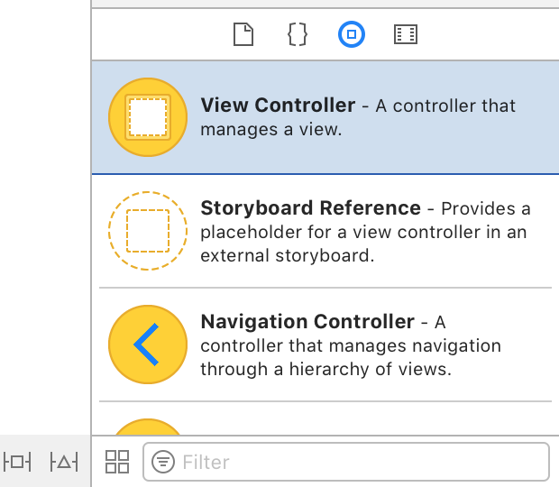
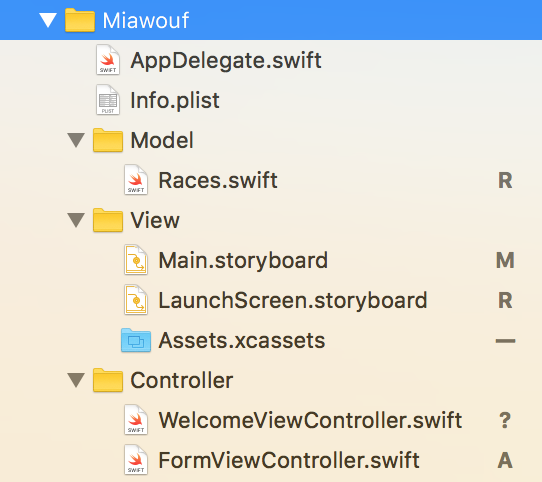
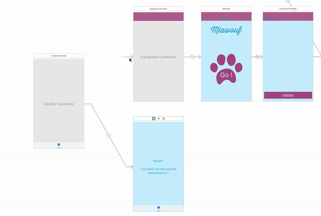
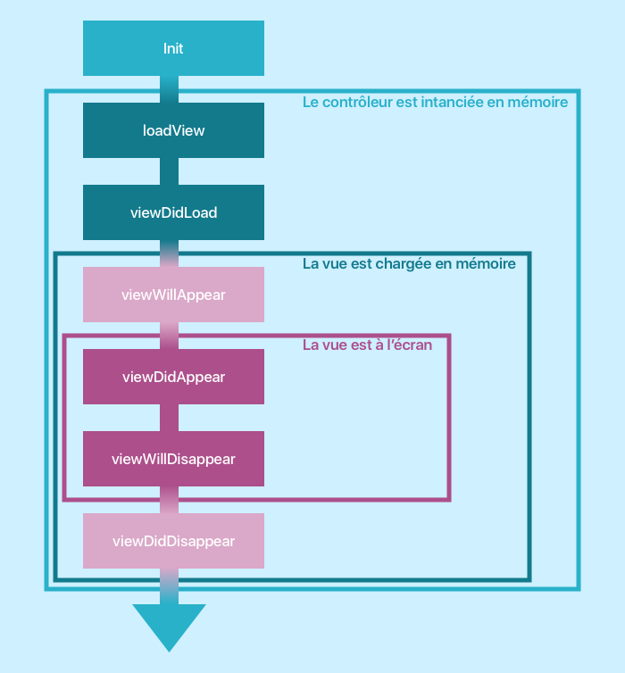

# Gérez la navigation et les formulaires en iOS

## Naviguez dans votre application

### Tirez le meilleur de ce cours

Bonjour et bienvenue dans ce cours sur la navigation et les formulaires en iOS ! Ensemble, nous allons découvrir comment créer plusieurs pages dans une application, comment organiser la navigation et la communication entre elles. Vous apprendrez aussi à créer des formulaires en vous appuyant sur des composants comme les champs de texte, les boutons switch, les sélecteurs et d'autres. Nous verrons même comment gérer le clavier et présenter des alertes aux utilisateurs.

Et bien sûr, j'ai prévu quelques surprises et autres bonus en chemin !


#### Prérequis

Ce cours fait partie de tout [un parcours sur le développement d'application iOS](https://openclassrooms.com/paths/developpeur-se-dapplication-ios). Je vous suggère fortement d'y jeter un oeil si vous souhaitez vous former et trouver un emploi en tant que développeur iOS.

> **:warning:** Pour profiter au mieux de ce cours, assurez-vous que vous maîtrisez a minima les compétences présentées dans les cours suivants :
- [Introduction à iOS : plongez dans le développement mobile !](https://openclassrooms.com/courses/introduction-a-ios-plongez-dans-le-developpement-mobile)
- [Apprenez les fondamentaux de Swift](https://openclassrooms.com/courses/apprenez-les-fondamentaux-de-swift)
- [Approfondissez Swift avec la Programmation Orientée Objet](https://openclassrooms.com/courses/approfondissez-swift-avec-la-programmation-orientee-objet)
- [Développez une application iPhone avec le modèle MVC](https://openclassrooms.com/courses/concevez-une-application-iphone-avec-le-modele-mvc)

#### Miawouf
Dans ce cours, nous allons développer une application de rencontre... pour chien et chat ! Cette application est baptisée Miawouf. Et nous allons nous concentrer sur la phase d'inscription. Car elle nous suffit pour découvrir tout ce qui est prévu dans ce cours !

> **:information_source:** Cette étape est présente dans 99% des applications donc autant que vous vous frottiez à l'exercice au plus vite !

Miawouf est divisée en deux, une inscription pour les chiens et une pour les chats. Et l'inscription se fait en trois pages :
- une page d'accueil
- un formulaire d'inscription
- une page de confirmation


Pour construire cette application avec moi, je vous ai préparé un petit dossier contenant les images dont vous allez avoir besoin pour le cours. Vous pouvez le télécharger [ici](https://s3-eu-west-1.amazonaws.com/static.oc-static.com/prod/courses/files/Parcours+DA+iOS/Cours+7+-+Plusieurs+pages/App+Assets.zip).

> **:information_source:** Vous y trouverez aussi un fichier `Races.swift`, il contient deux listes non exhaustives de races de chiens et de chat sous forme de tableau Swift. On en aura besoin pour le cours.

Dans ce cours, il n'y a pas de projet Xcode à télécharger donc je vous invite à créer un projet vide, en choisissant le template le plus simple : *Single Page Application*. Vous pouvez déjà glisser les images et icônes dans les assets du projet et le fichier Races.swift dans votre navigateur de fichier.

> **:warning:** Si vous ne vous rappelez plus comment on gère les images dans un projet Xcode, vous pouvez revenir jeter un oeil [ici](https://openclassrooms.com/courses/concevez-une-application-iphone-avec-le-modele-mvc/gerez-les-images).

Et voilà vous êtes fin prêt à suivre ce cours.

#### Rappel sur le MVC

Avant de se lancer tête baissée dans nos différents sujets, je voudrais prendre un petit moment pour parler évidemment de MVC :D !

> **:warning:** Si le concept MVC ne vous dit rien, rendez-vous [ici](https://openclassrooms.com/courses/concevez-une-application-iphone-avec-le-modele-mvc).

Pour rappel, en MVC, le modèle et la vue n'ont pas connaissance de l'existence l'une de l'autre et le contrôleur et le seul à pouvoir s'adresser directement à l'un et l'autre.


Le modèle utilise généralement des notifications pour s'adresser au contrôleur et la vue utilise des actions. Ces deux modes de communications sont aveugles pour que la vue et le modèle puissent rester complètement indépendants du contrôleur.

#### Plusieurs MVCs
En iOS, un MVC correspond généralement à une page de l'application, ou en tout cas à un espace défini de l'écran. Donc pour chaque nouvelle page, on va avoir un nouveau MVC.

> **:question:** Mais du coup, comment communique-t-on entre MVC ?

Quelle question parfaite ! Vous commencez à saisir l'importance de l'architecture, c'est beau...

Je vais résumer cela en trois règles simples :

**1/ Une vue communique toujours avec un seul contrôleur.**


La gestion d'une vue n'est jamais répartie entre deux contrôleurs différents.

**2/ Un modèle peut-être utilisé par plusieurs contrôleurs**


À l'inverse de la vue, deux contrôleurs peuvent faire appel aux mêmes données. Par exemple, une classe du modèle peut gérer les utilisateurs et les informations concernant l'utilisateur ont des chances d'être utiles dans plusieurs pages. Donc, ce modèle peut être partagé par plusieurs contrôleurs.

**3/ Les MVCs communiquent entre eux via le contrôleur**

Deux vues ne peuvent pas communiquer entre elles. De toute façon, il faut bien comprendre qu'une vue, c'est l'esclave d'un contrôleur donc elle n'irait jamais prendre l'initiative de parler avec qui que ce soit :).

Ce sont donc les contrôleurs qui permettent de faire des liens entre MVC. **Mais lorsqu'un contrôleur s'adresse à un autre contrôleur, il le fait d'une façon aveugle et structurée comme s'il s'agissait d'une vue.**


Pour vous souvenir de ces trois règles simples, il suffit de se souvenir de la logique du MVC :
- Le modèle détient la logique, mais aussi les données de l'application. Donc ces informations doivent pouvoir être accessibles depuis plusieurs contrôleurs.
- Le contrôleur a pour rôle principal la communication entre le modèle et la vue, il est donc logique qu'il soit aussi le centre de communication vers les autres MVCs.
- La vue a pour seul rôle d'afficher ce qu'on lui demande, elle ne réfléchit pas et du coup n'est capable que de prendre les commandes d'un seul contrôleur. Il ne faut pas lui en demander plus !

Je pense que ça fait suffisamment de théorie pour le moment. Et si tout ça n'est pas parfaitement acquis, c'est normal. Tout va s'éclaircir lorsque vous verrez ce que ça donne concrètement dans le code ! Et ce dès le prochain chapitre, où nous allons ajouter une barre de navigation dans notre application !

### Ajoutez une barre de navigation

C'est parti ! On va tout de suite ajouter une barre de navigation qui va nous permettre, comme son nom l'indique, de naviguer entre plusieurs pages !

> **:question:** Oui, mais c'est quoi une barre de navigation ?

Ah oui, bien vu ! Alors une barre de navigation, c'est ça :


C'est la barre que vous avez très souvent en haut de votre application et qui vous permet de revenir à la page précédente. Souvent, elle contient un titre comme "*Light*" ici et parfois un ou plusieurs boutons comme le bouton `edit`.

C'est plus clair ? Alors, allons-y !

#### Faire place nette

Et pour démarrer vraiment de zéro, nous allons supprimer le `ViewController` qu'Xcode a déjà créé pour vous.

> **:information_source:** L'idée, c'est qu'à chaque page corresponds un contrôleur. Donc on va devoir créer plusieurs contrôleurs et donc on va leur donner des noms un peu moins génériques que `ViewController` pour pouvoir les identifier facilement.

Commencez par supprimer le fichier `ViewController.swift` en faisant clic droit puis *Delete*. Choisissez ensuite l'option `Move to trash` dans la popup.

Ensuite, rendez vous dans le storyboard et supprimez le ViewController qui s'y trouve. Votre storyboard ne contient plus rien ! On va pouvoir travailler sereinement !

#### Présentation de la classe UINavigationController
Pour ajouter une barre de navigation, il faut ajouter ce qu'on appelle un `UINavigationController`. Cette classe est un contrôleur. Et comme tout contrôleur qui se respecte, son rôle est de gérer une vue. Et pour un navigation controller, cette vue est un peu particulière. Elle est composée de deux sous-vues comme le présente le schéma ci-dessous :


La vue du `UINavigationController` contient une barre de navigation dont nous avons déjà parlé, et **une vue conteneur qui a pour but unique d'afficher une page de votre application.**

> **:warning:** On ne peut pas modifier cette vue conteneur, on peut simplement la remplir avec le contenu d'un autre `ViewController`.

**On peut se représenter le `UINavigationController` comme un cadre photo numérique qui contient en haut une petite barre de navigation et à l'intérieur des photos qui défilent, les unes après les autres.** Ces photos sont en fait des `ViewController` qui correspondent chacun à une page de notre application.

#### La pile de navigation

Dans notre navigationcontroller, les `ViewController` vont donc défiler en suivant une logique précise, celle d'une **pile**.

Lorsque vous passez de la page A à la page B, la page B vient se rajouter par-dessus la page A. Même chose, si vous passez à la page C, elle vient se mettre par dessus la page B. Et comme vous pouvez le voir dans le schéma ci dessous, cela forme donc une pile.


> **:warning:** Cela veut dire que lorsque l'utilisateur visualise la page C, les pages A et B sont toujours présentes dans la mémoire du téléphone. Elles sont seulement visuellement cachées. On en reparlera dans le chapitre sur le cycle de vie du contrôleur.

**Un navigation controller a donc pour rôle de gérer cette pile qui peut contenir en même temps plusieurs ViewController, mais n'en afficher qu'un seul à l'écran.**

Cela se traduit dans le code par la propriété `viewControllers` de la classe `UINavigationController` qui est un tableau de type `ViewController` et qui contient tous les contrôleurs présents dans la pile de navigation rangés par ordre de présentation.

#### Ajout du navigation Controller

Assez de théorie ! Ajoutons maintenant notre `UINavigationController`. Pour cela, il vous suffit de vous rendre dans la bibliothèque des objets en bas à droite et de sélectionner un UINavigationController.


Vous n'avez plus qu'à le faire glisser dans le storyboard et vous devriez obtenir ceci :


Sur la gauche, vous avez le navigation controller qui est déjà lié à un premier ViewController de type Table View Controller visible sur la droite. Ce deuxième contrôleur permet d'ajouter des listes et nous verrons cela dans un prochain cours donc vous pouvez le supprimer pour le moment.

#### En résumé
- Pour ajouter une barre de navigation, on utilise un navigation controller.
- Un navigation controller gère une vue qui contient une barre de navigation et une vue conteneur dans laquelle défile les pages de l'application.
- Un navigation controller a pour rôle de gérer une pile qui peut contenir plusieurs ViewController, mais n'en afficher qu'un seul à l'écran.
- On peut ajouter un navigation controller en le glissant depuis la bibliothèque des objets dans le storyboard.

Dans le prochain chapitre, nous allons créer la première page que présentera notre navigation controller !

### Créez votre première page

Dans le chapitre précédent, nous avons installé notre Navigation Controller dans le storyboard et nous avons supprimé le Table View Controller qui était proposé avec par défaut.

À la place, nous allons ajouter un `ViewController` tout simple dont vous avez l'habitude.

#### Ajout du rootviewcontroller

Vous pouvez trouver le `ViewController` dans la bibliothèque des composants :



Glissez le dans le storyboard à côté de votre navigation controller. Maintenant votre storyboard doit ressembler à ceci :


Il nous faut maintenant relier le navigation controller et notre view controller. L'idée, c'est de faire comprendre au navigation controller que le premier contrôleur à afficher, c'est notre contrôleur, ici à droite.

Pour faire cela, nous ressortons notre fameux *control drag* ! **Laissez la touche control enfoncée et faites un glisser-déposer depuis le contrôleur de navigation vers notre contrôleur**. La popup suivante apparaît :


Cette popup nous demande le type de relation que l'on souhaite créer entre les deux contrôleurs. Choisissez `rootviewcontroller` pour signifier que le contrôleur racine, le premier dans la pile de navigation, c'est le contrôleur que nous venions d'ajouter dans le storyboard.

Lorsque la connection est faite, elle est matérialisée par la flèche entre les deux contrôleurs et notre contrôleur est maintenant doté d'une jolie petite barre de navigation.


#### Personnalisez la barre de navigation

Il est temps maintenant de créer notre première interface dans le contrôleur que nous venons de rajouter. Le résultat final doit ressembler à ceci :


Vous avez toutes les images et connaissances nécessaires pour y arriver seul donc je vous laisse faire !

> **:information_source:** Tant qu'à faire, rendez l'interface responsive, c'est un bon réflexe à prendre ! ;)

> **:warning:** L'image de patte avec l'inscription "*Go !*" est un bouton ! Pour utiliser une image au lieu d'un texte pour un bouton, il faut supprimer le texte et ajouter l'image dans la propriété `Image` :  


Bien sûr, je ne vais pas vous laisser tout seul pour la customisation de la barre de navigation. Laissez-moi vous montrer !

Pour ajouter un titre dans la barre, sélectionnez dans le ViewController `Navigation Item` :


Puis dans l'inspecteur d'attribut, modifier la propriété `Title`.


Ensuite pour modifier l'aspect de la barre de navigation, cela se passe du côté du `UINavigationController` puisque, comme on l'a vu, c'est lui qui gère cette vue. Sélectionnez `Navigation Bar` dans le Navigation Controller.


Et ensuite, vous pouvez modifier tout ce que vous voulez du côté de l'inspecteur d'attribut, notamment la couleur de la barre avec la propriété `Bar Tint` et la couleur du titre avec la propriété `Title Color`.

Et voilà vous avez une belle barre de navigation ! :D

#### Créez une sous-classe de ViewController

> **:question:** OK c'est beau. Mais comment on va faire fonctionner ce contrôleur ? On a supprimé le fichier `ViewController.swift` !

Ah la boulette ! Ne vous inquiétez pas, tout était calculé ;) !

Je vous propose de créer un nouveau contrôleur. Pour cela, allez dans File > New > File... ou <kbd>cmd + n</kbd>. Choisissez ensuite `Cocoa Touch Class` puis cliquez sur *next*.


Ensuite, nommez votre classe `WelcomeViewController` et faites-en une sous-classe de `UIViewController`. Vous pouvez cliquer sur *next* puis *create* pour créer le fichier `WelcomeViewController.swift`.


Et voilà ! Votre fichier est créé et nous avons une nouvelle classe `WelcomeViewController` !

Il suffit maintenant de faire le lien avec notre contrôleur dans le storyboard. Pour cela, sélectionnez le contrôleur dans le storyboard. Puis, dans les utilitaires, ouvrez l'inspecteur d'identité (troisième onglet) :


Dans le champ `Class`, écrivez le nom de notre classe nouvellement créée : `WelcomeViewController`. Maintenant, notre contrôleur est de type `WelcomeViewController` et le lien entre le contrôleur dans le storyboard et celui dans le code est fait !


#### Le contrôleur initial

Nous avons bien travaillé ! Et je vous connais, c'est le moment où vous adorez lancer votre application dans le simulateur pour voir que tout marche bien. Alors, allez-y ! Vous n’allez pas être déçu... :)

> **:question:** Mais... Mais mon écran est tout blanc ! L'appli ne se lance pas.

Haha ! Quel coquin je fais à vous tendre des pièges comme ça ! Sacré moi ! :D

Il se trouve que lorsque votre application iPhone se lance, il lui faut savoir quelle page afficher en premier.

D'abord, elle recherche le bon storyboard. Dans notre cas, c'est facile, il y en a qu'un. Ensuite dans le storyboard, **elle recherche le contrôleur marqué comme étant le contrôleur *initial***. Par défaut, c'est celui qu'on a supprimé au début de chapitre précédent. Du coup, l'application ne trouve pas la page initiale et donc elle affiche un écran blanc.

> **:question:** Oups...

Mais pas de panique, on va régler ça. Ici, notre contrôleur initial, c'est le navigation controller. Sélectionnez-le dans le storyboard. Puis rendez-vous dans l'inspecteur d'attributs et cocher la propriété `Is Initial View Controller`.


Et voilà ! Vous pouvez vérifier que cela a fonctionné en lançant votre simulateur ou simplement en vérifiant qu'une flèche est apparue sur la gauche de votre navigation controller.


#### En résumé
- Avec un control drag, vous pouvez sélectionner le contrôleur racine de votre pile de navigation.
- Pour personnaliser la barre de navigation, il vous faut sélectionner la Navigation Bar de votre Navigation Controller. Et ensuite, ça se passe comme d'habitude dans l'inspecteur d'attributs.
- Quand vous créez un nouveau contrôleur, il faut le créer dans le storyboard et dans le code en créant une sous-classe de `UIViewController`. Ensuite, pour les relier, il faut utiliser le champ `Class` dans l'inspecteur d'identité.
- Votre storyboard doit contenir au moins un contrôleur *initial* qui sera la première page ouverte par votre application.

Dans le prochain chapitre, nous allons créer notre deuxième page et vous allez créer votre toute première expérience de navigation entre deux pages.

### Créez votre premier segue
Même si nous avons deux contrôleurs dans le storyboard : `NavigationController` et `WelcomeViewController`, cela ne fait jamais qu'une interface pour l'utilisateur ! Il est temps d'en rajouter d'autres et de parler de navigation !

#### Ajout de la deuxième page

Nous allons ajouter la deuxième page de l'application qui va contenir le formulaire d'inscription. Nous allons appeler le contrôleur correspondant `FormViewController`. Je vous laisse créer la classe correspondante puis faîtes glisser un contrôleur dans le storyboard et donner lui la classe `FormViewController` nouvellement créée. C'est exactement la même manipulation que pour le `WelcomeViewController` du chapitre précédent.

> **:warning:** On travaille en MVC, donc je vous suggère de créer des groupes de fichier dans votre navigateur pour refléter cette architecture. Votre structure de fichier doit ressembler à ceci :


Maintenant, nous allons construire la base de l'interface. Nous allons juste rajouter le bouton *Valider* en bas. Le résultat doit ressembler à ceci :


#### Vous avez dit segue ?

Nous allons maintenant créer une première navigation. Lorsque l'utilisateur appuie sur le bouton *Go !*, on doit passer à la page du formulaire d'inscription.

Pour cela, nous allons créer ce qu'on appelle un **segue**.

> **:information_source:** C'est un mot anglais à prononcer [segwe] ;). On pourrait le traduire par *transition* en français, mais transition a une autre signification en iOS. Donc pour éviter la confusion, on va gentiment garder *segue* !

**Un segue, c'est un objet dans le storyboard, qui permet de créer une transition entre deux pages.** Et c'est exactement ce dont on a besoin. Et pour le créer, nous allons faire.... un control drag !


Le control drag doit se faire **entre le bouton qui initie la transition**, ici notre bouton *Go !* **et le contrôleur qui doit être présenté**, ici notre `FormViewController`.

Allez-y !


Lorsque vous relâchez, une popup apparaît et vous propose plusieurs types de segues différents. Détaillons-les !

#### Présentation des différentes catégories de segue

Il y a 5 types de segues différents comme vous pouvez le voir sur la popup.


> **:information_source:** Les 2 derniers sont marqués *deprecated* donc cela signifie qu'ils ne sont plus utilisés que pour des versions anciennes d'iOS. Les 5 au-dessus les remplacent.

Et pour vous expliquer qui est qui, je vous ai fait des super gifs !

> **:question:** En tout cas, c'est pas la modestie qui va t'étouffer...

Ma pause déjeuner y est passée donc un peu de respect ;) ! Bref, les voici :

##### Show


Le segue Show est le plus simple, **il ajoute tout simplement une page par dessus la précédente en la rajoutant sur la pile de navigation**. Il vient avec des petits trucs cool :
- L'animation que vous pouvez admirer ci-dessus
- Un bouton de retour dans la seconde page
- Un geste : si vous glissez votre doigt depuis le bord droit vous revenez à la page précédente.

> **:information_source:** Tout cela est contenu avec le segue, c'est compris dans le prix ;) ! Et vous n'avez pas à rajouter une ligne de code pour que ça fonctionne !

##### Show Detail


Sur iPhone, c'est exactement le même que *Show*. **Mais sur iPad, la deuxième page est présentée sans remplacer la précédente en se positionnant à sa droite**.

> **:information_source:** On appelle ce genre de présentation *master-detail*. Le master, c'est la liste à gauche qui décide ce qu'on affiche, le détail c'est le contenu qui se trouve à droite.

Ce segue est donc très pratique pour faire des applications qui s'adaptent sur un iPad !

##### Present Modally


Avec ce segue, que l'on appelle *Modal*, vous pouvez choisir plusieurs animations de transitions comme celle que vous avez ci-dessus ou une apparition en transparence ou d'autres. Sur un iPad, en général, la nouvelle page ne prend pas tout l'écran et elle obscurcit la page derrière.

Contrairement au Show, **ce segue ne comprend pas un moyen de revenir en arrière**. Il faut créer son propre au bouton. Par ailleurs, il n'y a plus de barre de navigation. Donc même si techniquement, ce segue rajoute une vue à la pile de navigation comme les autres, d'un point de vue utilisateur, il interrompt le flux de navigation.

##### Present As Popover


Sur iPhone, vous obtiendrez par défaut un segue *Present Modally*. Mais sur iPad (ou sur iPhone si vous changez le réglage), vous obtiendrez **une popup accrochée visuellement à l'élément d'interface qui l'a appelé**.

##### Custom

Comme son nom l'indique, vous pouvez créer vos propres segues pour imaginer des transitions spectaculaires !

> **:information_source:** Si vous vous sentez de créer un custom segue, je vous recommande cette excellente [vidéo](https://www.youtube.com/watch?v=jn-93qElOT4) (en anglais...). Et si vous voulez aller plus loin et apprendre à faire des transitions complexes entre deux vues, je vous recommande [ce tutoriel](https://www.raywenderlich.com/170144/custom-uiviewcontroller-transitions-getting-started) (anglais aussi).

##### Attention !

> **:warning:** Si vous essayez de lancer un segue de type Show, mais que vous n'avez pas mis de Navigation Controller préalablement, vous obtiendrez un segue de type Present Modally, car sans Navigation Controller, vous n'aurez pas de pile ni de barre de navigation. N'oubliez donc pas le Navigation Controller !

#### Ajout des segues

##### Segue show
Il ne nous reste plus, après cette parenthèse théorique, qu'à ajouter notre segue. Faîtes votre control drag depuis le bouton *Go !* vers le `FormViewController` et dans la popup, choisissez le segue `Show`.

Vous constatez qu'une barre de navigation est apparue sur le contrôleur et le segue est matérialisé par une flèche entre les deux.


Vous pouvez tester l'interaction dans votre simulateur et ça marche ! Pas plus compliqué
qu'un control drag !

##### Segue modal

Pour le plaisir, je vous propose qu'on se rajoute une troisième page. Cette page sera affichée lorsqu'on appuie sur le bouton *Valider* du `FormViewController` et elle informera l'utilisateur que son inscription a été prise en compte avec succès.

Comme d'habitude, vous allez créer une classe que l'on va appeler cette fois `SuccessViewController`, glisser un troisième ViewController dans le storyboard et lui donner la classe `SuccessViewController`.

Ensuite, nous allons juste ajouter un label pour informer l'utilisateur. Je vous laisse faire et ça donne ça :


Maintenant que notre troisième interface est prête, nous allons créer le segue entre le bouton Valider du `FormViewController` et le `SuccessViewController`. Toujours pareil : avec le control-drag. Mais cette fois-ci, je vous suggère de choisir *Present Modally*. Et voici notre storyboard finalisé :


> **:information_source:** Je positionne le dernier contrôleur au-dessus pour signifier qu'il interrompt l'expérience de navigation de gauche à droite à cause du segue modal.

Vous remarquez en lançant l'application que votre troisième page arrive avec une transition depuis le bas de l'écran. Mais elle ne contient ni barre de navigation ni bouton retour. Donc on est coincé sur cette interface ! Nous allons voir dans le prochain chapitre comment revenir en arrière.

#### En résumé
- Un segue, c'est un objet dans le storyboard, qui permet de créer une transition entre deux pages.
- Il existe 5 types de segues : Show, Show Detail, Present Modally, Present As Popover, Custom. Choisissez-les avec précaution !
- Pour créer un segue, on fait un control-drag depuis un bouton vers la page à afficher.

### Revenez en arrière !
Malgré le titre de ce chapitre, soyez bien certains que vous allez de l'avant dans vos connaissances en navigation iOS. Nous allons apprendre à revenir en arrière dans la pile de navigation d'abord d'un cran puis de plusieurs d'un coup !

#### Quittez le succès !

Notre `SuccessViewController` est bien beau, mais quand on atterrit dessus, on ne peut plus en partir ! Il n'y a pas de bouton retour ! Cela est dû au segue *Present Modally* que l'on a choisi pour afficher cette page.

Qu'à cela ne tienne, nous allons le créer ! Rajoutez un bouton en haut à gauche sur l'interface. Je vous suggère d'y mettre juste une croix. C'est suffisant pour qu'on en comprenne le sens.


Nous allons maintenant créer une action. Je vous suggère de la nommer `dismiss`. Car son rôle va être de faire disparaître la page.

> **:information_source:** Rappel : pour créer une action, il vous suffit de faire un control-drag depuis le bouton vers le code. Rafraîchissez-vous la mémoire  [ici](https://openclassrooms.com/courses/introduction-a-ios-plongez-dans-le-developpement-mobile/creez-votre-premiere-action).

Notre action étant créée, nous allons pouvoir l'implémenter. Et ça va être très simple, nous allons juste utiliser une méthode de `ViewController` qui s'appelle... `dismiss` ! Vous pouvez écrire ceci dans votre action :

```swift
@IBAction func dismiss() {
	dismiss(animated: true, completion: nil)
}
```

La méthode `dismiss` prend deux paramètres :
- `animated` : si le paramètre est à `true`, la transition sera animée. C'est en général l'animation inverse de l'animation d'apparition de la page.
- `completion` : c'est un block qui vous permet d'exécuter du code lorsque la page a disparu au cas où vous ayez besoin de faire quelque chose de spécifique à ce moment-là.

Et c'est tout ! Vous pouvez tester dans le simulateur et ça marche, la vue disparaît lorsqu'on appuie sur la croix !

#### Deux techniques de disparition

Vous savez maintenant utiliser `dismiss` pour faire disparaître programmatiquement un contrôleur. Mais sachez qu'il y a deux techniques différentes et cela dépend du segue que vous avez utilisé.

On a vu qu'il y a plusieurs types de segues et on peut les regrouper en deux groupes :

| Push        | Modal              |
|-------------|--------------------|
| Show        | Present Modally    |
| Show Detail | Present As Popover |

**Les transitions de type Modal sont régies par les ViewController eux-mêmes**. Dans ce cas-là, on peut directement utiliser la méthode `dismiss` comme on vient de le faire.

**Les transitions de type Push ne sont possibles qu'en présence d'un Navigation Controller** car c'est lui qui sait gérer ce genre de transition. C'est la raison pour laquelle il y a une barre de navigation quand on utilise ce genre de segue. Du coup, programmatiquement, c'est le Navigation Controller qui va avoir la responsabilité de faire disparaître le contrôleur et on va écrire la commande suivante.

```swift
navigationController?.popViewController(animated: true)
```

`navigationController` est une propriété de `ViewController`. C'est un optionnel d'où le point d'interrogation. Et le paramètre `animated` a le même rôle que dans dismiss.

J'en profite aussi pour vous parler de la navigation dans le code (si on n'utilise pas les segues du storyboard). Et je vous résume tout ça dans ce schéma :


> **:warning:** Inutile de vous accrocher à le retenir, mais souvenez-vous que **tout ce qu'on peut faire dans le storyboard a un équivalent dans le code** ! Par ailleurs, ceci est un résumé, mais il y a des méthodes plus précises, mais vous ne devriez pas en avoir besoin dans 99% des cas.

#### Revenir au début
Pour l'instant, nous n'avons parlé que de navigation d'une page à l'autre. Mais ce serait pratique d'avoir un bouton dans notre dernière page qui nous ramène tout au début pour lancer l'inscription pour un deuxième chien par exemple !

Commençons par créer ce bouton "Inscrire un autre chien". Je vous laisse faire, voici l'objectif :


C'est bon ? Alors, continuons !

La première idée qui vient c'est de créer un segue depuis notre bouton vers la première page. Mais ça ne va pas marcher. Souvenez-vous les pages sont empilées les unes sur les autres comme ceci :

|Pile   |
|-------|
|Success|
|Form   |
|Welcome|

Si on crée un segue qui revient à la première page, on rajouterait en fait la première page à nouveau dans la pile :

|Pile   |
|-------|
|Welcome|
|Success|
|Form   |
|Welcome|

Et la navigation forme un cycle infini et n'est plus compréhensible ! À la place, il faut ôter les pages les unes après les autres. Mais ici, nous voulons enlever deux pages d'un coup pour obtenir ceci :

|Pile   |
|-------|
|Welcome|

Le problème, c'est que les segues ne peuvent que retirer une page à la fois. Nous allons devoir utiliser un type spécial de segue : les **unwind segues**.

##### Créer un unwind segue

La particularité de ses segues, c'est qu'ils peuvent vous mener n'importe où dans votre application en respectant la pile de navigation !

Ils fonctionnent comme le tir à l'arc. Il faut d'abord créer une cible sur la page à laquelle on veut revenir, ici `WelcomeViewController`. Puis on lance une flèche vers cette cible.


Alors, créons d'abord la cible. Pour cela, il faut se rendre dans le code du contrôleur qu'on cherche à atteindre, ici `WelcomeViewController` et rajouter le code suivant :

```swift
@IBAction func unwindToWelcome(segue:UIStoryboardSegue) { }
```

Oui cette méthode est vide ! Elle ne sert qu'à déclarer le contrôleur comme cible potentielle d'un unwind segue.

> **:information_source:** Le nom `unwindToWelcome` peut bien sûr être changé, mais ne touchez pas au reste de la méthode ;).

> **:information_source:** Cette méthode sera exécutée lorsqu'on sera revenu à l'interface Welcome. Donc vous pouvez écrire du code à l'intérieur, si vous avez besoin d'effectuer une action à ce moment-là.

Maintenant, il faut lancer la flèche et pour cela, il faut faire... un control drag ! Il doit démarrer du bouton responsable de lancer la transition vers l'icône exit en haut du contrôleur.


Quand vous lâchez, vous verrez une popup contenant la méthode que nous venons de créer dans `WelcomeViewController` ! Sélectionnez-la et... c'est terminé !


Vous pouvez tester et constater que le bouton ramène bien à la première page en supprimant ainsi les pages 2 et 3 de la pile de navigation en une fois !

#### En résumé
- Lorsqu'on travaille avec des segues de type *Modal*, on doit créer un bouton pour revenir en arrière.
- On utilise la méthode `dismiss` pour faire disparaître une vue créée par un segue modal.
- Le navigation controller est responsable de la navigation d'un segue de type *Push*.
- Les unwind segues permettent de sauter plusieurs pages dans la pile de navigation. Il faut d'abord créer une cible sur la page à atteindre puis créer le segue vers cette cible en utilisant l'icône *Exit*.

Dans le prochain chapitre, nous allons parler des autres modes de navigation en iOS.

### Ajoutez une barre d’onglets
Jusqu'à présent nous avons parlé d'un seul mode de navigation avec `UINavigationController`. Mais il est utile que vous connaissiez les autres pour pouvoir les utiliser dans vos applications !

#### Différents modes de navigations
Il existe 4 modes de navigations dans en iOS :
- Barre de navigation avec `UINavigationController`
- Barre d'onglets avec `UITabBarController`
- Côte à côte avec `UISplitViewController`
- Pagination avec `UIPageViewController`

Nous avons déjà étudié le premier et dans ce chapitre nous allons nous intéresser au second. En attendant, je vous propose de parcourir rapidement les différences entre chacun.

#### Navigation

C'est ce qu'on a vu jusqu'à présent. Les contrôleurs forment une pile de navigation et une barre de navigation permet de revenir en arrière en *dépilant* les pages.


#### Barre d'onglets

La barre d'onglets se situe en bas et est composée de différentes icônes. En général, à chaque icône correspond une section différente de l'application et on peut naviguer entre elles en cliquant sur l'icône correspondante.


##### Côte à côté

On en a déjà un peu parlé, lorsqu'on a mentionné le segue `Show Detail`. C'est le type de navigation ou l'interface est divisée en deux contrôleurs, l'un est le `master` et l'autre est le `detail`.

C'est très utile lorsqu'on a une liste d'éléments à montrer et qu'on veut visualiser le détail sans quitter la liste.


> **:information_source:** Nous ne verrons pas cela ensemble, je vous suggère ces deux tutoriels si vous souhaitez aller plus loin : [ici](http://nshipster.com/uisplitviewcontroller/) ou [là](https://www.raywenderlich.com/173753/uisplitviewcontroller-tutorial-getting-started-2).

##### Pagination

Dans ces interfaces, les pages sont les unes à côté des autres et on peut passer de l'une à l'autre en glissant de gauche à droite. En général, des points en bas permettent de situer l'utilisateur.

C'est souvent utilisé dans les tutoriels introductifs des applications.


> **:information_source:** Nous ne verrons pas cela ensemble, je vous suggère ce [tutoriel](http://www.seemuapps.com/page-view-controller-tutorial-with-page-dots) si vous souhaitez aller plus loin.

##### Résumé

Le schéma ci-dessous résumé la navigation en iOS. Prenez le temps de le parcourir.


> **:information_source:** Pour information, les autres composants en jaune dans la bibliothèque des composants sont tous des contrôleurs comme `ViewController`. Mais à la différence de ceux cités ci-dessus, ils ont pour but d'afficher du contenu, ce sont des pages et non des outils pour gérer la navigation.

#### Il va falloir se mettre à Tab !

Assez parlé, nous allons maintenant améliorer notre application. En effet, je vous ai vendu une application de rencontre pour chien et chat et pour le moment, pas un miaou à l'horizon ! :D

Nous allons diviser notre application en deux, une partie pour les chats et l'autre pour les chiens. Et pour cela, nous allons ajouter une barre avec deux onglets, un pour chaque espèce.

Et vous allez voir que ce n'est pas bien compliqué ! Sélectionnez le Tab Bar Controller dans votre bibliothèque des composants.


Faîtes-le glisser dans le storyboard et vous devriez obtenir ceci :


Vous avez le Tab Bar Controller à gauche.

> **:information_source:** Son contenu est grisé comme notre Navigation Controller. Cela nous rappelle qu'on ne peut pas changer son contenu.

Et il est déjà relié à deux contrôleurs qui ont été créés et reliés automatiquement pour nous. Nous n'en avons pas besoin donc vous pouvez les supprimer tous les deux.

À la place, nous allons plutôt relier le Tab Bar Controller aux contrôleurs que nous avons déjà créés, ce sera l'onglet des chiens et à un nouveau contrôleur que nous allons rajouter tout de suite, ce sera l'onglet des chats !

#### Bienvenue les chats, ou pas...
Vous commencez à être extrêmement doué dans l'ajout de contrôleur donc je vous laisse créer une classe `CatWelcomeViewController` puis glisser un contrôleur correspondant dans le storyboard et le relier à la classe `CatWelcomeViewController`.

Pour l'instant, nous allons juste ajouter un petit message d'accueil... pas très accueillant car la phase d'inscription n'est pas prête pour les chats. Voici mon résultat, faîtes bien comme bon vous semble pour cette page :


Maintenant nous allons relier le Tab Bar Controller à notre nouvelle interface. Et vous l'avez deviné, **nous allons faire un control drag** ! Il doit commencer dans le Tab Bar Controller et finir dans le contrôleur que l'on souhaite relier, ici `CatWelcomeViewController`.

Ensuite une popup apparaît, choisissez *view controllers*. Ce segue de relation indique que l'on va rajouter le contrôleur aux contrôleurs accessibles depuis la barre d'onglets.


Quand c'est fait, la barre d'onglet apparaît sur le `CatWelcomeViewController` et sur la Tab Bar Controller avec un premier onglet.


#### Ajoutons les chiens !

Maintenant, nous allons ajouter les chiens. Et c'est exactement la même manipulation. Mais il nous faut prendre deux petites précautions.

##### 1/ Le contrôleur initial

**Le point d'entrée de notre application va changer.** En effet, le Navigation Controller n'est plus le plus haut niveau de la navigation, c'est la barre d'onglets. Donc c'est elle qui devient le contrôleur initial.

Pour changer cela, vous pouvez aller dans l'inspecteur d'attributs comme on l'a vu ensemble ou simplement déplacer la flèche comme ceci :



##### 2/ Relier au Navigation Controller

**Faites bien attention à relier le Tab Bar Controller au `Navigation Controller`**.

> **:warning:** En effet, cet onglet doit mener vers toute la pile de navigation et pas seulement vers le `WelcomeViewController`.

##### Allez-y !

Vous pouvez maintenant faire votre control drag depuis le Tab Bar Controller vers le Navigation Controller et choisir l'option *view controllers*. Le deuxième onglet apparaît sur la barre d'onglet et cette dernière est rajoutée sur tous les contrôleurs jusqu'à `FormViewController`.

> **:information_source:** Le dernier est présenté en modal donc, comme on l'a dit, il sort de la navigation et n'a donc ni la barre de navigation, ni la barre d'onglets.


> **:information_source:** Avec la copie d'écran ci-dessus, vous pouvez voir l'un des grands intérêts du storyboard : on peut visualiser très facilement l'architecture de la navigation dans l'application.

#### Personnalisez la barre d'onglets

Tout ça, c'est bien beau, mais nos onglets se nomment pour l'instant *Item*, c'est pas incroyablement clair. On peut faire mieux !

Pour changer le contenu d'un onglet, il faut le sélectionner dans le contrôleur correspondant. Allez donc dans le Navigation Controller et choisissez Item.


Puis dans l'inspecteur d'attribut, nous allons pouvoir modifier ses propriétés :


Passez la propriété `Title` à "Chien" et choisissez "Dog" pour la propriété `Image`. Vous pouvez faire exactement la même chose pour les chats et vous obtenez cette magnifique barre d'onglets !


> **:information_source:** Si vous voulez créer vos propres icônes pour la Tab Bar, l'idéal c'est de faire des images de 25*25px en png noire sur fond transparent.

Vous avez sans doute remarqué que le Tab Bar Controller colore automatiquement les onglets. En bleu pour l'onglet sélectionné et grisé pour les autres.

Vous pouvez modifier cela en sélectionnant la barre d'onglet dans le Tab Bar Controller et en vous rendant l'inspecteur d'attributs. Vous n'avez plus qu'à changer la propriété `Image Tint` et vos onglets seront sélectionnés dans un élégant et délicat violet.


Et voilà vous avez une magnifique barre d'onglets ! Vous savez maintenant la grande majorité de ce qu'il y a à savoir sur la navigation en iOS ! Et si on fait le bilan, c'est seulement quelques control drags ! Pratique, non ?

> **:information_source:** Dernière petite info sur les Tab Bar Controller : une barre d'onglets peut contenir jusqu'à 5 onglets simultanément. Au-delà, le dernier onglet se transforme en ceci :  
  
En cliquant sur ce dernier onglet, l'utilisateur a accès aux autres onglets.

#### En résumé
- Il existe 4 types de navigation en iOS : Navigation, TabBar, Split, et Page.
- Pour créer une barre d'onglet, il suffit de glisser un Tab Bar Controller dans le storyboard et de le relier aux autres contrôleurs avec un control drag.
- Vous pouvez personnaliser chaque onglet en le sélectionnant dans le contrôleur correspondant et en ouvrant l'inspecteur d'attribut.

Le prochain chapitre et le dernier de cette partie est vraiment important. Vous allez comprendre ce qu'est et comment fonctionne le cycle de vie du contrôleur. Ce qui est à la base d'une bonne utilisation d'un contrôleur !

### Analysez le cycle de vie du contrôleur
Voilà un petit bout de temps que vous utilisez les contrôleurs et vous avez certainement croisé des méthodes comme :

```swift
override func viewDidLoad() {
	super.viewDidLoad()
	// Do any additional setup after loading the view.
}
```

Et à moins d'avoir déjà été suffisamment curieux pour chercher par vous même, vous ne savez sans doute pas précisément ce qu'il se passe dans cette méthode. Dans ce chapitre, nous allons lever un voile sur tout ça en parlant du cycle de vie du contrôleur.


Certes, mais ne paniquez pas ! Ça va vous servir à peu près tous les jours dans votre vie de développeur iOS, donc ça vaut le coup ! Et puis, ça ne vous fera pas de mal, je vous trouve un peu trop heureux là...

#### De quoi ça va causer ?

Non, on ne va pas parler de biologie ! **Le cycle de vie du contrôleur décrit les étapes par lesquels passe le contrôleur entre la demande d'affichage d'une nouvelle page et sa disparition de l'écran**.

Autrement dit, le cycle de vie, c'est l'histoire de la naissance, la vie et la mort d'un contrôleur.

#### La naissance

Un contrôleur passe par de nombreuses étapes avant que la vue ne soit affichée à l'écran. Comprendre ces étapes va vous permettre de les utiliser pour effectuer certaines préparations ou actions sur ce dernier.

##### Initialisation
> **:warning:** Pour rappel, le contrôleur même si on a tendance à l'associer à une vue **n'est pas une vue**. Il contrôle la vue qui est un objet différent de lui même.

La première étape, comme pour n'importe quel objet, c'est l'initialisation du contrôleur. L'objet contrôleur est créé en mémoire avec toutes ses propriétés. Comme toute initialisation, cela se fait à l'occasion de la méthode `init` :

```swift
init?(coder aDecoder: NSCoder)
```
> **:information_source:** Vous pouvez faire l'override de cette initialisation dans vos sous-classes de `UIViewController` et initialiser des propriétés et dépendances dont vous avez besoin, mais dans le cas courant, vous ne ferez rien.

À cette étape, on a juste instancié un objet. Il n'est pas question de la vue. C'est comme lorsque vous écrivez ceci :

```swift
var monObjet = Objet()
```

> **:information_source:** Pour prendre une métaphore, c'est comme ci on construisait un lecteur DVD, mais on ne s'occupe pas du DVD.

##### Chargement de la vue
L'étape suivante, c'est le chargement de la vue. À cette étape, on crée en mémoire la propriété `view` du contrôleur, la vue principale (rappel sur cette notion [ici](https://openclassrooms.com/courses/concevez-une-application-iphone-avec-le-modele-mvc/decouvrez-uiview#/id/r-4573206)). On va y ajouter toutes les sous-vues. On va pouvoir les placer, les modifier, etc. À cette étape, on prépare toutes les propriétés de la vue et de ses sous-vues. Mais **on ne les affiche pas à l'écran**.

> **:information_source:** C'est l'étape où l'on construit le DVD.

Cela a lieu dans cette méthode :

```swift
func loadView()
```

Vous pouvez faire l'override de cette méthode si vous souhaitez créer vos vues dans le code. Mais si vous utilisez le storyboard, c'est fait automatiquement pour vous et vous pouvez ignorer cette étape.

Une fois cette étape terminée, la fameuse fonction `viewDidLoad` est appelée :

```swift
func viewDidLoad()
```

Quand cette fonction est appelée, **la vue est donc complètement chargée en mémoire, mais elle n'est pas affichée à l'écran**.

> **:information_source:** Dans cette étape, vous pouvez initialiser des objets dont vous aller avoir besoin pour la vue ou lancer des tâches de fond comme charger des données sur internet.


##### Affichage de la vue à l'écran
Le contrôleur est prêt, la vue est prête. On va pouvoir l'afficher à l'écran de l'iPhone.

> **:information_source:** C'est le moment où on met le DVD dans le lecteur et qu'on le lance.

Cette étape s'accompagne de deux méthodes :

```swift
func viewWillAppear(_ animated: Bool)
func viewDidAppear(_ animated: Bool)
```

La première est appelée **juste avant que la vue soit affichée à l'écran**. C'est le bon moment pour préparer une animation que l'on veut jouer à l'affichage de la vue.

La deuxième est appelée **juste après que la vue soit affichée à l'écran**. C'est le bon moment pour lancer une animation, un son ou une vidéo. La vue vient d'arriver à l'écran, l'utilisateur va pouvoir en profiter !

#### La vie

Ça y est ! La vue est à l'écran. L'utilisateur va interagir avec en cliquant sur des boutons, en la visualisant simplement ou en faisant des gestes sur l'écran tactile.

> **:information_source:** Le DVD est tranquillement en train d'être joué.

C'est là qu'intervient la majeure partie de votre travail en tant que développeur. Il y a simplement une petite chose à noter ici : la gestion de la mémoire.

Vous avez peut-être aperçu cette méthode :

```swift
func didReceiveMemoryWarning()
```

Un iPhone, contrairement à un ordinateur, c'est petit. Du coup, ses capacités sont limitées. Il ne peut retenir qu'un nombre limité d'objets en même temps dans ce qu'on appelle sa mémoire vive. Et s’il est sur le point d'atteindre sa limite, il vous prévient avant pour que vous puissiez libérer la mémoire de choses inutiles.

> **:information_source:** Prenons un exemple, si vous voulez afficher le texte complet de toute la saga Harry Potter dans une seule vue, la mémoire de votre iPhone risque de flancher et vous aurez l'occasion dans la fonction `didReceiveMemoryWarning` de supprimer une partie du texte pour alléger la charge.

#### La mort
Eh oui, cette histoire ne se finit par très bien... :/

##### Disparition de l'écran
Lorsque votre vue va disparaître de l'écran, si vous passez à la vue suivante par exemple, deux méthodes vont être appelées :

```swift
func viewWillDisappear(_ animated: Bool)
func viewDidDisappear(_ animated: Bool)
```

Comme précédemment, la première est appelée avant la disparition de la vue à l'écran et la deuxième juste après.

> **:information_source:** Vous pouvez utiliser la deuxième pour interrompre des processus dont vous n'avez plus besoin dans le contrôleur, par exemple l'exécution d'une animation ou l'écoute d'une notification.

> **:information_source:** Pour poursuivre la métaphore, le DVD est éjecté.

##### Suppression du contrôleur
Si votre vue n'est plus à l'écran, cela ne signifie pas forcément la fin définitive pour votre contrôleur. Prenons un exemple pour bien comprendre ce point.

Mettons que j'ai un Navigation Controller qui gère la navigation entre deux contrôleurs A et B.

1/ A l'allumage de l'application, le contrôleur A est créée puis la vue A correspondante est chargée en mémoire et ensuite la vue A est montré à l'écran.  

2/ Ensuite, l'utilisateur navigue vers le contrôleur B. La vue A du coup disparaît de l'écran et le contrôleur B est créé puis la vue B est chargée et enfin elle apparaît à l'écran.

Notre pile de navigation ressemble à ceci :

| Pile |
|------|
|  B   |
|  A   |

Donc **le contrôleur A existe toujours puisqu'il est stocké dans la pile de navigation**. Mieux, la vue est toujours chargée ! Elle n'est juste pas montrée à l'écran.

3/ L'utilsateur revient à la vue A et la pile de navigation ressemble à ceci :

| Pile |
|------|
|  A   |

Non seulement la vue B a disparu de l'écran, mais cette fois le contrôleur B n'est plus stocké dans la pile de navigation. Le contrôleur B a bel et bien été supprimé de la mémoire.

> **:warning:** Il faut donc bien que vous reteniez que la présence ou non de la vue à l'écran n'est pas directement corrélée à l'existence ou non du contrôleur. **Le contrôleur peut continuer à vivre sans que la vue ne soit à l'écran**. Il suffit qu'il soit toujours stocké dans la pile de navigation.

**La mort effective du contrôleur a donc lieu lorsqu'il quitte la pile de navigation.**

##### viewDidLoad VS viewDidAppear

Cela a une conséquence importante pour deux méthodes que vous risquez d'utiliser souvent : `viewDidLoad` et `viewWillAppear` :
- `viewDidLoad` est appelée **une seule fois** dans la vie du contrôleur
- `viewDidAppear` est appelée **plusieurs fois**

> **:question:** Pourquoi ?

Reprenons notre exemple avec les contrôleurs A et B. Et concentrons-nous uniquement sur l'enchaînement des méthodes du cycle de la vie de A.

1/ A est appelée à l'écran, les méthodes suivantes sont exécutés :

```swift
// Le contrôleur est créé en mémoire
init?(coder aDecoder: NSCoder)

// La vue est chargée
loadView()
viewDidLoad()

// La vue apparaît à l'écran
viewWillAppear(_ animated: Bool)
viewDidAppear(_ animated: Bool)
```

Jusque là `viewDidLoad` et `viewDidAppear` ont toutes les deux été appelées une fois.

2/ On passe à la vue B. Sur le contrôleur A, les méthodes suivantes sont exécutées.

```swift
// La vue disparaît de l'écran
viewWillDisappear(_ animated: Bool)
viewDidDisappear(_ animated: Bool)
```

3/ On revient à la vue A. Les méthodes suivantes sont appelées :

```swift
// La vue revient à l'écran
viewWillAppear(_ animated: Bool)
viewDidAppear(_ animated: Bool)
```

Et voilà, `viewDidAppear` (et `viewWillAppear` d'ailleurs) est appelé une seconde fois, mais `viewDidLoad` n'a pas été appelée.

> **:question:** Pourquoi on ne repasse pas par `viewDidLoad` ?

Vous connaissez déjà la réponse ! Alors, débrouillez-vous !

> **:question:** Si je pose la question a priori...

Bon OK. Comme on l'a vu juste au-dessus, le contrôleur A reste stocké dans la pile de navigation quand B est à l'écran. **Donc le contrôleur A continue à exister et il garde la vue chargée en mémoire pour pouvoir à tout moment la refaire passer à l'écran sans avoir à tout recharger.**

Et donc si je fais dix fois l'aller-retour entre A et B, je vais passer dix fois par `viewDidAppear,` mais je ne repasse plus par `viewDidLoad` car la vue n'a pas été rechargée.

> **:question:** OK je vois.

Merci ;) !

Du coup, si vous voulez recharger le contenu d'une page à chaque fois qu'elle apparaît, il faudra mettre cela dans `viewWillAppear` plutôt que `viewDidLoad`. En revanche, si vous souhaitez vous placer en tant qu'observeur pour une notification par exemple, vous n'avez besoin de le faire qu'une fois donc faîtes le dans `viewDidLoad`.

> **:information_source:** Si tout cela n'est pas encore parfaitement clair pour vous, je vous suggère de jeter un oeil à l'animation suivante. Vous pouvez également retrouver le projet Github correspondant à [cette adresse](https://github.com/AmbroiseCollon/ControllerLifeCycle/blob/master/README.md).


#### Résumé

En guise de résumé, je vous propose le schéma ci-dessous :



Ça y est  ! Vous avez toutes les bases de navigation et comme tout en iOS, il y a beaucoup d’autres choses que vous pouvez aller découvrir par vous même ! Mais si la fondation est solide, le reste ira tout seul, vous n’avez plus besoin de moi !

Dans la prochaine partie, nous allons créer le formulaire d’inscription et vous allez découvrir comment utiliser les composants principaux d’un formulaire, comme les switchs, les champs de texte, les sélecteurs et d’autres !
