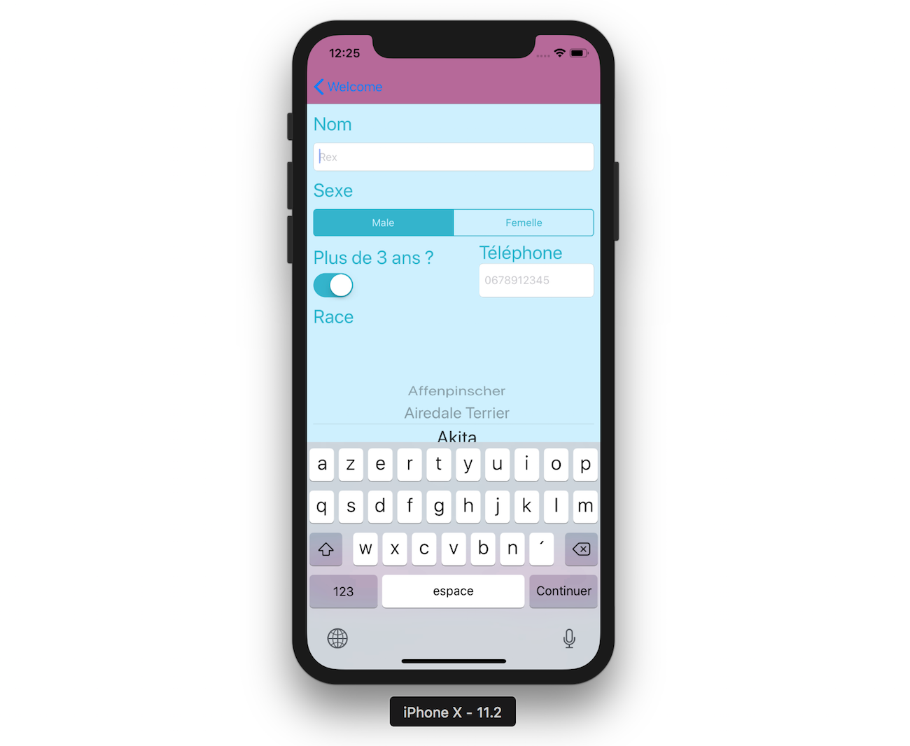
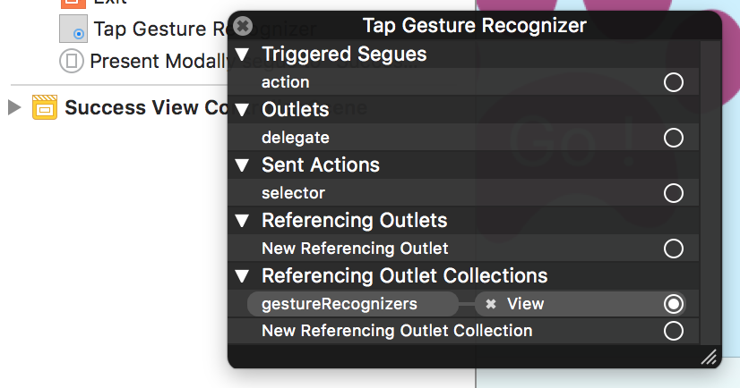
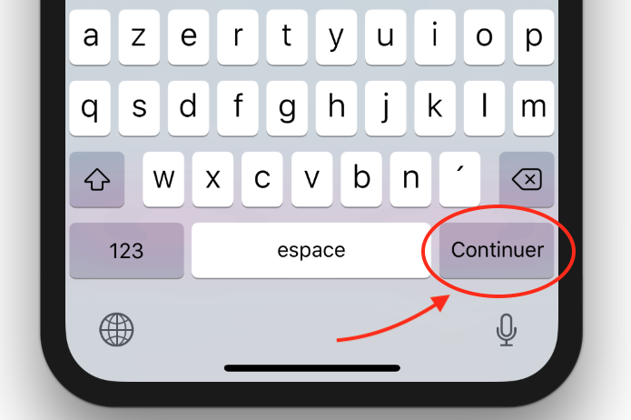

## Créez un formulaire

### Mettez en forme votre formulaire
Nous avons créé dans la partie précédente l'intégralité de la navigation de notre application ! Mais nous avons un peu délaissé l'interface. En particulier, celle correspondant au `FormViewController`...


Nous avons un joli bouton Valider qui pour le moment ne valide pas grand-chose... Dans ce chapitre, nous allons créer l'interface de ce formulaire et découvrir certains composants essentiels en iOS !

Voici l'objectif :


#### Le nom
Pour s'inscrire, l'utilisateur va devoir renseigner son nom. Et pour cela nous allons utiliser ce qu'on appelle un **champ de texte**. Un champ de texte se matérialise par une barre blanche dans laquelle on peut écrire du texte.

La classe correspondante en iOS se nomme `UITextField`. Je vous invite à aller chercher un champ de texte dans la bibliothèque des composants et à le faire glisser sur l'interface.


Le champ de texte a plusieurs propriétés intéressantes que l'on va regarder ensemble du côté de l'inspecteur d'attributs :


##### 1/ Text
La propriété `Text` permet de **préremplir le champ de texte avec le texte de son choix**.
> **:information_source:** Ensuite les propriétés `Color` et `Font` permettent bien sûr de modifier la couleur et la police du texte.

##### 2/ Placeholder
La propriété `Placeholder` permet de **préremplir le champ de texte avec une indication grisée qui s'effacera dès que l'utilisateur commence à écrire**.

> **:warning:** Il faut bien faire la différence avec la propriété `Text`.

Vous pouvez par exemple écrire *Médor* ici pour donner un exemple de nom.

##### 3/ Border Style
La propriété `Border Style` permet de **changer le style de la bordure** autour du champ de texte.

> **:information_source:** À noter que le premier choix corresponds à "Pas de bordure". Cela peut-être pratique si vous travaillez sur un design particulier de champ de texte. Je vous laisse choisir ce qu'il vous plaît !

##### 4/ Clear Button
La propriété `Clear Button` permet d'afficher un bouton qui supprime le contenu complet du champ de texte pour que l'utilisateur puisse revenir à zéro. C'est très utile dans les champs de recherche notamment.


> **:information_source:** Vous pouvez aussi choisir que le champ de texte se vide dès que l'édition démarre en cochant la case `Clear when editing begins`.

##### 5/ Text Input Traits

Les propriétés sous `Text Input Traits` concernent le clavier ! Elles permettent de customiser ce dernier. En effet, le clavier en iOS est géré par le champ de texte. Parmi les propriétés intéressantes, vous avez :
- `Content Type` : cela permet de donner des informations au système sur le **rôle** du champ de texte et d'adapter ainsi certains aspects du clavier. Je vous invite à choisir la valeur `Nickname`.
- `Capitalization` : si le clavier passe automatiquement les débuts de phrases, de mots ou tous les caractères en **capital**.
- `Correction` : cela permet d'activer ou non la **correction automatique** du clavier. Si elle est activée, les mots sont automatiquement corrigés sans intervention de l'utilisateur. Je vous invite à la désactiver. Ça risque de gêner plutôt qu'autre chose l'écriture du nom.
- `Spell Checking` : cela permet d'activer ou non le **détecteur de fautes**. S'il est activé, les fautes sont surlignées. Même chose, désactivez-le ici.
- `Keyboard Type` : cette propriété très importante permet de **changer de clavier**. En effet, il y a plusieurs claviers différents : pour entrer des numéros de téléphone, des emails, des urls, des chiffres, etc.
- `Keyboard Look` : Le clavier a deux **aspects** possibles : sombre ou clair.
- `Return Key` : Vous pouvez choisir ce qui est écrit dans la **touche de retour** (la touche bleue). Le plus pertinent ici c'est sans doute *continue*.

> **:information_source:** Je vous invite à jouer un peu avec toutes ces propriétés pour vous familiariser avec le clavier iOS.

Vous pouvez rajouter un petit label avec la mention *Nom* pour clarifier ce qui est attendu dans ce champ de texte.


#### Le sexe

Nous bâtissons un site de rencontre, ne l'oublions pas ! Donc le sexe de nos membres est une information essentielle ! Pour leur demander, nous n'allons pas leur demander de le taper puisqu'il suffit de choisir entre deux possibilités. Dans ce genre de cas, on va faire appel à ce qu'on appelle un **contrôle segmenté** ou `UISegmentedControl`.

Sélectionnez-le depuis la bibliothèque des objets et glissez-le sur l'interface.


Cela prend la forme d'une barre sur laquelle vous avez plusieurs segments. On peut sélectionner l'un d'entre eux. Voyons dans l'inspecteur d'attributs comment personnaliser ce composant.


La propriété la plus importante, c'est la propriété `Segments`. Cette propriété permet de **choisir le nombre de segments** du composant. Dans notre cas, nous avons deux options, Male ou Femelle, donc vous pouvez laisser 2.

Ensuite dessous vous pouvez sélectionner dans la propriété `Segment` le segment à modifier. Vous avez deux options principales de modifications :
- `Title` : vous pouvez modifier le texte affiché dans le segment. Je vous invite à écrire *Male* pour le premier et *Femelle* pour le second. Ou l'inverse si vous êtes galant... :D
- `Image` : à la place du texte, vous pouvez choisir de mettre une icône. Vous pouvez vous amuser à en trouver et à les utiliser ici !

> **:information_source:** Un petit mot sur la propriété `Selected`. C'est elle qui permet de choisir quel sera le segment sélectionné par défaut au chargement de la vue. Là, c'est trop politique pour que je vous conseille lequel choisir ! À vous de voir ;) !

Une fois que vous avez modifié votre composant correctement, nous allons pouvoir passer à la suite !
> **:question:** Et la couleur ? C'est quand même pas magnifique ce bleu...

Hmm... Je suis d'accord avec vous !

La classe `UIView` a une propriété `tintColor`, accessible depuis l'inspecteur d'attributs. Cette couleur définit la teinte générale d'une vue. Cette propriété est souvent utilisée par les sous-classes d'`UIView` pour définir leur couleur.

Et `UISegmentedControl` ne fait pas exception ! Vous pouvez donc descendre dans l'inspecteur d'attributs jusqu'à la section View et modifier la propriété `Tint`.


Même chose, je vous invite enfin à rajouter un petit label pour organiser notre formulaire.


#### Plus de 3 ans ?

Comme chacun sait, une année de chien vaut 7 années d'hommes. Donc la majorité canine a lieu à 3 ans.

> **:question:** Mais 3 x 7, ça fait pas...

OUI ! Je sais... mais je me basais sur la majorité américaine à 21 ans bien sûr...

Bref, toujours est-il que pour inscrire nos chiens, il faut évidemment vérifier qu'ils ont la majorité sinon on va avoir la SPA sur le dos ! Et pour cela, on veut leur poser tout simplement la question :

> Avez-vous plus de trois ans ?

Pour ce genre de questions qui se répondent par oui ou par non, il existe un composant très pratique : le switch ou `UISwitch`. Sélectionnez-le dans la bibliothèque des objets et glissez-le dans l'interface :


En tapant dessus, on l'active ou on le désactive. Le switch a deux valeurs : `on` et `off`.

Dans l'inspecteur d'attributs, vous avez trois propriétés très simples :


- `State` : cette propriété permet de décider de l'état par défaut du bouton. Je vous invite à le passer à off pour forcer nos utilisateurs à l'activer et donc à se poser la question de leur âge. Oui c'est le genre de question qu'un chien peut se poser...
- `On Tint` : vous pouvez choisir la couleur du composant lorsqu'il est dans l'état `On`. Autrement dit, vous pouvez choisir autre chose que ce vert flash.
- `Thumb Tint` : vous pouvez changer la couleur du rond blanc.

À vous d'exprimer vos talents de designer ! Voici ce que ça donne pour moi :


#### Téléphone

Pour pouvoir contacter les chiens afin de les mettre en relation, nous allons leur demander leur numéro de téléphone. Pour cela, vous allez choisir le champ de texte et je vous invite à passer la propriété `Content Type` à `Phone Number` et la propriété `Keyboard Type` à `Phone Pad`.

Voici mon résultat :


> **:information_source:** `UITextField` a un cousin : `UITextView`. Le premier est dédié à de petites entrées de textes sur une seule ligne comme un nom, un numéro de téléphone, une recherche, etc. Le second que nous ne verrons pas, mais qui est très proche, permet de plus longues entrées de texte comme des commentaires, des messages, etc. `UITextView` est aussi utilisé pour afficher de grands messages textuels.

#### Race

Enfin, comme tout réseau de rencontre malheureusement, l'aspect physique importe. Donc sans aller jusqu'à réclamer une photo, nous allons demander la race du chien.

Mais nous ne voulons pas imposer à nos utilisateurs d'avoir à la taper, ce qui est long et fastidieux. Il y a un nombre fini de races de chiens, donc on va mettre cela dans une liste et ils vont pouvoir choisir.

Et pour cela, il existe un composant qui a le mérite d'être très beau et très utile : le sélecteur ou `UIPickerView`.

Sélectionnez-le dans la bibliothèque des objets et glissez-le dans l'interface.


Le *PickerView* prend la forme d'une roulette (oui, comme dans les machines à sous :D) que l'on peut diviser en plusieurs colonnes qui vont chacune montrer des listes différentes. Dans notre cas, nous n'avons qu'une seule liste à afficher, la liste des races.

Sa grande beauté vient avec un petit défaut, il ne peut pas être configuré dans le storyboard, mais uniquement dans le code. Donc pour l'instant, nous allons le laisser tel quel.

> **:information_source:** Le `UIPickerView` a une sous-classe bien pratique : le `UIDatePickerView` qui permet de sélectionner une date. Nous ne la verrons pas, mais si vous savez utiliser le premier vous saurez encore plus facilement vous servir du second.

Vous devriez maintenant avoir l'interface complète du formulaire :


#### Exercice
Cette interface est assez complexe, car elle contient de nombreux composants. Je vous invite à la rendre responsive au moins sur les iPhone en mode portrait.

Vous retrouvez la correction sous forme de vidéo explicative à cette adresse [AJOUTEZ LIEN]. Dans cette vidéo, j'aborde une technique nouvelle pour rendre vos interfaces adaptables : les **Stack View**.

> **:information_source:** N'hésitez pas à vous renseigner et à essayer les Stack View par vous même avant de regarder la correction. Suivez ce [tutoriel](https://www.raywenderlich.com/160646/uistackview-tutorial-introducing-stack-views-2) par exemple ainsi que les excellentes 4 premières minutes de cette [vidéo](https://www.youtube.com/watch?v=a-W5SciZrXo).

C'est un bonus bien sûr puisqu'on s'écarte un peu du sujet du cours, mais un peu d'entraînement ne vous fera jamais de mal et c'est un bon moment pour découvrir les Stack View.

#### Résumé
- `UITextField` : Les champs de texte permettent de récupérer du texte de la part d'un utilisateur. Ils sont directement reliés à la gestion du clavier.
- `UISegmentedControl` : Ce composant permet de sélectionner un choix parmi plusieurs options, en général entre 2 et 5.
- `UISwitch` : Le switch est un composant idéal, pour les situations Oui/Non ou On/Off.
- `UIPickerView` : Le sélecteur est une roulette qui permet de sélectionner un élément parmi une liste.

Dans le prochain chapitre, nous allons configurer notre sélecteur pour qu’il affiche les différentes races de chien.

### Remplissez le sélecteur

Dans le chapitre précédent, nous avons créé l'interface de notre application, mais malheureusement le sélecteur a échappé à notre folie artistique ! Nous n'avons pas pu le configurer dans le storyboard. Et du coup, quand vous lancez l'application, le résultat en la matière n'est pas probant...


Qu'à cela ne tienne, nous aurons sa peau dans le code !

#### Delegate, Datasource et MVC

En MVC, vous savez qu'il existe plusieurs formes de communications entre les trois parties. Ce schéma doit vous rappeler quelque chose :


Notamment, on y voit que la vue communique avec le contrôleur via les outlets et les actions. Nous allons découvrir ici deux nouvelles formes de communications : les datasource et les delegate.

##### Le dataSource

En MVC, **une vue ne détient pas ses données**. Car une vue n'a qu'un rôle d'affichage, ce n'est pas son rôle de savoir quoi afficher. C'est le contrôleur qui va lui dire.

Ainsi, dans le cas de notre liste de races, ce n'est pas la vue qui doit retenir la liste de races, c'est le contrôleur qui va lui dire quoi afficher. Et il va tirer cette information du modèle qui détient les données.

Donc pour savoir quoi afficher, le contrôleur va simplement utiliser des outlets pour les vues relativement simples et surtout qui ont peu de données à afficher. Mais pour des vues plus complexes avec beaucoup de données à afficher, **le contrôleur va se positionner en source de donnée pour que la vue puisse piocher dedans et donc n'avoir en même temps que très peu de données à afficher**.

Le contrôleur est donc le `dataSource`, celui qui détient les données. Et voilà comment cela va fonctionner :
1. Le PickerView va nommer le contrôleur source de donnée.
2. Cela implique que le contrôleur **s'engage à répondre à certaines questions précises** du PickerView, par exemple combien d'éléments y a-t-il dans la liste ?
3. Lorsque la vue en a besoin, le contrôleur répond aux questions.


Vous venez de découvrir une nouvelle forme de communication aveugle entre le contrôleur et la vue.

##### Le delegate

Le delegate fonctionne de la même manière. **Une vue peut avoir besoin de poser des questions à son contrôleur selon les évènements qui lui arrivent.**

> **:information_source:** Certains évènements peuvent être gérés par des actions. Lorsqu'on appuie sur le bouton, le contrôleur propose systématiquement la même action. C'est une façon aveugle de communiquer avec la vue. Car la vue n'a aucune idée de ce que fait le contrôleur. Elle sait juste qu'il effectue une action, toujours la même.

Mais parfois, on ne veut pas faire toujours la même action. Par exemple, lorsque l'utilisateur va faire défiler la liste des races, la vue va devoir demander à chaque
fois : quel est le prochain nom de race que je dois afficher ? Et à chaque fois, le contrôleur va répondre une race différente. C'est lui qui choisit ce qu'on affiche.

Pour prendre un autre exemple, on peut parler des scroll view. Une scroll view va utiliser le mécanisme de delegate pour dire au contrôleur :
- Je viens de scroller de quelques pixels, tu veux faire une action ?
- Je viens d'atteindre la fin du scroll, on fait quelque chose ?
- Je viens de m'arrêter de scroller, que veux-tu faire ?

Autrement dit, **la vue *délègue* toute la prise de décision au contrôleur**. D'où le nom de ce mécanisme.

Le contrôleur devient ce qu'on appelle le `delegate`, celui à qui est déléguée la responsabilité. Et cela va fonctionner exactement comme pour le data source :

1. Le PickerView va nommer le contrôleur délégué.
2. Cela implique que le contrôleur s'engage à répondre à certaines questions précises du PickerView.
3. Lorsque la vue en a besoin, le contrôleur répond aux questions.


Encore une nouvelle forme de communication aveugle entre le contrôleur et la vue. Vos compétences en MVC ont fait un bond en avant !

Ces 3 étapes vont être les trois étapes que nous allons suivre pour configurer le delegate et le dataSource de notre PickerView.

> **:information_source:** C'était une petite introduction aux notions de `delegate` et de `dataSource`, si tout n'est pas parfaitement clair, pas de soucis, nous aurons l'occasion d'y revenir pendant le cours sur les Table View.

#### Nommez le dataSource et le delegate

Lors de la première étape, la vue nomme le contrôleur son dataSource et son delegate. Et nous allons faire cela avec... deux control drags !

Il vous suffit de faire le control drag depuis le Picker View vers le contrôleur comme ceci :


Une Popup apparaît. Cliquez sur `dataSource` puis répétez l'opération et cliquez cette fois sur `delegate`.

#### Le contrôleur s'engage à répondre aux questions
Deuxième étape : le contrôleur s'engage à répondre aux questions de la vue. Pour cela, le contrôleur va implémenter ce qu'on appelle un **protocole**.

Un protocole, c'est un outil en Swift dont nous n'avons pas encore parlé. **Un protocole est une liste de méthodes vides et de propriétés.**

> **:question:** De méthodes vides ?

Oui un protocole, c'est juste une liste de méthodes vides. Contrairement à une classe dans laquelle, on écrit une méthode et son implémentation, dans un protocole, on n'a que la déclaration des fonctions.

Pour vous donner un exemple, voici le protocole `UIPickerViewDataSource`.

```swift
protocol UIPickerViewDataSource {
	func numberOfComponents(in pickerView: UIPickerView) -> Int
	func pickerView(_ pickerView: UIPickerView, numberOfRowsInComponent component: Int) -> Int
}
```

C'est juste une liste de méthodes.

> **:question:** À quoi ça sert ?

Justement, ça va nous être très utile ici. On veut que le contrôleur s'engage à répondre à des questions. Et les questions, ce sont simplement les méthodes du protocole !

Pour cela, notre contrôleur va se *conformer* au protocole. C'est un terme technique pour dire qu'**il s'engage à fournir une implémentation aux méthodes qui se trouvent dans le protocole**.

Pour concrétiser cet engagement, il suffit d'ajouter le nom du protocole au moment de la déclaration de notre classe comme ceci :

```swift
class FormViewController: UIViewController, UIPickerViewDataSource, UIPickerViewDelegate {

}
```

On rajoute les protocoles après la super classe, s'il existe, et on les sépare par des virgules.

Une fois que vous avez écrit cela, vous devriez voir des erreurs s'afficher.

```console
Type 'FormViewController' does not conform to protocol 'UIPickerViewDataSource'
```
Le problème c'est qu'on s'engage à implémenter des méthodes, mais on ne le fait pas ! Xcode n'est pas content !

Résolvons cela !

> **:information_source:** Ceci, encore une fois, est une rapide introduction à la notion complexe de protocole. Nous aurons l'occasion d'y revenir dans le cours sur les Table View.

#### Le contrôleur répond aux questions

Il ne nous reste plus qu'à répondre aux questions. Et pour cela, nous allons implémenter les méthodes de nos deux protocoles : `UIPickerViewDataSource` et `UIPickerViewDelegate`.

##### Méthodes du dataSource

La première, c'est donc :
```swift
func numberOfComponents(in pickerView: UIPickerView) -> Int {
}
```

Ajoutez cette fonction dans le code du `FormViewController`. Nous allons l'implémenter. Cette méthode doit apparemment renvoyer un entier. Cet entier correspond au *numberOfComponents* de notre PickerView.

> **:question:** C'est quoi les *components* du PickerView ?

Les *components* représentent les différentes colonnes de notre PickerView. Souvenez-vous, le PickerView fonctionne comme la roulette au casino. Par exemple, sur la roulette suivante, il y a quatre *components*.


> **:information_source:** Au passage, ceci est un `UIDatePickerView`.

Le nôtre est bien plus simple puisqu'on veut ajouter seulement une liste, celle des races de chiens.

Donc on va répondre simplement à la question en implémentant la méthode comme ceci :

```swift
func numberOfComponents(in pickerView: UIPickerView) -> Int {
	return 1
}
```

Maintenant, la vue sait combien de *components* afficher.

Passons maintenant à la deuxième méthode :

```swift
func pickerView(_ pickerView: UIPickerView, numberOfRowsInComponent component: Int) -> Int {
}
```
Cette méthode retourne également un entier. Cette fois il correspond au nombre d'éléments présent dans chaque colonne. C'est la raison pour laquelle, nous avons *component* en paramètre pour pouvoir adapter la réponse en fonction de la colonne.

Nous nous n'avons qu'une seule colonne, donc on va simplement répondre par le nombre de races de chien à afficher. Et pour cela, nous allons tout simplement utiliser le tableau `dogRaces` qui se trouve dans notre modèle.

```swift
func pickerView(_ pickerView: UIPickerView, numberOfRowsInComponent component: Int) -> Int {
	return dogRaces.count
}
```

Et voilà ! La vue connait maintenant le nombre d'éléments à prévoir dans la liste.

##### Méthode du delegate

`UIPickerViewDelegate` est un protocole qui contient bien plus de méthodes qui permettent de personnaliser complètement la vue. Mais il y en a une seule qui nous intéresse vraiment, c'est celle-ci que je vous invite à rajouter dans votre code :

```swift
func pickerView(_ pickerView: UIPickerView, titleForRow row: Int, forComponent component: Int) -> String? {
}
```

Cette méthode renvoie un String optionnel qui correspond au titre que l'on veut mettre pour chaque élément. Évidemment ce titre dépend de la colonne et de la ligne dont on parle. C'est la raison pour laquelle nous avons les entiers `row` et `component` en paramètre de cette méthode.

Encore une fois, le paramètre `component` ne nous importe pas puisque nous n'avons qu'une seule colonne. En revanche, on va utiliser le paramètre `row` en index de notre tableau `dogRaces`.

Vous donc implémenter la méthode comme ceci :

```swift
func pickerView(_ pickerView: UIPickerView, titleForRow row: Int, forComponent component: Int) -> String? {
	return dogRaces[row]
}
```

Et voilà ! Maintenant la vue sait quel titre afficher en fonction de la ligne à laquelle on se trouve, vous pouvez lancer l'application et confirmer que tout fonctionne correctement !


Voici le code complet de la classe `FormViewController` :

```swift
class FormViewController: UIViewController, UIPickerViewDataSource, UIPickerViewDelegate {
	func numberOfComponents(in pickerView: UIPickerView) -> Int {
		return 1
	}

	func pickerView(_ pickerView: UIPickerView, numberOfRowsInComponent component: Int) -> Int {
		return dogRaces.count
	}

	func pickerView(_ pickerView: UIPickerView, titleForRow row: Int, forComponent component: Int) -> String? {
		return dogRaces[row]
	}
}
```

#### Résumé
- En MVC, une vue peut utiliser le mécanisme du `dataSource` pour ne pas être propriétaire de ses donner et les réclamer au contrôleur.
- En MVC, une vue peut utiliser le mécanisme du `delegate` pour déléguer les prises de décision au contrôleur.
- Un protocole est une liste de méthodes vides et de propriétés.
- Pour utiliser le mécanisme de `dataSource` ou `delegate`, on suit trois étapes :
	1. La vue **nomme** le contrôleur son `dataSource` et/ou `delegate`.
	2. Le contrôleur **s'engage à répondre aux questions** de la vue en **adoptant le protocole** correspondant.
	3. Le contrôleur **répond aux questions** de la vue en **se conformant au(x) protocole(s)** et donc en implémentant les méthodes de ce dernier.

Dans le prochain chapitre, nous allons revenir sur nos champs de texte et apprendre à gérer le clavier !

### Gérez le clavier
Si vous vous êtes amusés à jouer un peu avec votre formulaire, vous vous êtes sans doute aperçu que sans que vous n'ayez rien à faire, votre clavier apparaît automatiquement lorsque vous cliquez sur un champ de texte.

C'est pratique, mais du coup ça prend une bonne partie de l'écran et on ne peut plus cliquer sur le bouton *Valider*...



Dans ce chapitre, nous allons apprendre à gérer la disparition du clavier !

#### Rappel sur le champ de texte
Tant qu'on en est à parler du clavier, laissez-moi vous faire un petit rappel sur ce qu'on a vu avec le champ de texte.

**Le clavier est entièrement lié au champ de texte**.

Par exemple, c'est le champ de texte qui décide du type de clavier qui s'affiche. On a ensemble modifié la propriété `Keyboard Type` pour que le champ de texte *Téléphone* affiche le clavier suivant plutôt.


Cela veut dire que c'est également **le champ de texte qui décide de l'apparition et de la disparition du clavier**.

#### Clavier dans le simulateur

Si vous lancez l'application dans le simulateur, le clavier ne s'affichera peut-être pas. Cela est dû à un réglage spécial du simulateur. Quand vous interagissez avec une application dans le simulateur, vous avez l'option d'utiliser **le clavier iOS présent sur l'écran du simulateur** ou d'utiliser **le clavier de votre Mac**.

> **:information_source:** Cela a été rendu possible, car taper du texte en cliquant sur les touches d'un clavier virtuel à la souris, ce n'est vraiment pas l'idéal ! :D

Vous pouvez alterner entre les deux options en allant dans Hardware > Keyboard > Connect Hardware Keyboard. Vous pouvez également utiliser le raccourci <kbd>shift + cmd + K</kbd>.

#### Une tape et... disparition !

Le clavier apparaît donc automatiquement, mais il ne disparaît pas ! Le réflexe commun, c'est de taper n'importe où en dehors du champ de texte pour faire disparaître le clavier. Alors, essayons de rajouter cette fonctionnalité à notre page !

##### Ajout du Tap Gesture Recognizer
Pour y parvenir, il faut associer le geste "*Tap*" à "*n'importe où sur la page*". Et vous savez déjà faire cela ! Nous allons utiliser `UITapGestureRecognizer` et nous allons le relier à la vue principale du `FormViewController`.

Sélectionnez `Tap Gesture Recognizer` dans la bibliothèque des objets :


Et glissez-le sur la vue principale. Je vous suggère d'utiliser le panneau de droite (*Document Outline*) pour être certain d'atterrir au bon endroit.


Le `Tap Gesture Recognizer` est maintenant ajouté et relié à la vue principale.

> **:information_source:** Vous pouvez vérifier que c'est bien le cas, en faisant un clic droit sur le `Tap Gesture Recognizer`, vous devriez obtenir ceci :


##### Création de l'action

Nous allons maintenant pouvoir créer l'action correspondant à notre `Tap Gesture Recognizer`. Vous savez faire, il suffit de faire un control drag depuis le `Tap Gesture Recognizer` vers le code. Vous pouvez nommer l'action : `dismissKeyboard`.

Le code suivant est généré :

```swift
@IBAction func dismissKeyboard(_ sender: UITapGestureRecognizer) {
}
```
Dans cette méthode, nous allons rédiger le code permettant de cacher le clavier.

##### À vos outlets
On l'a dit, c'est la responsabilité du champ de texte de cacher le clavier. Donc nous allons avoir besoin d'accéder aux champs de texte dans le code. Pour cela, créez deux outlets correspondant aux deux champs de texte.

Voici mon résultat :

```swift
@IBOutlet weak var nameTextField: UITextField!
@IBOutlet weak var phoneTextField: UITextField!
```

#### La notion de firstResponder

Tout est prêt ! Nous avons le geste, l'action et les outlets. Il ne reste plus qu'à rédiger la commande. Et cette commande, elle ressemble à ceci :

```swift
nameTextField.resignFirstResponder()
```

> **:question:** Pourquoi ça ne s'appelle pas `nameTextField.hideKeyboard()` ? C'est quoi un `responder` ?

Très bonnes questions ! En iOS, un `responder` (répondeur en français) est **un objet qui peut répondre à des évènements et les gérer**. En gros, toutes les vues sont des répondeurs, car elles peuvent toutes au moins gérer des gestes sur l'écran tactile.

Le premier répondeur (`firstResponder`) est l'objet qui est en train d'être utilisé. **Il ne peut y en avoir qu'un seul**. Par exemple, lorsqu'on tape du texte dans un champ de texte, il n'y a qu'un seul champ de texte qui répond. On ne peut pas taper du texte sur plusieurs champs en même temps.

Autre exemple, mettons que j'ai deux boutons l'un en dessous de l'autre et que j'appuie dessus. Techniquement, les deux boutons ont été touchés. Mais un seul lancera son action, on l'appelle le `firstResponder`.

> **:information_source:** Pour ceux qui connaissent le développement web, la notion de `firstResponder` est très proche de `focus`.

Lorsque l'on touche le champ de texte, il devient `firstResponder`. Et lorsqu'un champ de texte devient `firstResponder`, il affiche le clavier. N'importe quelle vue peut devenir le `firstResponder` en appelant la méthode :

```swift
nameTextField.becomeFirstResponder()
```

> **:information_source:** C'est pratique si vous souhaitez que le clavier soit déjà affiché à l'arrivée d'une page par exemple. Vous pouvez copier cette ligne dans `viewDidAppear` par exemple.

À l'inverse, n'importe quelle vue peut décider de ne plus être le `firstResponder` et pour cela, elle utilise la méthode qu'on a vue au-dessus :

```swift
nameTextField.resignFirstResponder()
```

Lorsqu'un champ de texte n'est plus `firstResponder`, cela veut dire que l'utilisateur n'est plus en train d'interagir avec lui et du coup le clavier n'a plus de raison d'être présenté. Il disparaît.

Vous pouvez faire la même chose avec `phoneTextField` et votre action devient :

```swift
@IBAction func dismissKeyboard(_ sender: UITapGestureRecognizer) {
	nameTextField.resignFirstResponder()
	phoneTextField.resignFirstResponder()
}
```

Vous pouvez tester dans le simulateur et ça marche !

Je résume :
- On a créé un geste (Tap) que l'on a associé à la vue principale pour qu'il soit disponible n'importe où sur la page.
- On a associé une action au geste.
- Dans l'action, on appelle la méthode `resignFirstResponder` sur les deux champs de texte pour que le clavier disparaisse.

#### Et la touche de retour ?

La touche de retour sur le clavier c'est celle-ci :



> **:information_source:** On a vu que le texte "Continuer" pouvait être changé avec la propriété `Return Key`.

Lorsqu'on appuie cette touche, l'utilisateur peut vraisemblablement s'attendre à ce que le clavier disparaisse. Et pour cela, il faut que la vue puisse prévenir le contrôleur de l'évènement "a appuyé sur la touche retour". Si seulement elle pouvait lui déléguer la....

> **:question:** On va utiliser un `delegate` !

Mais quelle vivacité d'esprit ! Je suis ébahi. Je vous adore !

En effet, on va utiliser un `delegate`. Et on suit toujours les mêmes étapes :
1. Le champ de texte va nommer le contrôleur comme son delegate
2. Le contrôleur s'engage à répondre aux questions du champ de texte en adoptant le protocole correspondant.
3. Le contrôleur répond aux questions en se conformant au protocole et donc en implémentant les méthodes de ce dernier.

##### 1. Le champ de texte nomme le contrôleur comme son delegate

Pour cela, vous vous souvenez on utilise un control drag depuis le champ de texte vers le contrôleur et dans la popup, on clique sur delegate.


Vous pouvez répéter l'opération pour le deuxième champ de texte.

##### 2. Le contrôleur adopte le protocole
Le protocole correspondant s'appelle `UITextFieldDelegate`. Oui... ils ne font pas dans la créativité. En même temps, heureusement :D !

Et pour que le contrôleur l'adopte, il faut l'ajouter à la déclaration de la classe comme on l'a vu au chapitre précédent.

```swift
class FormViewController: UIViewController, UIPickerViewDataSource, UIPickerViewDelegate, UITextFieldDelegate {
}
```
##### 3. Le contrôleur se conforme au protocole
Il ne nous reste maintenant plus qu'à implémenter la méthode qui nous intéresse dans ce protocole et qui correspond à l'évènement "*a appuyé sur la touche retour*". Cet évènement s'appelle :

```swift
func textFieldShouldReturn(_ textField: UITextField) -> Bool {
}
```

Cette fonction prend en paramètre un `textField`. C'est le champ de texte qui vient de subir l'évènement "*a appuyé sur la touche retour*". Et elle renvoie un booléen qui est à `true` si vous souhaitez que la méthode suive son implémentation normale, ce qui sera presque toujours le cas.

Mais avant de renvoyer le booléen, on peut faire ce qu'on veut et notamment :

```swift
textField.resignFirstResponder()
```

Et maintenant le champ de texte disparaîtra lorsqu'on appuiera sur la touche de retour !

Voici le code complet de la fonction :
```swift
func textFieldShouldReturn(_ textField: UITextField) -> Bool {
	textField.resignFirstResponder()
	return true
}

```

> **:information_source:** Le protocole `UITextFieldDelegate` contient de nombreuses autres fonctions pour gérer d'autres types d'évènements. Je vous invite à jeter un oeil si vous le souhaitez.

#### Allez plus loin
Un dernier cas courant que vous rencontrerez en manipulant les claviers, c'est celui d'**un clavier qui recouvre un champ de texte**. C'est notamment le cas si vos champs de texte sont situés en bas de l'écran.

Dans ce cas, l'utilisateur ne voit pas ce qu'il écrit !

Il y a deux solutions :
1. **Ne pas mettre de champ de texte en bas**. C'est évident, mais je le précise parce que ça vaut parfois le coup de modifier le design de son application dans ce but.
2. **Faire glisser la vue principale vers le haut pour que le champ de texte soit plus haut que le clavier**. Dans ce cas, c'est bien toute la vue principale qui glisse vers le haut, pour ne pas altérer le design.

Je ne détaillerais pas cette deuxième option, mais il faut que le contrôleur écoute les notifications d'apparition et disparition du clavier et ensuite, on fait une translation de la vue principale vers le haut en calculant bien la distance nécessaire.

Je vous invite à jeter un oeil à [ce tutoriel](https://blog.apoorvmote.com/move-uitextfield-up-when-keyboard-appears/) si vous rencontrez le problème. Vous pouvez aussi compléter avec [cette réponse Stack Overflow](https://stackoverflow.com/questions/28813339/move-a-view-up-only-when-the-keyboard-covers-an-input-field) qui est moins détaillée, mais régulièrement mise à jour.

#### En résumé
- Le champ de texte est l'objet qui gère le clavier.
- On peut utiliser un `Tap Gesture Recognizer` associé à la vue principale pour faire disparaître le clavier après l'appui sur n'importe quel écran.
- Lorsque le champ de texte devient `firstResponder`, le clavier apparaît. Lorsque le champ de texte ne l'est plus, le clavier disparaît. Deux méthodes sont associées à ces évènements :
```swift
textField.becomeFirstResponder()
textField.resignFirstResponder()
```
- Pour que le clavier disparaisse à l'appui sur la touche de retour, on utilise le `UITextFieldDelegate` et en particulier la méthode `textFieldShouldReturn`.

Dans le prochain chapitre, nous allons apprendre à récupérer les données de notre formulaire !

### Récupérez les données du formulaire
Notre formulaire est fin prêt et fonctionnel ! Bravo ! Il ne nous reste plus qu'à récupérer les données de ce formulaire ! Sinon... il ne sert à rien... :/

Avant cela, nous allons corriger quelque chose qui vous chagrine, je le sais. Notre application n'a pas de modèle ! Or, c'est le modèle qui est responsable de sauvegarder les données ou de discuter avec un éventuel serveur. Et c'est donc lui qui va nous permettre de récupérer les informations du formulaire correctement.

Donc avant de récupérer nos données, nous allons créer le modèle. Et vous allez faire ça avec l'exercice ci-dessous.

[EXERCICE CODEVOLVE]

> **:information_source:** Vous pouvez télécharger le fichier `Model.swift` [ici](https://s3-eu-west-1.amazonaws.com/static.oc-static.com/prod/courses/files/Parcours+DA+iOS/Cours+7+-+Plusieurs+pages/Model.swift) et l'intégrer dans votre application.

#### Bouton Valider
Pour l'instant, notre bouton *Valider* lance une transition modale vers le `SuccessViewController`. Or, avant de passer à la page suivante, nous voulons :
- récupérer les données du formulaire : on va faire ça juste en dessous.
- vérifier que les données sont valides : on va faire ça dans la prochaine partie.
- les envoyer sur un serveur, les sauvegarder en base de données, etc. : si on travaillait sur un véritable projet...

Du coup, on ne peut pas déclencher automatiquement le segue modal puisqu'il faut faire tout ça avant. À la place, nous allons créer une action pour sauvegarder les données.

Donc commencez par supprimer le segue Modal entre le bouton.

> **:information_source:** Rassurez vous, nous allons recréer cette transition dès le prochain chapitre.

Et maintenant vous pouvez créer une action pour le bouton que nous allons simplement appeler `validate` :

```swift
@IBAction func validate() {
}
```

Ensuite, je vous suggère de créer une fonction privée dans laquelle nous allons faire la première moitié du travail : créer un objet `Pet`.

```swift
@IBAction func validate() {
	createPetObject()
}

private func createPetObject() {
}
```

> **:information_source:** C'est une bonne pratique de séparer l'action de la méthode correspondante. Cela sépare les responsabilités de chaque méthode.

#### Récupérons les informations
Maintenant nous allons récupérer les informations de nos différents composants. Pour les récupérer, il va nous falloir créer des outlets pour tous les composants.

Vous êtes des pros, je vous laisse faire :

```swift
@IBOutlet weak var racePickerView: UIPickerView!
@IBOutlet weak var majoritySwitch: UISwitch!
@IBOutlet weak var nameTextField: UITextField!
@IBOutlet weak var phoneTextField: UITextField!
@IBOutlet weak var genderSegmentedControl: UISegmentedControl!
```

Et maintenant à l'attaque !

##### Les champs de texte

Les champs de texte sont très simples. Ils ont une propriété `text` de type `String?` qui contient le texte entré par l'utilisateur. Vous allez donc pouvoir écrire dans la fonction `createPetObject` :

```swift
let name = nameTextField.text
let phone = phoneTextField.text
```

Nous stockons les textes dans deux constantes pour l'instant.

> **:information_source:** À noter que la propriété `text` est de type `String?`. En effet, si le champ de texte est vide, la propriété renvoie `nil`.

##### Le switch
Le switch ne peut prendre que deux valeurs *On* ou *Off*. C'est donc un booléen. La propriété qui permet de récupérer ce booléen se nomme `isOn`. Donc vous pouvez écrire :

```swift
let hasMajority = majoritySwitch.isOn
```

##### Le contrôle segmenté
Le contrôle segmenté (`UISegmentedControl`) est un composant qui a plusieurs segments. Et l'utilisateur peut en sélectionner un. L'information intéressante à connaitre, c'est donc : quel segment est sélectionné ? Cette information est donnée par la propriété `selectedSegmentIndex`. Cette propriété est un entier, qui représente l'index du segment sélectionné.

> **:information_source:** Comme n'importe quel index, il commence à zéro. Donc si le premier segment est sélectionné, la propriété renvoie `0`.

On peut donc commencer par récupérer l'index :

```swift
let genderIndex = genderSegmentedControl.selectedSegmentIndex
```

Ensuite, on sait que si l'index vaut 0, l'utilisateur a sélectionné Male et s'il vaut 1 il a sélectionné Femelle.

On peut donc écrire :

```swift
var gender: Pet.Gender
if genderIndex == 0 {
	gender = .male
} else {
	gender = .female
}
```

> **:information_source:** On peut également utilisé un ternaire pour une version plus concise de tout ceci :
```swift
let gender: Pet.Gender = (genderSegmentedControl.selectedSegmentIndex == 0) ? .male : .female
```
Si les ternaires ne vous disent rien, vous pouvez jeter un oeil [ici](https://developer.apple.com/library/content/documentation/Swift/Conceptual/Swift_Programming_Language/BasicOperators.html#//apple_ref/doc/uid/TP40014097-CH6-ID71).

##### Le sélecteur

Le sélecteur (`UIPickerView`) nous permet de parcourir la liste de race. L'information qui nous intéresse ici c'est : quel élément de la liste a été sélectionné ? Même chose que pour le contrôle segmenté, on va récupérer l'index de l'élément sélectionné, mais cette fois-ci avec une méthode :

```swift
let raceIndex = racePickerView.selectedRow(inComponent: 0)
```
Cette méthode prend en argument la colonne  (*component*) dont on veut récupérer l'élément sélectionné. Nous n'avons qu'une seule colonne, donc on peut écrire 0.

Maintenant que nous avons l'index, il ne nous reste plus qu'à l'utiliser dans notre tableau de races : `dogRaces`.

```swift
let race = dogRaces[raceIndex]
```

#### Créez l'objet
Voilà, nous avons récupéré toutes les informations de notre formulaire. Il ne nous reste plus qu'à créer l'objet `Pet` correspondant. Vous êtes capable de faire ça sans moi. Donc, essayez !

Voici la correction :

```swift
let dog = Pet(name: name, hasMajority: hasMajority, phone: phone, race: race, gender: gender)
```

Notre objet est maintenant créé, il va pouvoir être sauvegardé, utilisé dans une autre page, envoyé dans un serveur, etc.  

#### Les actions
Dans ce cours, nous avons vu ces composants uniquement comme *outlets*, c'est à dire des objets dont on peut obtenir une information. Mais ces objets peuvent aussi être à l'origine d'actions, comme l'est un bouton. Voici quelques exemples en iOS :


Vous pouvez voir ici que le switch est utilisé pour afficher une section et que le contrôle segmenté permet de modifier l'aspect de la carte.

> **:information_source:** Pour information, lorsque vous créez une action avec un bouton, vous utilisez l'évènement `Touch Up Inside`. L'action est lancée quand l'utilisateur appuie sur le bouton. L'évènement que vous choisirez pour UISwitch, UISegmentedControl, UITextField ou UIPickerView est `Value Changed`, c'est à dire le moment où la valeur de la vue change (le texte, le booléen, l'index sélectionné, etc.).

Garder en tête que tous ces composants peuvent donc à la fois servir pour recueillir des informations, mais aussi pour contrôler votre interface.

#### En résumé
- Pour récupérer des informations des différents composants, on utilise :
	- la propriété `text` pour `UITextField`
	- la propriété `isOn` pour `UISwitch`
	- la propriété `selectedSegmentIndex` pour `UISegmentedControl`
	- la méthode `selectedRow(inComponent: Int)` pour `UIPickerView`

Dans la prochaine partie, nous allons contrôler la validité des informations de notre formulaire, présenter des alertes, passer des données entre contrôleurs et d'autres bonnes surprises ! À tout de suite
