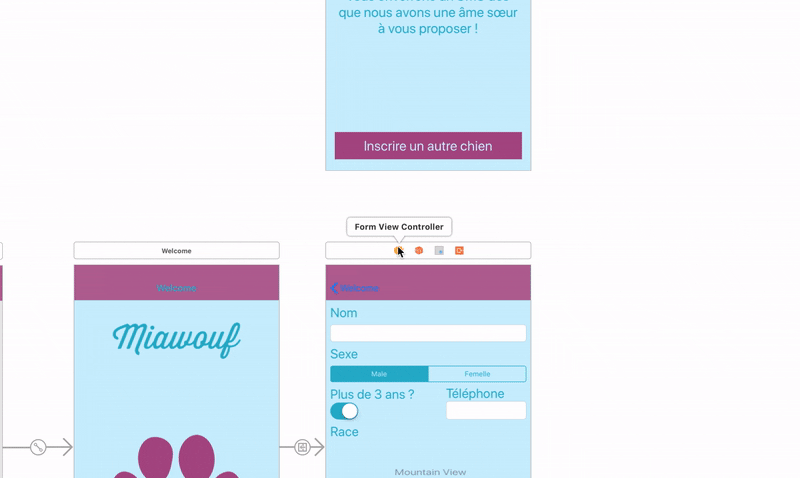
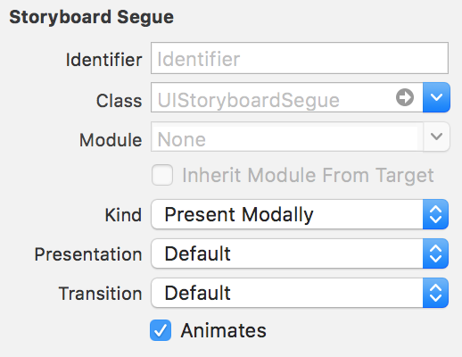
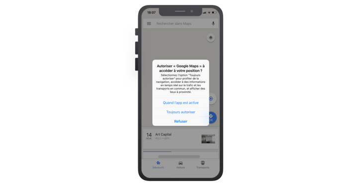
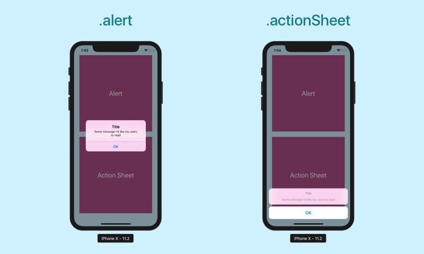
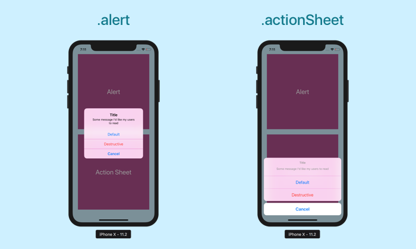

## Validez votre formulaire

### Passez des données entre contrôleurs
Dans le chapitre précédent, nous avons créé un objet `Pet` avec les informations rentrées par l'utilisateur dans le formulaire. Dans un véritable projet, on utiliserait sans doute ces données pour les envoyer sur un serveur et inscrire effectivement notre chien dans une base de donnée.

Mais ce n'est pas l'objet de ce cours et nous allons essayer de faire quelque chose d'un peu plus simple. Nous allons passer les données à la page suivante (`SuccessViewController`) pour personnaliser le message avec le nom du chien qui vient de s'inscrire.

#### La transmission de donnée entre contrôleur
De manière générale, il y a trois façons de passer des données entre contrôleurs :

##### 1/ Les données sont stockées par un tiers

Si les données sont stockées par un tiers, les contrôleurs n'ont qu'à venir piocher dedans les uns après les autres dedans. Le tiers fait office de base de données pour tout le monde.

> **:question:** C'est quoi le tiers ?

Le tiers peut représenter différentes choses :
- Un serveur dans le cloud qui détient les données.
- Le modèle qui retient les données via des mécanismes comme le singleton pattern dont on parlera dans un prochain cours.
- Une base de donnée en local, c'est à dire dans votre application iPhone. Vous avez par exemple `Core Data` dont nous parlerons dans un prochain cours.

> **:information_source:** Nous verrons la plupart de ces techniques dans de prochains cours.

##### 2/ Les données sont synchronisées directement entre les contrôleurs
Via un système de notifications, un contrôleur peut notifier un ou plusieurs autres contrôleurs qu'une donnée vient d'être mise à jour. Les autres contrôleurs peuvent réagir à la nouvelle et adapter leur interface en conséquence.

> **:information_source:** C'est exactement le même mécanisme que la notification entre le modèle le contrôleur que nous avons vu en deux partie [ici](https://openclassrooms.com/courses/concevez-une-application-iphone-avec-le-modele-mvc/envoyez-les-questions-au-controleur) et [là](https://openclassrooms.com/courses/concevez-une-application-iphone-avec-le-modele-mvc/connectez-le-controleur-et-le-modele). Donc je ne reviendrais pas là dessus. D'autant plus que ce n'est pas forcément la méthode la plus propre ou la plus utilisée.

> **:warning:** A la place des notifications, on peut aussi mettre en place un delegate pour cela implique de créer un delegate et nous ne verrons pas cela ensemble.

##### 3/ Les données sont transmises lors de la transition entre deux contrôleurs
Lorsque l'on passe d'un contrôleur à un autre, via un segue par exemple, on peut associer à cette transition une transmission de données.

L'idée générale, c'est :
- Le premier contrôleur détient des données.
- Avant que la transition n'ait lieu, il récupére une référence au contrôleur suivant via laquelle il peut lui transmettre les données.

> **:information_source:** Ne vous inquiétez pas, c'est beaucoup plus simple qu'il n'y parait et je vous montre tout ça dans ce chapitre !

#### Recréez la transition
Au chapitre précedent, nous avons supprimé le segue modal entre le `FormViewController` et le `SuccessViewController`. La raison, c'est que nous voulons effectuer certaines actions, comme créer un objet `Pet` et maintenant le transmettre à `SuccessViewController`, **avant que la transition n'ait lieu**.

Il ne faut donc pas que la transition ait lieu automatiquement lorsqu'on tape sur le bouton *Valider*. Pour cela, nous n'allons pas associer la transition au bouton comme on a appris à le faire jusqu'à présent, mais **au contrôleur** directement.

> **:information_source:** Ainsi, le contrôleur va être responsable de la transition et la déclencher quand on le souhaitera, moyennant quelques lignes de code bien entendu !

Pour faire cela, il vous suffit de recréer un segue `Present Modally` mais qui part cette fois du contrôleur `FormViewController` et qui atterit toujours vers `SuccessViewController`.



Maintenant, sélectionnez le segue nouvellement créé et ouvrez l'inspecteur d'attributs :



La propriété `Identifier` va nous permettre de nommer ce segue. Nous allons utiliser ce nom pour faire référence à ce segue quand on voudra l'utiliser côté code.

Vous pouvez écrire par exemple : `segueToSuccess`.

> **:information_source:** Je vous suggère de nommer vos segue selon une nomenclature constante. Par exemple, je démarre toujours par `segue` puis je rajoute `To` suivi du nom de la destination et si cela ne suffit pas à l'identifier je rajoute `From` suivi du nom du contrôleur de départ.

#### Préparer la transition
Notre segue est prêt et identifiable. Nous allons pouvoir l'utiliser dans le code pour lancer notre transition. Mais juste avant cela, il nous faut passer les données d'un contrôleur à l'autre.

Pour cela, nous allons utiliser une méthode que vous avez peut-être déjà vu car elle est par défaut dans le code d'un ViewController :

```swift
override func prepare(for segue: UIStoryboardSegue, sender: Any?) {
}
```

La méthode `prepareForSegue` est exécutée juste avant que la transition n'ait lieue. Et elle prends en paramètre le segue responsable de la transition de type `UIStoryboardSegue` et un `sender`, c'est l'objet d'où part le segue, ici c'est le contrôleur.

Vous implémenterez presque toujours cette méthode de la même façon :
1. On vérifie que l'identifiant du segue est le bon.
2. On récupère le contrôleur en destination du segue.
3. On passe les données au contrôleur de destination.

C'est parti !

##### 1/ Vérification de l'identifiant

La classe `UIStoryboardSegue` a une propriété `identifier` de type `String?` qui contient l'identifiant. Donc pour vérifier que l'identifiant est bon, nous allons simplement faire :

```swift
override func prepare(for segue: UIStoryboardSegue, sender: Any?) {
	if segue.identifier == "segueToSuccess" {
	}
}
```

##### 2/ Récupération du contrôleur de destination
Nous allons maintenant récupérer une référence du contrôleur vers lequel nous allons. Et pour cela, nous allons utiliser une autre propriété de `UIStoryboardSegue` : `destination`.

Et nous allons du coup écrire ceci :

```swift
override func prepare(for segue: UIStoryboardSegue, sender: Any?) {
	if segue.identifier == "segueToSuccess" {
		let successVC = segue.destination as! SuccessViewController
	}
}
```

On crée une constante à partir de la propriété `destination` du paramètre `segue`. Et ensuite, on vérifie avec le contrôle de type (`as!`) que le contrôleur de destination est bien du type `SuccessViewController`.

> **:information_source:** Si le contrôle des types ne vous dit rien, vous pouvez retourner jeter un oeil [ici](https://openclassrooms.com/courses/approfondissez-swift-avec-la-programmation-orientee-objet/controlez-vos-types).

##### 3/ Passage des données

La donnée que l'on souhaite transmettre, c'est l'objet `dog` que nous avons créé dans la méthode `createPetObject` :

```swift
let dog = Pet(name: name, hasMajority: hasMajority, phone: phone, race: race, gender: gender)
```

Il faut commencer par récupérer cette donnée dans la méthode `prepareForSegue`. Et pour partager les données entre méthodes, on crée bien sûr une propriété. Créez la propriété `dog` dans la classe `FormViewController` :

```swift
var dog: Pet!
```
> **:information_source:** On utilise un optionnel déballé car on ne connaît pas la valeur de la propriété au chargement du contrôleur. Mais on sait qu'elle aura une valeur lorsqu'on l'utilisera dans `prepareForSegue` car on sera passé par `createPetObject` d'abord.

Du coup, dans `createPetObject` la déclaration devient simplement une assignation :

```swift
dog = Pet(name: name, hasMajority: hasMajority, phone: phone, race: race, gender: gender)
```

Maintenant, pour transmettre la donnée au `SuccessViewController`, il faut qu'il puisse la recevoir et pour cela, on va tout simplement créer une propriété dog du côté du `SuccessViewController` aussi.

```swift
class SuccessViewController: UIViewController {
	var dog: Pet!
	// (...)
}
```
Il ne nous reste plus qu'à faire la transmission effective de donnée en écrivant ceci :

```swift
override func prepare(for segue: UIStoryboardSegue, sender: Any?) {
	if segue.identifier == "segueToSuccess" {
		let successVC = segue.destination as! SuccessViewController
		successVC.dog = dog // On passe la donnée via les propriétés
	}
}
```

Donc **le passage de données entre contrôleurs lors d'une transition se fait via les propriétés du contrôleur de destination**.

#### Lancer la transition

Notre transition est prête à transmettre les données. Il ne manque plus qu'une seule chose : lancer la transition !

Pour lancer un segue programmatiquement, il suffit d'utiliser la méthode suivante :

```swift
performSegue(withIdentifier: String, sender: Any?)
```

Cette méthode de `ViewController` prends en paramètre l'identifiant du segue à lancer et l'objet qui est à l'origine du segue. En pratique, on mettra souvent `self` puisque c'est le contrôleur qui initie la transition.

Je vous suggère donc d'écrire dans l'action validate :

```swift
@IBAction func validate() {
	createPetObject()
	performSegue(withIdentifier: "segueToSuccess", sender: nil)
}
```

Et voilà ! Vous pouvez vérifier que la transition modale a de nouveau lieu lorsqu'on tape sur le bouton *Valider*. La différence, c'est que maintenant, on récupère les informations du formulaire, on les passe au contrôleur suivant et **ensuite** on lance la transition.

#### Exercice

À vous de jouer ! La donnée a atteri dans le `SuccessViewController`. Il faut maintenant l'utiliser pour afficher le nom du chien dans le message affiché à l'écran.

Le message que vous devez afficher dans le label est le suivant :

> Wouf de bienvenue à [NOM DU CHIEN] !  
Vous avez bien été ajouté à notre base de donnée ! Nous vous enverrons un SMS dès que nous avons une âme soeur à vous proposer !

Pour y parvenir, vous allez devoir :
- créer un outlet pour modifier le texte du label
- créer le texte ci-dessus en incluant le nom du chien, récupéré dans la propriété `dog`
- modifier le texte au **chargement de la vue**

Bonne chanche !

> **:information_source:** Vous pouvez trouver la correction [ici](https://s3-eu-west-1.amazonaws.com/static.oc-static.com/prod/courses/files/Parcours+DA+iOS/Cours+7+-+Plusieurs+pages/SuccessViewController.swift) !

#### En résumé
- Il existe trois façons de faire passer des données entre contrôleurs :
	1. Les données sont stockées par un tiers.
	2. Les données sont synchronisées directement entre les contrôleurs.
	3. Les données sont transmises lors de la transition entre deux contrôleurs

- Pour cette troisième façon on suit les étapes suivantes :
	1. On crée un segue entre les contrôleurs et on lui donne un identifiant
	2. Dans la méthode `prepareForSegue` on récupère une réference au contrôleur de destinatinon et on lui passe les données
	3. On lance la transition avec la méthode `performSegue`.

Dans le prochain chapitre, nous allons rajouter une étape à notre formulaire : sa vérification.

### Présentez une alerte à l’utilisateur
Notre formulaire a une bonne tête et il est fonctionnel mais il reste quelque chose que nous n'avons pas encore abordé : les erreurs.

En effet, dans tout formulaire, il peut y avoir des erreurs et il faut les traiter en alertant l'utilisateur que les données qu'il a rentré ne sont pas valides.

Par exemple, dans notre formulaire, nous ne souhaitons pas que les chiens mineurs (de moins de trois ans) puissent accéder à notre site de rencontre. Donc nous allons vérifier cela avant de les faire passer sur la page `SuccessViewController`.

Et pour ceux qui ne sont pas majeurs, nous allons leur présenter une alerte.

#### Les alertes en iOS

Sur votre iPhone, vous avez sans doute déjà rencontré des alertes. Elles permettent d'interrompre l'expérience d'une application pour poser une question à l'utilisateur ou attirer son attention sur quelque chose. Elles ressemblent à ceci :



Vous en avez certainement déjà croisé. Elles sont gérées par une classe nommée `UIAlertController` que nous allons découvrir dans ce chapitre.

#### Création du modèle
Il n'aura pas échapper à votre vigilance que nous nous apprêtons à faire de la logique. En effet, nous allons vérifier si le formulaire est remplie correctement ou non selon certaines règles.

Et qui dit logique dit ?

> **:question:** Modèle !

Oh... C'est tellement touchant... J'en ai les larmes aux yeux ! Nous allons en effet devoir écrire un peu de logique dans le modèle.

Et pour cela, je vous ai concocté un exercice qui est quasiment obligatoire car non seulement vous allez découvrir la notion de valeur associée dans les énumérations mais en plus vous comprendrez la suite bien plus facilement si vous le faîtes !

Donc à vous de jouer !

[EXO CODEVOLVE]

> **:information_source:** Vous avez la correction de l'exercice [ici](https://s3-eu-west-1.amazonaws.com/static.oc-static.com/prod/courses/files/Parcours+DA+iOS/Cours+7+-+Plusieurs+pages/Model2.swift), si besoin.

#### Implémentation du switch
Avant d'appeler notre méthode `performSegue` dans le contrôleur, nous allons avoir besoin d'évaluer le statut de notre objet `dog`. Je vous propose d'écrire une méthode pour faire cela :

```swift
@IBAction func validate() {
	createPetObject()
	checkPetStatus()
}

// (...)

private func checkPetStatus() {
}
```

Bien. Maintenant, nous allons lancer vérifier le statut. La propriété `status` de `Pet` est une énumération donc pour l'évaluer, nous allons faire un switch :

```swift
private func checkPetStatus() {
	switch dog.status {
	case .accepted:
		performSegue(withIdentifier: "segueToSuccess", sender: nil)
	case .rejected(let error):
		// Il y a une erreur
	}
}
```

> **:warning:** Ici vous noterez la particularité de la ligne :
```swift
case .rejected(let error):
```
Lorsqu'on fait un switch sur une énumération qui a une valeur associée, on peut récupérer cette valeure associée avec la syntaxe ci-dessus.

Dans le cas où le statut est bon, on passe à la page suivante avec `performSegue`. S'il y a un erreur, on va l'afficher avec une alerte.

#### Affichage de l'alerte
Pour afficher une alerte, nous allons utiliser la classe `UIAlertController`. On commence par initialiser une instance de cette classe comme ceci :

```swift
let alertVC = UIAlertController(title: "Erreur", message: "Message d'erreur", preferredStyle: .alert)
```
Détaillons ça :
- `title` contient le titre du message
- `message` contient le corps du message
- `preferredStyle` corresponds au style désiré de l'alerte. On en reparle juste en dessous. Choisissez alerte pour le moment.

Ensuite, nous allons créer une ou plusieurs actions. Ces actions correspondent aux boutons en bas de l'alerte :

```swift
let action = UIAlertAction(title: "OK", style: .cancel, handler: nil)
```

Regardons cela :
- `title` corresponds au titre sur le bouton
- `style` corresponds au style du bouton. Il y en a plusieurs on en parle juste après.
- `handler` : il s'agit d'un bloc qui permet de rajouter du code à exécuter lors de l'appui sur le bouton. Vous pouvez y mettre ce que vous voulez.

Ensuite, il faut ajouter l'action à notre alerte via la méthode `addAction` de `UIAlertController` :

```swift
alert.addAction(action)
```

Enfin, nous n'avons plus qu'à présenter l'alerte avec la méthode `present` de `UIViewController` :

```swift
present(alert, animated: true, completion: nil)
```

On a fait le tour de la théorie et du coup la mise en pratique donne ceci :

```swift
private func checkPetStatus() {
	switch dog.status {
	case .accepted:
		performSegue(withIdentifier: "segueToSuccess", sender: nil)
	case .rejected(let error):
		presentAlert(with: error)
	}
}

private func presentAlert(with error: String) {
	let alert = UIAlertController(title: "Erreur", message: error, preferredStyle: .alert)
	let action = UIAlertAction(title: "OK", style: .cancel, handler: nil)
	alert.addAction(action)
	present(alert, animated: true, completion: nil)
}
```

J'ai créé une méthode `presentAlert` qui prends en paramètre le message d'erreur `error` contenu dans l'énumération `status`. Ce paramètre est utilisé comme message de notre `UIAlertController`. Le reste devrait être à peu près limpide sinon n'hésitez pas à reprendre les paragraphes précédents.

#### Les styles d'alertes

Comme promis, nous allons revenir sur les différents styles d'alerte que vous pouvez utiliser.

J'ai même préparé une application qui vous permettra de jouer avec tout ces styles. Vous pouvez la trouver [ici](https://github.com/AmbroiseCollon/UIAlertController) et je vous invite à jeter un oeil au code !

Il y a deux styles d'alerte : `.alert` et `.actionSheet`. Vous les avez ci-dessous :



> **:information_source:** Le premier a plus vocation a afficher des messages à l'utilisateur, il est plutôt **informatif**. Alors que le second sera plus souvent utilisée comme un moyen de sélectionner plusieurs options, il est plutôt **orienté vers l'action**.

Avec cela vous pouvez combiner trois styles de boutons :
- `.default` : le style par défaut
- `.destructive` : ce style indique que l'action risque de modifier ou supprimer des données.
- `.cancel` : ce style indique que l'action annule l'opération et laisse les choses inchangées.



> **:information_source:** Enfin, sachez que vous pouvez aussi rajouter un champ de texte dans une alerte via la méthode `addTextField` de `UIAlertController`. Vous pouvez en savoir plus avec cet [exemple](https://www.hackingwithswift.com/example-code/uikit/how-to-add-a-uitextfield-to-a-uialertcontroller).

#### En résumé

### Allez plus loin avec les extensions
1 : Présentation du concept  
2 : Etendre un type (exemple random sur le type Int, et sur UIColor et UIFont)  
3 : Organiser son code (exemple dans l’app)  

### Conclusion
Faire un schéma du MVC de l’app final  
