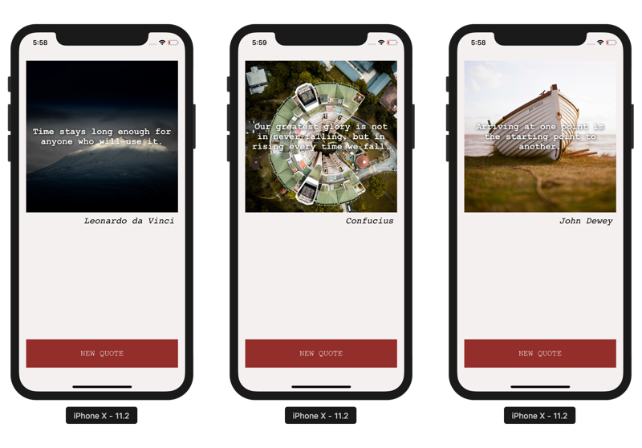
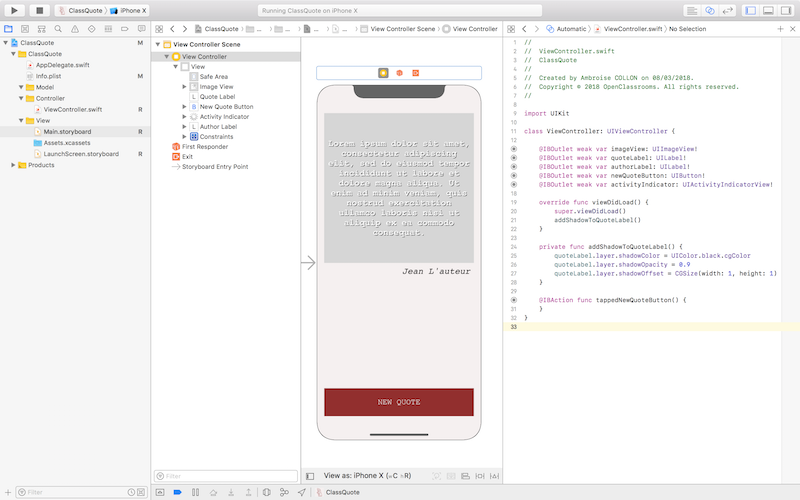
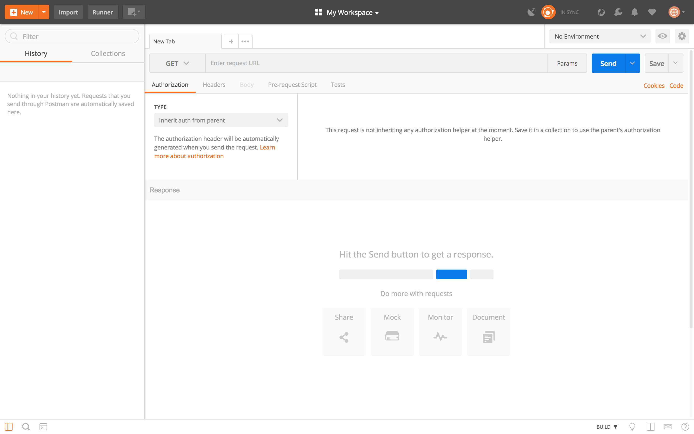
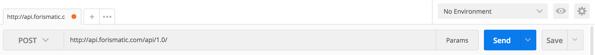
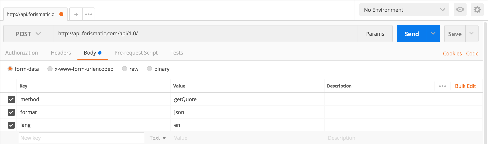
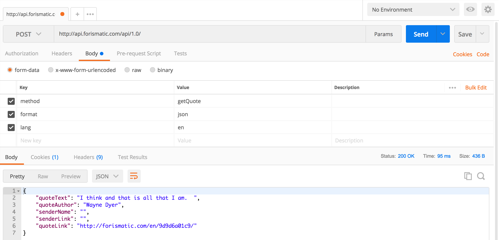
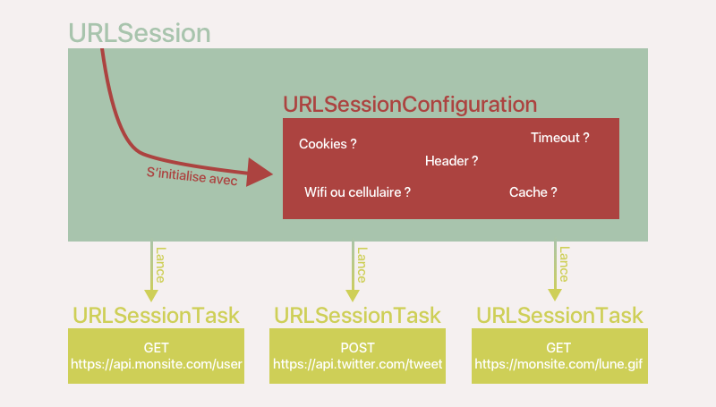
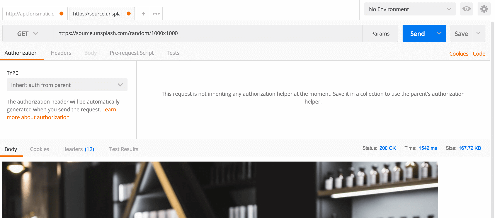
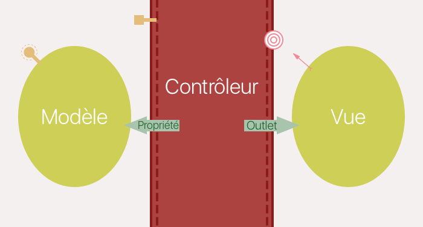

# Lancez des appels réseau en iOS

## Faites des appels réseau simples


### Tirez le meilleur de ce cours

Bonjour et bienvenue dans ce cours sur les appels réseau !


#### Prérequis

Ce cours fait partie de tout [un parcours sur le développement d'application iOS](https://openclassrooms.com/paths/developpeur-se-dapplication-ios). Je vous suggère fortement d'y jeter un oeil si vous souhaitez vous former et trouver un emploi en tant que développeur iOS.

> **:warning:** Pour profiter au mieux de ce cours, assurez-vous que vous maîtrisez a minima les compétences présentées dans les cours suivants :
- [Introduction à iOS : plongez dans le développement mobile !](https://openclassrooms.com/courses/introduction-a-ios-plongez-dans-le-developpement-mobile)
- [Apprenez les fondamentaux de Swift](https://openclassrooms.com/courses/apprenez-les-fondamentaux-de-swift)
- [Approfondissez Swift avec la Programmation Orientée Objet](https://openclassrooms.com/courses/approfondissez-swift-avec-la-programmation-orientee-objet)
- [Développez une application iPhone avec le modèle MVC](https://openclassrooms.com/courses/concevez-une-application-iphone-avec-le-modele-mvc)
- [Débuguez et testez vos applications iOS](https://openclassrooms.com/courses/debuggez-et-testez-vos-applications-ios)

Par ailleurs, ce cours s'appuie sur une compréhension solide des requêtes HTTP et API REST. Si ce n'est pas votre cas, pas de panique, on a justement un cours pour vous à ce sujet : [Utilisez des API REST dans vos projets web](https://openclassrooms.com/courses/utilisez-des-api-rest-dans-vos-projets-web).

#### Objectifs

Ce cours a évidemment pour objectif principal de vous faire découvrir les **appels réseau**. C'est une notion incontournable pour un développeur d'application, car cela permet de créer des applications collaboratives et qui interagissent avec des données distantes, disponibles sur internet.

> **:information_source:** Sans appels réseaux, pas de réseau social, pas de service de messagerie, pas de partage de photos, pas de collaboration, pas de jeu en ligne, bref pas grand-chose ! **Alors, mettez-y toute votre énergie, car c'est un sujet important !**

En plus, faire un appel réseau, comme vous allez le voir, c'est assez simple ! Il suffit de quelques lignes de code Swift. Et on pourrait d'ailleurs en rester là. Mais ce serait ne traiter que 20% de la question et je ne veux pas vous laisser vous dépêtrer tout seul avec le reste.

Les 80% restants existent pour une simple raison : **un appel réseau est fatalement associé à un délai aléatoire, celui qui a lieu entre le lancement de l'appel et la réponse.** Et ce délai pose quelques questions :

- Que faire si deux appels partent en même temps et ne reviennent pas dans le bon ordre ?
- Comment lancer des tests unitaires qui dépendent d'un appel réseau ?
- Comment gérer une erreur de réseau (connexion perdue, serveur en panne, etc.) ?
- Comment ne pas bloquer votre application en attendant la réponse du réseau ?

Bref, voilà autant de questions face auxquelles je ne veux pas vous laisser seul. **L'objectif de ce cours est donc non seulement de vous faire découvrir les appels réseau, mais aussi de vous frotter à tout ce qui fera de vous des professionnels du sujet !**

#### Démo

Comme d'habitude, nous allons accompagner ce cours de la création d'une jolie petite application. Je l'ai nommé **ClassQuote** et elle va nous permettre de récupérer des citations aléatoires sur internet associées à une belle photo inspirante trouvée aussi aléatoirement.



Ce combo permettra des interprétations infinies de milliers de citations inspirantes ! C'est pas beau ?

La réalisation de son interface ne devrait pas vous poser trop de problèmes aussi. Je vous propose de réaliser vous-même le début de l'application.

Les informations disponibles dans cette capture d'écran sont tout ce qu'il vous faut pour réussir. Vous pouvez l'obtenir également [ici en version HD](https://s3-eu-west-1.amazonaws.com/static.oc-static.com/prod/courses/files/Parcours+DA+iOS/Cours+8+-+Appels+réseaux/Exo+P1C1+HD.png).



> **:information_source:** Pour les plus fainéants, je vous donne quand même le projet téléchargeable [ici](https://s3-eu-west-1.amazonaws.com/static.oc-static.com/prod/courses/files/Parcours+DA+iOS/Cours+8+-+Appels+réseaux/ClassQuote+-+Starter.zip). Mais bien sûr, je vous le déconseille. Faire le début du projet par vous même vous permettra vraiment de tirer le meilleur de ce cours !

> **:warning:** J'ai rajouté une ombre noire sur le label pour qu'il soit lisible aussi bien sur les fonds clairs que foncé. Vous pouvez faire ça avec la propriété `Shadow` dans l'inspecteur d'attribut.

#### Plan

Nous allons aborder ce cours en 4 étapes :
1. Nous allons découvrir purement et simplement les appels réseau
2. Nous allons apprendre à professionnaliser nos appels
3. Nous allons apprendre à gérer les tests unitaires avec les appels réseau
4. Nous allons apprendre la gestion d'erreur avec Swift

Vous êtes prêts ? Alors je vous retrouve tout de suite dans le chapitre 2 où nous allons parler de la prise en main d'une API !

### Prenez en main l’API de Forismatic avec Postman  

Pour faire cette application, je vous propose d'utiliser l'**API de Forismatic**. Cette API permet de récupérer des citations générées de manière aléatoire.

> **:information_source:** Je vous invite à aller jeter un oeil à la documentation disponible [ici](https://forismatic.com/en/api/).

Dans ce chapitre, vous allez découvrir comment vous frottez à une API que vous ne connaissez pas !

> **:warning:** Je vous rappelle qu'en prérequis de ce cours, vous devez maîtriser les requêtes HTTP et les API REST. Aussi, si les mots suivants ne vous disent pas grand-chose : *GET, POST, HTTP, API, Erreur 404*, je vous suggère de suivre d'abord ce [cours](https://openclassrooms.com/courses/utilisez-des-api-rest-dans-vos-projets-web). Inutile de continuer sinon ;) !

#### Présentation de Postman

Pour explorer une API que vous ne connaissez pas, je vous suggère d'utiliser le logiciel **Postman**. Postman est un logiciel très pratique, car il permet de lancer des requêtes sur les URL de votre choix en indiquant tous les paramètres que vous voulez et sans écrire une seule ligne de code !

L'intérêt, c'est que **cela vous permet de tester le comportement d'une API sans avoir à coder les appels réseau avant**. Ce prétravail vous fera gagner beaucoup de temps ensuite lorsque vous développerez dans l'application.

> **:information_source:** En plus, Postman a plein de fonctionnalités chouettes qui vous permettent par exemple d'automatiser des tests d'API avec des scripts et beaucoup d'autres choses ! C'est un logiciel incontournable lorsqu'on travaille régulièrement avec des API.

##### Installation de Postman

Pour installer, Postman rien de plus simple ! Rendez-vous simplement à cette adresse : [https://www.getpostman.com/apps](https://www.getpostman.com/apps). Ensuite, choisissez la version pour Mac et cliquer sur `Download`.

##### Premier aperçu de Postman
Lorsque vous ouvrez Postman pour la première fois, vous arrivez sur ceci :



En haut, vous avez un champ qui vous permet de rentrer une URL, vous pouvez également choisir la méthode HTTP, qui est à GET dans la capture d'écran ci-dessus. Vous pouvez aussi modifier les paramètres de la requête juste en dessous.

Ensuite en cliquant sur Send, vous recevrez la réponse dans la partie basse de l'interface.

#### Exercice

Je vous invite maintenant à jeter un oeil à l'API de Forismatic [ici](https://forismatic.com/en/api/), et à essayer de récupérer une citation aléatoire dans Postman.

Vous avez tout pour y arriver par vous-même ! ;)

#### Test de l'API forismatic

Que vous ayez réussi ou non, l'essentiel c'est d'avoir essayé ! Regardons maintenant ensemble comment faire.

Tout d'abord, vous avez noté que cette API ne propose qu'une seule URL (on parle aussi de *endpoint*) : http://api.forismatic.com/api/1.0/. Par ailleurs, elle fonctionne aussi bien avec les méthodes GET et POST. Dans notre cas, nous allons essayer la méthode POST.

Voilà ce que ça donne du coup pour l'instant en haut de l'interface :



Maintenant, nous allons nous intéresser aux paramètres de l'application. Selon la documentation, voici ceux que nous pouvons préciser :
```
method=getQuote — method name to invoke
format=<format> — one of the server supported response formats
key=<integer> — numeric key, which influences the choice of quotation, the maximum length is 6 characters
lang=<string> — response language ("ru" or "en")
jsonp=<string> — callback function name, used for jsonp format only (usage example)
```

Voyons ceux qui nous intéressent :
- `method` : il a l'air obligatoire et c'est celui qui nous permet de récupération la citation avec la valeur `getQuote`.
- `format` : le type de format que l'on souhaite pour la réponse. La documentation précise les différents formats disponibles. Je vous propose qu'on choisisse `json` car c'est un format de donnée très populaire dans le développement mobile pour sa petite taille.
- `key` : ce paramètre n'est pas très clair et nous allons du coup essayer sans.
- `lang` : il y a deux langages disponibles, on va favoriser l'anglais (sauf si vous parlez russe !) et choisir du coup la valeur `en`.
- `jsonp` : nous n'avons pas besoin de ça non plus.

Du coup, nous allons indiquer 3 paramètres :

```
method:getQuote
format:json
lang:en
```

Ce qui donne ceci dans Postman (*on utilise l'onglet Body pour indiquer nos paramètres*):



Vous n'avez plus qu'à cliquer sur *Send* ! Et vous devriez voir la réponse apparaître dans le bas de l'interface  de Postman :



Et voilà ! Nous avons récupéré une citation aléatoire sans avoir écrit une seule ligne de code ! **Cela nous permet de séparer la compréhension du fonctionnement de l'API d'une part de la fiabilité de notre code d'autre part**. Ainsi, si ça ne marche pas, on sait qui est le fautif !

En plus, cela nous permet d'avoir déjà des informations intéressantes sur le format de la réponse. On sait déjà que deux paramètres risquent de nous intéresser : `quoteText` et `quoteAuthor`.

#### En résumé
- Postman vous permet de tester des API sans écrire de code. C'est un travail préliminaire que je vous recommande avant d'explorer chaque API !
- Nous savons maintenant comment utiliser l'API de Forismatic pour récupérer des citations aléatoires !

Dans le prochain chapitre, nous allons découvrir `URLSession` : la classe qui permet de gérer les appels réseau en Swift !

### Découvrez URLSession  
Dans ce chapitre, nous allons découvrir la classe qui gère les requêtes en Swift : `URLSession`.

#### Présentation d'URLSession

Quand on parle de `URLSession`, on parle en même temps de la classe **et** de la suite de classes correspondantes. En effet, il y a au moins trois classes qui fonctionnent avec `URLSession` :
- `URLSession`
- `URLSessionConfiguration`
- `URLSessionTask`

Ces trois classes s'articulent comme suit :



#### Configuration d'URLSession
`URLSession` s'initialise avec `URLSessionConfiguration`. C'est cette classe qui permet de configurer la session. Lors de la configuration, on essaie de répondre à ce genre de questions :
- Accepte-t-on les cookies ?
- Quelle est la politique de cache ?
- Quel est le timeout d'une requête ?
- Doit-on rajouter des éléments dans le header ? Etc.

> **:information_source:** Il existe des **configurations par défaut** et pour l'instant, elles seront largement suffisantes pour nous.

#### Lancement d'une tâche
Une fois que `URLSession` est initialisé avec la bonne configuration, il peut lancer une "*tâche*". Une tâche lance une requête réseau, reçoit la réponse, décide de l'interrompre, etc. Cela est géré par la classe `URLSessionTask`. Elle est responsable de la gestion du cycle de vie de la requête.

> **:information_source:** La requête, elle, est gérée avec la classe `URLRequest`. C'est elle qui décide des éléments constituants la requête : l'URL, la méthode (GET, POST, PUT, etc.), et le contenu éventuel.

Il existe plusieurs types de tâches. Pour chaque type de tâche, Apple a créé une sous-classe de `URLSessionTask` :
- `URLSessionDataTask` : Cette tâche permet d'**envoyer ou de recevoir des données**.
- `URLSessionUploadTask` : Cette tâche permet d'effectuer un **téléchargement ascendant** : l'envoi de fichiers lourds (vidéo, enregistrement audio, etc.) vers un serveur.
- `URLSessionDownloadTask` : Cette tâche permet d'effectuer un **téléchargement descendant** : la réception de fichiers lourds (vidéo, enregistrement audio, etc.) depuis un serveur.

> **:information_source:** Les deux dernières tâches vous permettent de suivre et donc d'indiquer à l'utilisateur la progression du chargement.

> **:warning:** En pratique, **vous n'utiliserez donc jamais URLSessionTask,** mais une de ses trois sous-classes. Dans ce genre de cas, on dit qu'`URLSessionTask` est une classe *abstraite*.

#### Format de la réponse
Une fois la requête envoyée, la réponse est formatée et disponible dans la classe `URLResponse` ou dans sa sous-classe `HTTPURLResponse` (spécifique aux requêtes HTTP). Vous pouvez notamment y vérifier le `status code` de la requête pour vérifier que la requête a fonctionné.

Cette réponse est accompagnée d'une éventuelle erreur (`Error`) et d'éventuelles données (`Data`).

#### En résumé
- `URLSession` est initialisée avec `URLSessionConfiguration` et permet de lancer des requêtes avec les 3 sous-classes d'`URLSessionTask` : `URLSessionDataTask`, `URLSessionUploadTask` et `URLSessionDownloadTask`.
- La réponse est le plus souvent disponible en trois objets : `URLResponse` (ou `HTTPURLResponse`), `Data` et `Error`.

Dans le prochain chapitre, nous allons utiliser la suite de classes `URLSession` pour lancer notre première requête avec Swift !

### Récupérez la citation avec une requête POST
C'est parti ! Accrochez vos ceintures ! Nous allons lancer notre première requête !


#### Création du fichier

Les appels réseau concernent la logique de l'application et ont donc lieu dans le modèle. On va donc rajouter un fichier `QuoteService.swift` dans le modèle.

> **:information_source:** On parle souvent de "service" lorsqu'on gère les appels réseaux.

Dans ce fichier, créez la classe `QuoteService`, vide pour l'instant.

#### Création de la requête

Souvenez-vous, pour faire un appel réseau, il nous faut une instance `URLSession` qui lance une `URLSessionTask`, cette dernière étant initialisée avec une `URLRequest`. Nous allons commencer par créer cette requête.

Pour cela, nous avons besoin de l'URL. Comme on l'a vu dans le chapitre avec Postman, l'URL la voici : `http://api.forismatic.com/api/1.0/`. Je vous propose de la rajouter dans la classe sous la forme d'une constante de classe privée :

```swift
private static let quoteUrl = URL(string: "https://api.forismatic.com/api/1.0/")!
```

> **:information_source:** On utilise l'initialisation de la classe `URL` avec un `String`. Elle renvoie un optionnel qu'on déballe sauvagement, car on sait que la chaîne de caractère correspond bien à une URL.

> **:information_source:** Je vous suggère de bien indiquer en haut de vos classes vos URL pour qu'elles soient bien visibles et donc modifiables facilement si besoin.


Maintenant, nous allons créer une fonction statique que nous allons appeler simplement `getQuote` et à l'intérieur de laquelle nous allons créer notre requête :

```swift
static func getQuote() {
	var request = URLRequest(url: quoteUrl)
	request.httpMethod = "POST"
}
```

J'initialise une instance de `URLRequest` en lui passant notre url en paramètre. Ensuite, je précise la méthode HTTP choisie (en l'occurrence `POST`) avec la propriété `httpMethod` de `URLRequest`.

Par ailleurs, nous avons besoin de passer des paramètres dans cette requête. Nous allons les rajouter avec la propriété `body` de `URLRequest` :

```swift
let body = "method=getQuote&lang=en&format=json"
request.httpBody = body.data(using: .utf8)
```

J'écris les paramètres sous la forme d'une chaîne de caractère. Vous reconnaissez les paramètres que l'on a utilisés précédemment avec Postman. Ensuite, j'utilise la méthode `data(using:)` du type `String` qui permet de convertir une chaîne de caractère vers le format `Data`. Et je précise l'encodage de mon choix, en l'occurrence `utf8` le plus courant dans l'univers du développement.

Et voilà notre requête est créée, nous avons précisé son url, sa méthode et ses paramètres. On va pouvoir créer et lancer notre tâche !

#### Lancement de la tâche
On l'a vu au chapitre précédent, pour lancer une tâche, il faut une instance d'`URLSession`. Pour cela, nous allons créer une instance d'`URLSession` avec une configuration par défaut :

```swift
let session = URLSession(configuration: .default)
```

Ensuite, nous allons créer une tâche et plus précisément une instance de `URLSessionDataTask` :

```swift
let task = session.dataTask(with: request) { (data, response, error) in

}
```

Plusieurs choses ici :
- On crée une tâche qu'on stocke dans la constante `task`.
- Pour cela, on utilise la méthode `dataTask` de `URLSession`.
	- Elle prend en paramètre notre requête `request` de type `URLRequest`.
	- Elle admet un deuxième paramètre : une fermeture. C'est dans cette fermeture que nous allons gérer la réponse de l'appel. Il admet 3 paramètres comme on l'a vu au chapitre précédent : `data` de type `Data?`, `response` de type `URLResponse?` et `error` de type `Error?`.

> **:information_source:** Besoin d'un petit rappel sur les fermetures ? C'est [par là](https://openclassrooms.com/courses/concevez-une-application-iphone-avec-le-modele-mvc/ameliorez-le-chargement-avec-les-fermetures) ;) !

Notre tâche est maintenant créée et pour lancer l'appel, il ne nous reste plus qu'à écrire :

```swift
task.resume()
```

Et voilà ! Votre appel va être lancé !

> **:information_source:** À ce stade, **je vous invite à rajouter `QuoteService.getQuote()` dans la fonction `tappedNewQuoteButton` du contrôleur pour pouvoir tester votre appel en appuyant sur le bouton New Quote dans le simulateur**.  
Vous pouvez ajouter des `print` dans la fermeture pour inspecter la réponse reçue.

#### Gestion de la réponse
Lorsque l'on gère la réponse, nous allons vérifier qu'elle contient bien les données qui nous intéressent et que nous n'avons pas d'erreur. Nous allons donc commencer par écrire ceci :

```swift
let task = session.dataTask(with: request) { (data, response, error) in
	if let data = data, error == nil {
	}
}
```

Ensuite, nous allons contrôler que le `status code` de la réponse est bien à 200 :

```swift
let task = session.dataTask(with: request) { (data, response, error) in
	if let data = data, error == nil {
		if let response = response as? HTTPURLResponse, response.statusCode == 200 else {
		}
	}
}
```

On vérifie d'abord que la réponse est bien du type `HTTPURLResponse` et ensuite que le code vaut bien 200.

#### Lecture du JSON
Avec les vérifications que nous avons faites, nous savons maintenant que la requête renvoie bien des données et qu'il n'y a pas d'erreur. Seulement, souvenez-vous, nous avons demandé à ce que les données soient au format JSON :

```swift
let body = "method=getQuote&lang=en&format=json" // <= ICI
```

Or, nous ne savons pas manipuler ce format en Swift. En Swift, on manipule des dictionnaires, des tableaux, des objets, mais pas des JSON !

Heureusement, il existe une classe qui va nous permettre de faire la conversion depuis le format JSON vers un dictionnaire Swift classique. Elle s'appelle : `JSONSerialization`. Et elle a une méthode `jsonObject` qui renvoie un dictionnaire. Voici comment on l'utilise :

```swift
if let responseJSON = try? JSONSerialization.jsonObject(with: data, options: [])  as? [String: Any],
let responseDict = responseJSON,
let text = responseDict["quoteText"] as? String,
let author = responseDict["quoteAuthor"] as? String {
}
```

> **:question:** Woooooh...

Oui je sais, il y a pas mal de choses ici, mais à part la première ligne, rien de vraiment compliqué :
- Ligne 1 : On utilise la méthode `jsonObject` de `JSONSerialization` qui prend en paramètre les `data` reçues en réponse à l'appel réseau et d'éventuelles options que nous laissons vides. Ensuite, en utilisant l'opérateur `as?`, on vérifie que le résultat est bien du type `[String: Any]`. C'est-à-dire un dictionnaire qui a des clés de type `String` et des valeurs de type divers.

> **:information_source:** Besoin d'un rappel sur le type `Any` ou le contrôle des types avec `as`, c'est [par ici](https://openclassrooms.com/courses/approfondissez-swift-avec-la-programmation-orientee-objet/controlez-vos-types) ;) !

- Ligne 2 : On déballe la variable `responseJSON,` car elle est optionnelle et on stocke sa valeur dans `responseDict`.
- Ligne 3 et 4 : Comme on a déjà vu à quoi ressemblaient les données reçues grâce à Postman, on sait que la citation est stockée avec la clé `quoteText` et l'auteur avec la clé `quoteAuthor`. On vérifie que ces variables sont bien de type `String` et on récupère donc la citation et l'auteur dans les variables `text` et `author`.

Ensuite, vous pouvez faire des print sur les variables `text` et `author` et vous devriez voir les citations s'afficher dans votre console en appuyant sur le bouton *New Quote* dans votre simulateur !

Et voilà ! Dans le prochain chap...

> **:question:** Hop hop hop ! Tu ne vas pas t'en sortir comme ça ! Tu n’aurais pas oublié quelque chose ?

Comment ça ?

> **:question:** C'est quoi ça : `try?` ?!

Aaaah ! Certes... Bon, pour la faire courte, certaines fonctions comme la fonction `jsonObject` peuvent planter et dans ce cas, on dit qu'on essaye de lancer la fonction avec `try?`. Je ne vous en dis pas plus pour le moment pour qu'on ne s'éparpille pas. Mais c'est le sujet de la dernière partie de ce cours. Alors, heureux ?

> **:question:** Hmmm.... On va dire oui :) !

#### En résumé

En guise de résumé, voici le fichier complet `QuoteService.swift` (avec une petite refactorisation pour que le code soit bien propre ;) ) !

```swift
import Foundation

class QuoteService {
	private static let quoteUrl = URL(string: "https://api.forismatic.com/api/1.0/")!

	static func getQuote() {
		let request = createQuoteRequest()
		let session = URLSession(configuration: .default)

		let task = session.dataTask(with: request) { (data, response, error) in
			if let data = data, error == nil {
				if let response = response as? HTTPURLResponse, response.statusCode == 200 {
					if let responseJSON = try? JSONSerialization.jsonObject(with: data, options: [])  as? [String: Any],
						let responseDict = responseJSON,
						let text = responseDict["quoteText"] as? String,
						let author = responseDict["quoteAuthor"] as? String {
							print(text)
							print(author)
					}
				}
			}
		}
		task.resume()
	}

	private static func createQuoteRequest() -> URLRequest {
		var request = URLRequest(url: quoteUrl)
		request.httpMethod = "POST"

		let body = "method=getQuote&lang=en&format=json"
		request.httpBody = body.data(using: .utf8)

		return request
	}
}
```

Dans le prochain chapitre, nous allons mettre en place le téléchargement de l'image aléatoire associée à la citation !

### Téléchargez l'image avec une requête GET  
Nous avons le code pour télécharger la citation, mais toute nouvelle citation doit être accompagnée d'une nouvelle photo. Dans ce chapitre, nous allons télécharger les images !

#### L'API d'Unsplash

Nous allons récupérer nos photos sur Unsplash. Unsplash est un site de partage de photos libre de droit. Elles sont souvent très esthétiques et je vous recommande le site pour vos applications, présentations, etc.

Unsplash propose une API que je vous invite à explorer à cette adresse : [https://source.unsplash.com](https://source.unsplash.com). Leur API est un peu plus complète que Forismatic, mais une seule fonctionnalité nous intéresse : la récupération de photos aléatoire. Pour cela il suffit de faire une requête GET à cette adresse :

```
https://source.unsplash.com/random
```

On peut même préciser la taille en pixels que l'on souhaite obtenir en l'indiquant comme ceci :

```
https://source.unsplash.com/random/1000x1000
```

> **:information_source:** Je choisis 1000 par 1000 pixels, car cela permet d'obtenir une image carrée de taille suffisante pour être de bonne qualité sur les écrans retina sans être pourtant trop lourde à télécharger.

Je vous invite à tester cette API dans Postman. Vous devriez voir l'image dans le body en bas :



Je vous laisse jouer un peu avec et quand vous maîtrisez cette partie de l'API Unsplash, passez à la suite !

#### Création de la tâche

Comme au chapitre précédent, nous allons commencer par créer notre url :

```swift
private static let pictureUrl = URL(string: "https://source.unsplash.com/random/1000x1000")!
```

Ensuite, nous allons lancer notre appel dans une fonction `getImage` :

```swift
private static func getImage() {
}
```

Dans cette fonction, on commence par créer notre `URLSession` avec une configuration par défaut :

```swift
let session = URLSession(configuration: .default)
```

Et ensuite on crée notre tâche avec la méthode `dataTask` de `URLSession` :

```swift
let task = session.dataTask(with: pictureUrl) { (data, response, error) in
}
```

> **:question:** Mais on n’a pas créé de requête avec URLRequest !

Wow ! Quelle perspicacité ! Et moi qui pensais que ça allait passer inaperçu...

Eh oui ! Ici nous faisons une simple requête GET sans paramètre. Dans ce cas, on peut simplement passer une URL directement à la fonction `dataTask`. Par défaut la tâche sera une requête GET sur l'URL indiquée. C'est plus rapide !

Ensuite, on n'oublie pas de lancer l'appel avec :

```swift
task.resume()
```

#### Gestion de la réponse

Comme au chapitre précédent, on va gérer la réponse en vérifiant que la réponse n'a pas d'erreur, contient des données et a bien pour `status code` 200 :

```swift
let task = session.dataTask(with: pictureUrl) { (data, response, error) in
	if let data = data, error == nil {
		if let response = response as? HTTPURLResponse, response.statusCode == 200 {
		}
	}
}
```

Jusque là rien de nouveau !

La difficulté apparaît maintenant. En effet, on souhaite modifier la photo et la citation en même temps sur l'interface. Donc pour que cela fonctionne, **on va chaîner les appels**.

> **:information_source:** Cela veut dire que nous n'allons pas faire nos de requêtes séparément, mais l'une après l'autre. Une fois qu'on a récupéré la citation, on lance la requête pour récupérer la photo et une fois qu'on a les deux, on envoie le tout au contrôleur pour qu'il l'affiche sur l'interface.

Il faut donc qu'on appelle la fonction getImage une fois qu'on a reçu la citation :

```swift
let task = session.dataTask(with: request) { (data, response, error) in
	if let data = data, error == nil {
		if let response = response as? HTTPURLResponse, response.statusCode == 200 {
			if let responseJSON = try? JSONSerialization.jsonObject(with: data, options: [])  as? [String: Any],
				let responseDict = responseJSON,
				let text = responseDict["quoteText"] as? String,
				let author = responseDict["quoteAuthor"] as? String {
					getImage() // Une fois la citation reçue, on va chercher l'image
			}
		}
	}
}
```

Maintenant, comme on veut tout envoyer en même temps en contrôleur, il va nous falloir **rassembler les données de la citation et de l'image au même endroit** et pour cela nous allons créer une fermeture.

#### Une fermeture pour l'image

> **:warning:** Avant de vous lancer dans cette partie, assurez-vous d'être bien à l'aise avec les fermetures : jetez un oeil [ici](https://openclassrooms.com/courses/concevez-une-application-iphone-avec-le-modele-mvc/ameliorez-le-chargement-avec-les-fermetures) si besoin !

Nous allons ajouter une fermeture en paramètre de la fonction `getImage`, on va appeler cela `completionHandler` et il sera appelé dès qu'on a récupéré les données de l'image. Modifiez votre fonction `getImage` comme ceci :

```swift
private static func getImage(completionHandler: @escaping ((Data?) -> Void)) {
	let session = URLSession(configuration: .default)
	let task = session.dataTask(with: pictureUrl) { (data, response, error) in
		if let data = data, error == nil {
			if let response = response as? HTTPURLResponse, response.statusCode == 200 {
				completionHandler(data) // On passe les données via le completionHandler
			}
		}
	}
	task.resume()
}
```

Alors que se passe-t-il ici ?
- Ligne 1 : On rajoute le paramètre `completionHandler` de type `((Data?) -> Void)` soit une fonction qui prend en paramètre une valeur de type `Data?` et qui ne renvoie rien.

> **:information_source:** On utilise le type optionnel pour `Data?` car si la requête échoue, il n'y aura pas de donnée.

> **:information_source:** La mention `@escaping` est une notion assez avancée de Swift. Pour ceux qui veulent comprendre pourquoi on doit l'écrire, je vous invite à regarder cette [ressource](https://medium.com/@kumarpramod017/what-do-mean-escaping-and-nonescaping-closures-in-swift-d404d721f39d).

- Ligne 6 : Si la requête s'est bien passée, on passe les données reçues `data` dans le `completionHandler`.

Maintenant, il ne nous reste plus qu'à utiliser ça lorsqu'on appelle la fonction `getImage` lors de la réception de la citation :

```swift
getImage(completionHandler: { (data) in
	if let data = data {
		print(data)
	}
})
```

Ou alors dans sa version abrégée :

```swift
getImage { (data) in
	if let data = data {
		print(data)
	}
}
```

Désormais, les données de l'image, de la citation et de l'auteur sont réunies au même endroit !


```swift
if let responseJSON = try? JSONSerialization.jsonObject(with: data, options: [])  as? [String: Any],
	let responseDict = responseJSON,
	let text = responseDict["quoteText"] as? String,
	let author = responseDict["quoteAuthor"] as? String {
		getImage { (data) in
			if let data = data {
				print(data)
				print(text)
				print(author)
			}
	}
}
```

On va pouvoir utiliser ces trois données ensemble au prochain chapitre !

#### En résumé
En guise de résumé, voici le fichier complet `QuoteService.swift` :

```swift
import Foundation

class QuoteService {
	private static let quoteUrl = URL(string: "https://api.forismatic.com/api/1.0/")!
	private static let pictureUrl = URL(string: "https://source.unsplash.com/random/1000x1000")!

	static func getQuote() {
		let request = createQuoteRequest()
		let session = URLSession(configuration: .default)

		let task = session.dataTask(with: request) { (data, response, error) in
			if let data = data, error == nil {
				if let response = response as? HTTPURLResponse, response.statusCode == 200 {
					if let responseJSON = try? JSONSerialization.jsonObject(with: data, options: [])  as? [String: Any],
					let responseDict = responseJSON,
					let text = responseDict["quoteText"] as? String,
					let author = responseDict["quoteAuthor"] as? String {
						getImage { (data) in
							if let data = data {
								print(data)
							}
						}
					}
				}
			}
		}
		task.resume()
	}

	private static func createQuoteRequest() -> URLRequest {
		var request = URLRequest(url: quoteUrl)
		request.httpMethod = "POST"

		let body = "method=getQuote&lang=en&format=json"
		request.httpBody = body.data(using: .utf8)

		return request
	}

	private static func getImage(completionHandler: @escaping ((Data?) -> Void)) {
		let session = URLSession(configuration: .default)
		let task = session.dataTask(with: pictureUrl) { (data, response, error) in
			if let data = data, error == nil {
				if let response = response as? HTTPURLResponse, response.statusCode == 200 {
					completionHandler(data)
				}
			}
		}
		task.resume()
	}
}
```

Dans le prochain chapitre, nous allons utiliser nos données pour faire fonctionner notre contrôleur !

### Utilisez le résultat de la requête  
Nos appels réseau fonctionnent et nous permettent de récupérer en une fois une nouvelle citation et une nouvelle photo.

Nous n'avons plus qu'à utiliser ces données dans le contrôleur pour les afficher à l'écran.

#### Création du modèle Quote
Pour manipuler des données, il faut être structuré. On ne va pas juste envoyer des `String` et des `Data` comme ça au contrôleur. À la place, on va envoyer un joli petit objet `Quote`.

Je vous laisse donc créer un fichier `Quote.swift`. Il contiendra une structure `Quote` qui admet 3 propriétés :
- `text` et `author` de type `String`
- `imageData` de type `Data`

Vous pouvez télécharger la correction [ici](https://s3-eu-west-1.amazonaws.com/static.oc-static.com/prod/courses/files/Parcours+DA+iOS/Cours+8+-+Appels+réseaux/Quote.swift).

#### Nom des notifications

Souvenez-vous, en MVC, **le modèle discute avec le contrôleur via les notifications**.



> **:information_source:** Si vous avez besoin d'un rappel sur le sujet, je vous invite à aller voir le cours sur le MVC, il traite de l'[envoi](https://openclassrooms.com/courses/concevez-une-application-iphone-avec-le-modele-mvc/envoyez-les-questions-au-controleur) et de la [réception](https://openclassrooms.com/courses/concevez-une-application-iphone-avec-le-modele-mvc/connectez-le-controleur-et-le-modele) des notifications.

Pour envoyer notre citation vers le contrôleur, nous allons donc utiliser les notifications.

Il va y avoir deux types de notifications :
- une pour envoyer la citation quand le chargement a réussi.
- une pour prévenir que le chargement a échoué.

On va commencer par créer les noms de nos notifications (`Notification.Name`). Et pour cela, nous allons utiliser les extensions !

> **:information_source:** Je détaille cette technique dans [ce chapitre](https://openclassrooms.com/courses/ajoutez-plusieurs-pages-a-votre-application-ios/allez-plus-loin-avec-les-extensions) sur les extensions. N'hésitez pas à y jeter un oeil !

Créez un fichier `NotificationNames.swift` à la racine de votre projet. Dedans, vous pouvez y insérer le code suivant :

```swift
extension Notification.Name {
	static let quoteRequestDidSucceed = Notification.Name("QuoteRequestDidSucceed")
	static let quoteRequestDidFail = Notification.Name("QuoteRequestDidFail")
}
```

On crée avec cette extension deux nouveaux noms : `quoteRequestDidFail` et `quoteRequestDidSucceed`.

#### Envoie des notifications au contrôleur

##### Succès

Commençons par la notification de succès ! Avant de l'envoyer, il va nous falloir créer l'objet `Quote` :

```swift
let quote = Quote(text: text, author: author, imageData: data)
```

Ensuite, nous allons envoyer la notification comme ceci :

```swift
NotificationCenter.default.post(name: .quoteRequestDidSucceed, object: quote)
```

On indique le nom de la notification et on passe notre objet `quote` avec !

##### Erreur

Voyons maintenant, les cas d'erreur. Si on regarde notre fonction `getQuote`, on ne gère pas du tout les erreurs.

```swift
let task = session.dataTask(with: request) { (data, response, error) in
	if let data = data, error == nil {
		if let response = response as? HTTPURLResponse, response.statusCode == 200 {
			if let responseJSON = try? JSONSerialization.jsonObject(with: data, options: [])  as? [String: Any],
			let responseDict = responseJSON,
			let text = responseDict["quoteText"] as? String,
			let author = responseDict["quoteAuthor"] as? String {
				getImage { (data) in
					if let data = data {
						let quote = Quote(text: text, author: author, imageData: data)
						NotificationCenter.default.post(name: .quoteRequestDidSucceed, object: quote)
					}
				}
			}
		}
	}
}
```

On fait plein de vérifications, mais si ça ne se passe pas comme prévu, on ne fait rien ! On va rajouter des `else` à tout ces `if` et si ça ne se passe pas comme prévu, on va envoyer notre notification d'échec :

```swift
NotificationCenter.default.post(name: .quoteRequestDidFail, object: nil)
```

Voici ce que ça donne :

```swift
let task = session.dataTask(with: request) { (data, response, error) in
	if let data = data, error == nil {
		if let response = response as? HTTPURLResponse, response.statusCode == 200 {
			if let responseJSON = try? JSONSerialization.jsonObject(with: data, options: [])  as? [String: Any],
				let responseDict = responseJSON,
				let text = responseDict["quoteText"] as? String,
				let author = responseDict["quoteAuthor"] as? String {
				getImage { (data) in
					if let data = data {
						let quote = Quote(text: text, author: author, imageData: data)
						NotificationCenter.default.post(name: .quoteRequestDidSucceed, object: quote)
					} else {
						NotificationCenter.default.post(name: .quoteRequestDidFail, object: nil)
					}
				}
			} else {
				NotificationCenter.default.post(name: .quoteRequestDidFail, object: nil)
			}
		} else {
			NotificationCenter.default.post(name: .quoteRequestDidFail, object: nil)
		}
	} else {
		NotificationCenter.default.post(name: .quoteRequestDidFail, object: nil)
	}
}
```
> **:information_source:** Oui je sais, c'est pas bien joli, mais dans la prochaine partie, on va apprendre une technique qui va rendre tout ça beaucoup plus propre !

Il nous reste maintenant à faire l'équivalent dans la méthode `getImage`. En effet, on ne gère pas plus les erreurs dans celle-ci :

```swift
let task = session.dataTask(with: pictureUrl) { (data, response, error) in
	if let data = data, error == nil {
		if let response = response as? HTTPURLResponse, response.statusCode == 200 {
			completionHandler(data)
		}
	}
}
```

De la même manière, on va rajouter des `else` à ces `if` comme ceci :

```swift
let task = session.dataTask(with: pictureUrl) { (data, response, error) in
	if let data = data, error == nil {
		if let response = response as? HTTPURLResponse, response.statusCode == 200 {
			completionHandler(data)
		} else {
			completionHandler(nil)
		}
	} else {
		completionHandler(nil)
	}
}
```

Si le téléchargement échoue, on ne peut pas renvoyer de données et donc à la place, on renvoie `nil`. Cette information est utilisée ensuite dans la fonction `changeQuote` pour envoyer la notification appropriée.

#### Réception des  notifications

Nos notifications sont envoyées et maintenant, il faut les réceptionner dans le contrôleur.


##### Observation des notifications
Nous allons rajouter une méthode `observeNotifications` dans notre contrôleur que nous allons appeler dans `viewDidLoad`.

```swift
override func viewDidLoad() {
	super.viewDidLoad()
	observeNotifications()
}

private func observeNotifications() {
	NotificationCenter.default.addObserver(self, selector: #selector(quoteRequestDidSucceed(notification:)), name: .quoteRequestDidSucceed, object: nil)
	NotificationCenter.default.addObserver(self, selector: #selector(quoteRequestDidFail), name: .quoteRequestDidFail, object: nil)
}
```

Pour faire fonctionner ce code, il nous faut rajouter les deux fonctions indiquées dans les `selector` :

```swift
@objc func quoteRequestDidFail() {
}

@objc func quoteRequestDidSucceed(notification: Notification) {
}
```

> **:information_source:** Les sélecteurs étant un héritage d'Objective-C, nous devons indiquer la mention `@objc` pour qu'ils reconnaissent les fonctions.

##### Échec

Commençons par la méthode `quoteRequestDidFail`. Si le téléchargement échoue, nous allons indiquer cela à l'utilisateur avec une alerte.

> **:information_source:** Besoin d'un rappel sur les alertes ? C'est par [ici](https://openclassrooms.com/courses/ajoutez-plusieurs-pages-a-votre-application-ios/presentez-une-alerte-a-lutilisateur) !

Essayez de le faire par vous même d'abord ! Voici ma version de l'implémentation de `quoteRequestDidFail` :

```swift
@objc func quoteRequestDidFail() {
	let alertVC = UIAlertController(title: "Error", message: "The quote download failed.", preferredStyle: .alert)
	alertVC.addAction(UIAlertAction(title: "OK", style: .cancel, handler: nil))
	present(alertVC, animated: true, completion: nil)
}
```

On indique simplement à l'utilisateur que le chargement a échoué.

##### Succès
Dans le cas du succès, on va commencer par récupérer l'objet `Quote` qui est contenu dans la notification :

```swift
@objc func quoteRequestDidSucceed(notification: Notification) {
	if let quote = notification.object as? Quote {
	}
}
```

On utilise la propriété `object` de `Notification` et on contrôle qu'elle est bien de type `Quote`.

Ensuite, on a plus qu'à utiliser ces données pour afficher la citation et la photo.

```swift
@objc func quoteRequestDidSucceed(notification: Notification) {
	if let quote = notification.object as? Quote {
		quoteLabel.text = quote.text
		authorLabel.text = quote.author
		imageView.image = UIImage(data: quote.imageData)
	}
}
```

> **:information_source:** La classe `UIImage` a un initialiseur qui admet comme paramètre `data` de type `Data`. Quand vous récupèrerez des images sur internet, c'est l'initialiseur que vous utiliserez la plupart du temps.

#### Tadaaa...

Et voilà ! Il n'y a plus qu'à tester ! Vous pouvez lancer le simulateur et appuyez sur le bouton *New Quote*.

> **:information_source:** Vérifiez bien que vous appelez la fonction `getQuote` lors de l'appui sur le bouton !
```swift
@IBAction func tappedNewQuoteButton() {
	 QuoteService.getQuote()
}
```

Et.... c'est le drame ! Ça ne marche pas ! À la place, vous avez un message d'erreur dans la console qui vous dit :

```console
Main Thread Checker: UI API called on a background thread: -[UILabel setText:]
```

Alors oui je sais, après tous ces efforts, c'est frustrant ! Mais ne vous inquiétez pas, on va résoudre tout ça dès le prochain chapitre en parlant du concept de *thread* !
