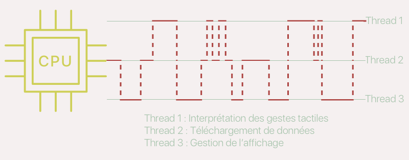
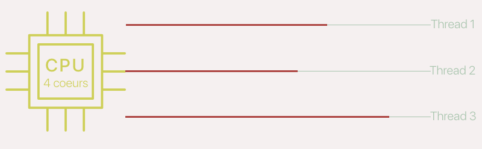
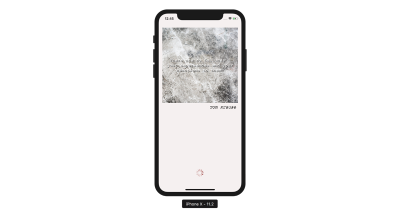

## Professionnalisez vos requêtes  

### Débloquez votre interface le multi-threading  
Dans le chapitre précédent, nous avons voulu tester notre application dans le simulateur et nous avons obtenu cette erreur :

```console
Main Thread Checker: UI API called on a background thread: -[UILabel setText:]
```

Et on ne va pas tirer beaucoup d'informations du message puisqu'on ne sait pas ce qu'est un **thread**. Ce chapitre va y remédier !

#### Présentation du multi-threading
Pour comprendre ce qu'est un *thread*, il faut savoir comment fonctionne le processeur de votre téléphone.

> **:information_source:** Le processeur, c'est le composant électronique qui fait tous les calculs dans votre ordinateur / tablette / téléphone / frigo connecté, etc.

Un processeur est une machine à calculer, mais contrairement à nous autres êtres pensants, **le processeur ne fait qu'une seule chose à la fois**.

Le problème c'est que parfois, vous avez besoin qu'il fasse deux plusieurs à la fois, surtout avec un smartphone réputé pour être multitâche !

Par exemple, lorsque vous vous déplacez dans une carte, l'iPhone doit gérer en même temps l'interprétation de votre geste sur l'écran tactile, le chargement de nouvelles zones de la carte sur le réseau et la modification de l'affichage à l'écran à partir des données de votre mouvement et de celles des zones chargées.

Pour y arriver et que le résultat soit fluide pour l'utilisateur, le processeur utilise la technique du **multithreading : il va séparer son activité en plusieurs threads et il va passer très rapidement de l'un à l'autre** en fonction de ses besoins, jusqu'à qu'il ait terminé de tout traiter. Cela donne quelque chose comme ça :



On voit sur ce schéma le processeur passer rapidement d'un thread à l'autre.

> **:information_source:** Cela a lieu tellement vite que l'utilisateur ne s'en rend pas compte, on parle de millisecondes.

Mais il y a encore plus efficace ! La dernière fois que vous avez acheté un ordinateur, vous avez peut-être entendu parler des processeurs bicoeur ou quadricoeur. Ce sont des processeurs qui eux ont vraiment la capacité de faire deux ou quatre choses à la fois, car ils ont deux ou quatre centres de calculs.

> **:information_source:** Certains processeurs très puissants ont jusqu'à 24 coeurs.

L'intérêt d'avoir plusieurs coeurs, c'est que du coup les calculs ont *vraiment* lieu en parallèle. Et le schéma précédent devient :



Les threads prennent tout leur sens avec ce genre de puce, car ils avancent en même temps et du coup les calculs sont bien plus rapides !

#### Les queues et GCD

Les threads sont un concept très bas niveau, c'est-à-dire très proche de la réalité matérielle d'un processeur. Du coup, les développeurs ont créé une logique un peu plus abstraite, mais plus facile à manipuler : les **queues**.

> **:information_source:** On fait souvent ça en développement. Par exemple, en tant que développeur, vous n'allez pas vous amuser à modifier directement la mémoire vive de votre téléphone. Si vous voulez stocker, lire ou modifier des données, vous allez utiliser des variables et non des capacités et adresses mémoires. Les queues sont aussi abstraites et pratiques que les variables et permettent d'éviter de gérer directement les threads.

Le mécanisme qui permet de s'affranchir des threads en tant que développeur s'appelle **Grand Central Dispatch**. C'est un peu comme une gare de triage. En tant que développeur, on va pouvoir créer des lignes de chemin de fer, les unes à côté des autres, c'est ce qu'on appelle des **queues**. Et on va pouvoir rajouter des trains sur ces queues, c'est ce qu'on appelle des **tâches**.

*Grand Central Dispatch* (GCD) est la technologie qui va s'occuper de faire avancer les trains en fonction des ressources du processeur, en minimisant l'impact sur la batterie du téléphone et selon un ordre de priorité défini par le développeur.

Autrement dit le développeur va créer les queues, leur assigner des tâches, définir les niveaux de priorités de chaque queue et GCD va faire avancer tout ce petit monde.

Il y a trois types de queues :
- ***Main Queue*** : c'est la queue principale, la plus prioritaire. Elle existe toujours. On va y revenir.
- ***Global Queues*** : ce sont des queues standard du système qui peuvent être utilisées par le développeur. Elles ont 4 niveaux de priorités. Les tâches dans les queues les plus prioritaires seront exécutées plus vite :
	- `User-interactive` : très prioritaire. À utiliser pour tout ce qui est lié à l'interface pour obtenir une expérience utilisateur fluide.
	- `User-initiated` : pour les tâches qui sont lancées par l'utilisateur, mais pour lesquelles on peut attendre une réponse.
	- `Utility` : pour les longues tâches dont l'utilisateur suit la progression : traitement d'images, téléchargement de ressources, etc.
	- `Background` : pour les tâches de fond dont l'utilisateur n'est pas au courant et qui ne sont donc pas urgentes.
- ***Custom Queue*** : ce sont des queues complètement paramétrables par le développeur.

#### Application à URLSession
> **:question:** OK, mais concrètement qu'est-ce que ça donne ?

Je sais, c'est beaucoup à digérer. Raccrochons les wagons et revenons au problème qui nous occupe.

Par défaut, **tout le code que vous rédigez s'exécute dans la *Main Queue*** (par habitude, certains parlent aussi de Main Thread, mais faites attention, ce ne sont pas des synonymes).

Le problème, c'est que lorsque vous faites un appel réseau dans la *Main Queue*, il faut attendre le retour et parfois cela prend du temps. Mais du coup, tout le reste de votre application est bloqué, interface comprise !

Pour empêcher cela, `URLSessionTask` effectue ses tâches de façon asynchrone dans une queue séparée. Et quand la réponse revient, je suis toujours dans une queue séparée. Pour être très concret, voici ce qui se passe dans le code :

```swift
static func getQuote() {
	// On est dans la Main Queue par défaut
	let request = createQuoteRequest()
	let session = URLSession(configuration: .default)

	// Pour éviter de bloquer l'application, la tâche va avoir lieu dans une queue séparée.
	let task = session.dataTask(with: request) { (data, response, error) in
		// A la réception de la réponse je suis toujours dans la queue séparée
	}
	task.resume()
}
```

Et c'est là qu'est le problème ! Car il existe une règle d'or avec les threads en iOS (et si vous ne retenez qu'une seule chose de ce chapitre, retenez ça !) :

> **Tout ce qui touche à l'interface doit avoir lieu dans la Main Queue !**

Or, ici quand on reçoit la réponse de notre appel réseau, on est dans une queue séparée, et tout ce qu'on fait ensuite a lieu dans une queue séparée, que ce soit l'envoi de la notification ou la mise à jour de l'interface.

Et maintenant, on comprend mieux ce que nous dit Xcode :

```console
Main Thread Checker: UI API called on a background thread: -[UILabel setText:]
```

Il ne veut pas effectuer la méthode `setText` de `UILabel,` car on n'est pas dans la `Main Queue`.

Qu'à cela ne tienne, on va y retourner !

#### Résolution du problème

Pour gérer les queues avec Swift, on utilise la classe `DispatchQueue`. Elle permet de créer des queues Custom, Global ou de revenir dans la Main Queue. Ou pour revenir dans la Main Queue, on écrit :

```swift
DispatchQueue.main.async {
	// Le code qui a lieu s'exécute dans la Main Queue
}
```

Il ne nous reste plus qu'à rajouter ça dans nos deux appels ce qui donne ceci pour la fonction `getQuote` :

```swift
static func getQuote() {
	let request = createQuoteRequest()
	let session = URLSession(configuration: .default)

	let task = session.dataTask(with: request) { (data, response, error) in
		DispatchQueue.main.async {
			// (...)
		}
	task.resume()
}
```

et pour la fonction `getImage` :

```swift
private static func getImage(completionHandler: @escaping ((Data?) -> Void)) {
	let session = URLSession(configuration: .default)
	let task = session.dataTask(with: pictureUrl) { (data, response, error) in
		DispatchQueue.main.async {
			// (...)
		}
	}
	task.resume()
}
```

Vous pouvez lancer votre application dans le simulateur et ça y est ! Tout fonctionne ! Bravo !

#### En résumé
- Les threads permettent au processeur de faire plusieurs choses à la fois en parallélisant ses calculs.
- Les queues sont des objets qui permettent au développeur des répartir des tâches sur plusieurs files différentes, notamment dans le but de ne pas bloquer l'application lorsqu'une tâche est trop longue.
- Il existe plusieurs types de queues.
- `Grand Central Dispatch` est le nom de la technologie qui gère l'avancement des tâches sur les différentes queues.
- **Tout ce qui touche à l'interface doit avoir lieu dans la Main Queue !**
- Pour revenir dans la Main Queue, on fait la commande suivante :
```swift
DispatchQueue.main.async {
	// Le code qui a lieu s'exécute dans la Main Queue
}
```

Dans le prochain chapitre, nous allons améliorer notre code pour gérer le cas des requêtes concurrentes.

### Gérez les requêtes concurrentes avec le singleton pattern  
Notre application fonctionne bien, mais nous ne gérons pas parfaitement nos appels. En effet, si vous appuyez plusieurs fois d'affiler sur le bouton *New Quote*, sans attendre la réponse du serveur, les résultats sont assez aléatoires... Ce n'est donc pas une expérience utilisateur de qualité !

Le problème, c'est qu'on envoie plusieurs appels à la fois et en fonction du réseau, ils ne vont pas forcément revenir dans le bon ordre. Pour résoudre ce problème, nous allons faire en sorte de n'autoriser qu'un seul appel à la fois !

#### Utiliser une seule tâche
Si on réfléchit à la façon dont fonctionnent nos appels pour l'instant, on se rend compte qu'à chaque appel, on crée une tâche différente.

En effet, lorsqu'on appelle notre méthode static `QuoteService.getQuote()`, on crée un nouvel objet `URLSessionTask` à chaque fois :

```swift
let task = session.dataTask(with: request) { (data, response, error) in
	// (...)
}
```

Pour changer ça, nous allons commencer par faire de cette tâche une propriété de notre classe `QuoteService` :

```swift
private var task: URLSessionDataTask?
```

> **:information_source:** Je lui donne le type optionnel pour ne pas avoir à l'initialiser ici.

Ensuite, je peux utiliser cette tâche dans `getQuote` et `getImage` comme ceci :

```swift
task = session.dataTask(with: request) { (data, response, error) in
	// (...)
}
```

Le problème, c'est que maintenant nous utilisons une propriété dans une méthode statique donc Xcode ne va pas être content... Qu'à cela ne tienne ! Nous allons modifier toutes nos méthodes statiques en méthodes d'instances en supprimant les mot-clés `static`.

> **:x:** Cela cause 2/3 tout petits soucis, mais je vous fais confiance à votre niveau pour les résoudre comme des grands ! ;)

Maintenant, nous devons modifier notre appel dans le contrôleur comme ceci :

```swift
QuoteService().getQuote()
```

On appelle la fonction `getQuote` sur une instance de `QuoteService` et non sur la classe directement.

#### Annuler une tâche

Avec ce petit travail préalable, **nous allons pouvoir travailler sur une instance fixe de `task`** et donc on va pouvoir annuler la tâche si une autre tâche est lancée.

On a vu qu'on pouvait lancer un appel avec la méthode `resume` de `URLSessionTask`. Pour l'annuler, on va utiliser la méthode `cancel`.

```swift
task?.cancel()
task = session.dataTask(with: request) { (data, response, error) in
	// (...)
}
task?.resume()
```

Si une tâche est en cours, on l'annule avant de créer puis lancer une nouvelle tâche !

> **:warning:** Il faut bien sûr faire cela pour les deux appels, celui de `getQuote` et celui de `getImage`.

#### La dure confrontation avec le réel...

Avec le travail que l'on vient de faire, vous pouvez tester dans le simulateur que les appels ont maintenant bien lieu les uns après les autres.

> **:question:** Euh... Rien à changer !

Eh oui ! Je vous ai (encore ;) ) bien eu !

Pourquoi rien à changer ? À cause de cette ligne :

```swift
QuoteService().getQuote()
```

À chaque fois, qu'on appuie sur le bouton et qu'on appelle la fonction `getQuote`, **on crée une nouvelle instance de `QuoteService`**. Du coup, on créée à chaque fois une nouvelle instance de `task` et donc on ne peut jamais annuler la tâche en cours, car on ne travaille jamais avec la même tâche !

Pour résoudre ce problème, il faudrait que l'on travaille toujours avec la même instance de `QuoteService` et pour cela, nous allons découvrir et utiliser le pattern Singleton.

#### Le pattern Singleton

##### Définition
**Le pattern Singleton permet de limiter l'usage d'une classe à une seule instance.** Cela veut dire que l'on ne va pas pouvoir créer plusieurs instances de la classe, on ne va pouvoir en utiliser qu'une seule !

Ce pattern est souvent utile lorsqu'on a besoin de gérer **un unique objet**. Par exemple, en iOS, la classe `UIDevice` (qui permet notamment d'avoir des informations sur le modèle, la version d'iOS du téléphone, etc.) utilise ce pattern.

En effet, votre code est exécuté sur un appareil unique. Du coup, pour accéder aux informations stockées dans cette classe, vous n'allez pas utiliser ceci :

```swift
UIDevice()
```

Mais ceci :

```swift
UIDevice.current
```

`UIDevice` définit une propriété statique `current` de type `UIDevice` qui est la seule instance disponible de cette classe :

```swift
class UIDevice {
	static var current = UIDevice()
}
```

##### Utilisation

Nous allons faire la même chose avec notre classe `QuoteService`. Nous allons définir une propriété statique de type `QuoteService` :

```swift
static var shared = QuoteService()
```

> **:information_source:** On nomme souvent `shared` l'instance unique, car c'est l'instance qui va être **partagée** par toutes les autres classes qui vont l'utiliser.

Maintenant, nous allons protéger la classe pour empêcher la création d'autres instances. Une idée de comment faire ?

> **:question:** Il suffit de ne pas créer d'initialiseur. Et c'est déjà le cas, donc c'est bon ?

Bien vu ! Mais pas tout à fait exact ! Souvenez-vous, les classes ont un initialiseur par défaut qui n'a aucun paramètre. C'est cet initialiseur par défaut qui nous avait permis d'écrire ceci :

```swift
QuoteService().getQuote()
```

L'initialiseur par défaut est présent dans les parenthèses après `QuoteService`. Nous ne pouvons pas supprimer cet initialiseur par défaut, mais nous pouvons le rendre inaccessible en dehors de la classe `QuoteService` en le rendant privé :

```swift
private init() {}
```

Et voilà ! Vous pouvez maintenant essayer d'écrire `QuoteService()`, cela ne marche plus qu'à l'intérieur de la classe `QuoteService`.

On a maintenant une instance unique de notre classe que nous allons pouvoir utiliser comme ceci :

```swift
QuoteService.shared.getQuote()
```

Vous pouvez essayer dans le simulateur ! Si vous lancez deux appels sans attendre le retour du premier, vous aurez maintenant une alerte qui s'affiche :


Cela signifie que la première tâche a bien été annulée avant qu'une deuxième ne soit créée.

#### Protégez l'interface

Nous avons enfin réussi à ne faire qu'un seul appel à la fois ! Et c'est très bien ! Mais l'expérience utilisateur n'est pas incroyable avec cette alerte.

Nous allons faire en sorte que de toute façon, l'utilisateur ne puisse pas lancer deux appels en même temps. Et pour cela, **nous allons cacher le bouton le temps de la requête et le remplacer par un indicateur d'activité**.

Rien de plus simple ! Il suffit d'utiliser la propriété `isHidden` pour cacher le bouton et afficher l'indicateur puis faire l'inverse lorsque la réponse revient :

```swift
@objc func quoteRequestDidFail() {
	newQuoteButton.isHidden = false
	activityIndicator.isHidden = true

	// (...)
}

@objc func quoteRequestDidSucceed(notification: Notification) {
	newQuoteButton.isHidden = false
	activityIndicator.isHidden = true

	// (...)
}

@IBAction func tappedNewQuoteButton() {
	QuoteService.shared.getQuote()

	newQuoteButton.isHidden = true
	activityIndicator.isHidden = false
}
```

Et comme nous sommes des développeurs qui détestons nous répéter, on va créer une jolie méthode et écrire plutôt ceci :

```swift
@objc func quoteRequestDidFail() {
	toggleActivityIndicator(shown: false)

	// (...)
}

@objc func quoteRequestDidSucceed(notification: Notification) {
	toggleActivityIndicator(shown: false)

	// (...)
}

@IBAction func tappedNewQuoteButton() {
	QuoteService.shared.getQuote()
	toggleActivityIndicator(shown: true)
}

private func toggleActivityIndicator(shown: Bool) {
	activityIndicator.isHidden = !shown
	newQuoteButton.isHidden = shown
}
```

Et voilà ! Vous pouvez lancer votre application dans le simulateur et maintenant, vous avez une belle roue qui tourne pour signifier à l'utilisateur le chargement de la citation et l'empêcher de lancer un deuxième appel.



> **:warning:** Cela ne veut pas dire qu'il suffit de protéger l'interface ! Même si c'est pratique, **vos appels doivent aussi être protégés dans le modèle**. On ne sait jamais comment l'interface peut évoluer dans le futur.

#### En résumé

- Pour annuler une tâche, vous pouvez utiliser la méthode `cancel`. Pour cela, il faut que vous ayez accès à la même instance et donc éviter la création d'une nouvelle tâche à chaque appel.
- **Le pattern Singleton permet d'obtenir une classe qui admet une unique instance.**
- Pour le créer, on crée une instance dans une propriété statique et on rend privée l'initialisation par défaut :  
```swift
class Singleton {
	static var shared = Singleton()
	private init() {}
}
```
- Pour une bonne expérience utilisateur, il est conseillé d'empêcher les appels multiples en utilisant un indicateur d'activité

Dans le prochain chapitre, vous allez découvrir une fonctionnalité toute simple de Swift, mais qui va rendre votre code bien plus propre : le mot-clé guard !

### Fuyez la pyramide condamnée avec guard  
Oui le titre de ce chapitre sonne comme le début d'un mauvais film d'horreur des années 80... Et pour autant, nous allons parler d'un sujet très sérieux en programmation : la Pyramide Condamnée (ou Pyramid of Doom en anglais, tout de suite ça fait moins rire... Ils sont fort ces Américains...) !


#### La pyramide condamnée

> **:question:** Très bien, mais c'est quoi ?

Une illustration vaut mille mots, alors je vous laisse apprécier ce gif :


La pyramide condamnée, c'est donc quand on a des conditions les unes dans les autres qui forment une pyramide immense et rendent le code assez peu agréable à lire, à cause de toutes les indentations.

Et comme vous le savez, **la lisibilité du code est tout sauf optionnelle** ! C'est ce qui fera de vous des bons ou des mauvais développeurs ! Donc on va prendre ce problème très au sérieux et le résoudre grâce au mot-clé `guard`.

#### Le mot-clé guard
Le mot clé `guard` est un cousin de la combinaison `if/else`. Il permet lui aussi de contrôler des conditions, mais avec une syntaxe un peu particulière.

Prenons un exemple : si vous voulez contrôler qu'il n'y a pas d'erreur, vous allez écrire :

```swift
if error == nil {
	print("Tout va bien !")
} else {
	print("Oups ! Il y a une erreur.")
}
```

Jusque là, rien de nouveau. Maintenant écrivons la même chose avec le mot-clé guard :

```swift
guard error == nil else {
	print("Oups ! Il y a une erreur.")
	return
}

print("Tout va bien !")
```

C'est un petit peu déroutant au début alors prenons le temps de détailler :
1. On écrit d'abord le mot-clé guard suivi d'une condition, jusque là ça ressemble au if.
2. Ensuite, on écrit tout de suite le `else` suivi du code correspondant au cas où la condition **n'est pas** respectée.
3. Ensuite, on écrit le mot-clé `return` qui empêche la suite du code de s'exécuter s’il y a une erreur.
4. Enfin, on sait que l'erreur a été traitée s'il y en avait une donc on peut exécuter le code correspondant au cas où **la condition est respectée**.

Ce mécanisme permet de traiter les erreurs d'abord et ensuite d'exécuter son code sereinement. On appelle ce mécanisme *early exit*. Car `guard` fournit une porte de sortie rapide du code si la condition est évaluée à `false`, sinon le code continue de s'exécuter.

Voici du coup la représentation schématique de guard :

```swift
guard condition else {
	// Code si false
	return
}
// Code si true
```

> **:warning:** En pratique, si vous vous trouvez dans une fonction qui renvoie une valeur. Vous écrirez `return` suivie d'une valeur. Par exemple `return nil`, ou `return 0`.

> **:information_source:** Sachez qu'il y a d'autres moyens pour sortir du `guard` que `return` comme `throw` ou `fatalError,` mais vous verrez ça plus tard.

#### Refactorisation de QuoteService avec guard
Voyons maintenant ce que ça donne sur notre classe `QuoteService` et commençons avec la fonction `getImage` :

```swift
private func getImage(completionHandler: @escaping ((Data?) -> Void)) {
	let session = URLSession(configuration: .default)

	task?.cancel()
	task = session.dataTask(with: QuoteService.pictureUrl) { (data, response, error) in
		DispatchQueue.main.async {
			guard let data = data, error == nil else {
				completionHandler(nil)
				return
			}

			guard let response = response as? HTTPURLResponse, response.statusCode == 200 else {
				completionHandler(nil)
				return
			}

			completionHandler(data)
		}
	}
	task?.resume()
}
```

La pyramide a disparu et c'est l'un des gros avantages de `guard` : vous permettre de gérer les erreurs au même niveau que les cas nominaux (les cas où tout se passe bien) !

À vous de jouer maintenant ! Essayez de factoriser la fonction getQuote avec guard ! Vous pourrez retrouver la correction [ici](https://s3-eu-west-1.amazonaws.com/static.oc-static.com/prod/courses/files/Parcours+DA+iOS/Cours+8+-+Appels+réseaux/getQuote.swift).

#### guard/else vs if/else  

> **:question:** OK, mais du coup quand doit-on utiliser guard plutôt que if ?

`guard` ou `if` que choisir ? Tel est la question ! La réponse est assez simple :

> **On utilise `if` pour faire de logique entre plusieurs cas et `guard` pour prévenir une erreur.**

Prenons un exemple, si je veux vérifier que l'utilisateur a bien rentré un email dans un champ de texte, il s'agit plutôt de prévenir une erreur donc je vais utiliser guard :

```swift
guard text.isEmail else {
	print("Vous n'avez pas rentré un email correct.")
	return
}

print("Merci pour votre email !")
```

Maintenant, imaginons que je lui demande son âge et que selon son âge, il va avoir le droit à des accès différents :

```swift
if age >= 18 {
	print("Vous avez accès au bar.")
} else {
	print("Vous avez accès à la salle de billard.")
}
```

Ici, il ne s'agit pas de renvoyer une erreur ou non, mais d'articuler une logique selon plusieurs cas donc j'utilise `if`.

> **:information_source:** En pratique, vous allez du coup assez souvent utiliser `guard`. Ne serait-ce que pour déballer des optionnels. Par ailleurs, je vous suggère d'utiliser le `switch` combiné à une énumération quand il y a plusieurs cas donc finalement vous devriez utiliser assez peu le `if`.

#### En résumé
- La pyramide condamnée apparaît lorsqu'on enchaîne les conditions les unes dans les autres en obtenant des indentations de plus en plus grandes.
- Le mot-clé `guard` permet de casser la pyramide condamnée en permettant la gestion d'erreur au même niveau que le cas nominal.
- Le mot-clé `guard` s'utilise avec la syntaxe suivante :  
```swift
guard condition else {
	// Code si false
	return
}
// Code si true
```
- On utilise `if` pour faire de logique entre plusieurs cas et `guard` pour prévenir une erreur.


Bravo ! Vos appels réseau sont désormais de grande qualité, vous pouvez être fier de vous ! Ce qui fera vraiment la différence néanmoins, ce sera votre capacité à faire du code stable. Et qui dit stable, dit testable ! Or, tester les appels réseau n'est pas toujours une tasse de thé... sauf si vous passez simplement à la partie suivante ! ;)
