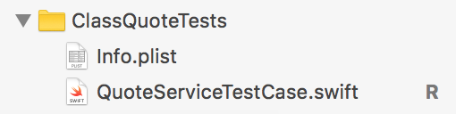
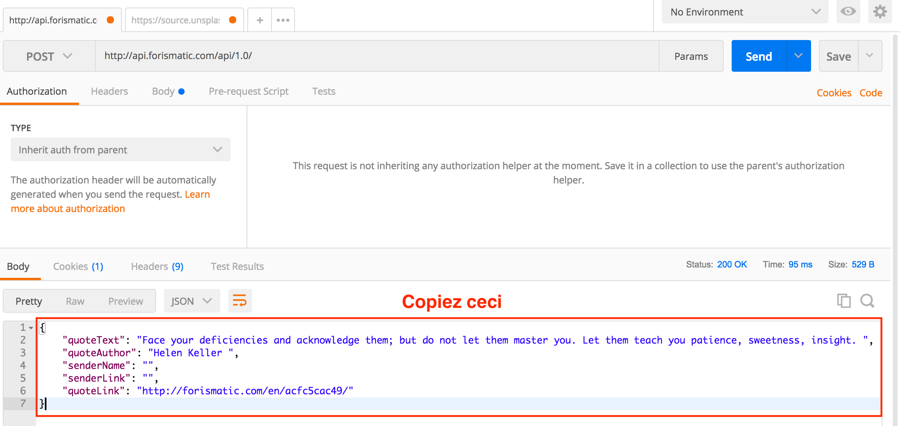
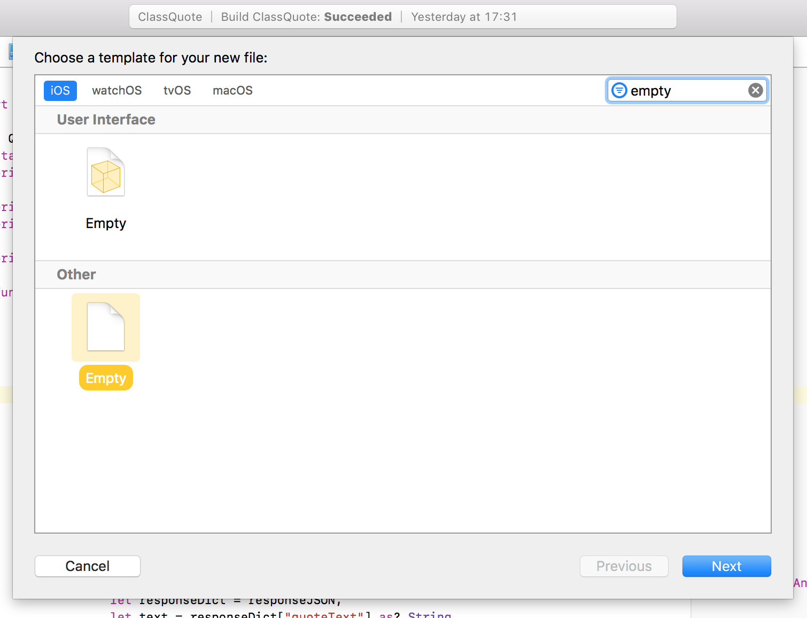
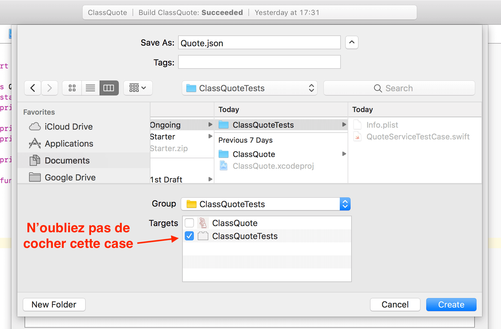
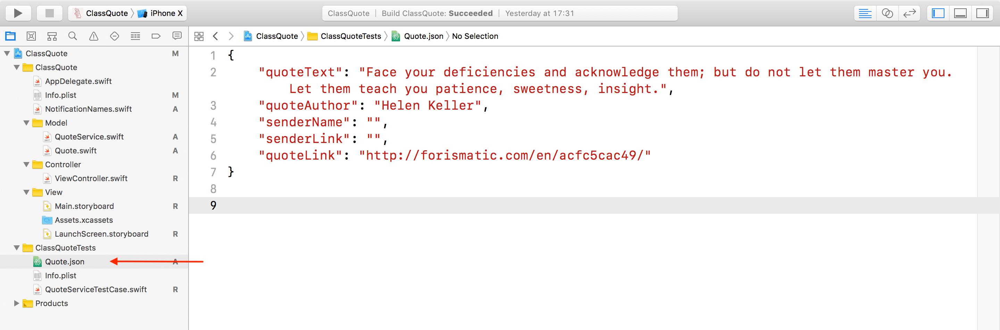
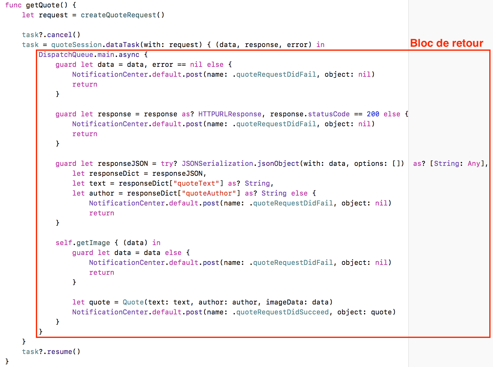
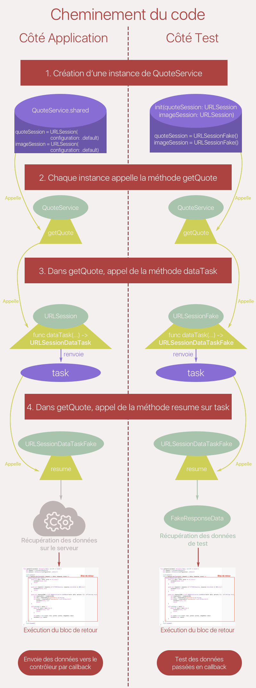

## Testez votre appel réseau  

### Appréhendez la difficulté de tester un appel réseau  
Comme tout développeur qui se respecte, vous devriez vous sentir mal à l'aise maintenant... Il y a quelque chose qui vous perturbe fondamentalement, qui secoue votre être tout entier. Et tout à coup, vous posez les mots sur votre inconfort transcendantal :

> **:question:** ON N’A PAS FAIT DE TESTS !

C'est excellent ! Je vois que vous êtes pétris de bonnes pratiques. Mais rassurez-vous, nous allons en parler pendant toute cette partie ! Alors, accrochez-vous, car, c'est sans doute la partie de ce cours la plus riche !

> **:warning:** Vous ne pourrez pas suivre cette partie du cours sans une vraiment bonne compréhension des tests en iOS. Si ce n'est pas le cas, allez voir ce [cours](https://openclassrooms.com/courses/debuggez-et-testez-vos-applications-ios) !

#### Le problème

Comme nous l'avons vu, en MVC on teste au moins le modèle. Donc en l'occurrence, pour nous cela se résume à la classe `QuoteService`.

> **:information_source:** En effet, la structure `Quote` ne contient pas de logique donc on ne va pas la tester.

Or, dans la classe `QuoteService`, on fait des appels réseau. Et donc, la réponse va tarder à arriver. Et on retombe dans le même problème. On doit attendre la réponse de l'appel dans le test.

Or les tests ne sont pas faits pour attendre. Il s'exécute instantanément.

Mais bien sûr, il existe des solutions à cela et nous allons en mentionner deux :
1. Les expectations
2. Les doubles

#### Les expectations
Les expectations sont une mécanique présente dans le framework `XCTest` qui permet justement d'attendre un certain délai avant de terminer l'exécution du test.

Voici comment elles fonctionnent :

```swift
func testDownloadWebData() {

	// On crée l'expectation en lui donnant une simple description.
	let expectation = XCTestExpectation(description: "Télécharge le site openclassrooms.com")

	// On prépare une requête
	let url = URL(string: "https://openclassrooms.com")!
	let dataTask = URLSession(configuration: .default).dataTask(with: url) { (data, _, _) in

		// On vérifie qu'il y a bien des données qui ont été chargées, c'est ici que le test a lieu.
		XCTAssertNotNil(data)

		// On déclare que l'expectation est terminée, on peut clore le test.
		expectation.fulfill()
	}

	// On lance la requête.
	dataTask.resume()

	// On attend que l'expectation soit terminée, avec une durée maximum de 10 secondes.
	wait(for: [expectation], timeout: 10.0)
}
```

L'expectation permet d'attendre le retour de la requête. Cette méthode est donc assez simple et a l'avantage de fonctionner tout de suite sans modification du code de notre application.

Mais elle a un très gros défaut : **chaque test va mettre entre 2 et 10 secondes selon la qualité du réseau à s'exécuter**. Ce qui est 50 fois plus long qu'un test classique. Et si vous multipliez ça par 3 ou 4 tests par appels réseau, vous finissez avec une suite de tests qui s'exécute en quelques minutes au lieu de quelques secondes, même pour une petite application.

> **:question:** OK, mais quel est le problème à ce que les tests soient longs ?

Le but des tests est de protéger votre code et d'éviter l'apparition de bugs. Donc à chaque fois que vous changez votre code, vous allez lancer vos tests pour vérifier que tout va bien. Et si vos tests durent à chaque fois quelques minutes, soit vous allez cesser de le faire, soit vous allez perdre un temps fou.

Donc, pour résumer, **des tests unitaires longs sont des tests unitaires inexistants.**

Par ailleurs, vos tests vont avoir un deuxième défaut, ils seront **instables**. En fonction de la qualité du réseau, vos tests vont passer ou non. Si la requête mets plus de 10 secondes, le test va échouer et vous aller perdre du temps à chercher une erreur qui est en fait simplement dû au réseau.

Bref, il faut une autre option.

#### Les doubles  
L'autre option, ce sont les doubles. **Un double, c'est une classe qui va se substituer à une autre pour simuler son comportement.**

Par exemple, on va créer un double de `URLSession` qui va simuler les appels réseau, mais ne pas les faire vraiment. On pourra quand même tester le comportement lié à la réponse : s'il manque des données, s'il y a une erreur, si tout va bien, etc. Mais **comme on simule l'appel, on n’a pas le délai d'attente de la réponse lié au réseau**.

Cette technique permet donc de s'affranchir du délai d'un appel réseau et donc tous les désavantages qui vont avec, comme la lenteur et l'instabilité des tests. C'est donc largement mieux de procéder ainsi !

Le seul défaut de cette méthode, c'est qu'elle est un peu plus longue à mettre en place. Mais une fois que vous aurez bien compris, ce sera facile !

Nous allons procéder en plusieurs étapes :
1. Création des réponses réseau pour simuler le résultat.
2. Préparation du code pour le rendre testable avec des doubles.
3. Création du double
4. Rédaction des tests

> **:information_source:** Vous avez peut-être déjà entendu parler des doubles sous d'autres terminologies comme mock ou fake. Ce ne sont pas exactement des synonymes et on va voir ensemble la différence entre ces termes.

> **:warning:** Je me permets d'insister sur le fait que **cette partie est vraiment la plus importante du cours,** car elle va vous permettre de vous distinguer en tant que développeur professionnel.

#### En résumé
Pour tester des appels réseau, on peut utiliser :

- les expectations : facile à mettre en place mais rendent les tests lents et instables. Mauvaise option.
- les doubles : plus compliqué à mettre en place mais gardent les tests propres et rapides.

Dans le prochain chapitre, nous allons créer des données de test qui vont nous permettre de simuler la réponse à un appel réseau.

### Créez votre jeu de données de test  
Pour éviter de faire de véritables appels réseau dans nos tests, nous allons créer un jeu de données de test. Ces données vont simuler les différentes réponses que l'on peut recevoir avec appels réseau.

Pour cela, nous allons créer de fausses données de réponse pour nos tests, soit à partir de véritables données récupérées sur l'API Forismatic, soit en créant nous-mêmes nos données.

#### Mettre en place les tests

Pour faire tout cela, il nous une target dans notre projet Xcode pour écrire nos tests unitaires. Nous allons la créer et créer ensuite un fichier de test unitaire : `QuoteServiceTestCase.swift`.

> **:information_source:** Toutes les instructions pour faire cela sont détaillées dans ce [cours](https://openclassrooms.com/courses/debuggez-et-testez-vos-applications-ios/creez-votre-premier-test).

Je vous laisse faire. Vous devriez obtenir ceci dans votre navigateur :



#### Récupérer des données de test

Nous allons récupérer nos données de test directement depuis l'API Forismatic pour qu'elles soient le plus proche possible de la réalité.

Pour cela, lancez simplement un appel sur Postman et copiez la réponse :



Ensuite, dans Xcode, créez un nouveau fichier (<kbd>cmd + n</kbd>) et choisissez *Empty* :



Puis nommez le `Quote.json` et sauvegardez-le du côté des tests.



Dedans, vous pouvez coller la réponse récupérée dans Postman.



Nous avons maintenant un joli fichier json dans notre projet que nous allons pouvoir utiliser dans nos tests à la place d'un véritable appel réseau.

#### Remplissage de notre classe

Pour pouvoir récupérer les données sur le fichier et les utiliser dans nos tests, nous allons créer une classe que nous allons appeler `FakeResponseData` dont le rôle va être de gérer les données de test.

> **:information_source:** Je vous invite à créer le fichier et la classe correspondante.

C'est fait ? Bien ! Réfléchissons maintenant aux données que nous allons essayer de simuler dans cette classe. Cette classe doit nous permettre de simuler la réponse d'un serveur lors de nos deux appels réseau.

Du coup, retournons voir un peu à quoi ressemble cette réponse :

```swift
task = session.dataTask(with: request) { (data, response, error) in
	// (...)
}
```

La réponse contient trois paramètres `data`, `response` et `error`. Pour simuler la réponse des deux APIs, nous allons avoir besoin de simuler ces trois paramètres pour chaque appel. Je vous propose de commencer par le plus simple : `response`.

##### Simuler response

Pour simuler `response`, nous allons créer deux instances de `HTTPURLResponse` :
- Une qui a pour code 200 : c'est le cas où tout va bien.
- Une avec le code 500 : quand ça ne fonctionne pas.

```swift
static let responseOK = HTTPURLResponse(
	url: URL(string: "https://openclassrooms.com")!,
	statusCode: 200, httpVersion: nil, headerFields: [:])!

static let responseKO = HTTPURLResponse(
	url: URL(string: "https://openclassrooms.com")!,
	statusCode: 500, httpVersion: nil, headerFields: [:])!
```

> **:information_source:** On met une URL au hasard, car ici on ne s'intéresse ici qu'au code HTTP, c'est la seule chose que l'on contrôle.

Ces deux réponses vont nous permettre de tester nos cas d'erreurs liés à un mauvais code HTTP.

##### Simuler error

Dans notre code, on ne s'intéresse pas à l'erreur en elle-même mais seulement à **la présence ou non** d'une erreur. Donc nous allons juste créer une erreur toute simple comme ceci :

```swift
class QuoteError: Error {}
static let error = QuoteError()
```

Ici, on doit créer une classe `QuoteError` qui implémente le protocole `Error`. En effet, `Error` étant un protocole, on ne peut pas en obtenir une instance. Donc je crée une classe pour y parvenir.

> **:information_source:** Si ce point n'est pas parfaitement clair, ce n'est pas trop grave pour le moment. On parlera plus des protocoles dans un autre cours. L'essentiel, c'est que vous compreniez ici qu'on simule une erreur, peu importe son contenu.

#### Simuler data

Nous allons maintenant, nous attaquer au plus gros morceau : simuler les véritables données renvoyées par les APIs et nous allons simuler trois données différentes :
- Le JSON renvoyé par Forismatic.
- Un JSON endommagé qui ne correspond pas au format que nous attendons.
- Les données renvoyées par Unsplash.

Toutes ces données doivent être de type `Data`.

##### Simuler le json renvoyé par Forismatic

Nous allons utiliser le fichier que nous avons créé en début de chapitre. Notre objectif va être ici de récupérer les données du fichier dans le code.

Pour cela, il faut d'abord récupérer le paquet dans lequel se trouve notre fichier. Ce paquet, on l'appelle `Bundle` en Swift. Et il nous faut commencer par récupérer le bon `bundle` : celui dans lequel se trouve notre fichier `Quote.json`.

Il y a deux `bundle` dans notre projet, un par *target*, donc un pour les tests et un pour l'application.

On va récupérer celui des tests comme ceci :

```swift
let bundle = Bundle(for: FakeResponseData.self)
```

Ici je demande le `bundle` qui contient le fichier de la classe dans laquelle je me trouve : `FakeResponseData`. Ce sera du coup le bundle des tests, celui qui contient aussi notre fichier `Quote.json`.

Une fois qu'on a le `bundle`, on récupère l'URL à laquelle se trouve notre fichier en indiquant le nom et l'extension du fichier que l'on cherche :

```swift
let url = bundle.url(forResource: "Quote", withExtension: "json")!
```

Enfin, je récupère les données contenues à cette url via l'initialiseur `init(contentsOf: URL)` de `Data` :

```swift
let data = try! Data(contentsOf: url)
```

> **:information_source:** Ne paniquez pas sur `try!`, je vous promets, on va en parler !

On va mettre tout ça dans une propriété calculée et ça donne ceci :
```swift
static var quoteCorrectData: Data? {
	let bundle = Bundle(for: FakeResponseData.self)
	let url = bundle.url(forResource: "Quote", withExtension: "json")!
	return try! Data(contentsOf: url)
}
```

Et voilà ! Nous avons les données de notre fichier dans une belle propriété qu'on va pouvoir utiliser dans nos tests.

##### Simuler un json endommagée

Pour simuler un JSON endommagé, il suffit d'avoir des données qui n'ont rien à voir avec un fichier JSON. Pour cela, on va créer une constante de type `Data` dans laquelle on va mettre la valeur de notre choix.

> **:information_source:** On peut du coup mettre n'importe quelle valeur ! Si je vous demande de me présenter un animal qui est tout sauf une vache, vous avez l'embarras du choix ;) !

Ma méthode préférée pour créer de fausses données, c'est l'encodage des `String` :

```swift
static let quoteIncorrectData = "erreur".data(using: .utf8)!
```

J'utilise la méthode `data(using:)` sur un string de mon choix et je précise l'encodage le plus classique. La méthode renvoie une valeur de type `Data`.

> **:information_source:** Vous pouvez écrire ce que vous voulez à la place de "erreur".

Les données générées par cet encodage n'auront rien à voir avec un JSON et cela va nous permettre de tester le cas où les données ne sont pas au format attendu.

##### Simuler les données de l'image

Enfin, pour simuler les données de l'image, je vais faire exactement la même chose :

```swift
static let imageData = "image".data(using: .utf8)!
```

> **:information_source:** Ces données ne permettront jamais de faire une image mais ce n'est pas le but. Ici, je veux juste pouvoir vérifier que les données que je reçois sont utilisées correctement **dans mon modèle** mais pas dans ma vue.

Et voilà ! Toutes nos données sont prêtes et elles vont nous permettre de simuler toutes les différentes réponses que nous pouvons recevoir de nos deux appels.

#### En résumé
En guise de résumé, je vous propose le code complet de la classe `FakeResponseData` :

```swift
class FakeResponseData {
	// MARK: - Data
	static var quoteCorrectData: Data? {
		let bundle = Bundle(for: FakeResponseData.self)
		let url = bundle.url(forResource: "Quote", withExtension: "json")!
		return try! Data(contentsOf: url)
	}

	static let quoteIncorrectData = "erreur".data(using: .utf8)!

	static let imageData = "image".data(using: .utf8)!

	// MARK: - Response
	static let responseOK = HTTPURLResponse(
		url: URL(string: "https://openclassrooms.com")!,
		statusCode: 200, httpVersion: nil, headerFields: [:])!

	static let responseKO = HTTPURLResponse(
		url: URL(string: "https://openclassrooms.com")!,
		statusCode: 500, httpVersion: nil, headerFields: [:])!


	// MARK: - Error
	class QuoteError: Error {}
	static let error = QuoteError()
}
```

> **:information_source:** Si vous souhaitez aller plus loin, je vous suggère ce [très bon post](https://www.swiftbysundell.com/posts/writing-end-to-end-json-mapping-tests-in-swift). Il explique comment automatiser la première partie de ce chapitre où l'on récupère et ajoute le fichier JSON dans notre projet. Sa méthode a l'avantage de s'assurer que l'on teste toujours vis-à-vis de la dernière version d'une API.

Dans le prochain chapitre, nous allons préparer notre classe `QuoteService` à être testée et vous allez découvrir un concept important en architecture logicielle : l'injection de dépendance.

Et rassurez-vous, ça n'est pas aussi impressionnant que ça en a l'air !

### Préparez votre classe à être testée  
Nous avons maintenant les données qui vont nous permettre de simuler les réponses à nos appels réseau.

Le but de tout ceci, ne l'oublions pas, est de tester la classe `QuoteService`. Or, lorsqu'on teste, on ne s'intéresse qu'à la partie publique d'une classe et pas à son implémentation interne.

Dans notre cas, voici à quoi ressemble la partie publique de notre classe :

```swift
class QuoteService {
	static let shared: QuoteService
	func getQuote(callback: @escaping (Bool, Quote?) -> Void)
}
```

Notre interface publique ne présente donc qu'une méthode : la méthode `getQuote`. **C'est donc exclusivement cette méthode que nous allons tester.**

Le problème, c'est que dans cette méthode, il y a un appel réseau. Or nous voulons justement éviter l'appel réseau dans les tests et récupérer plutôt les données via notre classe `FakeResponseData`.

À première vue, cela paraît compliqué. Parce que cela veut dire qu'il nous faut deux versions différentes d'une même méthode, une pour les tests et une pour l'application.

> **:question:** Mais c'est impossible !

Pas tout à fait, et nous allons voir comment faire ça dans ce chapitre !

> **:warning:** Ce chapitre est la clé de voute de cette partie ! Donc, accrochez-vous !

#### À la recherche des coupables

Regardons un peu notre fonction `getQuote` pour voir comment elle fonctionne :

```swift
func getQuote(callback: @escaping (Bool, Quote?) -> Void) {
	let request = createQuoteRequest()
	let session = URLSession(configuration: .default)

	task?.cancel()
	task = session.dataTask(with: request) { (data, response, error) in
		// (...)
	}
	task?.resume()
}
```

Ici l'appel est créé à la ligne 6 avec la méthode `dataTask` de `URLSession` et il est lancé à la ligne 9 avec la méthode `resume` de `URLSessionDataTask`. C'est précisément à ces deux endroits que l'on doit modifier les choses pour que l'appel n'ait pas lieu dans les tests.

Donc cela veut dire qu'en fait, on ne veut pas modifier l'implémentation de `getQuote` mais celles de `dataTask(with:, completionHandler:)` et de `resume()`.

> **:question:** Mais on ne peut pas modifier les méthodes de ces classes ! On ne les a pas écrites !

Oui, vous avez tout à fait raison.

Mais rien ne nous empêche de créer des sous-classes d'`URLSession` et de `URLSessionDataTask` dans lesquelles nous allons faire l'override des méthodes qui nous ennuie. Comme ceci par exemple :

```swift
class URLSessionFake: URLSession {
	override func dataTask(with url: URL, completionHandler: @escaping (Data?, URLResponse?, Error?) -> Void) -> URLSessionDataTask {
		// Ici j'écris ce que je veux
	}
}
```

Et dans cette version *fake* de URLSession, on peut écrire ce qu'on veut.

> **:question:** OK, c'est très bien vu, mais ça nous avance à rien !

Pardon ?

> **:question:** Bah oui. Le code de `getQuote` utilise la classe `URLSession` et pas ta classe `URLSessionFake`.

C'est vrai mais on peut changer le code et utiliser la classe `URLSessionFake`, non ?

> **:question:** Oui mais si on fait ça, ce sera bien pour les tests mais l'application ne marchera plus !

Hmmm... Vous vous ne vous laissez pas avoir si facilement, c'est bien ! En effet, il faut qu'on trouve un moyen d'utiliser `URLSession` côté application et `URLSessionFake` côté test.

Et ce problème a une solution qui porte un nom repoussant : l'injection de dépendance.

#### L'injection de dépendance

L'**injection de dépendance**, dit comme ça, ça a l'air hyper technique mais en fait, c'est vraiment simple. Il s'agit de **sortir une variable de l'implémentation d'une méthode pour en faire une propriété.**

En tant que propriété de la classe, celle-ci peut-être librement modifiée et donc le code ne dépend plus de cette variable.

Prenons un exemple pour y voir plus clair. Pour l'instant, mon code ressemble à ceci :

```swift
func getQuote(callback: @escaping (Bool, Quote?) -> Void) {
	let request = createQuoteRequest()
	let session = URLSession(configuration: .default) // Le code dépends de URLSession

	task?.cancel()
	task = session.dataTask(with: request) { (data, response, error) in
		// (...)
	}
	task?.resume()
}
```

Donc mon code dépend de la classe `URLSession`.

> **:information_source:** En programmation *dépendre de* signifie que mon code ne peut plus fonctionner si la classe `URLSession` n'existe pas.

Nous allons maintenant extirper cette variable et en faire une propriété de la classe :

```swift
class QuoteService {
	var session = URLSession(configuration: .default)

	func getQuote(callback: @escaping (Bool, Quote?) -> Void) {
		let request = createQuoteRequest()

		task?.cancel()
		task = session.dataTask(with: request) { (data, response, error) in
			// (...)
		}
		task?.resume()
	}
}
```

La dépendance envers `URLSession` a disparu de l'implémentation de `getQuote`. Je n’avais pas dit que c'était simple ?

> **:question:** Attends un peu ! La méthode `getQuote` ne dépend peut-être plus de `URLSession` mais la classe `QuoteService` en dépend toujours.

Certes, mais comme `session` est devenue une propriété, cela signifie que je peux changer sa valeur. Et je peux donc écrire ceci :

```swift
var quoteService = QuoteService.shared
quoteService.session = URLSessionFake()
```

> **:information_source:** `URLSessionFake` étant une sous-classe de `URLSession`, toute instance de `URLSessionFake` est par héritage une instance de `URLSession`. C'est cette astuce qui rend possible la ligne 2.

Ainsi, lorsque j'utilise ma classe côté application, je garde la valeur de `session` par défaut mais lorsque je l'utilise pour les tests, j'utilise une autre valeur avec la classe `URLSessionFake` qui me permet d'éviter l'appel.

**Cette propriété est un point d'entrée pour injecter une dépendance**. Je peux choisir la dépendance que j'injecte : `URLSession` ou `URLSessionFake`, d'où le nom d'injection de dépendance.

Je vais créer deux sessions différentes, une par appel, donc je vais créer deux propriétés que je vais utiliser dans les deux méthodes `getQuote` et `getImage` :

```swift
var quoteSession = URLSession(configuration: .default)
var imageSession = URLSession(configuration: .default)

func getQuote(callback: @escaping (Bool, Quote?) -> Void) {
	let request = createQuoteRequest()
	task?.cancel()

	// On utilise quoteSession ici
	task = quoteSession.dataTask(with: request) { (data, response, error) in
		// (...)
	}
	task?.resume()
}

private func getImage(completionHandler: @escaping ((Data?) -> Void)) {
	task?.cancel()

	// On utilise imageSession ici
	task = imageSession.dataTask(with: QuoteService.pictureUrl) { (data, response, error) in
		// (...)
	}
	task?.resume()
}
```

Et voilà, vous avez fait vos deux premières injections de dépendance ! C'était pas si dur non ?

#### Juste pour faire propre
Je n'aime pas trop avoir des propriétés publiques qui ne devraient pas l'être. Pourtant les tests ont besoin d'accéder à ces propriétés. Mais je vous propose du coup de créer plutôt un initialiseur pour ces deux propriétés et de les laisser privées.

```swift
private var quoteSession = URLSession(configuration: .default)
private var imageSession = URLSession(configuration: .default)

init(quoteSession: URLSession, imageSession: URLSession) {
	self.quoteSession = quoteSession
	self.imageSession = imageSession
}
```

Cela limite la modification de ces propriétés à l'initialisation et non pendant toute la vie de l'objet.

#### En résumé
Lorsqu'on teste un appel réseau, on cherche à simuler l'appel plutôt qu'à le faire. Du coup, on cherche à remplacer l'objet responsable de l'appel, en l'occurrence `session`, par un autre objet du même type mais qui lui simulera l'appel.

Pour cela, on réalise une injection de dépendance en créant une propriété qui nous permettra de remplacer l'objet `session` par une fausse session de notre création.

Dans le prochain chapitre, nous allons créer notre fameuse classe `URLSessionFake` qui va faire office de fausse session !

### Préparez votre double  
En introduction de cette partie, je vous ai expliqué que pour tester des appels réseau, on peut utiliser les expectations ou les doubles et pourquoi nous allions préférer les doubles.

Dans les deux chapitres précédents, nous avons créé nos données de test et préparé notre classe `QuoteService` à être testée. Dans ce chapitre, nous allons créer nos doubles !

#### Vous avez dit double ?
Un double, c'est un peu **le jumeau maléfique d'une classe**. Pour notre code côté application, il est invisible, car il ressemble en tout point à la classe qu'il double. Mais en fait, son implémentation interne est complètement différente.

Il existe de nombreux types de doubles : les dummy, les stub, les spy, les mock et les fake.

> **:information_source:** Nous n'allons pas rentrer dans le détail de chacun d'eux mais je vous suggère ce [très bon article](https://clean-swift.com/swifty-little-mocker/) si vous souhaitez en savoir plus.

Sachez seulement que nous allons utiliser ici un *fake* qui est la version la plus sophistiquée du double, car elle simule complètement le comportement de la classe originale.

#### Qui doubler ?
On souhaite éviter l'appel réseau et on a vu au chapitre précédent qu'il était préparé avec la méthode `dataTask` de `URLSession` et lancé avec la méthode `resume` de `URLSessionDataTask`.

Nous allons donc doubler ces deux classes responsables conjointement de l'appel réseau. On va donc créer les classes :
- `URLSessionFake` qui hérite de `URLSession`
- `URLSessionDataTaskFake` qui hérite de `URLSessionDataTask`

#### Quoi doubler ?

Que va-t-on doubler dans nos deux classes ? Autrement dit, quelles méthodes va-t-on doubler ?

La réponse est simple : toutes les méthodes dont notre code a besoin pour fonctionner, donc si on regarde notre code, on va voir qu'il s'agit pour `URLSessionFake` de :

```swift
func dataTask(with url: URL, completionHandler: @escaping (Data?, URLResponse?, Error?) -> Void) -> URLSessionDataTask
func dataTask(with request: URLRequest, completionHandler: @escaping (Data?, URLResponse?, Error?) -> Void) -> URLSessionDataTask
```

et pour `URLSessionDataTaskFake` de :

```swift
func resume()
func cancel()
```

Ce sont les seules méthodes de ces deux classes que l'on utilise dans notre code.

#### C'est parti !

On sait maintenant où on va, alors allons-y !

Côté test, créez un fichier `URLSessionFake.swift` et dedans créez vos deux classes `URLSessionFake` et `URLSessionDataTaskFake` :

```swift
class URLSessionFake: URLSession {
}

class URLSessionDataTaskFake: URLSessionDataTask {
}
```

> **:warning:** Je vais volontairement aller un peu plus vite pour la suite afin que vous puissiez rapidement avoir la vue d'ensemble du code. Ensuite, on s'appuiera là-dessus en fin de chapitre pour prendre le temps de bien détailler l'interaction des différentes briques. Donc pas de panique s’il y a quelques petites zones d'ombre dans les paragraphes qui viennent ;) !

##### URLSessionDataTaskFake
Nous allons commencer par l'implémentation de `URLSessionDataTaskFake`. Nous allons faire les override des deux méthodes cités plus haut :

```swift
class URLSessionDataTaskFake: URLSessionDataTask {
	override func resume() {}
	override func cancel() {}
}
```

La fonction `cancel` doit annuler l'appel réseau s'il y en a un en cours. Dans nos tests, comme on simule l'appel, cela aura lieu instantanément donc il n'y aura jamais d'appel en cours à annuler. Donc on peut laisser son implémentation vide.

La fonction `resume` doit lancer l'appel. Dans notre cas, comme c'est instantané, cette fonction ne va pas lancer l'appel mais appeler directement le bloc de retour avec des les données de la réponse.

Quand je parle du bloc de retour, je parle de ceci :



Ce bloc est une fermeture qui a pour type `(Data?, URLResponse?, Error?) -> Void`. Je vous propose qu'on crée une propriété de ce type.

```swift
var completionHandler: ((Data?, URLResponse?, Error?) -> Void)?
```

Nous allons mettre en propriété les trois paramètres de cette fermeture. Cela va nous permettre lorsque nous ferons nos tests de pouvoir configurer les réponses que nous simulerons avec les valeurs de notre choix.

```swift
var data: Data?
var urlResponse: URLResponse?
var responseError: Error?
```

Du coup, la fonction `resume` peut maintenant être rédigée. Il s'agit seulement d'exécuter le bloc de retour avec les paramètres que nous venons d'écrire :

```swift
override func resume() {
	completionHandler?(data, urlResponse, responseError)
}
```

Nous avons maintenant un beau double de `URLSessionDataTask`. Et nous allons pouvoir passer à `URLSessionFake`.

##### URLSessionFake
Comme on l'a dit en début de chapitre, nous allons faire l'override de deux méthodes ici :

```swift

class URLSessionFake: URLSession {
	override func dataTask(with url: URL, completionHandler: @escaping (Data?, URLResponse?, Error?) -> Void) -> URLSessionDataTask {}
	override func dataTask(with request: URLRequest, completionHandler: @escaping (Data?, URLResponse?, Error?) -> Void) -> URLSessionDataTask {}
}
```
Le rôle de ces deux méthodes est de créer une instance de `URLSessionDataTask` qui va contenir toutes les données nécessaires pour faire la requête et ensuite faire la requête avec la méthode `resume`.

Nous allons ici ne pas créer une instance de `URLSessionDataTask` mais plutôt de `URLSessionDataTaskFake`.

```swift
class URLSessionFake: URLSession {
	override func dataTask(with url: URL, completionHandler: @escaping (Data?, URLResponse?, Error?) -> Void) -> URLSessionDataTask {
		let task = URLSessionDataTaskFake()
		return task
	}

	override func dataTask(with request: URLRequest, completionHandler: @escaping (Data?, URLResponse?, Error?) -> Void) -> URLSessionDataTask {
		let task = URLSessionDataTaskFake()
		return task
	}
}
```

Maintenant, nous allons configurer notre fausse tâche `task`. Tout d'abord, nous allons lui passer le paramètre `completionHandler` :

```swift
class URLSessionFake: URLSession {
	override func dataTask(with url: URL, completionHandler: @escaping (Data?, URLResponse?, Error?) -> Void) -> URLSessionDataTask {
		let task = URLSessionDataTaskFake()
		task.completionHandler = completionHandler
		return task
	}

	override func dataTask(with request: URLRequest, completionHandler: @escaping (Data?, URLResponse?, Error?) -> Void) -> URLSessionDataTask {
		let task = URLSessionDataTaskFake()
		task.completionHandler = completionHandler
		return task
	}
}
```

Ensuite, réfléchissons un peu. Dans nos tests, nous allons utiliser l'initialisation de `QuoteService` créé au chapitre précédent pour passer à notre objet `QuoteService` de fausses sessions :

```swift
init(quoteSession: URLSession, imageSession: URLSession) {
	self.quoteSession = quoteSession
	self.imageSession = imageSession
}
```

Ces fausses sessions sont donc notre moyen pour configurer les réponses de l'appel. Et comme vous le savez, une réponse contient trois données : data, response et error. Donc nous allons faire en sorte que nos `URLSessionFake` soient configurables avec ces trois données :

```swift
var data: Data?
var response: URLResponse?
var error: Error?

init(data: Data?, response: URLResponse?, error: Error?) {
	self.data = data
	self.response = response
	self.error = error
}
```

Maintenant, nous allons passer ces données à notre objet `task` :

```swift
override func dataTask(with url: URL, completionHandler: @escaping (Data?, URLResponse?, Error?) -> Void) -> URLSessionDataTask {
	let task = URLSessionDataTaskFake()
	task.completionHandler = completionHandler
	task.data = data
	task.urlResponse = response
	task.responseError = error
	return task
}

override func dataTask(with request: URLRequest, completionHandler: @escaping (Data?, URLResponse?, Error?) -> Void) -> URLSessionDataTask {
	let task = URLSessionDataTaskFake()
	task.completionHandler = completionHandler
	task.data = data
	task.urlResponse = response
	task.responseError = error
	return task
}
```

Et voilà nos doubles sont tout prêt et nous allons pouvoir tester !

#### Par où passe le code ?

J'ai conscience que tout ceci n'est pas évident à digérer alors je vous propose qu'on prenne du recul pour comprendre par où passe le code.

Voici un schéma que je vous propose pour vous y retrouver dans un premier temps. Je vous invite à l'étudier avant de passer à la suite.



> **:information_source:** Vous pouvez en retrouvez une version HD [ici](https://s3-eu-west-1.amazonaws.com/static.oc-static.com/prod/courses/files/Parcours+DA+iOS/Cours+8+-+Appels+réseaux/P3C4_2-HD.png).

Dans nos tests, nous allons d'abord créer une instance de `QuoteService` avec l'initialiseur suivant :

```swift
let quoteService = QuoteService(quoteSession:URLSession, imageSession:URLSession)
```

Dans `quoteSession` et `imageSession`, nous allons injecter des instances de `URLSessionFake` que nous allons initialiser comme ceci :

```swift
URLSessionFake(data: Data?, response: URLResponse?, error: Error?)
```

A la place des paramètres `data`, `response` et `error`, nous allons mettre les données que nous avons préparées dans notre classe `FakeResponseData`.

Ensuite, nous allons appeler la méthode `getQuote` puisque c'est cette méthode que l'on cherche à tester :

```swift
quoteService.getQuote()
```

Cette méthode va s'exécuter et appeler la méthode `dataTask`. Seulement ce ne sera pas la version originale mais la version que nous venons d'écrire, celle d'`URLSessionFake`. Notre version construit une instance de `URLSessionDataTaskFake` et la remplit avec d'une part les données issues de notre classe `FakeResponseData` et d'autre part le `completionHandler` qui n'est autre que le bloc suivant :


Ensuite, dans `getQuote`, on appelle la méthode `resume` sur la tâche nouvellement créée :

```swift
task?.resume()
```

Seulement ici notre task est de type `URLSessionDataTaskFake` et donc la version de la méthode `resume` qui va être appelée est celle que l'on vient d'écrire. Et cette version exécute le bloc (celui de l'illustration ci-dessus) avec les paramètres de réponse que l'on a récupéré de la classe `FakeResponseData`.

Et voilà comment on simule un appel.

#### Par où passent les données ?

Parce que les choses vont toujours mieux si on les explique trois fois, je vous propose une dernière lecture de tout ceci.

1. On crée un jeu de données qui contient de fausses réponses de l'API dans la classe `FakeResponseData`.
2. Ce jeu de donnée est stocké dans une `URLSessionFake`.
3. Cet `URLSessionFake` est injecté dans `QuoteService` et il remplace l'implémentation de `URLSession`. C'est là que l'appel réseau est simulé.
4. `URLSessionFake` crée une instance de `URLSessionDataTaskFake` à qui il passe les données ainsi que le bloc de retour.
5. `URLSessionFake` dans sa fonction `resume` exécute le bloc de retour avec les données reçues.

#### En résumé

Si tout cela n'est pas encore parfaitement clair pour vous, prenez le temps de bien parcourir le code ou de relire les différents chapitres pour comprendre comment interagissent les différentes classes. Pour vous y aider, voici le code complet du fichier `URLSessionFake.swift` :

```swift
import Foundation

class URLSessionFake: URLSession {
	var data: Data?
	var response: URLResponse?
	var error: Error?

	init(data: Data?, response: URLResponse?, error: Error?) {
		self.data = data
		self.response = response
		self.error = error
	}

	override func dataTask(with url: URL, completionHandler: @escaping (Data?, URLResponse?, Error?) -> Void) -> URLSessionDataTask {
		let task = URLSessionDataTaskFake()
		task.completionHandler = completionHandler
		task.data = data
		task.urlResponse = response
		task.responseError = error
		return task
	}

	override func dataTask(with request: URLRequest, completionHandler: @escaping (Data?, URLResponse?, Error?) -> Void) -> URLSessionDataTask {
		let task = URLSessionDataTaskFake()
		task.completionHandler = completionHandler
		task.data = data
		task.urlResponse = response
		task.responseError = error
		return task
	}
}

class URLSessionDataTaskFake: URLSessionDataTask {
	var completionHandler: ((Data?, URLResponse?, Error?) -> Void)?
	var data: Data?
	var urlResponse: URLResponse?
	var responseError: Error?

	override func resume() {
		completionHandler?(data, urlResponse, responseError)
	}

	override func cancel() {}
}
```

Il ne s'agit que de notions que vous connaissez : héritage, initialisations, propriétés, etc. Mais mises toutes ensemble, cela peut être légèrement déstabilisant.

Dans tous les cas, le prochain chapitre devrait vous aider, car nous allons enfin faire marcher toutes ces briques ensemble pour rédiger nos tests !

###  Rédigez vos tests  
Le moment que vous attendiez tous est arrivé ! Nous allons rédiger nos tests !

> **:information_source:** Pour cela, nous allons nous placer dans le fichier `QuoteServiceTestCase`. N'oubliez pas de rajouter la mention `@testable import ClassQuote` en haut du fichier pour avoir accès aux classes de notre application.

Nous allons faire ensemble 5 tests. Ils vont correspondre aux 4 cas d'erreur du premier appel et au cas où tout se passe bien sur les deux appels.

#### Premier test
Pour le premier test, nous allons choisir le cas où il y a une erreur. Dans ce cas, dans le bloc de retour, on envoie un callback d'erreur. Donc dans notre premier test, nous allons vérifier que si on reçoit une erreur, on a bien l'envoi de ce callback avec les bonnes valeurs.

Commençons à rédiger notre test :

```swift
func testGetQuoteShouldPostFailedCallbackIfError() {
	// Given

	// When

	// Then
}
```

> **:information_source:** Ici, je choisis de ne pas nommer mon test en suivant rigoureusement le Behavior Driven Development. En revanche, la structure de mon test va suivre cela avec rigueur. Besoin d'un rappel sur le BDD ? C'est par [là](https://openclassrooms.com/courses/debuggez-et-testez-vos-applications-ios/testez-la-classe-game#/id/r-4887662) !

On souhaite tester la classe `QuoteService` donc nous allons en créer une instance en utilisant l'initialiseur que nous avons créé à cet effet. Nous allons y mettre des instances de `URLSessionFake` qui correspondent à la situation que le l'on souhaite tester ici.

```swift
// Given
let quoteService = QuoteService(
	quoteSession: URLSessionFake(data: nil, response: nil, error: FakeResponseData.error),
	imageSession: URLSessionFake(data: nil, response: nil, error: nil))
```

Je remplis mon `URLSessionFake` avec les valeurs de retour que je souhaite tester. Ici, je cherche juste à tester le cas où il y a une erreur. Donc je remplis seulement le paramètre erreur avec l'erreur que nous avons créé dans `FakeResponseData`.

Par ailleurs, je ne mets aucun paramètre dans `imageSession,` car je sais que je ne ne teste pas ici le second appel puisque le premier va déjà échouer.

Ensuite, j'écris mon *When* :

```swift
// When
quoteService.getQuote { (success, quote) in
}
```

C'est la fonction que je souhaite tester.

Enfin, nous allons écrire le *Then*. Nous allons vérifier que `success` vaut bien `false` et que `quote` vaut bien `nil`. Notre *Then* a donc lieu dans nore fermeture.

```swift
// When
quoteService.getQuote { (success, quote) in
    // Then
    XCTAssertFalse(success)
    XCTAssertNil(quote)
}
```

Et voilà ! Vous pouvez tester... Ça marche ?

> **:question:** Euh... oui !

FAUX ! Vous n'êtes pas des testeurs vigilants ;) ! Essayez d'écrire `XCTAssertTrue` au lieu de `XCTAssertFalse`. Vous verrez qu'au mieux vos tests réussissent toujours et au pire que cela fait crasher vos tests. Dans les deux cas, cela veut dire que vos tests ne fonctionnent pas !

> **:question:** Hmmm... En effet... mais pourquoi ?

La raison se trouve dans notre fonction `getQuote` et plus précisément à cette ligne :

```swift
DispatchQueue.main.async { (...) }
```

Ici, on change de queue. Donc cela a lieu entre le *When* et le *Then* de notre test. Ce changement de queue nous fait perdre la notion d'exécution instantanée, car les instructions n'ont plus lieu les unes à la suite des autres mais dans des queues séparées. Du coup, on ce micro décalage nous empêche de récupérer notre callback correctement.

Pour résoudre ce problème, **nous allons créer un micro délai, qui va permettre d'analyser la réception du callback seulement à partir du moment où le changement de queue a eu lieu**. Et nous allons créer pour cela une `expectation` comme ceci :

```swift
// When
let expectation = XCTestExpectation(description: "Wait for queue change.")
quoteService.getQuote { (success, quote) in
    // Then
    XCTAssertFalse(success)
    XCTAssertNil(quote)
    expectation.fulfill()
}

wait(for: [expectation], timeout: 0.01)
```

Cela a lieu en trois temps :

1. On crée un objet `expectation` en lui donnant simplement une description.
2. Une fois le callback reçu, on appelle la méthode `fulfill` pour signifier que nous n'avons plus besoin d'attendre l'expectation a eu lieu.
3. On fait attendre notre code 1 centième de secondes maximum, pour permettre au changement de queue d'avoir lieu.

> **:information_source:** Je vous aie dit que les expectations servaient à attendre dans un test et que du coup cela rendait les tests lents. Mais ici, on attends au pire un centième de seconde donc ce micro délai ne va donc pas ralentir nos tests. Je vous avais dit que les changements de queue étaient très rapides !

Vous pouvez lancer votre test et vérifier que tout va bien !

Voici le code complet de notre test.

```swift
func testGetQuoteShouldPostFailedCallbackIfError() {
    // Given
    let quoteService = QuoteService(
        quoteSession: URLSessionFake(data: nil, response: nil, error: FakeResponseData.error),
        imageSession: URLSessionFake(data: nil, response: nil, error: nil))

    // When
    let expectation = XCTestExpectation(description: "Wait for queue change.")
    quoteService.getQuote { (success, quote) in
        // Then
        XCTAssertFalse(success)
        XCTAssertNil(quote)
        expectation.fulfill()
    }

    wait(for: [expectation], timeout: 0.01)
}
```

#### Les autres tests d'erreur
Nous allons maintenant tester les autres cas d'erreur. Dans tous les cas d'erreur, on doit vérifier que le callback d'erreur est bien envoyée. C'est donc la même chose que le test précédent. **Seule la situation initiale, le *Given*, va varier**.

##### Pas de données
Nous allons tester le cas où l'appel ne renvoie pas de données :

```swift
func testGetQuoteShouldPostFailedCallbackIfNoData() {
	// Given
	let quoteService = QuoteService(
		quoteSession: URLSessionFake(data: nil, response: nil, error: nil),
		imageSession: URLSessionFake(data: nil, response: nil, error: nil))

	// (...)
}
```

Ici, on ne met aucune donnée mais également pas d'erreur, le callback est censé être renvoyé.

> **:information_source:** La suite du test ne change pas, donc je ne vous la redonne pas.

##### Une réponse incorrecte

```swift
func testGetQuoteShouldPostFailedCallbackIfIncorrectResponse() {
	// Given
	let quoteService = QuoteService(
		quoteSession: URLSessionFake(
			data: FakeResponseData.quoteCorrectData,
			response: FakeResponseData.responseKO,
			error: nil),
		imageSession: URLSessionFake(data: nil, response: nil, error: nil))

	// (...)
}
```

Ici, je ne donne aucune erreur et de bonnes données pour ne pas tomber dans les premiers cas précédents. Mais je fournis un mauvais objet response. Il a notamment un code de 500 au lieu de 200.

##### Des données incorrectes

```swift
func testGetQuoteShouldPostFailedCallbackIfIncorrectData() {
	// Given
	let quoteService = QuoteService(
		quoteSession: URLSessionFake(
			data: FakeResponseData.quoteIncorrectData,
			response: FakeResponseData.responseOK,
			error: nil),
		imageSession: URLSessionFake(data: nil, response: nil, error: nil))

	// (...)
}
```

Ici aucune erreur et une réponse correcte pour éviter les cas d'erreur précédents. Mais je fournis de mauvaises données pour tester le cas où le décodage du JSON échoue.

#### Quand tout va bien
Nous allons maintenant tester le cas où tout va bien. Dans ce cas, la méthode doit envoyer un callback qui contient un booléen avc la valeur `true` et un objet `Quote` rempli avec les données reçues.

Démarrons par le *Given* :

```swift
func testGetQuoteShouldPostSuccessCallbackIfNoErrorAndCorrectData() {
	// Given
	let quoteService = QuoteService(
		quoteSession: URLSessionFake(
			data: FakeResponseData.quoteCorrectData,
			response: FakeResponseData.responseOK,
			error: nil),
		imageSession: URLSessionFake(
			data: FakeResponseData.imageData,
			response: FakeResponseData.responseOK,
			error: nil))
}
```

C'est le cas où tout va bien, donc nous remplissons le retour de la requête avec des données correctes, des réponses correctes et pas d'erreur.

Ensuite, le *When* ne change pas :

```swift
// When
let expectation = XCTestExpectation(description: "Wait for queue change.")
quoteService.getQuote { (success, quote) in
	// Then
}
```

On teste toujours la méthode `getQuote`.

Et ensuite, dans le *Then*, nous allons essayer tester cette fois-ci le contenu de notre callback de succès :

```swift
// Then
XCTAssertTrue(success)
XCTAssertNotNil(quote)
expectation.fulfill()
```

Bien ! Vous pouvez tester et ça marche !

C'est du bon travail mais on doit aller plus loin, on doit tester que le contenu de l'objet `quote` corresponds à ce que nous attendons.

Commençons par préparer les données que nous nous attendons à voir dans l'objet `Quote` renvoyée par le callback :

```swift
let text = "Face your deficiencies and acknowledge them; but do not let them master you. Let them teach you patience, sweetness, insight."
let author = "Helen Keller"
let imageData = "image".data(using: .utf8)!
```

Ici, je copie simplement les données du texte et de l'auteur contenu dans mon JSON de test et je prépare des données `imageData` qui correspondent à celles que nous avions préparées dans `FakeResponseData`.

Et nous allons maintenant vérifier que les données correspondent ce qui donne finalement :

```swift
quoteService.getQuote { (success, quote) in
    // Then
    XCTAssertTrue(success)
    XCTAssertNotNil(quote)

    let text = "Face your deficiencies and acknowledge them; but do not let them master you. Let them teach you patience, sweetness, insight."
    let author = "Helen Keller"
    let imageData = "image".data(using: .utf8)!

    XCTAssertEqual(text, quote!.text)
    XCTAssertEqual(author, quote!.author)
    XCTAssertEqual(imageData, quote!.imageData)

    expectation.fulfill()
}
```

Vous pouvez tester et ça marche !

#### Exercice

Vous aurez noté que nous n'avons pas du tout traité les cas d'erreur du deuxième appel. La raison ? Ils sont assez similaires à ceux du premier appel et donc je vous laisse le faire pour vous entraîner !

Vous devriez avoir 3 tests à ajouter.

> **:information_source:** Pour vérifier que vos tests couvrent bien votre code, pensez à activer la couverture des tests. Souvenez-vous de comment faire [ici](https://openclassrooms.com/courses/debuggez-et-testez-vos-applications-ios/evaluez-la-couverture-de-vos-tests) !

Vous pourrez trouver la correction [ici](https://s3-eu-west-1.amazonaws.com/static.oc-static.com/prod/courses/files/Parcours+DA+iOS/Cours+8+-+Appels+réseaux/QuoteServiceTestCase.swift). Bonne chance !

#### En résumé

- On utilise nos données de test pour simuler les retours des appels réseau.
- On passe ses données dans nos doubles et on injecte les doubles dans la classe à tester.
- On contrôle la valeur des paramètres du callback.
- Le multithreading empêche l'exécution instantanée de notre code et on introduit un micro délai pour attendre le changement de queue.

J'ai conscience que cette partie était relativement difficile. Mais je crois fondamentalement que les tests feront de vous des très bons développeurs et vous permettront d'évoluer sereinement dans votre code. Ils participent donc directement à votre bien-être au travail.

Et pour ne pas finir comme la grande majorité des développeurs qui procrastinent l'intégration des tests dans leurs habitudes, il vous faut apprendre avec les tests. Car **les tests et le code en production sont aussi importants l'un que l'autre.**

> **:warning:** Je vous recommande vivement de faire une pause : prenez un cookie, faites du sport, nettoyez votre salle de bain ou allez vous coucher !  
> 
> Et en revenant, **relisez l'intégralité de cette partie**.  
> 
> Cet exercice ne vous prendra pas beaucoup de temps. Mais maintenant que vous avez la vue d'ensemble, il permettra à votre cerveau de finaliser les connexions qui ne se sont pas encore faites et vous permettra d'assimiler en profondeur le contenu riche de cette partie !

Je vous donne ensuite rendez-vous dans la prochaine partie où nous allons parler de la gestion d'erreur en `Swift` et lever le voile sur ces mystérieux `try` que nous avons croisé ensemble !
