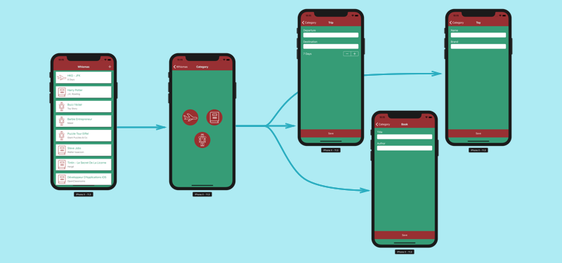
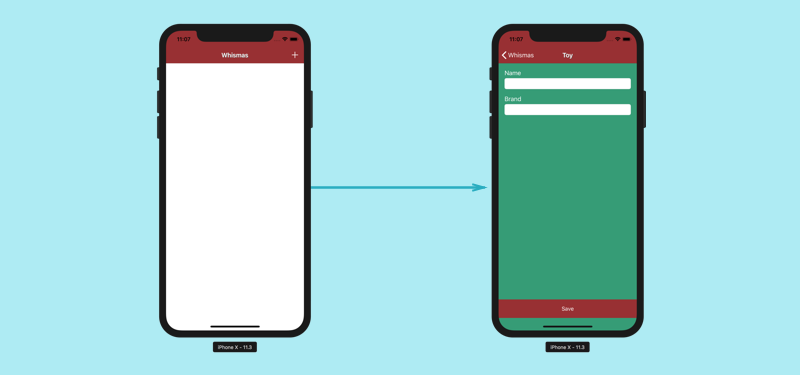
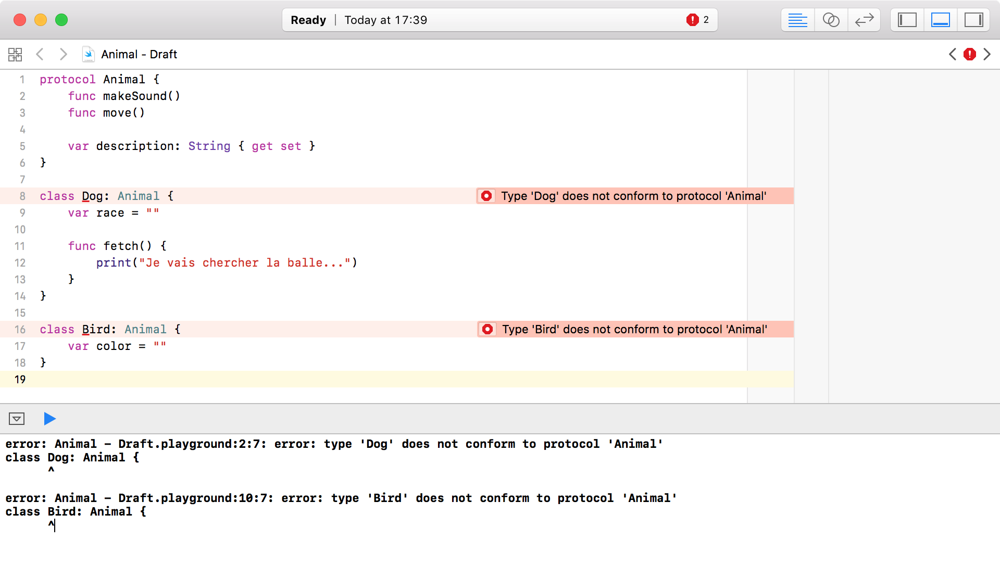
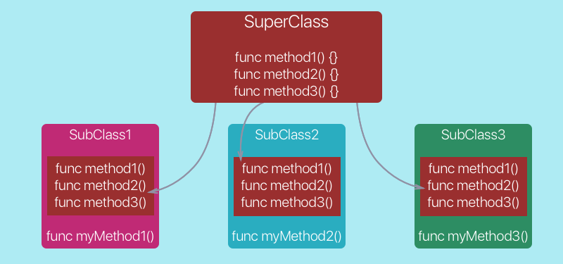
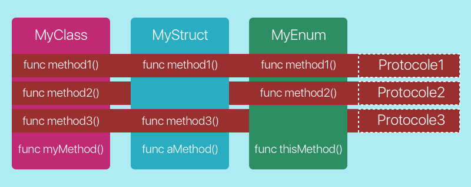
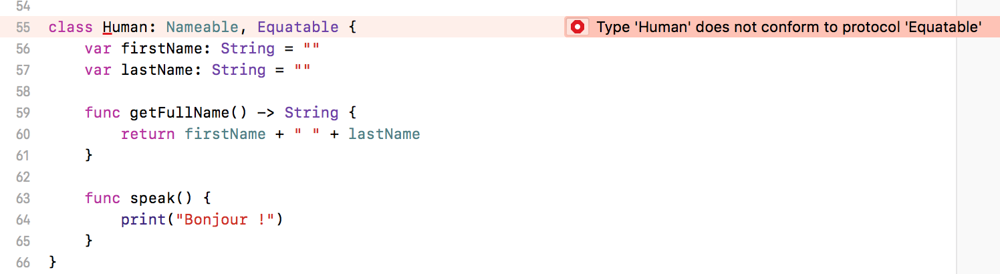

# Ajoutez des listes dans vos applications iOS

## Découvrez les protocoles

### Tirez le meilleur de ce cours

Bonjour et bienvenue dans ce cours sur la création de liste ! Dans ce cours, nous allons traiter en parallèle deux sujets incontournables en iOS :

- Les listes ou *Table View*
- Les protocoles en Swift

> **:information_source:** En effet, les *Table View* ont besoin des protocoles pour fonctionner, alors autant les voir ensemble !


#### Prérequis

Ce cours fait partie de tout [un parcours sur le développement d'application iOS](https://openclassrooms.com/paths/developpeur-se-dapplication-ios). Je vous suggère fortement d'y jeter un oeil si vous souhaitez vous former et trouver un emploi en tant que développeur iOS.

> **:warning:** Pour profiter au mieux de ce cours, assurez-vous que vous maîtrisez a minima les compétences présentées dans les cours suivants :
- [Introduction à iOS : plongez dans le développement mobile !](https://openclassrooms.com/courses/introduction-a-ios-plongez-dans-le-developpement-mobile)
- [Apprenez les fondamentaux de Swift](https://openclassrooms.com/courses/apprenez-les-fondamentaux-de-swift)
- [Approfondissez Swift avec la Programmation Orientée Objet](https://openclassrooms.com/courses/approfondissez-swift-avec-la-programmation-orientee-objet)
- [Développez une application iPhone avec le modèle MVC](https://openclassrooms.com/courses/concevez-une-application-iphone-avec-le-modele-mvc)
- [Ajoutez plusieurs pages à votre application](https://openclassrooms.com/courses/ajoutez-plusieurs-pages-a-votre-application-ios)

#### Démo

Comme d'habitude, ce cours va s'appuyer sur la réalisation d'une application. Cette application se nomme Whishmas et comme son nom l'indique assez mal, elle permet de créer une liste de souhait (*wish*) pour le père Noël (*christmas*)...

La version finale de cette application ressemblera à ceci :



La première vue contient la liste des souhaits de cadeaux pour le Père Noël. Un bouton `+` en haut à droite renvoie vers le choix de trois catégories : Voyage, Livre et Jouet. On choisit une catégorie et on est renvoyée à un formulaire qui permet de rajouter un élément de la catégorie sélectionnée. Cet élément est ensuite rajouté à la liste.

Nous avons notre objectif, je vous propose le point de départ suivant :



Dans cette version de l'application, la liste n'est pas encore créée et nous avons un seul formulaire qui permet seulement de rajouter un jouet. Nous n'avons pas encore la notion de catégorie.

> **:information_source:** Je vous invite à télécharger [cette version du projet](https://s3-eu-west-1.amazonaws.com/static.oc-static.com/prod/courses/files/Parcours+DA+iOS/Cours+9+-+Table+View/Whishmas+-+Starter.zip) avant de passer à la suite.

#### Plan du cours

Pour arriver à nos fins, nous allons nous suivre le plan suivant :

1. Dans cette partie, nous allons présenter les protocoles en travaillant dessus dans le Playground. Ils nous sont indispensables pour attaquer sereinement la suite.
2. Dans la seconde partie, nous allons créer notre *Table View* et la remplir en utilisant le delegate pattern.
3. Dans la troisième partie, nous allons améliorer notre liste et notre application en découvrant de nouvelles fonctionnalités des protocoles et des *Table View*.

Vous êtes prêts ? Alors, allons-y !

### Découvrez les protocoles
C'est parti ! Nous allons parler des protocoles !

> **:information_source:** Si vous suivez [le parcours](https://openclassrooms.com/paths/developpeur-se-dapplication-ios), je sais, on en a déjà un peu parlé. Mais cette fois-ci, on va vraiment rentrer dans le détail !

#### Une histoire d'héritage...

Pour découvrir les protocoles, je vous ai concocté un petit Playground !

> **:information_source:** Je vous invite à le télécharger [ici](https://s3-eu-west-1.amazonaws.com/static.oc-static.com/prod/courses/files/Parcours+DA+iOS/Cours+9+-+Table+View/Animal+-+Starter.playground.zip).

Dans ce Playground, vous trouverez un code assez simple : une classe `Animal` et deux sous-classes `Bird` et `Dog`.

La classe `Animal` a deux méthodes et une propriété comme suit :

```swift
class Animal {
    func makeSound() {}
    func move() {}

    var description = ""
}
```

> **:question:** Mais les méthodes sont vides ! Elles ne servent à rien ?

Très bonne question ! En effet, les méthodes sont vides, car je ne peux pas prédire le son que va faire un animal sans savoir précisément de quel animal je parle. De la même manière, un oiseau ne se déplace pas de la même manière qu'un cheval. Donc je ne peux pas remplir la méthode `move`.

Autrement dit, la classe `Animal` est **trop générique** et du coup, elle ne sert à rien à part mettre en commun deux méthodes et une propriété que les sous-classes vont pouvoir implémenter.

En programmation, on n’aime pas trop ce qui ne sert à rien ! En biologie, non plus d'ailleurs... mais c'est un autre débat ! Du coup, on va supprimer cette classe `Animal` !

> **:question:** Mais attends ! Elle permet quand même aux sous-classes d'hériter de ces méthodes et de cette propriété ! On pourrait en faire une classe abstraite non ?

Je sais, mais faîtes moi confiance, supprimez cette classe ! On va faire ça différemment... Avec un protocole !

#### Les protocoles à la rescousse !

En plus de beaucoup d'autres choses, les protocoles sont très pratiques dans notre situation. Et pour comprendre pourquoi, il faut comprendre ce que c'est !

##### Définition

> **Un protocole, c'est une liste d'exigences**.

Oui je sais, dis comme ça, ça ne fait pas rêver... Mais vous allez voir c'est puissant ! Rentrons dans le vif du sujet !

##### Syntaxe

Pour déclarer un protocole, on utilise le mot-clé `protocol` suivi d'un nom et d'accolades :

```swift
protocol Animal {

}
```

Oui, ça ressemble à une classe. Et la ressemblance ne s'arrête pas là !

##### Méthodes

**On peut ajouter des méthodes à un protocole**.

```swift
protocol Animal {
    func makeSound()
    func move()
}
```

> **:question:** Hé, mais attends ! Tu as oublié l'implémentation des méthodes.

Eh oui comme je l'ai dit, un protocole, c'est une liste d'exigences. Ensuite, on va demander à une classe de **se conformer** à ces exigences.

> **:information_source:** En gros, un protocole peut définir des méthodes, mais ce sont les classes qui les implémentent.

##### Propriétés

**Un protocole peut aussi contenir des propriétés.** Mais comme pour les méthodes, le protocole va seulement définir si cette propriété peut être modifiée ou non. Il ne va pas lui donner de valeur :

```swift
protocol Animal {
    func makeSound()
    func move()

	var description: String { get set }
}
```

Je définis ici dans mon protocole une propriété description de type `String`. Jusque là rien de nouveau. Ensuite, j'ajoute entre accolades les mots `get` et `set`. Cela signifie que cette propriété pourra être modifiée.

> **:information_source:** Si j'avais voulu définir une propriété en lecture seule, j'aurais écrit :
>
> ```swift
> var description: String { get }
> ```

> **:question:** Je veux bien toute cette histoire de protocole, mais à quoi ça sert vraiment ?

Je comprends que ce soit un peu flou pour le moment, mais on y vient !  

#### Se conformer à un protocole

Je le répète : un protocole, c'est **une liste d'exigences**. Autrement dit, un protocole, c'est une entité qui déclare :

> Si tu veux être ça, il faut que tu fasses ça.

Par exemple, dans notre cas :

> Si tu veux être un `Animal`, il faut que tu saches faire les choses suivantes :
>
> - `makeSound`
> - `move`
>
> Et donner une valeur à la propriété suivante :
>
> - `description`

Nous avons dans notre Playground deux classes qui voudraient bien être des animaux : `Dog` et `Bird`.

```swift
class Dog {
    var race = ""

    func fetch() {
        print("Je vais chercher la balle...")
    }
 }

class Bird {
    var color = ""
}
```

> **:information_source:** J'ai supprimé de ces classes tout ce qui était lié à l'héritage d'`Animal,` car nous avons supprimé cette classe.

Pour que `Dog` et `Bird` soient des animaux, ils doivent **se conformer au protocole**. Cela se fait en deux étapes :

1. Adopter le protocole
2. Répondre à ses exigences

Commençons par la première étape :

##### Adopter le protocole

Pour adopter un protocole, la syntaxe est exactement la même que pour l'héritage :

```swift
class Dog: Animal { (...) }

class Bird: Animal { (...) }
```

On ajoute <keyboard>:<keyboard> puis le nom du protocole (`Animal`) après la déclaration de la classe.

À ce moment-là, vous devriez avoir une erreur dans votre Playground :



Cette erreur signifie simplement que nous avons adopté le protocole, mais que nous n'avons pas encore répondu à ses exigences. C'est normal, c'est notre deuxième étape !

##### Répondre à ses exigences

Pour répondre aux exigences d'un protocol, il suffit de rajouter l'implémentation des méthodes du protocole et de donner une valeur à ses propriétés comme ceci :

```swift
class Dog: Animal {
    var race = ""

    func fetch() {
        print("Je vais chercher la balle...")
    }

    // On répond aux exigences du protocole
    var description = ""

    func move() {
        print("Je cours !")
    }

    func makeSound() {
        print("Wouf !")
    }
}

class Bird: Animal {
    var color = ""

    // On répond aux exigences du protocole
    var description = ""

    func move() {
        print("Je vole !")
    }

    func makeSound() {
        print("Piou Piou")
    }
}
```

On a simplement rajouté les méthodes et leurs implémentations et on a donné une valeur à la propriété `description`. Et ça y est nos classes se conforment au protocole `Animal`.

On a remplacé notre classe inutile et trop générique par un protocole qui remplit le même rôle !

#### En résumé
- Un protocole est une **liste d'exigences**. Ces exigences peuvent être des méthodes ou des propriétés.
- Souvenez-vous de la phrase suivante. Un protocole est une entité qui déclare : "*Si tu veux être ça, il faut que tu fasses ça !*"
- Un protocole se déclare avec la syntaxe suivante :

```swift
protocol NomDuProtocole {
	func maMethode()
	func maMethodeAvecParametresEtValeurDeRetour(param1: Type, Param2: Type) -> Type

	var maPropriete: Type { get set }
	var maProprieteEnLectureSeule: Type { get }
}
```

- Une classe peut se conformer à un protocole en :
	1. Adoptant le protocole
	2. Répondant à ses exigences

```swift
// 1. On adopte le protocole
class MaClasse: MonProtocole {
	// 2. On répond à ces exigences
	func laMethodeDeMonProtocole() {
		// Implémentation de la méthode définie par le protocole
	}
}
```

Ceci constitue un premier tour d'horizon rapide des protocoles et avant de les mettre en pratique dans notre application, nous allons voir asseoir un peu plus votre compréhension du sujet ! Et ça se passe au prochain chapitre !

### Approfondissez les protocoles
Pour bien appréhender les protocoles, je vous propose que l'oncontinue à jouer un peu avec dans ce chapitre !


#### Le point sur les types

Je ne sais pas si vous y avez prêté attention, mais un protocole se déclare un peu comme une énumération, une structure ou une classe.

```swift
protocol MonProtocole {}

class MaClasse {}

struct MaStructure {}

enum MonEnumeration {}
```

Il y a une raison à cela ! Le protocole permet de créer un type de la même façon que les classes, les structures ou les énumérations. Cela veut dire que vous pouvez écrire cela :

```swift
protocol UnProtocole { (...) }

var uneVariable: UnProtocole
var unTableau: [UnProtocole]
func uneFonction(param: UnProtocole) -> UnProtocole { (...) }
```

La seule différence, c'est que vous ne vous pouvez pas créer d'instance à partir d'un protocole. En effet, une classe/structure/énumération définit des objets. Vous pouvez donc en créer des instances. Alors que les protocoles définissent seulement des listes d'exigences.

Autrement dit, vous ne pouvez pas écrire :

```swift
var uneVariable = UnProtocole()
```

> **:question:** Euh... Mais du coup, ça ne veut rien dire ça :
>
> ```swift
> var uneVariable: UnProtocole
> ```

Si ! Prenons un exemple avec notre protocole `Animal`. `Animal` est un protocole donc il définit un type donc je peux déclarer une variable de type `Animal`.

```swift
var unAnimal: Animal
```

Animal n'est pas un objet donc je ne peux pas créer une instance d'`Animal`. Mais en même temps tant mieux, car on a vu qu'Animal était un concept trop abstrait. En revanche, je peux définir cette variable de type Animal.

Cela signifie qu'elle pourra prendre comme valeur une instance de n'importe quelle classe qui implémente le protocole Animal. Du coup, on peut écrire ceci :

```swift
var unAnimal: Animal
unAnimal = Dog()
unAnimal = Bird()
```

> **:question:** Mais `unAnimal` change de type dans ton exemple ! C'est interdit en Swift !

Eh non ! `unAnimal` garde le type `Animal`, seulement celui fonctionne avec `Dog` et `Bird,` car ces deux classes se conforment au protocole `Animal`.

Du coup, on peut faire des trucs sympas avec les protocoles comme ceci :

```swift
var monTableauDAnimaux: [Animal] = [Dog(), Bird()]
```

On a un tableau qui contient des objets qui ne sont pas du même type, mais qui se conforment tous au type `Animal`. Lorsque je vais programmer en utilisant mon tableau d'animaux, je vais programmer autour de *l'interface* définie par mon protocol: je ne me soucie pas de savoir quel type d'animal je manipule, et c'est une bien meilleure pratique qui rend mon code plus *modulaire* !


#### Des protocoles partout !

Jusqu'à présent, on a parlé uniquement de classe qui se conforme à un protocole, mais sachez que n'importe quel type peut se conformer à un protocole. On peut donc écrire ceci :

```swift
protocol MonProtocole {}

class MaClasse: MonProtocole {}

struct MaStructure: MonProtocole {}

enum MonEnumeration: MonProtocole {}
```

Cela fonctionne exactement de la même manière !

Avant, seulement les classes pouvaient partager des comportements grâce à l'héritage. Mais les structures et les énumérations n'ont pas l'héritage.

> **:information_source:** Vous voyez que comparé à notre classe abtraite Animal, le protocol est bien plus puissant !

Mais grâce aux protocoles, toutes les structures de donnée peuvent partager des comportements ! Encore mieux, une classe peut partager des méthodes avec une énumération.

> **:information_source:** On peut même aller encore plus loin ! Un protocole peut se conformer à un autre protocole :
>
> ```swift
> protocol MonProtocole {}
>
> protocol UnAutreProtocole : MonProtocole {}
> ```

#### Plusieurs protocoles

Une même classe/structure/énumération peut se conformer à plusieurs protocoles. En effet, un protocole est simplement une liste d'exigences, du coup, on peut combiner ces listes pour obtenir une plus grande liste.

Je vous propose qu'on rajoute du coup un deuxième protocole. On va appeler ce protocole `Nameable`. Et il sera implémenté par toute classe qui veut pouvoir avoir un nom et un prénom :

```swift
protocol Nameable {
    var firstName: String { get set }
    var lastName: String { get set }

    func getFullName() -> String
}
```

Notre classe `Dog` va adopter le protocole. Lorsqu'une classe adopte plusieurs protocoles, on les sépare par une virgule :

```swift
class Dog: Animal, Nameable { (...) }
```

Et ensuite il suffit de répondre à ses exigences.

```swift
class Dog: Animal, Nameable {
    var firstName: String = ""
    var lastName: String = ""

    func getFullName() -> String {
        return firstName + " " + lastName
    }

    // (...)    
}
```

#### En résumé
- Un protocole définit un type au même titre qu'une classe/structure/énumération.
- Un protocole peut être adopté par une classe, une structure, une énumération ou même un autre protocole.
- Une classe/structure/énumération peut se conformer à plusieurs protocoles. Dans ce cas, on sépare les protocoles avec des virgules.

### Sautez dans le Protocol Oriented Programming
Vous ne le voyez sans doute pas pour le moment, mais les protocoles changent vraiment votre approche du code. Et au fur et à mesure de ce cours, je vais essayer de vous le faire sentir.

#### Un aperçu du Protocol Oriented Programming

Le monde de la programmation est généralement sous le paradigme de l'orienté objet (*OOP : Object Oriented Programming*). On manipule des objets et certains peuvent hériter les uns des autres. Et c'est ce que vous avez fait jusqu'à présent.

Mais en Swift, les protocoles sont tellement puissants que beaucoup considèrent que **Swift est un langage de programmation orienté protocole** (*POP : Protocol Oriented Programming*).  

Pour comprendre ce que cela change, je vous propose de créer dans notre Playground, une classe `Human`.

```swift
class Human {
    func speak() {
        print("Bonjour !")
    }
}
```

Un humain n'est pas un animal. Mais en revanche, il a un nom et un prénom. Donc nous allons lui faire adopter le protocole `Nameable`.

```swift
class Human: Nameable {
    var firstName: String = ""
    var lastName: String = ""

    func getFullName() -> String {
        return firstName + " " + lastName
    }

    func speak() {
        print("Bonjour !")
    }
}
```

Vous voyez ici que le protocole `Nameable` peut s'appliquer à des objets qui n'ont a priori rien à voir entre eux. Il s'agit en effet d'**une brique de fonctionnalités que je peux donner à n'importe quelle classe/structure/énumération**.

> **:question:** Très bien, mais je dois redonner dans Human une implémentation de getFullName, qui en plus est la même que pour Dog ! C'est un peu pénible si ma brique de fonctionnalité devient plus complexe, non ?

Et oui, c'est bien vu. Mais c'est de ma faute, je vous ai fait un petit mensonge tout à l'heure !
Je vous ai dit:

> un protocole peut définir des méthodes, mais ce sont les classes qui les implémentent.

Et en Swift, c'est un peu faux. Et c'est précisement la raison pour laquelle les protocoles sont si important dans ce language !

En Swift, **un protocol peut définir l'implémentation de ses méthodes**.

Je répète: **En swift, un protocol peut définir l'implémentation de ses méthodes.**

> **:question:** Ok... ça a l'air chouette ?

C'est vraiment très très chouette. On va voir ça avec notre example de `Nameable` tout de suite. Voici la définition du protocole qu'on avait:

```swift
protocol Nameable {
    var firstName: String { get set }
    var lastName: String { get set }

    func getFullName() -> String
}
```

Et pour implémenter `getFullName`, on va faire ça:

```swift
extension Nameable {

    func getFullName() -> String {
      return firstName + " " + lastName
    }
}
```

Du coup, pour que `Human` adopte `Nameable`, je peux simplifier le tout en:

```swift
class Human: Nameable {
    var firstName: String = ""
    var lastName: String = ""

    // Pas besoin d'implémenter getFullName, mais toute instance de Human pourra l'appeler !!

    func speak() {
        print("Bonjour !")
    }
}
```

Et voilà le travail. On utilise ce qu'on appelle une **extension de protocole** pour aller donner une implémentation par défaut de certaines de ses exigences. Du coup je peux vraiment facilement ajouter une brique de fonctionnalité bien définie à n'importe quelle classe/structure/énumération !

> **:question:** Mais si je veux donner une autre implémentation, par example dans Dog, je fais comment ?! Parque `override`, ça marche pour les classes seulement !

En effet, on n'utilisera pas override dans ce genre de situation. Si dans ma classe `Dog`, je veux une implémentation de `getFullName` différente de celle par défaut, et bien je n'ai qu'à la redonner:

```swift
class Dog: Nameable {
    var firstName: String = ""
    var lastName: String = ""

    // Lorsque j'appelle cette méthode sur un chien, c'est cette implémentation qui sera appellée, et non celle définie par défaut
    func getFullName() -> String {
      return "Waaaf \(firstName) ! WoofWoof \(lastName)"
    }

    func speak() {
        print("Bonjour !")
    }
}
```

L'implémentation donnée par l'objet qui adopte le protocol sera toujours prioritaire aux implémentations par défaut. Ce qui est rassurant, puisque les protocoles sont à la base, un moyen de s'abstraire de la façon dont sont implémentés les choses, en se limitant à connaître simplement les exigences.

#### L'orienté protocole en image !
Je vous propose les schémas suivants pour comparer les approches orientées objet et orientées protocole.



En orienté objet, on partage des comportements grâce çà l'héritage. Mais on est **limité à une seule superclasse** et **toutes les classes récupèrent forcément toutes les fonctionnalités de la superclasse**. Cela oblige les sous-classes à une certaine homogénéité.



En orienté protocole, on partage des comportements grâce aux protocoles. C'est bien plus flexible, car :

- On peut partager des comportements entre des classes/structures/énumérations.
- Une même classe/structure/énumération peut adopter plusieurs protocoles.
- En utilisant un protocole par fonctionnalité, on peut ajouter certaines fonctionnalités à certains objets sans l'ajouter à d'autres.

> **:information_source:** L'orienté protocole est un peu à imaginer comme des legos. On va créer des objets. Et ensuite, on va leur ajouter des briques de fonctionnalités en leur faisant adopter à chaque fois un nouveau protocole.

#### L'orienté protocole dans le langage Swift

L'orienté protocole est au coeur de la conception de Swift. Le langage lui-même utilise de nombreux protocoles pour fonctionner.

Prenons un exemple avec `Equatable`. `Equatable` est un protocole qui permet de comparer deux valeurs pour voir si elles sont égales. Tous les types qui se conforment au protocole `Equatable` peuvent être utilisés avec les opérateurs `==` et `!=`.

> **:information_source:** Littéralement `Equatable` signifie qui peut être égal.

Il y a donc des centaines de types qui implémentent ce protocole comme String, Int, Double, et [beaucoup beaucoup d'autres](https://developer.apple.com/documentation/swift/equatable#relationships).

> **:information_source:** La fonctionnalité de pouvoir être égal à quelqu'un a donc été mis en boîte dans un protocole adopté ensuite par des centaines de types.

Je vous propose d'essayer d'implémenter ce protocole pour notre classe `Human`. Commençons par adopter le protocole :

```swift
class Human: Nameable, Equatable { (...) }
```

Ensuite, le Playground affiche une erreur, car on ne se conforme pas au protocole.



Pour résoudre l'erreur, il faut répondre à la seule exigence de ce protocole, implémenter la méthode suivante :

```swift
static func == (lhs: Human, rhs: Human) -> Bool {
}
```

Cette fonction prend deux paramètres du type avec lequel on travaille, en l'occurrence `Human`. Ce sont les deux valeurs que nous essayons de comparer :

- `lhs` (*left hand side*) : la valeur à gauche du `==`
- `rhs` (*right hand side*) : la valeur à droite du `==`

Et la fonction renvoie un booléen, résultat de l'égalité.

Pour implémenter cette fonction, il faut indiquer selon quelles conditions deux humains sont égaux. Nous allons dire que deux humains sont égaux s'ils ont le même nom et prénom, donc le même nom complet :

```swift
static func == (lhs: Human, rhs: Human) -> Bool {
    return lhs.getFullName() == rhs.getFullName()
}
```

Et voilà ! Maintenant, nous pouvons écrire le code suivant :

```swift
let human1 = Human()
let human2 = Human()
if human1 == human2 {
    print("Vous êtes les mêmes !")
}
```

Grâce aux protocoles, notre classe supporte maintenant la fonctionnalité `==` !

> **:information_source:** Si ça vous a plu, sachez qu'il existe de nombreux autres protocoles de ce genre dans le langage Swift. Jetez un oeil à [Comparable](https://developer.apple.com/documentation/swift/comparable) par exemple.

#### En résumé

- En programmation orientée protocole, on va utiliser les protocoles pour partager des fonctionnalités entre différents objets, de façon bien plus flexible.
- Le langage Swift utilise beaucoup l'orienté protocole.

Maintenant que les protocoles sont, je l'espère, un peu plus clairs pour vous, nous allons nous attaquer à notre application et rajouter une liste !

Rendez-vous dans la prochaine partie ;) !
