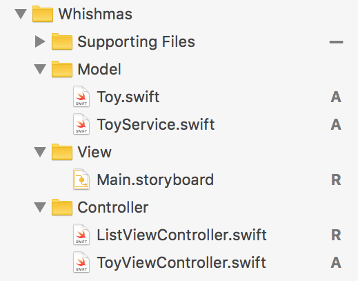
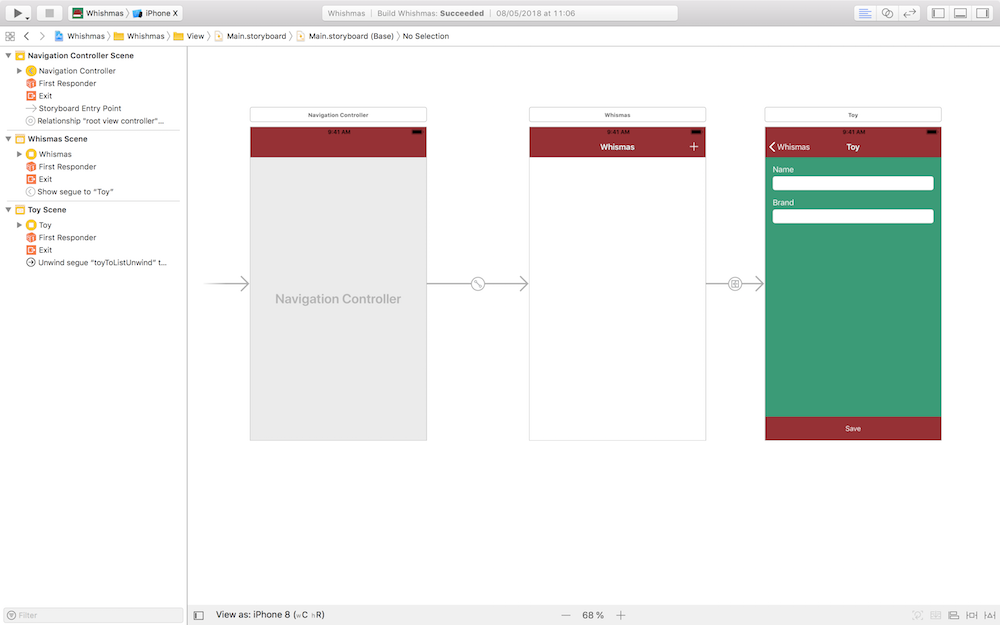
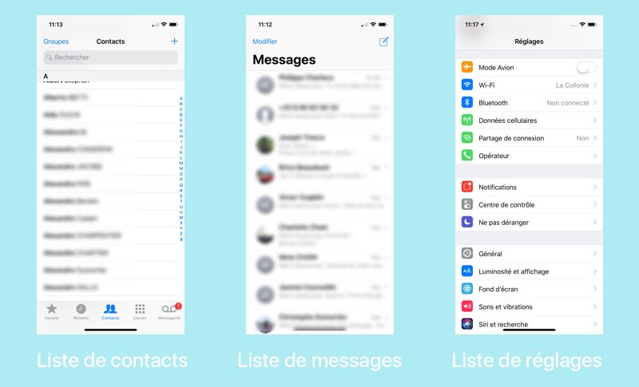

## Créez votre Table View


### Découvrez UITableView
Nous y sommes ! Nous allons créer notre liste pour notre belle application Wishmas.

Pour rappel, nous allons partons de la version suivante de l'application :


Et je vous propose de commencer par faire un petit tour du propriétaire histoire que vous compreniez les quelques lignes de code déjà présentes dans le projet.

> **:information_source:** Si vous n'avez pas encore téléchargé le projet, il est encore temps ! Vous le trouverez [ici](https://s3-eu-west-1.amazonaws.com/static.oc-static.com/prod/courses/files/Parcours+DA+iOS/Cours+9+-+Table+View/Whishmas+-+Starter.zip).

#### Découverte du projet
Le projet est divisé en 5 fichiers organisé bien évidemment selon le modèle MVC. 



On va les parcourir rapidement.

##### Toy.swift

```swift
struct Toy {
    var name = ""
    var brand = ""
}
```

Pas grand chose à dire là-dessus, il s'agit simplement d'une structure avec deux propriétés qui représente la marque et le nom d'un jouet.

##### ToyService.swift

```swift
class ToyService {
    static let shared = ToyService()
    private init() {}

    private(set) var toys: [Toy] = []

    func add(toy: Toy) {
        toys.append(toy)
    }
}
``` 

Cette classe utilise le singleton pattern comme on peut le voir dans les deux premières lignes.

> **:information_source:** Besoin d'un rappel sur le pattern singleton ? C'est par [ici]().

Ensuite on définit une variable `toys` qui est un tableau de `Toy`. 

> **:information_source:** Ici, vous remarquerez le mot-clé `private(set)` donc nous n'avons pas encore parlé. Il permet de **laisser public l'accès à la propriété mais de rendre privé sa modification**. Autrement dit, n'importe qui peux accéder à la propriété `toys`, mais seule la classe `ToyService` peut modifier sa valeur.

Ensuite, une fonction `add(toy: Toy)` permet de rajouter un jouet dans le tableau `toys`.

##### Main.storyboard



RAS...


##### ToyViewController.swift

Cette classe gère la page qui permet de rajouter un jouet. Il s'agit principalement d'une fonction `save` qui récupère les données des deux champs de texte, crée un objet `Toy` et l'ajoute avec `ToyService` au tableau `toys` puis renvoie vers la page précédente.

```swift
@IBAction func save() {
    guard let name = nameTextField.text,
        let brand = brandTextField.text else {
            return
    }

    let toy = Toy(name: name, brand: brand)
    ToyService.shared.add(toy: toy)

    navigationController?.popViewController(animated: true)
}
```

> **:information_source:** Il y a aussi une petite extension qui permet de gérer le clavier. Vous avez [un chapitre dédié à la gestion du clavier](https://openclassrooms.com/courses/ajoutez-plusieurs-pages-a-votre-application-ios/gerez-le-clavier) si besoin ;) ! 

##### ListViewController.swift

```swift
class ListViewController: UIViewController {
}
```

Ce dernier fichier est vide car c'est ici que nous allons coder notre Table View !

#### Présentation de Table View

Il est donc grand temps de parler de la Table View ! Alors une Table View, c'est quoi ?

**Une Table View est un objet de la classe `UITableView` qui hérite de `UIView` et dont le rôle est d'afficher des listes que l'on peut faire défiler.**

Et cet objet mérite un cours car :

- Il est un peu plus complexe qu'un bouton par exemple
- Surtout, il y a des Table View partout en iOS

Partout où vous avez une liste qui défile, c'est une Table View qui se cache derrière. 
Prenons quelques exemples :



Mais cela peut prendre d'autres aspects. Voici d'autres exemples peut-être un peu moins évidents qui fonctionnent aussi avec des Table View :


Comme vous pouvez le voir, les Table View sont partout et sont un outil très flexible et donc très utilisé par les développeurs.

Dans le prochain chapitre nous allons installé notre Table View !

Section 1 : Découverte du code du projet (notamment singleton pattern)  
Section 2 : Présentation de TableView (app message, news feed facebook etc.)  

### Installez la Table View dans le Storyboard
Section 1 : Installation avec le storyboard  
Section 2 : Mention de UITableViewController  
Section 3 :  Mention de UICollectionViewController  
Section 4 :  Fonctionnement de la tableview (cycle de vie de la cellule) 

### Appliquez le delegate pattern
Section 1 : Présentation du delegate pattern  
Section 2 : Utilisation pour (number of sections / number of rows)  

### Remplissez la table view
Section 1 : Ajout d'une dequeue reusable cell dans storyboard  
Section 2 : Remplissage de la tableview (methode cell for row)  
