## Créez votre Table View


### Découvrez UITableView
Nous y sommes ! Nous allons créer notre liste pour notre belle application Wishmas.

Pour rappel, nous partons de la version suivante de l'application :


Et je vous propose de commencer par faire un petit tour du propriétaire histoire que vous compreniez les quelques lignes de code déjà présentes dans le projet.

> **:information_source:** Si vous n'avez pas encore téléchargé le projet, il est encore temps ! Vous le trouverez [ici](https://s3-eu-west-1.amazonaws.com/static.oc-static.com/prod/courses/files/Parcours+DA+iOS/Cours+9+-+Table+View/Whishmas+-+Starter.zip).

#### Découverte du projet
Le projet est divisé en 5 fichiers organisés bien évidemment selon le modèle MVC. 


On va les parcourir rapidement.

##### Toy.swift

```swift
struct Toy {
    var name = ""
    var brand = ""
}
```

Pas grand-chose à dire là-dessus, il s'agit simplement d'une structure avec deux propriétés qui représente la marque et le nom d'un jouet.

##### ToyService.swift

```swift
class ToyService {
    static let shared = ToyService()
    private init() {}

    private(set) var toys: [Toy] = []

    func add(toy: Toy) {
        toys.append(toy)
    }
}
``` 

Cette classe utilise le singleton pattern comme on peut le voir dans les deux premières lignes.

> **:information_source:** Besoin d'un rappel sur le pattern singleton ? C'est par [ici](https://openclassrooms.com/courses/faites-des-appels-reseaux-dans-votre-application-ios/gerez-les-requetes-concurrentes-avec-le-singleton-pattern).

Ensuite on définit une variable `toys` qui est un tableau de `Toy`. 

> **:information_source:** Ici, vous remarquerez le mot-clé `private(set)` dont nous n'avons pas encore parlé. Il permet de **laisser public l'accès à la propriété, mais de rendre privé sa modification**. Autrement dit, n'importe qui peut accéder à la propriété `toys`, mais seule la classe `ToyService` peut modifier sa valeur.

Ensuite, une fonction `add(toy: Toy)` permet de rajouter un jouet dans le tableau `toys`.

##### Main.storyboard


RAS...


##### ToyViewController.swift

Cette classe gère la page qui permet de rajouter un jouet. Il s'agit principalement d'une fonction `save` qui récupère les données des deux champs de texte, crée un objet `Toy` et l'ajoute avec `ToyService` au tableau `toys` puis renvoie vers la page précédente.

```swift
@IBAction func save() {
    guard let name = nameTextField.text,
        let brand = brandTextField.text else {
            return
    }

    let toy = Toy(name: name, brand: brand)
    ToyService.shared.add(toy: toy)

    navigationController?.popViewController(animated: true)
}
```

> **:information_source:** Il y a aussi une petite extension qui permet de gérer le clavier. Vous avez [un chapitre dédié à la gestion du clavier](https://openclassrooms.com/courses/ajoutez-plusieurs-pages-a-votre-application-ios/gerez-le-clavier) si besoin ;) ! 

##### ListViewController.swift

```swift
class ListViewController: UIViewController {
}
```

Ce dernier fichier est vide, car c'est ici que nous allons coder notre Table View !

#### Présentation de Table View

Il est donc grand temps de parler de la Table View ! Alors une Table View, c'est quoi ?

**Une Table View est un objet de la classe `UITableView`** (qui hérite de `UIView`) **et dont le rôle est d'afficher des listes que l'on peut faire défiler.**

Et cet objet mérite un cours, car :

- Il est un peu plus complexe qu'un bouton par exemple
- Surtout, il y a des Table View partout en iOS

Partout où vous avez une liste qui défile, c'est une Table View qui se cache derrière. 
Prenons quelques exemples :


Mais cela peut prendre d'autres aspects. Voici d'autres exemples peut-être un peu moins évidents qui fonctionnent aussi avec des Table View :


Comme vous pouvez le voir, les Table View sont partout et sont un outil très flexible et donc très utilisé par les développeurs.

#### Naming des éléments la table view
Une Table View est donc simplement une liste, mais plusieurs éléments permettent de la structurer pour bien organiser les données. Pour vous y retrouver, il est important que vous en connaissiez les différents éléments.

Et je vous ai fait un joli schéma que l'on va détailler ensemble :

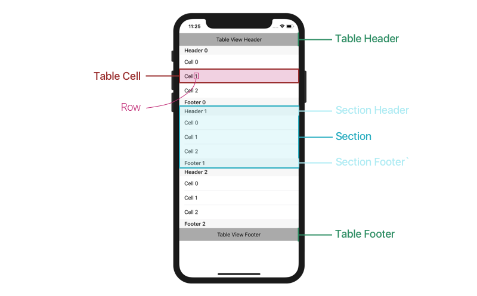

Une Table View peut-être divisée en **sections**. Ces sections permettent d'organiser les données. 

> **:information_source:** Par exemple, dans l'application *Contact*, il y a une section par lettre de l'alphabet. Ou encore dans l'application *Réglages*, les réglages sont découpés en thématiques. 
  
> **:warning:** Le découpage en sections n'est pas obligatoire ! Vous pouvez très bien ne pas utiliser de sections si vous n'en avez pas besoin. C'est ce que fait l'application message, par exemple.

Ensuite, au sein d'une section, vous avez trois éléments :

- `Section Header` (`UIView`) : c'est une vue en haut de la section (qui permet par exemple de lui donner un titre).
- `Section Footer` (`UIView`) : c'est une vue en bas de la section.
- `Cell` (`UITableViewCell`) : ce sont les vues qui contiennent les données de la liste. Chaque donnée est dans une cellule.

> **:warning:** Les `Header` et `Footer` sont optionnels. Vous n'êtes pas obligés d'en avoir.

Enfin, la Table View peut également avoir un header et un footer. À ne pas confondre avec les header et les footer des sections. Le header et le footer de la Table View sont respectivement tout en haut et tout en bas de la liste.

> **:warning:** De même, le footer et le header de la Table View sont optionnels. En fait, **le seul élément obligatoire dans une Table View, ce sont les cellules**. Sinon, la liste est vide !

> **:information_source:** Tous les footer et header dont j'ai parlé sont de type `UIView` donc vous pouvez mettre n'importe quelle vue dedans. Ils sont complètement customisables !

Enfin, il est important que vous fassiez la distinction entre `row` et `cell` :

- `row` représente le numéro de la ligne à laquelle on se trouve dans la section. Elle est de type `Int`.
- `cell` représente la vue, elle est de type `UITableViewCell` qui hérite comme toutes les vues de `UIView`. 

Maintenant qu'on a dit tout ça : je vous remets le schéma, ça ne vous fera pas de mal ;) ! 


##### Style de la Table View

Comme nous l'avons vu dans les exemples de liste au début de ce chapitre, la Table View peut prendre bien des aspects différents.

Mais vous devez savoir qu'il existe deux styles par défaut, `plain` et `grouped` que voici :

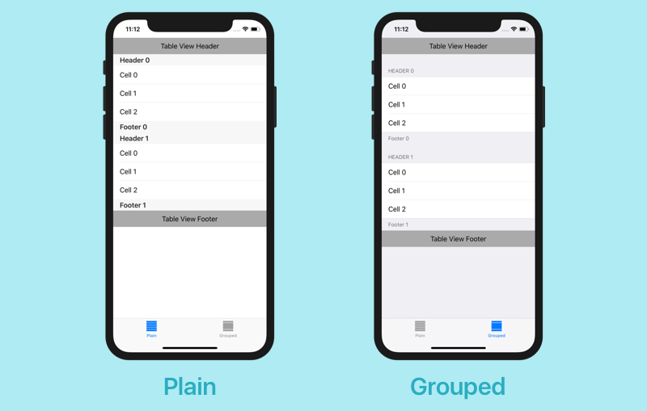

En général, mais ce n'est pas obligatoire, on utilise le style `plain` pour des **données dynamiques** et `grouped` pour des **données statiques**. 

> **:information_source:** Une liste contient des données dynamiques **si on ne peut pas prévoir à l'avance le contenu exact de la liste, car il est susceptible de varier**. C'est le cas d'une liste de contact ou de messages par exemple. À l'inverse, si on connaît à l'avance le contenu exact d'une liste, on dit qu'elle contient des données statiques. Elles ne bougeront pas. C'est le cas d'une liste de réglages ou d'un menu de navigation par exemple.

#### En résumé
- Une Table View (`UITableView`) permet d'afficher une liste en iOS. Cette liste peut avoir bien des aspects et des usages différents.
- Une Table View est organisée ainsi :


- Une Table View peut prendre deux aspects : `grouped` ou `plain`.

Dans le prochain chapitre, nous allons installer notre Table View !

### Installez la Table View dans le Storyboard
C'est parti ! Nous allons rajouter notre Table View dans le storyboard !

#### Installation de la Table View
Pour cela, ouvrez le fichier Main.storyboard et allez chercher l'objet Table View dans la bibliothèque des objets. 

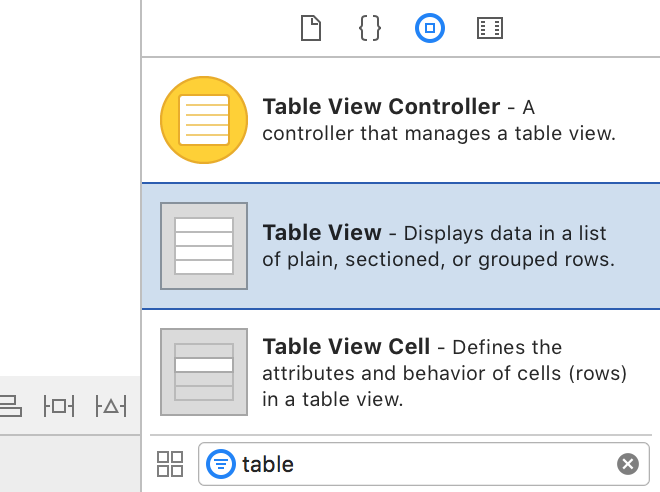

Et ensuite, glissez-le sur l'interface du `ListViewController` et redimensionnez-le pour qu'il prenne tout l'écran, vous devriez obtenir ceci :

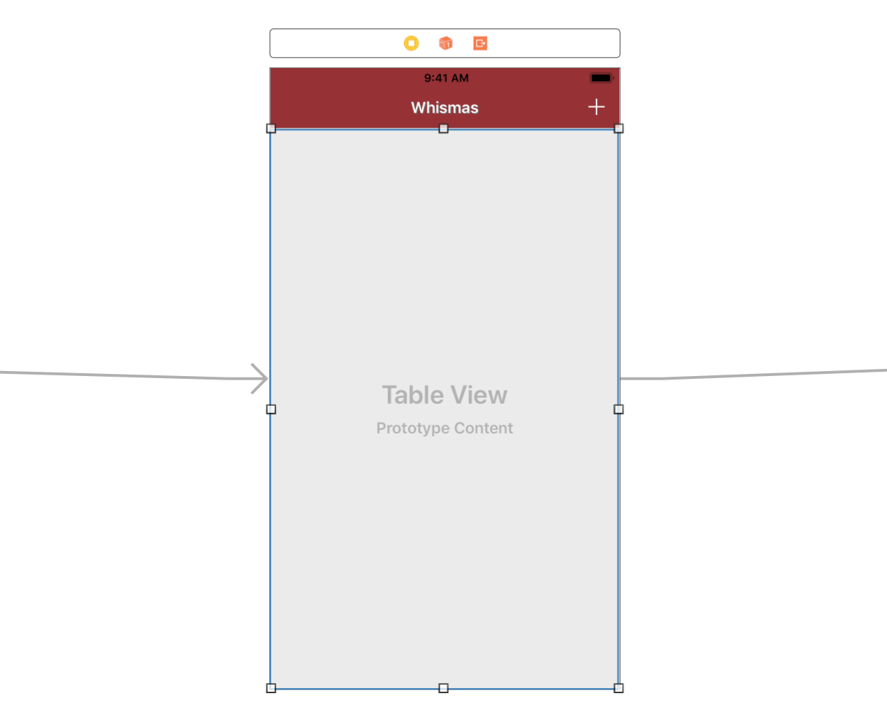

> **:information_source:** J'ai aussi rajouté des contraintes pour l'accrocher à chaque côté de l'écran.

Et voilà ! Vous avez une belle Table View dans votre application ! Bien sûr, si vous lancez votre application, vous risquez d'être déçu, car pour l'instant elle est vide, mais nous allons apprendre à la remplir dès le prochain chapitre.

Vous pouvez retrouver dans l'inspecteur d'attributs certaines propriétés dont nous avons parlé ensemble comme :

- `style` qui peut prendre les valeurs `grouped` ou `plain`
- `content` qui peut prendre les valeurs :
	- `Dynamic Prototypes` pour des données dynamiques
	- `Static Cells` pour des données statiques

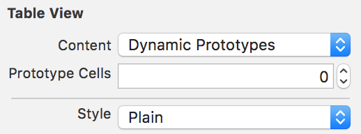

Je vous laisse jouer avec les attributs `separator` qui concernent la petite ligne grise de démarcation entre les cellules.

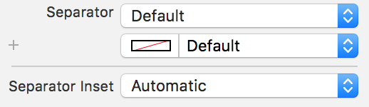

> **:information_source:** Vous remarquez aussi dans cet inspecteur d'attribut que comme la plupart des vues dans lesquelles on peut défiler, `UITableView` hérite de `ScrollView`.

#### Fonctionnement de la Table View

Pour bien prendre en main la Table View, il faut comprendre comment elle fonctionne.

Comme vous le savez maintenant, une Table View, c'est simplement une liste de cellules organisée éventuellement en sections. Et **cette liste n'a pas de limite de tailles** ! 

Et c'est toute la magie des Table View ! Vous pouvez mettre 100 000 éléments dans la liste, ça ne posera pas de problème de performance. Votre iPhone supportera la charge. 

Ce petit miracle de performance s'appuie sur une idée très simple.

Si vous voulez afficher par exemple 100 000 chansons dans une liste, il vous faut créer 100 000 vues qui affichent chacune une chanson différente. Le problème c'est que votre iPhone n'est pas capable de gérer 100 000 vues. Un objet `UIView` est particulièrement gourmand en capacité.

> **:question:** Mais tu as dit que les listes pouvaient contenir 100 000 éléments !

C'est vrai. En fait, une liste est capable de *gérer* 100 000 éléments, mais il n'est pas capable de créer que quelques dizaines de cellules. Mais ce n'est pas un problème ! De toute façon, on ne voit en même temps à l'écran qu'une dizaine de cellules.

Donc la Table View va créer suffisamment de cellules pour qu'il y en ait sur tout l'écran et ensuite, **il va les réutiliser** ! Lorsque vous allez faire défiler la liste vers le haut, la première cellule va disparaître. Pendant qu'elle n'est plus à l'écran, elle va être repositionnée en bas de la liste et ses données vont être modifiées. Ainsi la cellule affiche les données correspondantes à son nouvel emplacement.

Le schéma suivant résume cette idée :

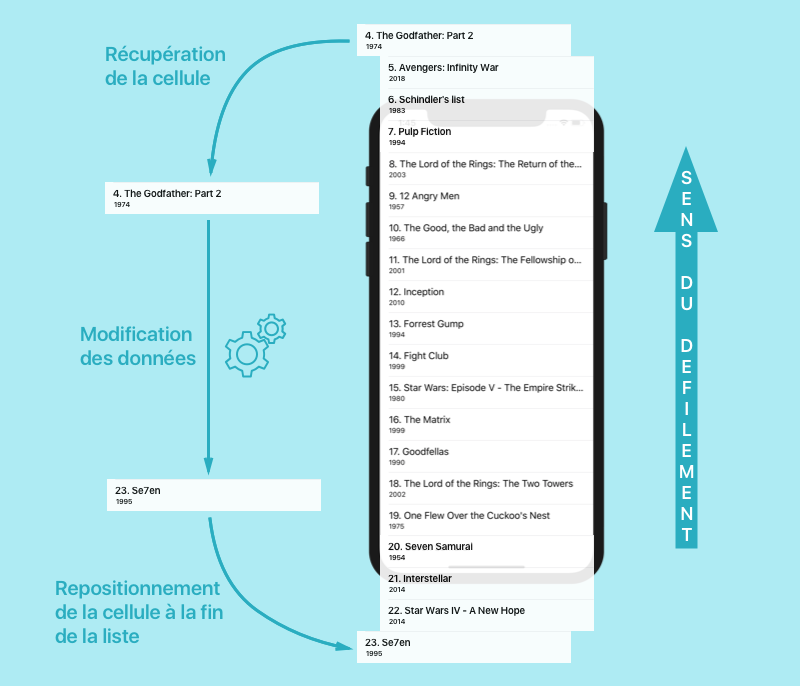

> **:information_source:** Pour information, cette liste est une [liste des films les mieux notés sur IMDB](https://www.imdb.com/search/title?groups=top_250&sort=user_rating).

Il faut donc bien que vous reteniez qu'une Table View n'est pas infinie ! Elle ne possède que quelques cellules dont le contenu est modifié et réutilisé dès qu'elles quittent l'écran.

> **:warning:** Bien sûr, si le défilement a lieu vers le bas, le cycle présent dans le schéma ci-dessus est inversé.

#### Un cousin de Table View
Je voudrais juste faire un petit aparté pour vous mentionner un cousin de Table View qui pourrait vous être utile. Il s'agit de `UICollectionView`.

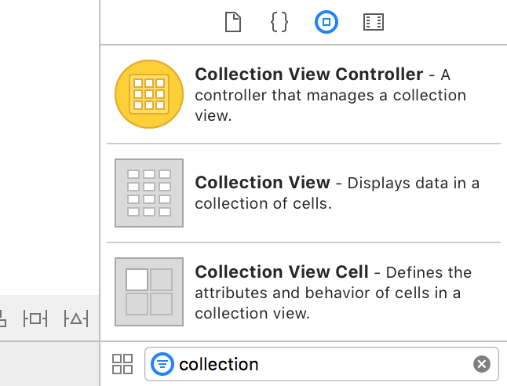

**Les Collection View sont des objets de l'interface qui permettent d'afficher des grilles**. Par exemple, l'application Photos de l'iPhone utilise les Collection View pour afficher la grille de photos.

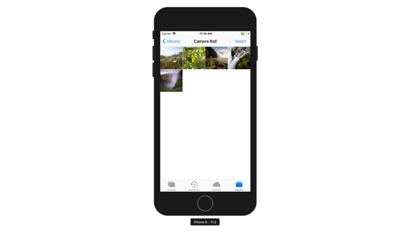

> **:information_source:** Nous ne verrons pas Collection View ensemble, car je pense que c'est très similaire à Table View. Donc si vous maîtrisez le premier, vous saurez apprendre à utiliser le second. Je voulais simplement que vous sachiez que cela existe pour pouvoir l'utiliser si vous en rencontrez le besoin.

#### En résumé
- On installe une Table View en la récupérant simplement depuis la bibliothèque des objets.
- La Table View réutilise ses cellules lorsqu'on l'a fait défiler de façon à ne gérer qu'un nombre réduit de cellules. Lorsqu'une cellule quitte l'écran, ses données sont modifiées et elle est repositionnée à l'autre extrémité de la liste.
- Lorsqu'on veut afficher une grille, on utilise plutôt Collection View.

Dans le prochain chapitre, nous allons mettre ensemble nos connaissances sur les protocoles et les Table View pour parler du delegate pattern !

### Appliquez le delegate pattern
Notre Table View est bien installée, mais pour l'instant, elle est complètement vide. Ça ne va pas durer ! Dans ce chapitre, je vais vous présenter le mécanisme qui va nous permettre de la remplir : le delegate pattern !

#### Présentation du delegate pattern

> **:information_source:** J'ai déjà fait une première présentation du delegate pattern dans [un chapitre](https://openclassrooms.com/courses/ajoutez-plusieurs-pages-a-votre-application-ios/remplissez-le-selecteur) d'un autre cours. N'hésitez pas à y jeter un oeil si vous souhaitez voir une approche différente. Ici, je vais plus m'appuyer sur votre compréhension des protocoles.

Commençons par faire un retour sur le MVC. Le MVC, pour l'instant, ça doit ressembler à ceci pour vous.

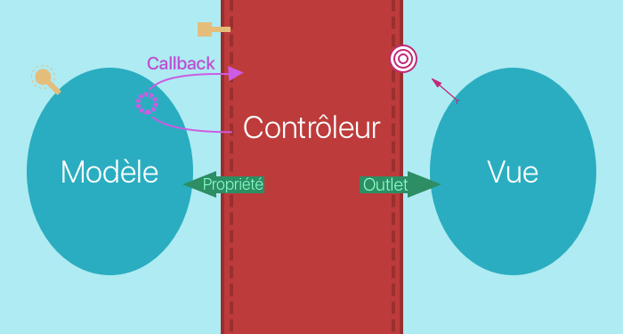

Avec les outlets, le contrôleur peut donner à la vue les données dont elle a besoin pour s'afficher. Cette méthode fonctionne bien, mais a ses limites. Elle ne marche que pour de petites quantités de données.

Or, comme on l'a vu, une liste peut avoir des tonnes de données ! Et on ne va pas tout donner à la vue en lui demandant de se débrouiller avec. **La vue ne doit détenir que les données qui lui permettent de faire l'affichage, car c'est son seul rôle.**

Du coup, la vue va devoir demander régulièrement au contrôleur de lui donner de nouvelles données. À chaque fois que l'on fait défiler la vue, elle va réclamer de nouvelles données au contrôleur.

Et pour cela, elle utilise le delegate pattern. **Le delegate pattern est donc une nouvelle méthode de communication aveugle entre la vue et le contrôleur.** 


Et voici comment cela fonctionne :

1. On crée une liste de questions que la vue peut poser.
2. La vue nomme un objet son delegate, en l'occurrence notre contrôleur.
3. Le contrôleur s'engage à répondre aux questions sur la liste.
4. Le contrôleur répond effectivement aux questions.

#### Delegate pattern et protocoles

Détaillons maintenant ces 4 étapes en rentrant dans le détail du protocole.

##### 1. On crée une liste de questions que la vue peut poser.

La liste de questions est une liste d'exigences en fait. Donc ici on parle de **la création d'un protocole**. Pour `UITableView`, ce protocole se nomme `UITableViewDataSource,` car c'est la source de données.

```swift
protocol UITableViewDataSource {
	func numberOfSections(in tableView: UITableView) -> Int
	func tableView(_ tableView: UITableView, numberOfRowsInSection section: Int) -> Int
	func tableView(_ tableView: UITableView, cellForRowAt indexPath: IndexPath) -> UITableViewCell
	// (...)
}
```

##### 2. La vue nomme un objet son delegate, en l'occurrence notre contrôleur.

`UITableView` a une propriété `dataSource` de type `UITableViewDataSource` :

```swift
class UITableView: UIScrollView {
	var dataSource: UITableViewDataSource?
}
```

Cette propriété est utilisée à l'intérieur de la classe `UITableView` pour appeler les méthodes du protocole au moment ou la Table View en a besoin.

> **:warning:** J'attire votre attention sur le fait qu'à ce stade, **il n'y a pas encore d'implémentations aux méthodes,** mais rien n'empêche de les appeler.

Ensuite, cette propriété prend pour valeur le contrôleur :

```swift
class ViewController: UIViewController {

    override func viewDidLoad() {
        super.viewDidLoad()
        // J'assigne le contrôleur comme valeur de la propriété dataSource.
        tableView.dataSource = self
    }
}
```

##### 3. Le contrôleur s'engage à répondre aux questions sur la liste.

Le contrôleur va ici adopter le protocole `UITableViewDataSource` :

```swift
class ViewController: UIViewController, UITableViewDataSource {
}
```

##### 4. Le contrôleur répond effectivement aux questions.

Le contrôleur implémente les méthodes de `UITableViewDataSource` :

```swift
class ViewController: UIViewController, UITableViewDataSource {
	func numberOfSections(in tableView: UITableView) -> Int {
		return 1
	}
	
	func tableView(_ tableView: UITableView, numberOfRowsInSection section: Int) -> Int {
		return 10
	}
	
	func tableView(_ tableView: UITableView, cellForRowAt indexPath: IndexPath) -> UITableViewCell {
		// (...)
	}
}
```

Vous venez de découvrir un nouveau mode de communication aveugle entre la vue et le contrôleur :


#### Mise en place du dataSource !

Mettons toute cette théorie en application dans notre code. 

> **:information_source:** Dans les 4 étapes présentées précédemment, la première est la création d'un protocole et bien sûr, cette étape est déjà faîte par Apple. Donc nous allons commencer directement par la deuxième !

##### 2. La vue nomme un objet son delegate, en l'occurrence notre contrôleur.

Pour que la tableView nomme le contrôleur son dataSource, on peut faire de notre tableView un outlet de ListViewController et ensuite recopier le code que je vous ai donné au-dessus.

Mais nous allons faire encore plus simple en utilisant le control drag !

Faîtes un control drag dans le storyboard depuis la Table View vers le controller :

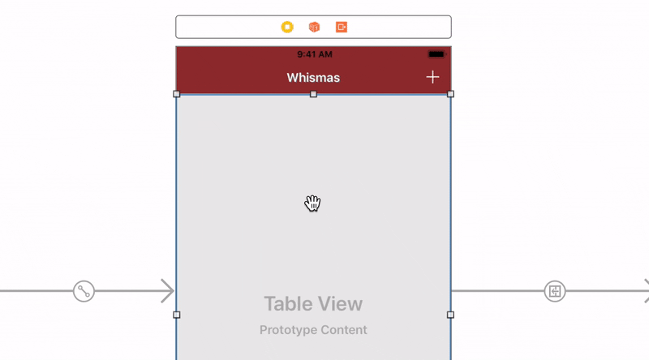

Et voilà, vous venez de nommer votre contrôleur, le dataSource de la Table View.

> **:information_source:** Les autres choix (`delegate` et `prefetchDataSource`) correspondent à deux autres protocoles qui utilisent eux aussi le delegate pattern. On parlera du premier (`delegate`) dans la troisième partie de ce cours.

##### 3. Le contrôleur s'engage à répondre aux questions sur la liste.

Comme on l'a vu à cette étape, nous allons faire adopter le protocole `UITableViewDataSource` à notre contrôleur `ListViewController` :

```swift
class ListViewController: UIViewController, UITableViewDataSource {}
```  

Lorsque vous faites adopter un protocole à une classe, je vous suggère d'utiliser une extension par protocole, donc on va légèrement modifier notre code comme ceci :

```swift
class ListViewController: UIViewController {}

extension ListViewController: UITableViewDataSource {}
``` 

> **:information_source:** Besoin d'un rappel, sur les extensions ? C'est [par ici](https://openclassrooms.com/courses/ajoutez-plusieurs-pages-a-votre-application-ios/allez-plus-loin-avec-les-extensions) !

##### 4. Le contrôleur répond effectivement aux questions.

Ensuite, nous allons implémenter les méthodes du protocole pour nous y conformer correctement. Nous n'allons en implémenter que trois. Car les autres sont optionnels.

> **:information_source:** Eh oui, au passage, sachez que vous pouvez signaler une exigence d'un protocole comme optionnel avec le mot clé optional :
> 
> ```swift
> protocol MonProtocole {
> 	optional func maMethodeOptionnelle()
> 	func maMethodeRequise()
> }
> ``` 

La première méthode que nous allons implémenter s'appelle `numbersOfSection` :

```swift
extension ListViewController: UITableViewDataSource {
	func numberOfSections(in tableView: UITableView) -> Int {
	    return 1
	}
}
```

Cette méthode permet de préciser à la Table View, le nombre de sections dont nous allons avoir besoin. Dans notre cas, nous ne voulons pas séparer notre code selon des sections donc nous allons simplement renvoyer 1 pour avoir une seule section.

La deuxième méthode se nomme `numbersOfRowsInSection` :

```swift
extension ListViewController: UITableViewDataSource {
	// (...)
	
	func tableView(_ tableView: UITableView, numberOfRowsInSection section: Int) -> Int {
	    return ToyService.shared.toys.count
	}
}
```

Elle permet de préciser le nombre de cellules que l'on veut pour chaque section. Dans notre cas, on veut autant de cellules que nous avons d'éléments dans notre tableau de jouet `toys`.

La troisième méthode va nous permettre de préciser le contenu de chaque cellule, mais je vous propose que l'on voie ça ensemble dans le prochain chapitre !

#### En résumé
- La delegate pattern est une communication aveugle entre la vue et le contrôleur. Elle s'organise en 4 étapes :
	1. On crée une liste de questions que la vue peut poser.
	2. La vue nomme un objet son delegate, en l'occurrence notre contrôleur.
	3. Le contrôleur s'engage à répondre aux questions sur la liste.
	4. Le contrôleur répond effectivement aux questions.
- La liste de questions est en fait un protocole auquel se conforme le contrôleur.
- Dans l'étape 2, on peut utiliser directement le control drag pour nommer le contrôleur le `dataSource`.

> **:information_source:** Dans ce chapitre, nous parlons de l'utilisation du delegate pattern en sautant l'étape 1. Pour comprendre cette mécanique en profondeur, je vous suggère d'essayer de créer un delegate pattern. [Cette vidéo](https://www.youtube.com/watch?v=DBWu6TnhLeY) détaille très bien cela.

Dans le prochain chapitre, nous allons remplir notre Table View en précisant le contenu de nos cellules !

### Remplissez la table view
Nous allons remplir notre Table View en précisant le contenu de nos cellules ! Ces cellules vont afficher les données de chaque jouet donc deux données :

- le nom du jouet
- sa marque

Et pour y parvenir, nous devons commencer par rajouter une cellule. 

#### Ajouter une cellule dans le storyboard
Pour ajouter une cellule, rien de plus simple ! Choisissez `UITableViewCell` dans la bibliothèque des objets :

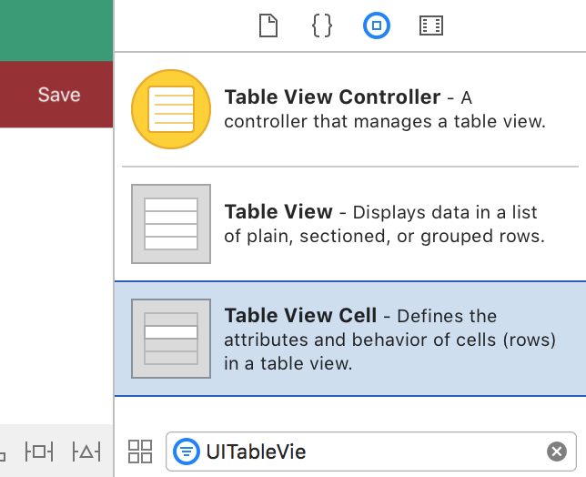

Et glissez la cellule dans votre Table View :

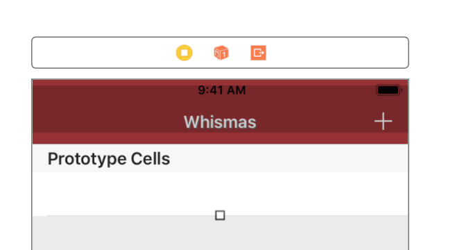

Votre Table View a maintenant une cellule, nous allons pouvoir travailler à partir de là !

> **:question:** Hé ! Mais on en a qu'une seule ! Il va nous en falloir beaucoup plus pour afficher toute une liste !

Hé non ! Souvenez-vous : les cellules sont réutilisées donc ici, on va juste définir le look d'une cellule type et ensuite, on réutilisera cette cellule plusieurs fois.

**Et pour pouvoir la réutiliser, il va falloir lui donner un identifiant.** Sélectionnez la cellule que vous venez de créer et donnez-lui l'identifiant suivant : `ToyCell`.

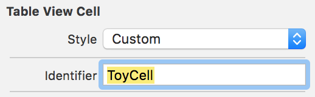

> **:information_source:** Je vous recommande de définir des identifiants qui ont un rapport clair avec le type de données que la cellule va afficher.

#### Le style de notre vue

Notre cellule est bien configurée, maintenant nous allons pouvoir travailler son aspect.

Comme vous pouvez le voir dans l'inspecteur d'attribut, `UITableViewCell` a une propriété `style` qui permet de choisir parmi différents styles :

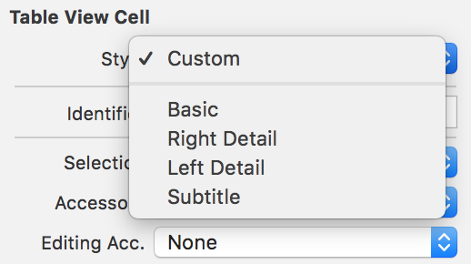

Le style `custom` permet de choisir complètement l'aspect de la cellule. On fera ça dans la prochaine partie. Les 4 autres styles sont des styles prédéfinis que vous pouvez utiliser tels quels.

Le style `Basic` affiche un seul label, les autres en affichent deux selon différentes dispositions que vous pouvez voir ici :

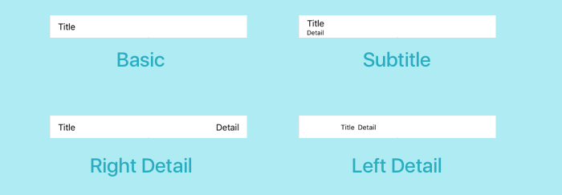

Nous voulons afficher deux informations donc je vous suggère de choisir un style parmi `Right Detail`, `Left Detail` et `Subtitle`.

#### Place aux données !

Maintenant que notre vue est configurée et toute belle, nous allons lui passer des données et cela a lieu dans la troisième méthode de `UITableViewDataSource` que nous n'avons pas encore implémentée. La voici :

```swift
extension ListViewController: UITableViewDataSource {
    // (...)

    func tableView(_ tableView: UITableView, cellForRowAt indexPath: IndexPath) -> UITableViewCell {
    }
}
```

Cette méthode prend en paramètre un `IndexPath`. `IndexPath` est une structure très simple qui a deux propriétés :

- `section` : contient un numéro de section. 
- `row` : contient un numéro de ligne.

Cette méthode renvoie une `UITableViewCell`. Donc le rôle de cette méthode est de construire la cellule qui va être affichée à la position précisée par `IndexPath`.

Implémentons cette méthode ! On va commencer par créer une cellule :

```swift
func tableView(_ tableView: UITableView, cellForRowAt indexPath: IndexPath) -> UITableViewCell {
    let cell = tableView.dequeueReusableCell(withIdentifier: "ToyCell", for: indexPath)
}
```

La méthode `dequeueReusableCell` de `TableView` permet de récupérer la cellule qui se trouve à la position indiquée par `IndexPath` et qui a l'identifiant indiqué. Cet identifiant permet de récupérer la cellule que nous avons créée dans le storyboard.

Ensuite, nous allons modifier le contenu de cette cellule. Pour cela, il nous faut commencer par récupérer les données correspondant à cette cellule. Nous allons donc récupérer le jouet se trouvant au bon index dans notre tableau `toys` :

```swift
let toy = ToyService.shared.toys[indexPath.row]
```

`indexpath.row` donne la ligne à laquelle se trouve la cellule. Ainsi pour chaque ligne de la liste, on va afficher un jouet différent du tableau `toys`. 

Il ne nous reste plus qu'à afficher ces données dans la cellule. Pour accéder aux deux labels contenus dans les styles par défaut, nous avons deux propriétés : `textLabel` et `detailTextLabel`. Nous allons modifier le texte de ces deux labels :

```swift
cell.textLabel?.text = toy.name
cell.detailTextLabel?.text = toy.brand
```

Je remplis les deux labels avec les données du jouet récupéré dans le tableau. Il ne me reste plus qu'à renvoyer la cellule et la fonction complète donne :

```swift
func tableView(_ tableView: UITableView, cellForRowAt indexPath: IndexPath) -> UITableViewCell {
    let cell = tableView.dequeueReusableCell(withIdentifier: "ToyCell", for: indexPath)

    let toy = ToyService.shared.toys[indexPath.row]

    cell.textLabel?.text = toy.name
    cell.detailTextLabel?.text = toy.brand

    return cell
}
```

#### Charger les données

Le contrôleur répond maintenant à toutes les questions de la Table View. Il ne reste plus qu'une étape : initier le chargement des données dans la Table View.

Pour cela, il nous faut pouvoir accéder à une instance de notre Table View donc je vous propose de créer un Outlet et de le nommer `tableView`.

```swift
class ListViewController: UIViewController {
    @IBOutlet weak var tableView: UITableView!
}
```

Réfléchissons maintenant au moment où nous devons charger les données... L'idéal serait de recharger les données à chaque fois que nous revenons sur la page pour inclure les éventuels ajouts qui auraient pu avoir lieu.

Nous allons donc recharger nos données dans la méthode `viewWillAppear`.

> **:information_source:** Si vous ne comprenez pourquoi, je vous invite à (re)voir [ce chapitre](https://openclassrooms.com/courses/ajoutez-plusieurs-pages-a-votre-application-ios/analysez-le-cycle-de-vie-du-controleur).

La méthode qui permet de recharger les données s'appelle tout simplement `reloadData` :

```swift
override func viewWillAppear(_ animated: Bool) {
    super.viewWillAppear(animated)
    tableView.reloadData()
}
```

Et voilà ! Notre TableView va maintenant charger ses données à chaque fois que nous revenons sur la page. 

Cette Table View est officiellement fonctionnelle ! Vous pouvez tester en lançant le simulateur et en ajoutant quelques données.

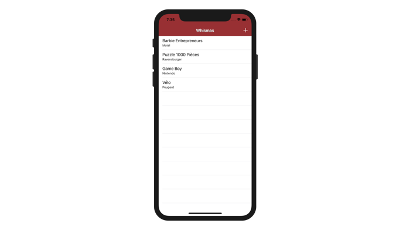

#### En résumé
- On peut rajouter une cellule en la faisant glisser depuis la bibliothèque des objets vers la Table View.
- Il faut configurer la cellule dans le storyboard en lui donnant un identifiant unique.
- On peut choisir parmi 4 styles par défaut pour les cellules.
- On précise le contenu de la cellule avec la méthode `cellForRowAt` du protocole `UITableViewDataSource`.
- On lance le chargement des données avec la méthode reloadData de `UITableView`.

Dans la prochaine partie, nous allons ajouter plusieurs fonctionnalités à notre application : la gestion de plusieurs catégories, la possibilité de supprimer des messages, la création de cellules customisées et bien d'autres !

Et au passage, vous allez approfondir votre compréhension des Table View et des protocoles.

À tout de suite !