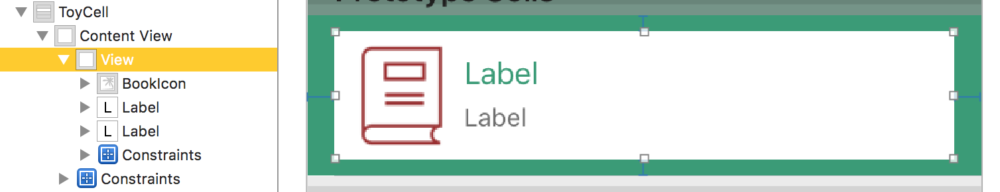

## Améliorez la Table View

### Gérez des collections hétérogènes avec les protocoles

Bienvenue dans cette troisième partie ! Dans cette partie, nous allons améliorer les fonctionnalités de notre Table View. Et dans ce chapitre, nous allons commencer par l'ajout de plusieurs catégories de cadeaux.

> **:information_source:** Pour cela, j'ai un petit peu amélioré l'application pour vous faire gagner du temps. Je vous invite à télécharger le projet revisité [ici](https://s3-eu-west-1.amazonaws.com/static.oc-static.com/prod/courses/files/Parcours+DA+iOS/Cours+9+-+Table+View/Whishmas+-+Part+3+Starter.zip).

#### Quoi de neuf ?

Je vous propose de prendre quelques minutes pour parcourir les petits changements que j'ai apporté au projet pour que vous ne soyez pas perdus pour la suite.

La principale modification est l'ajout de la possibilité de pouvoir créer des objets dans la liste **de trois catégories différentes** :

- Voyage (*Trip*)
- Livre (*Book*)
- Jouet (*Toy*)

Pour cela, j'ai ajouté une pages qui permet de choisir la catégorie et qui redirige vers trois pages différentes, une pour chaque catégorie d'objet à créer.

Voilà ce que ça donne dans le détail :

##### Vue

Dans le fichier `Main.storyboard`, vous pouvez voir les nouvelles interfaces que je viens de mentionner. Il n'y a rien de très compliqué ici.


#### Modèle
J'ai ajouté dans le modèle deux autres structures pour nos nouvelles catégories `Trip` et `Book`. 

```swift
//  Trip.swift
struct Trip {
    var departure = ""
    var destination = ""
    var durationInDays = 0
}

//  Book.swift
struct Book {
    var title = ""
    var author = ""
}

```

> **:information_source:** `Toy` et `ToyService` n'ont pas changé.

#### Contrôleur
1/ `ListViewController` a à peine changé. J'ai juste rajouté une méthode pour avoir un *unwind segue*.

```swift
@IBAction func unwindToListVC(segue: UIStoryboardSegue) {}
```

> **:information_source:** Besoin d'un rappel sur les *unwind segue* ? C'est par [là](https://openclassrooms.com/courses/ajoutez-plusieurs-pages-a-votre-application-ios/revenez-en-arriere#/id/r-5063654) !

2/ Dans le même esprit, j'ai à peine changé le code `ToyViewController`, maintenant il utilise directement l'unwind segue pour revenir directement à la liste lors de l'appui sur le bouton `save` :

```swift
@IBAction func save() {
	// (...)

    performSegue(withIdentifier: "toyToListUnwind", sender: nil)
}
```

3/ J'ai rajouté deux contrôleurs `TripViewController` et `BookViewController` qui permettent respectivement de gérer les pages de création d'un objet `Trip` et `Book`. Ils sont extrêmement similaires à `ToyViewController`.

La seule grosse différence, c'est que je n'ai pas su comment ajouter des `Book` ou des `Trip` à notre liste car ils ne sont pas du type `Toy`. Donc nous allons faire ça ensemble.

4/ Enfin, par acquis de conscience, j'ai ajouté un `CategoryViewController` mais qui est vide car tout la navigation est faite dans le storyboard directement. 

#### Une liste hétérogène

Maintenant que nous avons notre projet bien en main, attaquons la suite ! Notre objectif est de rajouter dans la liste nos objets `Trip` et `Book` qui pour l'instant ne sont pas gérés. 

Le problème, c'est qu'il faut donc créer un tableau avec trois types différents : `Toy`, `Book` et `Trip`. Et comme vous le savez, ce n'est pas possible... sauf si vous avez bien suivi la partie 1 de ce cours !

> **:question:** On va utiliser les protocoles !

Bien ! Je vois que certains suivent... ou font semblant ;) ! Nous allons en effet utiliser les protocoles.

Nous allons créer un protocole `Present` qui va nous permettre de regrouper nos trois types d'objets derrière un même type.

> **:information_source:** Je vous invite à faire ça dans un fichier `Present.swift` à part.

```swift
protocol Present {}
```

Pour l'instant, nous n'avons pas besoin de préciser les exigences de ce protocole, on veut juste un type.

Maintenant, nous allons faire adopter le protocole à nos trois types :

```swift
// Trip.swift
extension Trip: Present {}

// Book.swift
extension Book: Present {}

// Toy.swift
extension Toy: Present {}
```

> **:information_source:** Comme d'habitude, dès que j'adopte un protocole, je prends le réflexe de le faire avec une extension pour avoir une organisation claire de mon code.

Désormais, nos trois types adoptent `Present` et donc peuvent être regroupés derrière ce nouveau type.

Nous pouvons maintenant modifier notre classe `ToyService` pour utiliser `Present` :

```swift
// AVANT
class ToyService {
    static let shared = ToyService()
    private init() {}

    private(set) var toys = [Toy]()

    func add(toy: Toy) {
        toys.append(toy)
    }
}

// APRÈS
class PresentService {
    static let shared = PresentService()
    private init() {}

    private(set) var presents = [Present]()

    func add(present: Present) {
        presents.append(present)
    }
}
```

Ma liste est maintenant une liste de cadeaux (`presents`) et non de jouets. Et pour être cohérent, j'ai décidé de modifier le nom de ma classe en `PresentService`.

> **:information_source:** Lorsque vous modifiez le nom d'une classe, pensez à modifier le nom du fichier correspondant.

Nous allons maintenant utiliser cette classe dans nos trois contrôleurs d'ajout d'objets.

```swift
//  TripViewController.swift
@IBAction func save() {
	// (...)
    let trip = Trip(departure: departure, destination: destination, durationInDays: Int(daysStepper.value))
    PresentService.shared.add(present: trip)
	// (...)
}

//  BookViewController.swift
@IBAction func save() {
	// (...)
    let book = Book(title: title, author: author)
    PresentService.shared.add(present: book)
	// (...)
}

//  ToyViewController.swift
@IBAction func save() {
	// (...)
	let toy = Toy(name: name, brand: brand)
	PresentService.shared.add(present: toy)
	// (...)
}
```

Et voilà ! Nous avons réussi à remplir notre liste avec des objets de types différents en utilisant un protocole !

#### Ajouter des exigences

> **:question:** Hé mais j'ai des erreurs dans mon code !
> 
> 

Ah oui... J'ai oublié `ListViewController`. [La boulette](https://www.youtube.com/watch?v=au0ZMqyoWwg) ! Cette classe utilise toujours `ToyService` que nous venons de remplacer par `PresentService`.

Ce n'est pas grave, ce n'est qu'un petit changement rapide, faisons le !

```swift
func tableView(_ tableView: UITableView, numberOfRowsInSection section: Int) -> Int {
    return PresentService.shared.presents.count
}

func tableView(_ tableView: UITableView, cellForRowAt indexPath: IndexPath) -> UITableViewCell {
    let cell = tableView.dequeueReusableCell(withIdentifier: "ToyCell", for: indexPath)

    let present = PresentService.shared.presents[indexPath.row]

    cell.textLabel?.text = present.name
    cell.detailTextLabel?.text = present.brand

    return cell
}
```

> **:question:** Mais j'ai encore des erreurs ! 
> 
> 

Décidément, je ne suis pas réveillé... En effet, notre type `Present` n'a pas de propriété `name` ou `brand`. Il n'a d'ailleurs pas de propriété du tout. Or on va en avoir besoin pour remplir notre cellule.

On va donc rajouter deux propriétés à notre protocole `Present` :

```swift
protocol Present {
    var description: String { get }
    var detail: String { get }
}
``` 

Ces deux propriétés vont nous permettre d'afficher deux informations sur chaque label de notre cellule :

```swift
cell.textLabel?.text = present.description
cell.detailTextLabel?.text = detail
```

Et avant que vous me tombiez dessus avec de nouvelles erreurs, j'anticipe ;) : maintenant que nous avons rajouté des exigences à notre Protocole, il faut que nos trois objets s'y conforment.

L'objectif ici est de répondre à la question : que veut dire `description` et `detail` pour `Trip`, `Book` et `Toy` ?

```swift
//  Trip.swift
extension Trip: Present {
    var description: String {
        return departure + " - " + destination
    }
    var detail: String {
        return "\(durationInDays) Days"
    }
}

//  Book.swift
extension Book: Present {
    var description: String {
        return title
    }
    var detail: String {
        return author
    }
}

//  Toy.swift
extension Toy: Present {
    var description: String {
        return name
    }
    var detail: String {
        return brand
    }
}
```

PAUSE ! Il faut admirer ce que vous venez de faire. **Vous avez créé ce qu'on appelle une interface**. Votre Table View peut maintenant manipuler un objet `Present` qui a deux propriétés très claires alors qu'en fait, se cachent derrière trois types qui ont des propriétés très différentes les unes des autres. `Present` est donc bien une interface entre les trois types d'un côté et `ListViewController` de l'autre.


Cette méthode est extrêment utile pour supprimer la dépendance d'une classe envers une autre. Ici, `ListViewController` ne connaît même pas l'existence de `Trip`, `Book` et `Toy` car il n'en a pas besoin. Il n'a accès qu'au minimum d'informations que lui fournit `Present`.

#### En résumé
- Les protocoles permettent de gérer des collections de types hétérogènes.
- Les protocoles permettent de créer des interfaces qui peuvent uniformiser des types diversifiés afin de rendre leur utilisation plus simple et d'en supprimer la dépendance.

Dans le prochain chapitre, nous allons sortir nos pinceaux pour magnifier nos cellules qui pour l'instant gâchent un peu la beauté de notre interface !

### Créez une cellule customisée
Dans ce chapitre, nous allons modifier l'aspect de nos cellules pour qu'elles soient plus belles. L'objectif est le suivant :


Vous allez voir que ces celulles sont particulièrement flexibles et c'est ce qui fait une bonne partie de la puissance des Table View. Vous allez donc la plupart du temps travailler avec des cellules de votre création.

#### Design dans le storyboard

Nous allons commencer par revoir le design directement dans le storyboard. 

##### Couleur de fond

Démarrons avec la couleur de fond de notre Table View. Choisissez la Table View et modifier la couleur de fond dans l'inspecteur d'attributs (comme d'habitude dans la section *View*).


##### Séparateurs

Notre nouveau design nous permet de nous passer des séparateurs proposés par défaut dans une Table View, je vous suggère de supprimer ces séparateurs. Pour cela, sélectionnez la Table View et passer le paramètre *Separator* à *None* dans l'inspecteur d'attributs. 


##### Taille de la cellule

Nous allons maintenant agrandir la taille de la cellule. Pour cela, sélectionnez la cellule et rendez-vous dans l'inspecteur de taille. Vous pouvez passer le paramètre *Row Height* à 90 :


##### Couleur de fond de la cellule

Comme vous pouvez le voir dans la hiérchie des vues, la cellule a une Content View. C'est cette view qui, comme son nom l'indique, *contient* l'ensemble des vues qui seront affichées dans la cellule.


Cette vue est simplement de type `UIView`. Je vous invite à changer sa couleur à pour qu'elle soit verte et se fondent avec la couleur de fond de la Table View. Cela va nous permettre de voir le fond vert de la Table View et obtenir l'effet désiré.

##### Contenu de la celulle
Ça y est ! Nous allons nous attaquer au design de la cellule en elle-même. Pour cela, il faut d'abord changer le style de la vue à custom dans l'inspecteur d'attribut. 


Regardons un peu le résultat que l'on souhaite obtenir :


Il y a donc 4 vues :

- Une vue blanche avec un effet ombrée qui ne prends pas tout à fait tout le contenu de la cellule.
- Une icône qui dépends de la catégorie de l'élément.
- Un label de titre
- Un label de détail

Je vous invite à rajouter tout cela dans la cellule et à créer les contraintes nécessaires. Il n'y a rien de particulier ici. Voici ce que ça donne pour moi :



#### Création d'une sous-classe
Maintenant que notre cellule est toute belle, il va falloir l'utiliser ! Pour cela, il faut que l'on puisse modifier les labels et l'image que nous avons ajoutés manuellement dans la cellule.

Le problème, c'est que `UITableViewCell` ne connaît pas ces vues que nous avons ajoutées.

Alors comment faire ? La solution est simple, nous allons créer une sous-classe de `UITableViewCell` et lui ajouter nos vues sous forme de propriétés.

##### Création de la classe
Créez un nouveau fichier <keyboard>cmd + n<keyboard> et choisissez *Cocoa Touch Class* :


Ensuite choisissez de créer une sous-classe de `UITableViewCell`. Puis nommez la `PresentTableViewCell` (car elle va servir à afficher des cadeaux) :


Et enregistrez le fichier dans votre dossier `View`. Vous devriez obtenir un fichier `PresentTableViewCell.swift` qui contient ceci :

```swift
import UIKit

class PresentTableViewCell: UITableViewCell {
    override func awakeFromNib() {
        super.awakeFromNib()
        // Initialization code
    }

    override func setSelected(_ selected: Bool, animated: Bool) {
        super.setSelected(selected, animated: animated)

        // Configure the view for the selected state
    }
}
```

Dans ce fichier, on vous propose de faire l'override de deux méthodes de `UITableViewCell` :

- `awakeFromNib` : cette méthode est utilisée lorsqu'une vue est initialisée depuis un storyboard. C'est ici que vous pouvez customiser votre cellule. Par exemple, dans notre cas, nous allons rajouter une ombre sur notre vue blanche.
- `setSelected` : cette méthode vous permettra de modifier l'aspect selon l'état de la vue : sélectionnée ou non. Nous n'en auront pas besoin, donc vous pouvez supprimer cette méthode.

> **:information_source:** Dans ce cours, on n'abordera pas la sélection d'une cellule mais vous devez savoir qu'une cellule peut être sélectionnée dans une Table View. Par exemple dans une liste d'emails, vous pouvez sélectionner l'un d'entre eux pour accéder à l'email complet. Si vous voulez apprendre à gérer la sélection d'une cellule, je vous recommande [ce tutoriel rapide](https://www.simplifiedios.net/ios-tableview-tutorial-handling-clicks/).

##### Connection avec le storyboard
Maintenant, il nous faut modifier le type de notre cellule pour lui dire que désormais elle utilise le type `PresentTableViewCell`. Pour cela, sélectionnez la cellule dans le storyboard, allez dans l'inspecteur d'identité et modifiez sa classe :


> **:information_source:** Pour être cohérent, je vous suggère de modifier aussi son identifiant dans l'inspecteur d'attributs.
>  
> 
> 
> N'oubliez de reporter la modification dans votre code :
> 
> ```swift
> let cell = tableView.dequeueReusableCell(withIdentifier: "PresentCell", for: indexPath)
> ```

Nous allons maintenant connecter les différentes vues de notre cellule à notre nouvelle classe pour pouvoir les modifier comme nous le souhaitons. Pour cela, il suffit de créer des outlets entre les vues et notre classe. Vous savez faire, voici à quoi doit ressembler notre classe ensuite :

```swift
class PresentTableViewCell: UITableViewCell {
    @IBOutlet weak var iconView: UIImageView!
    @IBOutlet weak var titleLabel: UILabel!
    @IBOutlet weak var subtitleLabel: UILabel!
    @IBOutlet weak var whiteView: UIView!

    override func awakeFromNib() {
        super.awakeFromNib()
    }
}
```

##### Implémentation de la classe

Maintenant que notre classe est connectée, nous allons l'implémenter ! Je vous propose de commencer par rajouter notre petite ombre :

```swift
override func awakeFromNib() {
    super.awakeFromNib()
    addShadow()
}

private func addShadow() {
    whiteView.layer.shadowColor = UIColor(red: 0, green: 0, blue: 0, alpha: 0.7).cgColor
    whiteView.layer.shadowRadius = 2.0
    whiteView.layer.shadowOffset = CGSize(width: 2.0, height: 2.0)
    whiteView.layer.shadowOpacity = 2.0
}
```

> **:information_source:** Si vous ne comprenez pas ce morceau, ce n'est pas le plus important. Il permet juste de rajouter une ombre à notre vue blanche. Je vous suggère [ce tutoriel](https://spin.atomicobject.com/2017/07/18/swift-interface-builder/) qui vous montre comment ajouter vos ombres directement dans le storyboard.

Maintenant que ce petit détail de design est réglé, nous allons pouvoir configurer notre cellule. L'objectif ici est de créer une méthode que nous pourrons utiliser dans notre contrôleur pour configurer le contenu de notre cellule. Il faut configurer trois choses :

- le texte de nos deux labels
- l'icône que nous voulons afficher

Pour cela, nous allons créer la méthode `configure` suivante :

```swift
func configure(withIcon: String, title: String, subtitle: String) {
    iconView.image = UIImage(named: icon)
    titleLabel.text = title
    subtitleLabel.text = subtitle
}
```

Et voilà notre cellule customisée est tout prête ! Il ne nous reste plus qu'à l'utiliser dans le contrôleur.

#### Utilisation de PresentTableViewCell dans le contrôleur      

Nous allons modifier notre méthode `cellForRow` qui pour l'instant ressemble à ceci :

```swift
func tableView(_ tableView: UITableView, cellForRowAt indexPath: IndexPath) -> UITableViewCell {
    let cell = tableView.dequeueReusableCell(withIdentifier: "PresentCell", for: indexPath)

    let present = PresentService.shared.presents[indexPath.row]

    cell.textLabel?.text = present.description
    cell.detailTextLabel?.text = present.detail

    return cell
}
```

Pour commencer, nous allons vérifier que notre cellule est bien du type `PresentTableViewCell`:

```swift
guard let cell = tableView.dequeueReusableCell(withIdentifier: "PresentCell", for: indexPath) as? PresentTableViewCell else {
    return UITableViewCell()
}
```

Si ce n'est pas le cas, on renvoie une cellule standard.

Maintenant qu'on sait qu'on à affaire à une `PresentTableViewCell`, on va pouvoir utiliser notre méthode `configure` :

```swift
let present = PresentService.shared.presents[indexPath.row]
cell.configure(withIcon: "A FAIRE", title: present.description, subtitle: present.detail)
```

Vous noterez ici que je ne me suis pas encore occupé de l'icône. Le problème, c'est que notre protocole `Present` n'a pas de propriété `icon` qui contiendrait le nom d'une image.

Nous allons régler ça tout de suite :

```swift
protocol Present {
    var description: String { get }
    var detail: String { get }
    var icon: String { get }
}
```

Il faut maintenant que nos trois types `Trip`, `Book` et `Toy` se conforment à cette nouvelle exigence. Pour cela, vous pouvez remarquez dans les assets du projet que j'ai rajouté pour vous trois images nommées respectivement `TripIcon`, `BookIcon` et `ToyIcon`.

C'est ce que nous allons utiliser :

```swift
extension Trip: Present {
	// (...)
    var icon: String { return "TripIcon" }
}

extension Book: Present {
	// (...)
    var icon: String { return "BookIcon" }
}

extension Toy: Present {
	// (...)
    var icon: String { return "ToyIcon" }
}
```

Et maintenant nous pouvons finaliser notre méthode `configure` :

```swift
cell.configure(withIcon: present.icon, title: present.description, subtitle: present.detail)
```

Et voilà ! Nous avons maintenant une cellule toute belle ! Je vous invite à lancer votre application dans le simulateur et admirer le résultat.


#### En résumé
Pour créer une cellule customisée, vous devez :

- Designez votre cellule dans le storyboard.
- Créer une sous-classe de `UITableViewCell`.
- Connecter cette sous-classe à votre cellule dans le storyboard.
- Créer les outlets dont vous avez besoin.
- Créer une méthode qui vous permettre de configurer facilement votre cellule.
- Utiliser votre nouvelle classe et sa méthode de configuration dans votre contrôleur.

Dans le prochain chapitre, nous allons apprendre à supprimer des éléments de votre liste.

### Supprimez une cellule
Section 1 : Ajout de la méthode      
Section 2 : Test sur l’iPhone       

### Réutilisez vos animations avec les protocoles
Section 1 : Création du protocole      
Section 2 : Explication de l’extension de protocole      
Section 3 : La vue adopte le protocole    
